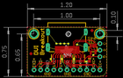
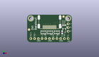
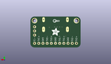
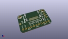

Contents
========

* [PROJ-ADAF-4984-STAN-01>Adafruit DVI Breakout Board PCB](#proj-adaf-4984-stan-01adafruit-dvi-breakout-board-pcb)
	* [Images](#images)
	* [Interactive BOM](#interactive-bom)
	* [OOMP Parts](#oomp-parts)
	* [Tags](#tags)
  
![][im]
# PROJ-ADAF-4984-STAN-01>Adafruit DVI Breakout Board PCB

- ID: PROJ-ADAF-4984-STAN-01
- Hex ID: PRA4984
- Name: Adafruit DVI Breakout Board PCB
- Description: 

## Images
  
  

|eagleImage|kicadPcb3dFront|kicadPcb3dBack|kicadPcb3d|
| :---: | :---: | :---: | :---: |
|||||

## Interactive BOM

- Interactive BOM page: [ibom.html](kicad/bom/ibom.html)

## OOMP Parts
  

|OOMP Parts|
| :---: |
|CAPC-0603-X-UNMATCHED-01, C1, 23.875999999999998, 6.858, 270,C1, 1uF, 0603-NO, microbuilder, (0.94, 0.27), R270|
|<table><tr><td></td><td> JP1</td><td>[HEAD-I01-X-PI03-01 2.54 mm 3 Pin Header](https://github.com/oomlout/oomlout_OOMP_parts/tree/main/HEAD-I01-X-PI03-01/)</td><td>[H03](https://github.com/oomlout/oomlout_OOMP_parts/tree/main/HEAD-I01-X-PI03-01/)</td></tr></table>|
|HEAD-I01-X-PI11-01, JP3, 15.239999999999998, 2.54, 180,JP3, 1X11_ROUND, microbuilder, (0.6, 0.1), R180|
|RESE-UNMATCHED-X-O103-01, R1, 20.193, 6.858, 180,R1, 10K, RESPACK_4X0603, microbuilder, (0.795, 0.27), R180|
|RESE-UNMATCHED-X-O221-01, R2, 11.176, 6.858, 180,R2, 220, RESPACK_4X0603, microbuilder, (0.44, 0.27), R180|
|RESE-UNMATCHED-X-O221-01, R5, 15.620999999999999, 6.858, 180,R5, 220, RESPACK_4X0603, microbuilder, (0.615, 0.27), R180|
|UNMATCHED-UNMATCHED-X-UNMATCHED-01, U2, 25.273, 10.540999999999999, 180,U2, 24LC02BT-I/OT, SOT23-5, microbuilder, (0.995, 0.415), R180|
|UNMATCHED-UNMATCHED-X-UNMATCHED-01, X1, 15.239999999999998, 10.413999999999998, 180,X1, 47151-0001, HDMI_MOLEX_47151-0001, adafruit_electromech, (0.6, 0.41), R180|

## Tags

- hexID: PRA4984
- oompType: PROJ
- oompSize: ADAF
- oompColor: 4984
- oompDesc: STAN
- oompIndex: 01
- oompName: Adafruit DVI Breakout Board PCB
- sources: All source files from https://github.com/adafruit/Adafruit-DVI-Breakout-Board-PCB (source licence details in srcLicense.md)
- linkBuyPage: http://www.adafruit.com/products/4984
- oompID: PROJ-ADAF-4984-STAN-01
- oompPart: CAPC-0603-X-UNMATCHED-01, C1, 23.875999999999998, 6.858, 270
- oompPart: SKIP-UNMATCHED-X-UNMATCHED-01, FID1, 24.764999999999997, 17.779999999999998, 270
- oompPart: SKIP-UNMATCHED-X-UNMATCHED-01, FID2, 1.27, 8.762999999999998, 270
- oompPart: HEAD-I01-X-PI03-01, JP1, 27.94, 10.16, 90
- oompPart: HEAD-I01-X-PI11-01, JP3, 15.239999999999998, 2.54, 180
- oompPart: RESE-UNMATCHED-X-O103-01, R1, 20.193, 6.858, 180
- oompPart: RESE-UNMATCHED-X-O221-01, R2, 11.176, 6.858, 180
- oompPart: RESE-UNMATCHED-X-O221-01, R5, 15.620999999999999, 6.858, 180
- oompPart: SKIP-UNMATCHED-X-UNMATCHED-01, U$32, 2.54, 16.509999999999998, 180
- oompPart: SKIP-UNMATCHED-X-UNMATCHED-01, U$33, 27.94, 16.509999999999998, 180
- oompPart: UNMATCHED-UNMATCHED-X-UNMATCHED-01, U2, 25.273, 10.540999999999999, 180
- oompPart: UNMATCHED-UNMATCHED-X-UNMATCHED-01, X1, 15.239999999999998, 10.413999999999998, 180
- rawPart: C1, 1uF, 0603-NO, microbuilder, (0.94, 0.27), R270
- rawPart: FID1, FIDUCIAL_1MM, FIDUCIAL_1MM, microbuilder, (0.975, 0.7), R270
- rawPart: FID2, FIDUCIAL_1MM, FIDUCIAL_1MM, microbuilder, (0.05, 0.345), R270
- rawPart: JP1, 1X03_ROUND, microbuilder, (1.1, 0.4), R90
- rawPart: JP3, 1X11_ROUND, microbuilder, (0.6, 0.1), R180
- rawPart: R1, 10K, RESPACK_4X0603, microbuilder, (0.795, 0.27), R180
- rawPart: R2, 220, RESPACK_4X0603, microbuilder, (0.44, 0.27), R180
- rawPart: R5, 220, RESPACK_4X0603, microbuilder, (0.615, 0.27), R180
- rawPart: U$32, MOUNTINGHOLE2.5, MOUNTINGHOLE_2.5_PLATED, microbuilder, (0.1, 0.65), R180
- rawPart: U$33, MOUNTINGHOLE2.5, MOUNTINGHOLE_2.5_PLATED, microbuilder, (1.1, 0.65), R180
- rawPart: U2, 24LC02BT-I/OT, SOT23-5, microbuilder, (0.995, 0.415), R180
- rawPart: X1, 47151-0001, HDMI_MOLEX_47151-0001, adafruit_electromech, (0.6, 0.41), R180

[im]: kicadPcb3d_450.png
