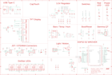

Contents
========

* [PRA4985 > Adafruit](#pra4985--adafruit)
	* [Schematic](#schematic)
	* [Interactive BOM](#interactive-bom)
	* [OOMP Parts](#oomp-parts)
	* [Images](#images)
	* [Tags](#tags)
  
![][im]
# PRA4985 > Adafruit

- ID: PROJ-ADAF-4985-STAN-01
- Hex ID: PRA4985
- Name: Adafruit
- Description: Adafruit
- Long Link: [http://oom.lt/PROJ-ADAF-4985-STAN-01](http://oom.lt/PROJ-ADAF-4985-STAN-01)
- Short Link: [http://oom.lt/PRA4985](http://oom.lt/PRA4985)

## Schematic
  

## Interactive BOM

- Interactive BOM page: [ibom.html](https://htmlpreview.github.io/?https://github.com/oomlout/oomlout_OOMP_projects/blob/main/PROJ-ADAF-4985-STAN-01/kicad/bom/ibom.html)

## OOMP Parts
  

|OOMP Parts|
| :---: |
|C1,CAPC-0805-X-UF10-V10,C1,10uF,CAP_CERAMIC0805-NOOUTLINE,0805-NO,Ceramic Capacitors,,,,,,,,,|
|C2,CAPC-0603-X-NF100-V50,C2,0.1uF,CAP_CERAMIC0603_NO,0603-NO,Ceramic Capacitors,,,,,,,,,|
|C3,CAPC-0805-X-UNMATCHED-01,C3,10µF,CAP_CERAMIC0805-NOOUTLINE,0805-NO,Ceramic Capacitors,,,,,,,,,|
|C4,CAPC-0805-X-UNMATCHED-01,C4,10µF,CAP_CERAMIC0805-NOOUTLINE,0805-NO,Ceramic Capacitors,,,,,,,,,|
|C5,CAPC-0603-X-NF100-V50,C5,0.1uF,CAP_CERAMIC0603_NO,0603-NO,Ceramic Capacitors,,,,,,,,,|
|C6,CAPC-0603-X-UF1-01,C6,1uF,CAP_CERAMIC0603_NO,0603-NO,Ceramic Capacitors,,,,,,,,,|
|C7,CAPC-0805-X-UNMATCHED-01,C7,10µF,CAP_CERAMIC0805-NOOUTLINE,0805-NO,Ceramic Capacitors,,,,,,,,,|
|C9,CAPC-UNMATCHED-X-UNMATCHED-01,C9,10uF/10V+,CAP_CERAMIC0805_10MGAP,0805_10MGAP,Ceramic Capacitors,,,,,,,,,|
|C10,CAPC-0805-X-UNMATCHED-01,C10,10µF,CAP_CERAMIC0805-NOOUTLINE,0805-NO,Ceramic Capacitors,,,,,,,,,|
|C11,CAPC-0805-X-UNMATCHED-01,C11,10µF,CAP_CERAMIC0805-NOOUTLINE,0805-NO,Ceramic Capacitors,,,,,,,,,|
|C12,CAPC-0603-X-UF1-01,C12,1uF,CAP_CERAMIC0603_NO,0603-NO,Ceramic Capacitors,,,,,,,,,|
|C13,CAPC-0805-X-UNMATCHED-01,C13,10µF,CAP_CERAMIC0805-NOOUTLINE,0805-NO,Ceramic Capacitors,,,,,,,,,|
|C14,CAPC-0603-X-UF1-01,C14,1uF,CAP_CERAMIC0603_NO,0603-NO,Ceramic Capacitors,,,,,,,,,|
|C15,CAPC-0603-X-NF100-V50,C15,0.1uF,CAP_CERAMIC0603_NO,0603-NO,Ceramic Capacitors,,,,,,,,,|
|C17,CAPC-0805-X-UNMATCHED-01,C17,10µF,CAP_CERAMIC0805-NOOUTLINE,0805-NO,Ceramic Capacitors,,,,,,,,,|
|C20,CAPC-0805-X-UF10-V10,C20,10uF,CAP_CERAMIC0805-NOOUTLINE,0805-NO,Ceramic Capacitors,,,,,,,,,|
|CONN1,UNMATCHED-UNMATCHED-X-UNMATCHED-01,CONN1,STEMMA_I2C_QT,STEMMA_I2C_QT,JST_SH4,,,,,,,,,,|
|D1,DIOD-S323-X-UNMATCHED-01,D1,3.6V,DIODE-ZENERSOD323,SOD-323,Zener Diode,,,,,,,,,|
|D2,DIOD-S323-X-UNMATCHED-01,D2,3.6V,DIODE-ZENERSOD323,SOD-323,Zener Diode,,,,,,,,,|
|D3,DIOD-S323-X-K4148-01,D3,1N4148,DIODESOD-323F,SOD-323F,Diode,,,,,,,,,|
|D6,DIOD-S323-X-UNMATCHED-01,D6,3.6V,DIODE-ZENERSOD323,SOD-323,Zener Diode,,,,,,,,,|
|DS0,UNMATCHED-UNMATCHED-X-UNMATCHED-01,DS0,APA102-2020,APA1022020,APA102_2020,APA102/DotStar Pixels,,,,,,,,,|
|DS1,UNMATCHED-UNMATCHED-X-UNMATCHED-01,DS1,APA102-2020,APA1022020,APA102_2020,APA102/DotStar Pixels,,,,,,,,,|
|DS2,UNMATCHED-UNMATCHED-X-UNMATCHED-01,DS2,APA102-2020,APA1022020,APA102_2020,APA102/DotStar Pixels,,,,,,,,,|
|DS3,UNMATCHED-UNMATCHED-X-UNMATCHED-01,DS3,APA102-2020,APA1022020,APA102_2020,APA102/DotStar Pixels,,,,,,,,,|
|DS4,UNMATCHED-UNMATCHED-X-UNMATCHED-01,DS4,APA102-2020,APA1022020,APA102_2020,APA102/DotStar Pixels,,,,,,,,,|
|JP1,HEAD-I01-X-UNMATCHED-01,FID1,FIDUCIAL_1MM,FIDUCIAL_1MM,FIDUCIAL_1MM,Fiducial Alignment Points,,EXCLUDE,,,,,,,|
|JP2,HEAD-I01-X-UNMATCHED-01,FID2,FIDUCIAL_1MM,FIDUCIAL_1MM,FIDUCIAL_1MM,Fiducial Alignment Points,,EXCLUDE,,,,,,,|
|L,LEDS-0603-G-STAN-01,FID3,FIDUCIAL_1MM,FIDUCIAL_1MM,FIDUCIAL_1MM,Fiducial Alignment Points,,EXCLUDE,,,,,,,|
|ON,LEDS-0603-G-STAN-01,FID4,FIDUCIAL_1MM,FIDUCIAL_1MM,FIDUCIAL_1MM,Fiducial Alignment Points,,EXCLUDE,,,,,,,|
|Q1,MOSN-SO23-X-KBSS138-01,FID5,FIDUCIAL_1MM,FIDUCIAL_1MM,FIDUCIAL_1MM,Fiducial Alignment Points,,EXCLUDE,,,,,,,|
|Q3,MOSP-SO23-X-UNMATCHED-01,FID6,FIDUCIAL_1MM,FIDUCIAL_1MM,FIDUCIAL_1MM,Fiducial Alignment Points,,EXCLUDE,,,,,,,|
|Q4,MOSN-SO23-X-KBSS138-01,JP1,2x3 SMT,HEADER-2X314113,2X03_SMT_4UCON_14113,PIN HEADER,,,,,,,,,|
|R1,RESE-0603-X-O103-01,JP2,,HEADER-2X3_SMTTHM,2X03_SMTTHM,PIN HEADER,,,,,,,,,|
|R2,RESE-0603-X-O102-01,L,RED,LED0603_NOOUTLINE,CHIPLED_0603_NOOUTLINE,LED,,,,,,,,,|
|R3,RESE-0603-X-UNMATCHED-01,ON,GREEN,LED0603_NOOUTLINE,CHIPLED_0603_NOOUTLINE,LED,,,,,,,,,|
|R4,RESE-0603-X-O103-01,Q1,BSS138,MOSFET-NWIDE,SOT23-WIDE,N-Channel Mosfet,,,,,,,,,|
|R5,RESE-0603-X-O103-01,Q3,DMG3415U-7,MOSFET-P,SOT23-R,P-Channel Mosfet,,,,,,,,,|
|R6,RESE-0603-X-O473-01,Q4,BSS138,MOSFET-NREFLOW,SOT23-R,N-Channel Mosfet,,,,,,,,,|
|R7,RESE-0603-X-O103-01,R1,10K,RESISTOR_0603_NOOUT,0603-NO,Resistors,,,,,,,,,|
|R8,RESE-0603-X-UNMATCHED-01,R2,1K,RESISTOR_0603_NOOUT,0603-NO,Resistors,,,,,,,,,|
|R9,RESE-0603-X-O103-01,R3,5.1K,RESISTOR_0603_NOOUT,0603-NO,Resistors,,,,,,,,,|
|R10,RESE-0603-X-O103-01,R4,10K,RESISTOR_0603_NOOUT,0603-NO,Resistors,,,,,,,,,|
|R11,RESE-0603-X-O101-01,R5,10K,RESISTOR_0603_NOOUT,0603-NO,Resistors,,,,,,,,,|
|R12,RESE-0603-X-O103-01,R6,47K,RESISTOR_0603_NOOUT,0603-NO,Resistors,,,,,,,,,|
|R13,RESE-0603-X-O103-01,R7,10K,RESISTOR_0603_NOOUT,0603-NO,Resistors,,,,,,,,,|
|R14,RESE-0603-X-UNMATCHED-01,R8,5.1K,RESISTOR_0603_NOOUT,0603-NO,Resistors,,,,,,,,,|
|R16,RESE-0603-X-O102-01,R9,10K,RESISTOR_0603_NOOUT,0603-NO,Resistors,,,,,,,,,|
|R17,RESE-0603-X-UNMATCHED-01,R10,10K,RESISTOR_0603_NOOUT,0603-NO,Resistors,,,,,,,,,|
|R18,RESE-0603-X-O102-01,R11,100,RESISTOR_0603_NOOUT,0603-NO,Resistors,,,,,,,,,|
|R20,RESE-0603-X-O103-01,R12,10K,RESISTOR_0603_NOOUT,0603-NO,Resistors,,,,,,,,,|
|SENSE,UNMATCHED-UNMATCHED-X-UNMATCHED-01,R13,10K,RESISTOR_0603_NOOUT,0603-NO,Resistors,,,,,,,,,|
|SENSE1,UNMATCHED-UNMATCHED-X-UNMATCHED-01,R14,1Meg,RESISTOR_0603_NOOUT,0603-NO,Resistors,,,,,,,,,|
|SENSE3,UNMATCHED-UNMATCHED-X-UNMATCHED-01,R16,1K,RESISTOR_0603_NOOUT,0603-NO,Resistors,,,,,,,,,|
|SP1,UNMATCHED-UNMATCHED-X-UNMATCHED-01,R17,1Meg,RESISTOR_0603_NOOUT,0603-NO,Resistors,,,,,,,,,|
|SW2,UNMATCHED-UNMATCHED-X-UNMATCHED-01,R18,1K,RESISTOR_0603_NOOUT,0603-NO,Resistors,,,,,,,,,|
|SW3,UNMATCHED-UNMATCHED-X-UNMATCHED-01,R20,10K,RESISTOR_0603_NOOUT,0603-NO,Resistors,,,,,,,,,|
|SW4,UNMATCHED-UNMATCHED-X-UNMATCHED-01,SENSE,JST PH 3,CON_JST_PH_3PIN,JSTPH3,,,,,,,,,,|
|SW5,UNMATCHED-UNMATCHED-X-UNMATCHED-01,SENSE1,JST PH 3,CON_JST_PH_3PIN,JSTPH3,,,,,,,,,,|
|SW6,UNMATCHED-UNMATCHED-X-UNMATCHED-01,SENSE3,JST PH 3,CON_JST_PH_3PIN,JSTPH3,,,,,,,,,,|
|SW7,UNMATCHED-UNMATCHED-X-UNMATCHED-01,SJ1,,SOLDERJUMPERCLOSED,SOLDERJUMPER_CLOSEDWIRE,SMD Solder JUMPER,,,,,,,,,|
|TFT1,UNMATCHED-UNMATCHED-X-UNMATCHED-01,SJ2,,SOLDERJUMPER_2WAY,SOLDERJUMPER_2WAY_OPEN_NOPASTE,2-Way Solder Jumper,,,,,,,,,|
|TP1,UNMATCHED-UNMATCHED-X-UNMATCHED-01,SP1,7.5mm SPK,SPEAKER_7.5MM,BUZZER_SMT_7.5MM,SPEAKER Source: BuerklinAdded PS12 (for part # PS1240 piezo) http://www.ladyada.net/library/pcb/eaglelibrary.html,,,,,,,,,|
|TP2,UNMATCHED-UNMATCHED-X-UNMATCHED-01,SW2,FSM2JMTR,SWITCH_PUSHBUTTON_3.5X6MM,TACTILE_3X6MM,Buttons,,,,,,,,,|
|TP3,UNMATCHED-UNMATCHED-X-UNMATCHED-01,SW3,EG1390,SWITCH_DPDTEG1390,EG1390,Switch - DPDT,,,,,,,,,|
|TP4,UNMATCHED-UNMATCHED-X-UNMATCHED-01,SW4,SPST_TACT-KMR2,SPST_TACT-KMR2,KMR2,SMT 6mm switch, EVQQ2 series,,,,,,,,,|
|TP5,UNMATCHED-UNMATCHED-X-UNMATCHED-01,SW5,FSM2JMTR,SWITCH_PUSHBUTTON_3.5X6MM,TACTILE_3X6MM,Buttons,,,,,,,,,|
|TP6,UNMATCHED-UNMATCHED-X-UNMATCHED-01,SW6,FSM2JMTR,SWITCH_PUSHBUTTON_3.5X6MM,TACTILE_3X6MM,Buttons,,,,,,,,,|
|TP7,UNMATCHED-UNMATCHED-X-UNMATCHED-01,SW7,FSM2JMTR,SWITCH_PUSHBUTTON_3.5X6MM,TACTILE_3X6MM,Buttons,,,,,,,,,|
|TP8,UNMATCHED-UNMATCHED-X-UNMATCHED-01,TFT1,DISP_TFT_1.54IN_240X240_22P,DISP_TFT_1.54IN_240X240_22P,TFT_1.54IN_240X240_22PIN,,,,,,,,,,|
|U1,UNMATCHED-UNMATCHED-X-UNMATCHED-01,TP1,,TESTPOINTROUND1.5MMNO,TESTPOINT_ROUND_1.5MM_NO,Test Point,,,,,,,,,|
|U2,UNMATCHED-UNMATCHED-X-UNMATCHED-01,TP2,,TESTPOINTROUND1.5MMNO,TESTPOINT_ROUND_1.5MM_NO,Test Point,,,,,,,,,|
|U3,UNMATCHED-UNMATCHED-X-UNMATCHED-01,TP3,,TESTPOINTROUND1.5MMNO,TESTPOINT_ROUND_1.5MM_NO,Test Point,,,,,,,,,|
|U4,VREG-SO235-X-KAP2112K-V33D,TP4,SEWTAP_SMTNUTM3,SEWTAP_SMTNUTM3,SMT_NUT_3MM,,,,,,,,,,|
|U5,UNMATCHED-UNMATCHED-X-UNMATCHED-01,TP5,SEWTAP_SMTNUTM3,SEWTAP_SMTNUTM3,SMT_NUT_3MM,,,,,,,,,,|
|X1,UNMATCHED-UNMATCHED-X-UNMATCHED-01,TP6,,TESTPOINTROUND1.5MMNO,TESTPOINT_ROUND_1.5MM_NO,Test Point,,,,,,,,,|
|X3,UNMATCHED-UNMATCHED-X-UNMATCHED-01,TP7,SEWTAP_SMTNUTM3,SEWTAP_SMTNUTM3,SMT_NUT_3MM,,,,,,,,,,|
|X4,UNMATCHED-UNMATCHED-X-UNMATCHED-01,TP8,SEWTAP_SMTNUTM3,SEWTAP_SMTNUTM3,SMT_NUT_3MM,,,,,,,,,,|
|X5,UNMATCHED-UNMATCHED-X-UNMATCHED-01,U1,DPS3,BMP280_COMBO,BMX280_COMBO,BMP280 - Digital Pressure Sensor,,,,,,,,,|
|X6,UNMATCHED-UNMATCHED-X-UNMATCHED-01,U2,ALS-PT19,PHOTOTRANSISTOR_PT19-315C,ALS-PT19-315C,ALS-PT19-315C - Analog Light Sensor,,,,,,,,,|

## Images
  
  

|kicadPcb3d|kicadPcb3dFront|kicadPcb3dBack|eagleImage|eagleSchemImage|
| :---: | :---: | :---: | :---: | :---: |
||||||

## Tags

- hexID: PRA4985
- oompType: PROJ
- oompSize: ADAF
- oompColor: 4985
- oompDesc: STAN
- oompIndex: 01
- oompName: Adafruit FunHouse PCB
- sources: All source files from https://github.com/adafruit/Adafruit-FunHouse-PCB (source licence details in srcLicense.md)
- linkBuyPage: http://www.adafruit.com/products/4985
- oompID: PROJ-ADAF-4985-STAN-01
- oompParts: C1,CAPC-0805-X-UF10-V10
- oompParts: C2,CAPC-0603-X-NF100-V50
- oompParts: C3,CAPC-0805-X-UNMATCHED-01
- oompParts: C4,CAPC-0805-X-UNMATCHED-01
- oompParts: C5,CAPC-0603-X-NF100-V50
- oompParts: C6,CAPC-0603-X-UF1-01
- oompParts: C7,CAPC-0805-X-UNMATCHED-01
- oompParts: C9,CAPC-UNMATCHED-X-UNMATCHED-01
- oompParts: C10,CAPC-0805-X-UNMATCHED-01
- oompParts: C11,CAPC-0805-X-UNMATCHED-01
- oompParts: C12,CAPC-0603-X-UF1-01
- oompParts: C13,CAPC-0805-X-UNMATCHED-01
- oompParts: C14,CAPC-0603-X-UF1-01
- oompParts: C15,CAPC-0603-X-NF100-V50
- oompParts: C17,CAPC-0805-X-UNMATCHED-01
- oompParts: C20,CAPC-0805-X-UF10-V10
- oompParts: CONN1,UNMATCHED-UNMATCHED-X-UNMATCHED-01
- oompParts: D1,DIOD-S323-X-UNMATCHED-01
- oompParts: D2,DIOD-S323-X-UNMATCHED-01
- oompParts: D3,DIOD-S323-X-K4148-01
- oompParts: D6,DIOD-S323-X-UNMATCHED-01
- oompParts: DS0,UNMATCHED-UNMATCHED-X-UNMATCHED-01
- oompParts: DS1,UNMATCHED-UNMATCHED-X-UNMATCHED-01
- oompParts: DS2,UNMATCHED-UNMATCHED-X-UNMATCHED-01
- oompParts: DS3,UNMATCHED-UNMATCHED-X-UNMATCHED-01
- oompParts: DS4,UNMATCHED-UNMATCHED-X-UNMATCHED-01
- oompParts: JP1,HEAD-I01-X-UNMATCHED-01
- oompParts: JP2,HEAD-I01-X-UNMATCHED-01
- oompParts: L,LEDS-0603-G-STAN-01
- oompParts: ON,LEDS-0603-G-STAN-01
- oompParts: Q1,MOSN-SO23-X-KBSS138-01
- oompParts: Q3,MOSP-SO23-X-UNMATCHED-01
- oompParts: Q4,MOSN-SO23-X-KBSS138-01
- oompParts: R1,RESE-0603-X-O103-01
- oompParts: R2,RESE-0603-X-O102-01
- oompParts: R3,RESE-0603-X-UNMATCHED-01
- oompParts: R4,RESE-0603-X-O103-01
- oompParts: R5,RESE-0603-X-O103-01
- oompParts: R6,RESE-0603-X-O473-01
- oompParts: R7,RESE-0603-X-O103-01
- oompParts: R8,RESE-0603-X-UNMATCHED-01
- oompParts: R9,RESE-0603-X-O103-01
- oompParts: R10,RESE-0603-X-O103-01
- oompParts: R11,RESE-0603-X-O101-01
- oompParts: R12,RESE-0603-X-O103-01
- oompParts: R13,RESE-0603-X-O103-01
- oompParts: R14,RESE-0603-X-UNMATCHED-01
- oompParts: R16,RESE-0603-X-O102-01
- oompParts: R17,RESE-0603-X-UNMATCHED-01
- oompParts: R18,RESE-0603-X-O102-01
- oompParts: R20,RESE-0603-X-O103-01
- oompParts: SENSE,UNMATCHED-UNMATCHED-X-UNMATCHED-01
- oompParts: SENSE1,UNMATCHED-UNMATCHED-X-UNMATCHED-01
- oompParts: SENSE3,UNMATCHED-UNMATCHED-X-UNMATCHED-01
- oompParts: SP1,UNMATCHED-UNMATCHED-X-UNMATCHED-01
- oompParts: SW2,UNMATCHED-UNMATCHED-X-UNMATCHED-01
- oompParts: SW3,UNMATCHED-UNMATCHED-X-UNMATCHED-01
- oompParts: SW4,UNMATCHED-UNMATCHED-X-UNMATCHED-01
- oompParts: SW5,UNMATCHED-UNMATCHED-X-UNMATCHED-01
- oompParts: SW6,UNMATCHED-UNMATCHED-X-UNMATCHED-01
- oompParts: SW7,UNMATCHED-UNMATCHED-X-UNMATCHED-01
- oompParts: TFT1,UNMATCHED-UNMATCHED-X-UNMATCHED-01
- oompParts: TP1,UNMATCHED-UNMATCHED-X-UNMATCHED-01
- oompParts: TP2,UNMATCHED-UNMATCHED-X-UNMATCHED-01
- oompParts: TP3,UNMATCHED-UNMATCHED-X-UNMATCHED-01
- oompParts: TP4,UNMATCHED-UNMATCHED-X-UNMATCHED-01
- oompParts: TP5,UNMATCHED-UNMATCHED-X-UNMATCHED-01
- oompParts: TP6,UNMATCHED-UNMATCHED-X-UNMATCHED-01
- oompParts: TP7,UNMATCHED-UNMATCHED-X-UNMATCHED-01
- oompParts: TP8,UNMATCHED-UNMATCHED-X-UNMATCHED-01
- oompParts: U1,UNMATCHED-UNMATCHED-X-UNMATCHED-01
- oompParts: U2,UNMATCHED-UNMATCHED-X-UNMATCHED-01
- oompParts: U3,UNMATCHED-UNMATCHED-X-UNMATCHED-01
- oompParts: U4,VREG-SO235-X-KAP2112K-V33D
- oompParts: U5,UNMATCHED-UNMATCHED-X-UNMATCHED-01
- oompParts: X1,UNMATCHED-UNMATCHED-X-UNMATCHED-01
- oompParts: X3,UNMATCHED-UNMATCHED-X-UNMATCHED-01
- oompParts: X4,UNMATCHED-UNMATCHED-X-UNMATCHED-01
- oompParts: X5,UNMATCHED-UNMATCHED-X-UNMATCHED-01
- oompParts: X6,UNMATCHED-UNMATCHED-X-UNMATCHED-01
- rawParts: C1,10uF,CAP_CERAMIC0805-NOOUTLINE,0805-NO,Ceramic Capacitors,,,,,,,,,
- rawParts: C2,0.1uF,CAP_CERAMIC0603_NO,0603-NO,Ceramic Capacitors,,,,,,,,,
- rawParts: C3,10µF,CAP_CERAMIC0805-NOOUTLINE,0805-NO,Ceramic Capacitors,,,,,,,,,
- rawParts: C4,10µF,CAP_CERAMIC0805-NOOUTLINE,0805-NO,Ceramic Capacitors,,,,,,,,,
- rawParts: C5,0.1uF,CAP_CERAMIC0603_NO,0603-NO,Ceramic Capacitors,,,,,,,,,
- rawParts: C6,1uF,CAP_CERAMIC0603_NO,0603-NO,Ceramic Capacitors,,,,,,,,,
- rawParts: C7,10µF,CAP_CERAMIC0805-NOOUTLINE,0805-NO,Ceramic Capacitors,,,,,,,,,
- rawParts: C9,10uF/10V+,CAP_CERAMIC0805_10MGAP,0805_10MGAP,Ceramic Capacitors,,,,,,,,,
- rawParts: C10,10µF,CAP_CERAMIC0805-NOOUTLINE,0805-NO,Ceramic Capacitors,,,,,,,,,
- rawParts: C11,10µF,CAP_CERAMIC0805-NOOUTLINE,0805-NO,Ceramic Capacitors,,,,,,,,,
- rawParts: C12,1uF,CAP_CERAMIC0603_NO,0603-NO,Ceramic Capacitors,,,,,,,,,
- rawParts: C13,10µF,CAP_CERAMIC0805-NOOUTLINE,0805-NO,Ceramic Capacitors,,,,,,,,,
- rawParts: C14,1uF,CAP_CERAMIC0603_NO,0603-NO,Ceramic Capacitors,,,,,,,,,
- rawParts: C15,0.1uF,CAP_CERAMIC0603_NO,0603-NO,Ceramic Capacitors,,,,,,,,,
- rawParts: C17,10µF,CAP_CERAMIC0805-NOOUTLINE,0805-NO,Ceramic Capacitors,,,,,,,,,
- rawParts: C20,10uF,CAP_CERAMIC0805-NOOUTLINE,0805-NO,Ceramic Capacitors,,,,,,,,,
- rawParts: CONN1,STEMMA_I2C_QT,STEMMA_I2C_QT,JST_SH4,,,,,,,,,,
- rawParts: D1,3.6V,DIODE-ZENERSOD323,SOD-323,Zener Diode,,,,,,,,,
- rawParts: D2,3.6V,DIODE-ZENERSOD323,SOD-323,Zener Diode,,,,,,,,,
- rawParts: D3,1N4148,DIODESOD-323F,SOD-323F,Diode,,,,,,,,,
- rawParts: D6,3.6V,DIODE-ZENERSOD323,SOD-323,Zener Diode,,,,,,,,,
- rawParts: DS0,APA102-2020,APA1022020,APA102_2020,APA102/DotStar Pixels,,,,,,,,,
- rawParts: DS1,APA102-2020,APA1022020,APA102_2020,APA102/DotStar Pixels,,,,,,,,,
- rawParts: DS2,APA102-2020,APA1022020,APA102_2020,APA102/DotStar Pixels,,,,,,,,,
- rawParts: DS3,APA102-2020,APA1022020,APA102_2020,APA102/DotStar Pixels,,,,,,,,,
- rawParts: DS4,APA102-2020,APA1022020,APA102_2020,APA102/DotStar Pixels,,,,,,,,,
- rawParts: FID1,FIDUCIAL_1MM,FIDUCIAL_1MM,FIDUCIAL_1MM,Fiducial Alignment Points,,EXCLUDE,,,,,,,
- rawParts: FID2,FIDUCIAL_1MM,FIDUCIAL_1MM,FIDUCIAL_1MM,Fiducial Alignment Points,,EXCLUDE,,,,,,,
- rawParts: FID3,FIDUCIAL_1MM,FIDUCIAL_1MM,FIDUCIAL_1MM,Fiducial Alignment Points,,EXCLUDE,,,,,,,
- rawParts: FID4,FIDUCIAL_1MM,FIDUCIAL_1MM,FIDUCIAL_1MM,Fiducial Alignment Points,,EXCLUDE,,,,,,,
- rawParts: FID5,FIDUCIAL_1MM,FIDUCIAL_1MM,FIDUCIAL_1MM,Fiducial Alignment Points,,EXCLUDE,,,,,,,
- rawParts: FID6,FIDUCIAL_1MM,FIDUCIAL_1MM,FIDUCIAL_1MM,Fiducial Alignment Points,,EXCLUDE,,,,,,,
- rawParts: JP1,2x3 SMT,HEADER-2X314113,2X03_SMT_4UCON_14113,PIN HEADER,,,,,,,,,
- rawParts: JP2,,HEADER-2X3_SMTTHM,2X03_SMTTHM,PIN HEADER,,,,,,,,,
- rawParts: L,RED,LED0603_NOOUTLINE,CHIPLED_0603_NOOUTLINE,LED,,,,,,,,,
- rawParts: ON,GREEN,LED0603_NOOUTLINE,CHIPLED_0603_NOOUTLINE,LED,,,,,,,,,
- rawParts: Q1,BSS138,MOSFET-NWIDE,SOT23-WIDE,N-Channel Mosfet,,,,,,,,,
- rawParts: Q3,DMG3415U-7,MOSFET-P,SOT23-R,P-Channel Mosfet,,,,,,,,,
- rawParts: Q4,BSS138,MOSFET-NREFLOW,SOT23-R,N-Channel Mosfet,,,,,,,,,
- rawParts: R1,10K,RESISTOR_0603_NOOUT,0603-NO,Resistors,,,,,,,,,
- rawParts: R2,1K,RESISTOR_0603_NOOUT,0603-NO,Resistors,,,,,,,,,
- rawParts: R3,5.1K,RESISTOR_0603_NOOUT,0603-NO,Resistors,,,,,,,,,
- rawParts: R4,10K,RESISTOR_0603_NOOUT,0603-NO,Resistors,,,,,,,,,
- rawParts: R5,10K,RESISTOR_0603_NOOUT,0603-NO,Resistors,,,,,,,,,
- rawParts: R6,47K,RESISTOR_0603_NOOUT,0603-NO,Resistors,,,,,,,,,
- rawParts: R7,10K,RESISTOR_0603_NOOUT,0603-NO,Resistors,,,,,,,,,
- rawParts: R8,5.1K,RESISTOR_0603_NOOUT,0603-NO,Resistors,,,,,,,,,
- rawParts: R9,10K,RESISTOR_0603_NOOUT,0603-NO,Resistors,,,,,,,,,
- rawParts: R10,10K,RESISTOR_0603_NOOUT,0603-NO,Resistors,,,,,,,,,
- rawParts: R11,100,RESISTOR_0603_NOOUT,0603-NO,Resistors,,,,,,,,,
- rawParts: R12,10K,RESISTOR_0603_NOOUT,0603-NO,Resistors,,,,,,,,,
- rawParts: R13,10K,RESISTOR_0603_NOOUT,0603-NO,Resistors,,,,,,,,,
- rawParts: R14,1Meg,RESISTOR_0603_NOOUT,0603-NO,Resistors,,,,,,,,,
- rawParts: R16,1K,RESISTOR_0603_NOOUT,0603-NO,Resistors,,,,,,,,,
- rawParts: R17,1Meg,RESISTOR_0603_NOOUT,0603-NO,Resistors,,,,,,,,,
- rawParts: R18,1K,RESISTOR_0603_NOOUT,0603-NO,Resistors,,,,,,,,,
- rawParts: R20,10K,RESISTOR_0603_NOOUT,0603-NO,Resistors,,,,,,,,,
- rawParts: SENSE,JST PH 3,CON_JST_PH_3PIN,JSTPH3,,,,,,,,,,
- rawParts: SENSE1,JST PH 3,CON_JST_PH_3PIN,JSTPH3,,,,,,,,,,
- rawParts: SENSE3,JST PH 3,CON_JST_PH_3PIN,JSTPH3,,,,,,,,,,
- rawParts: SJ1,,SOLDERJUMPERCLOSED,SOLDERJUMPER_CLOSEDWIRE,SMD Solder JUMPER,,,,,,,,,
- rawParts: SJ2,,SOLDERJUMPER_2WAY,SOLDERJUMPER_2WAY_OPEN_NOPASTE,2-Way Solder Jumper,,,,,,,,,
- rawParts: SP1,7.5mm SPK,SPEAKER_7.5MM,BUZZER_SMT_7.5MM,SPEAKER Source: BuerklinAdded PS12 (for part # PS1240 piezo) http://www.ladyada.net/library/pcb/eaglelibrary.html,,,,,,,,,
- rawParts: SW2,FSM2JMTR,SWITCH_PUSHBUTTON_3.5X6MM,TACTILE_3X6MM,Buttons,,,,,,,,,
- rawParts: SW3,EG1390,SWITCH_DPDTEG1390,EG1390,Switch - DPDT,,,,,,,,,
- rawParts: SW4,SPST_TACT-KMR2,SPST_TACT-KMR2,KMR2,SMT 6mm switch, EVQQ2 series,,,,,,,,,
- rawParts: SW5,FSM2JMTR,SWITCH_PUSHBUTTON_3.5X6MM,TACTILE_3X6MM,Buttons,,,,,,,,,
- rawParts: SW6,FSM2JMTR,SWITCH_PUSHBUTTON_3.5X6MM,TACTILE_3X6MM,Buttons,,,,,,,,,
- rawParts: SW7,FSM2JMTR,SWITCH_PUSHBUTTON_3.5X6MM,TACTILE_3X6MM,Buttons,,,,,,,,,
- rawParts: TFT1,DISP_TFT_1.54IN_240X240_22P,DISP_TFT_1.54IN_240X240_22P,TFT_1.54IN_240X240_22PIN,,,,,,,,,,
- rawParts: TP1,,TESTPOINTROUND1.5MMNO,TESTPOINT_ROUND_1.5MM_NO,Test Point,,,,,,,,,
- rawParts: TP2,,TESTPOINTROUND1.5MMNO,TESTPOINT_ROUND_1.5MM_NO,Test Point,,,,,,,,,
- rawParts: TP3,,TESTPOINTROUND1.5MMNO,TESTPOINT_ROUND_1.5MM_NO,Test Point,,,,,,,,,
- rawParts: TP4,SEWTAP_SMTNUTM3,SEWTAP_SMTNUTM3,SMT_NUT_3MM,,,,,,,,,,
- rawParts: TP5,SEWTAP_SMTNUTM3,SEWTAP_SMTNUTM3,SMT_NUT_3MM,,,,,,,,,,
- rawParts: TP6,,TESTPOINTROUND1.5MMNO,TESTPOINT_ROUND_1.5MM_NO,Test Point,,,,,,,,,
- rawParts: TP7,SEWTAP_SMTNUTM3,SEWTAP_SMTNUTM3,SMT_NUT_3MM,,,,,,,,,,
- rawParts: TP8,SEWTAP_SMTNUTM3,SEWTAP_SMTNUTM3,SMT_NUT_3MM,,,,,,,,,,
- rawParts: U1,DPS3,BMP280_COMBO,BMX280_COMBO,BMP280 - Digital Pressure Sensor,,,,,,,,,
- rawParts: U2,ALS-PT19,PHOTOTRANSISTOR_PT19-315C,ALS-PT19-315C,ALS-PT19-315C - Analog Light Sensor,,,,,,,,,
- rawParts: U3,ESP32-S2-MODULE_WROVER,ESP32-S2-MODULE_WROVER,MODULE_ESP32-S2-WROVER,WiFi 802.11b/g/n Transceiver Module 2.4GHz Antenna Not Included Surface Mount Check prices,Warning,, WiFi 802.11b/g/n Transceiver Module 2.4GHz Antenna Not Included Surface Mount ,https://snapeda.com/shop?store=DigiKey&id=4614060,Espressif Systems,ESP32-S2-WROVER,VFQFN-56 Espressif Systems,None,
- rawParts: U4,AP2112K-3.3,VREG_SOT23-5,SOT23-5,SOT23-5 Fixed Voltage Regulators,,,,,,,,,
- rawParts: U5,AHT20,SENSOR-AHT20,SNR6-1.0-3X3X1MM,,,,,,,,,,
- rawParts: X1,CAPTOUCH_10MM,CAPTOUCH_MONOPAD_6X9,CAPTOUCH_6X9MM,,,,,,,,,,
- rawParts: X3,CAPTOUCH_10MM,CAPTOUCH_MONOPAD_7X9,CAPTOUCH_7X9MM,,,,,,,,,,
- rawParts: X4,USB C,USB_C,USB_C_CUSB31-CFM2AX-01-X,USB Type-C USB 2.0 Connector,,,,,,,,,
- rawParts: X5,CAPTOUCH_10MM,CAPTOUCH_MONOPAD_7X9,CAPTOUCH_7X9MM,,,,,,,,,,
- rawParts: X6,CAPTOUCH_5SLIDER_10MM,CAPTOUCH_5SLIDER_10MM,CAPTOUCH_5SLIDER,,,,,,,,,,

[im]: kicadPcb3d_450.png
