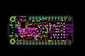
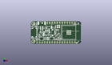
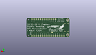
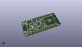

Contents
========

* [PROJ-ADAF-5000-STAN-01>Adafruit Feather ESP32 S2 PCB](#proj-adaf-5000-stan-01adafruit-feather-esp32-s2-pcb)
	* [Images](#images)
	* [Interactive BOM](#interactive-bom)
	* [OOMP Parts](#oomp-parts)
	* [Tags](#tags)
  
![][im]
# PROJ-ADAF-5000-STAN-01>Adafruit Feather ESP32 S2 PCB

- ID: PROJ-ADAF-5000-STAN-01
- Hex ID: PRA5000
- Name: Adafruit Feather ESP32 S2 PCB
- Description: 

## Images
  
  

|eagleImage|kicadPcb3dFront|kicadPcb3dBack|kicadPcb3d|
| :---: | :---: | :---: | :---: |
|||||

## Interactive BOM

- Interactive BOM page: [ibom.html](kicad/bom/ibom.html)

## OOMP Parts
  

|OOMP Parts|
| :---: |
|CAPC-0805-X-UNMATCHED-01, C1, 15.938499999999998, 13.1318, 0,C1, 10uF, 0805-NO, microbuilder, (0.6275, 0.517), R0|
|CAPC-0805-X-UNMATCHED-01, C2, 18.592799999999997, 12.2555, 90,C2, 10uF, 0805-NO, microbuilder, (0.732, 0.4825), R90|
|CAPC-0805-X-UNMATCHED-01, C3, 20.955, 16.8402, 90,C3, 10uF, 0805-NO, microbuilder, (0.825, 0.663), R90|
|CAPC-0603-X-UNMATCHED-01, C4, 14.173200000000001, 5.2832, 90,C4, 1uF, 0603-NO, microbuilder, (0.558, 0.208), R90|
|CAPC-0603-X-UNMATCHED-01, C5, 28.7655, 4.0005, 180,C5, 1uF, 0603-NO, microbuilder, (1.1325, 0.1575), R180|
|CAPC-0805-X-UNMATCHED-01, C6, 12.94319992, 9.39300001, 270,C6, 10uF, 0805-NO, microbuilder, (0.5095748, 0.36980315), R270|
|CAPC-0805-X-UNMATCHED-01, C7, 28.828999999999997, 17.525999999999996, 270,C7, 10uF, 0805-NO, microbuilder, (1.135, 0.69), R270|
|CAPC-0805-X-UNMATCHED-01, C8, 17.33779997, 5.45180012, 270,C8, 10uF, 0805-NO, microbuilder, (0.68259055, 0.2146378), R270|
|CAPC-0805-X-UNMATCHED-01, C9, 26.924, 17.525999999999996, 270,C9, 10uF, 0805-NO, microbuilder, (1.06, 0.69), R270|
|CAPC-0603-X-UNMATCHED-01, C10, 44.577, 19.939, 0,C10, 1uF, 0603-NO, microbuilder, (1.755, 0.785), R0|
|CAPC-0603-X-UNMATCHED-01, C11, 26.416, 8.8265, 180,C11, 1uF, 0603-NO, microbuilder, (1.04, 0.3475), R180|
|UNMATCHED-UNMATCHED-X-UNMATCHED-01, CHG, 1.4605, 5.460999999999999, 270,CHG, ORANGE, CHIPLED_0603_NOOUTLINE, microbuilder, (0.0575, 0.215), R270|
|ERROR, CONN1 JST SH, 0, 0, 0,CONN1, JST, SH, JST_SH4_RA, microbuilder, (0.89, 0.45), R270|
|UNMATCHED-UNMATCHED-X-UNMATCHED-01, D3, 1.4605, 17.525999999999996, 90,D3, RED, CHIPLED_0603_NOOUTLINE, microbuilder, (0.0575, 0.69), R90|
|UNMATCHED-UNMATCHED-X-UNMATCHED-01, D4, 11.4808, 11.9888, 180,D4, MBR540, SOD-123, microbuilder, (0.452, 0.472), R180|
|UNMATCHED-UNMATCHED-X-UNMATCHED-01, IC1, 23.114, 16.383, 90,IC1, LC709203F/MH, WLCSP9, adafruit_sensor, (0.91, 0.645), R90|
|<table><tr><td></td><td> JP1</td><td>[HEAD-I01-X-PI16-01 2.54 mm 16 Pin Header](https://github.com/oomlout/oomlout_OOMP_parts/tree/main/HEAD-I01-X-PI16-01/)</td><td>[H16](https://github.com/oomlout/oomlout_OOMP_parts/tree/main/HEAD-I01-X-PI16-01/)</td></tr></table>|
|<table><tr><td></td><td> JP3</td><td>[HEAD-I01-X-PI12-01 2.54 mm 12 Pin Header](https://github.com/oomlout/oomlout_OOMP_parts/tree/main/HEAD-I01-X-PI12-01/)</td><td>[H12](https://github.com/oomlout/oomlout_OOMP_parts/tree/main/HEAD-I01-X-PI12-01/)</td></tr></table>|
|UNMATCHED-UNMATCHED-X-UNMATCHED-01, LED1, 29.209999999999997, 8.254999999999999, 0,LED1, WS2812B_SK6805_1515, SK6805_1515, microbuilder, (1.15, 0.325), R0|
|UNMATCHED-UNMATCHED-X-UNMATCHED-01, Q1, 25.3365, 6.5405, 0,Q1, DMG3415U, SOT23-R, microbuilder, (0.9975, 0.2575), R0|
|UNMATCHED-UNMATCHED-X-UNMATCHED-01, Q3, 10.401299999999999, 9.5123, 0,Q3, DMG3415U, SOT23-R, microbuilder, (0.4095, 0.3745), R0|
|RESE-0603-X-UNMATCHED-01, R1, 15.748, 5.334, 90,R1, 5.1K, 0603-NO, microbuilder, (0.62, 0.21), R90|
|RESE-0603-X-UNMATCHED-01, R2, 6.3373, 4.1148, 0,R2, 5.1K, 0603-NO, microbuilder, (0.2495, 0.162), R0|
|RESE-0603-X-UNMATCHED-01, R3, 26.669999999999998, 14.097000000000001, 180,R3, 5.1K, 0603-NO, microbuilder, (1.05, 0.555), R180|
|RESE-0603-X-UNMATCHED-01, R4, 15.6718, 15.875, 90,R4, 5.1K, 0603-NO, microbuilder, (0.617, 0.625), R90|
|RESE-0603-X-UNMATCHED-01, R5, 8.1915, 8.2804, 90,R5, 5.1K, 0603-NO, microbuilder, (0.3225, 0.326), R90|
|RESE-0603-X-UNMATCHED-01, R6, 24.892, 17.272000000000002, 270,R6, 5.1K, 0603-NO, microbuilder, (0.98, 0.68), R270|
|<table><tr><td></td><td> R7</td><td>[RESE-0603-X-O104-01 SMD (0603) 100k Ohm Resistor](https://github.com/oomlout/oomlout_OOMP_parts/tree/main/RESE-0603-X-O104-01/)</td><td>[R6104](https://github.com/oomlout/oomlout_OOMP_parts/tree/main/RESE-0603-X-O104-01/)</td></tr></table>|
|RESE-0603-X-UNMATCHED-01, R8, 5.08, 17.272000000000002, 0,R8, 5.1K, 0603-NO, microbuilder, (0.2, 0.68), R0|
|<table><tr><td></td><td> R9</td><td>[RESE-0603-X-O104-01 SMD (0603) 100k Ohm Resistor](https://github.com/oomlout/oomlout_OOMP_parts/tree/main/RESE-0603-X-O104-01/)</td><td>[R6104](https://github.com/oomlout/oomlout_OOMP_parts/tree/main/RESE-0603-X-O104-01/)</td></tr></table>|
|RESE-0603-X-UNMATCHED-01, R10, 5.715, 20.447, 270,R10, 5.1K, 0603-NO, microbuilder, (0.225, 0.805), R270|
|<table><tr><td></td><td> R12</td><td>[RESE-0603-X-O104-01 SMD (0603) 100k Ohm Resistor](https://github.com/oomlout/oomlout_OOMP_parts/tree/main/RESE-0603-X-O104-01/)</td><td>[R6104](https://github.com/oomlout/oomlout_OOMP_parts/tree/main/RESE-0603-X-O104-01/)</td></tr></table>|
|RESE-0603-X-UNMATCHED-01, R17, 28.7655, 5.5245, 0,R17, 1Meg, 0603-NO, microbuilder, (1.1325, 0.2175), R0|
|UNMATCHED-UNMATCHED-X-UNMATCHED-01, SW1, 20.955, 5.206999999999999, 0,SW1, KMR2, BTN_KMR2_4.6X2.8, microbuilder, (0.825, 0.205), R0|
|UNMATCHED-UNMATCHED-X-UNMATCHED-01, SW2, 10.795, 5.1435, 0,SW2, KMR2, BTN_KMR2_4.6X2.8, microbuilder, (0.425, 0.2025), R0|
|UNMATCHED-UNMATCHED-X-UNMATCHED-01, U1, 40.64, 11.43, 270,U1, ESP32-S2-MODULE_MINI, QFN60_ESP32-S2-MINI-1_EXP, adafruit_wireless, (1.6, 0.45), R270|
|UNMATCHED-UNMATCHED-X-UNMATCHED-01, U2, 15.544799999999999, 10.16, 0,U2, AP2112/RT9080-3.3, SOT23-5, microbuilder, (0.612, 0.4), R0|
|UNMATCHED-UNMATCHED-X-UNMATCHED-01, U3, 18.1102, 16.256, 0,U3, MCP73831T-2ACI/OT, SOT23-5, microbuilder, (0.713, 0.64), R0|
|UNMATCHED-UNMATCHED-X-UNMATCHED-01, U4, 27.051, 11.684, 180,U4, BME280, BME280, adafruit_sensor, (1.065, 0.46), R180|
|ERROR, X3 USB C, 0, 0, 0,X3, USB, C, USB_C_CUSB31-CFM2AX-01-X, adafruit_connector, (0.105, 0.45), R270|

## Tags

- hexID: PRA5000
- oompType: PROJ
- oompSize: ADAF
- oompColor: 5000
- oompDesc: STAN
- oompIndex: 01
- oompName: Adafruit Feather ESP32 S2 PCB
- sources: All source files from https://github.com/adafruit/Adafruit-Feather-ESP32-S2-PCB (source licence details in srcLicense.md)
- linkBuyPage: http://www.adafruit.com/products/5000
- oompID: PROJ-ADAF-5000-STAN-01
- oompPart: CAPC-0805-X-UNMATCHED-01, C1, 15.938499999999998, 13.1318, 0
- oompPart: CAPC-0805-X-UNMATCHED-01, C2, 18.592799999999997, 12.2555, 90
- oompPart: CAPC-0805-X-UNMATCHED-01, C3, 20.955, 16.8402, 90
- oompPart: CAPC-0603-X-UNMATCHED-01, C4, 14.173200000000001, 5.2832, 90
- oompPart: CAPC-0603-X-UNMATCHED-01, C5, 28.7655, 4.0005, 180
- oompPart: CAPC-0805-X-UNMATCHED-01, C6, 12.94319992, 9.39300001, 270
- oompPart: CAPC-0805-X-UNMATCHED-01, C7, 28.828999999999997, 17.525999999999996, 270
- oompPart: CAPC-0805-X-UNMATCHED-01, C8, 17.33779997, 5.45180012, 270
- oompPart: CAPC-0805-X-UNMATCHED-01, C9, 26.924, 17.525999999999996, 270
- oompPart: CAPC-0603-X-UNMATCHED-01, C10, 44.577, 19.939, 0
- oompPart: CAPC-0603-X-UNMATCHED-01, C11, 26.416, 8.8265, 180
- oompPart: UNMATCHED-UNMATCHED-X-UNMATCHED-01, CHG, 1.4605, 5.460999999999999, 270
- oompPart: ERROR, CONN1 JST SH, 0, 0, 0
- oompPart: UNMATCHED-UNMATCHED-X-UNMATCHED-01, D3, 1.4605, 17.525999999999996, 90
- oompPart: UNMATCHED-UNMATCHED-X-UNMATCHED-01, D4, 11.4808, 11.9888, 180
- oompPart: UNMATCHED-UNMATCHED-X-UNMATCHED-01, IC1, 23.114, 16.383, 90
- oompPart: HEAD-I01-X-PI16-01, JP1, 25.4, 1.27, 180
- oompPart: HEAD-I01-X-PI12-01, JP3, 30.479999999999997, 21.59, 0
- oompPart: UNMATCHED-UNMATCHED-X-UNMATCHED-01, LED1, 29.209999999999997, 8.254999999999999, 0
- oompPart: UNMATCHED-UNMATCHED-X-UNMATCHED-01, Q1, 25.3365, 6.5405, 0
- oompPart: UNMATCHED-UNMATCHED-X-UNMATCHED-01, Q3, 10.401299999999999, 9.5123, 0
- oompPart: RESE-0603-X-UNMATCHED-01, R1, 15.748, 5.334, 90
- oompPart: RESE-0603-X-UNMATCHED-01, R2, 6.3373, 4.1148, 0
- oompPart: RESE-0603-X-UNMATCHED-01, R3, 26.669999999999998, 14.097000000000001, 180
- oompPart: RESE-0603-X-UNMATCHED-01, R4, 15.6718, 15.875, 90
- oompPart: RESE-0603-X-UNMATCHED-01, R5, 8.1915, 8.2804, 90
- oompPart: RESE-0603-X-UNMATCHED-01, R6, 24.892, 17.272000000000002, 270
- oompPart: RESE-0603-X-O104-01, R7, 18.668999999999997, 8.877299999999998, 0
- oompPart: RESE-0603-X-UNMATCHED-01, R8, 5.08, 17.272000000000002, 0
- oompPart: RESE-0603-X-O104-01, R9, 25.3365, 4.2545, 0
- oompPart: RESE-0603-X-UNMATCHED-01, R10, 5.715, 20.447, 270
- oompPart: RESE-0603-X-O104-01, R12, 6.362699999999999, 5.6642, 180
- oompPart: RESE-0603-X-UNMATCHED-01, R17, 28.7655, 5.5245, 0
- oompPart: UNMATCHED-UNMATCHED-X-UNMATCHED-01, SW1, 20.955, 5.206999999999999, 0
- oompPart: UNMATCHED-UNMATCHED-X-UNMATCHED-01, SW2, 10.795, 5.1435, 0
- oompPart: SKIP-UNMATCHED-X-UNMATCHED-01, TP1, 20.447, 5.4102, M0
- oompPart: SKIP-UNMATCHED-X-UNMATCHED-01, U$31, 2.54, 20.32, 270
- oompPart: SKIP-UNMATCHED-X-UNMATCHED-01, U$32, 2.54, 2.54, 270
- oompPart: SKIP-UNMATCHED-X-UNMATCHED-01, U$34, 11.43, 21.081999999999997, 270
- oompPart: SKIP-UNMATCHED-X-UNMATCHED-01, U$35, 46.37680005799999, 0.9975999859999999, 270
- oompPart: UNMATCHED-UNMATCHED-X-UNMATCHED-01, U1, 40.64, 11.43, 270
- oompPart: UNMATCHED-UNMATCHED-X-UNMATCHED-01, U2, 15.544799999999999, 10.16, 0
- oompPart: UNMATCHED-UNMATCHED-X-UNMATCHED-01, U3, 18.1102, 16.256, 0
- oompPart: UNMATCHED-UNMATCHED-X-UNMATCHED-01, U4, 27.051, 11.684, 180
- oompPart: SKIP-UNMATCHED-X-UNMATCHED-01, X1, 10.921999999999999, 19.367499999999996, 0
- oompPart: ERROR, X3 USB C, 0, 0, 0
- rawPart: C1, 10uF, 0805-NO, microbuilder, (0.6275, 0.517), R0
- rawPart: C2, 10uF, 0805-NO, microbuilder, (0.732, 0.4825), R90
- rawPart: C3, 10uF, 0805-NO, microbuilder, (0.825, 0.663), R90
- rawPart: C4, 1uF, 0603-NO, microbuilder, (0.558, 0.208), R90
- rawPart: C5, 1uF, 0603-NO, microbuilder, (1.1325, 0.1575), R180
- rawPart: C6, 10uF, 0805-NO, microbuilder, (0.5095748, 0.36980315), R270
- rawPart: C7, 10uF, 0805-NO, microbuilder, (1.135, 0.69), R270
- rawPart: C8, 10uF, 0805-NO, microbuilder, (0.68259055, 0.2146378), R270
- rawPart: C9, 10uF, 0805-NO, microbuilder, (1.06, 0.69), R270
- rawPart: C10, 1uF, 0603-NO, microbuilder, (1.755, 0.785), R0
- rawPart: C11, 1uF, 0603-NO, microbuilder, (1.04, 0.3475), R180
- rawPart: CHG, ORANGE, CHIPLED_0603_NOOUTLINE, microbuilder, (0.0575, 0.215), R270
- rawPart: CONN1, JST, SH, JST_SH4_RA, microbuilder, (0.89, 0.45), R270
- rawPart: D3, RED, CHIPLED_0603_NOOUTLINE, microbuilder, (0.0575, 0.69), R90
- rawPart: D4, MBR540, SOD-123, microbuilder, (0.452, 0.472), R180
- rawPart: IC1, LC709203F/MH, WLCSP9, adafruit_sensor, (0.91, 0.645), R90
- rawPart: JP1, 1X16_ROUND, microbuilder, (1, 0.05), R180
- rawPart: JP3, 1X12_ROUND, microbuilder, (1.2, 0.85), R0
- rawPart: LED1, WS2812B_SK6805_1515, SK6805_1515, microbuilder, (1.15, 0.325), R0
- rawPart: Q1, DMG3415U, SOT23-R, microbuilder, (0.9975, 0.2575), R0
- rawPart: Q3, DMG3415U, SOT23-R, microbuilder, (0.4095, 0.3745), R0
- rawPart: R1, 5.1K, 0603-NO, microbuilder, (0.62, 0.21), R90
- rawPart: R2, 5.1K, 0603-NO, microbuilder, (0.2495, 0.162), R0
- rawPart: R3, 5.1K, 0603-NO, microbuilder, (1.05, 0.555), R180
- rawPart: R4, 5.1K, 0603-NO, microbuilder, (0.617, 0.625), R90
- rawPart: R5, 5.1K, 0603-NO, microbuilder, (0.3225, 0.326), R90
- rawPart: R6, 5.1K, 0603-NO, microbuilder, (0.98, 0.68), R270
- rawPart: R7, 100K, 0603-NO, microbuilder, (0.735, 0.3495), R0
- rawPart: R8, 5.1K, 0603-NO, microbuilder, (0.2, 0.68), R0
- rawPart: R9, 100k, 0603-NO, microbuilder, (0.9975, 0.1675), R0
- rawPart: R10, 5.1K, 0603-NO, microbuilder, (0.225, 0.805), R270
- rawPart: R12, 100K, 0603-NO, microbuilder, (0.2505, 0.223), R180
- rawPart: R17, 1Meg, 0603-NO, microbuilder, (1.1325, 0.2175), R0
- rawPart: SW1, KMR2, BTN_KMR2_4.6X2.8, microbuilder, (0.825, 0.205), R0
- rawPart: SW2, KMR2, BTN_KMR2_4.6X2.8, microbuilder, (0.425, 0.2025), R0
- rawPart: TP1, TESTPOINT_ROUND_1.5MM_NO, microbuilder, (0.805, 0.213), MR0
- rawPart: U$31, MOUNTINGHOLE2.5, MOUNTINGHOLE_2.5_PLATED, microbuilder, (0.1, 0.8), R270
- rawPart: U$32, MOUNTINGHOLE2.5, MOUNTINGHOLE_2.5_PLATED, microbuilder, (0.1, 0.1), R270
- rawPart: U$34, FIDUCIAL_1MM, FIDUCIAL_1MM, microbuilder, (0.45, 0.83), R270
- rawPart: U$35, FIDUCIAL_1MM, FIDUCIAL_1MM, microbuilder, (1.82585827, 0.03927559), R270
- rawPart: U1, ESP32-S2-MODULE_MINI, QFN60_ESP32-S2-MINI-1_EXP, adafruit_wireless, (1.6, 0.45), R270
- rawPart: U2, AP2112/RT9080-3.3, SOT23-5, microbuilder, (0.612, 0.4), R0
- rawPart: U3, MCP73831T-2ACI/OT, SOT23-5, microbuilder, (0.713, 0.64), R0
- rawPart: U4, BME280, BME280, adafruit_sensor, (1.065, 0.46), R180
- rawPart: X1, JSTPH, JSTPH2_BATT, adafruit_electromech, (0.43, 0.7625), R0
- rawPart: X3, USB, C, USB_C_CUSB31-CFM2AX-01-X, adafruit_connector, (0.105, 0.45), R270

[im]: kicadPcb3d_450.png
