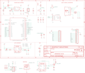

Contents
========

* [PRA5000 > Adafruit](#pra5000--adafruit)
	* [Schematic](#schematic)
	* [Interactive BOM](#interactive-bom)
	* [OOMP Parts](#oomp-parts)
	* [Images](#images)
	* [Tags](#tags)
  
![][im]
# PRA5000 > Adafruit

- ID: PROJ-ADAF-5000-STAN-01
- Hex ID: PRA5000
- Name: Adafruit
- Description: Adafruit
- Long Link: [http://oom.lt/PROJ-ADAF-5000-STAN-01](http://oom.lt/PROJ-ADAF-5000-STAN-01)
- Short Link: [http://oom.lt/PRA5000](http://oom.lt/PRA5000)

## Schematic
  

## Interactive BOM

- Interactive BOM page: [ibom.html](https://htmlpreview.github.io/?https://github.com/oomlout/oomlout_OOMP_projects/blob/main/PROJ-ADAF-5000-STAN-01/kicad/bom/ibom.html)

## OOMP Parts
  

|OOMP Parts|
| :---: |
|C1,CAPC-0805-X-UF10-V10,C1,10uF,CAP_CERAMIC0805-NOOUTLINE,0805-NO,Ceramic Capacitors,,,|
|C2,CAPC-0805-X-UF10-V10,C2,10uF,CAP_CERAMIC0805-NOOUTLINE,0805-NO,Ceramic Capacitors,,,|
|C3,CAPC-0805-X-UNMATCHED-01,C3,10µF,CAP_CERAMIC0805-NOOUTLINE,0805-NO,Ceramic Capacitors,,,|
|C4,CAPC-0603-X-UF1-01,C4,1uF,CAP_CERAMIC0603_NO,0603-NO,Ceramic Capacitors,,,|
|C5,CAPC-0603-X-UF1-01,C5,1uF,CAP_CERAMIC0603_NO,0603-NO,Ceramic Capacitors,,,|
|C6,CAPC-0805-X-UNMATCHED-01,C6,10µF,CAP_CERAMIC0805-NOOUTLINE,0805-NO,Ceramic Capacitors,,,|
|C7,CAPC-0805-X-UF10-V10,C7,10uF,CAP_CERAMIC0805-NOOUTLINE,0805-NO,Ceramic Capacitors,,,|
|C8,CAPC-0805-X-UNMATCHED-01,C8,10µF,CAP_CERAMIC0805-NOOUTLINE,0805-NO,Ceramic Capacitors,,B,|
|C9,CAPC-0805-X-UF10-V10,C9,10uF,CAP_CERAMIC0805-NOOUTLINE,0805-NO,Ceramic Capacitors,,,|
|C10,CAPC-0603-X-UF1-01,C10,1uF,CAP_CERAMIC0603_NO,0603-NO,Ceramic Capacitors,,,|
|C11,CAPC-0603-X-UF1-01,C11,1uF,CAP_CERAMIC0603_NO,0603-NO,Ceramic Capacitors,,,|
|CHG,LEDS-0603-G-STAN-01,CHG,ORANGE,LED0603_NOOUTLINE,CHIPLED_0603_NOOUTLINE,LED,,,|
|CONN1,UNMATCHED-UNMATCHED-X-UNMATCHED-01,CONN1,JST SH,STEMMA_I2C_QTRA,JST_SH4_RA,,,,|
|D3,LEDS-0603-G-STAN-01,D3,RED,LED0603_NOOUTLINE,CHIPLED_0603_NOOUTLINE,LED,,,|
|D4,DIOD-UNMATCHED-X-UNMATCHED-01,D4,MBR540,DIODE-SCHOTTKYSOD-123,SOD-123,,,,|
|IC1,UNMATCHED-UNMATCHED-X-UNMATCHED-01,IC1,LC709203F/MH,LC709203F/MH,WLCSP9,,,,|
|JP1,HEAD-I01-X-PI16-01,JP1,,HEADER-1X16ROUND,1X16_ROUND,PIN HEADER,,,|
|JP3,HEAD-I01-X-PI12-01,JP3,,HEADER-1X12,1X12_ROUND,,,,|
|LED1,UNMATCHED-UNMATCHED-X-UNMATCHED-01,LED1,WS2812B_SK6805_1515,WS2812B_SK6805_1515,SK6805_1515,,,,|
|Q1,MOSP-SO23-X-UNMATCHED-01,Q1,DMG3415U,MOSFET-P,SOT23-R,P-Channel Mosfet,,,|
|Q3,MOSP-SO23-X-UNMATCHED-01,Q3,DMG3415U,MOSFET-P,SOT23-R,P-Channel Mosfet,,,|
|R1,RESE-0603-X-UNMATCHED-01,R1,5.1K,RESISTOR_0603_NOOUT,0603-NO,Resistors,,,|
|R2,RESE-0603-X-UNMATCHED-01,R2,5.1K,RESISTOR_0603_NOOUT,0603-NO,Resistors,,,|
|R3,RESE-0603-X-UNMATCHED-01,R3,5.1K,RESISTOR_0603_NOOUT,0603-NO,Resistors,,,|
|R4,RESE-0603-X-UNMATCHED-01,R4,5.1K,RESISTOR_0603_NOOUT,0603-NO,Resistors,,,|
|R5,RESE-0603-X-UNMATCHED-01,R5,5.1K,RESISTOR_0603_NOOUT,0603-NO,Resistors,,,|
|R6,RESE-0603-X-UNMATCHED-01,R6,5.1K,RESISTOR_0603_NOOUT,0603-NO,Resistors,,,|
|R7,RESE-0603-X-O1003-01,R7,100K,RESISTOR_0603_NOOUT,0603-NO,Resistors,,,|
|R8,RESE-0603-X-UNMATCHED-01,R8,5.1K,RESISTOR_0603_NOOUT,0603-NO,Resistors,,,|
|R9,RESE-0603-X-O1003-01,R9,100k,RESISTOR_0603_NOOUT,0603-NO,Resistors,,,|
|R10,RESE-0603-X-UNMATCHED-01,R10,5.1K,RESISTOR_0603_NOOUT,0603-NO,Resistors,,,|
|R12,RESE-0603-X-O1003-01,R12,100K,RESISTOR_0603_NOOUT,0603-NO,Resistors,,,|
|R17,RESE-0603-X-UNMATCHED-01,R17,1Meg,RESISTOR_0603_NOOUT,0603-NO,Resistors,,,|
|SW1,UNMATCHED-UNMATCHED-X-UNMATCHED-01,SW1,KMR2,SWITCH_TACT_SMT4.6X2.8,BTN_KMR2_4.6X2.8,SMT Tact Switches,,,|
|SW2,UNMATCHED-UNMATCHED-X-UNMATCHED-01,SW2,KMR2,SWITCH_TACT_SMT4.6X2.8,BTN_KMR2_4.6X2.8,SMT Tact Switches,,,|
|TP1,UNMATCHED-UNMATCHED-X-UNMATCHED-01,TP1,,TESTPOINTROUND1.5MMNO,TESTPOINT_ROUND_1.5MM_NO,Test Point,,,|
|U1,UNMATCHED-UNMATCHED-X-UNMATCHED-01,U$31,MOUNTINGHOLE2.5,MOUNTINGHOLE2.5,MOUNTINGHOLE_2.5_PLATED,Mounting Hole,EXCLUDE,,|
|U2,UNMATCHED-SO235-X-UNMATCHED-01,U$32,MOUNTINGHOLE2.5,MOUNTINGHOLE2.5,MOUNTINGHOLE_2.5_PLATED,Mounting Hole,EXCLUDE,,|
|U3,UNMATCHED-SO235-X-UNMATCHED-01,U$34,FIDUCIAL_1MM,FIDUCIAL_1MM,FIDUCIAL_1MM,Fiducial Alignment Points,EXCLUDE,,|
|U4,UNMATCHED-UNMATCHED-X-UNMATCHED-01,U$35,FIDUCIAL_1MM,FIDUCIAL_1MM,FIDUCIAL_1MM,Fiducial Alignment Points,EXCLUDE,,|
|X1,UNMATCHED-UNMATCHED-X-UNMATCHED-01,U1,ESP32-S2-MODULE_MINI,ESP32-S2-MODULE_MINI,QFN60_ESP32-S2-MINI-1_EXP,WiFi 802.11b/g/n Transceiver Module 2.4GHz Antenna Not Included Surface Mount Check prices,,,|
|X3,UNMATCHED-UNMATCHED-X-UNMATCHED-01,U2,AP2112/RT9080-3.3,VREG_SOT23-5,SOT23-5,SOT23-5 Fixed Voltage Regulators,,,|

## Images
  
  

|kicadPcb3d|kicadPcb3dFront|kicadPcb3dBack|eagleImage|eagleSchemImage|
| :---: | :---: | :---: | :---: | :---: |
||||||

## Tags

- hexID: PRA5000
- oompType: PROJ
- oompSize: ADAF
- oompColor: 5000
- oompDesc: STAN
- oompIndex: 01
- oompName: Adafruit Feather ESP32 S2 PCB
- sources: All source files from https://github.com/adafruit/Adafruit-Feather-ESP32-S2-PCB (source licence details in srcLicense.md)
- linkBuyPage: http://www.adafruit.com/products/5000
- oompID: PROJ-ADAF-5000-STAN-01
- oompParts: C1,CAPC-0805-X-UF10-V10
- oompParts: C2,CAPC-0805-X-UF10-V10
- oompParts: C3,CAPC-0805-X-UNMATCHED-01
- oompParts: C4,CAPC-0603-X-UF1-01
- oompParts: C5,CAPC-0603-X-UF1-01
- oompParts: C6,CAPC-0805-X-UNMATCHED-01
- oompParts: C7,CAPC-0805-X-UF10-V10
- oompParts: C8,CAPC-0805-X-UNMATCHED-01
- oompParts: C9,CAPC-0805-X-UF10-V10
- oompParts: C10,CAPC-0603-X-UF1-01
- oompParts: C11,CAPC-0603-X-UF1-01
- oompParts: CHG,LEDS-0603-G-STAN-01
- oompParts: CONN1,UNMATCHED-UNMATCHED-X-UNMATCHED-01
- oompParts: D3,LEDS-0603-G-STAN-01
- oompParts: D4,DIOD-UNMATCHED-X-UNMATCHED-01
- oompParts: IC1,UNMATCHED-UNMATCHED-X-UNMATCHED-01
- oompParts: JP1,HEAD-I01-X-PI16-01
- oompParts: JP3,HEAD-I01-X-PI12-01
- oompParts: LED1,UNMATCHED-UNMATCHED-X-UNMATCHED-01
- oompParts: Q1,MOSP-SO23-X-UNMATCHED-01
- oompParts: Q3,MOSP-SO23-X-UNMATCHED-01
- oompParts: R1,RESE-0603-X-UNMATCHED-01
- oompParts: R2,RESE-0603-X-UNMATCHED-01
- oompParts: R3,RESE-0603-X-UNMATCHED-01
- oompParts: R4,RESE-0603-X-UNMATCHED-01
- oompParts: R5,RESE-0603-X-UNMATCHED-01
- oompParts: R6,RESE-0603-X-UNMATCHED-01
- oompParts: R7,RESE-0603-X-O1003-01
- oompParts: R8,RESE-0603-X-UNMATCHED-01
- oompParts: R9,RESE-0603-X-O1003-01
- oompParts: R10,RESE-0603-X-UNMATCHED-01
- oompParts: R12,RESE-0603-X-O1003-01
- oompParts: R17,RESE-0603-X-UNMATCHED-01
- oompParts: SW1,UNMATCHED-UNMATCHED-X-UNMATCHED-01
- oompParts: SW2,UNMATCHED-UNMATCHED-X-UNMATCHED-01
- oompParts: TP1,UNMATCHED-UNMATCHED-X-UNMATCHED-01
- oompParts: U1,UNMATCHED-UNMATCHED-X-UNMATCHED-01
- oompParts: U2,UNMATCHED-SO235-X-UNMATCHED-01
- oompParts: U3,UNMATCHED-SO235-X-UNMATCHED-01
- oompParts: U4,UNMATCHED-UNMATCHED-X-UNMATCHED-01
- oompParts: X1,UNMATCHED-UNMATCHED-X-UNMATCHED-01
- oompParts: X3,UNMATCHED-UNMATCHED-X-UNMATCHED-01
- rawParts: C1,10uF,CAP_CERAMIC0805-NOOUTLINE,0805-NO,Ceramic Capacitors,,,
- rawParts: C2,10uF,CAP_CERAMIC0805-NOOUTLINE,0805-NO,Ceramic Capacitors,,,
- rawParts: C3,10µF,CAP_CERAMIC0805-NOOUTLINE,0805-NO,Ceramic Capacitors,,,
- rawParts: C4,1uF,CAP_CERAMIC0603_NO,0603-NO,Ceramic Capacitors,,,
- rawParts: C5,1uF,CAP_CERAMIC0603_NO,0603-NO,Ceramic Capacitors,,,
- rawParts: C6,10µF,CAP_CERAMIC0805-NOOUTLINE,0805-NO,Ceramic Capacitors,,,
- rawParts: C7,10uF,CAP_CERAMIC0805-NOOUTLINE,0805-NO,Ceramic Capacitors,,,
- rawParts: C8,10µF,CAP_CERAMIC0805-NOOUTLINE,0805-NO,Ceramic Capacitors,,B,
- rawParts: C9,10uF,CAP_CERAMIC0805-NOOUTLINE,0805-NO,Ceramic Capacitors,,,
- rawParts: C10,1uF,CAP_CERAMIC0603_NO,0603-NO,Ceramic Capacitors,,,
- rawParts: C11,1uF,CAP_CERAMIC0603_NO,0603-NO,Ceramic Capacitors,,,
- rawParts: CHG,ORANGE,LED0603_NOOUTLINE,CHIPLED_0603_NOOUTLINE,LED,,,
- rawParts: CONN1,JST SH,STEMMA_I2C_QTRA,JST_SH4_RA,,,,
- rawParts: D3,RED,LED0603_NOOUTLINE,CHIPLED_0603_NOOUTLINE,LED,,,
- rawParts: D4,MBR540,DIODE-SCHOTTKYSOD-123,SOD-123,,,,
- rawParts: IC1,LC709203F/MH,LC709203F/MH,WLCSP9,,,,
- rawParts: JP1,,HEADER-1X16ROUND,1X16_ROUND,PIN HEADER,,,
- rawParts: JP3,,HEADER-1X12,1X12_ROUND,,,,
- rawParts: LED1,WS2812B_SK6805_1515,WS2812B_SK6805_1515,SK6805_1515,,,,
- rawParts: Q1,DMG3415U,MOSFET-P,SOT23-R,P-Channel Mosfet,,,
- rawParts: Q3,DMG3415U,MOSFET-P,SOT23-R,P-Channel Mosfet,,,
- rawParts: R1,5.1K,RESISTOR_0603_NOOUT,0603-NO,Resistors,,,
- rawParts: R2,5.1K,RESISTOR_0603_NOOUT,0603-NO,Resistors,,,
- rawParts: R3,5.1K,RESISTOR_0603_NOOUT,0603-NO,Resistors,,,
- rawParts: R4,5.1K,RESISTOR_0603_NOOUT,0603-NO,Resistors,,,
- rawParts: R5,5.1K,RESISTOR_0603_NOOUT,0603-NO,Resistors,,,
- rawParts: R6,5.1K,RESISTOR_0603_NOOUT,0603-NO,Resistors,,,
- rawParts: R7,100K,RESISTOR_0603_NOOUT,0603-NO,Resistors,,,
- rawParts: R8,5.1K,RESISTOR_0603_NOOUT,0603-NO,Resistors,,,
- rawParts: R9,100k,RESISTOR_0603_NOOUT,0603-NO,Resistors,,,
- rawParts: R10,5.1K,RESISTOR_0603_NOOUT,0603-NO,Resistors,,,
- rawParts: R12,100K,RESISTOR_0603_NOOUT,0603-NO,Resistors,,,
- rawParts: R17,1Meg,RESISTOR_0603_NOOUT,0603-NO,Resistors,,,
- rawParts: SW1,KMR2,SWITCH_TACT_SMT4.6X2.8,BTN_KMR2_4.6X2.8,SMT Tact Switches,,,
- rawParts: SW2,KMR2,SWITCH_TACT_SMT4.6X2.8,BTN_KMR2_4.6X2.8,SMT Tact Switches,,,
- rawParts: TP1,,TESTPOINTROUND1.5MMNO,TESTPOINT_ROUND_1.5MM_NO,Test Point,,,
- rawParts: U$31,MOUNTINGHOLE2.5,MOUNTINGHOLE2.5,MOUNTINGHOLE_2.5_PLATED,Mounting Hole,EXCLUDE,,
- rawParts: U$32,MOUNTINGHOLE2.5,MOUNTINGHOLE2.5,MOUNTINGHOLE_2.5_PLATED,Mounting Hole,EXCLUDE,,
- rawParts: U$34,FIDUCIAL_1MM,FIDUCIAL_1MM,FIDUCIAL_1MM,Fiducial Alignment Points,EXCLUDE,,
- rawParts: U$35,FIDUCIAL_1MM,FIDUCIAL_1MM,FIDUCIAL_1MM,Fiducial Alignment Points,EXCLUDE,,
- rawParts: U1,ESP32-S2-MODULE_MINI,ESP32-S2-MODULE_MINI,QFN60_ESP32-S2-MINI-1_EXP,WiFi 802.11b/g/n Transceiver Module 2.4GHz Antenna Not Included Surface Mount Check prices,,,
- rawParts: U2,AP2112/RT9080-3.3,VREG_SOT23-5,SOT23-5,SOT23-5 Fixed Voltage Regulators,,,
- rawParts: U3,MCP73831T-2ACI/OT,MCP73831/2,SOT23-5,MCP73831/2 LIPO Charger,,,
- rawParts: U4,BME280,BME280,BME280,BME280 - Environmental Sensor (I2C + SPI),,,
- rawParts: X1,JSTPH,CON_JST_PH_2PIN_MT_BATT,JSTPH2_BATT,,,,
- rawParts: X3,USB C,USB_C,USB_C_CUSB31-CFM2AX-01-X,USB Type-C USB 2.0 Connector,,,

[im]: kicadPcb3d_450.png
