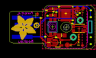
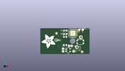
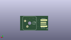
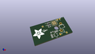

Contents
========

* [PROJ-ADAF-5020-STAN-01>Adafruit NeoKey Trinkey PCB](#proj-adaf-5020-stan-01adafruit-neokey-trinkey-pcb)
	* [Images](#images)
	* [Interactive BOM](#interactive-bom)
	* [OOMP Parts](#oomp-parts)
	* [Tags](#tags)
  
![][im]
# PROJ-ADAF-5020-STAN-01>Adafruit NeoKey Trinkey PCB

- ID: PROJ-ADAF-5020-STAN-01
- Hex ID: PRA5020
- Name: Adafruit NeoKey Trinkey PCB
- Description: 

## Images
  
  

|eagleImage|kicadPcb3dFront|kicadPcb3dBack|kicadPcb3d|
| :---: | :---: | :---: | :---: |
|||||

## Interactive BOM

- Interactive BOM page: [ibom.html](kicad/bom/ibom.html)

## OOMP Parts
  

|OOMP Parts|
| :---: |
|CAPC-0805-X-UNMATCHED-01, C3, 14.604999999999999, -5.715, 90,C3, 10uF, 0805-NO, microbuilder, (0.575, -0.225), R90|
|CAPC-0603-X-UNMATCHED-01, C4, 16.065499999999997, 6.7945, 180,C4, 1uF, 0603-NO, microbuilder, (0.6325, 0.2675), R180|
|CAPC-0603-X-UNMATCHED-01, C5, 16.065499999999997, 4.5085, 180,C5, 1uF, 0603-NO, microbuilder, (0.6325, 0.1775), R180|
|CAPC-0805-X-UNMATCHED-01, C8, 19.304, -3.0479999999999996, 0,C8, 10uF, 0805-NO, microbuilder, (0.76, -0.12), R0|
|UNMATCHED-UNMATCHED-X-UNMATCHED-01, CN1, 4.953, 0.0, M180,CN1, USBA_PCB, microbuilder, (0.195, 0), MR180|
|UNMATCHED-UNMATCHED-X-UNMATCHED-01, IC3, 20.8915, 5.08, 270,IC3, ATSAMD21E, QFN32_5MM, microbuilder, (0.8225, 0.2), R270|
|UNMATCHED-UNMATCHED-X-UNMATCHED-01, LED1, 15.938499999999998, 0.127, M270,LED1, WS2812B_SK6812E, NEO3535_REVERSE, microbuilder, (0.6275, 0.005), MR270|
|UNMATCHED-UNMATCHED-X-UNMATCHED-01, RESET, 25.654, -0.5714999999999999, 0,RESET, KMR2, BTN_KMR2_4.6X2.8, microbuilder, (1.01, -0.0225), R0|
|UNMATCHED-UNMATCHED-X-UNMATCHED-01, SW1, 20.955, 0.0, M90,SW1, MX, KAILH_BOX_MX_NOSTABILIZERS, adafruit_electromech, (0.825, 0), MR90|
|UNMATCHED-UNMATCHED-X-UNMATCHED-01, U1, 17.906999999999996, -5.7785, 270,U1, AP2112K-3.3, SOT23-5, microbuilder, (0.705, -0.2275), R270|

## Tags

- hexID: PRA5020
- oompType: PROJ
- oompSize: ADAF
- oompColor: 5020
- oompDesc: STAN
- oompIndex: 01
- oompName: Adafruit NeoKey Trinkey PCB
- sources: All source files from https://github.com/adafruit/Adafruit-NeoKey-Trinkey-PCB (source licence details in srcLicense.md)
- linkBuyPage: http://www.adafruit.com/products/5020
- oompPart: CAPC-0805-X-UNMATCHED-01, C3, 14.604999999999999, -5.715, 90
- oompPart: CAPC-0603-X-UNMATCHED-01, C4, 16.065499999999997, 6.7945, 180
- oompPart: CAPC-0603-X-UNMATCHED-01, C5, 16.065499999999997, 4.5085, 180
- oompPart: CAPC-0805-X-UNMATCHED-01, C8, 19.304, -3.0479999999999996, 0
- oompPart: UNMATCHED-UNMATCHED-X-UNMATCHED-01, CN1, 4.953, 0.0, M180
- oompPart: SKIP-UNMATCHED-X-UNMATCHED-01, FID1, 26.860500000000002, -6.858, 0
- oompPart: SKIP-UNMATCHED-X-UNMATCHED-01, FID2, 10.363199999999999, 4.953, 180
- oompPart: UNMATCHED-UNMATCHED-X-UNMATCHED-01, IC3, 20.8915, 5.08, 270
- oompPart: UNMATCHED-UNMATCHED-X-UNMATCHED-01, LED1, 15.938499999999998, 0.127, M270
- oompPart: UNMATCHED-UNMATCHED-X-UNMATCHED-01, RESET, 25.654, -0.5714999999999999, 0
- oompPart: SKIP-UNMATCHED-X-UNMATCHED-01, RST, 21.3995, -6.604, 0
- oompPart: UNMATCHED-UNMATCHED-X-UNMATCHED-01, SW1, 20.955, 0.0, M90
- oompPart: SKIP-UNMATCHED-X-UNMATCHED-01, SWC, 27.2415, 7.238999999999999, 0
- oompPart: SKIP-UNMATCHED-X-UNMATCHED-01, SWD, 25.019, 7.238999999999999, 0
- oompPart: UNMATCHED-UNMATCHED-X-UNMATCHED-01, U1, 17.906999999999996, -5.7785, 270
- rawPart: C3, 10uF, 0805-NO, microbuilder, (0.575, -0.225), R90
- rawPart: C4, 1uF, 0603-NO, microbuilder, (0.6325, 0.2675), R180
- rawPart: C5, 1uF, 0603-NO, microbuilder, (0.6325, 0.1775), R180
- rawPart: C8, 10uF, 0805-NO, microbuilder, (0.76, -0.12), R0
- rawPart: CN1, USBA_PCB, microbuilder, (0.195, 0), MR180
- rawPart: FID1, FIDUCIAL_1MM, FIDUCIAL_1MM, microbuilder, (1.0575, -0.27), R0
- rawPart: FID2, FIDUCIAL_1MM, FIDUCIAL_1MM, microbuilder, (0.408, 0.195), R180
- rawPart: IC3, ATSAMD21E, QFN32_5MM, microbuilder, (0.8225, 0.2), R270
- rawPart: LED1, WS2812B_SK6812E, NEO3535_REVERSE, microbuilder, (0.6275, 0.005), MR270
- rawPart: RESET, KMR2, BTN_KMR2_4.6X2.8, microbuilder, (1.01, -0.0225), R0
- rawPart: RST, RST, TP16R, testpad, (0.8425, -0.26), R0
- rawPart: SW1, MX, KAILH_BOX_MX_NOSTABILIZERS, adafruit_electromech, (0.825, 0), MR90
- rawPart: SWC, SWC, TP15R, testpad, (1.0725, 0.285), R0
- rawPart: SWD, SWD, TP15R, testpad, (0.985, 0.285), R0
- rawPart: U1, AP2112K-3.3, SOT23-5, microbuilder, (0.705, -0.2275), R270
- oompID: PROJ-ADAF-5020-STAN-01

[im]: kicadPcb3d_450.png
