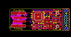

Contents
========

* [PROJ-ADAF-5022-STAN-01>Adafruit Proximity Trinkey PCB](#proj-adaf-5022-stan-01adafruit-proximity-trinkey-pcb)
	* [Images](#images)
	* [Interactive BOM](#interactive-bom)
	* [Tags](#tags)
  
![][im]
# PROJ-ADAF-5022-STAN-01>Adafruit Proximity Trinkey PCB

- ID: PROJ-ADAF-5022-STAN-01
- Hex ID: PRA5022
- Name: Adafruit Proximity Trinkey PCB
- Description: 

## Images
  
  

|eagleImage|
| :---: |
||

## Interactive BOM

- Interactive BOM page: [ibom.html](kicad/bom/ibom.html)

## Tags

- hexID: PRA5022
- oompType: PROJ
- oompSize: ADAF
- oompColor: 5022
- oompDesc: STAN
- oompIndex: 01
- oompName: Adafruit Proximity Trinkey PCB
- sources: All source files from https://github.com/adafruit/Adafruit-Proximity-Trinkey-PCB (source licence details in srcLicense.md)
- linkBuyPage: http://www.adafruit.com/products/5022

[im]: eagleImage_450.png
