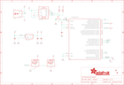

Contents
========

* [PRA5022 > Adafruit](#pra5022--adafruit)
	* [Schematic](#schematic)
	* [Interactive BOM](#interactive-bom)
	* [OOMP Parts](#oomp-parts)
	* [Images](#images)
	* [Tags](#tags)
  
![][im]
# PRA5022 > Adafruit

- ID: PROJ-ADAF-5022-STAN-01
- Hex ID: PRA5022
- Name: Adafruit
- Description: Adafruit
- Long Link: [http://oom.lt/PROJ-ADAF-5022-STAN-01](http://oom.lt/PROJ-ADAF-5022-STAN-01)
- Short Link: [http://oom.lt/PRA5022](http://oom.lt/PRA5022)

## Schematic
  

## Interactive BOM

- Interactive BOM page: [ibom.html](https://htmlpreview.github.io/?https://github.com/oomlout/oomlout_OOMP_projects/blob/main/PROJ-ADAF-5022-STAN-01/kicad/bom/ibom.html)

## OOMP Parts
  

|OOMP Parts|
| :---: |
|C3,CAPC-0805-X-UF10-V10,C3,10uF,CAP_CERAMIC0805-NOOUTLINE,0805-NO,Ceramic Capacitors,,,|
|C4,CAPC-0603-X-UF1-01,C4,1uF,CAP_CERAMIC0603_NO,0603-NO,Ceramic Capacitors,,,|
|C5,CAPC-0603-X-UF1-01,C5,1uF,CAP_CERAMIC0603_NO,0603-NO,Ceramic Capacitors,,,|
|C8,CAPC-0805-X-UF10-V10,C8,10uF,CAP_CERAMIC0805-NOOUTLINE,0805-NO,Ceramic Capacitors,,,|
|CN1,UNMATCHED-UNMATCHED-X-UNMATCHED-01,CN1,USB A,USB_TYPEAPCB,USBA_PCB,USB - Type A Connectors,,,|
|IC3,UNMATCHED-UNMATCHED-X-UNMATCHED-01,FID1,FIDUCIAL_1MM,FIDUCIAL_1MM,FIDUCIAL_1MM,Fiducial Alignment Points,EXCLUDE,,|
|LED1,UNMATCHED-UNMATCHED-X-UNMATCHED-01,FID2,FIDUCIAL_1MM,FIDUCIAL_1MM,FIDUCIAL_1MM,Fiducial Alignment Points,EXCLUDE,,|
|LED2,UNMATCHED-UNMATCHED-X-UNMATCHED-01,IC3,ATSAMD21E,ATSAMD21E,QFN32_5MM,,,,|
|Q2,UNMATCHED-UNMATCHED-X-UNMATCHED-01,LED1,WS2812B3535,WS2812B3535,LED3535,,,,|
|R1,RESE-0603-X-O472-01,LED2,WS2812B3535,WS2812B3535,LED3535,,,,|
|R2,RESE-0603-X-O472-01,Q2,reset,SWITCH_TACT_SMT4.6X2.8,BTN_KMR2_4.6X2.8,SMT Tact Switches,,,|
|RST,UNMATCHED-UNMATCHED-X-UNMATCHED-01,R1,4.7K,RESISTOR_0603_NOOUT,0603-NO,Resistors,,,|
|SWC,UNMATCHED-UNMATCHED-X-UNMATCHED-01,R2,4.7K,RESISTOR_0603_NOOUT,0603-NO,Resistors,,,|
|SWD,UNMATCHED-UNMATCHED-X-UNMATCHED-01,RST,TPTP16R,TPTP16R,TP16R,Test pad,,,|
|TP1,UNMATCHED-UNMATCHED-X-UNMATCHED-01,SWC,TPTP15R,TPTP15R,TP15R,Test pad,,,|
|TP2,UNMATCHED-UNMATCHED-X-UNMATCHED-01,SWD,TPTP16R,TPTP16R,TP16R,Test pad,,,|
|U1,VREG-SO235-X-KAP2112K-V33D,TP1,,TESTPOINTROUND1.5MMNO,TESTPOINT_ROUND_1.5MM_NO,Test Point,,,|
|U3,UNMATCHED-UNMATCHED-X-UNMATCHED-01,TP2,,TESTPOINTROUND1.5MMNO,TESTPOINT_ROUND_1.5MM_NO,Test Point,,,|

## Images
  
  

|kicadPcb3d|kicadPcb3dFront|kicadPcb3dBack|eagleImage|eagleSchemImage|
| :---: | :---: | :---: | :---: | :---: |
||||||

## Tags

- hexID: PRA5022
- oompType: PROJ
- oompSize: ADAF
- oompColor: 5022
- oompDesc: STAN
- oompIndex: 01
- oompName: Adafruit Proximity Trinkey PCB
- sources: All source files from https://github.com/adafruit/Adafruit-Proximity-Trinkey-PCB (source licence details in srcLicense.md)
- linkBuyPage: http://www.adafruit.com/products/5022
- oompID: PROJ-ADAF-5022-STAN-01
- oompParts: C3,CAPC-0805-X-UF10-V10
- oompParts: C4,CAPC-0603-X-UF1-01
- oompParts: C5,CAPC-0603-X-UF1-01
- oompParts: C8,CAPC-0805-X-UF10-V10
- oompParts: CN1,UNMATCHED-UNMATCHED-X-UNMATCHED-01
- oompParts: IC3,UNMATCHED-UNMATCHED-X-UNMATCHED-01
- oompParts: LED1,UNMATCHED-UNMATCHED-X-UNMATCHED-01
- oompParts: LED2,UNMATCHED-UNMATCHED-X-UNMATCHED-01
- oompParts: Q2,UNMATCHED-UNMATCHED-X-UNMATCHED-01
- oompParts: R1,RESE-0603-X-O472-01
- oompParts: R2,RESE-0603-X-O472-01
- oompParts: RST,UNMATCHED-UNMATCHED-X-UNMATCHED-01
- oompParts: SWC,UNMATCHED-UNMATCHED-X-UNMATCHED-01
- oompParts: SWD,UNMATCHED-UNMATCHED-X-UNMATCHED-01
- oompParts: TP1,UNMATCHED-UNMATCHED-X-UNMATCHED-01
- oompParts: TP2,UNMATCHED-UNMATCHED-X-UNMATCHED-01
- oompParts: U1,VREG-SO235-X-KAP2112K-V33D
- oompParts: U3,UNMATCHED-UNMATCHED-X-UNMATCHED-01
- rawParts: C3,10uF,CAP_CERAMIC0805-NOOUTLINE,0805-NO,Ceramic Capacitors,,,
- rawParts: C4,1uF,CAP_CERAMIC0603_NO,0603-NO,Ceramic Capacitors,,,
- rawParts: C5,1uF,CAP_CERAMIC0603_NO,0603-NO,Ceramic Capacitors,,,
- rawParts: C8,10uF,CAP_CERAMIC0805-NOOUTLINE,0805-NO,Ceramic Capacitors,,,
- rawParts: CN1,USB A,USB_TYPEAPCB,USBA_PCB,USB - Type A Connectors,,,
- rawParts: FID1,FIDUCIAL_1MM,FIDUCIAL_1MM,FIDUCIAL_1MM,Fiducial Alignment Points,EXCLUDE,,
- rawParts: FID2,FIDUCIAL_1MM,FIDUCIAL_1MM,FIDUCIAL_1MM,Fiducial Alignment Points,EXCLUDE,,
- rawParts: IC3,ATSAMD21E,ATSAMD21E,QFN32_5MM,,,,
- rawParts: LED1,WS2812B3535,WS2812B3535,LED3535,,,,
- rawParts: LED2,WS2812B3535,WS2812B3535,LED3535,,,,
- rawParts: Q2,reset,SWITCH_TACT_SMT4.6X2.8,BTN_KMR2_4.6X2.8,SMT Tact Switches,,,
- rawParts: R1,4.7K,RESISTOR_0603_NOOUT,0603-NO,Resistors,,,
- rawParts: R2,4.7K,RESISTOR_0603_NOOUT,0603-NO,Resistors,,,
- rawParts: RST,TPTP16R,TPTP16R,TP16R,Test pad,,,
- rawParts: SWC,TPTP15R,TPTP15R,TP15R,Test pad,,,
- rawParts: SWD,TPTP16R,TPTP16R,TP16R,Test pad,,,
- rawParts: TP1,,TESTPOINTROUND1.5MMNO,TESTPOINT_ROUND_1.5MM_NO,Test Point,,,
- rawParts: TP2,,TESTPOINTROUND1.5MMNO,TESTPOINT_ROUND_1.5MM_NO,Test Point,,,
- rawParts: U1,AP2112K-3.3,VREG_SOT23-5,SOT23-5,SOT23-5 Fixed Voltage Regulators,,,
- rawParts: U3,APDS-9960,APDS-9960,APDS-9960,APDS-9960 - Digital Proximity Sensor with Ambient Light/RGB/Gesture Detection,,,

[im]: kicadPcb3d_450.png
