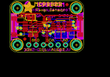

Contents
========

* [PROJ-ADAF-5027-STAN-01>Adafruit MCP9808 Breakout PCB](#proj-adaf-5027-stan-01adafruit-mcp9808-breakout-pcb)
	* [Images](#images)
	* [Interactive BOM](#interactive-bom)
	* [Tags](#tags)
  
![][im]
# PROJ-ADAF-5027-STAN-01>Adafruit MCP9808 Breakout PCB

- ID: PROJ-ADAF-5027-STAN-01
- Hex ID: PRA5027
- Name: Adafruit MCP9808 Breakout PCB
- Description: 

## Images
  
  

|eagleImage|
| :---: |
||

## Interactive BOM

- Interactive BOM page: [ibom.html](kicad/bom/ibom.html)

## Tags

- hexID: PRA5027
- oompType: PROJ
- oompSize: ADAF
- oompColor: 5027
- oompDesc: STAN
- oompIndex: 01
- oompName: Adafruit MCP9808 Breakout PCB
- sources: All source files from https://github.com/adafruit/Adafruit-MCP9808-Breakout-PCB (source licence details in srcLicense.md)
- linkBuyPage: http://www.adafruit.com/products/5027

[im]: eagleImage_450.png
