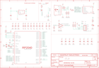

Contents
========

* [PRA5100 > Adafruit](#pra5100--adafruit)
	* [Schematic](#schematic)
	* [Interactive BOM](#interactive-bom)
	* [OOMP Parts](#oomp-parts)
	* [Images](#images)
	* [Tags](#tags)
  
![][im]
# PRA5100 > Adafruit

- ID: PROJ-ADAF-5100-STAN-01
- Hex ID: PRA5100
- Name: Adafruit
- Description: Adafruit
- Long Link: [http://oom.lt/PROJ-ADAF-5100-STAN-01](http://oom.lt/PROJ-ADAF-5100-STAN-01)
- Short Link: [http://oom.lt/PRA5100](http://oom.lt/PRA5100)

## Schematic
  

## Interactive BOM

- Interactive BOM page: [ibom.html](https://htmlpreview.github.io/?https://github.com/oomlout/oomlout_OOMP_projects/blob/main/PROJ-ADAF-5100-STAN-01/kicad/bom/ibom.html)

## OOMP Parts
  

|OOMP Parts|
| :---: |
|C1,CAPC-0603-X-UF1-01,C1,1uF,CAP_CERAMIC0603_NO,0603-NO,Ceramic Capacitors,,,,|
|C2,CAPC-0603-X-UF1-01,C2,1uF,CAP_CERAMIC0603_NO,0603-NO,Ceramic Capacitors,,,,|
|C3,CAPC-0603-X-NF100-V50,C3,0.1uF,CAP_CERAMIC0603_NO,0603-NO,Ceramic Capacitors,,,,|
|C4,CAPC-0603-X-NF100-V50,C4,0.1uF,CAP_CERAMIC0603_NO,0603-NO,Ceramic Capacitors,,,,|
|C5,CAPC-0603-X-NF100-V50,C5,0.1uF,CAP_CERAMIC0603_NO,0603-NO,Ceramic Capacitors,,,,|
|C6,CAPC-0805-X-UNMATCHED-01,C6,10µF,CAP_CERAMIC0805-NOOUTLINE,0805-NO,Ceramic Capacitors,,,,|
|C7,CAPC-0805-X-UF10-V10,C7,10uF,CAP_CERAMIC0805-NOOUTLINE,0805-NO,Ceramic Capacitors,,,,|
|C8,CAPC-0805-X-UNMATCHED-01,C8,10µF,CAP_CERAMIC0805-NOOUTLINE,0805-NO,Ceramic Capacitors,,,C,|
|C9,CAPC-0805-X-UF10-V10,C9,10uF,CAP_CERAMIC0805-NOOUTLINE,0805-NO,Ceramic Capacitors,,,,|
|C10,CAPC-0603-X-NF100-V50,C10,0.1uF,CAP_CERAMIC0603_NO,0603-NO,Ceramic Capacitors,,,,|
|C11,CAPC-0603-X-UF1-01,C11,1uF,CAP_CERAMIC0603_NO,0603-NO,Ceramic Capacitors,,,,|
|C12,CAPC-0603-X-NF100-V50,C12,0.1uF,CAP_CERAMIC0603_NO,0603-NO,Ceramic Capacitors,,,,|
|C13,CAPC-0603-X-NF100-V50,C13,0.1uF,CAP_CERAMIC0603_NO,0603-NO,Ceramic Capacitors,,,,|
|C14,CAPC-0805-X-UF10-V10,C14,10uF,CAP_CERAMIC0805-NOOUTLINE,0805-NO,Ceramic Capacitors,,,,|
|C15,CAPC-0603-X-UF1-01,C15,1uF,CAP_CERAMIC0603_NO,0603-NO,Ceramic Capacitors,,,,|
|C16,CAPC-0603-X-NF100-V50,C16,0.1uF,CAP_CERAMIC0603_NO,0603-NO,Ceramic Capacitors,,,,|
|C17,CAPC-0603-X-UF1-01,C17,1uF,CAP_CERAMIC0603_NO,0603-NO,Ceramic Capacitors,,,,|
|C18,CAPC-0603-X-NF100-V50,C18,0.1uF,CAP_CERAMIC0603_NO,0603-NO,Ceramic Capacitors,,,,|
|C19,CAPC-0603-X-UNMATCHED-01,C19,12pF,CAP_CERAMIC0603_NO,0603-NO,Ceramic Capacitors,,,,|
|C20,CAPC-0603-X-UNMATCHED-01,C20,12pF,CAP_CERAMIC0603_NO,0603-NO,Ceramic Capacitors,,,,|
|C21,CAPC-0603-X-NF100-V50,C21,0.1uF,CAP_CERAMIC0603_NO,0603-NO,Ceramic Capacitors,,,,|
|C22,CAPC-0805-X-UF10-V10,C22,10uF,CAP_CERAMIC0805-NOOUTLINE,0805-NO,Ceramic Capacitors,,,,|
|C23,CAPC-0805-X-UF10-V10,C23,10uF,CAP_CERAMIC0805-NOOUTLINE,0805-NO,Ceramic Capacitors,,,,|
|C24,CAPC-0805-X-UF10-V10,C24,10uF,CAP_CERAMIC0805-NOOUTLINE,0805-NO,Ceramic Capacitors,,,,|
|C25,CAPC-0805-X-UF10-V10,C25,10uF,CAP_CERAMIC0805-NOOUTLINE,0805-NO,Ceramic Capacitors,,,,|
|C26,CAPC-0603-X-NF100-V50,C26,0.1uF,CAP_CERAMIC0603_NO,0603-NO,Ceramic Capacitors,,,,|
|C27,CAPC-0603-X-NF100-V50,C27,0.1uF,CAP_CERAMIC0603_NO,0603-NO,Ceramic Capacitors,,,,|
|C28,CAPC-0603-X-NF100-V50,C28,0.1uF,CAP_CERAMIC0603_NO,0603-NO,Ceramic Capacitors,,,,|
|C29,CAPC-0603-X-NF100-V50,C29,0.1uF,CAP_CERAMIC0603_NO,0603-NO,Ceramic Capacitors,,,,|
|C30,CAPC-0603-X-UNMATCHED-01,C30,10nF,CAP_CERAMIC0603_NO,0603-NO,Ceramic Capacitors,,,,|
|C31,CAPC-0603-X-NF100-V50,C31,0.1uF,CAP_CERAMIC0603_NO,0603-NO,Ceramic Capacitors,,,,|
|CONN1,UNMATCHED-UNMATCHED-X-UNMATCHED-01,CONN1,STEMMA_I2C_QT,STEMMA_I2C_QT,JST_SH4,,,,,|
|D3,DIOD-S323-X-K4148-01,D3,1N4148,DIODESOD-323,SOD-323,Diode,,,,|
|IC1,UNMATCHED-SO235-X-UNMATCHED-01,IC1,74HCT1G125DBV,74AHC1G125DBV,SOT23-5,Single Bus Buffer Gate with 3-State Output,,0,,|
|IC2,UNMATCHED-SO23-X-UNMATCHED-01,IC2,PAM8301,PAM8301,SOT23-6,,,,,|
|IC3,UNMATCHED-UNMATCHED-X-UNMATCHED-01,IC3,RP2040_QFN56,RP2040_QFN56,QFN56_7MM_REDUCEDEPAD,,,,,|
|L,LEDS-0603-G-STAN-01,L,RED,LED0603_NOOUTLINE,CHIPLED_0603_NOOUTLINE,LED,,,,|
|LED1,UNMATCHED-UNMATCHED-X-UNMATCHED-01,LED1,WS2812B_SK6812E,WS2812B_SK6812E,NEO3535_REVERSE,,,,,|
|LED2,UNMATCHED-UNMATCHED-X-UNMATCHED-01,LED2,WS2812B_SK6812E,WS2812B_SK6812E,NEO3535_REVERSE,,,,,|
|LED3,UNMATCHED-UNMATCHED-X-UNMATCHED-01,LED3,WS2812B_SK6812E,WS2812B_SK6812E,NEO3535_REVERSE,,,,,|
|LED4,UNMATCHED-UNMATCHED-X-UNMATCHED-01,LED4,WS2812B_SK6812E,WS2812B_SK6812E,NEO3535_REVERSE,,,,,|
|LED5,UNMATCHED-UNMATCHED-X-UNMATCHED-01,LED5,WS2812B_SK6812E,WS2812B_SK6812E,NEO3535_REVERSE,,,,,|
|LED6,UNMATCHED-UNMATCHED-X-UNMATCHED-01,LED6,WS2812B_SK6812E,WS2812B_SK6812E,NEO3535_REVERSE,,,,,|
|LED7,UNMATCHED-UNMATCHED-X-UNMATCHED-01,LED7,WS2812B_SK6812E,WS2812B_SK6812E,NEO3535_REVERSE,,,,,|
|LED8,UNMATCHED-UNMATCHED-X-UNMATCHED-01,LED8,WS2812B_SK6812E,WS2812B_SK6812E,NEO3535_REVERSE,,,,,|
|LED9,UNMATCHED-UNMATCHED-X-UNMATCHED-01,LED9,WS2812B_SK6812E,WS2812B_SK6812E,NEO3535_REVERSE,,,,,|
|LED10,UNMATCHED-UNMATCHED-X-UNMATCHED-01,LED10,WS2812B_SK6812E,WS2812B_SK6812E,NEO3535_REVERSE,,,,,|
|LED11,UNMATCHED-UNMATCHED-X-UNMATCHED-01,LED11,WS2812B_SK6812E,WS2812B_SK6812E,NEO3535_REVERSE,,,,,|
|LED12,UNMATCHED-UNMATCHED-X-UNMATCHED-01,LED12,WS2812B_SK6812E,WS2812B_SK6812E,NEO3535_REVERSE,,,,,|
|R1,RESE-UNMATCHED-X-UNMATCHED-01,R1,5.1K,RESISTOR_4PACK,RESPACK_4X0603,Resistor Packs (4 resistors),,,,|
|R2,RESE-0603-X-O103-01,R2,10k,RESISTOR_0603_NOOUT,0603-NO,Resistors,,,,|
|R3,RESE-0603-X-O21-01,R3,22,RESISTOR_0603_NOOUT,0603-NO,Resistors,,,,|
|R4,RESE-0603-X-O21-01,R4,22,RESISTOR_0603_NOOUT,0603-NO,Resistors,,,,|
|R5,RESE-0603-X-O473-01,R5,47K,RESISTOR_0603_NOOUT,0603-NO,Resistors,,,,|
|R6,RESE-0603-X-O102-01,R6,1K,RESISTOR_0603_NOOUT,0603-NO,Resistors,,,,|
|R7,RESE-0603-X-O103-01,R7,10K,RESISTOR_0603_NOOUT,0603-NO,Resistors,,,,|
|R8,RESE-0603-X-O102-01,R8,1K,RESISTOR_0603_NOOUT,0603-NO,Resistors,,,,|
|R9,RESE-0603-X-UNMATCHED-01,R9,DNP,RESISTOR_0603_NOOUT,0603-NO,Resistors,,,,|
|R10,RESE-0603-X-O103-01,R10,10K,RESISTOR_0603_NOOUT,0603-NO,Resistors,,,,|
|R11,RESE-0603-X-O102-01,R11,1K,RESISTOR_0603_NOOUT,0603-NO,Resistors,,,,|
|R12,RESE-0603-X-O6803-01,R12,680K,RESISTOR_0603_NOOUT,0603-NO,Resistors,,,,|
|R14,RESE-UNMATCHED-X-UNMATCHED-01,R14,5.1K,RESISTOR_4PACK,RESPACK_4X0603,Resistor Packs (4 resistors),,,,|
|SP2,UNMATCHED-UNMATCHED-X-UNMATCHED-01,SP2,7.5mm SPK,SPEAKER_7.5MM,BUZZER_SMT_7.5MM,SPEAKER Source: BuerklinAdded PS12 (for part # PS1240 piezo) http://www.ladyada.net/library/pcb/eaglelibrary.html,,,,|
|SW1,UNMATCHED-UNMATCHED-X-UNMATCHED-01,SW1,PEC11,ENCODER_PLUS_SWITCH_BOURNS_PEC11,PEC11+SWITCH,Rotary Encoder with Built-In Switch,,,,|
|SW2,UNMATCHED-UNMATCHED-X-UNMATCHED-01,SW2,RA SW,SWITCH_SPST_TACT_RA,SPST_TACTILE_RA,Switch - SPST,,,,|
|TP1,UNMATCHED-UNMATCHED-X-UNMATCHED-01,TP1,SEWTAP_SMTNUTM3,SEWTAP_SMTNUTM3,SMT_NUT_3MM,,,,,|
|TP2,UNMATCHED-UNMATCHED-X-UNMATCHED-01,TP2,SEWTAP_SMTNUTM3,SEWTAP_SMTNUTM3,SMT_NUT_3MM,,,,,|
|TP3,UNMATCHED-UNMATCHED-X-UNMATCHED-01,TP3,SEWTAP_SMTNUTM3,SEWTAP_SMTNUTM3,SMT_NUT_3MM,,,,,|
|TP4,UNMATCHED-UNMATCHED-X-UNMATCHED-01,TP4,SEWTAP_SMTNUTM3,SEWTAP_SMTNUTM3,SMT_NUT_3MM,,,,,|
|TP5,UNMATCHED-UNMATCHED-X-UNMATCHED-01,TP5,,TESTPOINTROUND1.5MMNO,TESTPOINT_ROUND_1.5MM_NO,Test Point,,,,|
|TP6,UNMATCHED-UNMATCHED-X-UNMATCHED-01,TP6,,TESTPOINTROUND1.5MMNO,TESTPOINT_ROUND_1.5MM_NO,Test Point,,,,|
|U$1,UNMATCHED-UNMATCHED-X-UNMATCHED-01,U$1,SOCKET,KBD_SWITCH_KAILH_SOCKETBOX_JADE_KAILH_SOCKET,KAILH_SOCKET,,,,,|
|U$2,UNMATCHED-UNMATCHED-X-UNMATCHED-01,U$2,SOCKET,KBD_SWITCH_KAILH_SOCKETBOX_JADE_KAILH_SOCKET,KAILH_SOCKET,,,,,|
|U$3,UNMATCHED-UNMATCHED-X-UNMATCHED-01,U$3,SOCKET,KBD_SWITCH_KAILH_SOCKETBOX_JADE_KAILH_SOCKET,KAILH_SOCKET,,,,,|
|U$4,UNMATCHED-UNMATCHED-X-UNMATCHED-01,U$4,SOCKET,KBD_SWITCH_KAILH_SOCKETBOX_JADE_KAILH_SOCKET,KAILH_SOCKET,,,,,|
|U$5,UNMATCHED-UNMATCHED-X-UNMATCHED-01,U$5,SOCKET,KBD_SWITCH_KAILH_SOCKETBOX_JADE_KAILH_SOCKET,KAILH_SOCKET,,,,,|
|U$6,UNMATCHED-UNMATCHED-X-UNMATCHED-01,U$6,SOCKET,KBD_SWITCH_KAILH_SOCKETBOX_JADE_KAILH_SOCKET,KAILH_SOCKET,,,,,|
|U$12,UNMATCHED-UNMATCHED-X-UNMATCHED-01,U$12,SOCKET,KBD_SWITCH_KAILH_SOCKETBOX_JADE_KAILH_SOCKET,KAILH_SOCKET,,,,,|
|U$13,UNMATCHED-UNMATCHED-X-UNMATCHED-01,U$13,SOCKET,KBD_SWITCH_KAILH_SOCKETBOX_JADE_KAILH_SOCKET,KAILH_SOCKET,,,,,|
|U$40,UNMATCHED-UNMATCHED-X-UNMATCHED-01,U$34,FIDUCIAL_1MM,FIDUCIAL_1MM,FIDUCIAL_1MM,Fiducial Alignment Points,EXCLUDE,,,|
|U$41,UNMATCHED-UNMATCHED-X-UNMATCHED-01,U$35,FIDUCIAL_1MM,FIDUCIAL_1MM,FIDUCIAL_1MM,Fiducial Alignment Points,EXCLUDE,,,|
|U$42,UNMATCHED-UNMATCHED-X-UNMATCHED-01,U$40,SOCKET,KBD_SWITCH_KAILH_SOCKETBOX_JADE_KAILH_SOCKET,KAILH_SOCKET,,,,,|
|U$43,UNMATCHED-UNMATCHED-X-UNMATCHED-01,U$41,SOCKET,KBD_SWITCH_KAILH_SOCKETBOX_JADE_KAILH_SOCKET,KAILH_SOCKET,,,,,|
|U1,UNMATCHED-UNMATCHED-X-UNMATCHED-01,U$42,SOCKET,KBD_SWITCH_KAILH_SOCKETBOX_JADE_KAILH_SOCKET,KAILH_SOCKET,,,,,|
|U2,VREG-SO235-X-KAP2112K-V33D,U$43,SOCKET,KBD_SWITCH_KAILH_SOCKETBOX_JADE_KAILH_SOCKET,KAILH_SOCKET,,,,,|
|X1,UNMATCHED-UNMATCHED-X-UNMATCHED-01,U$80,FIDUCIAL_1MM,FIDUCIAL_1MM,FIDUCIAL_1MM,Fiducial Alignment Points,EXCLUDE,,,|
|X2,UNMATCHED-UNMATCHED-X-UNMATCHED-01,U1,GD25x16,SPIFLASH_8PIN_4X4,USON8_4X4,SOIC8 SPI Flash,,,,|
|Y1,UNMATCHED-UNMATCHED-X-UNMATCHED-01,U2,AP2112K-3.3,VREG_SOT23-5,SOT23-5,SOT23-5 Fixed Voltage Regulators,,,,|

## Images
  
  

|kicadPcb3d|kicadPcb3dFront|kicadPcb3dBack|eagleImage|eagleSchemImage|
| :---: | :---: | :---: | :---: | :---: |
||||||

## Tags

- hexID: PRA5100
- oompType: PROJ
- oompSize: ADAF
- oompColor: 5100
- oompDesc: STAN
- oompIndex: 01
- oompName: Adafruit MacroPad RP2040 PCB
- sources: All source files from https://github.com/adafruit/Adafruit-MacroPad-RP2040-PCB (source licence details in srcLicense.md)
- linkBuyPage: http://www.adafruit.com/products/5100
- oompID: PROJ-ADAF-5100-STAN-01
- oompParts: C1,CAPC-0603-X-UF1-01
- oompParts: C2,CAPC-0603-X-UF1-01
- oompParts: C3,CAPC-0603-X-NF100-V50
- oompParts: C4,CAPC-0603-X-NF100-V50
- oompParts: C5,CAPC-0603-X-NF100-V50
- oompParts: C6,CAPC-0805-X-UNMATCHED-01
- oompParts: C7,CAPC-0805-X-UF10-V10
- oompParts: C8,CAPC-0805-X-UNMATCHED-01
- oompParts: C9,CAPC-0805-X-UF10-V10
- oompParts: C10,CAPC-0603-X-NF100-V50
- oompParts: C11,CAPC-0603-X-UF1-01
- oompParts: C12,CAPC-0603-X-NF100-V50
- oompParts: C13,CAPC-0603-X-NF100-V50
- oompParts: C14,CAPC-0805-X-UF10-V10
- oompParts: C15,CAPC-0603-X-UF1-01
- oompParts: C16,CAPC-0603-X-NF100-V50
- oompParts: C17,CAPC-0603-X-UF1-01
- oompParts: C18,CAPC-0603-X-NF100-V50
- oompParts: C19,CAPC-0603-X-UNMATCHED-01
- oompParts: C20,CAPC-0603-X-UNMATCHED-01
- oompParts: C21,CAPC-0603-X-NF100-V50
- oompParts: C22,CAPC-0805-X-UF10-V10
- oompParts: C23,CAPC-0805-X-UF10-V10
- oompParts: C24,CAPC-0805-X-UF10-V10
- oompParts: C25,CAPC-0805-X-UF10-V10
- oompParts: C26,CAPC-0603-X-NF100-V50
- oompParts: C27,CAPC-0603-X-NF100-V50
- oompParts: C28,CAPC-0603-X-NF100-V50
- oompParts: C29,CAPC-0603-X-NF100-V50
- oompParts: C30,CAPC-0603-X-UNMATCHED-01
- oompParts: C31,CAPC-0603-X-NF100-V50
- oompParts: CONN1,UNMATCHED-UNMATCHED-X-UNMATCHED-01
- oompParts: D3,DIOD-S323-X-K4148-01
- oompParts: IC1,UNMATCHED-SO235-X-UNMATCHED-01
- oompParts: IC2,UNMATCHED-SO23-X-UNMATCHED-01
- oompParts: IC3,UNMATCHED-UNMATCHED-X-UNMATCHED-01
- oompParts: L,LEDS-0603-G-STAN-01
- oompParts: LED1,UNMATCHED-UNMATCHED-X-UNMATCHED-01
- oompParts: LED2,UNMATCHED-UNMATCHED-X-UNMATCHED-01
- oompParts: LED3,UNMATCHED-UNMATCHED-X-UNMATCHED-01
- oompParts: LED4,UNMATCHED-UNMATCHED-X-UNMATCHED-01
- oompParts: LED5,UNMATCHED-UNMATCHED-X-UNMATCHED-01
- oompParts: LED6,UNMATCHED-UNMATCHED-X-UNMATCHED-01
- oompParts: LED7,UNMATCHED-UNMATCHED-X-UNMATCHED-01
- oompParts: LED8,UNMATCHED-UNMATCHED-X-UNMATCHED-01
- oompParts: LED9,UNMATCHED-UNMATCHED-X-UNMATCHED-01
- oompParts: LED10,UNMATCHED-UNMATCHED-X-UNMATCHED-01
- oompParts: LED11,UNMATCHED-UNMATCHED-X-UNMATCHED-01
- oompParts: LED12,UNMATCHED-UNMATCHED-X-UNMATCHED-01
- oompParts: R1,RESE-UNMATCHED-X-UNMATCHED-01
- oompParts: R2,RESE-0603-X-O103-01
- oompParts: R3,RESE-0603-X-O21-01
- oompParts: R4,RESE-0603-X-O21-01
- oompParts: R5,RESE-0603-X-O473-01
- oompParts: R6,RESE-0603-X-O102-01
- oompParts: R7,RESE-0603-X-O103-01
- oompParts: R8,RESE-0603-X-O102-01
- oompParts: R9,RESE-0603-X-UNMATCHED-01
- oompParts: R10,RESE-0603-X-O103-01
- oompParts: R11,RESE-0603-X-O102-01
- oompParts: R12,RESE-0603-X-O6803-01
- oompParts: R14,RESE-UNMATCHED-X-UNMATCHED-01
- oompParts: SP2,UNMATCHED-UNMATCHED-X-UNMATCHED-01
- oompParts: SW1,UNMATCHED-UNMATCHED-X-UNMATCHED-01
- oompParts: SW2,UNMATCHED-UNMATCHED-X-UNMATCHED-01
- oompParts: TP1,UNMATCHED-UNMATCHED-X-UNMATCHED-01
- oompParts: TP2,UNMATCHED-UNMATCHED-X-UNMATCHED-01
- oompParts: TP3,UNMATCHED-UNMATCHED-X-UNMATCHED-01
- oompParts: TP4,UNMATCHED-UNMATCHED-X-UNMATCHED-01
- oompParts: TP5,UNMATCHED-UNMATCHED-X-UNMATCHED-01
- oompParts: TP6,UNMATCHED-UNMATCHED-X-UNMATCHED-01
- oompParts: U$1,UNMATCHED-UNMATCHED-X-UNMATCHED-01
- oompParts: U$2,UNMATCHED-UNMATCHED-X-UNMATCHED-01
- oompParts: U$3,UNMATCHED-UNMATCHED-X-UNMATCHED-01
- oompParts: U$4,UNMATCHED-UNMATCHED-X-UNMATCHED-01
- oompParts: U$5,UNMATCHED-UNMATCHED-X-UNMATCHED-01
- oompParts: U$6,UNMATCHED-UNMATCHED-X-UNMATCHED-01
- oompParts: U$12,UNMATCHED-UNMATCHED-X-UNMATCHED-01
- oompParts: U$13,UNMATCHED-UNMATCHED-X-UNMATCHED-01
- oompParts: U$40,UNMATCHED-UNMATCHED-X-UNMATCHED-01
- oompParts: U$41,UNMATCHED-UNMATCHED-X-UNMATCHED-01
- oompParts: U$42,UNMATCHED-UNMATCHED-X-UNMATCHED-01
- oompParts: U$43,UNMATCHED-UNMATCHED-X-UNMATCHED-01
- oompParts: U1,UNMATCHED-UNMATCHED-X-UNMATCHED-01
- oompParts: U2,VREG-SO235-X-KAP2112K-V33D
- oompParts: X1,UNMATCHED-UNMATCHED-X-UNMATCHED-01
- oompParts: X2,UNMATCHED-UNMATCHED-X-UNMATCHED-01
- oompParts: Y1,UNMATCHED-UNMATCHED-X-UNMATCHED-01
- rawParts: C1,1uF,CAP_CERAMIC0603_NO,0603-NO,Ceramic Capacitors,,,,
- rawParts: C2,1uF,CAP_CERAMIC0603_NO,0603-NO,Ceramic Capacitors,,,,
- rawParts: C3,0.1uF,CAP_CERAMIC0603_NO,0603-NO,Ceramic Capacitors,,,,
- rawParts: C4,0.1uF,CAP_CERAMIC0603_NO,0603-NO,Ceramic Capacitors,,,,
- rawParts: C5,0.1uF,CAP_CERAMIC0603_NO,0603-NO,Ceramic Capacitors,,,,
- rawParts: C6,10µF,CAP_CERAMIC0805-NOOUTLINE,0805-NO,Ceramic Capacitors,,,,
- rawParts: C7,10uF,CAP_CERAMIC0805-NOOUTLINE,0805-NO,Ceramic Capacitors,,,,
- rawParts: C8,10µF,CAP_CERAMIC0805-NOOUTLINE,0805-NO,Ceramic Capacitors,,,C,
- rawParts: C9,10uF,CAP_CERAMIC0805-NOOUTLINE,0805-NO,Ceramic Capacitors,,,,
- rawParts: C10,0.1uF,CAP_CERAMIC0603_NO,0603-NO,Ceramic Capacitors,,,,
- rawParts: C11,1uF,CAP_CERAMIC0603_NO,0603-NO,Ceramic Capacitors,,,,
- rawParts: C12,0.1uF,CAP_CERAMIC0603_NO,0603-NO,Ceramic Capacitors,,,,
- rawParts: C13,0.1uF,CAP_CERAMIC0603_NO,0603-NO,Ceramic Capacitors,,,,
- rawParts: C14,10uF,CAP_CERAMIC0805-NOOUTLINE,0805-NO,Ceramic Capacitors,,,,
- rawParts: C15,1uF,CAP_CERAMIC0603_NO,0603-NO,Ceramic Capacitors,,,,
- rawParts: C16,0.1uF,CAP_CERAMIC0603_NO,0603-NO,Ceramic Capacitors,,,,
- rawParts: C17,1uF,CAP_CERAMIC0603_NO,0603-NO,Ceramic Capacitors,,,,
- rawParts: C18,0.1uF,CAP_CERAMIC0603_NO,0603-NO,Ceramic Capacitors,,,,
- rawParts: C19,12pF,CAP_CERAMIC0603_NO,0603-NO,Ceramic Capacitors,,,,
- rawParts: C20,12pF,CAP_CERAMIC0603_NO,0603-NO,Ceramic Capacitors,,,,
- rawParts: C21,0.1uF,CAP_CERAMIC0603_NO,0603-NO,Ceramic Capacitors,,,,
- rawParts: C22,10uF,CAP_CERAMIC0805-NOOUTLINE,0805-NO,Ceramic Capacitors,,,,
- rawParts: C23,10uF,CAP_CERAMIC0805-NOOUTLINE,0805-NO,Ceramic Capacitors,,,,
- rawParts: C24,10uF,CAP_CERAMIC0805-NOOUTLINE,0805-NO,Ceramic Capacitors,,,,
- rawParts: C25,10uF,CAP_CERAMIC0805-NOOUTLINE,0805-NO,Ceramic Capacitors,,,,
- rawParts: C26,0.1uF,CAP_CERAMIC0603_NO,0603-NO,Ceramic Capacitors,,,,
- rawParts: C27,0.1uF,CAP_CERAMIC0603_NO,0603-NO,Ceramic Capacitors,,,,
- rawParts: C28,0.1uF,CAP_CERAMIC0603_NO,0603-NO,Ceramic Capacitors,,,,
- rawParts: C29,0.1uF,CAP_CERAMIC0603_NO,0603-NO,Ceramic Capacitors,,,,
- rawParts: C30,10nF,CAP_CERAMIC0603_NO,0603-NO,Ceramic Capacitors,,,,
- rawParts: C31,0.1uF,CAP_CERAMIC0603_NO,0603-NO,Ceramic Capacitors,,,,
- rawParts: CONN1,STEMMA_I2C_QT,STEMMA_I2C_QT,JST_SH4,,,,,
- rawParts: D3,1N4148,DIODESOD-323,SOD-323,Diode,,,,
- rawParts: IC1,74HCT1G125DBV,74AHC1G125DBV,SOT23-5,Single Bus Buffer Gate with 3-State Output,,0,,
- rawParts: IC2,PAM8301,PAM8301,SOT23-6,,,,,
- rawParts: IC3,RP2040_QFN56,RP2040_QFN56,QFN56_7MM_REDUCEDEPAD,,,,,
- rawParts: L,RED,LED0603_NOOUTLINE,CHIPLED_0603_NOOUTLINE,LED,,,,
- rawParts: LED1,WS2812B_SK6812E,WS2812B_SK6812E,NEO3535_REVERSE,,,,,
- rawParts: LED2,WS2812B_SK6812E,WS2812B_SK6812E,NEO3535_REVERSE,,,,,
- rawParts: LED3,WS2812B_SK6812E,WS2812B_SK6812E,NEO3535_REVERSE,,,,,
- rawParts: LED4,WS2812B_SK6812E,WS2812B_SK6812E,NEO3535_REVERSE,,,,,
- rawParts: LED5,WS2812B_SK6812E,WS2812B_SK6812E,NEO3535_REVERSE,,,,,
- rawParts: LED6,WS2812B_SK6812E,WS2812B_SK6812E,NEO3535_REVERSE,,,,,
- rawParts: LED7,WS2812B_SK6812E,WS2812B_SK6812E,NEO3535_REVERSE,,,,,
- rawParts: LED8,WS2812B_SK6812E,WS2812B_SK6812E,NEO3535_REVERSE,,,,,
- rawParts: LED9,WS2812B_SK6812E,WS2812B_SK6812E,NEO3535_REVERSE,,,,,
- rawParts: LED10,WS2812B_SK6812E,WS2812B_SK6812E,NEO3535_REVERSE,,,,,
- rawParts: LED11,WS2812B_SK6812E,WS2812B_SK6812E,NEO3535_REVERSE,,,,,
- rawParts: LED12,WS2812B_SK6812E,WS2812B_SK6812E,NEO3535_REVERSE,,,,,
- rawParts: R1,5.1K,RESISTOR_4PACK,RESPACK_4X0603,Resistor Packs (4 resistors),,,,
- rawParts: R2,10k,RESISTOR_0603_NOOUT,0603-NO,Resistors,,,,
- rawParts: R3,22,RESISTOR_0603_NOOUT,0603-NO,Resistors,,,,
- rawParts: R4,22,RESISTOR_0603_NOOUT,0603-NO,Resistors,,,,
- rawParts: R5,47K,RESISTOR_0603_NOOUT,0603-NO,Resistors,,,,
- rawParts: R6,1K,RESISTOR_0603_NOOUT,0603-NO,Resistors,,,,
- rawParts: R7,10K,RESISTOR_0603_NOOUT,0603-NO,Resistors,,,,
- rawParts: R8,1K,RESISTOR_0603_NOOUT,0603-NO,Resistors,,,,
- rawParts: R9,DNP,RESISTOR_0603_NOOUT,0603-NO,Resistors,,,,
- rawParts: R10,10K,RESISTOR_0603_NOOUT,0603-NO,Resistors,,,,
- rawParts: R11,1K,RESISTOR_0603_NOOUT,0603-NO,Resistors,,,,
- rawParts: R12,680K,RESISTOR_0603_NOOUT,0603-NO,Resistors,,,,
- rawParts: R14,5.1K,RESISTOR_4PACK,RESPACK_4X0603,Resistor Packs (4 resistors),,,,
- rawParts: SP2,7.5mm SPK,SPEAKER_7.5MM,BUZZER_SMT_7.5MM,SPEAKER Source: BuerklinAdded PS12 (for part # PS1240 piezo) http://www.ladyada.net/library/pcb/eaglelibrary.html,,,,
- rawParts: SW1,PEC11,ENCODER_PLUS_SWITCH_BOURNS_PEC11,PEC11+SWITCH,Rotary Encoder with Built-In Switch,,,,
- rawParts: SW2,RA SW,SWITCH_SPST_TACT_RA,SPST_TACTILE_RA,Switch - SPST,,,,
- rawParts: TP1,SEWTAP_SMTNUTM3,SEWTAP_SMTNUTM3,SMT_NUT_3MM,,,,,
- rawParts: TP2,SEWTAP_SMTNUTM3,SEWTAP_SMTNUTM3,SMT_NUT_3MM,,,,,
- rawParts: TP3,SEWTAP_SMTNUTM3,SEWTAP_SMTNUTM3,SMT_NUT_3MM,,,,,
- rawParts: TP4,SEWTAP_SMTNUTM3,SEWTAP_SMTNUTM3,SMT_NUT_3MM,,,,,
- rawParts: TP5,,TESTPOINTROUND1.5MMNO,TESTPOINT_ROUND_1.5MM_NO,Test Point,,,,
- rawParts: TP6,,TESTPOINTROUND1.5MMNO,TESTPOINT_ROUND_1.5MM_NO,Test Point,,,,
- rawParts: U$1,SOCKET,KBD_SWITCH_KAILH_SOCKETBOX_JADE_KAILH_SOCKET,KAILH_SOCKET,,,,,
- rawParts: U$2,SOCKET,KBD_SWITCH_KAILH_SOCKETBOX_JADE_KAILH_SOCKET,KAILH_SOCKET,,,,,
- rawParts: U$3,SOCKET,KBD_SWITCH_KAILH_SOCKETBOX_JADE_KAILH_SOCKET,KAILH_SOCKET,,,,,
- rawParts: U$4,SOCKET,KBD_SWITCH_KAILH_SOCKETBOX_JADE_KAILH_SOCKET,KAILH_SOCKET,,,,,
- rawParts: U$5,SOCKET,KBD_SWITCH_KAILH_SOCKETBOX_JADE_KAILH_SOCKET,KAILH_SOCKET,,,,,
- rawParts: U$6,SOCKET,KBD_SWITCH_KAILH_SOCKETBOX_JADE_KAILH_SOCKET,KAILH_SOCKET,,,,,
- rawParts: U$12,SOCKET,KBD_SWITCH_KAILH_SOCKETBOX_JADE_KAILH_SOCKET,KAILH_SOCKET,,,,,
- rawParts: U$13,SOCKET,KBD_SWITCH_KAILH_SOCKETBOX_JADE_KAILH_SOCKET,KAILH_SOCKET,,,,,
- rawParts: U$34,FIDUCIAL_1MM,FIDUCIAL_1MM,FIDUCIAL_1MM,Fiducial Alignment Points,EXCLUDE,,,
- rawParts: U$35,FIDUCIAL_1MM,FIDUCIAL_1MM,FIDUCIAL_1MM,Fiducial Alignment Points,EXCLUDE,,,
- rawParts: U$40,SOCKET,KBD_SWITCH_KAILH_SOCKETBOX_JADE_KAILH_SOCKET,KAILH_SOCKET,,,,,
- rawParts: U$41,SOCKET,KBD_SWITCH_KAILH_SOCKETBOX_JADE_KAILH_SOCKET,KAILH_SOCKET,,,,,
- rawParts: U$42,SOCKET,KBD_SWITCH_KAILH_SOCKETBOX_JADE_KAILH_SOCKET,KAILH_SOCKET,,,,,
- rawParts: U$43,SOCKET,KBD_SWITCH_KAILH_SOCKETBOX_JADE_KAILH_SOCKET,KAILH_SOCKET,,,,,
- rawParts: U$80,FIDUCIAL_1MM,FIDUCIAL_1MM,FIDUCIAL_1MM,Fiducial Alignment Points,EXCLUDE,,,
- rawParts: U1,GD25x16,SPIFLASH_8PIN_4X4,USON8_4X4,SOIC8 SPI Flash,,,,
- rawParts: U2,AP2112K-3.3,VREG_SOT23-5,SOT23-5,SOT23-5 Fixed Voltage Regulators,,,,
- rawParts: X1,TYPE C,USB_C,USB_C_CUSB31-CFM2AX-01-X,USB Type-C USB 2.0 Connector,,,,
- rawParts: X2,ZJY130-2864KSWLG22,ZJY130-2864KSWLG22,ZJY130-2864KSWLG22,,,,,
- rawParts: Y1,12MHZ,CRYSTAL2.5X2.0,CRYSTAL_2.5X2,Crystals,,,,

[im]: kicadPcb3d_450.png
