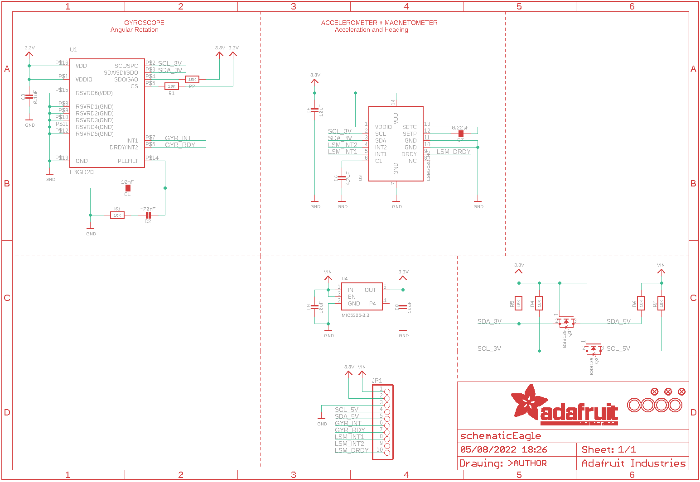
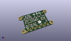
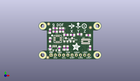
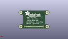
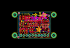
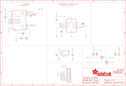

Contents
========

* [PRA512 > Adafruit](#pra512--adafruit)
	* [Schematic](#schematic)
	* [Interactive BOM](#interactive-bom)
	* [OOMP Parts](#oomp-parts)
	* [Images](#images)
	* [Tags](#tags)
  
![][im]
# PRA512 > Adafruit

- ID: PROJ-ADAF-512-STAN-01
- Hex ID: PRA512
- Name: Adafruit
- Description: Adafruit
- Long Link: [http://oom.lt/PROJ-ADAF-512-STAN-01](http://oom.lt/PROJ-ADAF-512-STAN-01)
- Short Link: [http://oom.lt/PRA512](http://oom.lt/PRA512)

## Schematic
  

## Interactive BOM

- Interactive BOM page: [ibom.html](https://htmlpreview.github.io/?https://github.com/oomlout/oomlout_OOMP_projects/blob/main/PROJ-ADAF-512-STAN-01/kicad/bom/ibom.html)

## OOMP Parts
  

|OOMP Parts|
| :---: |
|C1,CAPC-0805-X-UNMATCHED-01,C1,10nF,CAP_CERAMIC_0805MP,_0805MP,Ceramic Capacitors,,|
|C2,CAPC-0805-X-UNMATCHED-01,C2,470nF,CAP_CERAMIC_0805MP,_0805MP,Ceramic Capacitors,,|
|C3,CAPC-0805-X-NF100-V50,C3,0.1uF,CAP_CERAMIC_0805MP,_0805MP,Ceramic Capacitors,,|
|C5,CAPC-0805-X-UF10-V10,C5,10uF,CAP_CERAMIC_0805MP,_0805MP,Ceramic Capacitors,,|
|C6,CAPC-0805-X-UNMATCHED-01,C6,4.7uF,CAP_CERAMIC_0805MP,_0805MP,Ceramic Capacitors,,|
|C7,CAPC-0805-X-UNMATCHED-01,C7,0.22µF,CAP_CERAMIC_0805MP,_0805MP,Ceramic Capacitors,,|
|C8,CAPC-0805-X-UF10-V10,C8,10uF,CAP_CERAMIC_0805MP,_0805MP,Ceramic Capacitors,,|
|C9,CAPC-0805-X-UF10-V10,C9,10uF,CAP_CERAMIC_0805MP,_0805MP,Ceramic Capacitors,,|
|JP1,HEAD-I01-X-PI10-01,FID1,FIDUCIAL,FIDUCIAL,FIDUCIAL_1MM,Fiducial Alignment Points,EXCLUDE,|
|Q1,MOSN-SO23-X-KBSS138-01,FID2,FIDUCIAL,FIDUCIAL,FIDUCIAL_1MM,Fiducial Alignment Points,EXCLUDE,|
|Q2,MOSN-SO23-X-KBSS138-01,FID3,FIDUCIAL,FIDUCIAL,FIDUCIAL_1MM,Fiducial Alignment Points,EXCLUDE,|
|R1,RESE-0805-X-O103-01,JP1,,HEADER-1X10ROUND,1X10_ROUND,PIN HEADER,,|
|R2,RESE-0805-X-O103-01,Q1,BSS138,MOSFET-NWIDE,SOT23-WIDE,N-Channel Mosfet,,|
|R3,RESE-0805-X-O103-01,Q2,BSS138,MOSFET-NWIDE,SOT23-WIDE,N-Channel Mosfet,,|
|R4,RESE-0805-X-O103-01,R1,10K,RESISTOR_0805MP,_0805MP,Resistors,,|
|R5,RESE-0805-X-O103-01,R2,10K,RESISTOR_0805MP,_0805MP,Resistors,,|
|R6,RESE-0805-X-O103-01,R3,10K,RESISTOR_0805MP,_0805MP,Resistors,,|
|R7,RESE-0805-X-O103-01,R4,10K,RESISTOR_0805MP,_0805MP,Resistors,,|
|U1,UNMATCHED-UNMATCHED-X-UNMATCHED-01,R5,10K,RESISTOR_0805MP,_0805MP,Resistors,,|
|U2,UNMATCHED-UNMATCHED-X-UNMATCHED-01,R6,10K,RESISTOR_0805MP,_0805MP,Resistors,,|
|U4,VREG-SO235-X-KMIC5225-V33D,R7,10K,RESISTOR_0805MP,_0805MP,Resistors,,|

## Images
  
  

|kicadPcb3d|kicadPcb3dFront|kicadPcb3dBack|eagleImage|eagleSchemImage|
| :---: | :---: | :---: | :---: | :---: |
||||||

## Tags

- hexID: PRA512
- oompType: PROJ
- oompSize: ADAF
- oompColor: 512
- oompDesc: STAN
- oompIndex: 01
- oompName: Adafruit 9 DOF and 10 DOF PCBs
- sources: All source files from https://github.com/adafruit/Adafruit-9-DOF-and-10-DOF-PCBs (source licence details in srcLicense.md)
- linkBuyPage: http://www.adafruit.com/products/512
- oompID: PROJ-ADAF-512-STAN-01
- oompParts: C1,CAPC-0805-X-UNMATCHED-01
- oompParts: C2,CAPC-0805-X-UNMATCHED-01
- oompParts: C3,CAPC-0805-X-NF100-V50
- oompParts: C5,CAPC-0805-X-UF10-V10
- oompParts: C6,CAPC-0805-X-UNMATCHED-01
- oompParts: C7,CAPC-0805-X-UNMATCHED-01
- oompParts: C8,CAPC-0805-X-UF10-V10
- oompParts: C9,CAPC-0805-X-UF10-V10
- oompParts: JP1,HEAD-I01-X-PI10-01
- oompParts: Q1,MOSN-SO23-X-KBSS138-01
- oompParts: Q2,MOSN-SO23-X-KBSS138-01
- oompParts: R1,RESE-0805-X-O103-01
- oompParts: R2,RESE-0805-X-O103-01
- oompParts: R3,RESE-0805-X-O103-01
- oompParts: R4,RESE-0805-X-O103-01
- oompParts: R5,RESE-0805-X-O103-01
- oompParts: R6,RESE-0805-X-O103-01
- oompParts: R7,RESE-0805-X-O103-01
- oompParts: U1,UNMATCHED-UNMATCHED-X-UNMATCHED-01
- oompParts: U2,UNMATCHED-UNMATCHED-X-UNMATCHED-01
- oompParts: U4,VREG-SO235-X-KMIC5225-V33D
- rawParts: C1,10nF,CAP_CERAMIC_0805MP,_0805MP,Ceramic Capacitors,,
- rawParts: C2,470nF,CAP_CERAMIC_0805MP,_0805MP,Ceramic Capacitors,,
- rawParts: C3,0.1uF,CAP_CERAMIC_0805MP,_0805MP,Ceramic Capacitors,,
- rawParts: C5,10uF,CAP_CERAMIC_0805MP,_0805MP,Ceramic Capacitors,,
- rawParts: C6,4.7uF,CAP_CERAMIC_0805MP,_0805MP,Ceramic Capacitors,,
- rawParts: C7,0.22µF,CAP_CERAMIC_0805MP,_0805MP,Ceramic Capacitors,,
- rawParts: C8,10uF,CAP_CERAMIC_0805MP,_0805MP,Ceramic Capacitors,,
- rawParts: C9,10uF,CAP_CERAMIC_0805MP,_0805MP,Ceramic Capacitors,,
- rawParts: FID1,FIDUCIAL,FIDUCIAL,FIDUCIAL_1MM,Fiducial Alignment Points,EXCLUDE,
- rawParts: FID2,FIDUCIAL,FIDUCIAL,FIDUCIAL_1MM,Fiducial Alignment Points,EXCLUDE,
- rawParts: FID3,FIDUCIAL,FIDUCIAL,FIDUCIAL_1MM,Fiducial Alignment Points,EXCLUDE,
- rawParts: JP1,,HEADER-1X10ROUND,1X10_ROUND,PIN HEADER,,
- rawParts: Q1,BSS138,MOSFET-NWIDE,SOT23-WIDE,N-Channel Mosfet,,
- rawParts: Q2,BSS138,MOSFET-NWIDE,SOT23-WIDE,N-Channel Mosfet,,
- rawParts: R1,10K,RESISTOR_0805MP,_0805MP,Resistors,,
- rawParts: R2,10K,RESISTOR_0805MP,_0805MP,Resistors,,
- rawParts: R3,10K,RESISTOR_0805MP,_0805MP,Resistors,,
- rawParts: R4,10K,RESISTOR_0805MP,_0805MP,Resistors,,
- rawParts: R5,10K,RESISTOR_0805MP,_0805MP,Resistors,,
- rawParts: R6,10K,RESISTOR_0805MP,_0805MP,Resistors,,
- rawParts: R7,10K,RESISTOR_0805MP,_0805MP,Resistors,,
- rawParts: U$28,MOUNTINGHOLE2.5_THICK,MOUNTINGHOLE2.5_THICK,MOUNTINGHOLE_2.5_PLATED_THICK,Mounting Hole,EXCLUDE,
- rawParts: U$29,MOUNTINGHOLE2.5_THICK,MOUNTINGHOLE2.5_THICK,MOUNTINGHOLE_2.5_PLATED_THICK,Mounting Hole,EXCLUDE,
- rawParts: U$30,MOUNTINGHOLE2.5_THICK,MOUNTINGHOLE2.5_THICK,MOUNTINGHOLE_2.5_PLATED_THICK,Mounting Hole,EXCLUDE,
- rawParts: U$31,MOUNTINGHOLE2.5_THICK,MOUNTINGHOLE2.5_THICK,MOUNTINGHOLE_2.5_PLATED_THICK,Mounting Hole,EXCLUDE,
- rawParts: U1,L3GD20,GYRO_L3G2400D,L3G4200D_LGA16L,L3G4200D - 3-Axis MEMS gyroscope/motion sensor,,
- rawParts: U2,LSM303DLHC,LSM303DLHC,LGA14,LSM303DLHC 3-Axis I2C Accelerometer and 3-Axis Magnetometer,,
- rawParts: U4,MIC5225-3.3,VREG_SOT23-5,SOT23-5,SOT23-5 Fixed Voltage Regulators,,

[im]: kicadPcb3d_450.png
