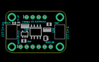

Contents
========

* [PROJ-ADAF-5146-STAN-01>Adafruit 24LC32 PCB](#proj-adaf-5146-stan-01adafruit-24lc32-pcb)
	* [Images](#images)
	* [Interactive BOM](#interactive-bom)
	* [OOMP Parts](#oomp-parts)
	* [Tags](#tags)
  
![][im]
# PROJ-ADAF-5146-STAN-01>Adafruit 24LC32 PCB

- ID: PROJ-ADAF-5146-STAN-01
- Hex ID: PRA5146
- Name: Adafruit 24LC32 PCB
- Description: 

## Images
  
  

|eagleImage|
| :---: |
||

## Interactive BOM

- Interactive BOM page: [ibom.html](kicad/bom/ibom.html)

## OOMP Parts
  

|OOMP Parts|
| :---: |
|<table><tr><td></td><td> C1</td><td>[CAPC-0603-X-NF100-V50 SMD (0603) 100 nF Capacitor (Ceramic) 50v](https://github.com/oomlout/oomlout_OOMP_parts/tree/main/CAPC-0603-X-NF100-V50/)</td><td>[C6N100](https://github.com/oomlout/oomlout_OOMP_parts/tree/main/CAPC-0603-X-NF100-V50/)</td></tr></table>|
|<table><tr><td></td><td> C2</td><td>[CAPC-0805-X-UF10-V25 SMD (0805) 10 uF Capacitor (Ceramic) 25v](https://github.com/oomlout/oomlout_OOMP_parts/tree/main/CAPC-0805-X-UF10-V25/)</td><td>[C85U010](https://github.com/oomlout/oomlout_OOMP_parts/tree/main/CAPC-0805-X-UF10-V25/)</td></tr></table>|
|<table><tr><td></td><td> C3</td><td>[CAPC-0805-X-UF10-V25 SMD (0805) 10 uF Capacitor (Ceramic) 25v](https://github.com/oomlout/oomlout_OOMP_parts/tree/main/CAPC-0805-X-UF10-V25/)</td><td>[C85U010](https://github.com/oomlout/oomlout_OOMP_parts/tree/main/CAPC-0805-X-UF10-V25/)</td></tr></table>|
|UNMATCHED-UNMATCHED-X-UNMATCHED-01, CONN3, 17.906999999999996, 4.381499999999999, 90,CONN3, STEMMA_I2C_QT, JST_SH4, microbuilder, (0.705, 0.1725), R90|
|UNMATCHED-UNMATCHED-X-UNMATCHED-01, CONN4, -2.413, 4.381499999999999, 270,CONN4, STEMMA_I2C_QT, JST_SH4, microbuilder, (-0.095, 0.1725), R270|
|UNMATCHED-UNMATCHED-X-UNMATCHED-01, D1, -1.397, 8.064499999999999, 90,D1, GREEN, CHIPLED_0603_NOOUTLINE, microbuilder, (-0.055, 0.3175), R90|
|UNMATCHED-UNMATCHED-X-UNMATCHED-01, JP1, 7.746999999999999, -1.9685, 0,JP1, 1X06_ROUND_70, microbuilder, (0.305, -0.0775), R0|
|UNMATCHED-UNMATCHED-X-UNMATCHED-01, JP3, 7.746999999999999, 10.731499999999999, 0,JP3, 1X04_ROUND, microbuilder, (0.305, 0.4225), R0|
|UNMATCHED-UNMATCHED-X-UNMATCHED-01, Q2, 11.937999999999999, 1.5875, 90,Q2, BSS138, SOT363, microbuilder, (0.47, 0.0625), R90|
|RESE-UNMATCHED-X-O103-01, R1, 3.2384999999999997, 6.7945, 180,R1, 10K, RESPACK_4X0603, microbuilder, (0.1275, 0.2675), R180|
|RESE-UNMATCHED-X-O103-01, R3, 12.5095, 5.1435, 180,R3, 10K, RESPACK_4X0603, microbuilder, (0.4925, 0.2025), R180|
|UNMATCHED-UNMATCHED-X-UNMATCHED-01, SJ1, 3.937, 6.9215, M270,SJ1, SOLDERJUMPER_ARROW_NOPASTE, microbuilder, (0.155, 0.2725), MR270|
|UNMATCHED-UNMATCHED-X-UNMATCHED-01, SJ2, 6.476999999999999, 6.9215, M270,SJ2, SOLDERJUMPER_ARROW_NOPASTE, microbuilder, (0.255, 0.2725), MR270|
|UNMATCHED-UNMATCHED-X-UNMATCHED-01, SJ3, 9.017, 6.9215, M270,SJ3, SOLDERJUMPER_ARROW_NOPASTE, microbuilder, (0.355, 0.2725), MR270|
|ERROR, U1 Generic I2C, 0, 0, 0,U1, Generic, I2C, EEPROM, SOIC8_150MIL, microbuilder, (0.305, 0.1725), R180|
|UNMATCHED-UNMATCHED-X-UNMATCHED-01, U2, 3.175, 3.3655, 0,U2, AP2112K-3.3, SOT23-5, microbuilder, (0.125, 0.1325), R0|
|ERROR, U3 Generic I2C, 0, 0, 0,U3, Generic, I2C, EEPROM, USON8, microbuilder, (0.305, 0.1725), R180|

## Tags

- hexID: PRA5146
- oompType: PROJ
- oompSize: ADAF
- oompColor: 5146
- oompDesc: STAN
- oompIndex: 01
- oompName: Adafruit 24LC32 PCB
- sources: All source files from https://github.com/adafruit/Adafruit-24LC32-PCB (source licence details in srcLicense.md)
- linkBuyPage: http://www.adafruit.com/products/5146
- oompPart: CAPC-0603-X-NF100-V50, C1, 0.5714999999999999, 7.874, 270
- oompPart: CAPC-0805-X-UF10-V25, C2, 2.667, 0.4445, 0
- oompPart: CAPC-0805-X-UF10-V25, C3, 13.334999999999999, 7.6834999999999996, 0
- oompPart: UNMATCHED-UNMATCHED-X-UNMATCHED-01, CONN3, 17.906999999999996, 4.381499999999999, 90
- oompPart: UNMATCHED-UNMATCHED-X-UNMATCHED-01, CONN4, -2.413, 4.381499999999999, 270
- oompPart: UNMATCHED-UNMATCHED-X-UNMATCHED-01, D1, -1.397, 8.064499999999999, 90
- oompPart: SKIP-UNMATCHED-X-UNMATCHED-01, FID3, 0.0, 0.0, 0
- oompPart: SKIP-UNMATCHED-X-UNMATCHED-01, FID4, 13.716, 10.388599999999999, 0
- oompPart: UNMATCHED-UNMATCHED-X-UNMATCHED-01, JP1, 7.746999999999999, -1.9685, 0
- oompPart: UNMATCHED-UNMATCHED-X-UNMATCHED-01, JP3, 7.746999999999999, 10.731499999999999, 0
- oompPart: UNMATCHED-UNMATCHED-X-UNMATCHED-01, Q2, 11.937999999999999, 1.5875, 90
- oompPart: RESE-UNMATCHED-X-O103-01, R1, 3.2384999999999997, 6.7945, 180
- oompPart: RESE-UNMATCHED-X-O103-01, R3, 12.5095, 5.1435, 180
- oompPart: UNMATCHED-UNMATCHED-X-UNMATCHED-01, SJ1, 3.937, 6.9215, M270
- oompPart: UNMATCHED-UNMATCHED-X-UNMATCHED-01, SJ2, 6.476999999999999, 6.9215, M270
- oompPart: UNMATCHED-UNMATCHED-X-UNMATCHED-01, SJ3, 9.017, 6.9215, M270
- oompPart: SKIP-UNMATCHED-X-UNMATCHED-01, U$1, -2.413, 10.731499999999999, 0
- oompPart: SKIP-UNMATCHED-X-UNMATCHED-01, U$17, 17.906999999999996, 10.731499999999999, 0
- oompPart: SKIP-UNMATCHED-X-UNMATCHED-01, U$19, -2.413, -1.9685, 0
- oompPart: SKIP-UNMATCHED-X-UNMATCHED-01, U$21, 17.906999999999996, -1.9685, 0
- oompPart: ERROR, U1 Generic I2C, 0, 0, 0
- oompPart: UNMATCHED-UNMATCHED-X-UNMATCHED-01, U2, 3.175, 3.3655, 0
- oompPart: ERROR, U3 Generic I2C, 0, 0, 0
- rawPart: C1, 0.1uF, 0603-NO, microbuilder, (0.0225, 0.31), R270
- rawPart: C2, 10uF, 0805-NO, microbuilder, (0.105, 0.0175), R0
- rawPart: C3, 10uF, 0805-NO, microbuilder, (0.525, 0.3025), R0
- rawPart: CONN3, STEMMA_I2C_QT, JST_SH4, microbuilder, (0.705, 0.1725), R90
- rawPart: CONN4, STEMMA_I2C_QT, JST_SH4, microbuilder, (-0.095, 0.1725), R270
- rawPart: D1, GREEN, CHIPLED_0603_NOOUTLINE, microbuilder, (-0.055, 0.3175), R90
- rawPart: FID3, FIDUCIAL_1MM, FIDUCIAL_1MM, microbuilder, (0, 0), R0
- rawPart: FID4, FIDUCIAL_1MM, FIDUCIAL_1MM, microbuilder, (0.54, 0.409), R0
- rawPart: JP1, 1X06_ROUND_70, microbuilder, (0.305, -0.0775), R0
- rawPart: JP3, 1X04_ROUND, microbuilder, (0.305, 0.4225), R0
- rawPart: Q2, BSS138, SOT363, microbuilder, (0.47, 0.0625), R90
- rawPart: R1, 10K, RESPACK_4X0603, microbuilder, (0.1275, 0.2675), R180
- rawPart: R3, 10K, RESPACK_4X0603, microbuilder, (0.4925, 0.2025), R180
- rawPart: SJ1, SOLDERJUMPER_ARROW_NOPASTE, microbuilder, (0.155, 0.2725), MR270
- rawPart: SJ2, SOLDERJUMPER_ARROW_NOPASTE, microbuilder, (0.255, 0.2725), MR270
- rawPart: SJ3, SOLDERJUMPER_ARROW_NOPASTE, microbuilder, (0.355, 0.2725), MR270
- rawPart: U$1, MOUNTINGHOLE2.5, MOUNTINGHOLE_2.5_PLATED, microbuilder, (-0.095, 0.4225), R0
- rawPart: U$17, MOUNTINGHOLE2.5, MOUNTINGHOLE_2.5_PLATED, microbuilder, (0.705, 0.4225), R0
- rawPart: U$19, MOUNTINGHOLE2.5, MOUNTINGHOLE_2.5_PLATED, microbuilder, (-0.095, -0.0775), R0
- rawPart: U$21, MOUNTINGHOLE2.5, MOUNTINGHOLE_2.5_PLATED, microbuilder, (0.705, -0.0775), R0
- rawPart: U1, Generic, I2C, EEPROM, SOIC8_150MIL, microbuilder, (0.305, 0.1725), R180
- rawPart: U2, AP2112K-3.3, SOT23-5, microbuilder, (0.125, 0.1325), R0
- rawPart: U3, Generic, I2C, EEPROM, USON8, microbuilder, (0.305, 0.1725), R180

[im]: eagleImage_450.png
