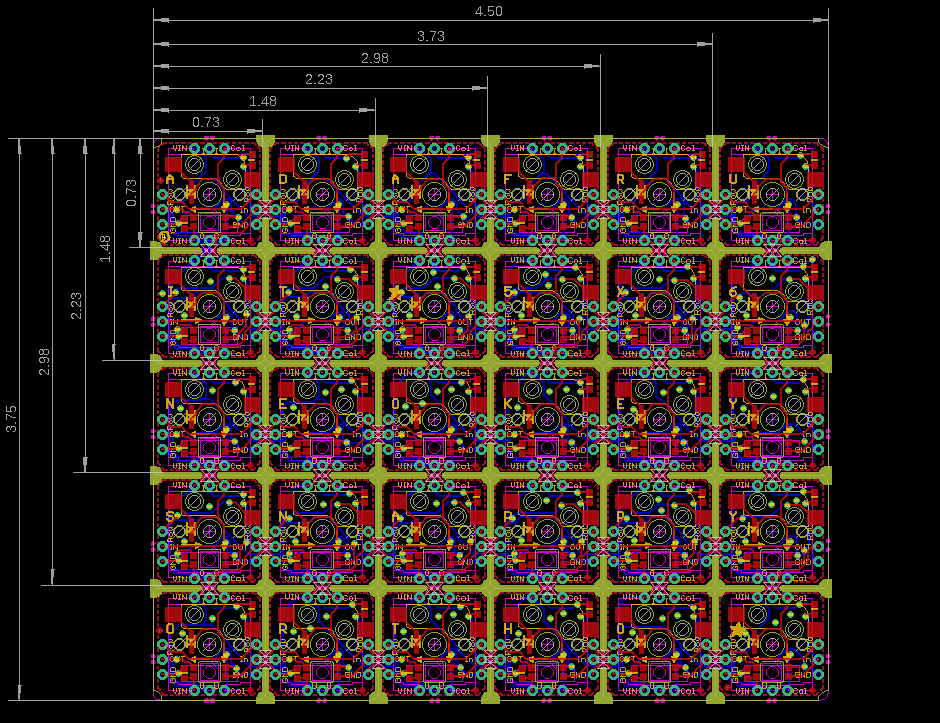
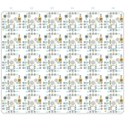
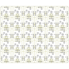
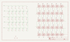
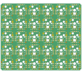
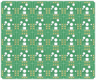

Contents
========

* [PRA5157 > Adafruit NeoKey Snap Apart PCB](#pra5157--adafruit-neokey-snap-apart-pcb)
	* [Schematic](#schematic)
	* [PCB](#pcb)
	* [Interactive BOM](#interactive-bom)
	* [OOMP Parts](#oomp-parts)
	* [Images](#images)
	* [Tags](#tags)
  
![][im]
# PRA5157 > Adafruit NeoKey Snap Apart PCB

- ID: PROJ-ADAF-5157-STAN-01
- Hex ID: PRA5157
- Name: Adafruit 5157
- Description: Adafruit 5157
- Long Link: [http://oom.lt/PROJ-ADAF-5157-STAN-01](http://oom.lt/PROJ-ADAF-5157-STAN-01)
- Short Link: [http://oom.lt/PRA5157](http://oom.lt/PRA5157)

## Schematic
  

## PCB
  

## Interactive BOM

- Interactive BOM page: [ibom.html](https://htmlpreview.github.io/?https://github.com/oomlout/oomlout_OOMP_projects/blob/main/PROJ-ADAF-5157-STAN-01/kicad/bom/ibom.html)

## OOMP Parts
  

|OOMP ID|Name|Identifier|
| :---: | :---: | :---: |
|UNMATCHED-UNMATCHED-X-UNMATCHED-01||X1, X2, X3, X4, X5, X6, X7, X8, X9, X10, X11, X12, X13, X14, X15, X16, X17, X18, X19, X20, X21, X22, X23, X24, X25, X26, X27, X28, X29, X30|

## Images
  
  

|bominteractivefront|bominteractiveback|kicadPcb3d|kicadPcb3dFront|kicadPcb3dBack|kicadSchem|eagleImage|eagleSchemImage|pcbdraw|pcbdrawback|
| :---: | :---: | :---: | :---: | :---: | :---: | :---: | :---: | :---: | :---: |
|||||||||||

## Tags

- hexID: PRA5157
- oompType: PROJ
- oompSize: ADAF
- oompColor: 5157
- oompDesc: STAN
- oompIndex: 01
- oompName: Adafruit NeoKey Snap Apart PCB
- sources: All source files from https://github.com/adafruit/Adafruit-NeoKey-Snap-Apart-PCB (source licence details in srcLicense.md)
- linkBuyPage: http://www.adafruit.com/products/5157
- oompID: PROJ-ADAF-5157-STAN-01
- oompParts: X1,UNMATCHED-UNMATCHED-X-UNMATCHED-01
- oompParts: X2,UNMATCHED-UNMATCHED-X-UNMATCHED-01
- oompParts: X3,UNMATCHED-UNMATCHED-X-UNMATCHED-01
- oompParts: X4,UNMATCHED-UNMATCHED-X-UNMATCHED-01
- oompParts: X5,UNMATCHED-UNMATCHED-X-UNMATCHED-01
- oompParts: X6,UNMATCHED-UNMATCHED-X-UNMATCHED-01
- oompParts: X7,UNMATCHED-UNMATCHED-X-UNMATCHED-01
- oompParts: X8,UNMATCHED-UNMATCHED-X-UNMATCHED-01
- oompParts: X9,UNMATCHED-UNMATCHED-X-UNMATCHED-01
- oompParts: X10,UNMATCHED-UNMATCHED-X-UNMATCHED-01
- oompParts: X11,UNMATCHED-UNMATCHED-X-UNMATCHED-01
- oompParts: X12,UNMATCHED-UNMATCHED-X-UNMATCHED-01
- oompParts: X13,UNMATCHED-UNMATCHED-X-UNMATCHED-01
- oompParts: X14,UNMATCHED-UNMATCHED-X-UNMATCHED-01
- oompParts: X15,UNMATCHED-UNMATCHED-X-UNMATCHED-01
- oompParts: X16,UNMATCHED-UNMATCHED-X-UNMATCHED-01
- oompParts: X17,UNMATCHED-UNMATCHED-X-UNMATCHED-01
- oompParts: X18,UNMATCHED-UNMATCHED-X-UNMATCHED-01
- oompParts: X19,UNMATCHED-UNMATCHED-X-UNMATCHED-01
- oompParts: X20,UNMATCHED-UNMATCHED-X-UNMATCHED-01
- oompParts: X21,UNMATCHED-UNMATCHED-X-UNMATCHED-01
- oompParts: X22,UNMATCHED-UNMATCHED-X-UNMATCHED-01
- oompParts: X23,UNMATCHED-UNMATCHED-X-UNMATCHED-01
- oompParts: X24,UNMATCHED-UNMATCHED-X-UNMATCHED-01
- oompParts: X25,UNMATCHED-UNMATCHED-X-UNMATCHED-01
- oompParts: X26,UNMATCHED-UNMATCHED-X-UNMATCHED-01
- oompParts: X27,UNMATCHED-UNMATCHED-X-UNMATCHED-01
- oompParts: X28,UNMATCHED-UNMATCHED-X-UNMATCHED-01
- oompParts: X29,UNMATCHED-UNMATCHED-X-UNMATCHED-01
- oompParts: X30,UNMATCHED-UNMATCHED-X-UNMATCHED-01
- rawParts: U$1,FIDUCIAL,FIDUCIAL,FIDUCIAL_1MM,For use by pick and place machines to calibrate the vision/machine, 1mm,,
- rawParts: U$2,FIDUCIAL,FIDUCIAL,FIDUCIAL_1MM,For use by pick and place machines to calibrate the vision/machine, 1mm,,
- rawParts: U$3,FIDUCIAL,FIDUCIAL,FIDUCIAL_1MM,For use by pick and place machines to calibrate the vision/machine, 1mm,,
- rawParts: X1,KAILH_SOCKET_TILE,KAILH_SOCKET_TILE,KAILH_SOCKET_TILE,,,
- rawParts: X2,KAILH_SOCKET_TILE,KAILH_SOCKET_TILE,KAILH_SOCKET_TILE,,,
- rawParts: X3,KAILH_SOCKET_TILE,KAILH_SOCKET_TILE,KAILH_SOCKET_TILE,,,
- rawParts: X4,KAILH_SOCKET_TILE,KAILH_SOCKET_TILE,KAILH_SOCKET_TILE,,,
- rawParts: X5,KAILH_SOCKET_TILE,KAILH_SOCKET_TILE,KAILH_SOCKET_TILE,,,
- rawParts: X6,KAILH_SOCKET_TILE,KAILH_SOCKET_TILE,KAILH_SOCKET_TILE,,,
- rawParts: X7,KAILH_SOCKET_TILE_REVERSE,KAILH_SOCKET_TILE_REVERSE,KAILH_SOCKET_TILE_REV,,,
- rawParts: X8,KAILH_SOCKET_TILE_REVERSE,KAILH_SOCKET_TILE_REVERSE,KAILH_SOCKET_TILE_REV,,,
- rawParts: X9,KAILH_SOCKET_TILE_REVERSE,KAILH_SOCKET_TILE_REVERSE,KAILH_SOCKET_TILE_REV,,,
- rawParts: X10,KAILH_SOCKET_TILE_REVERSE,KAILH_SOCKET_TILE_REVERSE,KAILH_SOCKET_TILE_REV,,,
- rawParts: X11,KAILH_SOCKET_TILE_REVERSE,KAILH_SOCKET_TILE_REVERSE,KAILH_SOCKET_TILE_REV,,,
- rawParts: X12,KAILH_SOCKET_TILE_REVERSE,KAILH_SOCKET_TILE_REVERSE,KAILH_SOCKET_TILE_REV,,,
- rawParts: X13,KAILH_SOCKET_TILE,KAILH_SOCKET_TILE,KAILH_SOCKET_TILE,,,
- rawParts: X14,KAILH_SOCKET_TILE,KAILH_SOCKET_TILE,KAILH_SOCKET_TILE,,,
- rawParts: X15,KAILH_SOCKET_TILE,KAILH_SOCKET_TILE,KAILH_SOCKET_TILE,,,
- rawParts: X16,KAILH_SOCKET_TILE,KAILH_SOCKET_TILE,KAILH_SOCKET_TILE,,,
- rawParts: X17,KAILH_SOCKET_TILE,KAILH_SOCKET_TILE,KAILH_SOCKET_TILE,,,
- rawParts: X18,KAILH_SOCKET_TILE,KAILH_SOCKET_TILE,KAILH_SOCKET_TILE,,,
- rawParts: X19,KAILH_SOCKET_TILE_REVERSE,KAILH_SOCKET_TILE_REVERSE,KAILH_SOCKET_TILE_REV,,,
- rawParts: X20,KAILH_SOCKET_TILE_REVERSE,KAILH_SOCKET_TILE_REVERSE,KAILH_SOCKET_TILE_REV,,,
- rawParts: X21,KAILH_SOCKET_TILE_REVERSE,KAILH_SOCKET_TILE_REVERSE,KAILH_SOCKET_TILE_REV,,,
- rawParts: X22,KAILH_SOCKET_TILE_REVERSE,KAILH_SOCKET_TILE_REVERSE,KAILH_SOCKET_TILE_REV,,,
- rawParts: X23,KAILH_SOCKET_TILE_REVERSE,KAILH_SOCKET_TILE_REVERSE,KAILH_SOCKET_TILE_REV,,,
- rawParts: X24,KAILH_SOCKET_TILE_REVERSE,KAILH_SOCKET_TILE_REVERSE,KAILH_SOCKET_TILE_REV,,,
- rawParts: X25,KAILH_SOCKET_TILE,KAILH_SOCKET_TILE,KAILH_SOCKET_TILE,,,
- rawParts: X26,KAILH_SOCKET_TILE,KAILH_SOCKET_TILE,KAILH_SOCKET_TILE,,,
- rawParts: X27,KAILH_SOCKET_TILE,KAILH_SOCKET_TILE,KAILH_SOCKET_TILE,,,
- rawParts: X28,KAILH_SOCKET_TILE,KAILH_SOCKET_TILE,KAILH_SOCKET_TILE,,,
- rawParts: X29,KAILH_SOCKET_TILE,KAILH_SOCKET_TILE,KAILH_SOCKET_TILE,,,
- rawParts: X30,KAILH_SOCKET_TILE,KAILH_SOCKET_TILE,KAILH_SOCKET_TILE,,,

[im]: kicadPcb3d_450.png
