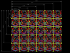
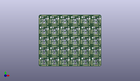
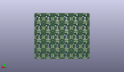
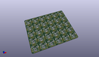

Contents
========

* [PROJ-ADAF-5157-STAN-01>Adafruit NeoKey Snap Apart PCB](#proj-adaf-5157-stan-01adafruit-neokey-snap-apart-pcb)
	* [Images](#images)
	* [Interactive BOM](#interactive-bom)
	* [OOMP Parts](#oomp-parts)
	* [Tags](#tags)
  
![][im]
# PROJ-ADAF-5157-STAN-01>Adafruit NeoKey Snap Apart PCB

- ID: PROJ-ADAF-5157-STAN-01
- Hex ID: PRA5157
- Name: Adafruit NeoKey Snap Apart PCB
- Description: 

## Images
  
  

|eagleImage|kicadPcb3dFront|kicadPcb3dBack|kicadPcb3d|
| :---: | :---: | :---: | :---: |
|||||

## Interactive BOM

- Interactive BOM page: [ibom.html](kicad/bom/ibom.html)

## OOMP Parts
  

|OOMP Parts|
| :---: |
|UNMATCHED-UNMATCHED-X-UNMATCHED-01, X1, 0.0, 0.0, M0,X1, KAILH_SOCKET_TILE, KAILH_SOCKET_TILE, adafruit_electromech, (0, 0), MR0|
|UNMATCHED-UNMATCHED-X-UNMATCHED-01, X2, 19.05, 0.0, M0,X2, KAILH_SOCKET_TILE, KAILH_SOCKET_TILE, adafruit_electromech, (19.05, 0), MR0|
|UNMATCHED-UNMATCHED-X-UNMATCHED-01, X3, 38.1, 0.0, M0,X3, KAILH_SOCKET_TILE, KAILH_SOCKET_TILE, adafruit_electromech, (38.1, 0), MR0|
|UNMATCHED-UNMATCHED-X-UNMATCHED-01, X4, 57.15, 0.0, M0,X4, KAILH_SOCKET_TILE, KAILH_SOCKET_TILE, adafruit_electromech, (57.15, 0), MR0|
|UNMATCHED-UNMATCHED-X-UNMATCHED-01, X5, 76.2, 0.0, M0,X5, KAILH_SOCKET_TILE, KAILH_SOCKET_TILE, adafruit_electromech, (76.2, 0), MR0|
|UNMATCHED-UNMATCHED-X-UNMATCHED-01, X6, 95.25, 0.0, M0,X6, KAILH_SOCKET_TILE, KAILH_SOCKET_TILE, adafruit_electromech, (95.25, 0), MR0|
|UNMATCHED-UNMATCHED-X-UNMATCHED-01, X7, 0.0, -19.05, M0,X7, KAILH_SOCKET_TILE_REVERSE, KAILH_SOCKET_TILE_REV, adafruit_electromech, (0, -19.05), MR0|
|UNMATCHED-UNMATCHED-X-UNMATCHED-01, X8, 19.05, -19.05, M0,X8, KAILH_SOCKET_TILE_REVERSE, KAILH_SOCKET_TILE_REV, adafruit_electromech, (19.05, -19.05), MR0|
|UNMATCHED-UNMATCHED-X-UNMATCHED-01, X9, 38.1, -19.05, M0,X9, KAILH_SOCKET_TILE_REVERSE, KAILH_SOCKET_TILE_REV, adafruit_electromech, (38.1, -19.05), MR0|
|UNMATCHED-UNMATCHED-X-UNMATCHED-01, X10, 57.15, -19.05, M0,X10, KAILH_SOCKET_TILE_REVERSE, KAILH_SOCKET_TILE_REV, adafruit_electromech, (57.15, -19.05), MR0|
|UNMATCHED-UNMATCHED-X-UNMATCHED-01, X11, 76.2, -19.05, M0,X11, KAILH_SOCKET_TILE_REVERSE, KAILH_SOCKET_TILE_REV, adafruit_electromech, (76.2, -19.05), MR0|
|UNMATCHED-UNMATCHED-X-UNMATCHED-01, X12, 95.25, -19.05, M0,X12, KAILH_SOCKET_TILE_REVERSE, KAILH_SOCKET_TILE_REV, adafruit_electromech, (95.25, -19.05), MR0|
|UNMATCHED-UNMATCHED-X-UNMATCHED-01, X13, 0.0, -38.1, M0,X13, KAILH_SOCKET_TILE, KAILH_SOCKET_TILE, adafruit_electromech, (0, -38.1), MR0|
|UNMATCHED-UNMATCHED-X-UNMATCHED-01, X14, 19.05, -38.1, M0,X14, KAILH_SOCKET_TILE, KAILH_SOCKET_TILE, adafruit_electromech, (19.05, -38.1), MR0|
|UNMATCHED-UNMATCHED-X-UNMATCHED-01, X15, 38.1, -38.1, M0,X15, KAILH_SOCKET_TILE, KAILH_SOCKET_TILE, adafruit_electromech, (38.1, -38.1), MR0|
|UNMATCHED-UNMATCHED-X-UNMATCHED-01, X16, 57.15, -38.1, M0,X16, KAILH_SOCKET_TILE, KAILH_SOCKET_TILE, adafruit_electromech, (57.15, -38.1), MR0|
|UNMATCHED-UNMATCHED-X-UNMATCHED-01, X17, 76.2, -38.1, M0,X17, KAILH_SOCKET_TILE, KAILH_SOCKET_TILE, adafruit_electromech, (76.2, -38.1), MR0|
|UNMATCHED-UNMATCHED-X-UNMATCHED-01, X18, 95.25, -38.1, M0,X18, KAILH_SOCKET_TILE, KAILH_SOCKET_TILE, adafruit_electromech, (95.25, -38.1), MR0|
|UNMATCHED-UNMATCHED-X-UNMATCHED-01, X19, 0.0, -57.15, M0,X19, KAILH_SOCKET_TILE_REVERSE, KAILH_SOCKET_TILE_REV, adafruit_electromech, (0, -57.15), MR0|
|UNMATCHED-UNMATCHED-X-UNMATCHED-01, X20, 19.05, -57.15, M0,X20, KAILH_SOCKET_TILE_REVERSE, KAILH_SOCKET_TILE_REV, adafruit_electromech, (19.05, -57.15), MR0|
|UNMATCHED-UNMATCHED-X-UNMATCHED-01, X21, 38.1, -57.15, M0,X21, KAILH_SOCKET_TILE_REVERSE, KAILH_SOCKET_TILE_REV, adafruit_electromech, (38.1, -57.15), MR0|
|UNMATCHED-UNMATCHED-X-UNMATCHED-01, X22, 57.15, -57.15, M0,X22, KAILH_SOCKET_TILE_REVERSE, KAILH_SOCKET_TILE_REV, adafruit_electromech, (57.15, -57.15), MR0|
|UNMATCHED-UNMATCHED-X-UNMATCHED-01, X23, 76.2, -57.15, M0,X23, KAILH_SOCKET_TILE_REVERSE, KAILH_SOCKET_TILE_REV, adafruit_electromech, (76.2, -57.15), MR0|
|UNMATCHED-UNMATCHED-X-UNMATCHED-01, X24, 95.25, -57.15, M0,X24, KAILH_SOCKET_TILE_REVERSE, KAILH_SOCKET_TILE_REV, adafruit_electromech, (95.25, -57.15), MR0|
|UNMATCHED-UNMATCHED-X-UNMATCHED-01, X25, 0.0, -76.2, M0,X25, KAILH_SOCKET_TILE, KAILH_SOCKET_TILE, adafruit_electromech, (0, -76.2), MR0|
|UNMATCHED-UNMATCHED-X-UNMATCHED-01, X26, 19.05, -76.2, M0,X26, KAILH_SOCKET_TILE, KAILH_SOCKET_TILE, adafruit_electromech, (19.05, -76.2), MR0|
|UNMATCHED-UNMATCHED-X-UNMATCHED-01, X27, 38.1, -76.2, M0,X27, KAILH_SOCKET_TILE, KAILH_SOCKET_TILE, adafruit_electromech, (38.1, -76.2), MR0|
|UNMATCHED-UNMATCHED-X-UNMATCHED-01, X28, 57.15, -76.2, M0,X28, KAILH_SOCKET_TILE, KAILH_SOCKET_TILE, adafruit_electromech, (57.15, -76.2), MR0|
|UNMATCHED-UNMATCHED-X-UNMATCHED-01, X29, 76.2, -76.2, M0,X29, KAILH_SOCKET_TILE, KAILH_SOCKET_TILE, adafruit_electromech, (76.2, -76.2), MR0|
|UNMATCHED-UNMATCHED-X-UNMATCHED-01, X30, 95.25, -76.2, M0,X30, KAILH_SOCKET_TILE, KAILH_SOCKET_TILE, adafruit_electromech, (95.25, -76.2), MR0|

## Tags

- hexID: PRA5157
- oompType: PROJ
- oompSize: ADAF
- oompColor: 5157
- oompDesc: STAN
- oompIndex: 01
- oompName: Adafruit NeoKey Snap Apart PCB
- sources: All source files from https://github.com/adafruit/Adafruit-NeoKey-Snap-Apart-PCB (source licence details in srcLicense.md)
- linkBuyPage: http://www.adafruit.com/products/5157
- oompID: PROJ-ADAF-5157-STAN-01
- oompPart: SKIP-UNMATCHED-X-UNMATCHED-01, U$1, -8.382, -73.914, 0
- oompPart: SKIP-UNMATCHED-X-UNMATCHED-01, U$2, 87.757, -83.566, 0
- oompPart: SKIP-UNMATCHED-X-UNMATCHED-01, U$3, -8.255, 2.413, 0
- oompPart: UNMATCHED-UNMATCHED-X-UNMATCHED-01, X1, 0.0, 0.0, M0
- oompPart: UNMATCHED-UNMATCHED-X-UNMATCHED-01, X2, 19.05, 0.0, M0
- oompPart: UNMATCHED-UNMATCHED-X-UNMATCHED-01, X3, 38.1, 0.0, M0
- oompPart: UNMATCHED-UNMATCHED-X-UNMATCHED-01, X4, 57.15, 0.0, M0
- oompPart: UNMATCHED-UNMATCHED-X-UNMATCHED-01, X5, 76.2, 0.0, M0
- oompPart: UNMATCHED-UNMATCHED-X-UNMATCHED-01, X6, 95.25, 0.0, M0
- oompPart: UNMATCHED-UNMATCHED-X-UNMATCHED-01, X7, 0.0, -19.05, M0
- oompPart: UNMATCHED-UNMATCHED-X-UNMATCHED-01, X8, 19.05, -19.05, M0
- oompPart: UNMATCHED-UNMATCHED-X-UNMATCHED-01, X9, 38.1, -19.05, M0
- oompPart: UNMATCHED-UNMATCHED-X-UNMATCHED-01, X10, 57.15, -19.05, M0
- oompPart: UNMATCHED-UNMATCHED-X-UNMATCHED-01, X11, 76.2, -19.05, M0
- oompPart: UNMATCHED-UNMATCHED-X-UNMATCHED-01, X12, 95.25, -19.05, M0
- oompPart: UNMATCHED-UNMATCHED-X-UNMATCHED-01, X13, 0.0, -38.1, M0
- oompPart: UNMATCHED-UNMATCHED-X-UNMATCHED-01, X14, 19.05, -38.1, M0
- oompPart: UNMATCHED-UNMATCHED-X-UNMATCHED-01, X15, 38.1, -38.1, M0
- oompPart: UNMATCHED-UNMATCHED-X-UNMATCHED-01, X16, 57.15, -38.1, M0
- oompPart: UNMATCHED-UNMATCHED-X-UNMATCHED-01, X17, 76.2, -38.1, M0
- oompPart: UNMATCHED-UNMATCHED-X-UNMATCHED-01, X18, 95.25, -38.1, M0
- oompPart: UNMATCHED-UNMATCHED-X-UNMATCHED-01, X19, 0.0, -57.15, M0
- oompPart: UNMATCHED-UNMATCHED-X-UNMATCHED-01, X20, 19.05, -57.15, M0
- oompPart: UNMATCHED-UNMATCHED-X-UNMATCHED-01, X21, 38.1, -57.15, M0
- oompPart: UNMATCHED-UNMATCHED-X-UNMATCHED-01, X22, 57.15, -57.15, M0
- oompPart: UNMATCHED-UNMATCHED-X-UNMATCHED-01, X23, 76.2, -57.15, M0
- oompPart: UNMATCHED-UNMATCHED-X-UNMATCHED-01, X24, 95.25, -57.15, M0
- oompPart: UNMATCHED-UNMATCHED-X-UNMATCHED-01, X25, 0.0, -76.2, M0
- oompPart: UNMATCHED-UNMATCHED-X-UNMATCHED-01, X26, 19.05, -76.2, M0
- oompPart: UNMATCHED-UNMATCHED-X-UNMATCHED-01, X27, 38.1, -76.2, M0
- oompPart: UNMATCHED-UNMATCHED-X-UNMATCHED-01, X28, 57.15, -76.2, M0
- oompPart: UNMATCHED-UNMATCHED-X-UNMATCHED-01, X29, 76.2, -76.2, M0
- oompPart: UNMATCHED-UNMATCHED-X-UNMATCHED-01, X30, 95.25, -76.2, M0
- rawPart: U$1, FIDUCIAL, FIDUCIAL_1MM, adafruit, (-8.382, -73.914), R0
- rawPart: U$2, FIDUCIAL, FIDUCIAL_1MM, adafruit, (87.757, -83.566), R0
- rawPart: U$3, FIDUCIAL, FIDUCIAL_1MM, adafruit, (-8.255, 2.413), R0
- rawPart: X1, KAILH_SOCKET_TILE, KAILH_SOCKET_TILE, adafruit_electromech, (0, 0), MR0
- rawPart: X2, KAILH_SOCKET_TILE, KAILH_SOCKET_TILE, adafruit_electromech, (19.05, 0), MR0
- rawPart: X3, KAILH_SOCKET_TILE, KAILH_SOCKET_TILE, adafruit_electromech, (38.1, 0), MR0
- rawPart: X4, KAILH_SOCKET_TILE, KAILH_SOCKET_TILE, adafruit_electromech, (57.15, 0), MR0
- rawPart: X5, KAILH_SOCKET_TILE, KAILH_SOCKET_TILE, adafruit_electromech, (76.2, 0), MR0
- rawPart: X6, KAILH_SOCKET_TILE, KAILH_SOCKET_TILE, adafruit_electromech, (95.25, 0), MR0
- rawPart: X7, KAILH_SOCKET_TILE_REVERSE, KAILH_SOCKET_TILE_REV, adafruit_electromech, (0, -19.05), MR0
- rawPart: X8, KAILH_SOCKET_TILE_REVERSE, KAILH_SOCKET_TILE_REV, adafruit_electromech, (19.05, -19.05), MR0
- rawPart: X9, KAILH_SOCKET_TILE_REVERSE, KAILH_SOCKET_TILE_REV, adafruit_electromech, (38.1, -19.05), MR0
- rawPart: X10, KAILH_SOCKET_TILE_REVERSE, KAILH_SOCKET_TILE_REV, adafruit_electromech, (57.15, -19.05), MR0
- rawPart: X11, KAILH_SOCKET_TILE_REVERSE, KAILH_SOCKET_TILE_REV, adafruit_electromech, (76.2, -19.05), MR0
- rawPart: X12, KAILH_SOCKET_TILE_REVERSE, KAILH_SOCKET_TILE_REV, adafruit_electromech, (95.25, -19.05), MR0
- rawPart: X13, KAILH_SOCKET_TILE, KAILH_SOCKET_TILE, adafruit_electromech, (0, -38.1), MR0
- rawPart: X14, KAILH_SOCKET_TILE, KAILH_SOCKET_TILE, adafruit_electromech, (19.05, -38.1), MR0
- rawPart: X15, KAILH_SOCKET_TILE, KAILH_SOCKET_TILE, adafruit_electromech, (38.1, -38.1), MR0
- rawPart: X16, KAILH_SOCKET_TILE, KAILH_SOCKET_TILE, adafruit_electromech, (57.15, -38.1), MR0
- rawPart: X17, KAILH_SOCKET_TILE, KAILH_SOCKET_TILE, adafruit_electromech, (76.2, -38.1), MR0
- rawPart: X18, KAILH_SOCKET_TILE, KAILH_SOCKET_TILE, adafruit_electromech, (95.25, -38.1), MR0
- rawPart: X19, KAILH_SOCKET_TILE_REVERSE, KAILH_SOCKET_TILE_REV, adafruit_electromech, (0, -57.15), MR0
- rawPart: X20, KAILH_SOCKET_TILE_REVERSE, KAILH_SOCKET_TILE_REV, adafruit_electromech, (19.05, -57.15), MR0
- rawPart: X21, KAILH_SOCKET_TILE_REVERSE, KAILH_SOCKET_TILE_REV, adafruit_electromech, (38.1, -57.15), MR0
- rawPart: X22, KAILH_SOCKET_TILE_REVERSE, KAILH_SOCKET_TILE_REV, adafruit_electromech, (57.15, -57.15), MR0
- rawPart: X23, KAILH_SOCKET_TILE_REVERSE, KAILH_SOCKET_TILE_REV, adafruit_electromech, (76.2, -57.15), MR0
- rawPart: X24, KAILH_SOCKET_TILE_REVERSE, KAILH_SOCKET_TILE_REV, adafruit_electromech, (95.25, -57.15), MR0
- rawPart: X25, KAILH_SOCKET_TILE, KAILH_SOCKET_TILE, adafruit_electromech, (0, -76.2), MR0
- rawPart: X26, KAILH_SOCKET_TILE, KAILH_SOCKET_TILE, adafruit_electromech, (19.05, -76.2), MR0
- rawPart: X27, KAILH_SOCKET_TILE, KAILH_SOCKET_TILE, adafruit_electromech, (38.1, -76.2), MR0
- rawPart: X28, KAILH_SOCKET_TILE, KAILH_SOCKET_TILE, adafruit_electromech, (57.15, -76.2), MR0
- rawPart: X29, KAILH_SOCKET_TILE, KAILH_SOCKET_TILE, adafruit_electromech, (76.2, -76.2), MR0
- rawPart: X30, KAILH_SOCKET_TILE, KAILH_SOCKET_TILE, adafruit_electromech, (95.25, -76.2), MR0

[im]: kicadPcb3d_450.png
