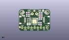
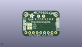
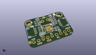

Contents
========

* [PROJ-ADAF-5165-STAN-01>Adafruit MCP9601 PCB](#proj-adaf-5165-stan-01adafruit-mcp9601-pcb)
	* [Images](#images)
	* [Interactive BOM](#interactive-bom)
	* [OOMP Parts](#oomp-parts)
	* [Tags](#tags)
  
![][im]
# PROJ-ADAF-5165-STAN-01>Adafruit MCP9601 PCB

- ID: PROJ-ADAF-5165-STAN-01
- Hex ID: PRA5165
- Name: Adafruit MCP9601 PCB
- Description: 

## Images
  
  

|eagleImage|kicadPcb3dFront|kicadPcb3dBack|kicadPcb3d|
| :---: | :---: | :---: | :---: |
|||||

## Interactive BOM

- Interactive BOM page: [ibom.html](kicad/bom/ibom.html)

## OOMP Parts
  

|OOMP Parts|
| :---: |
|<table><tr><td></td><td> C1</td><td>[CAPC-0603-X-NF100-V50 SMD (0603) 100 nF Capacitor (Ceramic) 50v](https://github.com/oomlout/oomlout_OOMP_parts/tree/main/CAPC-0603-X-NF100-V50/)</td><td>[C6N100](https://github.com/oomlout/oomlout_OOMP_parts/tree/main/CAPC-0603-X-NF100-V50/)</td></tr></table>|
|CAPC-0805-X-UNMATCHED-01, C2, 8.001, 5.5245, 0,C2, 10uF, 0805-NO, microbuilder, (0.315, 0.2175), R0|
|UNMATCHED-UNMATCHED-X-UNMATCHED-01, CONN3, 22.86, 8.889999999999999, 90,CONN3, STEMMA_I2C_QT, JST_SH4, microbuilder, (0.9, 0.35), R90|
|UNMATCHED-UNMATCHED-X-UNMATCHED-01, CONN4, 2.54, 8.889999999999999, 270,CONN4, STEMMA_I2C_QT, JST_SH4, microbuilder, (0.1, 0.35), R270|
|UNMATCHED-UNMATCHED-X-UNMATCHED-01, D1, 3.556, 12.572999999999999, 90,D1, GREEN, CHIPLED_0603_NOOUTLINE, microbuilder, (0.14, 0.495), R90|
|UNMATCHED-0603-X-UNMATCHED-01, FB1, 7.238999999999999, 15.0495, 180,FB1, Ferrite, 0603-NO, microbuilder, (0.285, 0.5925), R180|
|UNMATCHED-0603-X-UNMATCHED-01, FB2, 17.8435, 15.0495, 0,FB2, Ferrite, 0603-NO, microbuilder, (0.7025, 0.5925), R0|
|UNMATCHED-UNMATCHED-X-UNMATCHED-01, IC1, 12.7, 7.6834999999999996, 270,IC1, MCP9601, VQFN20_5MM, adafruit_sensor, (0.5, 0.3025), R270|
|<table><tr><td></td><td> JP3</td><td>[HEAD-I01-X-PI09-01 2.54 mm 9 Pin Header](https://github.com/oomlout/oomlout_OOMP_parts/tree/main/HEAD-I01-X-PI09-01/)</td><td>[H09](https://github.com/oomlout/oomlout_OOMP_parts/tree/main/HEAD-I01-X-PI09-01/)</td></tr></table>|
|RESE-UNMATCHED-X-O103-01, R1, 8.128, 8.382, 270,R1, 10K, RESPACK_4X0603, microbuilder, (0.32, 0.33), R270|
|RESE-0603-X-UNMATCHED-01, R2, 17.4625, 9.652, 180,R2, 487K, 0603-NO, microbuilder, (0.6875, 0.38), R180|
|RESE-0603-X-UNMATCHED-01, R3, 17.8435, 10.9855, 0,R3, 2.5M, 0603-NO, microbuilder, (0.7025, 0.4325), R0|
|<table><tr><td></td><td> R4</td><td>[RESE-0603-X-O223-01 SMD (0603) 22k Ohm Resistor](https://github.com/oomlout/oomlout_OOMP_parts/tree/main/RESE-0603-X-O223-01/)</td><td>[R6223](https://github.com/oomlout/oomlout_OOMP_parts/tree/main/RESE-0603-X-O223-01/)</td></tr></table>|
|RESE-0603-X-UNMATCHED-01, R5, 17.8435, 13.716, 180,R5, 100, 0603-NO, microbuilder, (0.7025, 0.54), R180|
|RESE-0603-X-UNMATCHED-01, R6, 7.238999999999999, 13.5255, 0,R6, 100, 0603-NO, microbuilder, (0.285, 0.5325), R0|
|<table><tr><td></td><td> R7</td><td>[RESE-0603-X-O473-01 SMD (0603) 47k Ohm Resistor](https://github.com/oomlout/oomlout_OOMP_parts/tree/main/RESE-0603-X-O473-01/)</td><td>[R6473](https://github.com/oomlout/oomlout_OOMP_parts/tree/main/RESE-0603-X-O473-01/)</td></tr></table>|
|RESE-0603-X-UNMATCHED-01, R8, 17.8435, 12.318999999999999, 180,R8, 2M, 0603-NO, microbuilder, (0.7025, 0.485), R180|
|UNMATCHED-UNMATCHED-X-UNMATCHED-01, X1, 12.7, 13.97, 180,X1, TERMBLK, TERMBLOCK_1X2-3.5MM, microbuilder, (0.5, 0.55), R180|

## Tags

- hexID: PRA5165
- oompType: PROJ
- oompSize: ADAF
- oompColor: 5165
- oompDesc: STAN
- oompIndex: 01
- oompName: Adafruit MCP9601 PCB
- sources: All source files from https://github.com/adafruit/Adafruit-MCP9601-PCB (source licence details in srcLicense.md)
- linkBuyPage: http://www.adafruit.com/products/5165
- oompPart: CAPC-0603-X-NF100-V50, C1, 7.238999999999999, 12.065, 180
- oompPart: CAPC-0805-X-UNMATCHED-01, C2, 8.001, 5.5245, 0
- oompPart: UNMATCHED-UNMATCHED-X-UNMATCHED-01, CONN3, 22.86, 8.889999999999999, 90
- oompPart: UNMATCHED-UNMATCHED-X-UNMATCHED-01, CONN4, 2.54, 8.889999999999999, 270
- oompPart: UNMATCHED-UNMATCHED-X-UNMATCHED-01, D1, 3.556, 12.572999999999999, 90
- oompPart: UNMATCHED-0603-X-UNMATCHED-01, FB1, 7.238999999999999, 15.0495, 180
- oompPart: UNMATCHED-0603-X-UNMATCHED-01, FB2, 17.8435, 15.0495, 0
- oompPart: SKIP-UNMATCHED-X-UNMATCHED-01, FID3, 0.7619999999999999, 3.0479999999999996, 0
- oompPart: SKIP-UNMATCHED-X-UNMATCHED-01, FID4, 12.572999999999999, 16.446499999999997, 0
- oompPart: UNMATCHED-UNMATCHED-X-UNMATCHED-01, IC1, 12.7, 7.6834999999999996, 270
- oompPart: HEAD-I01-X-PI09-01, JP3, 12.827, 2.54, 180
- oompPart: RESE-UNMATCHED-X-O103-01, R1, 8.128, 8.382, 270
- oompPart: RESE-0603-X-UNMATCHED-01, R2, 17.4625, 9.652, 180
- oompPart: RESE-0603-X-UNMATCHED-01, R3, 17.8435, 10.9855, 0
- oompPart: RESE-0603-X-O223-01, R4, 17.145, 5.270499999999999, 180
- oompPart: RESE-0603-X-UNMATCHED-01, R5, 17.8435, 13.716, 180
- oompPart: RESE-0603-X-UNMATCHED-01, R6, 7.238999999999999, 13.5255, 0
- oompPart: RESE-0603-X-O473-01, R7, 17.145, 6.6674999999999995, 180
- oompPart: RESE-0603-X-UNMATCHED-01, R8, 17.8435, 12.318999999999999, 180
- oompPart: SKIP-UNMATCHED-X-UNMATCHED-01, SJ1, 20.447, 8.1915, M0
- oompPart: SKIP-UNMATCHED-X-UNMATCHED-01, SJ2, 20.447, 5.7785, M0
- oompPart: SKIP-UNMATCHED-X-UNMATCHED-01, U$33, 2.54, 15.239999999999998, 0
- oompPart: SKIP-UNMATCHED-X-UNMATCHED-01, U$34, 22.86, 15.239999999999998, 0
- oompPart: UNMATCHED-UNMATCHED-X-UNMATCHED-01, X1, 12.7, 13.97, 180
- rawPart: C1, 0.1uF, 0603-NO, microbuilder, (0.285, 0.475), R180
- rawPart: C2, 10uF, 0805-NO, microbuilder, (0.315, 0.2175), R0
- rawPart: CONN3, STEMMA_I2C_QT, JST_SH4, microbuilder, (0.9, 0.35), R90
- rawPart: CONN4, STEMMA_I2C_QT, JST_SH4, microbuilder, (0.1, 0.35), R270
- rawPart: D1, GREEN, CHIPLED_0603_NOOUTLINE, microbuilder, (0.14, 0.495), R90
- rawPart: FB1, Ferrite, 0603-NO, microbuilder, (0.285, 0.5925), R180
- rawPart: FB2, Ferrite, 0603-NO, microbuilder, (0.7025, 0.5925), R0
- rawPart: FID3, FIDUCIAL_1MM, FIDUCIAL_1MM, microbuilder, (0.03, 0.12), R0
- rawPart: FID4, FIDUCIAL_1MM, FIDUCIAL_1MM, microbuilder, (0.495, 0.6475), R0
- rawPart: IC1, MCP9601, VQFN20_5MM, adafruit_sensor, (0.5, 0.3025), R270
- rawPart: JP3, 1X09_ROUND_70, microbuilder, (0.505, 0.1), R180
- rawPart: R1, 10K, RESPACK_4X0603, microbuilder, (0.32, 0.33), R270
- rawPart: R2, 487K, 0603-NO, microbuilder, (0.6875, 0.38), R180
- rawPart: R3, 2.5M, 0603-NO, microbuilder, (0.7025, 0.4325), R0
- rawPart: R4, 22K, 0603-NO, microbuilder, (0.675, 0.2075), R180
- rawPart: R5, 100, 0603-NO, microbuilder, (0.7025, 0.54), R180
- rawPart: R6, 100, 0603-NO, microbuilder, (0.285, 0.5325), R0
- rawPart: R7, 47K, 0603-NO, microbuilder, (0.675, 0.2625), R180
- rawPart: R8, 2M, 0603-NO, microbuilder, (0.7025, 0.485), R180
- rawPart: SJ1, SOLDERJUMPER_ARROW_NOPASTE, microbuilder, (0.805, 0.3225), MR0
- rawPart: SJ2, SOLDERJUMPER_ARROW_NOPASTE, microbuilder, (0.805, 0.2275), MR0
- rawPart: U$33, MOUNTINGHOLE2.5, MOUNTINGHOLE_2.5_PLATED, microbuilder, (0.1, 0.6), R0
- rawPart: U$34, MOUNTINGHOLE2.5, MOUNTINGHOLE_2.5_PLATED, microbuilder, (0.9, 0.6), R0
- rawPart: X1, TERMBLK, TERMBLOCK_1X2-3.5MM, microbuilder, (0.5, 0.55), R180
- oompID: PROJ-ADAF-5165-STAN-01

[im]: kicadPcb3d_450.png
