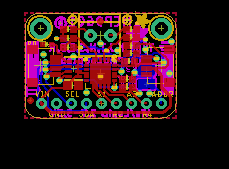
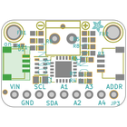
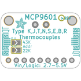

Contents
========

* [PRA5165 > Adafruit MCP9601 PCB](#pra5165--adafruit-mcp9601-pcb)
	* [Schematic](#schematic)
	* [PCB](#pcb)
	* [Interactive BOM](#interactive-bom)
	* [OOMP Parts](#oomp-parts)
	* [Images](#images)
	* [Tags](#tags)
  
![][im]
# PRA5165 > Adafruit MCP9601 PCB

- ID: PROJ-ADAF-5165-STAN-01
- Hex ID: PRA5165
- Name: Adafruit
- Description: Adafruit
- Long Link: [http://oom.lt/PROJ-ADAF-5165-STAN-01](http://oom.lt/PROJ-ADAF-5165-STAN-01)
- Short Link: [http://oom.lt/PRA5165](http://oom.lt/PRA5165)

## Schematic
  

## PCB
  

## Interactive BOM

- Interactive BOM page: [ibom.html](https://htmlpreview.github.io/?https://github.com/oomlout/oomlout_OOMP_projects/blob/main/PROJ-ADAF-5165-STAN-01/kicad/bom/ibom.html)

## OOMP Parts
  

|OOMP Parts|
| :---: |
|[CAPC-0603-X-NF100-V50  SMD (0603) 100 nF Capacitor (Ceramic) 50v  C1](https://github.com/oomlout/oomlout_OOMP_parts/tree/main/CAPC-0603-X-NF100-V50/)|
|[CAPC-0805-X-UF10-V10  SMD (0805) 10 uF Capacitor (Ceramic) 10v  C2](https://github.com/oomlout/oomlout_OOMP_parts/tree/main/CAPC-0805-X-UF10-V10/)|
|HEAD-I01-X-UNMATCHED-01 CONN3, CONN4|
|[LEDS-0603-G-STAN-01  SMD (0603) Green LED  D1](https://github.com/oomlout/oomlout_OOMP_parts/tree/main/LEDS-0603-G-STAN-01/)|
|FERB-0603-X-UNMATCHED-01 FB1, FB2|
|UNMATCHED-UNMATCHED-X-UNMATCHED-01 IC1|
|[HEAD-I01-X-PI09-01  2.54 mm 9 Pin Header  JP3](https://github.com/oomlout/oomlout_OOMP_parts/tree/main/HEAD-I01-X-PI09-01/)|
|RESA-06038-X-O103X4-01 R1|
|RESE-0603-X-O4873-01 R2|
|RESE-0603-X-UNMATCHED-01 R3|
|[RESE-0603-X-O223-01  SMD (0603) 22k Ohm Resistor  R4](https://github.com/oomlout/oomlout_OOMP_parts/tree/main/RESE-0603-X-O223-01/)|
|[RESE-0603-X-O101-01  SMD (0603) 100 Ohm Resistor  R5, R6](https://github.com/oomlout/oomlout_OOMP_parts/tree/main/RESE-0603-X-O101-01/)|
|[RESE-0603-X-O473-01  SMD (0603) 47k Ohm Resistor  R7](https://github.com/oomlout/oomlout_OOMP_parts/tree/main/RESE-0603-X-O473-01/)|
|RESE-0603-X-O205-01 R8|
|[TERS-35D-L-PI02-01  3.5 mm 2 Pin Blue Screw Terminal  X1](https://github.com/oomlout/oomlout_OOMP_parts/tree/main/TERS-35D-L-PI02-01/)|

## Images
  
  

|bominteractivefront|bominteractiveback|kicadPcb3d|kicadPcb3dFront|kicadPcb3dBack|eagleImage|eagleSchemImage|
| :---: | :---: | :---: | :---: | :---: | :---: | :---: |
||||||||

## Tags

- hexID: PRA5165
- oompType: PROJ
- oompSize: ADAF
- oompColor: 5165
- oompDesc: STAN
- oompIndex: 01
- oompName: Adafruit MCP9601 PCB
- sources: All source files from https://github.com/adafruit/Adafruit-MCP9601-PCB (source licence details in srcLicense.md)
- linkBuyPage: http://www.adafruit.com/products/5165
- oompID: PROJ-ADAF-5165-STAN-01
- oompParts: C1,CAPC-0603-X-NF100-V50
- oompParts: C2,CAPC-0805-X-UF10-V10
- oompParts: CONN3,HEAD-I01-X-UNMATCHED-01
- oompParts: CONN4,HEAD-I01-X-UNMATCHED-01
- oompParts: D1,LEDS-0603-G-STAN-01
- oompParts: FB1,FERB-0603-X-UNMATCHED-01
- oompParts: FB2,FERB-0603-X-UNMATCHED-01
- oompParts: IC1,UNMATCHED-UNMATCHED-X-UNMATCHED-01
- oompParts: JP3,HEAD-I01-X-PI09-01
- oompParts: R1,RESA-06038-X-O103X4-01
- oompParts: R2,RESE-0603-X-O4873-01
- oompParts: R3,RESE-0603-X-UNMATCHED-01
- oompParts: R4,RESE-0603-X-O223-01
- oompParts: R5,RESE-0603-X-O101-01
- oompParts: R6,RESE-0603-X-O101-01
- oompParts: R7,RESE-0603-X-O473-01
- oompParts: R8,RESE-0603-X-O205-01
- oompParts: X1,TERS-35D-L-PI02-01
- rawParts: C1,0.1uF,CAP_CERAMIC0603_NO,0603-NO,Ceramic Capacitors,,
- rawParts: C2,10uF,CAP_CERAMIC0805-NOOUTLINE,0805-NO,Ceramic Capacitors,,
- rawParts: CONN3,STEMMA_I2C_QT,STEMMA_I2C_QT,JST_SH4,,,
- rawParts: CONN4,STEMMA_I2C_QT,STEMMA_I2C_QT,JST_SH4,,,
- rawParts: D1,GREEN,LED0603_NOOUTLINE,CHIPLED_0603_NOOUTLINE,LED,,
- rawParts: FB1,Ferrite,FERRITE-0603NO,0603-NO,Ferrite Bead,,
- rawParts: FB2,Ferrite,FERRITE-0603NO,0603-NO,Ferrite Bead,,
- rawParts: FID3,FIDUCIAL_1MM,FIDUCIAL_1MM,FIDUCIAL_1MM,Fiducial Alignment Points,EXCLUDE,
- rawParts: FID4,FIDUCIAL_1MM,FIDUCIAL_1MM,FIDUCIAL_1MM,Fiducial Alignment Points,EXCLUDE,
- rawParts: IC1,MCP9601,MCP9601,VQFN20_5MM,,,
- rawParts: JP3,,HEADER-1X970MIL,1X09_ROUND_70,PIN HEADER,,
- rawParts: R1,10K,RESISTOR_4PACK,RESPACK_4X0603,Resistor Packs (4 resistors),,
- rawParts: R2,487K,RESISTOR_0603_NOOUT,0603-NO,Resistors,,
- rawParts: R3,2.5M,RESISTOR_0603_NOOUT,0603-NO,Resistors,,
- rawParts: R4,22K,RESISTOR_0603_NOOUT,0603-NO,Resistors,,
- rawParts: R5,100,RESISTOR_0603_NOOUT,0603-NO,Resistors,,
- rawParts: R6,100,RESISTOR_0603_NOOUT,0603-NO,Resistors,,
- rawParts: R7,47K,RESISTOR_0603_NOOUT,0603-NO,Resistors,,
- rawParts: R8,2M,RESISTOR_0603_NOOUT,0603-NO,Resistors,,
- rawParts: SJ1,,SOLDERJUMPER,SOLDERJUMPER_ARROW_NOPASTE,SMD Solder JUMPER,EXCLUDE,
- rawParts: SJ2,,SOLDERJUMPER,SOLDERJUMPER_ARROW_NOPASTE,SMD Solder JUMPER,EXCLUDE,
- rawParts: U$33,MOUNTINGHOLE2.5,MOUNTINGHOLE2.5,MOUNTINGHOLE_2.5_PLATED,Mounting Hole,EXCLUDE,
- rawParts: U$34,MOUNTINGHOLE2.5,MOUNTINGHOLE2.5,MOUNTINGHOLE_2.5_PLATED,Mounting Hole,EXCLUDE,
- rawParts: X1,TERMBLK,TERMBLOCK_1X2_3.5MM,TERMBLOCK_1X2-3.5MM,3.5mm Terminal block,,

[im]: kicadPcb3d_450.png
