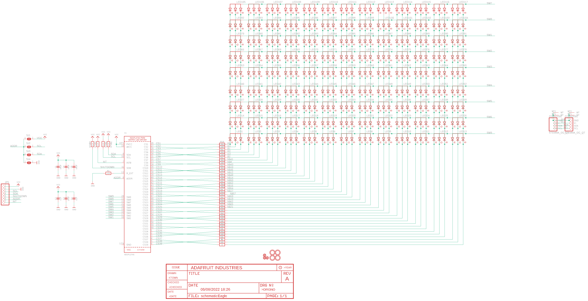
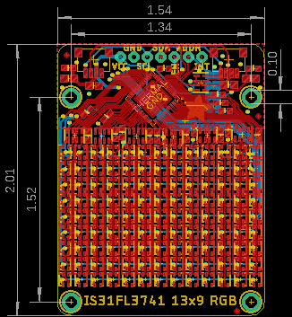
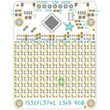
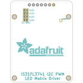
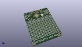
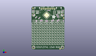
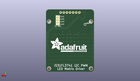
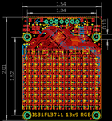
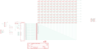

Contents
========

* [PRA5201 > Adafruit IS31FL3741 PCB](#pra5201--adafruit-is31fl3741-pcb)
	* [Schematic](#schematic)
	* [PCB](#pcb)
	* [Interactive BOM](#interactive-bom)
	* [OOMP Parts](#oomp-parts)
	* [Images](#images)
	* [Tags](#tags)
  
![][im]
# PRA5201 > Adafruit IS31FL3741 PCB

- ID: PROJ-ADAF-5201-STAN-01
- Hex ID: PRA5201
- Name: Adafruit
- Description: Adafruit
- Long Link: [http://oom.lt/PROJ-ADAF-5201-STAN-01](http://oom.lt/PROJ-ADAF-5201-STAN-01)
- Short Link: [http://oom.lt/PRA5201](http://oom.lt/PRA5201)

## Schematic
  

## PCB
  

## Interactive BOM

- Interactive BOM page: [ibom.html](https://htmlpreview.github.io/?https://github.com/oomlout/oomlout_OOMP_projects/blob/main/PROJ-ADAF-5201-STAN-01/kicad/bom/ibom.html)

## OOMP Parts
  

|OOMP Parts|
| :---: |
|[CAPC-0805-X-UF10-V10  SMD (0805) 10 uF Capacitor (Ceramic) 10v  C1, C3, C4, C5](https://github.com/oomlout/oomlout_OOMP_parts/tree/main/CAPC-0805-X-UF10-V10/)|
|[CAPC-0603-X-UF1-V25  SMD (0603) 1 uF Capacitor (Ceramic) 25v  C2, C6](https://github.com/oomlout/oomlout_OOMP_parts/tree/main/CAPC-0603-X-UF1-V25/)|
|HEAD-I01-X-UNMATCHED-01 CONN1, CONN2|
|[HEAD-I01-X-PI07-01  2.54 mm 7 Pin Header  JP5](https://github.com/oomlout/oomlout_OOMP_parts/tree/main/HEAD-I01-X-PI07-01/)|
|[LEDS-2121-RGB-STAN-CA  SMD (2121) RGB LED Common Anode  LED1, LED2, LED3, LED4, LED5, LED6, LED7, LED8, LED9, LED10, LED11, LED12, LED13, LED14, LED15, LED16, LED17, LED18, LED19, LED20, LED21, LED22, LED23, LED24, LED25, LED26, LED27, LED28, LED29, LED30, LED31, LED32, LED33, LED34, LED35, LED36, LED37, LED38, LED39, LED40, LED41, LED42, LED43, LED44, LED45, LED46, LED47, LED48, LED49, LED50, LED51, LED52, LED53, LED54, LED55, LED56, LED57, LED58, LED59, LED60, LED61, LED62, LED63, LED64, LED65, LED66, LED67, LED68, LED69, LED70, LED71, LED72, LED73, LED74, LED75, LED76, LED77, LED78, LED79, LED80, LED81, LED82, LED83, LED84, LED85, LED86, LED87, LED88, LED89, LED90, LED91, LED92, LED93, LED94, LED95, LED96, LED97, LED98, LED99, LED100, LED101, LED102, LED103, LED104, LED105, LED106, LED107, LED108, LED109, LED110, LED111, LED112, LED113, LED114, LED115, LED116, LED117](https://github.com/oomlout/oomlout_OOMP_parts/tree/main/LEDS-2121-RGB-STAN-CA/)|
|[RESE-0603-X-O222-01  SMD (0603) 2.2k Ohm Resistor  R1](https://github.com/oomlout/oomlout_OOMP_parts/tree/main/RESE-0603-X-O222-01/)|
|RESA-06038-X-O220X4-01 R2, R3, R4, R5, R6, R8|
|RESA-06038-X-O472X4-01 R7|
|[RESE-0603-X-O220-01  SMD (0603) 22 Ohm Resistor  R9, R23](https://github.com/oomlout/oomlout_OOMP_parts/tree/main/RESE-0603-X-O220-01/)|
|[RESE-0603-X-O510-01  SMD (0603) 51 Ohm Resistor  R10, R11, R12, R13, R14, R15, R16, R17, R18, R19, R20, R21, R22](https://github.com/oomlout/oomlout_OOMP_parts/tree/main/RESE-0603-X-O510-01/)|
|UNMATCHED-UNMATCHED-X-UNMATCHED-01 X1|

## Images
  
  

|bominteractivefront|bominteractiveback|kicadPcb3d|kicadPcb3dFront|kicadPcb3dBack|eagleImage|eagleSchemImage|
| :---: | :---: | :---: | :---: | :---: | :---: | :---: |
||||||||

## Tags

- hexID: PRA5201
- oompType: PROJ
- oompSize: ADAF
- oompColor: 5201
- oompDesc: STAN
- oompIndex: 01
- oompName: Adafruit IS31FL3741 PCB
- sources: All source files from https://github.com/adafruit/Adafruit-IS31FL3741-PCB (source licence details in srcLicense.md)
- linkBuyPage: http://www.adafruit.com/products/5201
- oompID: PROJ-ADAF-5201-STAN-01
- oompParts: C1,CAPC-0805-X-UF10-V10
- oompParts: C2,CAPC-0603-X-UF1-V25
- oompParts: C3,CAPC-0805-X-UF10-V10
- oompParts: C4,CAPC-0805-X-UF10-V10
- oompParts: C5,CAPC-0805-X-UF10-V10
- oompParts: C6,CAPC-0603-X-UF1-V25
- oompParts: CONN1,HEAD-I01-X-UNMATCHED-01
- oompParts: CONN2,HEAD-I01-X-UNMATCHED-01
- oompParts: JP5,HEAD-I01-X-PI07-01
- oompParts: LED1,LEDS-2121-RGB-STAN-CA
- oompParts: LED2,LEDS-2121-RGB-STAN-CA
- oompParts: LED3,LEDS-2121-RGB-STAN-CA
- oompParts: LED4,LEDS-2121-RGB-STAN-CA
- oompParts: LED5,LEDS-2121-RGB-STAN-CA
- oompParts: LED6,LEDS-2121-RGB-STAN-CA
- oompParts: LED7,LEDS-2121-RGB-STAN-CA
- oompParts: LED8,LEDS-2121-RGB-STAN-CA
- oompParts: LED9,LEDS-2121-RGB-STAN-CA
- oompParts: LED10,LEDS-2121-RGB-STAN-CA
- oompParts: LED11,LEDS-2121-RGB-STAN-CA
- oompParts: LED12,LEDS-2121-RGB-STAN-CA
- oompParts: LED13,LEDS-2121-RGB-STAN-CA
- oompParts: LED14,LEDS-2121-RGB-STAN-CA
- oompParts: LED15,LEDS-2121-RGB-STAN-CA
- oompParts: LED16,LEDS-2121-RGB-STAN-CA
- oompParts: LED17,LEDS-2121-RGB-STAN-CA
- oompParts: LED18,LEDS-2121-RGB-STAN-CA
- oompParts: LED19,LEDS-2121-RGB-STAN-CA
- oompParts: LED20,LEDS-2121-RGB-STAN-CA
- oompParts: LED21,LEDS-2121-RGB-STAN-CA
- oompParts: LED22,LEDS-2121-RGB-STAN-CA
- oompParts: LED23,LEDS-2121-RGB-STAN-CA
- oompParts: LED24,LEDS-2121-RGB-STAN-CA
- oompParts: LED25,LEDS-2121-RGB-STAN-CA
- oompParts: LED26,LEDS-2121-RGB-STAN-CA
- oompParts: LED27,LEDS-2121-RGB-STAN-CA
- oompParts: LED28,LEDS-2121-RGB-STAN-CA
- oompParts: LED29,LEDS-2121-RGB-STAN-CA
- oompParts: LED30,LEDS-2121-RGB-STAN-CA
- oompParts: LED31,LEDS-2121-RGB-STAN-CA
- oompParts: LED32,LEDS-2121-RGB-STAN-CA
- oompParts: LED33,LEDS-2121-RGB-STAN-CA
- oompParts: LED34,LEDS-2121-RGB-STAN-CA
- oompParts: LED35,LEDS-2121-RGB-STAN-CA
- oompParts: LED36,LEDS-2121-RGB-STAN-CA
- oompParts: LED37,LEDS-2121-RGB-STAN-CA
- oompParts: LED38,LEDS-2121-RGB-STAN-CA
- oompParts: LED39,LEDS-2121-RGB-STAN-CA
- oompParts: LED40,LEDS-2121-RGB-STAN-CA
- oompParts: LED41,LEDS-2121-RGB-STAN-CA
- oompParts: LED42,LEDS-2121-RGB-STAN-CA
- oompParts: LED43,LEDS-2121-RGB-STAN-CA
- oompParts: LED44,LEDS-2121-RGB-STAN-CA
- oompParts: LED45,LEDS-2121-RGB-STAN-CA
- oompParts: LED46,LEDS-2121-RGB-STAN-CA
- oompParts: LED47,LEDS-2121-RGB-STAN-CA
- oompParts: LED48,LEDS-2121-RGB-STAN-CA
- oompParts: LED49,LEDS-2121-RGB-STAN-CA
- oompParts: LED50,LEDS-2121-RGB-STAN-CA
- oompParts: LED51,LEDS-2121-RGB-STAN-CA
- oompParts: LED52,LEDS-2121-RGB-STAN-CA
- oompParts: LED53,LEDS-2121-RGB-STAN-CA
- oompParts: LED54,LEDS-2121-RGB-STAN-CA
- oompParts: LED55,LEDS-2121-RGB-STAN-CA
- oompParts: LED56,LEDS-2121-RGB-STAN-CA
- oompParts: LED57,LEDS-2121-RGB-STAN-CA
- oompParts: LED58,LEDS-2121-RGB-STAN-CA
- oompParts: LED59,LEDS-2121-RGB-STAN-CA
- oompParts: LED60,LEDS-2121-RGB-STAN-CA
- oompParts: LED61,LEDS-2121-RGB-STAN-CA
- oompParts: LED62,LEDS-2121-RGB-STAN-CA
- oompParts: LED63,LEDS-2121-RGB-STAN-CA
- oompParts: LED64,LEDS-2121-RGB-STAN-CA
- oompParts: LED65,LEDS-2121-RGB-STAN-CA
- oompParts: LED66,LEDS-2121-RGB-STAN-CA
- oompParts: LED67,LEDS-2121-RGB-STAN-CA
- oompParts: LED68,LEDS-2121-RGB-STAN-CA
- oompParts: LED69,LEDS-2121-RGB-STAN-CA
- oompParts: LED70,LEDS-2121-RGB-STAN-CA
- oompParts: LED71,LEDS-2121-RGB-STAN-CA
- oompParts: LED72,LEDS-2121-RGB-STAN-CA
- oompParts: LED73,LEDS-2121-RGB-STAN-CA
- oompParts: LED74,LEDS-2121-RGB-STAN-CA
- oompParts: LED75,LEDS-2121-RGB-STAN-CA
- oompParts: LED76,LEDS-2121-RGB-STAN-CA
- oompParts: LED77,LEDS-2121-RGB-STAN-CA
- oompParts: LED78,LEDS-2121-RGB-STAN-CA
- oompParts: LED79,LEDS-2121-RGB-STAN-CA
- oompParts: LED80,LEDS-2121-RGB-STAN-CA
- oompParts: LED81,LEDS-2121-RGB-STAN-CA
- oompParts: LED82,LEDS-2121-RGB-STAN-CA
- oompParts: LED83,LEDS-2121-RGB-STAN-CA
- oompParts: LED84,LEDS-2121-RGB-STAN-CA
- oompParts: LED85,LEDS-2121-RGB-STAN-CA
- oompParts: LED86,LEDS-2121-RGB-STAN-CA
- oompParts: LED87,LEDS-2121-RGB-STAN-CA
- oompParts: LED88,LEDS-2121-RGB-STAN-CA
- oompParts: LED89,LEDS-2121-RGB-STAN-CA
- oompParts: LED90,LEDS-2121-RGB-STAN-CA
- oompParts: LED91,LEDS-2121-RGB-STAN-CA
- oompParts: LED92,LEDS-2121-RGB-STAN-CA
- oompParts: LED93,LEDS-2121-RGB-STAN-CA
- oompParts: LED94,LEDS-2121-RGB-STAN-CA
- oompParts: LED95,LEDS-2121-RGB-STAN-CA
- oompParts: LED96,LEDS-2121-RGB-STAN-CA
- oompParts: LED97,LEDS-2121-RGB-STAN-CA
- oompParts: LED98,LEDS-2121-RGB-STAN-CA
- oompParts: LED99,LEDS-2121-RGB-STAN-CA
- oompParts: LED100,LEDS-2121-RGB-STAN-CA
- oompParts: LED101,LEDS-2121-RGB-STAN-CA
- oompParts: LED102,LEDS-2121-RGB-STAN-CA
- oompParts: LED103,LEDS-2121-RGB-STAN-CA
- oompParts: LED104,LEDS-2121-RGB-STAN-CA
- oompParts: LED105,LEDS-2121-RGB-STAN-CA
- oompParts: LED106,LEDS-2121-RGB-STAN-CA
- oompParts: LED107,LEDS-2121-RGB-STAN-CA
- oompParts: LED108,LEDS-2121-RGB-STAN-CA
- oompParts: LED109,LEDS-2121-RGB-STAN-CA
- oompParts: LED110,LEDS-2121-RGB-STAN-CA
- oompParts: LED111,LEDS-2121-RGB-STAN-CA
- oompParts: LED112,LEDS-2121-RGB-STAN-CA
- oompParts: LED113,LEDS-2121-RGB-STAN-CA
- oompParts: LED114,LEDS-2121-RGB-STAN-CA
- oompParts: LED115,LEDS-2121-RGB-STAN-CA
- oompParts: LED116,LEDS-2121-RGB-STAN-CA
- oompParts: LED117,LEDS-2121-RGB-STAN-CA
- oompParts: R1,RESE-0603-X-O222-01
- oompParts: R2,RESA-06038-X-O220X4-01
- oompParts: R3,RESA-06038-X-O220X4-01
- oompParts: R4,RESA-06038-X-O220X4-01
- oompParts: R5,RESA-06038-X-O220X4-01
- oompParts: R6,RESA-06038-X-O220X4-01
- oompParts: R7,RESA-06038-X-O472X4-01
- oompParts: R8,RESA-06038-X-O220X4-01
- oompParts: R9,RESE-0603-X-O220-01
- oompParts: R10,RESE-0603-X-O510-01
- oompParts: R11,RESE-0603-X-O510-01
- oompParts: R12,RESE-0603-X-O510-01
- oompParts: R13,RESE-0603-X-O510-01
- oompParts: R14,RESE-0603-X-O510-01
- oompParts: R15,RESE-0603-X-O510-01
- oompParts: R16,RESE-0603-X-O510-01
- oompParts: R17,RESE-0603-X-O510-01
- oompParts: R18,RESE-0603-X-O510-01
- oompParts: R19,RESE-0603-X-O510-01
- oompParts: R20,RESE-0603-X-O510-01
- oompParts: R21,RESE-0603-X-O510-01
- oompParts: R22,RESE-0603-X-O510-01
- oompParts: R23,RESE-0603-X-O220-01
- oompParts: X1,UNMATCHED-UNMATCHED-X-UNMATCHED-01
- rawParts: C1,10uF,CAP_CERAMIC0805-NOOUTLINE,0805-NO,Ceramic Capacitors,,
- rawParts: C2,1uF,CAP_CERAMIC0603_NO,0603-NO,Ceramic Capacitors,,
- rawParts: C3,10uF,CAP_CERAMIC0805-NOOUTLINE,0805-NO,Ceramic Capacitors,,
- rawParts: C4,10uF,CAP_CERAMIC0805-NOOUTLINE,0805-NO,Ceramic Capacitors,,
- rawParts: C5,10uF,CAP_CERAMIC0805-NOOUTLINE,0805-NO,Ceramic Capacitors,,
- rawParts: C6,1uF,CAP_CERAMIC0603_NO,0603-NO,Ceramic Capacitors,,
- rawParts: CONN1,STEMMA_I2C_QT,STEMMA_I2C_QT,JST_SH4,,,
- rawParts: CONN2,STEMMA_I2C_QT,STEMMA_I2C_QT,JST_SH4,,,
- rawParts: FID1,FIDUCIAL_1MM,FIDUCIAL_1MM,FIDUCIAL_1MM,Fiducial Alignment Points,EXCLUDE,
- rawParts: FID2,FIDUCIAL_1MM,FIDUCIAL_1MM,FIDUCIAL_1MM,Fiducial Alignment Points,EXCLUDE,
- rawParts: FID3,FIDUCIAL_1MM,FIDUCIAL_1MM,FIDUCIAL_1MM,Fiducial Alignment Points,EXCLUDE,
- rawParts: JP5,,HEADER-1X7THICKER,1X07_ROUND_76,PIN HEADER,,
- rawParts: LED1,RGBLED_CA_2121,RGBLED_CA_2121,RGBLED_2121,RGB LED, common-anode5MM Staggered pins5mm Piranha package,,
- rawParts: LED2,RGBLED_CA_2121,RGBLED_CA_2121,RGBLED_2121,RGB LED, common-anode5MM Staggered pins5mm Piranha package,,
- rawParts: LED3,RGBLED_CA_2121,RGBLED_CA_2121,RGBLED_2121,RGB LED, common-anode5MM Staggered pins5mm Piranha package,,
- rawParts: LED4,RGBLED_CA_2121,RGBLED_CA_2121,RGBLED_2121,RGB LED, common-anode5MM Staggered pins5mm Piranha package,,
- rawParts: LED5,RGBLED_CA_2121,RGBLED_CA_2121,RGBLED_2121,RGB LED, common-anode5MM Staggered pins5mm Piranha package,,
- rawParts: LED6,RGBLED_CA_2121,RGBLED_CA_2121,RGBLED_2121,RGB LED, common-anode5MM Staggered pins5mm Piranha package,,
- rawParts: LED7,RGBLED_CA_2121,RGBLED_CA_2121,RGBLED_2121,RGB LED, common-anode5MM Staggered pins5mm Piranha package,,
- rawParts: LED8,RGBLED_CA_2121,RGBLED_CA_2121,RGBLED_2121,RGB LED, common-anode5MM Staggered pins5mm Piranha package,,
- rawParts: LED9,RGBLED_CA_2121,RGBLED_CA_2121,RGBLED_2121,RGB LED, common-anode5MM Staggered pins5mm Piranha package,,
- rawParts: LED10,RGBLED_CA_2121,RGBLED_CA_2121,RGBLED_2121,RGB LED, common-anode5MM Staggered pins5mm Piranha package,,
- rawParts: LED11,RGBLED_CA_2121,RGBLED_CA_2121,RGBLED_2121,RGB LED, common-anode5MM Staggered pins5mm Piranha package,,
- rawParts: LED12,RGBLED_CA_2121,RGBLED_CA_2121,RGBLED_2121,RGB LED, common-anode5MM Staggered pins5mm Piranha package,,
- rawParts: LED13,RGBLED_CA_2121,RGBLED_CA_2121,RGBLED_2121,RGB LED, common-anode5MM Staggered pins5mm Piranha package,,
- rawParts: LED14,RGBLED_CA_2121,RGBLED_CA_2121,RGBLED_2121,RGB LED, common-anode5MM Staggered pins5mm Piranha package,,
- rawParts: LED15,RGBLED_CA_2121,RGBLED_CA_2121,RGBLED_2121,RGB LED, common-anode5MM Staggered pins5mm Piranha package,,
- rawParts: LED16,RGBLED_CA_2121,RGBLED_CA_2121,RGBLED_2121,RGB LED, common-anode5MM Staggered pins5mm Piranha package,,
- rawParts: LED17,RGBLED_CA_2121,RGBLED_CA_2121,RGBLED_2121,RGB LED, common-anode5MM Staggered pins5mm Piranha package,,
- rawParts: LED18,RGBLED_CA_2121,RGBLED_CA_2121,RGBLED_2121,RGB LED, common-anode5MM Staggered pins5mm Piranha package,,
- rawParts: LED19,RGBLED_CA_2121,RGBLED_CA_2121,RGBLED_2121,RGB LED, common-anode5MM Staggered pins5mm Piranha package,,
- rawParts: LED20,RGBLED_CA_2121,RGBLED_CA_2121,RGBLED_2121,RGB LED, common-anode5MM Staggered pins5mm Piranha package,,
- rawParts: LED21,RGBLED_CA_2121,RGBLED_CA_2121,RGBLED_2121,RGB LED, common-anode5MM Staggered pins5mm Piranha package,,
- rawParts: LED22,RGBLED_CA_2121,RGBLED_CA_2121,RGBLED_2121,RGB LED, common-anode5MM Staggered pins5mm Piranha package,,
- rawParts: LED23,RGBLED_CA_2121,RGBLED_CA_2121,RGBLED_2121,RGB LED, common-anode5MM Staggered pins5mm Piranha package,,
- rawParts: LED24,RGBLED_CA_2121,RGBLED_CA_2121,RGBLED_2121,RGB LED, common-anode5MM Staggered pins5mm Piranha package,,
- rawParts: LED25,RGBLED_CA_2121,RGBLED_CA_2121,RGBLED_2121,RGB LED, common-anode5MM Staggered pins5mm Piranha package,,
- rawParts: LED26,RGBLED_CA_2121,RGBLED_CA_2121,RGBLED_2121,RGB LED, common-anode5MM Staggered pins5mm Piranha package,,
- rawParts: LED27,RGBLED_CA_2121,RGBLED_CA_2121,RGBLED_2121,RGB LED, common-anode5MM Staggered pins5mm Piranha package,,
- rawParts: LED28,RGBLED_CA_2121,RGBLED_CA_2121,RGBLED_2121,RGB LED, common-anode5MM Staggered pins5mm Piranha package,,
- rawParts: LED29,RGBLED_CA_2121,RGBLED_CA_2121,RGBLED_2121,RGB LED, common-anode5MM Staggered pins5mm Piranha package,,
- rawParts: LED30,RGBLED_CA_2121,RGBLED_CA_2121,RGBLED_2121,RGB LED, common-anode5MM Staggered pins5mm Piranha package,,
- rawParts: LED31,RGBLED_CA_2121,RGBLED_CA_2121,RGBLED_2121,RGB LED, common-anode5MM Staggered pins5mm Piranha package,,
- rawParts: LED32,RGBLED_CA_2121,RGBLED_CA_2121,RGBLED_2121,RGB LED, common-anode5MM Staggered pins5mm Piranha package,,
- rawParts: LED33,RGBLED_CA_2121,RGBLED_CA_2121,RGBLED_2121,RGB LED, common-anode5MM Staggered pins5mm Piranha package,,
- rawParts: LED34,RGBLED_CA_2121,RGBLED_CA_2121,RGBLED_2121,RGB LED, common-anode5MM Staggered pins5mm Piranha package,,
- rawParts: LED35,RGBLED_CA_2121,RGBLED_CA_2121,RGBLED_2121,RGB LED, common-anode5MM Staggered pins5mm Piranha package,,
- rawParts: LED36,RGBLED_CA_2121,RGBLED_CA_2121,RGBLED_2121,RGB LED, common-anode5MM Staggered pins5mm Piranha package,,
- rawParts: LED37,RGBLED_CA_2121,RGBLED_CA_2121,RGBLED_2121,RGB LED, common-anode5MM Staggered pins5mm Piranha package,,
- rawParts: LED38,RGBLED_CA_2121,RGBLED_CA_2121,RGBLED_2121,RGB LED, common-anode5MM Staggered pins5mm Piranha package,,
- rawParts: LED39,RGBLED_CA_2121,RGBLED_CA_2121,RGBLED_2121,RGB LED, common-anode5MM Staggered pins5mm Piranha package,,
- rawParts: LED40,RGBLED_CA_2121,RGBLED_CA_2121,RGBLED_2121,RGB LED, common-anode5MM Staggered pins5mm Piranha package,,
- rawParts: LED41,RGBLED_CA_2121,RGBLED_CA_2121,RGBLED_2121,RGB LED, common-anode5MM Staggered pins5mm Piranha package,,
- rawParts: LED42,RGBLED_CA_2121,RGBLED_CA_2121,RGBLED_2121,RGB LED, common-anode5MM Staggered pins5mm Piranha package,,
- rawParts: LED43,RGBLED_CA_2121,RGBLED_CA_2121,RGBLED_2121,RGB LED, common-anode5MM Staggered pins5mm Piranha package,,
- rawParts: LED44,RGBLED_CA_2121,RGBLED_CA_2121,RGBLED_2121,RGB LED, common-anode5MM Staggered pins5mm Piranha package,,
- rawParts: LED45,RGBLED_CA_2121,RGBLED_CA_2121,RGBLED_2121,RGB LED, common-anode5MM Staggered pins5mm Piranha package,,
- rawParts: LED46,RGBLED_CA_2121,RGBLED_CA_2121,RGBLED_2121,RGB LED, common-anode5MM Staggered pins5mm Piranha package,,
- rawParts: LED47,RGBLED_CA_2121,RGBLED_CA_2121,RGBLED_2121,RGB LED, common-anode5MM Staggered pins5mm Piranha package,,
- rawParts: LED48,RGBLED_CA_2121,RGBLED_CA_2121,RGBLED_2121,RGB LED, common-anode5MM Staggered pins5mm Piranha package,,
- rawParts: LED49,RGBLED_CA_2121,RGBLED_CA_2121,RGBLED_2121,RGB LED, common-anode5MM Staggered pins5mm Piranha package,,
- rawParts: LED50,RGBLED_CA_2121,RGBLED_CA_2121,RGBLED_2121,RGB LED, common-anode5MM Staggered pins5mm Piranha package,,
- rawParts: LED51,RGBLED_CA_2121,RGBLED_CA_2121,RGBLED_2121,RGB LED, common-anode5MM Staggered pins5mm Piranha package,,
- rawParts: LED52,RGBLED_CA_2121,RGBLED_CA_2121,RGBLED_2121,RGB LED, common-anode5MM Staggered pins5mm Piranha package,,
- rawParts: LED53,RGBLED_CA_2121,RGBLED_CA_2121,RGBLED_2121,RGB LED, common-anode5MM Staggered pins5mm Piranha package,,
- rawParts: LED54,RGBLED_CA_2121,RGBLED_CA_2121,RGBLED_2121,RGB LED, common-anode5MM Staggered pins5mm Piranha package,,
- rawParts: LED55,RGBLED_CA_2121,RGBLED_CA_2121,RGBLED_2121,RGB LED, common-anode5MM Staggered pins5mm Piranha package,,
- rawParts: LED56,RGBLED_CA_2121,RGBLED_CA_2121,RGBLED_2121,RGB LED, common-anode5MM Staggered pins5mm Piranha package,,
- rawParts: LED57,RGBLED_CA_2121,RGBLED_CA_2121,RGBLED_2121,RGB LED, common-anode5MM Staggered pins5mm Piranha package,,
- rawParts: LED58,RGBLED_CA_2121,RGBLED_CA_2121,RGBLED_2121,RGB LED, common-anode5MM Staggered pins5mm Piranha package,,
- rawParts: LED59,RGBLED_CA_2121,RGBLED_CA_2121,RGBLED_2121,RGB LED, common-anode5MM Staggered pins5mm Piranha package,,
- rawParts: LED60,RGBLED_CA_2121,RGBLED_CA_2121,RGBLED_2121,RGB LED, common-anode5MM Staggered pins5mm Piranha package,,
- rawParts: LED61,RGBLED_CA_2121,RGBLED_CA_2121,RGBLED_2121,RGB LED, common-anode5MM Staggered pins5mm Piranha package,,
- rawParts: LED62,RGBLED_CA_2121,RGBLED_CA_2121,RGBLED_2121,RGB LED, common-anode5MM Staggered pins5mm Piranha package,,
- rawParts: LED63,RGBLED_CA_2121,RGBLED_CA_2121,RGBLED_2121,RGB LED, common-anode5MM Staggered pins5mm Piranha package,,
- rawParts: LED64,RGBLED_CA_2121,RGBLED_CA_2121,RGBLED_2121,RGB LED, common-anode5MM Staggered pins5mm Piranha package,,
- rawParts: LED65,RGBLED_CA_2121,RGBLED_CA_2121,RGBLED_2121,RGB LED, common-anode5MM Staggered pins5mm Piranha package,,
- rawParts: LED66,RGBLED_CA_2121,RGBLED_CA_2121,RGBLED_2121,RGB LED, common-anode5MM Staggered pins5mm Piranha package,,
- rawParts: LED67,RGBLED_CA_2121,RGBLED_CA_2121,RGBLED_2121,RGB LED, common-anode5MM Staggered pins5mm Piranha package,,
- rawParts: LED68,RGBLED_CA_2121,RGBLED_CA_2121,RGBLED_2121,RGB LED, common-anode5MM Staggered pins5mm Piranha package,,
- rawParts: LED69,RGBLED_CA_2121,RGBLED_CA_2121,RGBLED_2121,RGB LED, common-anode5MM Staggered pins5mm Piranha package,,
- rawParts: LED70,RGBLED_CA_2121,RGBLED_CA_2121,RGBLED_2121,RGB LED, common-anode5MM Staggered pins5mm Piranha package,,
- rawParts: LED71,RGBLED_CA_2121,RGBLED_CA_2121,RGBLED_2121,RGB LED, common-anode5MM Staggered pins5mm Piranha package,,
- rawParts: LED72,RGBLED_CA_2121,RGBLED_CA_2121,RGBLED_2121,RGB LED, common-anode5MM Staggered pins5mm Piranha package,,
- rawParts: LED73,RGBLED_CA_2121,RGBLED_CA_2121,RGBLED_2121,RGB LED, common-anode5MM Staggered pins5mm Piranha package,,
- rawParts: LED74,RGBLED_CA_2121,RGBLED_CA_2121,RGBLED_2121,RGB LED, common-anode5MM Staggered pins5mm Piranha package,,
- rawParts: LED75,RGBLED_CA_2121,RGBLED_CA_2121,RGBLED_2121,RGB LED, common-anode5MM Staggered pins5mm Piranha package,,
- rawParts: LED76,RGBLED_CA_2121,RGBLED_CA_2121,RGBLED_2121,RGB LED, common-anode5MM Staggered pins5mm Piranha package,,
- rawParts: LED77,RGBLED_CA_2121,RGBLED_CA_2121,RGBLED_2121,RGB LED, common-anode5MM Staggered pins5mm Piranha package,,
- rawParts: LED78,RGBLED_CA_2121,RGBLED_CA_2121,RGBLED_2121,RGB LED, common-anode5MM Staggered pins5mm Piranha package,,
- rawParts: LED79,RGBLED_CA_2121,RGBLED_CA_2121,RGBLED_2121,RGB LED, common-anode5MM Staggered pins5mm Piranha package,,
- rawParts: LED80,RGBLED_CA_2121,RGBLED_CA_2121,RGBLED_2121,RGB LED, common-anode5MM Staggered pins5mm Piranha package,,
- rawParts: LED81,RGBLED_CA_2121,RGBLED_CA_2121,RGBLED_2121,RGB LED, common-anode5MM Staggered pins5mm Piranha package,,
- rawParts: LED82,RGBLED_CA_2121,RGBLED_CA_2121,RGBLED_2121,RGB LED, common-anode5MM Staggered pins5mm Piranha package,,
- rawParts: LED83,RGBLED_CA_2121,RGBLED_CA_2121,RGBLED_2121,RGB LED, common-anode5MM Staggered pins5mm Piranha package,,
- rawParts: LED84,RGBLED_CA_2121,RGBLED_CA_2121,RGBLED_2121,RGB LED, common-anode5MM Staggered pins5mm Piranha package,,
- rawParts: LED85,RGBLED_CA_2121,RGBLED_CA_2121,RGBLED_2121,RGB LED, common-anode5MM Staggered pins5mm Piranha package,,
- rawParts: LED86,RGBLED_CA_2121,RGBLED_CA_2121,RGBLED_2121,RGB LED, common-anode5MM Staggered pins5mm Piranha package,,
- rawParts: LED87,RGBLED_CA_2121,RGBLED_CA_2121,RGBLED_2121,RGB LED, common-anode5MM Staggered pins5mm Piranha package,,
- rawParts: LED88,RGBLED_CA_2121,RGBLED_CA_2121,RGBLED_2121,RGB LED, common-anode5MM Staggered pins5mm Piranha package,,
- rawParts: LED89,RGBLED_CA_2121,RGBLED_CA_2121,RGBLED_2121,RGB LED, common-anode5MM Staggered pins5mm Piranha package,,
- rawParts: LED90,RGBLED_CA_2121,RGBLED_CA_2121,RGBLED_2121,RGB LED, common-anode5MM Staggered pins5mm Piranha package,,
- rawParts: LED91,RGBLED_CA_2121,RGBLED_CA_2121,RGBLED_2121,RGB LED, common-anode5MM Staggered pins5mm Piranha package,,
- rawParts: LED92,RGBLED_CA_2121,RGBLED_CA_2121,RGBLED_2121,RGB LED, common-anode5MM Staggered pins5mm Piranha package,,
- rawParts: LED93,RGBLED_CA_2121,RGBLED_CA_2121,RGBLED_2121,RGB LED, common-anode5MM Staggered pins5mm Piranha package,,
- rawParts: LED94,RGBLED_CA_2121,RGBLED_CA_2121,RGBLED_2121,RGB LED, common-anode5MM Staggered pins5mm Piranha package,,
- rawParts: LED95,RGBLED_CA_2121,RGBLED_CA_2121,RGBLED_2121,RGB LED, common-anode5MM Staggered pins5mm Piranha package,,
- rawParts: LED96,RGBLED_CA_2121,RGBLED_CA_2121,RGBLED_2121,RGB LED, common-anode5MM Staggered pins5mm Piranha package,,
- rawParts: LED97,RGBLED_CA_2121,RGBLED_CA_2121,RGBLED_2121,RGB LED, common-anode5MM Staggered pins5mm Piranha package,,
- rawParts: LED98,RGBLED_CA_2121,RGBLED_CA_2121,RGBLED_2121,RGB LED, common-anode5MM Staggered pins5mm Piranha package,,
- rawParts: LED99,RGBLED_CA_2121,RGBLED_CA_2121,RGBLED_2121,RGB LED, common-anode5MM Staggered pins5mm Piranha package,,
- rawParts: LED100,RGBLED_CA_2121,RGBLED_CA_2121,RGBLED_2121,RGB LED, common-anode5MM Staggered pins5mm Piranha package,,
- rawParts: LED101,RGBLED_CA_2121,RGBLED_CA_2121,RGBLED_2121,RGB LED, common-anode5MM Staggered pins5mm Piranha package,,
- rawParts: LED102,RGBLED_CA_2121,RGBLED_CA_2121,RGBLED_2121,RGB LED, common-anode5MM Staggered pins5mm Piranha package,,
- rawParts: LED103,RGBLED_CA_2121,RGBLED_CA_2121,RGBLED_2121,RGB LED, common-anode5MM Staggered pins5mm Piranha package,,
- rawParts: LED104,RGBLED_CA_2121,RGBLED_CA_2121,RGBLED_2121,RGB LED, common-anode5MM Staggered pins5mm Piranha package,,
- rawParts: LED105,RGBLED_CA_2121,RGBLED_CA_2121,RGBLED_2121,RGB LED, common-anode5MM Staggered pins5mm Piranha package,,
- rawParts: LED106,RGBLED_CA_2121,RGBLED_CA_2121,RGBLED_2121,RGB LED, common-anode5MM Staggered pins5mm Piranha package,,
- rawParts: LED107,RGBLED_CA_2121,RGBLED_CA_2121,RGBLED_2121,RGB LED, common-anode5MM Staggered pins5mm Piranha package,,
- rawParts: LED108,RGBLED_CA_2121,RGBLED_CA_2121,RGBLED_2121,RGB LED, common-anode5MM Staggered pins5mm Piranha package,,
- rawParts: LED109,RGBLED_CA_2121,RGBLED_CA_2121,RGBLED_2121,RGB LED, common-anode5MM Staggered pins5mm Piranha package,,
- rawParts: LED110,RGBLED_CA_2121,RGBLED_CA_2121,RGBLED_2121,RGB LED, common-anode5MM Staggered pins5mm Piranha package,,
- rawParts: LED111,RGBLED_CA_2121,RGBLED_CA_2121,RGBLED_2121,RGB LED, common-anode5MM Staggered pins5mm Piranha package,,
- rawParts: LED112,RGBLED_CA_2121,RGBLED_CA_2121,RGBLED_2121,RGB LED, common-anode5MM Staggered pins5mm Piranha package,,
- rawParts: LED113,RGBLED_CA_2121,RGBLED_CA_2121,RGBLED_2121,RGB LED, common-anode5MM Staggered pins5mm Piranha package,,
- rawParts: LED114,RGBLED_CA_2121,RGBLED_CA_2121,RGBLED_2121,RGB LED, common-anode5MM Staggered pins5mm Piranha package,,
- rawParts: LED115,RGBLED_CA_2121,RGBLED_CA_2121,RGBLED_2121,RGB LED, common-anode5MM Staggered pins5mm Piranha package,,
- rawParts: LED116,RGBLED_CA_2121,RGBLED_CA_2121,RGBLED_2121,RGB LED, common-anode5MM Staggered pins5mm Piranha package,,
- rawParts: LED117,RGBLED_CA_2121,RGBLED_CA_2121,RGBLED_2121,RGB LED, common-anode5MM Staggered pins5mm Piranha package,,
- rawParts: R1,2.2K,RESISTOR_0603_NOOUT,0603-NO,Resistors,,
- rawParts: R2,22,RESISTOR_4PACK,RESPACK_4X0603,Resistor Packs (4 resistors),,
- rawParts: R3,22,RESISTOR_4PACK,RESPACK_4X0603,Resistor Packs (4 resistors),,
- rawParts: R4,22,RESISTOR_4PACK,RESPACK_4X0603,Resistor Packs (4 resistors),,
- rawParts: R5,22,RESISTOR_4PACK,RESPACK_4X0603,Resistor Packs (4 resistors),,
- rawParts: R6,22,RESISTOR_4PACK,RESPACK_4X0603,Resistor Packs (4 resistors),,
- rawParts: R7,4.7K,RESISTOR_4PACK,RESPACK_4X0603,Resistor Packs (4 resistors),,
- rawParts: R8,22,RESISTOR_4PACK,RESPACK_4X0603,Resistor Packs (4 resistors),,
- rawParts: R9,22,RESISTOR_0603_NOOUT,0603-NO,Resistors,,
- rawParts: R10,51,RESISTOR_0603_NOOUT,0603-NO,Resistors,,
- rawParts: R11,51,RESISTOR_0603_NOOUT,0603-NO,Resistors,,
- rawParts: R12,51,RESISTOR_0603_NOOUT,0603-NO,Resistors,,
- rawParts: R13,51,RESISTOR_0603_NOOUT,0603-NO,Resistors,,
- rawParts: R14,51,RESISTOR_0603_NOOUT,0603-NO,Resistors,,
- rawParts: R15,51,RESISTOR_0603_NOOUT,0603-NO,Resistors,,
- rawParts: R16,51,RESISTOR_0603_NOOUT,0603-NO,Resistors,,
- rawParts: R17,51,RESISTOR_0603_NOOUT,0603-NO,Resistors,,
- rawParts: R18,51,RESISTOR_0603_NOOUT,0603-NO,Resistors,,
- rawParts: R19,51,RESISTOR_0603_NOOUT,0603-NO,Resistors,,
- rawParts: R20,51,RESISTOR_0603_NOOUT,0603-NO,Resistors,,
- rawParts: R21,51,RESISTOR_0603_NOOUT,0603-NO,Resistors,,
- rawParts: R22,51,RESISTOR_0603_NOOUT,0603-NO,Resistors,,
- rawParts: R23,22,RESISTOR_0603_NOOUT,0603-NO,Resistors,,
- rawParts: SJ1,,SOLDERJUMPER,SOLDERJUMPER_ARROW_NOPASTE,SMD Solder JUMPER,EXCLUDE,
- rawParts: SJ2,,SOLDERJUMPER,SOLDERJUMPER_ARROW_NOPASTE,SMD Solder JUMPER,EXCLUDE,
- rawParts: SJ3,,SOLDERJUMPER,SOLDERJUMPER_ARROW_NOPASTE,SMD Solder JUMPER,EXCLUDE,
- rawParts: SJ4,,SOLDERJUMPERCLOSED,SOLDERJUMPER_CLOSEDWIRE,SMD Solder JUMPER,,
- rawParts: U$3,MOUNTINGHOLE2.5,MOUNTINGHOLE2.5,MOUNTINGHOLE_2.5_PLATED,Mounting Hole,EXCLUDE,
- rawParts: U$4,MOUNTINGHOLE2.5,MOUNTINGHOLE2.5,MOUNTINGHOLE_2.5_PLATED,Mounting Hole,EXCLUDE,
- rawParts: U$5,MOUNTINGHOLE2.5,MOUNTINGHOLE2.5,MOUNTINGHOLE_2.5_PLATED,Mounting Hole,EXCLUDE,
- rawParts: U$6,MOUNTINGHOLE2.5,MOUNTINGHOLE2.5,MOUNTINGHOLE_2.5_PLATED,Mounting Hole,EXCLUDE,
- rawParts: X1,IS31FL3741,IS31FL3741,QFN60_7MM,,,

[im]: kicadPcb3d_450.png
