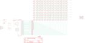

Contents
========

* [PRA5201 > Adafruit](#pra5201--adafruit)
	* [Schematic](#schematic)
	* [Interactive BOM](#interactive-bom)
	* [OOMP Parts](#oomp-parts)
	* [Images](#images)
	* [Tags](#tags)
  
![][im]
# PRA5201 > Adafruit

- ID: PROJ-ADAF-5201-STAN-01
- Hex ID: PRA5201
- Name: Adafruit
- Description: Adafruit
- Long Link: [http://oom.lt/PROJ-ADAF-5201-STAN-01](http://oom.lt/PROJ-ADAF-5201-STAN-01)
- Short Link: [http://oom.lt/PRA5201](http://oom.lt/PRA5201)

## Schematic
  

## Interactive BOM

- Interactive BOM page: [ibom.html](https://htmlpreview.github.io/?https://github.com/oomlout/oomlout_OOMP_projects/blob/main/PROJ-ADAF-5201-STAN-01/kicad/bom/ibom.html)

## OOMP Parts
  

|OOMP Parts|
| :---: |
|C1,CAPC-0805-X-UF10-V10,C1,10uF,CAP_CERAMIC0805-NOOUTLINE,0805-NO,Ceramic Capacitors,,|
|C2,CAPC-0603-X-UF1-01,C2,1uF,CAP_CERAMIC0603_NO,0603-NO,Ceramic Capacitors,,|
|C3,CAPC-0805-X-UF10-V10,C3,10uF,CAP_CERAMIC0805-NOOUTLINE,0805-NO,Ceramic Capacitors,,|
|C4,CAPC-0805-X-UF10-V10,C4,10uF,CAP_CERAMIC0805-NOOUTLINE,0805-NO,Ceramic Capacitors,,|
|C5,CAPC-0805-X-UF10-V10,C5,10uF,CAP_CERAMIC0805-NOOUTLINE,0805-NO,Ceramic Capacitors,,|
|C6,CAPC-0603-X-UF1-01,C6,1uF,CAP_CERAMIC0603_NO,0603-NO,Ceramic Capacitors,,|
|CONN1,UNMATCHED-UNMATCHED-X-UNMATCHED-01,CONN1,STEMMA_I2C_QT,STEMMA_I2C_QT,JST_SH4,,,|
|CONN2,UNMATCHED-UNMATCHED-X-UNMATCHED-01,CONN2,STEMMA_I2C_QT,STEMMA_I2C_QT,JST_SH4,,,|
|JP5,HEAD-I01-X-PI07-01,FID1,FIDUCIAL_1MM,FIDUCIAL_1MM,FIDUCIAL_1MM,Fiducial Alignment Points,EXCLUDE,|
|LED1,UNMATCHED-UNMATCHED-X-UNMATCHED-01,FID2,FIDUCIAL_1MM,FIDUCIAL_1MM,FIDUCIAL_1MM,Fiducial Alignment Points,EXCLUDE,|
|LED2,UNMATCHED-UNMATCHED-X-UNMATCHED-01,FID3,FIDUCIAL_1MM,FIDUCIAL_1MM,FIDUCIAL_1MM,Fiducial Alignment Points,EXCLUDE,|
|LED3,UNMATCHED-UNMATCHED-X-UNMATCHED-01,JP5,,HEADER-1X7THICKER,1X07_ROUND_76,PIN HEADER,,|
|LED4,UNMATCHED-UNMATCHED-X-UNMATCHED-01,LED1,RGBLED_CA_2121,RGBLED_CA_2121,RGBLED_2121,RGB LED, common-anode5MM Staggered pins5mm Piranha package,,|
|LED5,UNMATCHED-UNMATCHED-X-UNMATCHED-01,LED2,RGBLED_CA_2121,RGBLED_CA_2121,RGBLED_2121,RGB LED, common-anode5MM Staggered pins5mm Piranha package,,|
|LED6,UNMATCHED-UNMATCHED-X-UNMATCHED-01,LED3,RGBLED_CA_2121,RGBLED_CA_2121,RGBLED_2121,RGB LED, common-anode5MM Staggered pins5mm Piranha package,,|
|LED7,UNMATCHED-UNMATCHED-X-UNMATCHED-01,LED4,RGBLED_CA_2121,RGBLED_CA_2121,RGBLED_2121,RGB LED, common-anode5MM Staggered pins5mm Piranha package,,|
|LED8,UNMATCHED-UNMATCHED-X-UNMATCHED-01,LED5,RGBLED_CA_2121,RGBLED_CA_2121,RGBLED_2121,RGB LED, common-anode5MM Staggered pins5mm Piranha package,,|
|LED9,UNMATCHED-UNMATCHED-X-UNMATCHED-01,LED6,RGBLED_CA_2121,RGBLED_CA_2121,RGBLED_2121,RGB LED, common-anode5MM Staggered pins5mm Piranha package,,|
|LED10,UNMATCHED-UNMATCHED-X-UNMATCHED-01,LED7,RGBLED_CA_2121,RGBLED_CA_2121,RGBLED_2121,RGB LED, common-anode5MM Staggered pins5mm Piranha package,,|
|LED11,UNMATCHED-UNMATCHED-X-UNMATCHED-01,LED8,RGBLED_CA_2121,RGBLED_CA_2121,RGBLED_2121,RGB LED, common-anode5MM Staggered pins5mm Piranha package,,|
|LED12,UNMATCHED-UNMATCHED-X-UNMATCHED-01,LED9,RGBLED_CA_2121,RGBLED_CA_2121,RGBLED_2121,RGB LED, common-anode5MM Staggered pins5mm Piranha package,,|
|LED13,UNMATCHED-UNMATCHED-X-UNMATCHED-01,LED10,RGBLED_CA_2121,RGBLED_CA_2121,RGBLED_2121,RGB LED, common-anode5MM Staggered pins5mm Piranha package,,|
|LED14,UNMATCHED-UNMATCHED-X-UNMATCHED-01,LED11,RGBLED_CA_2121,RGBLED_CA_2121,RGBLED_2121,RGB LED, common-anode5MM Staggered pins5mm Piranha package,,|
|LED15,UNMATCHED-UNMATCHED-X-UNMATCHED-01,LED12,RGBLED_CA_2121,RGBLED_CA_2121,RGBLED_2121,RGB LED, common-anode5MM Staggered pins5mm Piranha package,,|
|LED16,UNMATCHED-UNMATCHED-X-UNMATCHED-01,LED13,RGBLED_CA_2121,RGBLED_CA_2121,RGBLED_2121,RGB LED, common-anode5MM Staggered pins5mm Piranha package,,|
|LED17,UNMATCHED-UNMATCHED-X-UNMATCHED-01,LED14,RGBLED_CA_2121,RGBLED_CA_2121,RGBLED_2121,RGB LED, common-anode5MM Staggered pins5mm Piranha package,,|
|LED18,UNMATCHED-UNMATCHED-X-UNMATCHED-01,LED15,RGBLED_CA_2121,RGBLED_CA_2121,RGBLED_2121,RGB LED, common-anode5MM Staggered pins5mm Piranha package,,|
|LED19,UNMATCHED-UNMATCHED-X-UNMATCHED-01,LED16,RGBLED_CA_2121,RGBLED_CA_2121,RGBLED_2121,RGB LED, common-anode5MM Staggered pins5mm Piranha package,,|
|LED20,UNMATCHED-UNMATCHED-X-UNMATCHED-01,LED17,RGBLED_CA_2121,RGBLED_CA_2121,RGBLED_2121,RGB LED, common-anode5MM Staggered pins5mm Piranha package,,|
|LED21,UNMATCHED-UNMATCHED-X-UNMATCHED-01,LED18,RGBLED_CA_2121,RGBLED_CA_2121,RGBLED_2121,RGB LED, common-anode5MM Staggered pins5mm Piranha package,,|
|LED22,UNMATCHED-UNMATCHED-X-UNMATCHED-01,LED19,RGBLED_CA_2121,RGBLED_CA_2121,RGBLED_2121,RGB LED, common-anode5MM Staggered pins5mm Piranha package,,|
|LED23,UNMATCHED-UNMATCHED-X-UNMATCHED-01,LED20,RGBLED_CA_2121,RGBLED_CA_2121,RGBLED_2121,RGB LED, common-anode5MM Staggered pins5mm Piranha package,,|
|LED24,UNMATCHED-UNMATCHED-X-UNMATCHED-01,LED21,RGBLED_CA_2121,RGBLED_CA_2121,RGBLED_2121,RGB LED, common-anode5MM Staggered pins5mm Piranha package,,|
|LED25,UNMATCHED-UNMATCHED-X-UNMATCHED-01,LED22,RGBLED_CA_2121,RGBLED_CA_2121,RGBLED_2121,RGB LED, common-anode5MM Staggered pins5mm Piranha package,,|
|LED26,UNMATCHED-UNMATCHED-X-UNMATCHED-01,LED23,RGBLED_CA_2121,RGBLED_CA_2121,RGBLED_2121,RGB LED, common-anode5MM Staggered pins5mm Piranha package,,|
|LED27,UNMATCHED-UNMATCHED-X-UNMATCHED-01,LED24,RGBLED_CA_2121,RGBLED_CA_2121,RGBLED_2121,RGB LED, common-anode5MM Staggered pins5mm Piranha package,,|
|LED28,UNMATCHED-UNMATCHED-X-UNMATCHED-01,LED25,RGBLED_CA_2121,RGBLED_CA_2121,RGBLED_2121,RGB LED, common-anode5MM Staggered pins5mm Piranha package,,|
|LED29,UNMATCHED-UNMATCHED-X-UNMATCHED-01,LED26,RGBLED_CA_2121,RGBLED_CA_2121,RGBLED_2121,RGB LED, common-anode5MM Staggered pins5mm Piranha package,,|
|LED30,UNMATCHED-UNMATCHED-X-UNMATCHED-01,LED27,RGBLED_CA_2121,RGBLED_CA_2121,RGBLED_2121,RGB LED, common-anode5MM Staggered pins5mm Piranha package,,|
|LED31,UNMATCHED-UNMATCHED-X-UNMATCHED-01,LED28,RGBLED_CA_2121,RGBLED_CA_2121,RGBLED_2121,RGB LED, common-anode5MM Staggered pins5mm Piranha package,,|
|LED32,UNMATCHED-UNMATCHED-X-UNMATCHED-01,LED29,RGBLED_CA_2121,RGBLED_CA_2121,RGBLED_2121,RGB LED, common-anode5MM Staggered pins5mm Piranha package,,|
|LED33,UNMATCHED-UNMATCHED-X-UNMATCHED-01,LED30,RGBLED_CA_2121,RGBLED_CA_2121,RGBLED_2121,RGB LED, common-anode5MM Staggered pins5mm Piranha package,,|
|LED34,UNMATCHED-UNMATCHED-X-UNMATCHED-01,LED31,RGBLED_CA_2121,RGBLED_CA_2121,RGBLED_2121,RGB LED, common-anode5MM Staggered pins5mm Piranha package,,|
|LED35,UNMATCHED-UNMATCHED-X-UNMATCHED-01,LED32,RGBLED_CA_2121,RGBLED_CA_2121,RGBLED_2121,RGB LED, common-anode5MM Staggered pins5mm Piranha package,,|
|LED36,UNMATCHED-UNMATCHED-X-UNMATCHED-01,LED33,RGBLED_CA_2121,RGBLED_CA_2121,RGBLED_2121,RGB LED, common-anode5MM Staggered pins5mm Piranha package,,|
|LED37,UNMATCHED-UNMATCHED-X-UNMATCHED-01,LED34,RGBLED_CA_2121,RGBLED_CA_2121,RGBLED_2121,RGB LED, common-anode5MM Staggered pins5mm Piranha package,,|
|LED38,UNMATCHED-UNMATCHED-X-UNMATCHED-01,LED35,RGBLED_CA_2121,RGBLED_CA_2121,RGBLED_2121,RGB LED, common-anode5MM Staggered pins5mm Piranha package,,|
|LED39,UNMATCHED-UNMATCHED-X-UNMATCHED-01,LED36,RGBLED_CA_2121,RGBLED_CA_2121,RGBLED_2121,RGB LED, common-anode5MM Staggered pins5mm Piranha package,,|
|LED40,UNMATCHED-UNMATCHED-X-UNMATCHED-01,LED37,RGBLED_CA_2121,RGBLED_CA_2121,RGBLED_2121,RGB LED, common-anode5MM Staggered pins5mm Piranha package,,|
|LED41,UNMATCHED-UNMATCHED-X-UNMATCHED-01,LED38,RGBLED_CA_2121,RGBLED_CA_2121,RGBLED_2121,RGB LED, common-anode5MM Staggered pins5mm Piranha package,,|
|LED42,UNMATCHED-UNMATCHED-X-UNMATCHED-01,LED39,RGBLED_CA_2121,RGBLED_CA_2121,RGBLED_2121,RGB LED, common-anode5MM Staggered pins5mm Piranha package,,|
|LED43,UNMATCHED-UNMATCHED-X-UNMATCHED-01,LED40,RGBLED_CA_2121,RGBLED_CA_2121,RGBLED_2121,RGB LED, common-anode5MM Staggered pins5mm Piranha package,,|
|LED44,UNMATCHED-UNMATCHED-X-UNMATCHED-01,LED41,RGBLED_CA_2121,RGBLED_CA_2121,RGBLED_2121,RGB LED, common-anode5MM Staggered pins5mm Piranha package,,|
|LED45,UNMATCHED-UNMATCHED-X-UNMATCHED-01,LED42,RGBLED_CA_2121,RGBLED_CA_2121,RGBLED_2121,RGB LED, common-anode5MM Staggered pins5mm Piranha package,,|
|LED46,UNMATCHED-UNMATCHED-X-UNMATCHED-01,LED43,RGBLED_CA_2121,RGBLED_CA_2121,RGBLED_2121,RGB LED, common-anode5MM Staggered pins5mm Piranha package,,|
|LED47,UNMATCHED-UNMATCHED-X-UNMATCHED-01,LED44,RGBLED_CA_2121,RGBLED_CA_2121,RGBLED_2121,RGB LED, common-anode5MM Staggered pins5mm Piranha package,,|
|LED48,UNMATCHED-UNMATCHED-X-UNMATCHED-01,LED45,RGBLED_CA_2121,RGBLED_CA_2121,RGBLED_2121,RGB LED, common-anode5MM Staggered pins5mm Piranha package,,|
|LED49,UNMATCHED-UNMATCHED-X-UNMATCHED-01,LED46,RGBLED_CA_2121,RGBLED_CA_2121,RGBLED_2121,RGB LED, common-anode5MM Staggered pins5mm Piranha package,,|
|LED50,UNMATCHED-UNMATCHED-X-UNMATCHED-01,LED47,RGBLED_CA_2121,RGBLED_CA_2121,RGBLED_2121,RGB LED, common-anode5MM Staggered pins5mm Piranha package,,|
|LED51,UNMATCHED-UNMATCHED-X-UNMATCHED-01,LED48,RGBLED_CA_2121,RGBLED_CA_2121,RGBLED_2121,RGB LED, common-anode5MM Staggered pins5mm Piranha package,,|
|LED52,UNMATCHED-UNMATCHED-X-UNMATCHED-01,LED49,RGBLED_CA_2121,RGBLED_CA_2121,RGBLED_2121,RGB LED, common-anode5MM Staggered pins5mm Piranha package,,|
|LED53,UNMATCHED-UNMATCHED-X-UNMATCHED-01,LED50,RGBLED_CA_2121,RGBLED_CA_2121,RGBLED_2121,RGB LED, common-anode5MM Staggered pins5mm Piranha package,,|
|LED54,UNMATCHED-UNMATCHED-X-UNMATCHED-01,LED51,RGBLED_CA_2121,RGBLED_CA_2121,RGBLED_2121,RGB LED, common-anode5MM Staggered pins5mm Piranha package,,|
|LED55,UNMATCHED-UNMATCHED-X-UNMATCHED-01,LED52,RGBLED_CA_2121,RGBLED_CA_2121,RGBLED_2121,RGB LED, common-anode5MM Staggered pins5mm Piranha package,,|
|LED56,UNMATCHED-UNMATCHED-X-UNMATCHED-01,LED53,RGBLED_CA_2121,RGBLED_CA_2121,RGBLED_2121,RGB LED, common-anode5MM Staggered pins5mm Piranha package,,|
|LED57,UNMATCHED-UNMATCHED-X-UNMATCHED-01,LED54,RGBLED_CA_2121,RGBLED_CA_2121,RGBLED_2121,RGB LED, common-anode5MM Staggered pins5mm Piranha package,,|
|LED58,UNMATCHED-UNMATCHED-X-UNMATCHED-01,LED55,RGBLED_CA_2121,RGBLED_CA_2121,RGBLED_2121,RGB LED, common-anode5MM Staggered pins5mm Piranha package,,|
|LED59,UNMATCHED-UNMATCHED-X-UNMATCHED-01,LED56,RGBLED_CA_2121,RGBLED_CA_2121,RGBLED_2121,RGB LED, common-anode5MM Staggered pins5mm Piranha package,,|
|LED60,UNMATCHED-UNMATCHED-X-UNMATCHED-01,LED57,RGBLED_CA_2121,RGBLED_CA_2121,RGBLED_2121,RGB LED, common-anode5MM Staggered pins5mm Piranha package,,|
|LED61,UNMATCHED-UNMATCHED-X-UNMATCHED-01,LED58,RGBLED_CA_2121,RGBLED_CA_2121,RGBLED_2121,RGB LED, common-anode5MM Staggered pins5mm Piranha package,,|
|LED62,UNMATCHED-UNMATCHED-X-UNMATCHED-01,LED59,RGBLED_CA_2121,RGBLED_CA_2121,RGBLED_2121,RGB LED, common-anode5MM Staggered pins5mm Piranha package,,|
|LED63,UNMATCHED-UNMATCHED-X-UNMATCHED-01,LED60,RGBLED_CA_2121,RGBLED_CA_2121,RGBLED_2121,RGB LED, common-anode5MM Staggered pins5mm Piranha package,,|
|LED64,UNMATCHED-UNMATCHED-X-UNMATCHED-01,LED61,RGBLED_CA_2121,RGBLED_CA_2121,RGBLED_2121,RGB LED, common-anode5MM Staggered pins5mm Piranha package,,|
|LED65,UNMATCHED-UNMATCHED-X-UNMATCHED-01,LED62,RGBLED_CA_2121,RGBLED_CA_2121,RGBLED_2121,RGB LED, common-anode5MM Staggered pins5mm Piranha package,,|
|LED66,UNMATCHED-UNMATCHED-X-UNMATCHED-01,LED63,RGBLED_CA_2121,RGBLED_CA_2121,RGBLED_2121,RGB LED, common-anode5MM Staggered pins5mm Piranha package,,|
|LED67,UNMATCHED-UNMATCHED-X-UNMATCHED-01,LED64,RGBLED_CA_2121,RGBLED_CA_2121,RGBLED_2121,RGB LED, common-anode5MM Staggered pins5mm Piranha package,,|
|LED68,UNMATCHED-UNMATCHED-X-UNMATCHED-01,LED65,RGBLED_CA_2121,RGBLED_CA_2121,RGBLED_2121,RGB LED, common-anode5MM Staggered pins5mm Piranha package,,|
|LED69,UNMATCHED-UNMATCHED-X-UNMATCHED-01,LED66,RGBLED_CA_2121,RGBLED_CA_2121,RGBLED_2121,RGB LED, common-anode5MM Staggered pins5mm Piranha package,,|
|LED70,UNMATCHED-UNMATCHED-X-UNMATCHED-01,LED67,RGBLED_CA_2121,RGBLED_CA_2121,RGBLED_2121,RGB LED, common-anode5MM Staggered pins5mm Piranha package,,|
|LED71,UNMATCHED-UNMATCHED-X-UNMATCHED-01,LED68,RGBLED_CA_2121,RGBLED_CA_2121,RGBLED_2121,RGB LED, common-anode5MM Staggered pins5mm Piranha package,,|
|LED72,UNMATCHED-UNMATCHED-X-UNMATCHED-01,LED69,RGBLED_CA_2121,RGBLED_CA_2121,RGBLED_2121,RGB LED, common-anode5MM Staggered pins5mm Piranha package,,|
|LED73,UNMATCHED-UNMATCHED-X-UNMATCHED-01,LED70,RGBLED_CA_2121,RGBLED_CA_2121,RGBLED_2121,RGB LED, common-anode5MM Staggered pins5mm Piranha package,,|
|LED74,UNMATCHED-UNMATCHED-X-UNMATCHED-01,LED71,RGBLED_CA_2121,RGBLED_CA_2121,RGBLED_2121,RGB LED, common-anode5MM Staggered pins5mm Piranha package,,|
|LED75,UNMATCHED-UNMATCHED-X-UNMATCHED-01,LED72,RGBLED_CA_2121,RGBLED_CA_2121,RGBLED_2121,RGB LED, common-anode5MM Staggered pins5mm Piranha package,,|
|LED76,UNMATCHED-UNMATCHED-X-UNMATCHED-01,LED73,RGBLED_CA_2121,RGBLED_CA_2121,RGBLED_2121,RGB LED, common-anode5MM Staggered pins5mm Piranha package,,|
|LED77,UNMATCHED-UNMATCHED-X-UNMATCHED-01,LED74,RGBLED_CA_2121,RGBLED_CA_2121,RGBLED_2121,RGB LED, common-anode5MM Staggered pins5mm Piranha package,,|
|LED78,UNMATCHED-UNMATCHED-X-UNMATCHED-01,LED75,RGBLED_CA_2121,RGBLED_CA_2121,RGBLED_2121,RGB LED, common-anode5MM Staggered pins5mm Piranha package,,|
|LED79,UNMATCHED-UNMATCHED-X-UNMATCHED-01,LED76,RGBLED_CA_2121,RGBLED_CA_2121,RGBLED_2121,RGB LED, common-anode5MM Staggered pins5mm Piranha package,,|
|LED80,UNMATCHED-UNMATCHED-X-UNMATCHED-01,LED77,RGBLED_CA_2121,RGBLED_CA_2121,RGBLED_2121,RGB LED, common-anode5MM Staggered pins5mm Piranha package,,|
|LED81,UNMATCHED-UNMATCHED-X-UNMATCHED-01,LED78,RGBLED_CA_2121,RGBLED_CA_2121,RGBLED_2121,RGB LED, common-anode5MM Staggered pins5mm Piranha package,,|
|LED82,UNMATCHED-UNMATCHED-X-UNMATCHED-01,LED79,RGBLED_CA_2121,RGBLED_CA_2121,RGBLED_2121,RGB LED, common-anode5MM Staggered pins5mm Piranha package,,|
|LED83,UNMATCHED-UNMATCHED-X-UNMATCHED-01,LED80,RGBLED_CA_2121,RGBLED_CA_2121,RGBLED_2121,RGB LED, common-anode5MM Staggered pins5mm Piranha package,,|
|LED84,UNMATCHED-UNMATCHED-X-UNMATCHED-01,LED81,RGBLED_CA_2121,RGBLED_CA_2121,RGBLED_2121,RGB LED, common-anode5MM Staggered pins5mm Piranha package,,|
|LED85,UNMATCHED-UNMATCHED-X-UNMATCHED-01,LED82,RGBLED_CA_2121,RGBLED_CA_2121,RGBLED_2121,RGB LED, common-anode5MM Staggered pins5mm Piranha package,,|
|LED86,UNMATCHED-UNMATCHED-X-UNMATCHED-01,LED83,RGBLED_CA_2121,RGBLED_CA_2121,RGBLED_2121,RGB LED, common-anode5MM Staggered pins5mm Piranha package,,|
|LED87,UNMATCHED-UNMATCHED-X-UNMATCHED-01,LED84,RGBLED_CA_2121,RGBLED_CA_2121,RGBLED_2121,RGB LED, common-anode5MM Staggered pins5mm Piranha package,,|
|LED88,UNMATCHED-UNMATCHED-X-UNMATCHED-01,LED85,RGBLED_CA_2121,RGBLED_CA_2121,RGBLED_2121,RGB LED, common-anode5MM Staggered pins5mm Piranha package,,|
|LED89,UNMATCHED-UNMATCHED-X-UNMATCHED-01,LED86,RGBLED_CA_2121,RGBLED_CA_2121,RGBLED_2121,RGB LED, common-anode5MM Staggered pins5mm Piranha package,,|
|LED90,UNMATCHED-UNMATCHED-X-UNMATCHED-01,LED87,RGBLED_CA_2121,RGBLED_CA_2121,RGBLED_2121,RGB LED, common-anode5MM Staggered pins5mm Piranha package,,|
|LED91,UNMATCHED-UNMATCHED-X-UNMATCHED-01,LED88,RGBLED_CA_2121,RGBLED_CA_2121,RGBLED_2121,RGB LED, common-anode5MM Staggered pins5mm Piranha package,,|
|LED92,UNMATCHED-UNMATCHED-X-UNMATCHED-01,LED89,RGBLED_CA_2121,RGBLED_CA_2121,RGBLED_2121,RGB LED, common-anode5MM Staggered pins5mm Piranha package,,|
|LED93,UNMATCHED-UNMATCHED-X-UNMATCHED-01,LED90,RGBLED_CA_2121,RGBLED_CA_2121,RGBLED_2121,RGB LED, common-anode5MM Staggered pins5mm Piranha package,,|
|LED94,UNMATCHED-UNMATCHED-X-UNMATCHED-01,LED91,RGBLED_CA_2121,RGBLED_CA_2121,RGBLED_2121,RGB LED, common-anode5MM Staggered pins5mm Piranha package,,|
|LED95,UNMATCHED-UNMATCHED-X-UNMATCHED-01,LED92,RGBLED_CA_2121,RGBLED_CA_2121,RGBLED_2121,RGB LED, common-anode5MM Staggered pins5mm Piranha package,,|
|LED96,UNMATCHED-UNMATCHED-X-UNMATCHED-01,LED93,RGBLED_CA_2121,RGBLED_CA_2121,RGBLED_2121,RGB LED, common-anode5MM Staggered pins5mm Piranha package,,|
|LED97,UNMATCHED-UNMATCHED-X-UNMATCHED-01,LED94,RGBLED_CA_2121,RGBLED_CA_2121,RGBLED_2121,RGB LED, common-anode5MM Staggered pins5mm Piranha package,,|
|LED98,UNMATCHED-UNMATCHED-X-UNMATCHED-01,LED95,RGBLED_CA_2121,RGBLED_CA_2121,RGBLED_2121,RGB LED, common-anode5MM Staggered pins5mm Piranha package,,|
|LED99,UNMATCHED-UNMATCHED-X-UNMATCHED-01,LED96,RGBLED_CA_2121,RGBLED_CA_2121,RGBLED_2121,RGB LED, common-anode5MM Staggered pins5mm Piranha package,,|
|LED100,UNMATCHED-UNMATCHED-X-UNMATCHED-01,LED97,RGBLED_CA_2121,RGBLED_CA_2121,RGBLED_2121,RGB LED, common-anode5MM Staggered pins5mm Piranha package,,|
|LED101,UNMATCHED-UNMATCHED-X-UNMATCHED-01,LED98,RGBLED_CA_2121,RGBLED_CA_2121,RGBLED_2121,RGB LED, common-anode5MM Staggered pins5mm Piranha package,,|
|LED102,UNMATCHED-UNMATCHED-X-UNMATCHED-01,LED99,RGBLED_CA_2121,RGBLED_CA_2121,RGBLED_2121,RGB LED, common-anode5MM Staggered pins5mm Piranha package,,|
|LED103,UNMATCHED-UNMATCHED-X-UNMATCHED-01,LED100,RGBLED_CA_2121,RGBLED_CA_2121,RGBLED_2121,RGB LED, common-anode5MM Staggered pins5mm Piranha package,,|
|LED104,UNMATCHED-UNMATCHED-X-UNMATCHED-01,LED101,RGBLED_CA_2121,RGBLED_CA_2121,RGBLED_2121,RGB LED, common-anode5MM Staggered pins5mm Piranha package,,|
|LED105,UNMATCHED-UNMATCHED-X-UNMATCHED-01,LED102,RGBLED_CA_2121,RGBLED_CA_2121,RGBLED_2121,RGB LED, common-anode5MM Staggered pins5mm Piranha package,,|
|LED106,UNMATCHED-UNMATCHED-X-UNMATCHED-01,LED103,RGBLED_CA_2121,RGBLED_CA_2121,RGBLED_2121,RGB LED, common-anode5MM Staggered pins5mm Piranha package,,|
|LED107,UNMATCHED-UNMATCHED-X-UNMATCHED-01,LED104,RGBLED_CA_2121,RGBLED_CA_2121,RGBLED_2121,RGB LED, common-anode5MM Staggered pins5mm Piranha package,,|
|LED108,UNMATCHED-UNMATCHED-X-UNMATCHED-01,LED105,RGBLED_CA_2121,RGBLED_CA_2121,RGBLED_2121,RGB LED, common-anode5MM Staggered pins5mm Piranha package,,|
|LED109,UNMATCHED-UNMATCHED-X-UNMATCHED-01,LED106,RGBLED_CA_2121,RGBLED_CA_2121,RGBLED_2121,RGB LED, common-anode5MM Staggered pins5mm Piranha package,,|
|LED110,UNMATCHED-UNMATCHED-X-UNMATCHED-01,LED107,RGBLED_CA_2121,RGBLED_CA_2121,RGBLED_2121,RGB LED, common-anode5MM Staggered pins5mm Piranha package,,|
|LED111,UNMATCHED-UNMATCHED-X-UNMATCHED-01,LED108,RGBLED_CA_2121,RGBLED_CA_2121,RGBLED_2121,RGB LED, common-anode5MM Staggered pins5mm Piranha package,,|
|LED112,UNMATCHED-UNMATCHED-X-UNMATCHED-01,LED109,RGBLED_CA_2121,RGBLED_CA_2121,RGBLED_2121,RGB LED, common-anode5MM Staggered pins5mm Piranha package,,|
|LED113,UNMATCHED-UNMATCHED-X-UNMATCHED-01,LED110,RGBLED_CA_2121,RGBLED_CA_2121,RGBLED_2121,RGB LED, common-anode5MM Staggered pins5mm Piranha package,,|
|LED114,UNMATCHED-UNMATCHED-X-UNMATCHED-01,LED111,RGBLED_CA_2121,RGBLED_CA_2121,RGBLED_2121,RGB LED, common-anode5MM Staggered pins5mm Piranha package,,|
|LED115,UNMATCHED-UNMATCHED-X-UNMATCHED-01,LED112,RGBLED_CA_2121,RGBLED_CA_2121,RGBLED_2121,RGB LED, common-anode5MM Staggered pins5mm Piranha package,,|
|LED116,UNMATCHED-UNMATCHED-X-UNMATCHED-01,LED113,RGBLED_CA_2121,RGBLED_CA_2121,RGBLED_2121,RGB LED, common-anode5MM Staggered pins5mm Piranha package,,|
|LED117,UNMATCHED-UNMATCHED-X-UNMATCHED-01,LED114,RGBLED_CA_2121,RGBLED_CA_2121,RGBLED_2121,RGB LED, common-anode5MM Staggered pins5mm Piranha package,,|
|R1,RESE-0603-X-UNMATCHED-01,LED115,RGBLED_CA_2121,RGBLED_CA_2121,RGBLED_2121,RGB LED, common-anode5MM Staggered pins5mm Piranha package,,|
|R2,RESE-UNMATCHED-X-O21-01,LED116,RGBLED_CA_2121,RGBLED_CA_2121,RGBLED_2121,RGB LED, common-anode5MM Staggered pins5mm Piranha package,,|
|R3,RESE-UNMATCHED-X-O21-01,LED117,RGBLED_CA_2121,RGBLED_CA_2121,RGBLED_2121,RGB LED, common-anode5MM Staggered pins5mm Piranha package,,|
|R4,RESE-UNMATCHED-X-O21-01,R1,2.2K,RESISTOR_0603_NOOUT,0603-NO,Resistors,,|
|R5,RESE-UNMATCHED-X-O21-01,R2,22,RESISTOR_4PACK,RESPACK_4X0603,Resistor Packs (4 resistors),,|
|R6,RESE-UNMATCHED-X-O21-01,R3,22,RESISTOR_4PACK,RESPACK_4X0603,Resistor Packs (4 resistors),,|
|R7,RESE-UNMATCHED-X-O472-01,R4,22,RESISTOR_4PACK,RESPACK_4X0603,Resistor Packs (4 resistors),,|
|R8,RESE-UNMATCHED-X-O21-01,R5,22,RESISTOR_4PACK,RESPACK_4X0603,Resistor Packs (4 resistors),,|
|R9,RESE-0603-X-O21-01,R6,22,RESISTOR_4PACK,RESPACK_4X0603,Resistor Packs (4 resistors),,|
|R10,RESE-0603-X-O51-01,R7,4.7K,RESISTOR_4PACK,RESPACK_4X0603,Resistor Packs (4 resistors),,|
|R11,RESE-0603-X-O51-01,R8,22,RESISTOR_4PACK,RESPACK_4X0603,Resistor Packs (4 resistors),,|
|R12,RESE-0603-X-O51-01,R9,22,RESISTOR_0603_NOOUT,0603-NO,Resistors,,|
|R13,RESE-0603-X-O51-01,R10,51,RESISTOR_0603_NOOUT,0603-NO,Resistors,,|
|R14,RESE-0603-X-O51-01,R11,51,RESISTOR_0603_NOOUT,0603-NO,Resistors,,|
|R15,RESE-0603-X-O51-01,R12,51,RESISTOR_0603_NOOUT,0603-NO,Resistors,,|
|R16,RESE-0603-X-O51-01,R13,51,RESISTOR_0603_NOOUT,0603-NO,Resistors,,|
|R17,RESE-0603-X-O51-01,R14,51,RESISTOR_0603_NOOUT,0603-NO,Resistors,,|
|R18,RESE-0603-X-O51-01,R15,51,RESISTOR_0603_NOOUT,0603-NO,Resistors,,|
|R19,RESE-0603-X-O51-01,R16,51,RESISTOR_0603_NOOUT,0603-NO,Resistors,,|
|R20,RESE-0603-X-O51-01,R17,51,RESISTOR_0603_NOOUT,0603-NO,Resistors,,|
|R21,RESE-0603-X-O51-01,R18,51,RESISTOR_0603_NOOUT,0603-NO,Resistors,,|
|R22,RESE-0603-X-O51-01,R19,51,RESISTOR_0603_NOOUT,0603-NO,Resistors,,|
|R23,RESE-0603-X-O21-01,R20,51,RESISTOR_0603_NOOUT,0603-NO,Resistors,,|
|X1,UNMATCHED-UNMATCHED-X-UNMATCHED-01,R21,51,RESISTOR_0603_NOOUT,0603-NO,Resistors,,|

## Images
  
  

|kicadPcb3d|kicadPcb3dFront|kicadPcb3dBack|eagleImage|eagleSchemImage|
| :---: | :---: | :---: | :---: | :---: |
||||||

## Tags

- hexID: PRA5201
- oompType: PROJ
- oompSize: ADAF
- oompColor: 5201
- oompDesc: STAN
- oompIndex: 01
- oompName: Adafruit IS31FL3741 PCB
- sources: All source files from https://github.com/adafruit/Adafruit-IS31FL3741-PCB (source licence details in srcLicense.md)
- linkBuyPage: http://www.adafruit.com/products/5201
- oompID: PROJ-ADAF-5201-STAN-01
- oompParts: C1,CAPC-0805-X-UF10-V10
- oompParts: C2,CAPC-0603-X-UF1-01
- oompParts: C3,CAPC-0805-X-UF10-V10
- oompParts: C4,CAPC-0805-X-UF10-V10
- oompParts: C5,CAPC-0805-X-UF10-V10
- oompParts: C6,CAPC-0603-X-UF1-01
- oompParts: CONN1,UNMATCHED-UNMATCHED-X-UNMATCHED-01
- oompParts: CONN2,UNMATCHED-UNMATCHED-X-UNMATCHED-01
- oompParts: JP5,HEAD-I01-X-PI07-01
- oompParts: LED1,UNMATCHED-UNMATCHED-X-UNMATCHED-01
- oompParts: LED2,UNMATCHED-UNMATCHED-X-UNMATCHED-01
- oompParts: LED3,UNMATCHED-UNMATCHED-X-UNMATCHED-01
- oompParts: LED4,UNMATCHED-UNMATCHED-X-UNMATCHED-01
- oompParts: LED5,UNMATCHED-UNMATCHED-X-UNMATCHED-01
- oompParts: LED6,UNMATCHED-UNMATCHED-X-UNMATCHED-01
- oompParts: LED7,UNMATCHED-UNMATCHED-X-UNMATCHED-01
- oompParts: LED8,UNMATCHED-UNMATCHED-X-UNMATCHED-01
- oompParts: LED9,UNMATCHED-UNMATCHED-X-UNMATCHED-01
- oompParts: LED10,UNMATCHED-UNMATCHED-X-UNMATCHED-01
- oompParts: LED11,UNMATCHED-UNMATCHED-X-UNMATCHED-01
- oompParts: LED12,UNMATCHED-UNMATCHED-X-UNMATCHED-01
- oompParts: LED13,UNMATCHED-UNMATCHED-X-UNMATCHED-01
- oompParts: LED14,UNMATCHED-UNMATCHED-X-UNMATCHED-01
- oompParts: LED15,UNMATCHED-UNMATCHED-X-UNMATCHED-01
- oompParts: LED16,UNMATCHED-UNMATCHED-X-UNMATCHED-01
- oompParts: LED17,UNMATCHED-UNMATCHED-X-UNMATCHED-01
- oompParts: LED18,UNMATCHED-UNMATCHED-X-UNMATCHED-01
- oompParts: LED19,UNMATCHED-UNMATCHED-X-UNMATCHED-01
- oompParts: LED20,UNMATCHED-UNMATCHED-X-UNMATCHED-01
- oompParts: LED21,UNMATCHED-UNMATCHED-X-UNMATCHED-01
- oompParts: LED22,UNMATCHED-UNMATCHED-X-UNMATCHED-01
- oompParts: LED23,UNMATCHED-UNMATCHED-X-UNMATCHED-01
- oompParts: LED24,UNMATCHED-UNMATCHED-X-UNMATCHED-01
- oompParts: LED25,UNMATCHED-UNMATCHED-X-UNMATCHED-01
- oompParts: LED26,UNMATCHED-UNMATCHED-X-UNMATCHED-01
- oompParts: LED27,UNMATCHED-UNMATCHED-X-UNMATCHED-01
- oompParts: LED28,UNMATCHED-UNMATCHED-X-UNMATCHED-01
- oompParts: LED29,UNMATCHED-UNMATCHED-X-UNMATCHED-01
- oompParts: LED30,UNMATCHED-UNMATCHED-X-UNMATCHED-01
- oompParts: LED31,UNMATCHED-UNMATCHED-X-UNMATCHED-01
- oompParts: LED32,UNMATCHED-UNMATCHED-X-UNMATCHED-01
- oompParts: LED33,UNMATCHED-UNMATCHED-X-UNMATCHED-01
- oompParts: LED34,UNMATCHED-UNMATCHED-X-UNMATCHED-01
- oompParts: LED35,UNMATCHED-UNMATCHED-X-UNMATCHED-01
- oompParts: LED36,UNMATCHED-UNMATCHED-X-UNMATCHED-01
- oompParts: LED37,UNMATCHED-UNMATCHED-X-UNMATCHED-01
- oompParts: LED38,UNMATCHED-UNMATCHED-X-UNMATCHED-01
- oompParts: LED39,UNMATCHED-UNMATCHED-X-UNMATCHED-01
- oompParts: LED40,UNMATCHED-UNMATCHED-X-UNMATCHED-01
- oompParts: LED41,UNMATCHED-UNMATCHED-X-UNMATCHED-01
- oompParts: LED42,UNMATCHED-UNMATCHED-X-UNMATCHED-01
- oompParts: LED43,UNMATCHED-UNMATCHED-X-UNMATCHED-01
- oompParts: LED44,UNMATCHED-UNMATCHED-X-UNMATCHED-01
- oompParts: LED45,UNMATCHED-UNMATCHED-X-UNMATCHED-01
- oompParts: LED46,UNMATCHED-UNMATCHED-X-UNMATCHED-01
- oompParts: LED47,UNMATCHED-UNMATCHED-X-UNMATCHED-01
- oompParts: LED48,UNMATCHED-UNMATCHED-X-UNMATCHED-01
- oompParts: LED49,UNMATCHED-UNMATCHED-X-UNMATCHED-01
- oompParts: LED50,UNMATCHED-UNMATCHED-X-UNMATCHED-01
- oompParts: LED51,UNMATCHED-UNMATCHED-X-UNMATCHED-01
- oompParts: LED52,UNMATCHED-UNMATCHED-X-UNMATCHED-01
- oompParts: LED53,UNMATCHED-UNMATCHED-X-UNMATCHED-01
- oompParts: LED54,UNMATCHED-UNMATCHED-X-UNMATCHED-01
- oompParts: LED55,UNMATCHED-UNMATCHED-X-UNMATCHED-01
- oompParts: LED56,UNMATCHED-UNMATCHED-X-UNMATCHED-01
- oompParts: LED57,UNMATCHED-UNMATCHED-X-UNMATCHED-01
- oompParts: LED58,UNMATCHED-UNMATCHED-X-UNMATCHED-01
- oompParts: LED59,UNMATCHED-UNMATCHED-X-UNMATCHED-01
- oompParts: LED60,UNMATCHED-UNMATCHED-X-UNMATCHED-01
- oompParts: LED61,UNMATCHED-UNMATCHED-X-UNMATCHED-01
- oompParts: LED62,UNMATCHED-UNMATCHED-X-UNMATCHED-01
- oompParts: LED63,UNMATCHED-UNMATCHED-X-UNMATCHED-01
- oompParts: LED64,UNMATCHED-UNMATCHED-X-UNMATCHED-01
- oompParts: LED65,UNMATCHED-UNMATCHED-X-UNMATCHED-01
- oompParts: LED66,UNMATCHED-UNMATCHED-X-UNMATCHED-01
- oompParts: LED67,UNMATCHED-UNMATCHED-X-UNMATCHED-01
- oompParts: LED68,UNMATCHED-UNMATCHED-X-UNMATCHED-01
- oompParts: LED69,UNMATCHED-UNMATCHED-X-UNMATCHED-01
- oompParts: LED70,UNMATCHED-UNMATCHED-X-UNMATCHED-01
- oompParts: LED71,UNMATCHED-UNMATCHED-X-UNMATCHED-01
- oompParts: LED72,UNMATCHED-UNMATCHED-X-UNMATCHED-01
- oompParts: LED73,UNMATCHED-UNMATCHED-X-UNMATCHED-01
- oompParts: LED74,UNMATCHED-UNMATCHED-X-UNMATCHED-01
- oompParts: LED75,UNMATCHED-UNMATCHED-X-UNMATCHED-01
- oompParts: LED76,UNMATCHED-UNMATCHED-X-UNMATCHED-01
- oompParts: LED77,UNMATCHED-UNMATCHED-X-UNMATCHED-01
- oompParts: LED78,UNMATCHED-UNMATCHED-X-UNMATCHED-01
- oompParts: LED79,UNMATCHED-UNMATCHED-X-UNMATCHED-01
- oompParts: LED80,UNMATCHED-UNMATCHED-X-UNMATCHED-01
- oompParts: LED81,UNMATCHED-UNMATCHED-X-UNMATCHED-01
- oompParts: LED82,UNMATCHED-UNMATCHED-X-UNMATCHED-01
- oompParts: LED83,UNMATCHED-UNMATCHED-X-UNMATCHED-01
- oompParts: LED84,UNMATCHED-UNMATCHED-X-UNMATCHED-01
- oompParts: LED85,UNMATCHED-UNMATCHED-X-UNMATCHED-01
- oompParts: LED86,UNMATCHED-UNMATCHED-X-UNMATCHED-01
- oompParts: LED87,UNMATCHED-UNMATCHED-X-UNMATCHED-01
- oompParts: LED88,UNMATCHED-UNMATCHED-X-UNMATCHED-01
- oompParts: LED89,UNMATCHED-UNMATCHED-X-UNMATCHED-01
- oompParts: LED90,UNMATCHED-UNMATCHED-X-UNMATCHED-01
- oompParts: LED91,UNMATCHED-UNMATCHED-X-UNMATCHED-01
- oompParts: LED92,UNMATCHED-UNMATCHED-X-UNMATCHED-01
- oompParts: LED93,UNMATCHED-UNMATCHED-X-UNMATCHED-01
- oompParts: LED94,UNMATCHED-UNMATCHED-X-UNMATCHED-01
- oompParts: LED95,UNMATCHED-UNMATCHED-X-UNMATCHED-01
- oompParts: LED96,UNMATCHED-UNMATCHED-X-UNMATCHED-01
- oompParts: LED97,UNMATCHED-UNMATCHED-X-UNMATCHED-01
- oompParts: LED98,UNMATCHED-UNMATCHED-X-UNMATCHED-01
- oompParts: LED99,UNMATCHED-UNMATCHED-X-UNMATCHED-01
- oompParts: LED100,UNMATCHED-UNMATCHED-X-UNMATCHED-01
- oompParts: LED101,UNMATCHED-UNMATCHED-X-UNMATCHED-01
- oompParts: LED102,UNMATCHED-UNMATCHED-X-UNMATCHED-01
- oompParts: LED103,UNMATCHED-UNMATCHED-X-UNMATCHED-01
- oompParts: LED104,UNMATCHED-UNMATCHED-X-UNMATCHED-01
- oompParts: LED105,UNMATCHED-UNMATCHED-X-UNMATCHED-01
- oompParts: LED106,UNMATCHED-UNMATCHED-X-UNMATCHED-01
- oompParts: LED107,UNMATCHED-UNMATCHED-X-UNMATCHED-01
- oompParts: LED108,UNMATCHED-UNMATCHED-X-UNMATCHED-01
- oompParts: LED109,UNMATCHED-UNMATCHED-X-UNMATCHED-01
- oompParts: LED110,UNMATCHED-UNMATCHED-X-UNMATCHED-01
- oompParts: LED111,UNMATCHED-UNMATCHED-X-UNMATCHED-01
- oompParts: LED112,UNMATCHED-UNMATCHED-X-UNMATCHED-01
- oompParts: LED113,UNMATCHED-UNMATCHED-X-UNMATCHED-01
- oompParts: LED114,UNMATCHED-UNMATCHED-X-UNMATCHED-01
- oompParts: LED115,UNMATCHED-UNMATCHED-X-UNMATCHED-01
- oompParts: LED116,UNMATCHED-UNMATCHED-X-UNMATCHED-01
- oompParts: LED117,UNMATCHED-UNMATCHED-X-UNMATCHED-01
- oompParts: R1,RESE-0603-X-UNMATCHED-01
- oompParts: R2,RESE-UNMATCHED-X-O21-01
- oompParts: R3,RESE-UNMATCHED-X-O21-01
- oompParts: R4,RESE-UNMATCHED-X-O21-01
- oompParts: R5,RESE-UNMATCHED-X-O21-01
- oompParts: R6,RESE-UNMATCHED-X-O21-01
- oompParts: R7,RESE-UNMATCHED-X-O472-01
- oompParts: R8,RESE-UNMATCHED-X-O21-01
- oompParts: R9,RESE-0603-X-O21-01
- oompParts: R10,RESE-0603-X-O51-01
- oompParts: R11,RESE-0603-X-O51-01
- oompParts: R12,RESE-0603-X-O51-01
- oompParts: R13,RESE-0603-X-O51-01
- oompParts: R14,RESE-0603-X-O51-01
- oompParts: R15,RESE-0603-X-O51-01
- oompParts: R16,RESE-0603-X-O51-01
- oompParts: R17,RESE-0603-X-O51-01
- oompParts: R18,RESE-0603-X-O51-01
- oompParts: R19,RESE-0603-X-O51-01
- oompParts: R20,RESE-0603-X-O51-01
- oompParts: R21,RESE-0603-X-O51-01
- oompParts: R22,RESE-0603-X-O51-01
- oompParts: R23,RESE-0603-X-O21-01
- oompParts: X1,UNMATCHED-UNMATCHED-X-UNMATCHED-01
- rawParts: C1,10uF,CAP_CERAMIC0805-NOOUTLINE,0805-NO,Ceramic Capacitors,,
- rawParts: C2,1uF,CAP_CERAMIC0603_NO,0603-NO,Ceramic Capacitors,,
- rawParts: C3,10uF,CAP_CERAMIC0805-NOOUTLINE,0805-NO,Ceramic Capacitors,,
- rawParts: C4,10uF,CAP_CERAMIC0805-NOOUTLINE,0805-NO,Ceramic Capacitors,,
- rawParts: C5,10uF,CAP_CERAMIC0805-NOOUTLINE,0805-NO,Ceramic Capacitors,,
- rawParts: C6,1uF,CAP_CERAMIC0603_NO,0603-NO,Ceramic Capacitors,,
- rawParts: CONN1,STEMMA_I2C_QT,STEMMA_I2C_QT,JST_SH4,,,
- rawParts: CONN2,STEMMA_I2C_QT,STEMMA_I2C_QT,JST_SH4,,,
- rawParts: FID1,FIDUCIAL_1MM,FIDUCIAL_1MM,FIDUCIAL_1MM,Fiducial Alignment Points,EXCLUDE,
- rawParts: FID2,FIDUCIAL_1MM,FIDUCIAL_1MM,FIDUCIAL_1MM,Fiducial Alignment Points,EXCLUDE,
- rawParts: FID3,FIDUCIAL_1MM,FIDUCIAL_1MM,FIDUCIAL_1MM,Fiducial Alignment Points,EXCLUDE,
- rawParts: JP5,,HEADER-1X7THICKER,1X07_ROUND_76,PIN HEADER,,
- rawParts: LED1,RGBLED_CA_2121,RGBLED_CA_2121,RGBLED_2121,RGB LED, common-anode5MM Staggered pins5mm Piranha package,,
- rawParts: LED2,RGBLED_CA_2121,RGBLED_CA_2121,RGBLED_2121,RGB LED, common-anode5MM Staggered pins5mm Piranha package,,
- rawParts: LED3,RGBLED_CA_2121,RGBLED_CA_2121,RGBLED_2121,RGB LED, common-anode5MM Staggered pins5mm Piranha package,,
- rawParts: LED4,RGBLED_CA_2121,RGBLED_CA_2121,RGBLED_2121,RGB LED, common-anode5MM Staggered pins5mm Piranha package,,
- rawParts: LED5,RGBLED_CA_2121,RGBLED_CA_2121,RGBLED_2121,RGB LED, common-anode5MM Staggered pins5mm Piranha package,,
- rawParts: LED6,RGBLED_CA_2121,RGBLED_CA_2121,RGBLED_2121,RGB LED, common-anode5MM Staggered pins5mm Piranha package,,
- rawParts: LED7,RGBLED_CA_2121,RGBLED_CA_2121,RGBLED_2121,RGB LED, common-anode5MM Staggered pins5mm Piranha package,,
- rawParts: LED8,RGBLED_CA_2121,RGBLED_CA_2121,RGBLED_2121,RGB LED, common-anode5MM Staggered pins5mm Piranha package,,
- rawParts: LED9,RGBLED_CA_2121,RGBLED_CA_2121,RGBLED_2121,RGB LED, common-anode5MM Staggered pins5mm Piranha package,,
- rawParts: LED10,RGBLED_CA_2121,RGBLED_CA_2121,RGBLED_2121,RGB LED, common-anode5MM Staggered pins5mm Piranha package,,
- rawParts: LED11,RGBLED_CA_2121,RGBLED_CA_2121,RGBLED_2121,RGB LED, common-anode5MM Staggered pins5mm Piranha package,,
- rawParts: LED12,RGBLED_CA_2121,RGBLED_CA_2121,RGBLED_2121,RGB LED, common-anode5MM Staggered pins5mm Piranha package,,
- rawParts: LED13,RGBLED_CA_2121,RGBLED_CA_2121,RGBLED_2121,RGB LED, common-anode5MM Staggered pins5mm Piranha package,,
- rawParts: LED14,RGBLED_CA_2121,RGBLED_CA_2121,RGBLED_2121,RGB LED, common-anode5MM Staggered pins5mm Piranha package,,
- rawParts: LED15,RGBLED_CA_2121,RGBLED_CA_2121,RGBLED_2121,RGB LED, common-anode5MM Staggered pins5mm Piranha package,,
- rawParts: LED16,RGBLED_CA_2121,RGBLED_CA_2121,RGBLED_2121,RGB LED, common-anode5MM Staggered pins5mm Piranha package,,
- rawParts: LED17,RGBLED_CA_2121,RGBLED_CA_2121,RGBLED_2121,RGB LED, common-anode5MM Staggered pins5mm Piranha package,,
- rawParts: LED18,RGBLED_CA_2121,RGBLED_CA_2121,RGBLED_2121,RGB LED, common-anode5MM Staggered pins5mm Piranha package,,
- rawParts: LED19,RGBLED_CA_2121,RGBLED_CA_2121,RGBLED_2121,RGB LED, common-anode5MM Staggered pins5mm Piranha package,,
- rawParts: LED20,RGBLED_CA_2121,RGBLED_CA_2121,RGBLED_2121,RGB LED, common-anode5MM Staggered pins5mm Piranha package,,
- rawParts: LED21,RGBLED_CA_2121,RGBLED_CA_2121,RGBLED_2121,RGB LED, common-anode5MM Staggered pins5mm Piranha package,,
- rawParts: LED22,RGBLED_CA_2121,RGBLED_CA_2121,RGBLED_2121,RGB LED, common-anode5MM Staggered pins5mm Piranha package,,
- rawParts: LED23,RGBLED_CA_2121,RGBLED_CA_2121,RGBLED_2121,RGB LED, common-anode5MM Staggered pins5mm Piranha package,,
- rawParts: LED24,RGBLED_CA_2121,RGBLED_CA_2121,RGBLED_2121,RGB LED, common-anode5MM Staggered pins5mm Piranha package,,
- rawParts: LED25,RGBLED_CA_2121,RGBLED_CA_2121,RGBLED_2121,RGB LED, common-anode5MM Staggered pins5mm Piranha package,,
- rawParts: LED26,RGBLED_CA_2121,RGBLED_CA_2121,RGBLED_2121,RGB LED, common-anode5MM Staggered pins5mm Piranha package,,
- rawParts: LED27,RGBLED_CA_2121,RGBLED_CA_2121,RGBLED_2121,RGB LED, common-anode5MM Staggered pins5mm Piranha package,,
- rawParts: LED28,RGBLED_CA_2121,RGBLED_CA_2121,RGBLED_2121,RGB LED, common-anode5MM Staggered pins5mm Piranha package,,
- rawParts: LED29,RGBLED_CA_2121,RGBLED_CA_2121,RGBLED_2121,RGB LED, common-anode5MM Staggered pins5mm Piranha package,,
- rawParts: LED30,RGBLED_CA_2121,RGBLED_CA_2121,RGBLED_2121,RGB LED, common-anode5MM Staggered pins5mm Piranha package,,
- rawParts: LED31,RGBLED_CA_2121,RGBLED_CA_2121,RGBLED_2121,RGB LED, common-anode5MM Staggered pins5mm Piranha package,,
- rawParts: LED32,RGBLED_CA_2121,RGBLED_CA_2121,RGBLED_2121,RGB LED, common-anode5MM Staggered pins5mm Piranha package,,
- rawParts: LED33,RGBLED_CA_2121,RGBLED_CA_2121,RGBLED_2121,RGB LED, common-anode5MM Staggered pins5mm Piranha package,,
- rawParts: LED34,RGBLED_CA_2121,RGBLED_CA_2121,RGBLED_2121,RGB LED, common-anode5MM Staggered pins5mm Piranha package,,
- rawParts: LED35,RGBLED_CA_2121,RGBLED_CA_2121,RGBLED_2121,RGB LED, common-anode5MM Staggered pins5mm Piranha package,,
- rawParts: LED36,RGBLED_CA_2121,RGBLED_CA_2121,RGBLED_2121,RGB LED, common-anode5MM Staggered pins5mm Piranha package,,
- rawParts: LED37,RGBLED_CA_2121,RGBLED_CA_2121,RGBLED_2121,RGB LED, common-anode5MM Staggered pins5mm Piranha package,,
- rawParts: LED38,RGBLED_CA_2121,RGBLED_CA_2121,RGBLED_2121,RGB LED, common-anode5MM Staggered pins5mm Piranha package,,
- rawParts: LED39,RGBLED_CA_2121,RGBLED_CA_2121,RGBLED_2121,RGB LED, common-anode5MM Staggered pins5mm Piranha package,,
- rawParts: LED40,RGBLED_CA_2121,RGBLED_CA_2121,RGBLED_2121,RGB LED, common-anode5MM Staggered pins5mm Piranha package,,
- rawParts: LED41,RGBLED_CA_2121,RGBLED_CA_2121,RGBLED_2121,RGB LED, common-anode5MM Staggered pins5mm Piranha package,,
- rawParts: LED42,RGBLED_CA_2121,RGBLED_CA_2121,RGBLED_2121,RGB LED, common-anode5MM Staggered pins5mm Piranha package,,
- rawParts: LED43,RGBLED_CA_2121,RGBLED_CA_2121,RGBLED_2121,RGB LED, common-anode5MM Staggered pins5mm Piranha package,,
- rawParts: LED44,RGBLED_CA_2121,RGBLED_CA_2121,RGBLED_2121,RGB LED, common-anode5MM Staggered pins5mm Piranha package,,
- rawParts: LED45,RGBLED_CA_2121,RGBLED_CA_2121,RGBLED_2121,RGB LED, common-anode5MM Staggered pins5mm Piranha package,,
- rawParts: LED46,RGBLED_CA_2121,RGBLED_CA_2121,RGBLED_2121,RGB LED, common-anode5MM Staggered pins5mm Piranha package,,
- rawParts: LED47,RGBLED_CA_2121,RGBLED_CA_2121,RGBLED_2121,RGB LED, common-anode5MM Staggered pins5mm Piranha package,,
- rawParts: LED48,RGBLED_CA_2121,RGBLED_CA_2121,RGBLED_2121,RGB LED, common-anode5MM Staggered pins5mm Piranha package,,
- rawParts: LED49,RGBLED_CA_2121,RGBLED_CA_2121,RGBLED_2121,RGB LED, common-anode5MM Staggered pins5mm Piranha package,,
- rawParts: LED50,RGBLED_CA_2121,RGBLED_CA_2121,RGBLED_2121,RGB LED, common-anode5MM Staggered pins5mm Piranha package,,
- rawParts: LED51,RGBLED_CA_2121,RGBLED_CA_2121,RGBLED_2121,RGB LED, common-anode5MM Staggered pins5mm Piranha package,,
- rawParts: LED52,RGBLED_CA_2121,RGBLED_CA_2121,RGBLED_2121,RGB LED, common-anode5MM Staggered pins5mm Piranha package,,
- rawParts: LED53,RGBLED_CA_2121,RGBLED_CA_2121,RGBLED_2121,RGB LED, common-anode5MM Staggered pins5mm Piranha package,,
- rawParts: LED54,RGBLED_CA_2121,RGBLED_CA_2121,RGBLED_2121,RGB LED, common-anode5MM Staggered pins5mm Piranha package,,
- rawParts: LED55,RGBLED_CA_2121,RGBLED_CA_2121,RGBLED_2121,RGB LED, common-anode5MM Staggered pins5mm Piranha package,,
- rawParts: LED56,RGBLED_CA_2121,RGBLED_CA_2121,RGBLED_2121,RGB LED, common-anode5MM Staggered pins5mm Piranha package,,
- rawParts: LED57,RGBLED_CA_2121,RGBLED_CA_2121,RGBLED_2121,RGB LED, common-anode5MM Staggered pins5mm Piranha package,,
- rawParts: LED58,RGBLED_CA_2121,RGBLED_CA_2121,RGBLED_2121,RGB LED, common-anode5MM Staggered pins5mm Piranha package,,
- rawParts: LED59,RGBLED_CA_2121,RGBLED_CA_2121,RGBLED_2121,RGB LED, common-anode5MM Staggered pins5mm Piranha package,,
- rawParts: LED60,RGBLED_CA_2121,RGBLED_CA_2121,RGBLED_2121,RGB LED, common-anode5MM Staggered pins5mm Piranha package,,
- rawParts: LED61,RGBLED_CA_2121,RGBLED_CA_2121,RGBLED_2121,RGB LED, common-anode5MM Staggered pins5mm Piranha package,,
- rawParts: LED62,RGBLED_CA_2121,RGBLED_CA_2121,RGBLED_2121,RGB LED, common-anode5MM Staggered pins5mm Piranha package,,
- rawParts: LED63,RGBLED_CA_2121,RGBLED_CA_2121,RGBLED_2121,RGB LED, common-anode5MM Staggered pins5mm Piranha package,,
- rawParts: LED64,RGBLED_CA_2121,RGBLED_CA_2121,RGBLED_2121,RGB LED, common-anode5MM Staggered pins5mm Piranha package,,
- rawParts: LED65,RGBLED_CA_2121,RGBLED_CA_2121,RGBLED_2121,RGB LED, common-anode5MM Staggered pins5mm Piranha package,,
- rawParts: LED66,RGBLED_CA_2121,RGBLED_CA_2121,RGBLED_2121,RGB LED, common-anode5MM Staggered pins5mm Piranha package,,
- rawParts: LED67,RGBLED_CA_2121,RGBLED_CA_2121,RGBLED_2121,RGB LED, common-anode5MM Staggered pins5mm Piranha package,,
- rawParts: LED68,RGBLED_CA_2121,RGBLED_CA_2121,RGBLED_2121,RGB LED, common-anode5MM Staggered pins5mm Piranha package,,
- rawParts: LED69,RGBLED_CA_2121,RGBLED_CA_2121,RGBLED_2121,RGB LED, common-anode5MM Staggered pins5mm Piranha package,,
- rawParts: LED70,RGBLED_CA_2121,RGBLED_CA_2121,RGBLED_2121,RGB LED, common-anode5MM Staggered pins5mm Piranha package,,
- rawParts: LED71,RGBLED_CA_2121,RGBLED_CA_2121,RGBLED_2121,RGB LED, common-anode5MM Staggered pins5mm Piranha package,,
- rawParts: LED72,RGBLED_CA_2121,RGBLED_CA_2121,RGBLED_2121,RGB LED, common-anode5MM Staggered pins5mm Piranha package,,
- rawParts: LED73,RGBLED_CA_2121,RGBLED_CA_2121,RGBLED_2121,RGB LED, common-anode5MM Staggered pins5mm Piranha package,,
- rawParts: LED74,RGBLED_CA_2121,RGBLED_CA_2121,RGBLED_2121,RGB LED, common-anode5MM Staggered pins5mm Piranha package,,
- rawParts: LED75,RGBLED_CA_2121,RGBLED_CA_2121,RGBLED_2121,RGB LED, common-anode5MM Staggered pins5mm Piranha package,,
- rawParts: LED76,RGBLED_CA_2121,RGBLED_CA_2121,RGBLED_2121,RGB LED, common-anode5MM Staggered pins5mm Piranha package,,
- rawParts: LED77,RGBLED_CA_2121,RGBLED_CA_2121,RGBLED_2121,RGB LED, common-anode5MM Staggered pins5mm Piranha package,,
- rawParts: LED78,RGBLED_CA_2121,RGBLED_CA_2121,RGBLED_2121,RGB LED, common-anode5MM Staggered pins5mm Piranha package,,
- rawParts: LED79,RGBLED_CA_2121,RGBLED_CA_2121,RGBLED_2121,RGB LED, common-anode5MM Staggered pins5mm Piranha package,,
- rawParts: LED80,RGBLED_CA_2121,RGBLED_CA_2121,RGBLED_2121,RGB LED, common-anode5MM Staggered pins5mm Piranha package,,
- rawParts: LED81,RGBLED_CA_2121,RGBLED_CA_2121,RGBLED_2121,RGB LED, common-anode5MM Staggered pins5mm Piranha package,,
- rawParts: LED82,RGBLED_CA_2121,RGBLED_CA_2121,RGBLED_2121,RGB LED, common-anode5MM Staggered pins5mm Piranha package,,
- rawParts: LED83,RGBLED_CA_2121,RGBLED_CA_2121,RGBLED_2121,RGB LED, common-anode5MM Staggered pins5mm Piranha package,,
- rawParts: LED84,RGBLED_CA_2121,RGBLED_CA_2121,RGBLED_2121,RGB LED, common-anode5MM Staggered pins5mm Piranha package,,
- rawParts: LED85,RGBLED_CA_2121,RGBLED_CA_2121,RGBLED_2121,RGB LED, common-anode5MM Staggered pins5mm Piranha package,,
- rawParts: LED86,RGBLED_CA_2121,RGBLED_CA_2121,RGBLED_2121,RGB LED, common-anode5MM Staggered pins5mm Piranha package,,
- rawParts: LED87,RGBLED_CA_2121,RGBLED_CA_2121,RGBLED_2121,RGB LED, common-anode5MM Staggered pins5mm Piranha package,,
- rawParts: LED88,RGBLED_CA_2121,RGBLED_CA_2121,RGBLED_2121,RGB LED, common-anode5MM Staggered pins5mm Piranha package,,
- rawParts: LED89,RGBLED_CA_2121,RGBLED_CA_2121,RGBLED_2121,RGB LED, common-anode5MM Staggered pins5mm Piranha package,,
- rawParts: LED90,RGBLED_CA_2121,RGBLED_CA_2121,RGBLED_2121,RGB LED, common-anode5MM Staggered pins5mm Piranha package,,
- rawParts: LED91,RGBLED_CA_2121,RGBLED_CA_2121,RGBLED_2121,RGB LED, common-anode5MM Staggered pins5mm Piranha package,,
- rawParts: LED92,RGBLED_CA_2121,RGBLED_CA_2121,RGBLED_2121,RGB LED, common-anode5MM Staggered pins5mm Piranha package,,
- rawParts: LED93,RGBLED_CA_2121,RGBLED_CA_2121,RGBLED_2121,RGB LED, common-anode5MM Staggered pins5mm Piranha package,,
- rawParts: LED94,RGBLED_CA_2121,RGBLED_CA_2121,RGBLED_2121,RGB LED, common-anode5MM Staggered pins5mm Piranha package,,
- rawParts: LED95,RGBLED_CA_2121,RGBLED_CA_2121,RGBLED_2121,RGB LED, common-anode5MM Staggered pins5mm Piranha package,,
- rawParts: LED96,RGBLED_CA_2121,RGBLED_CA_2121,RGBLED_2121,RGB LED, common-anode5MM Staggered pins5mm Piranha package,,
- rawParts: LED97,RGBLED_CA_2121,RGBLED_CA_2121,RGBLED_2121,RGB LED, common-anode5MM Staggered pins5mm Piranha package,,
- rawParts: LED98,RGBLED_CA_2121,RGBLED_CA_2121,RGBLED_2121,RGB LED, common-anode5MM Staggered pins5mm Piranha package,,
- rawParts: LED99,RGBLED_CA_2121,RGBLED_CA_2121,RGBLED_2121,RGB LED, common-anode5MM Staggered pins5mm Piranha package,,
- rawParts: LED100,RGBLED_CA_2121,RGBLED_CA_2121,RGBLED_2121,RGB LED, common-anode5MM Staggered pins5mm Piranha package,,
- rawParts: LED101,RGBLED_CA_2121,RGBLED_CA_2121,RGBLED_2121,RGB LED, common-anode5MM Staggered pins5mm Piranha package,,
- rawParts: LED102,RGBLED_CA_2121,RGBLED_CA_2121,RGBLED_2121,RGB LED, common-anode5MM Staggered pins5mm Piranha package,,
- rawParts: LED103,RGBLED_CA_2121,RGBLED_CA_2121,RGBLED_2121,RGB LED, common-anode5MM Staggered pins5mm Piranha package,,
- rawParts: LED104,RGBLED_CA_2121,RGBLED_CA_2121,RGBLED_2121,RGB LED, common-anode5MM Staggered pins5mm Piranha package,,
- rawParts: LED105,RGBLED_CA_2121,RGBLED_CA_2121,RGBLED_2121,RGB LED, common-anode5MM Staggered pins5mm Piranha package,,
- rawParts: LED106,RGBLED_CA_2121,RGBLED_CA_2121,RGBLED_2121,RGB LED, common-anode5MM Staggered pins5mm Piranha package,,
- rawParts: LED107,RGBLED_CA_2121,RGBLED_CA_2121,RGBLED_2121,RGB LED, common-anode5MM Staggered pins5mm Piranha package,,
- rawParts: LED108,RGBLED_CA_2121,RGBLED_CA_2121,RGBLED_2121,RGB LED, common-anode5MM Staggered pins5mm Piranha package,,
- rawParts: LED109,RGBLED_CA_2121,RGBLED_CA_2121,RGBLED_2121,RGB LED, common-anode5MM Staggered pins5mm Piranha package,,
- rawParts: LED110,RGBLED_CA_2121,RGBLED_CA_2121,RGBLED_2121,RGB LED, common-anode5MM Staggered pins5mm Piranha package,,
- rawParts: LED111,RGBLED_CA_2121,RGBLED_CA_2121,RGBLED_2121,RGB LED, common-anode5MM Staggered pins5mm Piranha package,,
- rawParts: LED112,RGBLED_CA_2121,RGBLED_CA_2121,RGBLED_2121,RGB LED, common-anode5MM Staggered pins5mm Piranha package,,
- rawParts: LED113,RGBLED_CA_2121,RGBLED_CA_2121,RGBLED_2121,RGB LED, common-anode5MM Staggered pins5mm Piranha package,,
- rawParts: LED114,RGBLED_CA_2121,RGBLED_CA_2121,RGBLED_2121,RGB LED, common-anode5MM Staggered pins5mm Piranha package,,
- rawParts: LED115,RGBLED_CA_2121,RGBLED_CA_2121,RGBLED_2121,RGB LED, common-anode5MM Staggered pins5mm Piranha package,,
- rawParts: LED116,RGBLED_CA_2121,RGBLED_CA_2121,RGBLED_2121,RGB LED, common-anode5MM Staggered pins5mm Piranha package,,
- rawParts: LED117,RGBLED_CA_2121,RGBLED_CA_2121,RGBLED_2121,RGB LED, common-anode5MM Staggered pins5mm Piranha package,,
- rawParts: R1,2.2K,RESISTOR_0603_NOOUT,0603-NO,Resistors,,
- rawParts: R2,22,RESISTOR_4PACK,RESPACK_4X0603,Resistor Packs (4 resistors),,
- rawParts: R3,22,RESISTOR_4PACK,RESPACK_4X0603,Resistor Packs (4 resistors),,
- rawParts: R4,22,RESISTOR_4PACK,RESPACK_4X0603,Resistor Packs (4 resistors),,
- rawParts: R5,22,RESISTOR_4PACK,RESPACK_4X0603,Resistor Packs (4 resistors),,
- rawParts: R6,22,RESISTOR_4PACK,RESPACK_4X0603,Resistor Packs (4 resistors),,
- rawParts: R7,4.7K,RESISTOR_4PACK,RESPACK_4X0603,Resistor Packs (4 resistors),,
- rawParts: R8,22,RESISTOR_4PACK,RESPACK_4X0603,Resistor Packs (4 resistors),,
- rawParts: R9,22,RESISTOR_0603_NOOUT,0603-NO,Resistors,,
- rawParts: R10,51,RESISTOR_0603_NOOUT,0603-NO,Resistors,,
- rawParts: R11,51,RESISTOR_0603_NOOUT,0603-NO,Resistors,,
- rawParts: R12,51,RESISTOR_0603_NOOUT,0603-NO,Resistors,,
- rawParts: R13,51,RESISTOR_0603_NOOUT,0603-NO,Resistors,,
- rawParts: R14,51,RESISTOR_0603_NOOUT,0603-NO,Resistors,,
- rawParts: R15,51,RESISTOR_0603_NOOUT,0603-NO,Resistors,,
- rawParts: R16,51,RESISTOR_0603_NOOUT,0603-NO,Resistors,,
- rawParts: R17,51,RESISTOR_0603_NOOUT,0603-NO,Resistors,,
- rawParts: R18,51,RESISTOR_0603_NOOUT,0603-NO,Resistors,,
- rawParts: R19,51,RESISTOR_0603_NOOUT,0603-NO,Resistors,,
- rawParts: R20,51,RESISTOR_0603_NOOUT,0603-NO,Resistors,,
- rawParts: R21,51,RESISTOR_0603_NOOUT,0603-NO,Resistors,,
- rawParts: R22,51,RESISTOR_0603_NOOUT,0603-NO,Resistors,,
- rawParts: R23,22,RESISTOR_0603_NOOUT,0603-NO,Resistors,,
- rawParts: SJ1,,SOLDERJUMPER,SOLDERJUMPER_ARROW_NOPASTE,SMD Solder JUMPER,EXCLUDE,
- rawParts: SJ2,,SOLDERJUMPER,SOLDERJUMPER_ARROW_NOPASTE,SMD Solder JUMPER,EXCLUDE,
- rawParts: SJ3,,SOLDERJUMPER,SOLDERJUMPER_ARROW_NOPASTE,SMD Solder JUMPER,EXCLUDE,
- rawParts: SJ4,,SOLDERJUMPERCLOSED,SOLDERJUMPER_CLOSEDWIRE,SMD Solder JUMPER,,
- rawParts: U$3,MOUNTINGHOLE2.5,MOUNTINGHOLE2.5,MOUNTINGHOLE_2.5_PLATED,Mounting Hole,EXCLUDE,
- rawParts: U$4,MOUNTINGHOLE2.5,MOUNTINGHOLE2.5,MOUNTINGHOLE_2.5_PLATED,Mounting Hole,EXCLUDE,
- rawParts: U$5,MOUNTINGHOLE2.5,MOUNTINGHOLE2.5,MOUNTINGHOLE_2.5_PLATED,Mounting Hole,EXCLUDE,
- rawParts: U$6,MOUNTINGHOLE2.5,MOUNTINGHOLE2.5,MOUNTINGHOLE_2.5_PLATED,Mounting Hole,EXCLUDE,
- rawParts: X1,IS31FL3741,IS31FL3741,QFN60_7MM,,,

[im]: kicadPcb3d_450.png
