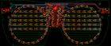
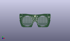
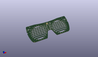

Contents
========

* [PROJ-ADAF-5217-STAN-01>Adafruit EyeLights LED Glasses and Driver PCB](#proj-adaf-5217-stan-01adafruit-eyelights-led-glasses-and-driver-pcb)
	* [Images](#images)
	* [Interactive BOM](#interactive-bom)
	* [OOMP Parts](#oomp-parts)
	* [Tags](#tags)
  
![][im]
# PROJ-ADAF-5217-STAN-01>Adafruit EyeLights LED Glasses and Driver PCB

- ID: PROJ-ADAF-5217-STAN-01
- Hex ID: PRA5217
- Name: Adafruit EyeLights LED Glasses and Driver PCB
- Description: 

## Images
  
  

|eagleImage|kicadPcb3dFront|kicadPcb3dBack|kicadPcb3d|
| :---: | :---: | :---: | :---: |
|||||

## Interactive BOM

- Interactive BOM page: [ibom.html](kicad/bom/ibom.html)

## OOMP Parts
  

|OOMP Parts|
| :---: |
|CAPC-0805-X-UNMATCHED-01, C1, -66.258000072, 24.059999886, 90,C1, 10uF, 0805-NO, microbuilder, (-2.60858268, 0.94724409), R90|
|CAPC-0603-X-UNMATCHED-01, C2, 5.261999889999999, 31.689499993999995, 180,C2, 1uF, 0603-NO, microbuilder, (0.20716535, 1.24761811), R180|
|CAPC-0805-X-UNMATCHED-01, C3, 65.77100003, 20.900499982, 270,C3, 10uF, 0805-NO, microbuilder, (2.58940945, 0.82285433), R270|
|CAPC-0805-X-UNMATCHED-01, C4, 63.544500037999995, 20.870500042, 270,C4, 10uF, 0805-NO, microbuilder, (2.50175197, 0.82167323), R270|
|CAPC-0805-X-UNMATCHED-01, C5, -64.191500014, 24.054999895999998, 90,C5, 10uF, 0805-NO, microbuilder, (-2.52722441, 0.94704724), R90|
|CAPC-0603-X-UNMATCHED-01, C6, -8.528500088, 28.226999934000002, 180,C6, 1uF, 0603-NO, microbuilder, (-0.33576772, 1.11129921), R180|
|UNMATCHED-UNMATCHED-X-UNMATCHED-01, CONN1, 70.739, 22.6695, 90,CONN1, STEMMA_I2C_QT, JST_SH4, microbuilder, (2.785, 0.8925), R90|
|UNMATCHED-UNMATCHED-X-UNMATCHED-01, CONN2, -70.739, 22.6695, 270,CONN2, STEMMA_I2C_QT, JST_SH4, microbuilder, (-2.785, 0.8925), R270|
|UNMATCHED-UNMATCHED-X-UNMATCHED-01, LED1, -14.241500091999999, -9.310500048, 60,LED1, RGBLED_CA_2121, RGBLED_2121, microbuilder, (-0.56068898, -0.36655512), R60|
|UNMATCHED-UNMATCHED-X-UNMATCHED-01, LED2, -3.8910000919999996, 21.598500109999996, 0,LED2, RGBLED_CA_2121, RGBLED_2121, microbuilder, (-0.15318898, 0.85033465), R0|
|UNMATCHED-UNMATCHED-X-UNMATCHED-01, LED3, -3.764000092, 15.614000013999998, 0,LED3, RGBLED_CA_2121, RGBLED_2121, microbuilder, (-0.14818898, 0.61472441), R0|
|UNMATCHED-UNMATCHED-X-UNMATCHED-01, LED4, -3.764000092, 9.438999918, 0,LED4, RGBLED_CA_2121, RGBLED_2121, microbuilder, (-0.14818898, 0.37161417), R0|
|UNMATCHED-UNMATCHED-X-UNMATCHED-01, LED5, -3.8910000919999996, 3.5180000759999994, 0,LED5, RGBLED_CA_2121, RGBLED_2121, microbuilder, (-0.15318898, 0.13850394), R0|
|UNMATCHED-UNMATCHED-X-UNMATCHED-01, LED6, -11.955500092, -2.97450002, 345,LED6, RGBLED_CA_2121, RGBLED_2121, microbuilder, (-0.47068898, -0.1171063), R345|
|UNMATCHED-UNMATCHED-X-UNMATCHED-01, LED7, 49.19499990799999, 26.029499884, 330,LED7, RGBLED_CA_2121, RGBLED_2121, microbuilder, (1.93681102, 1.02478346), R330|
|UNMATCHED-UNMATCHED-X-UNMATCHED-01, LED8, 58.211999907999996, 16.298500041999997, 30,LED8, RGBLED_CA_2121, RGBLED_2121, microbuilder, (2.29181102, 0.64167323), R30|
|UNMATCHED-UNMATCHED-X-UNMATCHED-01, LED9, 60.751999907999995, 10.123499945999999, 15,LED9, RGBLED_CA_2121, RGBLED_2121, microbuilder, (2.39181102, 0.39856299), R15|
|UNMATCHED-UNMATCHED-X-UNMATCHED-01, LED10, 61.640999908, 3.567500104, 0,LED10, RGBLED_CA_2121, RGBLED_2121, microbuilder, (2.42681102, 0.14045276), R0|
|UNMATCHED-UNMATCHED-X-UNMATCHED-01, LED11, 60.751999907999995, -3.051999992, 0,LED11, RGBLED_CA_2121, RGBLED_2121, microbuilder, (2.39181102, -0.12015748), R0|
|UNMATCHED-UNMATCHED-X-UNMATCHED-01, LED12, 58.439500087999996, -9.288500092, 60,LED12, RGBLED_CA_2121, RGBLED_2121, microbuilder, (2.30076772, -0.36568898), R60|
|UNMATCHED-UNMATCHED-X-UNMATCHED-01, LED13, 42.908499908, 28.60350007, 345,LED13, RGBLED_CA_2121, RGBLED_2121, microbuilder, (1.68931102, 1.12612205), R345|
|UNMATCHED-UNMATCHED-X-UNMATCHED-01, LED14, -18.257499934, -14.517500047999999, 45,LED14, RGBLED_CA_2121, RGBLED_2121, microbuilder, (-0.71879921, -0.57155512), R45|
|UNMATCHED-UNMATCHED-X-UNMATCHED-01, LED15, -11.018499934, 21.53500011, 0,LED15, RGBLED_CA_2121, RGBLED_2121, microbuilder, (-0.43379921, 0.84783465), R0|
|UNMATCHED-UNMATCHED-X-UNMATCHED-01, LED16, -11.081999933999999, 15.487000014, 0,LED16, RGBLED_CA_2121, RGBLED_2121, microbuilder, (-0.43629921, 0.60972441), R0|
|UNMATCHED-UNMATCHED-X-UNMATCHED-01, LED17, -11.843999934, 10.200999917999999, 0,LED17, RGBLED_CA_2121, RGBLED_2121, microbuilder, (-0.46629921, 0.40161417), R0|
|UNMATCHED-UNMATCHED-X-UNMATCHED-01, LED18, -11.081999933999999, 3.6450000759999996, 0,LED18, RGBLED_CA_2121, RGBLED_2121, microbuilder, (-0.43629921, 0.14350394), R0|
|UNMATCHED-UNMATCHED-X-UNMATCHED-01, LED19, -14.574499933999999, 16.39299998, 0,LED19, RGBLED_CA_2121, RGBLED_2121, microbuilder, (-0.57379921, 0.6453937), R0|
|UNMATCHED-UNMATCHED-X-UNMATCHED-01, LED20, 54.19600006599999, 21.520999884, 315,LED20, RGBLED_CA_2121, RGBLED_2121, microbuilder, (2.13370079, 0.84728346), R315|
|UNMATCHED-UNMATCHED-X-UNMATCHED-01, LED21, 54.323000066, 15.600000042, 0,LED21, RGBLED_CA_2121, RGBLED_2121, microbuilder, (2.13870079, 0.61417323), R0|
|UNMATCHED-UNMATCHED-X-UNMATCHED-01, LED22, 54.323000066, 9.551999945999999, 0,LED22, RGBLED_CA_2121, RGBLED_2121, microbuilder, (2.13870079, 0.37606299), R0|
|UNMATCHED-UNMATCHED-X-UNMATCHED-01, LED23, 54.323000066, 3.567500104, 0,LED23, RGBLED_CA_2121, RGBLED_2121, microbuilder, (2.13870079, 0.14045276), R0|
|UNMATCHED-UNMATCHED-X-UNMATCHED-01, LED24, 54.386500065999996, -2.3534999919999997, 0,LED24, RGBLED_CA_2121, RGBLED_2121, microbuilder, (2.14120079, -0.09265748), R0|
|UNMATCHED-UNMATCHED-X-UNMATCHED-01, LED25, 54.386500065999996, -14.751500087999998, 45,LED25, RGBLED_CA_2121, RGBLED_2121, microbuilder, (2.14120079, -0.58076772), R45|
|UNMATCHED-UNMATCHED-X-UNMATCHED-01, LED26, 36.225500065999995, 29.429000069999997, 0,LED26, RGBLED_CA_2121, RGBLED_2121, microbuilder, (1.42620079, 1.15862205), R0|
|UNMATCHED-UNMATCHED-X-UNMATCHED-01, LED27, -23.54350003, -18.645000047999996, 30,LED27, RGBLED_CA_2121, RGBLED_2121, microbuilder, (-0.92690945, -0.73405512), R30|
|UNMATCHED-UNMATCHED-X-UNMATCHED-01, LED28, -18.52700003, 21.53500011, 0,LED28, RGBLED_CA_2121, RGBLED_2121, microbuilder, (-0.72940945, 0.84783465), R0|
|UNMATCHED-UNMATCHED-X-UNMATCHED-01, LED29, -18.27300003, 15.614000013999998, 0,LED29, RGBLED_CA_2121, RGBLED_2121, microbuilder, (-0.71940945, 0.61472441), R0|
|UNMATCHED-UNMATCHED-X-UNMATCHED-01, LED30, -18.27300003, 9.565999918, 0,LED30, RGBLED_CA_2121, RGBLED_2121, microbuilder, (-0.71940945, 0.37661417), R0|
|UNMATCHED-UNMATCHED-X-UNMATCHED-01, LED31, -18.27300003, 3.6450000759999996, 0,LED31, RGBLED_CA_2121, RGBLED_2121, microbuilder, (-0.71940945, 0.14350394), R0|
|UNMATCHED-UNMATCHED-X-UNMATCHED-01, LED32, -18.27300003, -2.40300002, 0,LED32, RGBLED_CA_2121, RGBLED_2121, microbuilder, (-0.71940945, -0.0946063), R0|
|UNMATCHED-UNMATCHED-X-UNMATCHED-01, LED33, 47.06849997, 21.584499884, 0,LED33, RGBLED_CA_2121, RGBLED_2121, microbuilder, (1.85309055, 0.84978346), R0|
|UNMATCHED-UNMATCHED-X-UNMATCHED-01, LED34, 47.131999969999995, 15.536500041999998, 0,LED34, RGBLED_CA_2121, RGBLED_2121, microbuilder, (1.85559055, 0.61167323), R0|
|UNMATCHED-UNMATCHED-X-UNMATCHED-01, LED35, 47.131999969999995, 9.551999945999999, 0,LED35, RGBLED_CA_2121, RGBLED_2121, microbuilder, (1.85559055, 0.37606299), R0|
|UNMATCHED-UNMATCHED-X-UNMATCHED-01, LED36, 47.131999969999995, 3.567500104, 0,LED36, RGBLED_CA_2121, RGBLED_2121, microbuilder, (1.85559055, 0.14045276), R0|
|UNMATCHED-UNMATCHED-X-UNMATCHED-01, LED37, 47.06849997, -2.3534999919999997, 0,LED37, RGBLED_CA_2121, RGBLED_2121, microbuilder, (1.85309055, -0.09265748), R0|
|UNMATCHED-UNMATCHED-X-UNMATCHED-01, LED38, 49.105000088, -18.78100003, 30,LED38, RGBLED_CA_2121, RGBLED_2121, microbuilder, (1.93326772, -0.73940945), R30|
|UNMATCHED-UNMATCHED-X-UNMATCHED-01, LED39, 29.478999969999997, 28.60350007, 15,LED39, RGBLED_CA_2121, RGBLED_2121, microbuilder, (1.16059055, 1.12612205), R15|
|UNMATCHED-UNMATCHED-X-UNMATCHED-01, LED40, -29.655000125999997, -21.312000048, 15,LED40, RGBLED_CA_2121, RGBLED_2121, microbuilder, (-1.16751969, -0.83905512), R15|
|UNMATCHED-UNMATCHED-X-UNMATCHED-01, LED41, -25.591000126, 21.53500011, 0,LED41, RGBLED_CA_2121, RGBLED_2121, microbuilder, (-1.00751969, 0.84783465), R0|
|UNMATCHED-UNMATCHED-X-UNMATCHED-01, LED42, -25.527500125999996, 15.614000013999998, 0,LED42, RGBLED_CA_2121, RGBLED_2121, microbuilder, (-1.00501969, 0.61472441), R0|
|UNMATCHED-UNMATCHED-X-UNMATCHED-01, LED43, -25.591000126, 9.565999918, 0,LED43, RGBLED_CA_2121, RGBLED_2121, microbuilder, (-1.00751969, 0.37661417), R0|
|UNMATCHED-UNMATCHED-X-UNMATCHED-01, LED44, -25.464000126, 3.6450000759999996, 0,LED44, RGBLED_CA_2121, RGBLED_2121, microbuilder, (-1.00251969, 0.14350394), R0|
|UNMATCHED-UNMATCHED-X-UNMATCHED-01, LED45, -25.527500125999996, -2.40300002, 0,LED45, RGBLED_CA_2121, RGBLED_2121, microbuilder, (-1.00501969, -0.0946063), R0|
|UNMATCHED-UNMATCHED-X-UNMATCHED-01, LED46, 39.813999874, 21.584499884, 0,LED46, RGBLED_CA_2121, RGBLED_2121, microbuilder, (1.56748031, 0.84978346), R0|
|UNMATCHED-UNMATCHED-X-UNMATCHED-01, LED47, 39.813999874, 15.536500041999998, 0,LED47, RGBLED_CA_2121, RGBLED_2121, microbuilder, (1.56748031, 0.61167323), R0|
|UNMATCHED-UNMATCHED-X-UNMATCHED-01, LED48, 39.813999874, 9.551999945999999, 0,LED48, RGBLED_CA_2121, RGBLED_2121, microbuilder, (1.56748031, 0.37606299), R0|
|UNMATCHED-UNMATCHED-X-UNMATCHED-01, LED49, 39.813999874, 3.567500104, 0,LED49, RGBLED_CA_2121, RGBLED_2121, microbuilder, (1.56748031, 0.14045276), R0|
|UNMATCHED-UNMATCHED-X-UNMATCHED-01, LED50, 39.813999874, -2.416999992, 0,LED50, RGBLED_CA_2121, RGBLED_2121, microbuilder, (1.56748031, -0.09515748), R0|
|UNMATCHED-UNMATCHED-X-UNMATCHED-01, LED51, 42.925499873999996, -21.355500088, 15,LED51, RGBLED_CA_2121, RGBLED_2121, microbuilder, (1.68998031, -0.84076772), R15|
|UNMATCHED-UNMATCHED-X-UNMATCHED-01, LED52, 23.240499873999998, 26.00000007, 30,LED52, RGBLED_CA_2121, RGBLED_2121, microbuilder, (0.91498031, 1.02362205), R30|
|UNMATCHED-UNMATCHED-X-UNMATCHED-01, LED53, -36.464999968, -22.137500048, 0,LED53, RGBLED_CA_2121, RGBLED_2121, microbuilder, (-1.43562992, -0.87155512), R0|
|UNMATCHED-UNMATCHED-X-UNMATCHED-01, LED54, -32.781999968, 21.53500011, 0,LED54, RGBLED_CA_2121, RGBLED_2121, microbuilder, (-1.29062992, 0.84783465), R0|
|UNMATCHED-UNMATCHED-X-UNMATCHED-01, LED55, -32.718499967999996, 15.614000013999998, 0,LED55, RGBLED_CA_2121, RGBLED_2121, microbuilder, (-1.28812992, 0.61472441), R0|
|UNMATCHED-UNMATCHED-X-UNMATCHED-01, LED56, -32.781999968, 9.565999918, 0,LED56, RGBLED_CA_2121, RGBLED_2121, microbuilder, (-1.29062992, 0.37661417), R0|
|UNMATCHED-UNMATCHED-X-UNMATCHED-01, LED57, -32.781999968, 3.6450000759999996, 0,LED57, RGBLED_CA_2121, RGBLED_2121, microbuilder, (-1.29062992, 0.14350394), R0|
|UNMATCHED-UNMATCHED-X-UNMATCHED-01, LED58, -32.781999968, -2.40300002, 0,LED58, RGBLED_CA_2121, RGBLED_2121, microbuilder, (-1.29062992, -0.0946063), R0|
|UNMATCHED-UNMATCHED-X-UNMATCHED-01, LED59, 32.559500031999995, 21.584499884, 0,LED59, RGBLED_CA_2121, RGBLED_2121, microbuilder, (1.28187008, 0.84978346), R0|
|UNMATCHED-UNMATCHED-X-UNMATCHED-01, LED60, 32.559500031999995, 15.536500041999998, 0,LED60, RGBLED_CA_2121, RGBLED_2121, microbuilder, (1.28187008, 0.61167323), R0|
|UNMATCHED-UNMATCHED-X-UNMATCHED-01, LED61, 32.623000032, 9.551999945999999, 0,LED61, RGBLED_CA_2121, RGBLED_2121, microbuilder, (1.28437008, 0.37606299), R0|
|UNMATCHED-UNMATCHED-X-UNMATCHED-01, LED62, 32.559500031999995, 3.567500104, 0,LED62, RGBLED_CA_2121, RGBLED_2121, microbuilder, (1.28187008, 0.14045276), R0|
|UNMATCHED-UNMATCHED-X-UNMATCHED-01, LED63, 32.496000032, -2.416999992, 0,LED63, RGBLED_CA_2121, RGBLED_2121, microbuilder, (1.27937008, -0.09515748), R0|
|UNMATCHED-UNMATCHED-X-UNMATCHED-01, LED64, 36.179000032, -22.181000087999998, 0,LED64, RGBLED_CA_2121, RGBLED_2121, microbuilder, (1.42437008, -0.87326772), R0|
|UNMATCHED-UNMATCHED-X-UNMATCHED-01, LED66, -43.148000064, -21.375500048, 345,LED66, RGBLED_CA_2121, RGBLED_2121, microbuilder, (-1.69874016, -0.84155512), R345|
|UNMATCHED-UNMATCHED-X-UNMATCHED-01, LED67, -40.100000064, 21.53500011, 0,LED67, RGBLED_CA_2121, RGBLED_2121, microbuilder, (-1.57874016, 0.84783465), R0|
|UNMATCHED-UNMATCHED-X-UNMATCHED-01, LED68, -40.036500063999995, 15.614000013999998, 0,LED68, RGBLED_CA_2121, RGBLED_2121, microbuilder, (-1.57624016, 0.61472441), R0|
|UNMATCHED-UNMATCHED-X-UNMATCHED-01, LED69, -40.100000064, 9.565999918, 0,LED69, RGBLED_CA_2121, RGBLED_2121, microbuilder, (-1.57874016, 0.37661417), R0|
|UNMATCHED-UNMATCHED-X-UNMATCHED-01, LED70, -40.100000064, 3.6450000759999996, 0,LED70, RGBLED_CA_2121, RGBLED_2121, microbuilder, (-1.57874016, 0.14350394), R0|
|UNMATCHED-UNMATCHED-X-UNMATCHED-01, LED71, -40.100000064, -2.40300002, 0,LED71, RGBLED_CA_2121, RGBLED_2121, microbuilder, (-1.57874016, -0.0946063), R0|
|UNMATCHED-UNMATCHED-X-UNMATCHED-01, LED72, 25.304999935999998, 21.520999884, 0,LED72, RGBLED_CA_2121, RGBLED_2121, microbuilder, (0.99625984, 0.84728346), R0|
|UNMATCHED-UNMATCHED-X-UNMATCHED-01, LED73, 25.304999935999998, 15.536500041999998, 0,LED73, RGBLED_CA_2121, RGBLED_2121, microbuilder, (0.99625984, 0.61167323), R0|
|UNMATCHED-UNMATCHED-X-UNMATCHED-01, LED74, 25.304999935999998, 9.551999945999999, 0,LED74, RGBLED_CA_2121, RGBLED_2121, microbuilder, (0.99625984, 0.37606299), R0|
|UNMATCHED-UNMATCHED-X-UNMATCHED-01, LED75, 25.304999935999998, 3.567500104, 0,LED75, RGBLED_CA_2121, RGBLED_2121, microbuilder, (0.99625984, 0.14045276), R0|
|UNMATCHED-UNMATCHED-X-UNMATCHED-01, LED76, 25.241499935999997, -2.416999992, 0,LED76, RGBLED_CA_2121, RGBLED_2121, microbuilder, (0.99375984, -0.09515748), R0|
|UNMATCHED-UNMATCHED-X-UNMATCHED-01, LED77, 29.559499935999998, -21.355500088, 345,LED77, RGBLED_CA_2121, RGBLED_2121, microbuilder, (1.16375984, -0.84076772), R345|
|UNMATCHED-UNMATCHED-X-UNMATCHED-01, LED78, -23.653500064, 25.936500069999997, 330,LED78, RGBLED_CA_2121, RGBLED_2121, microbuilder, (-0.93124016, 1.02112205), R330|
|UNMATCHED-UNMATCHED-X-UNMATCHED-01, LED79, -49.32299990599999, -18.899000047999998, 330,LED79, RGBLED_CA_2121, RGBLED_2121, microbuilder, (-1.94185039, -0.74405512), R330|
|UNMATCHED-UNMATCHED-X-UNMATCHED-01, LED80, -47.354499906, 21.53500011, 0,LED80, RGBLED_CA_2121, RGBLED_2121, microbuilder, (-1.86435039, 0.84783465), R0|
|UNMATCHED-UNMATCHED-X-UNMATCHED-01, LED81, -47.227499906, 15.614000013999998, 0,LED81, RGBLED_CA_2121, RGBLED_2121, microbuilder, (-1.85935039, 0.61472441), R0|
|UNMATCHED-UNMATCHED-X-UNMATCHED-01, LED82, -47.290999905999996, 9.565999918, 0,LED82, RGBLED_CA_2121, RGBLED_2121, microbuilder, (-1.86185039, 0.37661417), R0|
|UNMATCHED-UNMATCHED-X-UNMATCHED-01, LED83, -47.290999905999996, 3.6450000759999996, 0,LED83, RGBLED_CA_2121, RGBLED_2121, microbuilder, (-1.86185039, 0.14350394), R0|
|UNMATCHED-UNMATCHED-X-UNMATCHED-01, LED84, -47.354499906, -2.40300002, 0,LED84, RGBLED_CA_2121, RGBLED_2121, microbuilder, (-1.86435039, -0.0946063), R0|
|UNMATCHED-UNMATCHED-X-UNMATCHED-01, LED85, 18.177500094, 21.584499884, 0,LED85, RGBLED_CA_2121, RGBLED_2121, microbuilder, (0.71564961, 0.84978346), R0|
|UNMATCHED-UNMATCHED-X-UNMATCHED-01, LED86, 18.050500094, 15.600000042, 0,LED86, RGBLED_CA_2121, RGBLED_2121, microbuilder, (0.71064961, 0.61417323), R0|
|UNMATCHED-UNMATCHED-X-UNMATCHED-01, LED87, 18.050500094, 9.551999945999999, 0,LED87, RGBLED_CA_2121, RGBLED_2121, microbuilder, (0.71064961, 0.37606299), R0|
|UNMATCHED-UNMATCHED-X-UNMATCHED-01, LED88, 18.050500094, 3.567500104, 0,LED88, RGBLED_CA_2121, RGBLED_2121, microbuilder, (0.71064961, 0.14045276), R0|
|UNMATCHED-UNMATCHED-X-UNMATCHED-01, LED89, 17.987000094, -2.416999992, 0,LED89, RGBLED_CA_2121, RGBLED_2121, microbuilder, (0.70814961, -0.09515748), R0|
|UNMATCHED-UNMATCHED-X-UNMATCHED-01, LED90, 23.321000094, -18.815500088, 330,LED90, RGBLED_CA_2121, RGBLED_2121, microbuilder, (0.91814961, -0.74076772), R330|
|UNMATCHED-UNMATCHED-X-UNMATCHED-01, LED91, -29.701499906, 28.540000069999998, 345,LED91, RGBLED_CA_2121, RGBLED_2121, microbuilder, (-1.16935039, 1.12362205), R345|
|UNMATCHED-UNMATCHED-X-UNMATCHED-01, LED92, -54.48200000199999, -14.454000048, 315,LED92, RGBLED_CA_2121, RGBLED_2121, microbuilder, (-2.14496063, -0.56905512), R315|
|UNMATCHED-UNMATCHED-X-UNMATCHED-01, LED93, -54.48200000199999, 21.53500011, 45,LED93, RGBLED_CA_2121, RGBLED_2121, microbuilder, (-2.14496063, 0.84783465), R45|
|UNMATCHED-UNMATCHED-X-UNMATCHED-01, LED94, -54.545500002, 15.614000013999998, 0,LED94, RGBLED_CA_2121, RGBLED_2121, microbuilder, (-2.14746063, 0.61472441), R0|
|UNMATCHED-UNMATCHED-X-UNMATCHED-01, LED95, -54.609000001999995, 9.565999918, 0,LED95, RGBLED_CA_2121, RGBLED_2121, microbuilder, (-2.14996063, 0.37661417), R0|
|UNMATCHED-UNMATCHED-X-UNMATCHED-01, LED96, -54.609000001999995, 3.6450000759999996, 0,LED96, RGBLED_CA_2121, RGBLED_2121, microbuilder, (-2.14996063, 0.14350394), R0|
|UNMATCHED-UNMATCHED-X-UNMATCHED-01, LED97, -54.609000001999995, -2.40300002, 0,LED97, RGBLED_CA_2121, RGBLED_2121, microbuilder, (-2.14996063, -0.0946063), R0|
|UNMATCHED-UNMATCHED-X-UNMATCHED-01, LED98, 10.795999998, 21.584499884, 0,LED98, RGBLED_CA_2121, RGBLED_2121, microbuilder, (0.42503937, 0.84978346), R0|
|UNMATCHED-UNMATCHED-X-UNMATCHED-01, LED99, 10.795999998, 15.600000042, 0,LED99, RGBLED_CA_2121, RGBLED_2121, microbuilder, (0.42503937, 0.61417323), R0|
|UNMATCHED-UNMATCHED-X-UNMATCHED-01, LED100, 11.621499997999999, 10.059999946, 0,LED100, RGBLED_CA_2121, RGBLED_2121, microbuilder, (0.45753937, 0.39606299), R0|
|UNMATCHED-UNMATCHED-X-UNMATCHED-01, LED101, 10.795999998, 3.567500104, 0,LED101, RGBLED_CA_2121, RGBLED_2121, microbuilder, (0.42503937, 0.14045276), R0|
|UNMATCHED-UNMATCHED-X-UNMATCHED-01, LED102, 14.288499997999999, 16.315500008, 0,LED102, RGBLED_CA_2121, RGBLED_2121, microbuilder, (0.56253937, 0.64234252), R0|
|UNMATCHED-UNMATCHED-X-UNMATCHED-01, LED103, 17.971499998, -14.751500087999998, 315,LED103, RGBLED_CA_2121, RGBLED_2121, microbuilder, (0.70753937, -0.58076772), R315|
|UNMATCHED-UNMATCHED-X-UNMATCHED-01, LED104, -36.384500001999996, 29.429000069999997, 0,LED104, RGBLED_CA_2121, RGBLED_2121, microbuilder, (-1.43246063, 1.15862205), R0|
|UNMATCHED-UNMATCHED-X-UNMATCHED-01, LED105, -58.498000098, -9.183500047999999, 300,LED105, RGBLED_CA_2121, RGBLED_2121, microbuilder, (-2.30307087, -0.36155512), R300|
|UNMATCHED-UNMATCHED-X-UNMATCHED-01, LED106, -49.35400009799999, 25.98000011, 30,LED106, RGBLED_CA_2121, RGBLED_2121, microbuilder, (-1.94307087, 1.02283465), R30|
|UNMATCHED-UNMATCHED-X-UNMATCHED-01, LED107, -58.434500098, 16.249000014, 60,LED107, RGBLED_CA_2121, RGBLED_2121, microbuilder, (-2.30057087, 0.63972441), R60|
|UNMATCHED-UNMATCHED-X-UNMATCHED-01, LED108, -61.038000098, 9.946999918, 0,LED108, RGBLED_CA_2121, RGBLED_2121, microbuilder, (-2.40307087, 0.39161417), R0|
|UNMATCHED-UNMATCHED-X-UNMATCHED-01, LED109, -61.80000009799999, 3.6450000759999996, 0,LED109, RGBLED_CA_2121, RGBLED_2121, microbuilder, (-2.43307087, 0.14350394), R0|
|UNMATCHED-UNMATCHED-X-UNMATCHED-01, LED110, -60.78400009799999, -3.10150002, 12,LED110, RGBLED_CA_2121, RGBLED_2121, microbuilder, (-2.39307087, -0.1221063), R12|
|UNMATCHED-UNMATCHED-X-UNMATCHED-01, LED111, 3.7954999019999995, 21.584499884, 0,LED111, RGBLED_CA_2121, RGBLED_2121, microbuilder, (0.14942913, 0.84978346), R0|
|UNMATCHED-UNMATCHED-X-UNMATCHED-01, LED112, 3.6049999019999994, 15.536500041999998, 0,LED112, RGBLED_CA_2121, RGBLED_2121, microbuilder, (0.14192913, 0.61167323), R0|
|UNMATCHED-UNMATCHED-X-UNMATCHED-01, LED113, 3.477999902, 9.551999945999999, 0,LED113, RGBLED_CA_2121, RGBLED_2121, microbuilder, (0.13692913, 0.37606299), R0|
|UNMATCHED-UNMATCHED-X-UNMATCHED-01, LED114, 3.6049999019999994, 3.567500104, 0,LED114, RGBLED_CA_2121, RGBLED_2121, microbuilder, (0.14192913, 0.14045276), R0|
|UNMATCHED-UNMATCHED-X-UNMATCHED-01, LED115, 11.478999902, -2.924999992, 110,LED115, RGBLED_CA_2121, RGBLED_2121, microbuilder, (0.45192913, -0.11515748), R110|
|UNMATCHED-UNMATCHED-X-UNMATCHED-01, LED116, 13.828499902, -9.417500088, 300,LED116, RGBLED_CA_2121, RGBLED_2121, microbuilder, (0.54442913, -0.37076772), R300|
|UNMATCHED-UNMATCHED-X-UNMATCHED-01, LED117, -43.067500098, 28.47650007, 15,LED117, RGBLED_CA_2121, RGBLED_2121, microbuilder, (-1.69557087, 1.12112205), R15|
|RESE-0603-X-UNMATCHED-01, R1, 2.224499996, 31.677999889999995, 180,R1, 2.2K, 0603-NO, microbuilder, (0.08757874, 1.24716535), R180|
|RESE-0603-X-UNMATCHED-01, R2, -3.8099999999999996, 19.4945, 0,R2, 51, 0603-NO, microbuilder, (-0.15, 0.7675), R0|
|RESE-0603-X-UNMATCHED-01, R3, -12.446, 23.749, 180,R3, 51, 0603-NO, microbuilder, (-0.49, 0.935), R180|
|RESE-0603-X-UNMATCHED-01, R4, -7.048500000000001, 14.033499999999998, 180,R4, 22, 0603-NO, microbuilder, (-0.2775, 0.5525), R180|
|RESE-0603-X-UNMATCHED-01, R5, -3.8734999999999995, 13.589, 0,R5, 51, 0603-NO, microbuilder, (-0.1525, 0.535), R0|
|RESE-0603-X-UNMATCHED-01, R6, -5.460999999999999, 17.779999999999998, 0,R6, 51, 0603-NO, microbuilder, (-0.215, 0.7), R0|
|RESE-0603-X-UNMATCHED-01, R7, 64.77, 25.273, 180,R7, 2.2K, 0603-NO, microbuilder, (2.55, 0.995), R180|
|RESE-0603-X-UNMATCHED-01, R8, -10.2235, 7.492999999999999, 180,R8, 22, 0603-NO, microbuilder, (-0.4025, 0.295), R180|
|RESE-0603-X-UNMATCHED-01, R9, -4.2545, 7.429499999999999, 180,R9, 51, 0603-NO, microbuilder, (-0.1675, 0.2925), R180|
|RESE-0603-X-UNMATCHED-01, R10, -6.985, 0.8255, 180,R10, 22, 0603-NO, microbuilder, (-0.275, 0.0325), R180|
|RESE-0603-X-UNMATCHED-01, R11, -10.287, 1.4605, 180,R11, 51, 0603-NO, microbuilder, (-0.405, 0.0575), R180|
|RESE-0603-X-UNMATCHED-01, R12, -7.9375, 10.8585, 180,R12, 51, 0603-NO, microbuilder, (-0.3125, 0.4275), R180|
|RESE-0603-X-UNMATCHED-01, R13, -3.2384999999999997, 1.651, 180,R13, 22, 0603-NO, microbuilder, (-0.1275, 0.065), R180|
|RESE-0603-X-UNMATCHED-01, R14, -1.778, 4.444999999999999, 270,R14, 51, 0603-NO, microbuilder, (-0.07, 0.175), R270|
|RESE-0603-X-UNMATCHED-01, R15, -10.2235, 5.715, 180,R15, 51, 0603-NO, microbuilder, (-0.4025, 0.225), R180|
|RESE-0603-X-UNMATCHED-01, R16, -16.002, 19.240499999999997, 270,R16, 22, 0603-NO, microbuilder, (-0.63, 0.7575), R270|
|RESE-0603-X-UNMATCHED-01, R17, -13.5255, 19.177, 270,R17, 51, 0603-NO, microbuilder, (-0.5325, 0.755), R270|
|RESE-0603-X-UNMATCHED-01, R18, -7.9375, 12.382499999999999, 180,R18, 51, 0603-NO, microbuilder, (-0.3125, 0.4875), R180|
|RESE-0603-X-UNMATCHED-01, R19, 4.762499999999999, 19.431, 180,R19, 22, 0603-NO, microbuilder, (0.1875, 0.765), R180|
|RESE-0603-X-UNMATCHED-01, R20, 8.254999999999999, 20.193, 90,R20, 51, 0603-NO, microbuilder, (0.325, 0.795), R90|
|RESE-0603-X-UNMATCHED-01, R21, 10.540999999999999, 23.622, 0,R21, 51, 0603-NO, microbuilder, (0.415, 0.93), R0|
|RESE-0603-X-UNMATCHED-01, R22, 7.6834999999999996, 13.5255, 0,R22, 22, 0603-NO, microbuilder, (0.3025, 0.5325), R0|
|RESE-0603-X-UNMATCHED-01, R23, 5.842, 16.128999999999998, 270,R23, 51, 0603-NO, microbuilder, (0.23, 0.635), R270|
|RESE-0603-X-UNMATCHED-01, R24, -12.827, -6.286499999999999, 270,R24, 51, 0603-NO, microbuilder, (-0.505, -0.2475), R270|
|RESE-0603-X-UNMATCHED-01, R25, -9.2075, 19.304, 0,R25, 22, 0603-NO, microbuilder, (-0.3625, 0.76), R0|
|RESE-0603-X-UNMATCHED-01, R26, 7.6834999999999996, 17.0815, 270,R26, 51, 0603-NO, microbuilder, (0.3025, 0.6725), R270|
|RESE-0603-X-UNMATCHED-01, R27, 8.382, 7.492999999999999, 0,R27, 22, 0603-NO, microbuilder, (0.33, 0.295), R0|
|RESE-0603-X-UNMATCHED-01, R28, 6.286499999999999, 10.16, 270,R28, 51, 0603-NO, microbuilder, (0.2475, 0.4), R270|
|RESE-0603-X-UNMATCHED-01, R29, 3.7464999999999997, 11.4935, 0,R29, 51, 0603-NO, microbuilder, (0.1475, 0.4525), R0|
|RESE-0603-X-UNMATCHED-01, R30, 2.667, 5.3975, 0,R30, 22, 0603-NO, microbuilder, (0.105, 0.2125), R0|
|RESE-0603-X-UNMATCHED-01, R31, 5.9055, 4.826, 270,R31, 51, 0603-NO, microbuilder, (0.2325, 0.19), R270|
|RESE-0603-X-UNMATCHED-01, R32, 8.382, 5.6514999999999995, 0,R32, 51, 0603-NO, microbuilder, (0.33, 0.2225), R0|
|RESE-0603-X-UNMATCHED-01, R33, 10.350499999999998, 25.145999999999997, 0,R33, 22, 0603-NO, microbuilder, (0.4075, 0.99), R0|
|RESE-0603-X-UNMATCHED-01, R34, 9.143999999999998, 26.669999999999998, 0,R34, 51, 0603-NO, microbuilder, (0.36, 1.05), R0|
|RESE-0603-X-UNMATCHED-01, R35, 9.9695, 1.397, 0,R35, 51, 0603-NO, microbuilder, (0.3925, 0.055), R0|
|RESE-0603-X-UNMATCHED-01, R36, 1.9049999999999998, 0.8255, 0,R36, 22, 0603-NO, microbuilder, (0.075, 0.0325), R0|
|RESE-0603-X-UNMATCHED-01, R37, 12.065, -6.476999999999999, 300,R37, 51, 0603-NO, microbuilder, (0.475, -0.255), R300|
|RESE-0603-X-UNMATCHED-01, R38, 15.8115, -11.684, 100,R38, 51, 0603-NO, microbuilder, (0.6225, -0.46), R100|
|RESE-0603-X-UNMATCHED-01, R39, 9.080499999999999, 28.194000000000003, 0,R39, 22, 0603-NO, microbuilder, (0.3575, 1.11), R0|
|RESE-0603-X-UNMATCHED-01, R40, -19.558, 23.622, 180,R40, 51, 0603-NO, microbuilder, (-0.77, 0.93), R180|
|RESE-0603-X-UNMATCHED-01, R41, -19.558, 25.145999999999997, 180,R41, 51, 0603-NO, microbuilder, (-0.77, 0.99), R180|
|RESE-0603-X-UNMATCHED-01, R42, 64.77, 23.685499999999998, 180,R42, 2.2K, 0603-NO, microbuilder, (2.55, 0.9325), R180|
|UNMATCHED-UNMATCHED-X-UNMATCHED-01, X1, -0.12149988399999999, 26.460999909999998, 225,X1, IS31FL3741, QFN60_7MM, microbuilder, (-0.00478346, 1.04177165), R225|

## Tags

- hexID: PRA5217
- oompType: PROJ
- oompSize: ADAF
- oompColor: 5217
- oompDesc: STAN
- oompIndex: 01
- oompName: Adafruit EyeLights LED Glasses and Driver PCB
- sources: All source files from https://github.com/adafruit/Adafruit-EyeLights-LED-Glasses-and-Driver-PCB (source licence details in srcLicense.md)
- linkBuyPage: http://www.adafruit.com/products/5217
- oompPart: CAPC-0805-X-UNMATCHED-01, C1, -66.258000072, 24.059999886, 90
- oompPart: CAPC-0603-X-UNMATCHED-01, C2, 5.261999889999999, 31.689499993999995, 180
- oompPart: CAPC-0805-X-UNMATCHED-01, C3, 65.77100003, 20.900499982, 270
- oompPart: CAPC-0805-X-UNMATCHED-01, C4, 63.544500037999995, 20.870500042, 270
- oompPart: CAPC-0805-X-UNMATCHED-01, C5, -64.191500014, 24.054999895999998, 90
- oompPart: CAPC-0603-X-UNMATCHED-01, C6, -8.528500088, 28.226999934000002, 180
- oompPart: UNMATCHED-UNMATCHED-X-UNMATCHED-01, CONN1, 70.739, 22.6695, 90
- oompPart: UNMATCHED-UNMATCHED-X-UNMATCHED-01, CONN2, -70.739, 22.6695, 270
- oompPart: SKIP-UNMATCHED-X-UNMATCHED-01, FID1, -62.8015, 36.0045, 0
- oompPart: SKIP-UNMATCHED-X-UNMATCHED-01, FID2, -57.5945, -23.685499999999998, 0
- oompPart: SKIP-UNMATCHED-X-UNMATCHED-01, FID3, 72.136, 16.5735, 0
- oompPart: SKIP-UNMATCHED-X-UNMATCHED-01, FID4, 29.400499999999997, -24.511, 0
- oompPart: UNMATCHED-UNMATCHED-X-UNMATCHED-01, LED1, -14.241500091999999, -9.310500048, 60
- oompPart: UNMATCHED-UNMATCHED-X-UNMATCHED-01, LED2, -3.8910000919999996, 21.598500109999996, 0
- oompPart: UNMATCHED-UNMATCHED-X-UNMATCHED-01, LED3, -3.764000092, 15.614000013999998, 0
- oompPart: UNMATCHED-UNMATCHED-X-UNMATCHED-01, LED4, -3.764000092, 9.438999918, 0
- oompPart: UNMATCHED-UNMATCHED-X-UNMATCHED-01, LED5, -3.8910000919999996, 3.5180000759999994, 0
- oompPart: UNMATCHED-UNMATCHED-X-UNMATCHED-01, LED6, -11.955500092, -2.97450002, 345
- oompPart: UNMATCHED-UNMATCHED-X-UNMATCHED-01, LED7, 49.19499990799999, 26.029499884, 330
- oompPart: UNMATCHED-UNMATCHED-X-UNMATCHED-01, LED8, 58.211999907999996, 16.298500041999997, 30
- oompPart: UNMATCHED-UNMATCHED-X-UNMATCHED-01, LED9, 60.751999907999995, 10.123499945999999, 15
- oompPart: UNMATCHED-UNMATCHED-X-UNMATCHED-01, LED10, 61.640999908, 3.567500104, 0
- oompPart: UNMATCHED-UNMATCHED-X-UNMATCHED-01, LED11, 60.751999907999995, -3.051999992, 0
- oompPart: UNMATCHED-UNMATCHED-X-UNMATCHED-01, LED12, 58.439500087999996, -9.288500092, 60
- oompPart: UNMATCHED-UNMATCHED-X-UNMATCHED-01, LED13, 42.908499908, 28.60350007, 345
- oompPart: UNMATCHED-UNMATCHED-X-UNMATCHED-01, LED14, -18.257499934, -14.517500047999999, 45
- oompPart: UNMATCHED-UNMATCHED-X-UNMATCHED-01, LED15, -11.018499934, 21.53500011, 0
- oompPart: UNMATCHED-UNMATCHED-X-UNMATCHED-01, LED16, -11.081999933999999, 15.487000014, 0
- oompPart: UNMATCHED-UNMATCHED-X-UNMATCHED-01, LED17, -11.843999934, 10.200999917999999, 0
- oompPart: UNMATCHED-UNMATCHED-X-UNMATCHED-01, LED18, -11.081999933999999, 3.6450000759999996, 0
- oompPart: UNMATCHED-UNMATCHED-X-UNMATCHED-01, LED19, -14.574499933999999, 16.39299998, 0
- oompPart: UNMATCHED-UNMATCHED-X-UNMATCHED-01, LED20, 54.19600006599999, 21.520999884, 315
- oompPart: UNMATCHED-UNMATCHED-X-UNMATCHED-01, LED21, 54.323000066, 15.600000042, 0
- oompPart: UNMATCHED-UNMATCHED-X-UNMATCHED-01, LED22, 54.323000066, 9.551999945999999, 0
- oompPart: UNMATCHED-UNMATCHED-X-UNMATCHED-01, LED23, 54.323000066, 3.567500104, 0
- oompPart: UNMATCHED-UNMATCHED-X-UNMATCHED-01, LED24, 54.386500065999996, -2.3534999919999997, 0
- oompPart: UNMATCHED-UNMATCHED-X-UNMATCHED-01, LED25, 54.386500065999996, -14.751500087999998, 45
- oompPart: UNMATCHED-UNMATCHED-X-UNMATCHED-01, LED26, 36.225500065999995, 29.429000069999997, 0
- oompPart: UNMATCHED-UNMATCHED-X-UNMATCHED-01, LED27, -23.54350003, -18.645000047999996, 30
- oompPart: UNMATCHED-UNMATCHED-X-UNMATCHED-01, LED28, -18.52700003, 21.53500011, 0
- oompPart: UNMATCHED-UNMATCHED-X-UNMATCHED-01, LED29, -18.27300003, 15.614000013999998, 0
- oompPart: UNMATCHED-UNMATCHED-X-UNMATCHED-01, LED30, -18.27300003, 9.565999918, 0
- oompPart: UNMATCHED-UNMATCHED-X-UNMATCHED-01, LED31, -18.27300003, 3.6450000759999996, 0
- oompPart: UNMATCHED-UNMATCHED-X-UNMATCHED-01, LED32, -18.27300003, -2.40300002, 0
- oompPart: UNMATCHED-UNMATCHED-X-UNMATCHED-01, LED33, 47.06849997, 21.584499884, 0
- oompPart: UNMATCHED-UNMATCHED-X-UNMATCHED-01, LED34, 47.131999969999995, 15.536500041999998, 0
- oompPart: UNMATCHED-UNMATCHED-X-UNMATCHED-01, LED35, 47.131999969999995, 9.551999945999999, 0
- oompPart: UNMATCHED-UNMATCHED-X-UNMATCHED-01, LED36, 47.131999969999995, 3.567500104, 0
- oompPart: UNMATCHED-UNMATCHED-X-UNMATCHED-01, LED37, 47.06849997, -2.3534999919999997, 0
- oompPart: UNMATCHED-UNMATCHED-X-UNMATCHED-01, LED38, 49.105000088, -18.78100003, 30
- oompPart: UNMATCHED-UNMATCHED-X-UNMATCHED-01, LED39, 29.478999969999997, 28.60350007, 15
- oompPart: UNMATCHED-UNMATCHED-X-UNMATCHED-01, LED40, -29.655000125999997, -21.312000048, 15
- oompPart: UNMATCHED-UNMATCHED-X-UNMATCHED-01, LED41, -25.591000126, 21.53500011, 0
- oompPart: UNMATCHED-UNMATCHED-X-UNMATCHED-01, LED42, -25.527500125999996, 15.614000013999998, 0
- oompPart: UNMATCHED-UNMATCHED-X-UNMATCHED-01, LED43, -25.591000126, 9.565999918, 0
- oompPart: UNMATCHED-UNMATCHED-X-UNMATCHED-01, LED44, -25.464000126, 3.6450000759999996, 0
- oompPart: UNMATCHED-UNMATCHED-X-UNMATCHED-01, LED45, -25.527500125999996, -2.40300002, 0
- oompPart: UNMATCHED-UNMATCHED-X-UNMATCHED-01, LED46, 39.813999874, 21.584499884, 0
- oompPart: UNMATCHED-UNMATCHED-X-UNMATCHED-01, LED47, 39.813999874, 15.536500041999998, 0
- oompPart: UNMATCHED-UNMATCHED-X-UNMATCHED-01, LED48, 39.813999874, 9.551999945999999, 0
- oompPart: UNMATCHED-UNMATCHED-X-UNMATCHED-01, LED49, 39.813999874, 3.567500104, 0
- oompPart: UNMATCHED-UNMATCHED-X-UNMATCHED-01, LED50, 39.813999874, -2.416999992, 0
- oompPart: UNMATCHED-UNMATCHED-X-UNMATCHED-01, LED51, 42.925499873999996, -21.355500088, 15
- oompPart: UNMATCHED-UNMATCHED-X-UNMATCHED-01, LED52, 23.240499873999998, 26.00000007, 30
- oompPart: UNMATCHED-UNMATCHED-X-UNMATCHED-01, LED53, -36.464999968, -22.137500048, 0
- oompPart: UNMATCHED-UNMATCHED-X-UNMATCHED-01, LED54, -32.781999968, 21.53500011, 0
- oompPart: UNMATCHED-UNMATCHED-X-UNMATCHED-01, LED55, -32.718499967999996, 15.614000013999998, 0
- oompPart: UNMATCHED-UNMATCHED-X-UNMATCHED-01, LED56, -32.781999968, 9.565999918, 0
- oompPart: UNMATCHED-UNMATCHED-X-UNMATCHED-01, LED57, -32.781999968, 3.6450000759999996, 0
- oompPart: UNMATCHED-UNMATCHED-X-UNMATCHED-01, LED58, -32.781999968, -2.40300002, 0
- oompPart: UNMATCHED-UNMATCHED-X-UNMATCHED-01, LED59, 32.559500031999995, 21.584499884, 0
- oompPart: UNMATCHED-UNMATCHED-X-UNMATCHED-01, LED60, 32.559500031999995, 15.536500041999998, 0
- oompPart: UNMATCHED-UNMATCHED-X-UNMATCHED-01, LED61, 32.623000032, 9.551999945999999, 0
- oompPart: UNMATCHED-UNMATCHED-X-UNMATCHED-01, LED62, 32.559500031999995, 3.567500104, 0
- oompPart: UNMATCHED-UNMATCHED-X-UNMATCHED-01, LED63, 32.496000032, -2.416999992, 0
- oompPart: UNMATCHED-UNMATCHED-X-UNMATCHED-01, LED64, 36.179000032, -22.181000087999998, 0
- oompPart: UNMATCHED-UNMATCHED-X-UNMATCHED-01, LED66, -43.148000064, -21.375500048, 345
- oompPart: UNMATCHED-UNMATCHED-X-UNMATCHED-01, LED67, -40.100000064, 21.53500011, 0
- oompPart: UNMATCHED-UNMATCHED-X-UNMATCHED-01, LED68, -40.036500063999995, 15.614000013999998, 0
- oompPart: UNMATCHED-UNMATCHED-X-UNMATCHED-01, LED69, -40.100000064, 9.565999918, 0
- oompPart: UNMATCHED-UNMATCHED-X-UNMATCHED-01, LED70, -40.100000064, 3.6450000759999996, 0
- oompPart: UNMATCHED-UNMATCHED-X-UNMATCHED-01, LED71, -40.100000064, -2.40300002, 0
- oompPart: UNMATCHED-UNMATCHED-X-UNMATCHED-01, LED72, 25.304999935999998, 21.520999884, 0
- oompPart: UNMATCHED-UNMATCHED-X-UNMATCHED-01, LED73, 25.304999935999998, 15.536500041999998, 0
- oompPart: UNMATCHED-UNMATCHED-X-UNMATCHED-01, LED74, 25.304999935999998, 9.551999945999999, 0
- oompPart: UNMATCHED-UNMATCHED-X-UNMATCHED-01, LED75, 25.304999935999998, 3.567500104, 0
- oompPart: UNMATCHED-UNMATCHED-X-UNMATCHED-01, LED76, 25.241499935999997, -2.416999992, 0
- oompPart: UNMATCHED-UNMATCHED-X-UNMATCHED-01, LED77, 29.559499935999998, -21.355500088, 345
- oompPart: UNMATCHED-UNMATCHED-X-UNMATCHED-01, LED78, -23.653500064, 25.936500069999997, 330
- oompPart: UNMATCHED-UNMATCHED-X-UNMATCHED-01, LED79, -49.32299990599999, -18.899000047999998, 330
- oompPart: UNMATCHED-UNMATCHED-X-UNMATCHED-01, LED80, -47.354499906, 21.53500011, 0
- oompPart: UNMATCHED-UNMATCHED-X-UNMATCHED-01, LED81, -47.227499906, 15.614000013999998, 0
- oompPart: UNMATCHED-UNMATCHED-X-UNMATCHED-01, LED82, -47.290999905999996, 9.565999918, 0
- oompPart: UNMATCHED-UNMATCHED-X-UNMATCHED-01, LED83, -47.290999905999996, 3.6450000759999996, 0
- oompPart: UNMATCHED-UNMATCHED-X-UNMATCHED-01, LED84, -47.354499906, -2.40300002, 0
- oompPart: UNMATCHED-UNMATCHED-X-UNMATCHED-01, LED85, 18.177500094, 21.584499884, 0
- oompPart: UNMATCHED-UNMATCHED-X-UNMATCHED-01, LED86, 18.050500094, 15.600000042, 0
- oompPart: UNMATCHED-UNMATCHED-X-UNMATCHED-01, LED87, 18.050500094, 9.551999945999999, 0
- oompPart: UNMATCHED-UNMATCHED-X-UNMATCHED-01, LED88, 18.050500094, 3.567500104, 0
- oompPart: UNMATCHED-UNMATCHED-X-UNMATCHED-01, LED89, 17.987000094, -2.416999992, 0
- oompPart: UNMATCHED-UNMATCHED-X-UNMATCHED-01, LED90, 23.321000094, -18.815500088, 330
- oompPart: UNMATCHED-UNMATCHED-X-UNMATCHED-01, LED91, -29.701499906, 28.540000069999998, 345
- oompPart: UNMATCHED-UNMATCHED-X-UNMATCHED-01, LED92, -54.48200000199999, -14.454000048, 315
- oompPart: UNMATCHED-UNMATCHED-X-UNMATCHED-01, LED93, -54.48200000199999, 21.53500011, 45
- oompPart: UNMATCHED-UNMATCHED-X-UNMATCHED-01, LED94, -54.545500002, 15.614000013999998, 0
- oompPart: UNMATCHED-UNMATCHED-X-UNMATCHED-01, LED95, -54.609000001999995, 9.565999918, 0
- oompPart: UNMATCHED-UNMATCHED-X-UNMATCHED-01, LED96, -54.609000001999995, 3.6450000759999996, 0
- oompPart: UNMATCHED-UNMATCHED-X-UNMATCHED-01, LED97, -54.609000001999995, -2.40300002, 0
- oompPart: UNMATCHED-UNMATCHED-X-UNMATCHED-01, LED98, 10.795999998, 21.584499884, 0
- oompPart: UNMATCHED-UNMATCHED-X-UNMATCHED-01, LED99, 10.795999998, 15.600000042, 0
- oompPart: UNMATCHED-UNMATCHED-X-UNMATCHED-01, LED100, 11.621499997999999, 10.059999946, 0
- oompPart: UNMATCHED-UNMATCHED-X-UNMATCHED-01, LED101, 10.795999998, 3.567500104, 0
- oompPart: UNMATCHED-UNMATCHED-X-UNMATCHED-01, LED102, 14.288499997999999, 16.315500008, 0
- oompPart: UNMATCHED-UNMATCHED-X-UNMATCHED-01, LED103, 17.971499998, -14.751500087999998, 315
- oompPart: UNMATCHED-UNMATCHED-X-UNMATCHED-01, LED104, -36.384500001999996, 29.429000069999997, 0
- oompPart: UNMATCHED-UNMATCHED-X-UNMATCHED-01, LED105, -58.498000098, -9.183500047999999, 300
- oompPart: UNMATCHED-UNMATCHED-X-UNMATCHED-01, LED106, -49.35400009799999, 25.98000011, 30
- oompPart: UNMATCHED-UNMATCHED-X-UNMATCHED-01, LED107, -58.434500098, 16.249000014, 60
- oompPart: UNMATCHED-UNMATCHED-X-UNMATCHED-01, LED108, -61.038000098, 9.946999918, 0
- oompPart: UNMATCHED-UNMATCHED-X-UNMATCHED-01, LED109, -61.80000009799999, 3.6450000759999996, 0
- oompPart: UNMATCHED-UNMATCHED-X-UNMATCHED-01, LED110, -60.78400009799999, -3.10150002, 12
- oompPart: UNMATCHED-UNMATCHED-X-UNMATCHED-01, LED111, 3.7954999019999995, 21.584499884, 0
- oompPart: UNMATCHED-UNMATCHED-X-UNMATCHED-01, LED112, 3.6049999019999994, 15.536500041999998, 0
- oompPart: UNMATCHED-UNMATCHED-X-UNMATCHED-01, LED113, 3.477999902, 9.551999945999999, 0
- oompPart: UNMATCHED-UNMATCHED-X-UNMATCHED-01, LED114, 3.6049999019999994, 3.567500104, 0
- oompPart: UNMATCHED-UNMATCHED-X-UNMATCHED-01, LED115, 11.478999902, -2.924999992, 110
- oompPart: UNMATCHED-UNMATCHED-X-UNMATCHED-01, LED116, 13.828499902, -9.417500088, 300
- oompPart: UNMATCHED-UNMATCHED-X-UNMATCHED-01, LED117, -43.067500098, 28.47650007, 15
- oompPart: RESE-0603-X-UNMATCHED-01, R1, 2.224499996, 31.677999889999995, 180
- oompPart: RESE-0603-X-UNMATCHED-01, R2, -3.8099999999999996, 19.4945, 0
- oompPart: RESE-0603-X-UNMATCHED-01, R3, -12.446, 23.749, 180
- oompPart: RESE-0603-X-UNMATCHED-01, R4, -7.048500000000001, 14.033499999999998, 180
- oompPart: RESE-0603-X-UNMATCHED-01, R5, -3.8734999999999995, 13.589, 0
- oompPart: RESE-0603-X-UNMATCHED-01, R6, -5.460999999999999, 17.779999999999998, 0
- oompPart: RESE-0603-X-UNMATCHED-01, R7, 64.77, 25.273, 180
- oompPart: RESE-0603-X-UNMATCHED-01, R8, -10.2235, 7.492999999999999, 180
- oompPart: RESE-0603-X-UNMATCHED-01, R9, -4.2545, 7.429499999999999, 180
- oompPart: RESE-0603-X-UNMATCHED-01, R10, -6.985, 0.8255, 180
- oompPart: RESE-0603-X-UNMATCHED-01, R11, -10.287, 1.4605, 180
- oompPart: RESE-0603-X-UNMATCHED-01, R12, -7.9375, 10.8585, 180
- oompPart: RESE-0603-X-UNMATCHED-01, R13, -3.2384999999999997, 1.651, 180
- oompPart: RESE-0603-X-UNMATCHED-01, R14, -1.778, 4.444999999999999, 270
- oompPart: RESE-0603-X-UNMATCHED-01, R15, -10.2235, 5.715, 180
- oompPart: RESE-0603-X-UNMATCHED-01, R16, -16.002, 19.240499999999997, 270
- oompPart: RESE-0603-X-UNMATCHED-01, R17, -13.5255, 19.177, 270
- oompPart: RESE-0603-X-UNMATCHED-01, R18, -7.9375, 12.382499999999999, 180
- oompPart: RESE-0603-X-UNMATCHED-01, R19, 4.762499999999999, 19.431, 180
- oompPart: RESE-0603-X-UNMATCHED-01, R20, 8.254999999999999, 20.193, 90
- oompPart: RESE-0603-X-UNMATCHED-01, R21, 10.540999999999999, 23.622, 0
- oompPart: RESE-0603-X-UNMATCHED-01, R22, 7.6834999999999996, 13.5255, 0
- oompPart: RESE-0603-X-UNMATCHED-01, R23, 5.842, 16.128999999999998, 270
- oompPart: RESE-0603-X-UNMATCHED-01, R24, -12.827, -6.286499999999999, 270
- oompPart: RESE-0603-X-UNMATCHED-01, R25, -9.2075, 19.304, 0
- oompPart: RESE-0603-X-UNMATCHED-01, R26, 7.6834999999999996, 17.0815, 270
- oompPart: RESE-0603-X-UNMATCHED-01, R27, 8.382, 7.492999999999999, 0
- oompPart: RESE-0603-X-UNMATCHED-01, R28, 6.286499999999999, 10.16, 270
- oompPart: RESE-0603-X-UNMATCHED-01, R29, 3.7464999999999997, 11.4935, 0
- oompPart: RESE-0603-X-UNMATCHED-01, R30, 2.667, 5.3975, 0
- oompPart: RESE-0603-X-UNMATCHED-01, R31, 5.9055, 4.826, 270
- oompPart: RESE-0603-X-UNMATCHED-01, R32, 8.382, 5.6514999999999995, 0
- oompPart: RESE-0603-X-UNMATCHED-01, R33, 10.350499999999998, 25.145999999999997, 0
- oompPart: RESE-0603-X-UNMATCHED-01, R34, 9.143999999999998, 26.669999999999998, 0
- oompPart: RESE-0603-X-UNMATCHED-01, R35, 9.9695, 1.397, 0
- oompPart: RESE-0603-X-UNMATCHED-01, R36, 1.9049999999999998, 0.8255, 0
- oompPart: RESE-0603-X-UNMATCHED-01, R37, 12.065, -6.476999999999999, 300
- oompPart: RESE-0603-X-UNMATCHED-01, R38, 15.8115, -11.684, 100
- oompPart: RESE-0603-X-UNMATCHED-01, R39, 9.080499999999999, 28.194000000000003, 0
- oompPart: RESE-0603-X-UNMATCHED-01, R40, -19.558, 23.622, 180
- oompPart: RESE-0603-X-UNMATCHED-01, R41, -19.558, 25.145999999999997, 180
- oompPart: RESE-0603-X-UNMATCHED-01, R42, 64.77, 23.685499999999998, 180
- oompPart: UNMATCHED-UNMATCHED-X-UNMATCHED-01, X1, -0.12149988399999999, 26.460999909999998, 225
- rawPart: C1, 10uF, 0805-NO, microbuilder, (-2.60858268, 0.94724409), R90
- rawPart: C2, 1uF, 0603-NO, microbuilder, (0.20716535, 1.24761811), R180
- rawPart: C3, 10uF, 0805-NO, microbuilder, (2.58940945, 0.82285433), R270
- rawPart: C4, 10uF, 0805-NO, microbuilder, (2.50175197, 0.82167323), R270
- rawPart: C5, 10uF, 0805-NO, microbuilder, (-2.52722441, 0.94704724), R90
- rawPart: C6, 1uF, 0603-NO, microbuilder, (-0.33576772, 1.11129921), R180
- rawPart: CONN1, STEMMA_I2C_QT, JST_SH4, microbuilder, (2.785, 0.8925), R90
- rawPart: CONN2, STEMMA_I2C_QT, JST_SH4, microbuilder, (-2.785, 0.8925), R270
- rawPart: FID1, FIDUCIAL_1MM, FIDUCIAL_1MM, microbuilder, (-2.4725, 1.4175), R0
- rawPart: FID2, FIDUCIAL_1MM, FIDUCIAL_1MM, microbuilder, (-2.2675, -0.9325), R0
- rawPart: FID3, FIDUCIAL_1MM, FIDUCIAL_1MM, microbuilder, (2.84, 0.6525), R0
- rawPart: FID4, FIDUCIAL_1MM, FIDUCIAL_1MM, microbuilder, (1.1575, -0.965), R0
- rawPart: LED1, RGBLED_CA_2121, RGBLED_2121, microbuilder, (-0.56068898, -0.36655512), R60
- rawPart: LED2, RGBLED_CA_2121, RGBLED_2121, microbuilder, (-0.15318898, 0.85033465), R0
- rawPart: LED3, RGBLED_CA_2121, RGBLED_2121, microbuilder, (-0.14818898, 0.61472441), R0
- rawPart: LED4, RGBLED_CA_2121, RGBLED_2121, microbuilder, (-0.14818898, 0.37161417), R0
- rawPart: LED5, RGBLED_CA_2121, RGBLED_2121, microbuilder, (-0.15318898, 0.13850394), R0
- rawPart: LED6, RGBLED_CA_2121, RGBLED_2121, microbuilder, (-0.47068898, -0.1171063), R345
- rawPart: LED7, RGBLED_CA_2121, RGBLED_2121, microbuilder, (1.93681102, 1.02478346), R330
- rawPart: LED8, RGBLED_CA_2121, RGBLED_2121, microbuilder, (2.29181102, 0.64167323), R30
- rawPart: LED9, RGBLED_CA_2121, RGBLED_2121, microbuilder, (2.39181102, 0.39856299), R15
- rawPart: LED10, RGBLED_CA_2121, RGBLED_2121, microbuilder, (2.42681102, 0.14045276), R0
- rawPart: LED11, RGBLED_CA_2121, RGBLED_2121, microbuilder, (2.39181102, -0.12015748), R0
- rawPart: LED12, RGBLED_CA_2121, RGBLED_2121, microbuilder, (2.30076772, -0.36568898), R60
- rawPart: LED13, RGBLED_CA_2121, RGBLED_2121, microbuilder, (1.68931102, 1.12612205), R345
- rawPart: LED14, RGBLED_CA_2121, RGBLED_2121, microbuilder, (-0.71879921, -0.57155512), R45
- rawPart: LED15, RGBLED_CA_2121, RGBLED_2121, microbuilder, (-0.43379921, 0.84783465), R0
- rawPart: LED16, RGBLED_CA_2121, RGBLED_2121, microbuilder, (-0.43629921, 0.60972441), R0
- rawPart: LED17, RGBLED_CA_2121, RGBLED_2121, microbuilder, (-0.46629921, 0.40161417), R0
- rawPart: LED18, RGBLED_CA_2121, RGBLED_2121, microbuilder, (-0.43629921, 0.14350394), R0
- rawPart: LED19, RGBLED_CA_2121, RGBLED_2121, microbuilder, (-0.57379921, 0.6453937), R0
- rawPart: LED20, RGBLED_CA_2121, RGBLED_2121, microbuilder, (2.13370079, 0.84728346), R315
- rawPart: LED21, RGBLED_CA_2121, RGBLED_2121, microbuilder, (2.13870079, 0.61417323), R0
- rawPart: LED22, RGBLED_CA_2121, RGBLED_2121, microbuilder, (2.13870079, 0.37606299), R0
- rawPart: LED23, RGBLED_CA_2121, RGBLED_2121, microbuilder, (2.13870079, 0.14045276), R0
- rawPart: LED24, RGBLED_CA_2121, RGBLED_2121, microbuilder, (2.14120079, -0.09265748), R0
- rawPart: LED25, RGBLED_CA_2121, RGBLED_2121, microbuilder, (2.14120079, -0.58076772), R45
- rawPart: LED26, RGBLED_CA_2121, RGBLED_2121, microbuilder, (1.42620079, 1.15862205), R0
- rawPart: LED27, RGBLED_CA_2121, RGBLED_2121, microbuilder, (-0.92690945, -0.73405512), R30
- rawPart: LED28, RGBLED_CA_2121, RGBLED_2121, microbuilder, (-0.72940945, 0.84783465), R0
- rawPart: LED29, RGBLED_CA_2121, RGBLED_2121, microbuilder, (-0.71940945, 0.61472441), R0
- rawPart: LED30, RGBLED_CA_2121, RGBLED_2121, microbuilder, (-0.71940945, 0.37661417), R0
- rawPart: LED31, RGBLED_CA_2121, RGBLED_2121, microbuilder, (-0.71940945, 0.14350394), R0
- rawPart: LED32, RGBLED_CA_2121, RGBLED_2121, microbuilder, (-0.71940945, -0.0946063), R0
- rawPart: LED33, RGBLED_CA_2121, RGBLED_2121, microbuilder, (1.85309055, 0.84978346), R0
- rawPart: LED34, RGBLED_CA_2121, RGBLED_2121, microbuilder, (1.85559055, 0.61167323), R0
- rawPart: LED35, RGBLED_CA_2121, RGBLED_2121, microbuilder, (1.85559055, 0.37606299), R0
- rawPart: LED36, RGBLED_CA_2121, RGBLED_2121, microbuilder, (1.85559055, 0.14045276), R0
- rawPart: LED37, RGBLED_CA_2121, RGBLED_2121, microbuilder, (1.85309055, -0.09265748), R0
- rawPart: LED38, RGBLED_CA_2121, RGBLED_2121, microbuilder, (1.93326772, -0.73940945), R30
- rawPart: LED39, RGBLED_CA_2121, RGBLED_2121, microbuilder, (1.16059055, 1.12612205), R15
- rawPart: LED40, RGBLED_CA_2121, RGBLED_2121, microbuilder, (-1.16751969, -0.83905512), R15
- rawPart: LED41, RGBLED_CA_2121, RGBLED_2121, microbuilder, (-1.00751969, 0.84783465), R0
- rawPart: LED42, RGBLED_CA_2121, RGBLED_2121, microbuilder, (-1.00501969, 0.61472441), R0
- rawPart: LED43, RGBLED_CA_2121, RGBLED_2121, microbuilder, (-1.00751969, 0.37661417), R0
- rawPart: LED44, RGBLED_CA_2121, RGBLED_2121, microbuilder, (-1.00251969, 0.14350394), R0
- rawPart: LED45, RGBLED_CA_2121, RGBLED_2121, microbuilder, (-1.00501969, -0.0946063), R0
- rawPart: LED46, RGBLED_CA_2121, RGBLED_2121, microbuilder, (1.56748031, 0.84978346), R0
- rawPart: LED47, RGBLED_CA_2121, RGBLED_2121, microbuilder, (1.56748031, 0.61167323), R0
- rawPart: LED48, RGBLED_CA_2121, RGBLED_2121, microbuilder, (1.56748031, 0.37606299), R0
- rawPart: LED49, RGBLED_CA_2121, RGBLED_2121, microbuilder, (1.56748031, 0.14045276), R0
- rawPart: LED50, RGBLED_CA_2121, RGBLED_2121, microbuilder, (1.56748031, -0.09515748), R0
- rawPart: LED51, RGBLED_CA_2121, RGBLED_2121, microbuilder, (1.68998031, -0.84076772), R15
- rawPart: LED52, RGBLED_CA_2121, RGBLED_2121, microbuilder, (0.91498031, 1.02362205), R30
- rawPart: LED53, RGBLED_CA_2121, RGBLED_2121, microbuilder, (-1.43562992, -0.87155512), R0
- rawPart: LED54, RGBLED_CA_2121, RGBLED_2121, microbuilder, (-1.29062992, 0.84783465), R0
- rawPart: LED55, RGBLED_CA_2121, RGBLED_2121, microbuilder, (-1.28812992, 0.61472441), R0
- rawPart: LED56, RGBLED_CA_2121, RGBLED_2121, microbuilder, (-1.29062992, 0.37661417), R0
- rawPart: LED57, RGBLED_CA_2121, RGBLED_2121, microbuilder, (-1.29062992, 0.14350394), R0
- rawPart: LED58, RGBLED_CA_2121, RGBLED_2121, microbuilder, (-1.29062992, -0.0946063), R0
- rawPart: LED59, RGBLED_CA_2121, RGBLED_2121, microbuilder, (1.28187008, 0.84978346), R0
- rawPart: LED60, RGBLED_CA_2121, RGBLED_2121, microbuilder, (1.28187008, 0.61167323), R0
- rawPart: LED61, RGBLED_CA_2121, RGBLED_2121, microbuilder, (1.28437008, 0.37606299), R0
- rawPart: LED62, RGBLED_CA_2121, RGBLED_2121, microbuilder, (1.28187008, 0.14045276), R0
- rawPart: LED63, RGBLED_CA_2121, RGBLED_2121, microbuilder, (1.27937008, -0.09515748), R0
- rawPart: LED64, RGBLED_CA_2121, RGBLED_2121, microbuilder, (1.42437008, -0.87326772), R0
- rawPart: LED66, RGBLED_CA_2121, RGBLED_2121, microbuilder, (-1.69874016, -0.84155512), R345
- rawPart: LED67, RGBLED_CA_2121, RGBLED_2121, microbuilder, (-1.57874016, 0.84783465), R0
- rawPart: LED68, RGBLED_CA_2121, RGBLED_2121, microbuilder, (-1.57624016, 0.61472441), R0
- rawPart: LED69, RGBLED_CA_2121, RGBLED_2121, microbuilder, (-1.57874016, 0.37661417), R0
- rawPart: LED70, RGBLED_CA_2121, RGBLED_2121, microbuilder, (-1.57874016, 0.14350394), R0
- rawPart: LED71, RGBLED_CA_2121, RGBLED_2121, microbuilder, (-1.57874016, -0.0946063), R0
- rawPart: LED72, RGBLED_CA_2121, RGBLED_2121, microbuilder, (0.99625984, 0.84728346), R0
- rawPart: LED73, RGBLED_CA_2121, RGBLED_2121, microbuilder, (0.99625984, 0.61167323), R0
- rawPart: LED74, RGBLED_CA_2121, RGBLED_2121, microbuilder, (0.99625984, 0.37606299), R0
- rawPart: LED75, RGBLED_CA_2121, RGBLED_2121, microbuilder, (0.99625984, 0.14045276), R0
- rawPart: LED76, RGBLED_CA_2121, RGBLED_2121, microbuilder, (0.99375984, -0.09515748), R0
- rawPart: LED77, RGBLED_CA_2121, RGBLED_2121, microbuilder, (1.16375984, -0.84076772), R345
- rawPart: LED78, RGBLED_CA_2121, RGBLED_2121, microbuilder, (-0.93124016, 1.02112205), R330
- rawPart: LED79, RGBLED_CA_2121, RGBLED_2121, microbuilder, (-1.94185039, -0.74405512), R330
- rawPart: LED80, RGBLED_CA_2121, RGBLED_2121, microbuilder, (-1.86435039, 0.84783465), R0
- rawPart: LED81, RGBLED_CA_2121, RGBLED_2121, microbuilder, (-1.85935039, 0.61472441), R0
- rawPart: LED82, RGBLED_CA_2121, RGBLED_2121, microbuilder, (-1.86185039, 0.37661417), R0
- rawPart: LED83, RGBLED_CA_2121, RGBLED_2121, microbuilder, (-1.86185039, 0.14350394), R0
- rawPart: LED84, RGBLED_CA_2121, RGBLED_2121, microbuilder, (-1.86435039, -0.0946063), R0
- rawPart: LED85, RGBLED_CA_2121, RGBLED_2121, microbuilder, (0.71564961, 0.84978346), R0
- rawPart: LED86, RGBLED_CA_2121, RGBLED_2121, microbuilder, (0.71064961, 0.61417323), R0
- rawPart: LED87, RGBLED_CA_2121, RGBLED_2121, microbuilder, (0.71064961, 0.37606299), R0
- rawPart: LED88, RGBLED_CA_2121, RGBLED_2121, microbuilder, (0.71064961, 0.14045276), R0
- rawPart: LED89, RGBLED_CA_2121, RGBLED_2121, microbuilder, (0.70814961, -0.09515748), R0
- rawPart: LED90, RGBLED_CA_2121, RGBLED_2121, microbuilder, (0.91814961, -0.74076772), R330
- rawPart: LED91, RGBLED_CA_2121, RGBLED_2121, microbuilder, (-1.16935039, 1.12362205), R345
- rawPart: LED92, RGBLED_CA_2121, RGBLED_2121, microbuilder, (-2.14496063, -0.56905512), R315
- rawPart: LED93, RGBLED_CA_2121, RGBLED_2121, microbuilder, (-2.14496063, 0.84783465), R45
- rawPart: LED94, RGBLED_CA_2121, RGBLED_2121, microbuilder, (-2.14746063, 0.61472441), R0
- rawPart: LED95, RGBLED_CA_2121, RGBLED_2121, microbuilder, (-2.14996063, 0.37661417), R0
- rawPart: LED96, RGBLED_CA_2121, RGBLED_2121, microbuilder, (-2.14996063, 0.14350394), R0
- rawPart: LED97, RGBLED_CA_2121, RGBLED_2121, microbuilder, (-2.14996063, -0.0946063), R0
- rawPart: LED98, RGBLED_CA_2121, RGBLED_2121, microbuilder, (0.42503937, 0.84978346), R0
- rawPart: LED99, RGBLED_CA_2121, RGBLED_2121, microbuilder, (0.42503937, 0.61417323), R0
- rawPart: LED100, RGBLED_CA_2121, RGBLED_2121, microbuilder, (0.45753937, 0.39606299), R0
- rawPart: LED101, RGBLED_CA_2121, RGBLED_2121, microbuilder, (0.42503937, 0.14045276), R0
- rawPart: LED102, RGBLED_CA_2121, RGBLED_2121, microbuilder, (0.56253937, 0.64234252), R0
- rawPart: LED103, RGBLED_CA_2121, RGBLED_2121, microbuilder, (0.70753937, -0.58076772), R315
- rawPart: LED104, RGBLED_CA_2121, RGBLED_2121, microbuilder, (-1.43246063, 1.15862205), R0
- rawPart: LED105, RGBLED_CA_2121, RGBLED_2121, microbuilder, (-2.30307087, -0.36155512), R300
- rawPart: LED106, RGBLED_CA_2121, RGBLED_2121, microbuilder, (-1.94307087, 1.02283465), R30
- rawPart: LED107, RGBLED_CA_2121, RGBLED_2121, microbuilder, (-2.30057087, 0.63972441), R60
- rawPart: LED108, RGBLED_CA_2121, RGBLED_2121, microbuilder, (-2.40307087, 0.39161417), R0
- rawPart: LED109, RGBLED_CA_2121, RGBLED_2121, microbuilder, (-2.43307087, 0.14350394), R0
- rawPart: LED110, RGBLED_CA_2121, RGBLED_2121, microbuilder, (-2.39307087, -0.1221063), R12
- rawPart: LED111, RGBLED_CA_2121, RGBLED_2121, microbuilder, (0.14942913, 0.84978346), R0
- rawPart: LED112, RGBLED_CA_2121, RGBLED_2121, microbuilder, (0.14192913, 0.61167323), R0
- rawPart: LED113, RGBLED_CA_2121, RGBLED_2121, microbuilder, (0.13692913, 0.37606299), R0
- rawPart: LED114, RGBLED_CA_2121, RGBLED_2121, microbuilder, (0.14192913, 0.14045276), R0
- rawPart: LED115, RGBLED_CA_2121, RGBLED_2121, microbuilder, (0.45192913, -0.11515748), R110
- rawPart: LED116, RGBLED_CA_2121, RGBLED_2121, microbuilder, (0.54442913, -0.37076772), R300
- rawPart: LED117, RGBLED_CA_2121, RGBLED_2121, microbuilder, (-1.69557087, 1.12112205), R15
- rawPart: R1, 2.2K, 0603-NO, microbuilder, (0.08757874, 1.24716535), R180
- rawPart: R2, 51, 0603-NO, microbuilder, (-0.15, 0.7675), R0
- rawPart: R3, 51, 0603-NO, microbuilder, (-0.49, 0.935), R180
- rawPart: R4, 22, 0603-NO, microbuilder, (-0.2775, 0.5525), R180
- rawPart: R5, 51, 0603-NO, microbuilder, (-0.1525, 0.535), R0
- rawPart: R6, 51, 0603-NO, microbuilder, (-0.215, 0.7), R0
- rawPart: R7, 2.2K, 0603-NO, microbuilder, (2.55, 0.995), R180
- rawPart: R8, 22, 0603-NO, microbuilder, (-0.4025, 0.295), R180
- rawPart: R9, 51, 0603-NO, microbuilder, (-0.1675, 0.2925), R180
- rawPart: R10, 22, 0603-NO, microbuilder, (-0.275, 0.0325), R180
- rawPart: R11, 51, 0603-NO, microbuilder, (-0.405, 0.0575), R180
- rawPart: R12, 51, 0603-NO, microbuilder, (-0.3125, 0.4275), R180
- rawPart: R13, 22, 0603-NO, microbuilder, (-0.1275, 0.065), R180
- rawPart: R14, 51, 0603-NO, microbuilder, (-0.07, 0.175), R270
- rawPart: R15, 51, 0603-NO, microbuilder, (-0.4025, 0.225), R180
- rawPart: R16, 22, 0603-NO, microbuilder, (-0.63, 0.7575), R270
- rawPart: R17, 51, 0603-NO, microbuilder, (-0.5325, 0.755), R270
- rawPart: R18, 51, 0603-NO, microbuilder, (-0.3125, 0.4875), R180
- rawPart: R19, 22, 0603-NO, microbuilder, (0.1875, 0.765), R180
- rawPart: R20, 51, 0603-NO, microbuilder, (0.325, 0.795), R90
- rawPart: R21, 51, 0603-NO, microbuilder, (0.415, 0.93), R0
- rawPart: R22, 22, 0603-NO, microbuilder, (0.3025, 0.5325), R0
- rawPart: R23, 51, 0603-NO, microbuilder, (0.23, 0.635), R270
- rawPart: R24, 51, 0603-NO, microbuilder, (-0.505, -0.2475), R270
- rawPart: R25, 22, 0603-NO, microbuilder, (-0.3625, 0.76), R0
- rawPart: R26, 51, 0603-NO, microbuilder, (0.3025, 0.6725), R270
- rawPart: R27, 22, 0603-NO, microbuilder, (0.33, 0.295), R0
- rawPart: R28, 51, 0603-NO, microbuilder, (0.2475, 0.4), R270
- rawPart: R29, 51, 0603-NO, microbuilder, (0.1475, 0.4525), R0
- rawPart: R30, 22, 0603-NO, microbuilder, (0.105, 0.2125), R0
- rawPart: R31, 51, 0603-NO, microbuilder, (0.2325, 0.19), R270
- rawPart: R32, 51, 0603-NO, microbuilder, (0.33, 0.2225), R0
- rawPart: R33, 22, 0603-NO, microbuilder, (0.4075, 0.99), R0
- rawPart: R34, 51, 0603-NO, microbuilder, (0.36, 1.05), R0
- rawPart: R35, 51, 0603-NO, microbuilder, (0.3925, 0.055), R0
- rawPart: R36, 22, 0603-NO, microbuilder, (0.075, 0.0325), R0
- rawPart: R37, 51, 0603-NO, microbuilder, (0.475, -0.255), R300
- rawPart: R38, 51, 0603-NO, microbuilder, (0.6225, -0.46), R100
- rawPart: R39, 22, 0603-NO, microbuilder, (0.3575, 1.11), R0
- rawPart: R40, 51, 0603-NO, microbuilder, (-0.77, 0.93), R180
- rawPart: R41, 51, 0603-NO, microbuilder, (-0.77, 0.99), R180
- rawPart: R42, 2.2K, 0603-NO, microbuilder, (2.55, 0.9325), R180
- rawPart: X1, IS31FL3741, QFN60_7MM, microbuilder, (-0.00478346, 1.04177165), R225
- oompID: PROJ-ADAF-5217-STAN-01

[im]: kicadPcb3d_450.png
