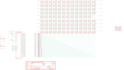

Contents
========

* [PRA5217 > Adafruit](#pra5217--adafruit)
	* [Images](#images)
	* [Tags](#tags)
  
![][im]
# PRA5217 > Adafruit

- ID: PROJ-ADAF-5217-STAN-01
- Hex ID: PRA5217
- Name: Adafruit
- Description: Adafruit

## Images
  
  

|kicadPcb3d|kicadPcb3dFront|kicadPcb3dBack|eagleImage|eagleSchemImage|
| :---: | :---: | :---: | :---: | :---: |
||||||

## Tags

- hexID: PRA5217
- oompType: PROJ
- oompSize: ADAF
- oompColor: 5217
- oompDesc: STAN
- oompIndex: 01
- oompName: Adafruit EyeLights LED Glasses and Driver PCB
- sources: All source files from https://github.com/adafruit/Adafruit-EyeLights-LED-Glasses-and-Driver-PCB (source licence details in srcLicense.md)
- linkBuyPage: http://www.adafruit.com/products/5217
- oompID: PROJ-ADAF-5217-STAN-01
- oompParts: C1,UNMATCHED-UNMATCHED-UNMATCHED-UNMATCHED-UNMATCHED
- oompParts: C2,UNMATCHED-UNMATCHED-UNMATCHED-UNMATCHED-UNMATCHED
- oompParts: C3,UNMATCHED-UNMATCHED-UNMATCHED-UNMATCHED-UNMATCHED
- oompParts: C4,UNMATCHED-UNMATCHED-UNMATCHED-UNMATCHED-UNMATCHED
- oompParts: C5,UNMATCHED-UNMATCHED-UNMATCHED-UNMATCHED-UNMATCHED
- oompParts: C6,UNMATCHED-UNMATCHED-UNMATCHED-UNMATCHED-UNMATCHED
- oompParts: CONN1,UNMATCHED-UNMATCHED-UNMATCHED-UNMATCHED-UNMATCHED
- oompParts: CONN2,UNMATCHED-UNMATCHED-UNMATCHED-UNMATCHED-UNMATCHED
- oompParts: LED1,UNMATCHED-UNMATCHED-UNMATCHED-UNMATCHED-UNMATCHED
- oompParts: LED2,UNMATCHED-UNMATCHED-UNMATCHED-UNMATCHED-UNMATCHED
- oompParts: LED3,UNMATCHED-UNMATCHED-UNMATCHED-UNMATCHED-UNMATCHED
- oompParts: LED4,UNMATCHED-UNMATCHED-UNMATCHED-UNMATCHED-UNMATCHED
- oompParts: LED5,UNMATCHED-UNMATCHED-UNMATCHED-UNMATCHED-UNMATCHED
- oompParts: LED6,UNMATCHED-UNMATCHED-UNMATCHED-UNMATCHED-UNMATCHED
- oompParts: LED7,UNMATCHED-UNMATCHED-UNMATCHED-UNMATCHED-UNMATCHED
- oompParts: LED8,UNMATCHED-UNMATCHED-UNMATCHED-UNMATCHED-UNMATCHED
- oompParts: LED9,UNMATCHED-UNMATCHED-UNMATCHED-UNMATCHED-UNMATCHED
- oompParts: LED10,UNMATCHED-UNMATCHED-UNMATCHED-UNMATCHED-UNMATCHED
- oompParts: LED11,UNMATCHED-UNMATCHED-UNMATCHED-UNMATCHED-UNMATCHED
- oompParts: LED12,UNMATCHED-UNMATCHED-UNMATCHED-UNMATCHED-UNMATCHED
- oompParts: LED13,UNMATCHED-UNMATCHED-UNMATCHED-UNMATCHED-UNMATCHED
- oompParts: LED14,UNMATCHED-UNMATCHED-UNMATCHED-UNMATCHED-UNMATCHED
- oompParts: LED15,UNMATCHED-UNMATCHED-UNMATCHED-UNMATCHED-UNMATCHED
- oompParts: LED16,UNMATCHED-UNMATCHED-UNMATCHED-UNMATCHED-UNMATCHED
- oompParts: LED17,UNMATCHED-UNMATCHED-UNMATCHED-UNMATCHED-UNMATCHED
- oompParts: LED18,UNMATCHED-UNMATCHED-UNMATCHED-UNMATCHED-UNMATCHED
- oompParts: LED19,UNMATCHED-UNMATCHED-UNMATCHED-UNMATCHED-UNMATCHED
- oompParts: LED20,UNMATCHED-UNMATCHED-UNMATCHED-UNMATCHED-UNMATCHED
- oompParts: LED21,UNMATCHED-UNMATCHED-UNMATCHED-UNMATCHED-UNMATCHED
- oompParts: LED22,UNMATCHED-UNMATCHED-UNMATCHED-UNMATCHED-UNMATCHED
- oompParts: LED23,UNMATCHED-UNMATCHED-UNMATCHED-UNMATCHED-UNMATCHED
- oompParts: LED24,UNMATCHED-UNMATCHED-UNMATCHED-UNMATCHED-UNMATCHED
- oompParts: LED25,UNMATCHED-UNMATCHED-UNMATCHED-UNMATCHED-UNMATCHED
- oompParts: LED26,UNMATCHED-UNMATCHED-UNMATCHED-UNMATCHED-UNMATCHED
- oompParts: LED27,UNMATCHED-UNMATCHED-UNMATCHED-UNMATCHED-UNMATCHED
- oompParts: LED28,UNMATCHED-UNMATCHED-UNMATCHED-UNMATCHED-UNMATCHED
- oompParts: LED29,UNMATCHED-UNMATCHED-UNMATCHED-UNMATCHED-UNMATCHED
- oompParts: LED30,UNMATCHED-UNMATCHED-UNMATCHED-UNMATCHED-UNMATCHED
- oompParts: LED31,UNMATCHED-UNMATCHED-UNMATCHED-UNMATCHED-UNMATCHED
- oompParts: LED32,UNMATCHED-UNMATCHED-UNMATCHED-UNMATCHED-UNMATCHED
- oompParts: LED33,UNMATCHED-UNMATCHED-UNMATCHED-UNMATCHED-UNMATCHED
- oompParts: LED34,UNMATCHED-UNMATCHED-UNMATCHED-UNMATCHED-UNMATCHED
- oompParts: LED35,UNMATCHED-UNMATCHED-UNMATCHED-UNMATCHED-UNMATCHED
- oompParts: LED36,UNMATCHED-UNMATCHED-UNMATCHED-UNMATCHED-UNMATCHED
- oompParts: LED37,UNMATCHED-UNMATCHED-UNMATCHED-UNMATCHED-UNMATCHED
- oompParts: LED38,UNMATCHED-UNMATCHED-UNMATCHED-UNMATCHED-UNMATCHED
- oompParts: LED39,UNMATCHED-UNMATCHED-UNMATCHED-UNMATCHED-UNMATCHED
- oompParts: LED40,UNMATCHED-UNMATCHED-UNMATCHED-UNMATCHED-UNMATCHED
- oompParts: LED41,UNMATCHED-UNMATCHED-UNMATCHED-UNMATCHED-UNMATCHED
- oompParts: LED42,UNMATCHED-UNMATCHED-UNMATCHED-UNMATCHED-UNMATCHED
- oompParts: LED43,UNMATCHED-UNMATCHED-UNMATCHED-UNMATCHED-UNMATCHED
- oompParts: LED44,UNMATCHED-UNMATCHED-UNMATCHED-UNMATCHED-UNMATCHED
- oompParts: LED45,UNMATCHED-UNMATCHED-UNMATCHED-UNMATCHED-UNMATCHED
- oompParts: LED46,UNMATCHED-UNMATCHED-UNMATCHED-UNMATCHED-UNMATCHED
- oompParts: LED47,UNMATCHED-UNMATCHED-UNMATCHED-UNMATCHED-UNMATCHED
- oompParts: LED48,UNMATCHED-UNMATCHED-UNMATCHED-UNMATCHED-UNMATCHED
- oompParts: LED49,UNMATCHED-UNMATCHED-UNMATCHED-UNMATCHED-UNMATCHED
- oompParts: LED50,UNMATCHED-UNMATCHED-UNMATCHED-UNMATCHED-UNMATCHED
- oompParts: LED51,UNMATCHED-UNMATCHED-UNMATCHED-UNMATCHED-UNMATCHED
- oompParts: LED52,UNMATCHED-UNMATCHED-UNMATCHED-UNMATCHED-UNMATCHED
- oompParts: LED53,UNMATCHED-UNMATCHED-UNMATCHED-UNMATCHED-UNMATCHED
- oompParts: LED54,UNMATCHED-UNMATCHED-UNMATCHED-UNMATCHED-UNMATCHED
- oompParts: LED55,UNMATCHED-UNMATCHED-UNMATCHED-UNMATCHED-UNMATCHED
- oompParts: LED56,UNMATCHED-UNMATCHED-UNMATCHED-UNMATCHED-UNMATCHED
- oompParts: LED57,UNMATCHED-UNMATCHED-UNMATCHED-UNMATCHED-UNMATCHED
- oompParts: LED58,UNMATCHED-UNMATCHED-UNMATCHED-UNMATCHED-UNMATCHED
- oompParts: LED59,UNMATCHED-UNMATCHED-UNMATCHED-UNMATCHED-UNMATCHED
- oompParts: LED60,UNMATCHED-UNMATCHED-UNMATCHED-UNMATCHED-UNMATCHED
- oompParts: LED61,UNMATCHED-UNMATCHED-UNMATCHED-UNMATCHED-UNMATCHED
- oompParts: LED62,UNMATCHED-UNMATCHED-UNMATCHED-UNMATCHED-UNMATCHED
- oompParts: LED63,UNMATCHED-UNMATCHED-UNMATCHED-UNMATCHED-UNMATCHED
- oompParts: LED64,UNMATCHED-UNMATCHED-UNMATCHED-UNMATCHED-UNMATCHED
- oompParts: LED66,UNMATCHED-UNMATCHED-UNMATCHED-UNMATCHED-UNMATCHED
- oompParts: LED67,UNMATCHED-UNMATCHED-UNMATCHED-UNMATCHED-UNMATCHED
- oompParts: LED68,UNMATCHED-UNMATCHED-UNMATCHED-UNMATCHED-UNMATCHED
- oompParts: LED69,UNMATCHED-UNMATCHED-UNMATCHED-UNMATCHED-UNMATCHED
- oompParts: LED70,UNMATCHED-UNMATCHED-UNMATCHED-UNMATCHED-UNMATCHED
- oompParts: LED71,UNMATCHED-UNMATCHED-UNMATCHED-UNMATCHED-UNMATCHED
- oompParts: LED72,UNMATCHED-UNMATCHED-UNMATCHED-UNMATCHED-UNMATCHED
- oompParts: LED73,UNMATCHED-UNMATCHED-UNMATCHED-UNMATCHED-UNMATCHED
- oompParts: LED74,UNMATCHED-UNMATCHED-UNMATCHED-UNMATCHED-UNMATCHED
- oompParts: LED75,UNMATCHED-UNMATCHED-UNMATCHED-UNMATCHED-UNMATCHED
- oompParts: LED76,UNMATCHED-UNMATCHED-UNMATCHED-UNMATCHED-UNMATCHED
- oompParts: LED77,UNMATCHED-UNMATCHED-UNMATCHED-UNMATCHED-UNMATCHED
- oompParts: LED78,UNMATCHED-UNMATCHED-UNMATCHED-UNMATCHED-UNMATCHED
- oompParts: LED79,UNMATCHED-UNMATCHED-UNMATCHED-UNMATCHED-UNMATCHED
- oompParts: LED80,UNMATCHED-UNMATCHED-UNMATCHED-UNMATCHED-UNMATCHED
- oompParts: LED81,UNMATCHED-UNMATCHED-UNMATCHED-UNMATCHED-UNMATCHED
- oompParts: LED82,UNMATCHED-UNMATCHED-UNMATCHED-UNMATCHED-UNMATCHED
- oompParts: LED83,UNMATCHED-UNMATCHED-UNMATCHED-UNMATCHED-UNMATCHED
- oompParts: LED84,UNMATCHED-UNMATCHED-UNMATCHED-UNMATCHED-UNMATCHED
- oompParts: LED85,UNMATCHED-UNMATCHED-UNMATCHED-UNMATCHED-UNMATCHED
- oompParts: LED86,UNMATCHED-UNMATCHED-UNMATCHED-UNMATCHED-UNMATCHED
- oompParts: LED87,UNMATCHED-UNMATCHED-UNMATCHED-UNMATCHED-UNMATCHED
- oompParts: LED88,UNMATCHED-UNMATCHED-UNMATCHED-UNMATCHED-UNMATCHED
- oompParts: LED89,UNMATCHED-UNMATCHED-UNMATCHED-UNMATCHED-UNMATCHED
- oompParts: LED90,UNMATCHED-UNMATCHED-UNMATCHED-UNMATCHED-UNMATCHED
- oompParts: LED91,UNMATCHED-UNMATCHED-UNMATCHED-UNMATCHED-UNMATCHED
- oompParts: LED92,UNMATCHED-UNMATCHED-UNMATCHED-UNMATCHED-UNMATCHED
- oompParts: LED93,UNMATCHED-UNMATCHED-UNMATCHED-UNMATCHED-UNMATCHED
- oompParts: LED94,UNMATCHED-UNMATCHED-UNMATCHED-UNMATCHED-UNMATCHED
- oompParts: LED95,UNMATCHED-UNMATCHED-UNMATCHED-UNMATCHED-UNMATCHED
- oompParts: LED96,UNMATCHED-UNMATCHED-UNMATCHED-UNMATCHED-UNMATCHED
- oompParts: LED97,UNMATCHED-UNMATCHED-UNMATCHED-UNMATCHED-UNMATCHED
- oompParts: LED98,UNMATCHED-UNMATCHED-UNMATCHED-UNMATCHED-UNMATCHED
- oompParts: LED99,UNMATCHED-UNMATCHED-UNMATCHED-UNMATCHED-UNMATCHED
- oompParts: LED100,UNMATCHED-UNMATCHED-UNMATCHED-UNMATCHED-UNMATCHED
- oompParts: LED101,UNMATCHED-UNMATCHED-UNMATCHED-UNMATCHED-UNMATCHED
- oompParts: LED102,UNMATCHED-UNMATCHED-UNMATCHED-UNMATCHED-UNMATCHED
- oompParts: LED103,UNMATCHED-UNMATCHED-UNMATCHED-UNMATCHED-UNMATCHED
- oompParts: LED104,UNMATCHED-UNMATCHED-UNMATCHED-UNMATCHED-UNMATCHED
- oompParts: LED105,UNMATCHED-UNMATCHED-UNMATCHED-UNMATCHED-UNMATCHED
- oompParts: LED106,UNMATCHED-UNMATCHED-UNMATCHED-UNMATCHED-UNMATCHED
- oompParts: LED107,UNMATCHED-UNMATCHED-UNMATCHED-UNMATCHED-UNMATCHED
- oompParts: LED108,UNMATCHED-UNMATCHED-UNMATCHED-UNMATCHED-UNMATCHED
- oompParts: LED109,UNMATCHED-UNMATCHED-UNMATCHED-UNMATCHED-UNMATCHED
- oompParts: LED110,UNMATCHED-UNMATCHED-UNMATCHED-UNMATCHED-UNMATCHED
- oompParts: LED111,UNMATCHED-UNMATCHED-UNMATCHED-UNMATCHED-UNMATCHED
- oompParts: LED112,UNMATCHED-UNMATCHED-UNMATCHED-UNMATCHED-UNMATCHED
- oompParts: LED113,UNMATCHED-UNMATCHED-UNMATCHED-UNMATCHED-UNMATCHED
- oompParts: LED114,UNMATCHED-UNMATCHED-UNMATCHED-UNMATCHED-UNMATCHED
- oompParts: LED115,UNMATCHED-UNMATCHED-UNMATCHED-UNMATCHED-UNMATCHED
- oompParts: LED116,UNMATCHED-UNMATCHED-UNMATCHED-UNMATCHED-UNMATCHED
- oompParts: LED117,UNMATCHED-UNMATCHED-UNMATCHED-UNMATCHED-UNMATCHED
- oompParts: R1,UNMATCHED-UNMATCHED-UNMATCHED-UNMATCHED-UNMATCHED
- oompParts: R2,UNMATCHED-UNMATCHED-UNMATCHED-UNMATCHED-UNMATCHED
- oompParts: R3,UNMATCHED-UNMATCHED-UNMATCHED-UNMATCHED-UNMATCHED
- oompParts: R4,UNMATCHED-UNMATCHED-UNMATCHED-UNMATCHED-UNMATCHED
- oompParts: R5,UNMATCHED-UNMATCHED-UNMATCHED-UNMATCHED-UNMATCHED
- oompParts: R6,UNMATCHED-UNMATCHED-UNMATCHED-UNMATCHED-UNMATCHED
- oompParts: R7,UNMATCHED-UNMATCHED-UNMATCHED-UNMATCHED-UNMATCHED
- oompParts: R8,UNMATCHED-UNMATCHED-UNMATCHED-UNMATCHED-UNMATCHED
- oompParts: R9,UNMATCHED-UNMATCHED-UNMATCHED-UNMATCHED-UNMATCHED
- oompParts: R10,UNMATCHED-UNMATCHED-UNMATCHED-UNMATCHED-UNMATCHED
- oompParts: R11,UNMATCHED-UNMATCHED-UNMATCHED-UNMATCHED-UNMATCHED
- oompParts: R12,UNMATCHED-UNMATCHED-UNMATCHED-UNMATCHED-UNMATCHED
- oompParts: R13,UNMATCHED-UNMATCHED-UNMATCHED-UNMATCHED-UNMATCHED
- oompParts: R14,UNMATCHED-UNMATCHED-UNMATCHED-UNMATCHED-UNMATCHED
- oompParts: R15,UNMATCHED-UNMATCHED-UNMATCHED-UNMATCHED-UNMATCHED
- oompParts: R16,UNMATCHED-UNMATCHED-UNMATCHED-UNMATCHED-UNMATCHED
- oompParts: R17,UNMATCHED-UNMATCHED-UNMATCHED-UNMATCHED-UNMATCHED
- oompParts: R18,UNMATCHED-UNMATCHED-UNMATCHED-UNMATCHED-UNMATCHED
- oompParts: R19,UNMATCHED-UNMATCHED-UNMATCHED-UNMATCHED-UNMATCHED
- oompParts: R20,UNMATCHED-UNMATCHED-UNMATCHED-UNMATCHED-UNMATCHED
- oompParts: R21,UNMATCHED-UNMATCHED-UNMATCHED-UNMATCHED-UNMATCHED
- oompParts: R22,UNMATCHED-UNMATCHED-UNMATCHED-UNMATCHED-UNMATCHED
- oompParts: R23,UNMATCHED-UNMATCHED-UNMATCHED-UNMATCHED-UNMATCHED
- oompParts: R24,UNMATCHED-UNMATCHED-UNMATCHED-UNMATCHED-UNMATCHED
- oompParts: R25,UNMATCHED-UNMATCHED-UNMATCHED-UNMATCHED-UNMATCHED
- oompParts: R26,UNMATCHED-UNMATCHED-UNMATCHED-UNMATCHED-UNMATCHED
- oompParts: R27,UNMATCHED-UNMATCHED-UNMATCHED-UNMATCHED-UNMATCHED
- oompParts: R28,UNMATCHED-UNMATCHED-UNMATCHED-UNMATCHED-UNMATCHED
- oompParts: R29,UNMATCHED-UNMATCHED-UNMATCHED-UNMATCHED-UNMATCHED
- oompParts: R30,UNMATCHED-UNMATCHED-UNMATCHED-UNMATCHED-UNMATCHED
- oompParts: R31,UNMATCHED-UNMATCHED-UNMATCHED-UNMATCHED-UNMATCHED
- oompParts: R32,UNMATCHED-UNMATCHED-UNMATCHED-UNMATCHED-UNMATCHED
- oompParts: R33,UNMATCHED-UNMATCHED-UNMATCHED-UNMATCHED-UNMATCHED
- oompParts: R34,UNMATCHED-UNMATCHED-UNMATCHED-UNMATCHED-UNMATCHED
- oompParts: R35,UNMATCHED-UNMATCHED-UNMATCHED-UNMATCHED-UNMATCHED
- oompParts: R36,UNMATCHED-UNMATCHED-UNMATCHED-UNMATCHED-UNMATCHED
- oompParts: R37,UNMATCHED-UNMATCHED-UNMATCHED-UNMATCHED-UNMATCHED
- oompParts: R38,UNMATCHED-UNMATCHED-UNMATCHED-UNMATCHED-UNMATCHED
- oompParts: R39,UNMATCHED-UNMATCHED-UNMATCHED-UNMATCHED-UNMATCHED
- oompParts: R40,UNMATCHED-UNMATCHED-UNMATCHED-UNMATCHED-UNMATCHED
- oompParts: R41,UNMATCHED-UNMATCHED-UNMATCHED-UNMATCHED-UNMATCHED
- oompParts: R42,UNMATCHED-UNMATCHED-UNMATCHED-UNMATCHED-UNMATCHED
- oompParts: X1,UNMATCHED-UNMATCHED-UNMATCHED-UNMATCHED-UNMATCHED
- rawParts: C1,10uF,CAP_CERAMIC0805-NOOUTLINE,0805-NO,Ceramic Capacitors,,
- rawParts: C2,1uF,CAP_CERAMIC0603_NO,0603-NO,Ceramic Capacitors,,
- rawParts: C3,10uF,CAP_CERAMIC0805-NOOUTLINE,0805-NO,Ceramic Capacitors,,
- rawParts: C4,10uF,CAP_CERAMIC0805-NOOUTLINE,0805-NO,Ceramic Capacitors,,
- rawParts: C5,10uF,CAP_CERAMIC0805-NOOUTLINE,0805-NO,Ceramic Capacitors,,
- rawParts: C6,1uF,CAP_CERAMIC0603_NO,0603-NO,Ceramic Capacitors,,
- rawParts: CONN1,STEMMA_I2C_QT,STEMMA_I2C_QT,JST_SH4,,,
- rawParts: CONN2,STEMMA_I2C_QT,STEMMA_I2C_QT,JST_SH4,,,
- rawParts: FID1,FIDUCIAL_1MM,FIDUCIAL_1MM,FIDUCIAL_1MM,Fiducial Alignment Points,EXCLUDE,
- rawParts: FID2,FIDUCIAL_1MM,FIDUCIAL_1MM,FIDUCIAL_1MM,Fiducial Alignment Points,EXCLUDE,
- rawParts: FID3,FIDUCIAL_1MM,FIDUCIAL_1MM,FIDUCIAL_1MM,Fiducial Alignment Points,EXCLUDE,
- rawParts: FID4,FIDUCIAL_1MM,FIDUCIAL_1MM,FIDUCIAL_1MM,Fiducial Alignment Points,EXCLUDE,
- rawParts: LED1,RGBLED_CA_2121,RGBLED_CA_2121,RGBLED_2121,RGB LED, common-anode5MM Staggered pins5mm Piranha package,,
- rawParts: LED2,RGBLED_CA_2121,RGBLED_CA_2121,RGBLED_2121,RGB LED, common-anode5MM Staggered pins5mm Piranha package,,
- rawParts: LED3,RGBLED_CA_2121,RGBLED_CA_2121,RGBLED_2121,RGB LED, common-anode5MM Staggered pins5mm Piranha package,,
- rawParts: LED4,RGBLED_CA_2121,RGBLED_CA_2121,RGBLED_2121,RGB LED, common-anode5MM Staggered pins5mm Piranha package,,
- rawParts: LED5,RGBLED_CA_2121,RGBLED_CA_2121,RGBLED_2121,RGB LED, common-anode5MM Staggered pins5mm Piranha package,,
- rawParts: LED6,RGBLED_CA_2121,RGBLED_CA_2121,RGBLED_2121,RGB LED, common-anode5MM Staggered pins5mm Piranha package,,
- rawParts: LED7,RGBLED_CA_2121,RGBLED_CA_2121,RGBLED_2121,RGB LED, common-anode5MM Staggered pins5mm Piranha package,,
- rawParts: LED8,RGBLED_CA_2121,RGBLED_CA_2121,RGBLED_2121,RGB LED, common-anode5MM Staggered pins5mm Piranha package,,
- rawParts: LED9,RGBLED_CA_2121,RGBLED_CA_2121,RGBLED_2121,RGB LED, common-anode5MM Staggered pins5mm Piranha package,,
- rawParts: LED10,RGBLED_CA_2121,RGBLED_CA_2121,RGBLED_2121,RGB LED, common-anode5MM Staggered pins5mm Piranha package,,
- rawParts: LED11,RGBLED_CA_2121,RGBLED_CA_2121,RGBLED_2121,RGB LED, common-anode5MM Staggered pins5mm Piranha package,,
- rawParts: LED12,RGBLED_CA_2121,RGBLED_CA_2121,RGBLED_2121,RGB LED, common-anode5MM Staggered pins5mm Piranha package,,
- rawParts: LED13,RGBLED_CA_2121,RGBLED_CA_2121,RGBLED_2121,RGB LED, common-anode5MM Staggered pins5mm Piranha package,,
- rawParts: LED14,RGBLED_CA_2121,RGBLED_CA_2121,RGBLED_2121,RGB LED, common-anode5MM Staggered pins5mm Piranha package,,
- rawParts: LED15,RGBLED_CA_2121,RGBLED_CA_2121,RGBLED_2121,RGB LED, common-anode5MM Staggered pins5mm Piranha package,,
- rawParts: LED16,RGBLED_CA_2121,RGBLED_CA_2121,RGBLED_2121,RGB LED, common-anode5MM Staggered pins5mm Piranha package,,
- rawParts: LED17,RGBLED_CA_2121,RGBLED_CA_2121,RGBLED_2121,RGB LED, common-anode5MM Staggered pins5mm Piranha package,,
- rawParts: LED18,RGBLED_CA_2121,RGBLED_CA_2121,RGBLED_2121,RGB LED, common-anode5MM Staggered pins5mm Piranha package,,
- rawParts: LED19,RGBLED_CA_2121,RGBLED_CA_2121,RGBLED_2121,RGB LED, common-anode5MM Staggered pins5mm Piranha package,,
- rawParts: LED20,RGBLED_CA_2121,RGBLED_CA_2121,RGBLED_2121,RGB LED, common-anode5MM Staggered pins5mm Piranha package,,
- rawParts: LED21,RGBLED_CA_2121,RGBLED_CA_2121,RGBLED_2121,RGB LED, common-anode5MM Staggered pins5mm Piranha package,,
- rawParts: LED22,RGBLED_CA_2121,RGBLED_CA_2121,RGBLED_2121,RGB LED, common-anode5MM Staggered pins5mm Piranha package,,
- rawParts: LED23,RGBLED_CA_2121,RGBLED_CA_2121,RGBLED_2121,RGB LED, common-anode5MM Staggered pins5mm Piranha package,,
- rawParts: LED24,RGBLED_CA_2121,RGBLED_CA_2121,RGBLED_2121,RGB LED, common-anode5MM Staggered pins5mm Piranha package,,
- rawParts: LED25,RGBLED_CA_2121,RGBLED_CA_2121,RGBLED_2121,RGB LED, common-anode5MM Staggered pins5mm Piranha package,,
- rawParts: LED26,RGBLED_CA_2121,RGBLED_CA_2121,RGBLED_2121,RGB LED, common-anode5MM Staggered pins5mm Piranha package,,
- rawParts: LED27,RGBLED_CA_2121,RGBLED_CA_2121,RGBLED_2121,RGB LED, common-anode5MM Staggered pins5mm Piranha package,,
- rawParts: LED28,RGBLED_CA_2121,RGBLED_CA_2121,RGBLED_2121,RGB LED, common-anode5MM Staggered pins5mm Piranha package,,
- rawParts: LED29,RGBLED_CA_2121,RGBLED_CA_2121,RGBLED_2121,RGB LED, common-anode5MM Staggered pins5mm Piranha package,,
- rawParts: LED30,RGBLED_CA_2121,RGBLED_CA_2121,RGBLED_2121,RGB LED, common-anode5MM Staggered pins5mm Piranha package,,
- rawParts: LED31,RGBLED_CA_2121,RGBLED_CA_2121,RGBLED_2121,RGB LED, common-anode5MM Staggered pins5mm Piranha package,,
- rawParts: LED32,RGBLED_CA_2121,RGBLED_CA_2121,RGBLED_2121,RGB LED, common-anode5MM Staggered pins5mm Piranha package,,
- rawParts: LED33,RGBLED_CA_2121,RGBLED_CA_2121,RGBLED_2121,RGB LED, common-anode5MM Staggered pins5mm Piranha package,,
- rawParts: LED34,RGBLED_CA_2121,RGBLED_CA_2121,RGBLED_2121,RGB LED, common-anode5MM Staggered pins5mm Piranha package,,
- rawParts: LED35,RGBLED_CA_2121,RGBLED_CA_2121,RGBLED_2121,RGB LED, common-anode5MM Staggered pins5mm Piranha package,,
- rawParts: LED36,RGBLED_CA_2121,RGBLED_CA_2121,RGBLED_2121,RGB LED, common-anode5MM Staggered pins5mm Piranha package,,
- rawParts: LED37,RGBLED_CA_2121,RGBLED_CA_2121,RGBLED_2121,RGB LED, common-anode5MM Staggered pins5mm Piranha package,,
- rawParts: LED38,RGBLED_CA_2121,RGBLED_CA_2121,RGBLED_2121,RGB LED, common-anode5MM Staggered pins5mm Piranha package,,
- rawParts: LED39,RGBLED_CA_2121,RGBLED_CA_2121,RGBLED_2121,RGB LED, common-anode5MM Staggered pins5mm Piranha package,,
- rawParts: LED40,RGBLED_CA_2121,RGBLED_CA_2121,RGBLED_2121,RGB LED, common-anode5MM Staggered pins5mm Piranha package,,
- rawParts: LED41,RGBLED_CA_2121,RGBLED_CA_2121,RGBLED_2121,RGB LED, common-anode5MM Staggered pins5mm Piranha package,,
- rawParts: LED42,RGBLED_CA_2121,RGBLED_CA_2121,RGBLED_2121,RGB LED, common-anode5MM Staggered pins5mm Piranha package,,
- rawParts: LED43,RGBLED_CA_2121,RGBLED_CA_2121,RGBLED_2121,RGB LED, common-anode5MM Staggered pins5mm Piranha package,,
- rawParts: LED44,RGBLED_CA_2121,RGBLED_CA_2121,RGBLED_2121,RGB LED, common-anode5MM Staggered pins5mm Piranha package,,
- rawParts: LED45,RGBLED_CA_2121,RGBLED_CA_2121,RGBLED_2121,RGB LED, common-anode5MM Staggered pins5mm Piranha package,,
- rawParts: LED46,RGBLED_CA_2121,RGBLED_CA_2121,RGBLED_2121,RGB LED, common-anode5MM Staggered pins5mm Piranha package,,
- rawParts: LED47,RGBLED_CA_2121,RGBLED_CA_2121,RGBLED_2121,RGB LED, common-anode5MM Staggered pins5mm Piranha package,,
- rawParts: LED48,RGBLED_CA_2121,RGBLED_CA_2121,RGBLED_2121,RGB LED, common-anode5MM Staggered pins5mm Piranha package,,
- rawParts: LED49,RGBLED_CA_2121,RGBLED_CA_2121,RGBLED_2121,RGB LED, common-anode5MM Staggered pins5mm Piranha package,,
- rawParts: LED50,RGBLED_CA_2121,RGBLED_CA_2121,RGBLED_2121,RGB LED, common-anode5MM Staggered pins5mm Piranha package,,
- rawParts: LED51,RGBLED_CA_2121,RGBLED_CA_2121,RGBLED_2121,RGB LED, common-anode5MM Staggered pins5mm Piranha package,,
- rawParts: LED52,RGBLED_CA_2121,RGBLED_CA_2121,RGBLED_2121,RGB LED, common-anode5MM Staggered pins5mm Piranha package,,
- rawParts: LED53,RGBLED_CA_2121,RGBLED_CA_2121,RGBLED_2121,RGB LED, common-anode5MM Staggered pins5mm Piranha package,,
- rawParts: LED54,RGBLED_CA_2121,RGBLED_CA_2121,RGBLED_2121,RGB LED, common-anode5MM Staggered pins5mm Piranha package,,
- rawParts: LED55,RGBLED_CA_2121,RGBLED_CA_2121,RGBLED_2121,RGB LED, common-anode5MM Staggered pins5mm Piranha package,,
- rawParts: LED56,RGBLED_CA_2121,RGBLED_CA_2121,RGBLED_2121,RGB LED, common-anode5MM Staggered pins5mm Piranha package,,
- rawParts: LED57,RGBLED_CA_2121,RGBLED_CA_2121,RGBLED_2121,RGB LED, common-anode5MM Staggered pins5mm Piranha package,,
- rawParts: LED58,RGBLED_CA_2121,RGBLED_CA_2121,RGBLED_2121,RGB LED, common-anode5MM Staggered pins5mm Piranha package,,
- rawParts: LED59,RGBLED_CA_2121,RGBLED_CA_2121,RGBLED_2121,RGB LED, common-anode5MM Staggered pins5mm Piranha package,,
- rawParts: LED60,RGBLED_CA_2121,RGBLED_CA_2121,RGBLED_2121,RGB LED, common-anode5MM Staggered pins5mm Piranha package,,
- rawParts: LED61,RGBLED_CA_2121,RGBLED_CA_2121,RGBLED_2121,RGB LED, common-anode5MM Staggered pins5mm Piranha package,,
- rawParts: LED62,RGBLED_CA_2121,RGBLED_CA_2121,RGBLED_2121,RGB LED, common-anode5MM Staggered pins5mm Piranha package,,
- rawParts: LED63,RGBLED_CA_2121,RGBLED_CA_2121,RGBLED_2121,RGB LED, common-anode5MM Staggered pins5mm Piranha package,,
- rawParts: LED64,RGBLED_CA_2121,RGBLED_CA_2121,RGBLED_2121,RGB LED, common-anode5MM Staggered pins5mm Piranha package,,
- rawParts: LED66,RGBLED_CA_2121,RGBLED_CA_2121,RGBLED_2121,RGB LED, common-anode5MM Staggered pins5mm Piranha package,,
- rawParts: LED67,RGBLED_CA_2121,RGBLED_CA_2121,RGBLED_2121,RGB LED, common-anode5MM Staggered pins5mm Piranha package,,
- rawParts: LED68,RGBLED_CA_2121,RGBLED_CA_2121,RGBLED_2121,RGB LED, common-anode5MM Staggered pins5mm Piranha package,,
- rawParts: LED69,RGBLED_CA_2121,RGBLED_CA_2121,RGBLED_2121,RGB LED, common-anode5MM Staggered pins5mm Piranha package,,
- rawParts: LED70,RGBLED_CA_2121,RGBLED_CA_2121,RGBLED_2121,RGB LED, common-anode5MM Staggered pins5mm Piranha package,,
- rawParts: LED71,RGBLED_CA_2121,RGBLED_CA_2121,RGBLED_2121,RGB LED, common-anode5MM Staggered pins5mm Piranha package,,
- rawParts: LED72,RGBLED_CA_2121,RGBLED_CA_2121,RGBLED_2121,RGB LED, common-anode5MM Staggered pins5mm Piranha package,,
- rawParts: LED73,RGBLED_CA_2121,RGBLED_CA_2121,RGBLED_2121,RGB LED, common-anode5MM Staggered pins5mm Piranha package,,
- rawParts: LED74,RGBLED_CA_2121,RGBLED_CA_2121,RGBLED_2121,RGB LED, common-anode5MM Staggered pins5mm Piranha package,,
- rawParts: LED75,RGBLED_CA_2121,RGBLED_CA_2121,RGBLED_2121,RGB LED, common-anode5MM Staggered pins5mm Piranha package,,
- rawParts: LED76,RGBLED_CA_2121,RGBLED_CA_2121,RGBLED_2121,RGB LED, common-anode5MM Staggered pins5mm Piranha package,,
- rawParts: LED77,RGBLED_CA_2121,RGBLED_CA_2121,RGBLED_2121,RGB LED, common-anode5MM Staggered pins5mm Piranha package,,
- rawParts: LED78,RGBLED_CA_2121,RGBLED_CA_2121,RGBLED_2121,RGB LED, common-anode5MM Staggered pins5mm Piranha package,,
- rawParts: LED79,RGBLED_CA_2121,RGBLED_CA_2121,RGBLED_2121,RGB LED, common-anode5MM Staggered pins5mm Piranha package,,
- rawParts: LED80,RGBLED_CA_2121,RGBLED_CA_2121,RGBLED_2121,RGB LED, common-anode5MM Staggered pins5mm Piranha package,,
- rawParts: LED81,RGBLED_CA_2121,RGBLED_CA_2121,RGBLED_2121,RGB LED, common-anode5MM Staggered pins5mm Piranha package,,
- rawParts: LED82,RGBLED_CA_2121,RGBLED_CA_2121,RGBLED_2121,RGB LED, common-anode5MM Staggered pins5mm Piranha package,,
- rawParts: LED83,RGBLED_CA_2121,RGBLED_CA_2121,RGBLED_2121,RGB LED, common-anode5MM Staggered pins5mm Piranha package,,
- rawParts: LED84,RGBLED_CA_2121,RGBLED_CA_2121,RGBLED_2121,RGB LED, common-anode5MM Staggered pins5mm Piranha package,,
- rawParts: LED85,RGBLED_CA_2121,RGBLED_CA_2121,RGBLED_2121,RGB LED, common-anode5MM Staggered pins5mm Piranha package,,
- rawParts: LED86,RGBLED_CA_2121,RGBLED_CA_2121,RGBLED_2121,RGB LED, common-anode5MM Staggered pins5mm Piranha package,,
- rawParts: LED87,RGBLED_CA_2121,RGBLED_CA_2121,RGBLED_2121,RGB LED, common-anode5MM Staggered pins5mm Piranha package,,
- rawParts: LED88,RGBLED_CA_2121,RGBLED_CA_2121,RGBLED_2121,RGB LED, common-anode5MM Staggered pins5mm Piranha package,,
- rawParts: LED89,RGBLED_CA_2121,RGBLED_CA_2121,RGBLED_2121,RGB LED, common-anode5MM Staggered pins5mm Piranha package,,
- rawParts: LED90,RGBLED_CA_2121,RGBLED_CA_2121,RGBLED_2121,RGB LED, common-anode5MM Staggered pins5mm Piranha package,,
- rawParts: LED91,RGBLED_CA_2121,RGBLED_CA_2121,RGBLED_2121,RGB LED, common-anode5MM Staggered pins5mm Piranha package,,
- rawParts: LED92,RGBLED_CA_2121,RGBLED_CA_2121,RGBLED_2121,RGB LED, common-anode5MM Staggered pins5mm Piranha package,,
- rawParts: LED93,RGBLED_CA_2121,RGBLED_CA_2121,RGBLED_2121,RGB LED, common-anode5MM Staggered pins5mm Piranha package,,
- rawParts: LED94,RGBLED_CA_2121,RGBLED_CA_2121,RGBLED_2121,RGB LED, common-anode5MM Staggered pins5mm Piranha package,,
- rawParts: LED95,RGBLED_CA_2121,RGBLED_CA_2121,RGBLED_2121,RGB LED, common-anode5MM Staggered pins5mm Piranha package,,
- rawParts: LED96,RGBLED_CA_2121,RGBLED_CA_2121,RGBLED_2121,RGB LED, common-anode5MM Staggered pins5mm Piranha package,,
- rawParts: LED97,RGBLED_CA_2121,RGBLED_CA_2121,RGBLED_2121,RGB LED, common-anode5MM Staggered pins5mm Piranha package,,
- rawParts: LED98,RGBLED_CA_2121,RGBLED_CA_2121,RGBLED_2121,RGB LED, common-anode5MM Staggered pins5mm Piranha package,,
- rawParts: LED99,RGBLED_CA_2121,RGBLED_CA_2121,RGBLED_2121,RGB LED, common-anode5MM Staggered pins5mm Piranha package,,
- rawParts: LED100,RGBLED_CA_2121,RGBLED_CA_2121,RGBLED_2121,RGB LED, common-anode5MM Staggered pins5mm Piranha package,,
- rawParts: LED101,RGBLED_CA_2121,RGBLED_CA_2121,RGBLED_2121,RGB LED, common-anode5MM Staggered pins5mm Piranha package,,
- rawParts: LED102,RGBLED_CA_2121,RGBLED_CA_2121,RGBLED_2121,RGB LED, common-anode5MM Staggered pins5mm Piranha package,,
- rawParts: LED103,RGBLED_CA_2121,RGBLED_CA_2121,RGBLED_2121,RGB LED, common-anode5MM Staggered pins5mm Piranha package,,
- rawParts: LED104,RGBLED_CA_2121,RGBLED_CA_2121,RGBLED_2121,RGB LED, common-anode5MM Staggered pins5mm Piranha package,,
- rawParts: LED105,RGBLED_CA_2121,RGBLED_CA_2121,RGBLED_2121,RGB LED, common-anode5MM Staggered pins5mm Piranha package,,
- rawParts: LED106,RGBLED_CA_2121,RGBLED_CA_2121,RGBLED_2121,RGB LED, common-anode5MM Staggered pins5mm Piranha package,,
- rawParts: LED107,RGBLED_CA_2121,RGBLED_CA_2121,RGBLED_2121,RGB LED, common-anode5MM Staggered pins5mm Piranha package,,
- rawParts: LED108,RGBLED_CA_2121,RGBLED_CA_2121,RGBLED_2121,RGB LED, common-anode5MM Staggered pins5mm Piranha package,,
- rawParts: LED109,RGBLED_CA_2121,RGBLED_CA_2121,RGBLED_2121,RGB LED, common-anode5MM Staggered pins5mm Piranha package,,
- rawParts: LED110,RGBLED_CA_2121,RGBLED_CA_2121,RGBLED_2121,RGB LED, common-anode5MM Staggered pins5mm Piranha package,,
- rawParts: LED111,RGBLED_CA_2121,RGBLED_CA_2121,RGBLED_2121,RGB LED, common-anode5MM Staggered pins5mm Piranha package,,
- rawParts: LED112,RGBLED_CA_2121,RGBLED_CA_2121,RGBLED_2121,RGB LED, common-anode5MM Staggered pins5mm Piranha package,,
- rawParts: LED113,RGBLED_CA_2121,RGBLED_CA_2121,RGBLED_2121,RGB LED, common-anode5MM Staggered pins5mm Piranha package,,
- rawParts: LED114,RGBLED_CA_2121,RGBLED_CA_2121,RGBLED_2121,RGB LED, common-anode5MM Staggered pins5mm Piranha package,,
- rawParts: LED115,RGBLED_CA_2121,RGBLED_CA_2121,RGBLED_2121,RGB LED, common-anode5MM Staggered pins5mm Piranha package,,
- rawParts: LED116,RGBLED_CA_2121,RGBLED_CA_2121,RGBLED_2121,RGB LED, common-anode5MM Staggered pins5mm Piranha package,,
- rawParts: LED117,RGBLED_CA_2121,RGBLED_CA_2121,RGBLED_2121,RGB LED, common-anode5MM Staggered pins5mm Piranha package,,
- rawParts: R1,2.2K,RESISTOR_0603_NOOUT,0603-NO,Resistors,,
- rawParts: R2,51,RESISTOR_0603_NOOUT,0603-NO,Resistors,,
- rawParts: R3,51,RESISTOR_0603_NOOUT,0603-NO,Resistors,,
- rawParts: R4,22,RESISTOR_0603_NOOUT,0603-NO,Resistors,,
- rawParts: R5,51,RESISTOR_0603_NOOUT,0603-NO,Resistors,,
- rawParts: R6,51,RESISTOR_0603_NOOUT,0603-NO,Resistors,,
- rawParts: R7,2.2K,RESISTOR_0603_NOOUT,0603-NO,Resistors,,
- rawParts: R8,22,RESISTOR_0603_NOOUT,0603-NO,Resistors,,
- rawParts: R9,51,RESISTOR_0603_NOOUT,0603-NO,Resistors,,
- rawParts: R10,22,RESISTOR_0603_NOOUT,0603-NO,Resistors,,
- rawParts: R11,51,RESISTOR_0603_NOOUT,0603-NO,Resistors,,
- rawParts: R12,51,RESISTOR_0603_NOOUT,0603-NO,Resistors,,
- rawParts: R13,22,RESISTOR_0603_NOOUT,0603-NO,Resistors,,
- rawParts: R14,51,RESISTOR_0603_NOOUT,0603-NO,Resistors,,
- rawParts: R15,51,RESISTOR_0603_NOOUT,0603-NO,Resistors,,
- rawParts: R16,22,RESISTOR_0603_NOOUT,0603-NO,Resistors,,
- rawParts: R17,51,RESISTOR_0603_NOOUT,0603-NO,Resistors,,
- rawParts: R18,51,RESISTOR_0603_NOOUT,0603-NO,Resistors,,
- rawParts: R19,22,RESISTOR_0603_NOOUT,0603-NO,Resistors,,
- rawParts: R20,51,RESISTOR_0603_NOOUT,0603-NO,Resistors,,
- rawParts: R21,51,RESISTOR_0603_NOOUT,0603-NO,Resistors,,
- rawParts: R22,22,RESISTOR_0603_NOOUT,0603-NO,Resistors,,
- rawParts: R23,51,RESISTOR_0603_NOOUT,0603-NO,Resistors,,
- rawParts: R24,51,RESISTOR_0603_NOOUT,0603-NO,Resistors,,
- rawParts: R25,22,RESISTOR_0603_NOOUT,0603-NO,Resistors,,
- rawParts: R26,51,RESISTOR_0603_NOOUT,0603-NO,Resistors,,
- rawParts: R27,22,RESISTOR_0603_NOOUT,0603-NO,Resistors,,
- rawParts: R28,51,RESISTOR_0603_NOOUT,0603-NO,Resistors,,
- rawParts: R29,51,RESISTOR_0603_NOOUT,0603-NO,Resistors,,
- rawParts: R30,22,RESISTOR_0603_NOOUT,0603-NO,Resistors,,
- rawParts: R31,51,RESISTOR_0603_NOOUT,0603-NO,Resistors,,
- rawParts: R32,51,RESISTOR_0603_NOOUT,0603-NO,Resistors,,
- rawParts: R33,22,RESISTOR_0603_NOOUT,0603-NO,Resistors,,
- rawParts: R34,51,RESISTOR_0603_NOOUT,0603-NO,Resistors,,
- rawParts: R35,51,RESISTOR_0603_NOOUT,0603-NO,Resistors,,
- rawParts: R36,22,RESISTOR_0603_NOOUT,0603-NO,Resistors,,
- rawParts: R37,51,RESISTOR_0603_NOOUT,0603-NO,Resistors,,
- rawParts: R38,51,RESISTOR_0603_NOOUT,0603-NO,Resistors,,
- rawParts: R39,22,RESISTOR_0603_NOOUT,0603-NO,Resistors,,
- rawParts: R40,51,RESISTOR_0603_NOOUT,0603-NO,Resistors,,
- rawParts: R41,51,RESISTOR_0603_NOOUT,0603-NO,Resistors,,
- rawParts: R42,2.2K,RESISTOR_0603_NOOUT,0603-NO,Resistors,,
- rawParts: X1,IS31FL3741,IS31FL3741,QFN60_7MM,,,

[im]: kicadPcb3d_450.png
