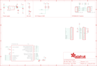

Contents
========

* [PRA5233 > Adafruit ATtiny8x7 Breakout PCB](#pra5233--adafruit-attiny8x7-breakout-pcb)
	* [Schematic](#schematic)
	* [PCB](#pcb)
	* [Interactive BOM](#interactive-bom)
	* [OOMP Parts](#oomp-parts)
	* [Images](#images)
	* [Tags](#tags)
  
![][im]
# PRA5233 > Adafruit ATtiny8x7 Breakout PCB

- ID: PROJ-ADAF-5233-STAN-01
- Hex ID: PRA5233
- Name: Adafruit
- Description: Adafruit
- Long Link: [http://oom.lt/PROJ-ADAF-5233-STAN-01](http://oom.lt/PROJ-ADAF-5233-STAN-01)
- Short Link: [http://oom.lt/PRA5233](http://oom.lt/PRA5233)

## Schematic
  

## PCB
  

## Interactive BOM

- Interactive BOM page: [ibom.html](https://htmlpreview.github.io/?https://github.com/oomlout/oomlout_OOMP_projects/blob/main/PROJ-ADAF-5233-STAN-01/kicad/bom/ibom.html)

## OOMP Parts
  

|OOMP Parts|
| :---: |
|CAPC-UNMATCHED-X-UF10-01 C1|
|[CAPC-0805-X-UF10-V10  SMD (0805) 10 uF Capacitor (Ceramic) 10v  C3](https://github.com/oomlout/oomlout_OOMP_parts/tree/main/CAPC-0805-X-UF10-V10/)|
|[CAPC-0603-X-NF100-V50  SMD (0603) 100 nF Capacitor (Ceramic) 50v  C5](https://github.com/oomlout/oomlout_OOMP_parts/tree/main/CAPC-0603-X-NF100-V50/)|
|HEAD-I01-X-UNMATCHED-01 CONN3, CONN4|
|[LEDS-0603-G-STAN-01  SMD (0603) Green LED  D3](https://github.com/oomlout/oomlout_OOMP_parts/tree/main/LEDS-0603-G-STAN-01/)|
|[LEDS-0603-R-STAN-01  SMD (0603) Red LED  D4](https://github.com/oomlout/oomlout_OOMP_parts/tree/main/LEDS-0603-R-STAN-01/)|
|UNMATCHED-UNMATCHED-X-UNMATCHED-01 IC2|
|[HEAD-I01-X-PI12-01  2.54 mm 12 Pin Header  JP1, JP3](https://github.com/oomlout/oomlout_OOMP_parts/tree/main/HEAD-I01-X-PI12-01/)|
|[RESE-0603-X-O103-01  SMD (0603) 10k Ohm Resistor  R1](https://github.com/oomlout/oomlout_OOMP_parts/tree/main/RESE-0603-X-O103-01/)|
|RESA-06038-X-O103X4-01 R6|
|UNMATCHED-SO235-X-UNMATCHED-01 U1|

## Images
  
  

|bominteractivefront|bominteractiveback|kicadPcb3d|kicadPcb3dFront|kicadPcb3dBack|eagleImage|eagleSchemImage|pcbdraw|pcbdrawback|
| :---: | :---: | :---: | :---: | :---: | :---: | :---: | :---: | :---: |
||||||||||

## Tags

- hexID: PRA5233
- oompType: PROJ
- oompSize: ADAF
- oompColor: 5233
- oompDesc: STAN
- oompIndex: 01
- oompName: Adafruit ATtiny8x7 Breakout PCB
- sources: All source files from https://github.com/adafruit/Adafruit-ATtiny8x7-Breakout-PCB (source licence details in srcLicense.md)
- linkBuyPage: http://www.adafruit.com/products/5233
- oompID: PROJ-ADAF-5233-STAN-01
- oompParts: C1,CAPC-UNMATCHED-X-UF10-01
- oompParts: C3,CAPC-0805-X-UF10-V10
- oompParts: C5,CAPC-0603-X-NF100-V50
- oompParts: CONN3,HEAD-I01-X-UNMATCHED-01
- oompParts: CONN4,HEAD-I01-X-UNMATCHED-01
- oompParts: D3,LEDS-0603-G-STAN-01
- oompParts: D4,LEDS-0603-R-STAN-01
- oompParts: IC2,UNMATCHED-UNMATCHED-X-UNMATCHED-01
- oompParts: JP1,HEAD-I01-X-PI12-01
- oompParts: JP3,HEAD-I01-X-PI12-01
- oompParts: R1,RESE-0603-X-O103-01
- oompParts: R6,RESA-06038-X-O103X4-01
- oompParts: U1,UNMATCHED-SO235-X-UNMATCHED-01
- rawParts: C1,10uF,CAP_CERAMIC0805_10MGAP,0805_10MGAP,Ceramic Capacitors,,
- rawParts: C3,10uF,CAP_CERAMIC0805-NOOUTLINE,0805-NO,Ceramic Capacitors,,
- rawParts: C5,0.1uF,CAP_CERAMIC0603_NO,0603-NO,Ceramic Capacitors,,
- rawParts: CONN3,STEMMA_I2C_QT,STEMMA_I2C_QT,JST_SH4,,,
- rawParts: CONN4,STEMMA_I2C_QT,STEMMA_I2C_QT,JST_SH4,,,
- rawParts: D3,GREEN,LED0603_NOOUTLINE,CHIPLED_0603_NOOUTLINE,LED,,
- rawParts: D4,red,LED0603_NOOUTLINE,CHIPLED_0603_NOOUTLINE,LED,,
- rawParts: IC2,ATTINY8X7-MU,ATTINY8X7-MU,QFN24_4MM,,,
- rawParts: JP1,,HEADER-1X1276MIL,1X12_ROUND_76MIL,,,
- rawParts: JP3,,HEADER-1X1276MIL,1X12_ROUND_76MIL,,,
- rawParts: R1,10k,RESISTOR_0603_NOOUT,0603-NO,Resistors,,
- rawParts: R6,10K,RESISTOR_4PACK,RESPACK_4X0603,Resistor Packs (4 resistors),,
- rawParts: SJ1,,SOLDERJUMPER_2WAY,SOLDERJUMPER_2WAY_OPEN_NOPASTE,2-Way Solder Jumper,,
- rawParts: U1,ap2112,VREG_SOT23-5,SOT23-5,SOT23-5 Fixed Voltage Regulators,,

[im]: kicadPcb3d_450.png
