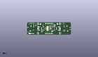
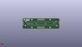
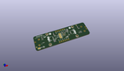

Contents
========

* [PROJ-ADAF-5295-STAN-01>Adafruit NeoSlider PCB](#proj-adaf-5295-stan-01adafruit-neoslider-pcb)
	* [Images](#images)
	* [Interactive BOM](#interactive-bom)
	* [OOMP Parts](#oomp-parts)
	* [Tags](#tags)
  
![][im]
# PROJ-ADAF-5295-STAN-01>Adafruit NeoSlider PCB

- ID: PROJ-ADAF-5295-STAN-01
- Hex ID: PRA5295
- Name: Adafruit NeoSlider PCB
- Description: 

## Images
  
  

|eagleImage|kicadPcb3dFront|kicadPcb3dBack|kicadPcb3d|
| :---: | :---: | :---: | :---: |
|||||

## Interactive BOM

- Interactive BOM page: [ibom.html](kicad/bom/ibom.html)

## OOMP Parts
  

|OOMP Parts|
| :---: |
|CAPC-0603-X-UNMATCHED-01, C1, -26.987499999999997, 5.270499999999999, 90,C1, 1uF, 0603-NO, microbuilder, (-1.0625, 0.2075), R90|
|CAPC-0805-X-UNMATCHED-01, C2, 6.095999999999999, -4.571999999999999, 180,C2, 10uF, 0805-NO, microbuilder, (0.24, -0.18), R180|
|CAPC-0805-X-UNMATCHED-01, C3, 10.350499999999998, 5.588, 90,C3, 10uF, 0805-NO, microbuilder, (0.4075, 0.22), R90|
|<table><tr><td></td><td> C4</td><td>[CAPC-0603-X-NF100-V50 SMD (0603) 100 nF Capacitor (Ceramic) 50v](https://github.com/oomlout/oomlout_OOMP_parts/tree/main/CAPC-0603-X-NF100-V50/)</td><td>[C6N100](https://github.com/oomlout/oomlout_OOMP_parts/tree/main/CAPC-0603-X-NF100-V50/)</td></tr></table>|
|CAPC-0603-X-UNMATCHED-01, C5, 25.9715, 5.1435, 90,C5, 1uF, 0603-NO, microbuilder, (1.0225, 0.2025), R90|
|CAPC-0603-X-UNMATCHED-01, C6, -10.350499999999998, 5.270499999999999, 90,C6, 1uF, 0603-NO, microbuilder, (-0.4075, 0.2075), R90|
|CAPC-0603-X-UNMATCHED-01, C7, 8.509, 5.588, 90,C7, 1uF, 0603-NO, microbuilder, (0.335, 0.22), R90|
|UNMATCHED-UNMATCHED-X-UNMATCHED-01, CONN3, -15.239999999999998, 0.0, 270,CONN3, STEMMA_I2C_QT, JST_SH4, microbuilder, (-0.6, 0), R270|
|UNMATCHED-UNMATCHED-X-UNMATCHED-01, CONN4, 15.239999999999998, 0.0, 90,CONN4, STEMMA_I2C_QT, JST_SH4, microbuilder, (0.6, 0), R90|
|UNMATCHED-UNMATCHED-X-UNMATCHED-01, D2, -27.368499999999997, -8.5725, 270,D2, GREEN, CHIPLED_0603_NOOUTLINE, microbuilder, (-1.0775, -0.3375), R270|
|UNMATCHED-UNMATCHED-X-UNMATCHED-01, IC1, 2.921, 0.38099999999999995, 270,IC1, ATTINY8X7-MU, QFN24_4MM, adafruit_micro, (0.115, 0.015), R270|
|<table><tr><td></td><td> JP1</td><td>[HEAD-I01-X-PI06-01 2.54 mm 6 Pin Header](https://github.com/oomlout/oomlout_OOMP_parts/tree/main/HEAD-I01-X-PI06-01/)</td><td>[H06](https://github.com/oomlout/oomlout_OOMP_parts/tree/main/HEAD-I01-X-PI06-01/)</td></tr></table>|
|<table><tr><td></td><td> JP5</td><td>[HEAD-I01-X-PI06-01 2.54 mm 6 Pin Header](https://github.com/oomlout/oomlout_OOMP_parts/tree/main/HEAD-I01-X-PI06-01/)</td><td>[H06](https://github.com/oomlout/oomlout_OOMP_parts/tree/main/HEAD-I01-X-PI06-01/)</td></tr></table>|
|UNMATCHED-UNMATCHED-X-UNMATCHED-01, LED1, 26.669999999999998, 0.0, M90,LED1, WS2812B_SK6812E, NEO3535_REVERSE, microbuilder, (1.05, 0), MR90|
|UNMATCHED-UNMATCHED-X-UNMATCHED-01, LED2, 9.524999999999999, 0.0, M90,LED2, WS2812B_SK6812E, NEO3535_REVERSE, microbuilder, (0.375, 0), MR90|
|UNMATCHED-UNMATCHED-X-UNMATCHED-01, LED3, -9.524999999999999, 0.0, M90,LED3, WS2812B_SK6812E, NEO3535_REVERSE, microbuilder, (-0.375, 0), MR90|
|UNMATCHED-UNMATCHED-X-UNMATCHED-01, LED4, -26.669999999999998, 0.0, M90,LED4, WS2812B_SK6812E, NEO3535_REVERSE, microbuilder, (-1.05, 0), MR90|
|UNMATCHED-UNMATCHED-X-UNMATCHED-01, POT1, 0.0, 0.0, M0,POT1, SLIDE_POT_75MM, SLIDE_POT_75MM, adafruit_electromech, (0, 0), MR0|
|<table><tr><td></td><td> R1</td><td>[RESE-0603-X-O103-01 SMD (0603) 10k Ohm Resistor](https://github.com/oomlout/oomlout_OOMP_parts/tree/main/RESE-0603-X-O103-01/)</td><td>[R6103](https://github.com/oomlout/oomlout_OOMP_parts/tree/main/RESE-0603-X-O103-01/)</td></tr></table>|
|<table><tr><td></td><td> R2</td><td>[RESE-0603-X-O103-01 SMD (0603) 10k Ohm Resistor](https://github.com/oomlout/oomlout_OOMP_parts/tree/main/RESE-0603-X-O103-01/)</td><td>[R6103](https://github.com/oomlout/oomlout_OOMP_parts/tree/main/RESE-0603-X-O103-01/)</td></tr></table>|
|<table><tr><td></td><td> R3</td><td>[RESE-0603-X-O103-01 SMD (0603) 10k Ohm Resistor](https://github.com/oomlout/oomlout_OOMP_parts/tree/main/RESE-0603-X-O103-01/)</td><td>[R6103](https://github.com/oomlout/oomlout_OOMP_parts/tree/main/RESE-0603-X-O103-01/)</td></tr></table>|
|<table><tr><td></td><td> R4</td><td>[RESE-0603-X-O103-01 SMD (0603) 10k Ohm Resistor](https://github.com/oomlout/oomlout_OOMP_parts/tree/main/RESE-0603-X-O103-01/)</td><td>[R6103](https://github.com/oomlout/oomlout_OOMP_parts/tree/main/RESE-0603-X-O103-01/)</td></tr></table>|
|RESE-UNMATCHED-X-O103-01, R5, -5.842, 0.254, 90,R5, 10K, RESPACK_4X0603, microbuilder, (-0.23, 0.01), R90|
|<table><tr><td></td><td> R7</td><td>[RESE-0603-X-O103-01 SMD (0603) 10k Ohm Resistor](https://github.com/oomlout/oomlout_OOMP_parts/tree/main/RESE-0603-X-O103-01/)</td><td>[R6103](https://github.com/oomlout/oomlout_OOMP_parts/tree/main/RESE-0603-X-O103-01/)</td></tr></table>|

## Tags

- hexID: PRA5295
- oompType: PROJ
- oompSize: ADAF
- oompColor: 5295
- oompDesc: STAN
- oompIndex: 01
- oompName: Adafruit NeoSlider PCB
- sources: All source files from https://github.com/adafruit/Adafruit-NeoSlider-PCB (source licence details in srcLicense.md)
- linkBuyPage: http://www.adafruit.com/products/5295
- oompID: PROJ-ADAF-5295-STAN-01
- oompPart: CAPC-0603-X-UNMATCHED-01, C1, -26.987499999999997, 5.270499999999999, 90
- oompPart: CAPC-0805-X-UNMATCHED-01, C2, 6.095999999999999, -4.571999999999999, 180
- oompPart: CAPC-0805-X-UNMATCHED-01, C3, 10.350499999999998, 5.588, 90
- oompPart: CAPC-0603-X-NF100-V50, C4, 1.9685, 4.3180000000000005, 180
- oompPart: CAPC-0603-X-UNMATCHED-01, C5, 25.9715, 5.1435, 90
- oompPart: CAPC-0603-X-UNMATCHED-01, C6, -10.350499999999998, 5.270499999999999, 90
- oompPart: CAPC-0603-X-UNMATCHED-01, C7, 8.509, 5.588, 90
- oompPart: UNMATCHED-UNMATCHED-X-UNMATCHED-01, CONN3, -15.239999999999998, 0.0, 270
- oompPart: UNMATCHED-UNMATCHED-X-UNMATCHED-01, CONN4, 15.239999999999998, 0.0, 90
- oompPart: UNMATCHED-UNMATCHED-X-UNMATCHED-01, D2, -27.368499999999997, -8.5725, 270
- oompPart: SKIP-UNMATCHED-X-UNMATCHED-01, FID1, 25.526999999999997, 9.143999999999998, 0
- oompPart: SKIP-UNMATCHED-X-UNMATCHED-01, FID2, -36.512499999999996, -6.0325, 0
- oompPart: UNMATCHED-UNMATCHED-X-UNMATCHED-01, IC1, 2.921, 0.38099999999999995, 270
- oompPart: HEAD-I01-X-PI06-01, JP1, 0.0, 8.889999999999999, 180
- oompPart: HEAD-I01-X-PI06-01, JP5, 0.0, -8.889999999999999, M0
- oompPart: UNMATCHED-UNMATCHED-X-UNMATCHED-01, LED1, 26.669999999999998, 0.0, M90
- oompPart: UNMATCHED-UNMATCHED-X-UNMATCHED-01, LED2, 9.524999999999999, 0.0, M90
- oompPart: UNMATCHED-UNMATCHED-X-UNMATCHED-01, LED3, -9.524999999999999, 0.0, M90
- oompPart: UNMATCHED-UNMATCHED-X-UNMATCHED-01, LED4, -26.669999999999998, 0.0, M90
- oompPart: UNMATCHED-UNMATCHED-X-UNMATCHED-01, POT1, 0.0, 0.0, M0
- oompPart: RESE-0603-X-O103-01, R1, -30.4165, -8.509, 0
- oompPart: RESE-0603-X-O103-01, R2, 26.7335, -4.444999999999999, 180
- oompPart: RESE-0603-X-O103-01, R3, -12.827, -5.206999999999999, 90
- oompPart: RESE-0603-X-O103-01, R4, -11.176, -5.206999999999999, 90
- oompPart: RESE-UNMATCHED-X-O103-01, R5, -5.842, 0.254, 90
- oompPart: RESE-0603-X-O103-01, R7, 6.223, 3.8099999999999996, 0
- oompPart: SKIP-UNMATCHED-X-UNMATCHED-01, SJ1, -2.54, -2.921, 180
- oompPart: SKIP-UNMATCHED-X-UNMATCHED-01, SJ2, -2.54, 3.175, 180
- oompPart: SKIP-UNMATCHED-X-UNMATCHED-01, SJ3, -2.54, 1.1429999999999998, 180
- oompPart: SKIP-UNMATCHED-X-UNMATCHED-01, SJ4, -33.782, -8.509, 180
- oompPart: SKIP-UNMATCHED-X-UNMATCHED-01, SJ5, -2.6034999999999995, -0.889, 180
- oompPart: SKIP-UNMATCHED-X-UNMATCHED-01, U$3, 19.049999999999997, 8.254999999999999, 0
- oompPart: SKIP-UNMATCHED-X-UNMATCHED-01, U$17, -19.049999999999997, 8.254999999999999, 0
- oompPart: SKIP-UNMATCHED-X-UNMATCHED-01, U$19, 19.049999999999997, -8.254999999999999, 0
- oompPart: SKIP-UNMATCHED-X-UNMATCHED-01, U$21, -19.049999999999997, -8.254999999999999, 0
- rawPart: C1, 1uF, 0603-NO, microbuilder, (-1.0625, 0.2075), R90
- rawPart: C2, 10uF, 0805-NO, microbuilder, (0.24, -0.18), R180
- rawPart: C3, 10uF, 0805-NO, microbuilder, (0.4075, 0.22), R90
- rawPart: C4, 0.1uF, 0603-NO, microbuilder, (0.0775, 0.17), R180
- rawPart: C5, 1uF, 0603-NO, microbuilder, (1.0225, 0.2025), R90
- rawPart: C6, 1uF, 0603-NO, microbuilder, (-0.4075, 0.2075), R90
- rawPart: C7, 1uF, 0603-NO, microbuilder, (0.335, 0.22), R90
- rawPart: CONN3, STEMMA_I2C_QT, JST_SH4, microbuilder, (-0.6, 0), R270
- rawPart: CONN4, STEMMA_I2C_QT, JST_SH4, microbuilder, (0.6, 0), R90
- rawPart: D2, GREEN, CHIPLED_0603_NOOUTLINE, microbuilder, (-1.0775, -0.3375), R270
- rawPart: FID1, FIDUCIAL_1MM, FIDUCIAL_1MM, microbuilder, (1.005, 0.36), R0
- rawPart: FID2, FIDUCIAL_1MM, FIDUCIAL_1MM, microbuilder, (-1.4375, -0.2375), R0
- rawPart: IC1, ATTINY8X7-MU, QFN24_4MM, adafruit_micro, (0.115, 0.015), R270
- rawPart: JP1, 1X06_ROUND_70, microbuilder, (0, 0.35), R180
- rawPart: JP5, 1X06_ROUND_70, microbuilder, (0, -0.35), MR0
- rawPart: LED1, WS2812B_SK6812E, NEO3535_REVERSE, microbuilder, (1.05, 0), MR90
- rawPart: LED2, WS2812B_SK6812E, NEO3535_REVERSE, microbuilder, (0.375, 0), MR90
- rawPart: LED3, WS2812B_SK6812E, NEO3535_REVERSE, microbuilder, (-0.375, 0), MR90
- rawPart: LED4, WS2812B_SK6812E, NEO3535_REVERSE, microbuilder, (-1.05, 0), MR90
- rawPart: POT1, SLIDE_POT_75MM, SLIDE_POT_75MM, adafruit_electromech, (0, 0), MR0
- rawPart: R1, 10K, 0603-NO, microbuilder, (-1.1975, -0.335), R0
- rawPart: R2, 10K, 0603-NO, microbuilder, (1.0525, -0.175), R180
- rawPart: R3, 10K, 0603-NO, microbuilder, (-0.505, -0.205), R90
- rawPart: R4, 10K, 0603-NO, microbuilder, (-0.44, -0.205), R90
- rawPart: R5, 10K, RESPACK_4X0603, microbuilder, (-0.23, 0.01), R90
- rawPart: R7, 10K, 0603-NO, microbuilder, (0.245, 0.15), R0
- rawPart: SJ1, SOLDERJUMPER_CLOSEDWIRE, microbuilder, (-0.1, -0.115), R180
- rawPart: SJ2, SOLDERJUMPER_CLOSEDWIRE, microbuilder, (-0.1, 0.125), R180
- rawPart: SJ3, SOLDERJUMPER_CLOSEDWIRE, microbuilder, (-0.1, 0.045), R180
- rawPart: SJ4, SOLDERJUMPER_CLOSEDWIRE, microbuilder, (-1.33, -0.335), R180
- rawPart: SJ5, SOLDERJUMPER_CLOSEDWIRE, microbuilder, (-0.1025, -0.035), R180
- rawPart: U$3, MOUNTINGHOLE2.5, MOUNTINGHOLE_2.5_PLATED, adafruit_electromech, (0.75, 0.325), R0
- rawPart: U$17, MOUNTINGHOLE2.5, MOUNTINGHOLE_2.5_PLATED, adafruit_electromech, (-0.75, 0.325), R0
- rawPart: U$19, MOUNTINGHOLE2.5, MOUNTINGHOLE_2.5_PLATED, adafruit_electromech, (0.75, -0.325), R0
- rawPart: U$21, MOUNTINGHOLE2.5, MOUNTINGHOLE_2.5_PLATED, adafruit_electromech, (-0.75, -0.325), R0

[im]: kicadPcb3d_450.png
