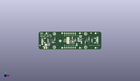
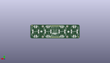
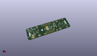

Contents
========

* [PROJ-ADAF-5296-STAN-01>Adafruit LED Arcade Button 1x4 PCB](#proj-adaf-5296-stan-01adafruit-led-arcade-button-1x4-pcb)
	* [Images](#images)
	* [Interactive BOM](#interactive-bom)
	* [OOMP Parts](#oomp-parts)
	* [Tags](#tags)
  
![][im]
# PROJ-ADAF-5296-STAN-01>Adafruit LED Arcade Button 1x4 PCB

- ID: PROJ-ADAF-5296-STAN-01
- Hex ID: PRA5296
- Name: Adafruit LED Arcade Button 1x4 PCB
- Description: 

## Images
  
  

|eagleImage|kicadPcb3dFront|kicadPcb3dBack|kicadPcb3d|
| :---: | :---: | :---: | :---: |
|||||

## Interactive BOM

- Interactive BOM page: [ibom.html](kicad/bom/ibom.html)

## OOMP Parts
  

|OOMP Parts|
| :---: |
|CAPE-0805-X-UNMATCHED-01, C2, 8.254999999999999, -5.334, 90,C2, 10uF, 0805-NO, microbuilder, (0.325, -0.21), R90|
|CAPE-0805-X-UNMATCHED-01, C3, 13.9065, -2.032, 270,C3, 10uF, 0805-NO, microbuilder, (0.5475, -0.08), R270|
|CAPE-0603-X-NF100-01, C4, 2.921, 3.1115, 90,C4, 0.1uF, 0603-NO, microbuilder, (0.115, 0.1225), R90|
|CAPE-0805-X-UNMATCHED-01, C8, 11.176, -0.7619999999999999, 180,C8, 10uF, 0805-NO, microbuilder, (0.44, -0.03), R180|
|CAPE-0805-X-UNMATCHED-01, C9, 10.033, 2.032, 270,C9, 10uF, 0805-NO, microbuilder, (0.395, 0.08), R270|
|CAPE-0805-X-UNMATCHED-01, C10, 12.827, 5.460999999999999, 180,C10, 1uF, 0805-NO, microbuilder, (0.505, 0.215), R180|
|UNMATCHED-UNMATCHED-X-UNMATCHED-01, CONN3, -29.209999999999997, 0.0, 270,CONN3, STEMMA_I2C_QT, JST_SH4, microbuilder, (-1.15, 0), R270|
|UNMATCHED-UNMATCHED-X-UNMATCHED-01, CONN4, 29.209999999999997, 0.0, 90,CONN4, STEMMA_I2C_QT, JST_SH4, microbuilder, (1.15, 0), R90|
|UNMATCHED-UNMATCHED-X-UNMATCHED-01, D2, -28.8925, -7.429499999999999, 270,D2, GREEN, CHIPLED_0603_NOOUTLINE, microbuilder, (-1.1375, -0.2925), R270|
|UNMATCHED-UNMATCHED-X-UNMATCHED-01, IC1, 12.827, 2.2859999999999996, 0,IC1, AP3602, SOT23-6, microbuilder, (0.505, 0.09), R0|
|UNMATCHED-UNMATCHED-X-UNMATCHED-01, IC2, 3.175, -1.5239999999999998, 270,IC2, ATTINY8X7-MU, QFN24_4MM, adafruit_micro, (0.125, -0.06), R270|
|UNMATCHED-UNMATCHED-X-UNMATCHED-01, JP1, 0.0, 8.889999999999999, 180,JP1, 1X06_ROUND_70, microbuilder, (0, 0.35), R180|
|UNMATCHED-UNMATCHED-X-UNMATCHED-01, JP5, 0.0, -8.889999999999999, M0,JP5, 1X06_ROUND_70, microbuilder, (0, -0.35), MR0|
|UNMATCHED-UNMATCHED-X-UNMATCHED-01, Q1, 20.700999999999997, 0.127, 90,Q1, BSS138, SOT363, microbuilder, (0.815, 0.005), R90|
|UNMATCHED-UNMATCHED-X-UNMATCHED-01, Q3, -20.700999999999997, -0.38099999999999995, 270,Q3, BSS138, SOT363, microbuilder, (-0.815, -0.015), R270|
|<table><tr><td></td><td> R1</td><td>[RESE-0603-X-O103-01 SMD (0603) 10k Ohm Resistor](https://github.com/oomlout/oomlout_OOMP_parts/tree/main/RESE-0603-X-O103-01/)</td><td>[R6103](https://github.com/oomlout/oomlout_OOMP_parts/tree/main/RESE-0603-X-O103-01/)</td></tr></table>|
|RESE-0603-X-UNMATCHED-01, R2, -20.574, -2.413, 0,R2, 100, 0603-NO, microbuilder, (-0.81, -0.095), R0|
|<table><tr><td></td><td> R3</td><td>[RESE-0603-X-O103-01 SMD (0603) 10k Ohm Resistor](https://github.com/oomlout/oomlout_OOMP_parts/tree/main/RESE-0603-X-O103-01/)</td><td>[R6103](https://github.com/oomlout/oomlout_OOMP_parts/tree/main/RESE-0603-X-O103-01/)</td></tr></table>|
|RESE-0603-X-UNMATCHED-01, R4, -18.415, 1.27, 90,R4, 100, 0603-NO, microbuilder, (-0.725, 0.05), R90|
|RESE-0603-X-UNMATCHED-01, R5, 18.541999999999998, -1.778, 270,R5, 100, 0603-NO, microbuilder, (0.73, -0.07), R270|
|RESE-0603-X-UNMATCHED-01, R6, 22.987, 2.032, 90,R6, 100, 0603-NO, microbuilder, (0.905, 0.08), R90|
|<table><tr><td></td><td> R7</td><td>[RESE-0603-X-O103-01 SMD (0603) 10k Ohm Resistor](https://github.com/oomlout/oomlout_OOMP_parts/tree/main/RESE-0603-X-O103-01/)</td><td>[R6103](https://github.com/oomlout/oomlout_OOMP_parts/tree/main/RESE-0603-X-O103-01/)</td></tr></table>|
|<table><tr><td></td><td> R8</td><td>[RESE-0603-X-O103-01 SMD (0603) 10k Ohm Resistor](https://github.com/oomlout/oomlout_OOMP_parts/tree/main/RESE-0603-X-O103-01/)</td><td>[R6103](https://github.com/oomlout/oomlout_OOMP_parts/tree/main/RESE-0603-X-O103-01/)</td></tr></table>|
|RESE-UNMATCHED-X-O103-01, R9, -5.968999999999999, 0.0, 90,R9, 10K, RESPACK_4X0603, microbuilder, (-0.235, 0), R90|
|UNMATCHED-UNMATCHED-X-UNMATCHED-01, SJ1, -2.54, -2.921, 180,SJ1, SOLDERJUMPER_CLOSEDWIRE, microbuilder, (-0.1, -0.115), R180|
|UNMATCHED-UNMATCHED-X-UNMATCHED-01, SJ2, -2.54, 3.175, 180,SJ2, SOLDERJUMPER_CLOSEDWIRE, microbuilder, (-0.1, 0.125), R180|
|UNMATCHED-UNMATCHED-X-UNMATCHED-01, SJ3, -2.54, 1.1429999999999998, 180,SJ3, SOLDERJUMPER_CLOSEDWIRE, microbuilder, (-0.1, 0.045), R180|
|UNMATCHED-UNMATCHED-X-UNMATCHED-01, SJ4, -29.209999999999997, -5.334, 0,SJ4, SOLDERJUMPER_CLOSEDWIRE, microbuilder, (-1.15, -0.21), R0|
|UNMATCHED-UNMATCHED-X-UNMATCHED-01, SJ5, -2.6034999999999995, -0.889, 180,SJ5, SOLDERJUMPER_CLOSEDWIRE, microbuilder, (-0.1025, -0.035), R180|
|UNMATCHED-UNMATCHED-X-UNMATCHED-01, TP1, -28.575, 8.889999999999999, 0,TP1, TESTPOINT_ROUND_1.5MM, microbuilder, (-1.125, 0.35), R0|
|UNMATCHED-UNMATCHED-X-UNMATCHED-01, TP2, -9.524999999999999, 9.017, 0,TP2, TESTPOINT_ROUND_1.5MM, microbuilder, (-0.375, 0.355), R0|
|UNMATCHED-UNMATCHED-X-UNMATCHED-01, TP3, 12.065, 8.889999999999999, 0,TP3, TESTPOINT_ROUND_1.5MM, microbuilder, (0.475, 0.35), R0|
|UNMATCHED-UNMATCHED-X-UNMATCHED-01, TP4, 31.115000000000002, 8.889999999999999, 0,TP4, TESTPOINT_ROUND_1.5MM, microbuilder, (1.225, 0.35), R0|
|UNMATCHED-UNMATCHED-X-UNMATCHED-01, TP5, -28.575, -9.143999999999998, 0,TP5, TESTPOINT_ROUND_1.5MM, microbuilder, (-1.125, -0.36), R0|
|UNMATCHED-UNMATCHED-X-UNMATCHED-01, TP6, -9.524999999999999, -9.017, 0,TP6, TESTPOINT_ROUND_1.5MM, microbuilder, (-0.375, -0.355), R0|
|UNMATCHED-UNMATCHED-X-UNMATCHED-01, TP7, 12.065, -9.017, 0,TP7, TESTPOINT_ROUND_1.5MM, microbuilder, (0.475, -0.355), R0|
|UNMATCHED-UNMATCHED-X-UNMATCHED-01, TP8, 31.115000000000002, -9.017, 0,TP8, TESTPOINT_ROUND_1.5MM, microbuilder, (1.225, -0.355), R0|
|UNMATCHED-UNMATCHED-X-UNMATCHED-01, TP9, -31.115000000000002, -9.143999999999998, 0,TP9, TESTPOINT_ROUND_1.5MM, microbuilder, (-1.225, -0.36), R0|
|UNMATCHED-UNMATCHED-X-UNMATCHED-01, X1, -29.845, 3.175, M0,X1, CON_JST_XH_2PIN-VERT, JST-XH-2-SV, adafruit_electromech, (-1.175, 0.125), MR0|
|UNMATCHED-UNMATCHED-X-UNMATCHED-01, X2, -29.845, -3.175, M180,X2, CON_JST_XH_2PIN-VERT, JST-XH-2-SV, adafruit_electromech, (-1.175, -0.125), MR180|
|UNMATCHED-UNMATCHED-X-UNMATCHED-01, X3, -10.795, 3.175, M0,X3, CON_JST_XH_2PIN-VERT, JST-XH-2-SV, adafruit_electromech, (-0.425, 0.125), MR0|
|UNMATCHED-UNMATCHED-X-UNMATCHED-01, X4, -10.795, -3.175, M180,X4, CON_JST_XH_2PIN-VERT, JST-XH-2-SV, adafruit_electromech, (-0.425, -0.125), MR180|
|UNMATCHED-UNMATCHED-X-UNMATCHED-01, X5, 10.795, 3.175, M0,X5, CON_JST_XH_2PIN-VERT, JST-XH-2-SV, adafruit_electromech, (0.425, 0.125), MR0|
|UNMATCHED-UNMATCHED-X-UNMATCHED-01, X6, 10.795, -3.175, M180,X6, CON_JST_XH_2PIN-VERT, JST-XH-2-SV, adafruit_electromech, (0.425, -0.125), MR180|
|UNMATCHED-UNMATCHED-X-UNMATCHED-01, X7, 29.845, 3.175, M0,X7, CON_JST_XH_2PIN-VERT, JST-XH-2-SV, adafruit_electromech, (1.175, 0.125), MR0|
|UNMATCHED-UNMATCHED-X-UNMATCHED-01, X8, 29.845, -3.175, M180,X8, CON_JST_XH_2PIN-VERT, JST-XH-2-SV, adafruit_electromech, (1.175, -0.125), MR180|

## Tags

- hexID: PRA5296
- oompType: PROJ
- oompSize: ADAF
- oompColor: 5296
- oompDesc: STAN
- oompIndex: 01
- oompName: Adafruit LED Arcade Button 1x4 PCB
- sources: All source files from https://github.com/adafruit/Adafruit-LED-Arcade-Button-1x4-PCB (source licence details in srcLicense.md)
- linkBuyPage: http://www.adafruit.com/products/5296
- oompPart: CAPE-0805-X-UNMATCHED-01, C2, 8.254999999999999, -5.334, 90
- oompPart: CAPE-0805-X-UNMATCHED-01, C3, 13.9065, -2.032, 270
- oompPart: CAPE-0603-X-NF100-01, C4, 2.921, 3.1115, 90
- oompPart: CAPE-0805-X-UNMATCHED-01, C8, 11.176, -0.7619999999999999, 180
- oompPart: CAPE-0805-X-UNMATCHED-01, C9, 10.033, 2.032, 270
- oompPart: CAPE-0805-X-UNMATCHED-01, C10, 12.827, 5.460999999999999, 180
- oompPart: UNMATCHED-UNMATCHED-X-UNMATCHED-01, CONN3, -29.209999999999997, 0.0, 270
- oompPart: UNMATCHED-UNMATCHED-X-UNMATCHED-01, CONN4, 29.209999999999997, 0.0, 90
- oompPart: UNMATCHED-UNMATCHED-X-UNMATCHED-01, D2, -28.8925, -7.429499999999999, 270
- oompPart: SKIP-UNMATCHED-X-UNMATCHED-01, FID1, 25.526999999999997, 9.143999999999998, 0
- oompPart: SKIP-UNMATCHED-X-UNMATCHED-01, FID2, -36.512499999999996, -6.0325, 0
- oompPart: SKIP-UNMATCHED-X-UNMATCHED-01, FID3, -36.068, -8.509, M0
- oompPart: SKIP-UNMATCHED-X-UNMATCHED-01, FID4, 35.559999999999995, 9.398, M0
- oompPart: UNMATCHED-UNMATCHED-X-UNMATCHED-01, IC1, 12.827, 2.2859999999999996, 0
- oompPart: UNMATCHED-UNMATCHED-X-UNMATCHED-01, IC2, 3.175, -1.5239999999999998, 270
- oompPart: UNMATCHED-UNMATCHED-X-UNMATCHED-01, JP1, 0.0, 8.889999999999999, 180
- oompPart: UNMATCHED-UNMATCHED-X-UNMATCHED-01, JP5, 0.0, -8.889999999999999, M0
- oompPart: UNMATCHED-UNMATCHED-X-UNMATCHED-01, Q1, 20.700999999999997, 0.127, 90
- oompPart: UNMATCHED-UNMATCHED-X-UNMATCHED-01, Q3, -20.700999999999997, -0.38099999999999995, 270
- oompPart: RESE-0603-X-O103-01, R1, -31.6865, -7.365999999999999, 0
- oompPart: RESE-0603-X-UNMATCHED-01, R2, -20.574, -2.413, 0
- oompPart: RESE-0603-X-O103-01, R3, -24.892, -4.953, 90
- oompPart: RESE-0603-X-UNMATCHED-01, R4, -18.415, 1.27, 90
- oompPart: RESE-0603-X-UNMATCHED-01, R5, 18.541999999999998, -1.778, 270
- oompPart: RESE-0603-X-UNMATCHED-01, R6, 22.987, 2.032, 90
- oompPart: RESE-0603-X-O103-01, R7, 6.604, 0.254, 90
- oompPart: RESE-0603-X-O103-01, R8, -26.416, -4.953, 90
- oompPart: RESE-UNMATCHED-X-O103-01, R9, -5.968999999999999, 0.0, 90
- oompPart: UNMATCHED-UNMATCHED-X-UNMATCHED-01, SJ1, -2.54, -2.921, 180
- oompPart: UNMATCHED-UNMATCHED-X-UNMATCHED-01, SJ2, -2.54, 3.175, 180
- oompPart: UNMATCHED-UNMATCHED-X-UNMATCHED-01, SJ3, -2.54, 1.1429999999999998, 180
- oompPart: UNMATCHED-UNMATCHED-X-UNMATCHED-01, SJ4, -29.209999999999997, -5.334, 0
- oompPart: UNMATCHED-UNMATCHED-X-UNMATCHED-01, SJ5, -2.6034999999999995, -0.889, 180
- oompPart: UNMATCHED-UNMATCHED-X-UNMATCHED-01, TP1, -28.575, 8.889999999999999, 0
- oompPart: UNMATCHED-UNMATCHED-X-UNMATCHED-01, TP2, -9.524999999999999, 9.017, 0
- oompPart: UNMATCHED-UNMATCHED-X-UNMATCHED-01, TP3, 12.065, 8.889999999999999, 0
- oompPart: UNMATCHED-UNMATCHED-X-UNMATCHED-01, TP4, 31.115000000000002, 8.889999999999999, 0
- oompPart: UNMATCHED-UNMATCHED-X-UNMATCHED-01, TP5, -28.575, -9.143999999999998, 0
- oompPart: UNMATCHED-UNMATCHED-X-UNMATCHED-01, TP6, -9.524999999999999, -9.017, 0
- oompPart: UNMATCHED-UNMATCHED-X-UNMATCHED-01, TP7, 12.065, -9.017, 0
- oompPart: UNMATCHED-UNMATCHED-X-UNMATCHED-01, TP8, 31.115000000000002, -9.017, 0
- oompPart: UNMATCHED-UNMATCHED-X-UNMATCHED-01, TP9, -31.115000000000002, -9.143999999999998, 0
- oompPart: SKIP-UNMATCHED-X-UNMATCHED-01, U$3, 19.049999999999997, 8.254999999999999, 0
- oompPart: SKIP-UNMATCHED-X-UNMATCHED-01, U$17, -19.049999999999997, 8.254999999999999, 0
- oompPart: SKIP-UNMATCHED-X-UNMATCHED-01, U$19, 19.049999999999997, -8.254999999999999, 0
- oompPart: SKIP-UNMATCHED-X-UNMATCHED-01, U$21, -19.049999999999997, -8.254999999999999, 0
- oompPart: UNMATCHED-UNMATCHED-X-UNMATCHED-01, X1, -29.845, 3.175, M0
- oompPart: UNMATCHED-UNMATCHED-X-UNMATCHED-01, X2, -29.845, -3.175, M180
- oompPart: UNMATCHED-UNMATCHED-X-UNMATCHED-01, X3, -10.795, 3.175, M0
- oompPart: UNMATCHED-UNMATCHED-X-UNMATCHED-01, X4, -10.795, -3.175, M180
- oompPart: UNMATCHED-UNMATCHED-X-UNMATCHED-01, X5, 10.795, 3.175, M0
- oompPart: UNMATCHED-UNMATCHED-X-UNMATCHED-01, X6, 10.795, -3.175, M180
- oompPart: UNMATCHED-UNMATCHED-X-UNMATCHED-01, X7, 29.845, 3.175, M0
- oompPart: UNMATCHED-UNMATCHED-X-UNMATCHED-01, X8, 29.845, -3.175, M180
- rawPart: C2, 10uF, 0805-NO, microbuilder, (0.325, -0.21), R90
- rawPart: C3, 10uF, 0805-NO, microbuilder, (0.5475, -0.08), R270
- rawPart: C4, 0.1uF, 0603-NO, microbuilder, (0.115, 0.1225), R90
- rawPart: C8, 10uF, 0805-NO, microbuilder, (0.44, -0.03), R180
- rawPart: C9, 10uF, 0805-NO, microbuilder, (0.395, 0.08), R270
- rawPart: C10, 1uF, 0805-NO, microbuilder, (0.505, 0.215), R180
- rawPart: CONN3, STEMMA_I2C_QT, JST_SH4, microbuilder, (-1.15, 0), R270
- rawPart: CONN4, STEMMA_I2C_QT, JST_SH4, microbuilder, (1.15, 0), R90
- rawPart: D2, GREEN, CHIPLED_0603_NOOUTLINE, microbuilder, (-1.1375, -0.2925), R270
- rawPart: FID1, FIDUCIAL_1MM, FIDUCIAL_1MM, microbuilder, (1.005, 0.36), R0
- rawPart: FID2, FIDUCIAL_1MM, FIDUCIAL_1MM, microbuilder, (-1.4375, -0.2375), R0
- rawPart: FID3, FIDUCIAL_1MM, FIDUCIAL_1MM, microbuilder, (-1.42, -0.335), MR0
- rawPart: FID4, FIDUCIAL_1MM, FIDUCIAL_1MM, microbuilder, (1.4, 0.37), MR0
- rawPart: IC1, AP3602, SOT23-6, microbuilder, (0.505, 0.09), R0
- rawPart: IC2, ATTINY8X7-MU, QFN24_4MM, adafruit_micro, (0.125, -0.06), R270
- rawPart: JP1, 1X06_ROUND_70, microbuilder, (0, 0.35), R180
- rawPart: JP5, 1X06_ROUND_70, microbuilder, (0, -0.35), MR0
- rawPart: Q1, BSS138, SOT363, microbuilder, (0.815, 0.005), R90
- rawPart: Q3, BSS138, SOT363, microbuilder, (-0.815, -0.015), R270
- rawPart: R1, 10K, 0603-NO, microbuilder, (-1.2475, -0.29), R0
- rawPart: R2, 100, 0603-NO, microbuilder, (-0.81, -0.095), R0
- rawPart: R3, 10K, 0603-NO, microbuilder, (-0.98, -0.195), R90
- rawPart: R4, 100, 0603-NO, microbuilder, (-0.725, 0.05), R90
- rawPart: R5, 100, 0603-NO, microbuilder, (0.73, -0.07), R270
- rawPart: R6, 100, 0603-NO, microbuilder, (0.905, 0.08), R90
- rawPart: R7, 10K, 0603-NO, microbuilder, (0.26, 0.01), R90
- rawPart: R8, 10K, 0603-NO, microbuilder, (-1.04, -0.195), R90
- rawPart: R9, 10K, RESPACK_4X0603, microbuilder, (-0.235, 0), R90
- rawPart: SJ1, SOLDERJUMPER_CLOSEDWIRE, microbuilder, (-0.1, -0.115), R180
- rawPart: SJ2, SOLDERJUMPER_CLOSEDWIRE, microbuilder, (-0.1, 0.125), R180
- rawPart: SJ3, SOLDERJUMPER_CLOSEDWIRE, microbuilder, (-0.1, 0.045), R180
- rawPart: SJ4, SOLDERJUMPER_CLOSEDWIRE, microbuilder, (-1.15, -0.21), R0
- rawPart: SJ5, SOLDERJUMPER_CLOSEDWIRE, microbuilder, (-0.1025, -0.035), R180
- rawPart: TP1, TESTPOINT_ROUND_1.5MM, microbuilder, (-1.125, 0.35), R0
- rawPart: TP2, TESTPOINT_ROUND_1.5MM, microbuilder, (-0.375, 0.355), R0
- rawPart: TP3, TESTPOINT_ROUND_1.5MM, microbuilder, (0.475, 0.35), R0
- rawPart: TP4, TESTPOINT_ROUND_1.5MM, microbuilder, (1.225, 0.35), R0
- rawPart: TP5, TESTPOINT_ROUND_1.5MM, microbuilder, (-1.125, -0.36), R0
- rawPart: TP6, TESTPOINT_ROUND_1.5MM, microbuilder, (-0.375, -0.355), R0
- rawPart: TP7, TESTPOINT_ROUND_1.5MM, microbuilder, (0.475, -0.355), R0
- rawPart: TP8, TESTPOINT_ROUND_1.5MM, microbuilder, (1.225, -0.355), R0
- rawPart: TP9, TESTPOINT_ROUND_1.5MM, microbuilder, (-1.225, -0.36), R0
- rawPart: U$3, MOUNTINGHOLE2.5, MOUNTINGHOLE_2.5_PLATED, adafruit_electromech, (0.75, 0.325), R0
- rawPart: U$17, MOUNTINGHOLE2.5, MOUNTINGHOLE_2.5_PLATED, adafruit_electromech, (-0.75, 0.325), R0
- rawPart: U$19, MOUNTINGHOLE2.5, MOUNTINGHOLE_2.5_PLATED, adafruit_electromech, (0.75, -0.325), R0
- rawPart: U$21, MOUNTINGHOLE2.5, MOUNTINGHOLE_2.5_PLATED, adafruit_electromech, (-0.75, -0.325), R0
- rawPart: X1, CON_JST_XH_2PIN-VERT, JST-XH-2-SV, adafruit_electromech, (-1.175, 0.125), MR0
- rawPart: X2, CON_JST_XH_2PIN-VERT, JST-XH-2-SV, adafruit_electromech, (-1.175, -0.125), MR180
- rawPart: X3, CON_JST_XH_2PIN-VERT, JST-XH-2-SV, adafruit_electromech, (-0.425, 0.125), MR0
- rawPart: X4, CON_JST_XH_2PIN-VERT, JST-XH-2-SV, adafruit_electromech, (-0.425, -0.125), MR180
- rawPart: X5, CON_JST_XH_2PIN-VERT, JST-XH-2-SV, adafruit_electromech, (0.425, 0.125), MR0
- rawPart: X6, CON_JST_XH_2PIN-VERT, JST-XH-2-SV, adafruit_electromech, (0.425, -0.125), MR180
- rawPart: X7, CON_JST_XH_2PIN-VERT, JST-XH-2-SV, adafruit_electromech, (1.175, 0.125), MR0
- rawPart: X8, CON_JST_XH_2PIN-VERT, JST-XH-2-SV, adafruit_electromech, (1.175, -0.125), MR180

[im]: kicadPcb3d_450.png
