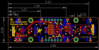

Contents
========

* [PROJ-ADAF-5296-STAN-01>Adafruit LED Arcade Button 1x4 PCB](#proj-adaf-5296-stan-01adafruit-led-arcade-button-1x4-pcb)
	* [Images](#images)
	* [Interactive BOM](#interactive-bom)
	* [Tags](#tags)
  
![][im]
# PROJ-ADAF-5296-STAN-01>Adafruit LED Arcade Button 1x4 PCB

- ID: PROJ-ADAF-5296-STAN-01
- Hex ID: PRA5296
- Name: Adafruit LED Arcade Button 1x4 PCB
- Description: 

## Images
  
  

|eagleImage|
| :---: |
||

## Interactive BOM

- Interactive BOM page: [ibom.html](kicad/bom/ibom.html)

## Tags

- hexID: PRA5296
- oompType: PROJ
- oompSize: ADAF
- oompColor: 5296
- oompDesc: STAN
- oompIndex: 01
- oompName: Adafruit LED Arcade Button 1x4 PCB
- sources: All source files from https://github.com/adafruit/Adafruit-LED-Arcade-Button-1x4-PCB (source licence details in srcLicense.md)
- linkBuyPage: http://www.adafruit.com/products/5296
- oompPart: CAPC-0805-X-UF10-V25, C2, 8.254999999999999, -5.334, 90
- oompPart: CAPC-0805-X-UF10-V25, C3, 13.9065, -2.032, 270
- oompPart: CAPC-0603-X-NF100-V50, C4, 2.921, 3.1115, 90
- oompPart: CAPC-0805-X-UF10-V25, C8, 11.176, -0.7619999999999999, 180
- oompPart: CAPC-0805-X-UF10-V25, C9, 10.033, 2.032, 270
- oompPart: CAPC-0805-X-UNMATCHED-01, C10, 12.827, 5.460999999999999, 180
- oompPart: UNMATCHED-UNMATCHED-X-UNMATCHED-01, CONN3, -29.209999999999997, 0.0, 270
- oompPart: UNMATCHED-UNMATCHED-X-UNMATCHED-01, CONN4, 29.209999999999997, 0.0, 90
- oompPart: UNMATCHED-UNMATCHED-X-UNMATCHED-01, D2, -28.8925, -7.429499999999999, 270
- oompPart: SKIP-UNMATCHED-X-UNMATCHED-01, FID1, 25.526999999999997, 9.143999999999998, 0
- oompPart: SKIP-UNMATCHED-X-UNMATCHED-01, FID2, -36.512499999999996, -6.0325, 0
- oompPart: SKIP-UNMATCHED-X-UNMATCHED-01, FID3, -36.068, -8.509, M0
- oompPart: SKIP-UNMATCHED-X-UNMATCHED-01, FID4, 35.559999999999995, 9.398, M0
- oompPart: UNMATCHED-UNMATCHED-X-UNMATCHED-01, IC1, 12.827, 2.2859999999999996, 0
- oompPart: UNMATCHED-UNMATCHED-X-UNMATCHED-01, IC2, 3.175, -1.5239999999999998, 270
- oompPart: UNMATCHED-UNMATCHED-X-UNMATCHED-01, JP1, 0.0, 8.889999999999999, 180
- oompPart: UNMATCHED-UNMATCHED-X-UNMATCHED-01, JP5, 0.0, -8.889999999999999, M0
- oompPart: UNMATCHED-UNMATCHED-X-UNMATCHED-01, Q1, 20.700999999999997, 0.127, 90
- oompPart: UNMATCHED-UNMATCHED-X-UNMATCHED-01, Q3, -20.700999999999997, -0.38099999999999995, 270
- oompPart: RESE-0603-X-O103-01, R1, -31.6865, -7.365999999999999, 0
- oompPart: RESE-0603-X-UNMATCHED-01, R2, -20.574, -2.413, 0
- oompPart: RESE-0603-X-O103-01, R3, -24.892, -4.953, 90
- oompPart: RESE-0603-X-UNMATCHED-01, R4, -18.415, 1.27, 90
- oompPart: RESE-0603-X-UNMATCHED-01, R5, 18.541999999999998, -1.778, 270
- oompPart: RESE-0603-X-UNMATCHED-01, R6, 22.987, 2.032, 90
- oompPart: RESE-0603-X-O103-01, R7, 6.604, 0.254, 90
- oompPart: RESE-0603-X-O103-01, R8, -26.416, -4.953, 90
- oompPart: RESE-UNMATCHED-X-O103-01, R9, -5.968999999999999, 0.0, 90
- oompPart: UNMATCHED-UNMATCHED-X-UNMATCHED-01, SJ1, -2.54, -2.921, 180
- oompPart: UNMATCHED-UNMATCHED-X-UNMATCHED-01, SJ2, -2.54, 3.175, 180
- oompPart: UNMATCHED-UNMATCHED-X-UNMATCHED-01, SJ3, -2.54, 1.1429999999999998, 180
- oompPart: UNMATCHED-UNMATCHED-X-UNMATCHED-01, SJ4, -29.209999999999997, -5.334, 0
- oompPart: UNMATCHED-UNMATCHED-X-UNMATCHED-01, SJ5, -2.6034999999999995, -0.889, 180
- oompPart: UNMATCHED-UNMATCHED-X-UNMATCHED-01, TP1, -28.575, 8.889999999999999, 0
- oompPart: UNMATCHED-UNMATCHED-X-UNMATCHED-01, TP2, -9.524999999999999, 9.017, 0
- oompPart: UNMATCHED-UNMATCHED-X-UNMATCHED-01, TP3, 12.065, 8.889999999999999, 0
- oompPart: UNMATCHED-UNMATCHED-X-UNMATCHED-01, TP4, 31.115000000000002, 8.889999999999999, 0
- oompPart: UNMATCHED-UNMATCHED-X-UNMATCHED-01, TP5, -28.575, -9.143999999999998, 0
- oompPart: UNMATCHED-UNMATCHED-X-UNMATCHED-01, TP6, -9.524999999999999, -9.017, 0
- oompPart: UNMATCHED-UNMATCHED-X-UNMATCHED-01, TP7, 12.065, -9.017, 0
- oompPart: UNMATCHED-UNMATCHED-X-UNMATCHED-01, TP8, 31.115000000000002, -9.017, 0
- oompPart: UNMATCHED-UNMATCHED-X-UNMATCHED-01, TP9, -31.115000000000002, -9.143999999999998, 0
- oompPart: SKIP-UNMATCHED-X-UNMATCHED-01, U$3, 19.049999999999997, 8.254999999999999, 0
- oompPart: SKIP-UNMATCHED-X-UNMATCHED-01, U$17, -19.049999999999997, 8.254999999999999, 0
- oompPart: SKIP-UNMATCHED-X-UNMATCHED-01, U$19, 19.049999999999997, -8.254999999999999, 0
- oompPart: SKIP-UNMATCHED-X-UNMATCHED-01, U$21, -19.049999999999997, -8.254999999999999, 0
- oompPart: UNMATCHED-UNMATCHED-X-UNMATCHED-01, X1, -29.845, 3.175, M0
- oompPart: UNMATCHED-UNMATCHED-X-UNMATCHED-01, X2, -29.845, -3.175, M180
- oompPart: UNMATCHED-UNMATCHED-X-UNMATCHED-01, X3, -10.795, 3.175, M0
- oompPart: UNMATCHED-UNMATCHED-X-UNMATCHED-01, X4, -10.795, -3.175, M180
- oompPart: UNMATCHED-UNMATCHED-X-UNMATCHED-01, X5, 10.795, 3.175, M0
- oompPart: UNMATCHED-UNMATCHED-X-UNMATCHED-01, X6, 10.795, -3.175, M180
- oompPart: UNMATCHED-UNMATCHED-X-UNMATCHED-01, X7, 29.845, 3.175, M0
- oompPart: UNMATCHED-UNMATCHED-X-UNMATCHED-01, X8, 29.845, -3.175, M180
- rawPart: 

[im]: eagleImage_450.png
