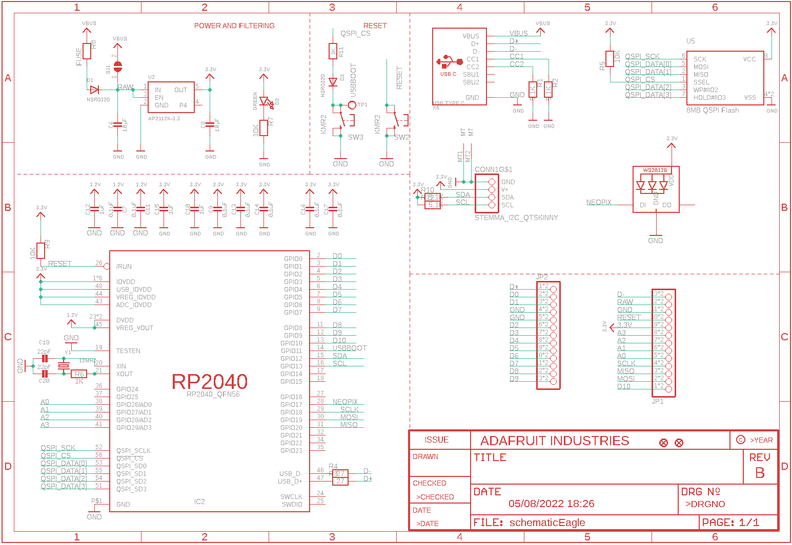
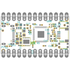
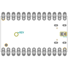
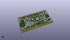
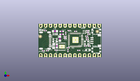
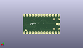
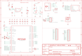

Contents
========

* [PRA5302 > Adafruit KB2040 PCB](#pra5302--adafruit-kb2040-pcb)
	* [Schematic](#schematic)
	* [PCB](#pcb)
	* [Interactive BOM](#interactive-bom)
	* [OOMP Parts](#oomp-parts)
	* [Images](#images)
	* [Tags](#tags)
  
![][im]
# PRA5302 > Adafruit KB2040 PCB

- ID: PROJ-ADAF-5302-STAN-01
- Hex ID: PRA5302
- Name: Adafruit
- Description: Adafruit
- Long Link: [http://oom.lt/PROJ-ADAF-5302-STAN-01](http://oom.lt/PROJ-ADAF-5302-STAN-01)
- Short Link: [http://oom.lt/PRA5302](http://oom.lt/PRA5302)

## Schematic
  

## PCB
  

## Interactive BOM

- Interactive BOM page: [ibom.html](https://htmlpreview.github.io/?https://github.com/oomlout/oomlout_OOMP_projects/blob/main/PROJ-ADAF-5302-STAN-01/kicad/bom/ibom.html)

## OOMP Parts
  

|OOMP Parts|
| :---: |
|[CAPC-0805-X-UF10-V10  SMD (0805) 10 uF Capacitor (Ceramic) 10v  C6, C8](https://github.com/oomlout/oomlout_OOMP_parts/tree/main/CAPC-0805-X-UF10-V10/)|
|[CAPC-0402-X-NF100-V10  SMD (0402) 100 nF Capacitor (Ceramic) 10v  C7, C9, C11, C13, C14, C16, C17](https://github.com/oomlout/oomlout_OOMP_parts/tree/main/CAPC-0402-X-NF100-V10/)|
|[CAPC-0603-X-UF1-V25  SMD (0603) 1 uF Capacitor (Ceramic) 25v  C10, C12, C15](https://github.com/oomlout/oomlout_OOMP_parts/tree/main/CAPC-0603-X-UF1-V25/)|
|[CAPC-0402-X-PF22-V50  SMD (0402) 22 pF Capacitor (Ceramic) 50v  C19, C20](https://github.com/oomlout/oomlout_OOMP_parts/tree/main/CAPC-0402-X-PF22-V50/)|
|HEAD-I01-X-UNMATCHED-01 CONN1|
|DIOD-S323-X-UNMATCHED-01 D1, D3|
|[LEDS-0603-G-STAN-01  SMD (0603) Green LED  D2](https://github.com/oomlout/oomlout_OOMP_parts/tree/main/LEDS-0603-G-STAN-01/)|
|UNMATCHED-UNMATCHED-X-UNMATCHED-01 IC2, U5, X6, Y1|
|HEAD-I01-X-PI13-01 JP1, JP2|
|LEDS-UNMATCHED-RGB-K2812-01 LED1|
|[RESE-0402-X-O472-01  SMD (0402) 4.7k Ohm Resistor  R1, R2, R10, R12](https://github.com/oomlout/oomlout_OOMP_parts/tree/main/RESE-0402-X-O472-01/)|
|RESE-0402-X-O270-01 R3, R4|
|[RESE-0402-X-O103-01  SMD (0402) 10k Ohm Resistor  R5, R7, R9](https://github.com/oomlout/oomlout_OOMP_parts/tree/main/RESE-0402-X-O103-01/)|
|[RESE-0402-X-O102-01  SMD (0402) 1k Ohm Resistor  R6, R11](https://github.com/oomlout/oomlout_OOMP_parts/tree/main/RESE-0402-X-O102-01/)|
|RESE-0805-X-UNMATCHED-01 R8|
|[BUTA-4628-X-STAN-01  SMD (4628) Pushbutton (Tactile)  SW2, SW3](https://github.com/oomlout/oomlout_OOMP_parts/tree/main/BUTA-4628-X-STAN-01/)|
|VREG-SO235-X-KAP2112K-V33D U2|

## Images
  
  

|bominteractivefront|bominteractiveback|kicadPcb3d|kicadPcb3dFront|kicadPcb3dBack|eagleImage|eagleSchemImage|
| :---: | :---: | :---: | :---: | :---: | :---: | :---: |
||||||||

## Tags

- hexID: PRA5302
- oompType: PROJ
- oompSize: ADAF
- oompColor: 5302
- oompDesc: STAN
- oompIndex: 01
- oompName: Adafruit KB2040 PCB
- sources: All source files from https://github.com/adafruit/Adafruit-KB2040-PCB (source licence details in srcLicense.md)
- linkBuyPage: http://www.adafruit.com/products/5302
- oompID: PROJ-ADAF-5302-STAN-01
- oompParts: C6,CAPC-0805-X-UF10-V10
- oompParts: C7,CAPC-0402-X-NF100-V10
- oompParts: C8,CAPC-0805-X-UF10-V10
- oompParts: C9,CAPC-0402-X-NF100-V10
- oompParts: C10,CAPC-0603-X-UF1-V25
- oompParts: C11,CAPC-0402-X-NF100-V10
- oompParts: C12,CAPC-0603-X-UF1-V25
- oompParts: C13,CAPC-0402-X-NF100-V10
- oompParts: C14,CAPC-0402-X-NF100-V10
- oompParts: C15,CAPC-0603-X-UF1-V25
- oompParts: C16,CAPC-0402-X-NF100-V10
- oompParts: C17,CAPC-0402-X-NF100-V10
- oompParts: C19,CAPC-0402-X-PF22-V50
- oompParts: C20,CAPC-0402-X-PF22-V50
- oompParts: CONN1,HEAD-I01-X-UNMATCHED-01
- oompParts: D1,DIOD-S323-X-UNMATCHED-01
- oompParts: D2,LEDS-0603-G-STAN-01
- oompParts: D3,DIOD-S323-X-UNMATCHED-01
- oompParts: IC2,UNMATCHED-UNMATCHED-X-UNMATCHED-01
- oompParts: JP1,HEAD-I01-X-PI13-01
- oompParts: JP2,HEAD-I01-X-PI13-01
- oompParts: LED1,LEDS-UNMATCHED-RGB-K2812-01
- oompParts: R1,RESE-0402-X-O472-01
- oompParts: R2,RESE-0402-X-O472-01
- oompParts: R3,RESE-0402-X-O270-01
- oompParts: R4,RESE-0402-X-O270-01
- oompParts: R5,RESE-0402-X-O103-01
- oompParts: R6,RESE-0402-X-O102-01
- oompParts: R7,RESE-0402-X-O103-01
- oompParts: R8,RESE-0805-X-UNMATCHED-01
- oompParts: R9,RESE-0402-X-O103-01
- oompParts: R10,RESE-0402-X-O472-01
- oompParts: R11,RESE-0402-X-O102-01
- oompParts: R12,RESE-0402-X-O472-01
- oompParts: SW2,BUTA-4628-X-STAN-01
- oompParts: SW3,BUTA-4628-X-STAN-01
- oompParts: U2,VREG-SO235-X-KAP2112K-V33D
- oompParts: U5,UNMATCHED-UNMATCHED-X-UNMATCHED-01
- oompParts: X6,UNMATCHED-UNMATCHED-X-UNMATCHED-01
- oompParts: Y1,UNMATCHED-UNMATCHED-X-UNMATCHED-01
- rawParts: C6,10µF,CAP_CERAMIC_0805MP,_0805MP,Ceramic Capacitors,,,
- rawParts: C7,0.1uF,CAP_CERAMIC_0402NO,_0402NO,Ceramic Capacitors,,,
- rawParts: C8,10µF,CAP_CERAMIC_0805MP,_0805MP,Ceramic Capacitors,,B,
- rawParts: C9,0.1uF,CAP_CERAMIC_0402NO,_0402NO,Ceramic Capacitors,,,
- rawParts: C10,1uF,CAP_CERAMIC_0603MP,_0603MP,Ceramic Capacitors,,,
- rawParts: C11,0.1uF,CAP_CERAMIC_0402NO,_0402NO,Ceramic Capacitors,,,
- rawParts: C12,1uF,CAP_CERAMIC_0603MP,_0603MP,Ceramic Capacitors,,,
- rawParts: C13,0.1uF,CAP_CERAMIC_0402NO,_0402NO,Ceramic Capacitors,,,
- rawParts: C14,0.1uF,CAP_CERAMIC_0402NO,_0402NO,Ceramic Capacitors,,,
- rawParts: C15,1uF,CAP_CERAMIC0603_NO,0603-NO,Ceramic Capacitors,,,
- rawParts: C16,0.1uF,CAP_CERAMIC_0402NO,_0402NO,Ceramic Capacitors,,,
- rawParts: C17,0.1uF,CAP_CERAMIC_0402NO,_0402NO,Ceramic Capacitors,,,
- rawParts: C19,22pF,CAP_CERAMIC_0402NO,_0402NO,Ceramic Capacitors,,,
- rawParts: C20,22pF,CAP_CERAMIC_0402NO,_0402NO,Ceramic Capacitors,,,
- rawParts: CONN1,STEMMA_I2C_QTSKINNY,STEMMA_I2C_QTSKINNY,JST_SH4_SKINNY,,,,
- rawParts: D1,NSR0320,DIODESOD-323F,SOD-323F,Diode,,,
- rawParts: D2,GREEN,LED0603_NOOUTLINE,CHIPLED_0603_NOOUTLINE,LED,,,
- rawParts: D3,NSR0320,DIODESOD-323F,SOD-323F,Diode,,,
- rawParts: IC2,RP2040_QFN56,RP2040_QFN56,QFN56_7MM_REDUCEDEPAD,,,,
- rawParts: JP1,,HEADER-1X13_CASTEL,1X13_CASTEL,,,,
- rawParts: JP2,,HEADER-1X13_CASTEL,1X13_CASTEL,,,,
- rawParts: LED1,WS2812B_SK6805_1515,WS2812B_SK6805_1515,SK6805_1515,,,,
- rawParts: R1,5.1K,RESISTOR_0402NO,_0402NO,Resistors,,,
- rawParts: R2,5.1K,RESISTOR_0402NO,_0402NO,Resistors,,,
- rawParts: R3,27,RESISTOR_0402NO,_0402NO,Resistors,,,
- rawParts: R4,27,RESISTOR_0402NO,_0402NO,Resistors,,,
- rawParts: R5,10K,RESISTOR_0402NO,_0402NO,Resistors,,,
- rawParts: R6,1K,RESISTOR_0402NO,_0402NO,Resistors,,,
- rawParts: R7,10K,RESISTOR_0402NO,_0402NO,Resistors,,,
- rawParts: R8,FUSE,RESISTOR0805_NOOUTLINE,0805-NO,Resistors,,,
- rawParts: R9,10K,RESISTOR_0402NO,_0402NO,Resistors,,,
- rawParts: R10,5.1K,RESISTOR_0402NO,_0402NO,Resistors,,,
- rawParts: R11,1K,RESISTOR_0402NO,_0402NO,Resistors,,,
- rawParts: R12,5.1K,RESISTOR_0402NO,_0402NO,Resistors,,,
- rawParts: SJ1,,SOLDERJUMPER,SOLDERJUMPER_ARROW_NOPASTE,SMD Solder JUMPER,EXCLUDE,,
- rawParts: SW2,KMR2,SWITCH_TACT_SMT4.6X2.8,BTN_KMR2_4.6X2.8,SMT Tact Switches,,,
- rawParts: SW3,KMR2,SWITCH_TACT_SMT4.6X2.8,BTN_KMR2_4.6X2.8,SMT Tact Switches,,,
- rawParts: TP1,,TESTPOINTROUND1.5MMNO,TESTPOINT_ROUND_1.5MM_NO,Test Point,,,
- rawParts: U$34,FIDUCIAL_1MM,FIDUCIAL_1MM,FIDUCIAL_1MM,Fiducial Alignment Points,EXCLUDE,,
- rawParts: U$35,FIDUCIAL_1MM,FIDUCIAL_1MM,FIDUCIAL_1MM,Fiducial Alignment Points,EXCLUDE,,
- rawParts: U2,AP2112K-3.3,VREG_SOT23-5,SOT23-5,SOT23-5 Fixed Voltage Regulators,,,
- rawParts: U5,8MB QSPI Flash,SPIFLASH_8PIN_4X4,USON8_4X4,SOIC8 SPI Flash,,,
- rawParts: X6,USB TYPE C,USB_C,USB_C_CUSB31-CFM2AX-01-X,USB Type-C USB 2.0 Connector,,,
- rawParts: Y1,12MHZ,CRYSTAL2.5X2.0,CRYSTAL_2.5X2,Crystals,,,

[im]: kicadPcb3d_450.png
