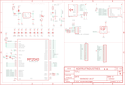

Contents
========

* [PRA5302 > Adafruit](#pra5302--adafruit)
	* [Schematic](#schematic)
	* [Interactive BOM](#interactive-bom)
	* [OOMP Parts](#oomp-parts)
	* [Images](#images)
	* [Tags](#tags)
  
![][im]
# PRA5302 > Adafruit

- ID: PROJ-ADAF-5302-STAN-01
- Hex ID: PRA5302
- Name: Adafruit
- Description: Adafruit
- Long Link: [http://oom.lt/PROJ-ADAF-5302-STAN-01](http://oom.lt/PROJ-ADAF-5302-STAN-01)
- Long Link: [http://oom.lt/PRA5302](http://oom.lt/PRA5302)

## Schematic
  
![][schem]
## Interactive BOM

- Interactive BOM page: [ibom.html](https://htmlpreview.github.io/?https://github.com/oomlout/oomlout_OOMP_projects/blob/main/PROJ-ADAF-5302-STAN-01/kicad/bom/ibom.html)

## OOMP Parts
  

|OOMP Parts|
| :---: |
|C6,UNMATCHED-UNMATCHED-UNMATCHED-UNMATCHED-UNMATCHED,C6,10µF,CAP_CERAMIC_0805MP,_0805MP,Ceramic Capacitors,,,|
|C7,UNMATCHED-UNMATCHED-UNMATCHED-UNMATCHED-UNMATCHED,C7,0.1uF,CAP_CERAMIC_0402NO,_0402NO,Ceramic Capacitors,,,|
|C8,UNMATCHED-UNMATCHED-UNMATCHED-UNMATCHED-UNMATCHED,C8,10µF,CAP_CERAMIC_0805MP,_0805MP,Ceramic Capacitors,,B,|
|C9,UNMATCHED-UNMATCHED-UNMATCHED-UNMATCHED-UNMATCHED,C9,0.1uF,CAP_CERAMIC_0402NO,_0402NO,Ceramic Capacitors,,,|
|C10,UNMATCHED-UNMATCHED-UNMATCHED-UNMATCHED-UNMATCHED,C10,1uF,CAP_CERAMIC_0603MP,_0603MP,Ceramic Capacitors,,,|
|C11,UNMATCHED-UNMATCHED-UNMATCHED-UNMATCHED-UNMATCHED,C11,0.1uF,CAP_CERAMIC_0402NO,_0402NO,Ceramic Capacitors,,,|
|C12,UNMATCHED-UNMATCHED-UNMATCHED-UNMATCHED-UNMATCHED,C12,1uF,CAP_CERAMIC_0603MP,_0603MP,Ceramic Capacitors,,,|
|C13,UNMATCHED-UNMATCHED-UNMATCHED-UNMATCHED-UNMATCHED,C13,0.1uF,CAP_CERAMIC_0402NO,_0402NO,Ceramic Capacitors,,,|
|C14,UNMATCHED-UNMATCHED-UNMATCHED-UNMATCHED-UNMATCHED,C14,0.1uF,CAP_CERAMIC_0402NO,_0402NO,Ceramic Capacitors,,,|
|C15,UNMATCHED-UNMATCHED-UNMATCHED-UNMATCHED-UNMATCHED,C15,1uF,CAP_CERAMIC0603_NO,0603-NO,Ceramic Capacitors,,,|
|C16,UNMATCHED-UNMATCHED-UNMATCHED-UNMATCHED-UNMATCHED,C16,0.1uF,CAP_CERAMIC_0402NO,_0402NO,Ceramic Capacitors,,,|
|C17,UNMATCHED-UNMATCHED-UNMATCHED-UNMATCHED-UNMATCHED,C17,0.1uF,CAP_CERAMIC_0402NO,_0402NO,Ceramic Capacitors,,,|
|C19,UNMATCHED-UNMATCHED-UNMATCHED-UNMATCHED-UNMATCHED,C19,22pF,CAP_CERAMIC_0402NO,_0402NO,Ceramic Capacitors,,,|
|C20,UNMATCHED-UNMATCHED-UNMATCHED-UNMATCHED-UNMATCHED,C20,22pF,CAP_CERAMIC_0402NO,_0402NO,Ceramic Capacitors,,,|
|CONN1,UNMATCHED-UNMATCHED-UNMATCHED-UNMATCHED-UNMATCHED,CONN1,STEMMA_I2C_QTSKINNY,STEMMA_I2C_QTSKINNY,JST_SH4_SKINNY,,,,|
|D1,UNMATCHED-UNMATCHED-UNMATCHED-UNMATCHED-UNMATCHED,D1,NSR0320,DIODESOD-323F,SOD-323F,Diode,,,|
|D2,UNMATCHED-UNMATCHED-UNMATCHED-UNMATCHED-UNMATCHED,D2,GREEN,LED0603_NOOUTLINE,CHIPLED_0603_NOOUTLINE,LED,,,|
|D3,UNMATCHED-UNMATCHED-UNMATCHED-UNMATCHED-UNMATCHED,D3,NSR0320,DIODESOD-323F,SOD-323F,Diode,,,|
|IC2,UNMATCHED-UNMATCHED-UNMATCHED-UNMATCHED-UNMATCHED,IC2,RP2040_QFN56,RP2040_QFN56,QFN56_7MM_REDUCEDEPAD,,,,|
|JP1,UNMATCHED-UNMATCHED-UNMATCHED-UNMATCHED-UNMATCHED,JP1,,HEADER-1X13_CASTEL,1X13_CASTEL,,,,|
|JP2,UNMATCHED-UNMATCHED-UNMATCHED-UNMATCHED-UNMATCHED,JP2,,HEADER-1X13_CASTEL,1X13_CASTEL,,,,|
|LED1,UNMATCHED-UNMATCHED-UNMATCHED-UNMATCHED-UNMATCHED,LED1,WS2812B_SK6805_1515,WS2812B_SK6805_1515,SK6805_1515,,,,|
|R1,UNMATCHED-UNMATCHED-UNMATCHED-UNMATCHED-UNMATCHED,R1,5.1K,RESISTOR_0402NO,_0402NO,Resistors,,,|
|R2,UNMATCHED-UNMATCHED-UNMATCHED-UNMATCHED-UNMATCHED,R2,5.1K,RESISTOR_0402NO,_0402NO,Resistors,,,|
|R3,UNMATCHED-UNMATCHED-UNMATCHED-UNMATCHED-UNMATCHED,R3,27,RESISTOR_0402NO,_0402NO,Resistors,,,|
|R4,UNMATCHED-UNMATCHED-UNMATCHED-UNMATCHED-UNMATCHED,R4,27,RESISTOR_0402NO,_0402NO,Resistors,,,|
|R5,UNMATCHED-UNMATCHED-UNMATCHED-UNMATCHED-UNMATCHED,R5,10K,RESISTOR_0402NO,_0402NO,Resistors,,,|
|R6,UNMATCHED-UNMATCHED-UNMATCHED-UNMATCHED-UNMATCHED,R6,1K,RESISTOR_0402NO,_0402NO,Resistors,,,|
|R7,UNMATCHED-UNMATCHED-UNMATCHED-UNMATCHED-UNMATCHED,R7,10K,RESISTOR_0402NO,_0402NO,Resistors,,,|
|R8,UNMATCHED-UNMATCHED-UNMATCHED-UNMATCHED-UNMATCHED,R8,FUSE,RESISTOR0805_NOOUTLINE,0805-NO,Resistors,,,|
|R9,UNMATCHED-UNMATCHED-UNMATCHED-UNMATCHED-UNMATCHED,R9,10K,RESISTOR_0402NO,_0402NO,Resistors,,,|
|R10,UNMATCHED-UNMATCHED-UNMATCHED-UNMATCHED-UNMATCHED,R10,5.1K,RESISTOR_0402NO,_0402NO,Resistors,,,|
|R11,UNMATCHED-UNMATCHED-UNMATCHED-UNMATCHED-UNMATCHED,R11,1K,RESISTOR_0402NO,_0402NO,Resistors,,,|
|R12,UNMATCHED-UNMATCHED-UNMATCHED-UNMATCHED-UNMATCHED,R12,5.1K,RESISTOR_0402NO,_0402NO,Resistors,,,|
|SW2,UNMATCHED-UNMATCHED-UNMATCHED-UNMATCHED-UNMATCHED,SJ1,,SOLDERJUMPER,SOLDERJUMPER_ARROW_NOPASTE,SMD Solder JUMPER,EXCLUDE,,|
|SW3,UNMATCHED-UNMATCHED-UNMATCHED-UNMATCHED-UNMATCHED,SW2,KMR2,SWITCH_TACT_SMT4.6X2.8,BTN_KMR2_4.6X2.8,SMT Tact Switches,,,|
|TP1,UNMATCHED-UNMATCHED-UNMATCHED-UNMATCHED-UNMATCHED,SW3,KMR2,SWITCH_TACT_SMT4.6X2.8,BTN_KMR2_4.6X2.8,SMT Tact Switches,,,|
|U2,UNMATCHED-UNMATCHED-UNMATCHED-UNMATCHED-UNMATCHED,TP1,,TESTPOINTROUND1.5MMNO,TESTPOINT_ROUND_1.5MM_NO,Test Point,,,|
|U5,UNMATCHED-UNMATCHED-UNMATCHED-UNMATCHED-UNMATCHED,U$34,FIDUCIAL_1MM,FIDUCIAL_1MM,FIDUCIAL_1MM,Fiducial Alignment Points,EXCLUDE,,|
|X6,UNMATCHED-UNMATCHED-UNMATCHED-UNMATCHED-UNMATCHED,U$35,FIDUCIAL_1MM,FIDUCIAL_1MM,FIDUCIAL_1MM,Fiducial Alignment Points,EXCLUDE,,|
|Y1,UNMATCHED-UNMATCHED-UNMATCHED-UNMATCHED-UNMATCHED,U2,AP2112K-3.3,VREG_SOT23-5,SOT23-5,SOT23-5 Fixed Voltage Regulators,,,|

## Images
  
  

|kicadPcb3d|kicadPcb3dFront|kicadPcb3dBack|eagleImage|eagleSchemImage|
| :---: | :---: | :---: | :---: | :---: |
||||||

## Tags

- hexID: PRA5302
- oompType: PROJ
- oompSize: ADAF
- oompColor: 5302
- oompDesc: STAN
- oompIndex: 01
- oompName: Adafruit KB2040 PCB
- sources: All source files from https://github.com/adafruit/Adafruit-KB2040-PCB (source licence details in srcLicense.md)
- linkBuyPage: http://www.adafruit.com/products/5302
- oompID: PROJ-ADAF-5302-STAN-01
- oompParts: C6,UNMATCHED-UNMATCHED-UNMATCHED-UNMATCHED-UNMATCHED
- oompParts: C7,UNMATCHED-UNMATCHED-UNMATCHED-UNMATCHED-UNMATCHED
- oompParts: C8,UNMATCHED-UNMATCHED-UNMATCHED-UNMATCHED-UNMATCHED
- oompParts: C9,UNMATCHED-UNMATCHED-UNMATCHED-UNMATCHED-UNMATCHED
- oompParts: C10,UNMATCHED-UNMATCHED-UNMATCHED-UNMATCHED-UNMATCHED
- oompParts: C11,UNMATCHED-UNMATCHED-UNMATCHED-UNMATCHED-UNMATCHED
- oompParts: C12,UNMATCHED-UNMATCHED-UNMATCHED-UNMATCHED-UNMATCHED
- oompParts: C13,UNMATCHED-UNMATCHED-UNMATCHED-UNMATCHED-UNMATCHED
- oompParts: C14,UNMATCHED-UNMATCHED-UNMATCHED-UNMATCHED-UNMATCHED
- oompParts: C15,UNMATCHED-UNMATCHED-UNMATCHED-UNMATCHED-UNMATCHED
- oompParts: C16,UNMATCHED-UNMATCHED-UNMATCHED-UNMATCHED-UNMATCHED
- oompParts: C17,UNMATCHED-UNMATCHED-UNMATCHED-UNMATCHED-UNMATCHED
- oompParts: C19,UNMATCHED-UNMATCHED-UNMATCHED-UNMATCHED-UNMATCHED
- oompParts: C20,UNMATCHED-UNMATCHED-UNMATCHED-UNMATCHED-UNMATCHED
- oompParts: CONN1,UNMATCHED-UNMATCHED-UNMATCHED-UNMATCHED-UNMATCHED
- oompParts: D1,UNMATCHED-UNMATCHED-UNMATCHED-UNMATCHED-UNMATCHED
- oompParts: D2,UNMATCHED-UNMATCHED-UNMATCHED-UNMATCHED-UNMATCHED
- oompParts: D3,UNMATCHED-UNMATCHED-UNMATCHED-UNMATCHED-UNMATCHED
- oompParts: IC2,UNMATCHED-UNMATCHED-UNMATCHED-UNMATCHED-UNMATCHED
- oompParts: JP1,UNMATCHED-UNMATCHED-UNMATCHED-UNMATCHED-UNMATCHED
- oompParts: JP2,UNMATCHED-UNMATCHED-UNMATCHED-UNMATCHED-UNMATCHED
- oompParts: LED1,UNMATCHED-UNMATCHED-UNMATCHED-UNMATCHED-UNMATCHED
- oompParts: R1,UNMATCHED-UNMATCHED-UNMATCHED-UNMATCHED-UNMATCHED
- oompParts: R2,UNMATCHED-UNMATCHED-UNMATCHED-UNMATCHED-UNMATCHED
- oompParts: R3,UNMATCHED-UNMATCHED-UNMATCHED-UNMATCHED-UNMATCHED
- oompParts: R4,UNMATCHED-UNMATCHED-UNMATCHED-UNMATCHED-UNMATCHED
- oompParts: R5,UNMATCHED-UNMATCHED-UNMATCHED-UNMATCHED-UNMATCHED
- oompParts: R6,UNMATCHED-UNMATCHED-UNMATCHED-UNMATCHED-UNMATCHED
- oompParts: R7,UNMATCHED-UNMATCHED-UNMATCHED-UNMATCHED-UNMATCHED
- oompParts: R8,UNMATCHED-UNMATCHED-UNMATCHED-UNMATCHED-UNMATCHED
- oompParts: R9,UNMATCHED-UNMATCHED-UNMATCHED-UNMATCHED-UNMATCHED
- oompParts: R10,UNMATCHED-UNMATCHED-UNMATCHED-UNMATCHED-UNMATCHED
- oompParts: R11,UNMATCHED-UNMATCHED-UNMATCHED-UNMATCHED-UNMATCHED
- oompParts: R12,UNMATCHED-UNMATCHED-UNMATCHED-UNMATCHED-UNMATCHED
- oompParts: SW2,UNMATCHED-UNMATCHED-UNMATCHED-UNMATCHED-UNMATCHED
- oompParts: SW3,UNMATCHED-UNMATCHED-UNMATCHED-UNMATCHED-UNMATCHED
- oompParts: TP1,UNMATCHED-UNMATCHED-UNMATCHED-UNMATCHED-UNMATCHED
- oompParts: U2,UNMATCHED-UNMATCHED-UNMATCHED-UNMATCHED-UNMATCHED
- oompParts: U5,UNMATCHED-UNMATCHED-UNMATCHED-UNMATCHED-UNMATCHED
- oompParts: X6,UNMATCHED-UNMATCHED-UNMATCHED-UNMATCHED-UNMATCHED
- oompParts: Y1,UNMATCHED-UNMATCHED-UNMATCHED-UNMATCHED-UNMATCHED
- rawParts: C6,10µF,CAP_CERAMIC_0805MP,_0805MP,Ceramic Capacitors,,,
- rawParts: C7,0.1uF,CAP_CERAMIC_0402NO,_0402NO,Ceramic Capacitors,,,
- rawParts: C8,10µF,CAP_CERAMIC_0805MP,_0805MP,Ceramic Capacitors,,B,
- rawParts: C9,0.1uF,CAP_CERAMIC_0402NO,_0402NO,Ceramic Capacitors,,,
- rawParts: C10,1uF,CAP_CERAMIC_0603MP,_0603MP,Ceramic Capacitors,,,
- rawParts: C11,0.1uF,CAP_CERAMIC_0402NO,_0402NO,Ceramic Capacitors,,,
- rawParts: C12,1uF,CAP_CERAMIC_0603MP,_0603MP,Ceramic Capacitors,,,
- rawParts: C13,0.1uF,CAP_CERAMIC_0402NO,_0402NO,Ceramic Capacitors,,,
- rawParts: C14,0.1uF,CAP_CERAMIC_0402NO,_0402NO,Ceramic Capacitors,,,
- rawParts: C15,1uF,CAP_CERAMIC0603_NO,0603-NO,Ceramic Capacitors,,,
- rawParts: C16,0.1uF,CAP_CERAMIC_0402NO,_0402NO,Ceramic Capacitors,,,
- rawParts: C17,0.1uF,CAP_CERAMIC_0402NO,_0402NO,Ceramic Capacitors,,,
- rawParts: C19,22pF,CAP_CERAMIC_0402NO,_0402NO,Ceramic Capacitors,,,
- rawParts: C20,22pF,CAP_CERAMIC_0402NO,_0402NO,Ceramic Capacitors,,,
- rawParts: CONN1,STEMMA_I2C_QTSKINNY,STEMMA_I2C_QTSKINNY,JST_SH4_SKINNY,,,,
- rawParts: D1,NSR0320,DIODESOD-323F,SOD-323F,Diode,,,
- rawParts: D2,GREEN,LED0603_NOOUTLINE,CHIPLED_0603_NOOUTLINE,LED,,,
- rawParts: D3,NSR0320,DIODESOD-323F,SOD-323F,Diode,,,
- rawParts: IC2,RP2040_QFN56,RP2040_QFN56,QFN56_7MM_REDUCEDEPAD,,,,
- rawParts: JP1,,HEADER-1X13_CASTEL,1X13_CASTEL,,,,
- rawParts: JP2,,HEADER-1X13_CASTEL,1X13_CASTEL,,,,
- rawParts: LED1,WS2812B_SK6805_1515,WS2812B_SK6805_1515,SK6805_1515,,,,
- rawParts: R1,5.1K,RESISTOR_0402NO,_0402NO,Resistors,,,
- rawParts: R2,5.1K,RESISTOR_0402NO,_0402NO,Resistors,,,
- rawParts: R3,27,RESISTOR_0402NO,_0402NO,Resistors,,,
- rawParts: R4,27,RESISTOR_0402NO,_0402NO,Resistors,,,
- rawParts: R5,10K,RESISTOR_0402NO,_0402NO,Resistors,,,
- rawParts: R6,1K,RESISTOR_0402NO,_0402NO,Resistors,,,
- rawParts: R7,10K,RESISTOR_0402NO,_0402NO,Resistors,,,
- rawParts: R8,FUSE,RESISTOR0805_NOOUTLINE,0805-NO,Resistors,,,
- rawParts: R9,10K,RESISTOR_0402NO,_0402NO,Resistors,,,
- rawParts: R10,5.1K,RESISTOR_0402NO,_0402NO,Resistors,,,
- rawParts: R11,1K,RESISTOR_0402NO,_0402NO,Resistors,,,
- rawParts: R12,5.1K,RESISTOR_0402NO,_0402NO,Resistors,,,
- rawParts: SJ1,,SOLDERJUMPER,SOLDERJUMPER_ARROW_NOPASTE,SMD Solder JUMPER,EXCLUDE,,
- rawParts: SW2,KMR2,SWITCH_TACT_SMT4.6X2.8,BTN_KMR2_4.6X2.8,SMT Tact Switches,,,
- rawParts: SW3,KMR2,SWITCH_TACT_SMT4.6X2.8,BTN_KMR2_4.6X2.8,SMT Tact Switches,,,
- rawParts: TP1,,TESTPOINTROUND1.5MMNO,TESTPOINT_ROUND_1.5MM_NO,Test Point,,,
- rawParts: U$34,FIDUCIAL_1MM,FIDUCIAL_1MM,FIDUCIAL_1MM,Fiducial Alignment Points,EXCLUDE,,
- rawParts: U$35,FIDUCIAL_1MM,FIDUCIAL_1MM,FIDUCIAL_1MM,Fiducial Alignment Points,EXCLUDE,,
- rawParts: U2,AP2112K-3.3,VREG_SOT23-5,SOT23-5,SOT23-5 Fixed Voltage Regulators,,,
- rawParts: U5,8MB QSPI Flash,SPIFLASH_8PIN_4X4,USON8_4X4,SOIC8 SPI Flash,,,
- rawParts: X6,USB TYPE C,USB_C,USB_C_CUSB31-CFM2AX-01-X,USB Type-C USB 2.0 Connector,,,
- rawParts: Y1,12MHZ,CRYSTAL2.5X2.0,CRYSTAL_2.5X2,Crystals,,,

[im]: kicadPcb3d_450.png
[schem]: eagleSchemImage.png
