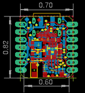

Contents
========

* [PROJ-ADAF-5325-STAN-01>Adafruit QT Py ESP32 S2 PCB](#proj-adaf-5325-stan-01adafruit-qt-py-esp32-s2-pcb)
	* [Images](#images)
	* [Interactive BOM](#interactive-bom)
	* [OOMP Parts](#oomp-parts)
	* [Tags](#tags)
  
![][im]
# PROJ-ADAF-5325-STAN-01>Adafruit QT Py ESP32 S2 PCB

- ID: PROJ-ADAF-5325-STAN-01
- Hex ID: PRA5325
- Name: Adafruit QT Py ESP32 S2 PCB
- Description: 

## Images
  
  

|eagleImage|
| :---: |
||

## Interactive BOM

- Interactive BOM page: [ibom.html](kicad/bom/ibom.html)

## OOMP Parts
  

|OOMP Parts|
| :---: |
|CAPE-0805-X-UNMATCHED-01, C1, 11.937999999999999, 12.738099999999998, 180,C1, 22uF, 0805-NO, microbuilder, (0.47, 0.5015), R180|
|CAPC-UNMATCHED-X-UNMATCHED-01, C2, 4.381499999999999, 9.8552, M0,C2, 1uF, _0402NO, microbuilder, (0.1725, 0.388), MR0|
|CAPC-UNMATCHED-X-UNMATCHED-01, C3, 14.2875, 2.0955, M0,C3, 1uF, _0402NO, microbuilder, (0.5625, 0.0825), MR0|
|CAPC-UNMATCHED-X-NF100-V50, C4, 4.3561000000000005, 8.915399999999998, M0,C4, 0.1uF, _0402NO, microbuilder, (0.1715, 0.351), MR0|
|CAPC-UNMATCHED-X-UNMATCHED-01, C5, 7.454899999999999, 14.249400000000001, M90,C5, 1uF, _0402NO, microbuilder, (0.2935, 0.561), MR90|
|CAPE-0805-X-UNMATCHED-01, C6, 13.423899999999998, 9.8044, 90,C6, 22uF, 0805-NO, microbuilder, (0.5285, 0.386), R90|
|ERROR, C7 TBD _0402NO, 0, 0, 0,C7, TBD, _0402NO, microbuilder, (0.164, 0.272), MR0|
|CAPE-0805-X-UNMATCHED-01, C8, 10.452099999999998, 6.9342, 180,C8, 22uF, 0805-NO, microbuilder, (0.4115, 0.273), R180|
|ERROR, C9 TBD _0402NO, 0, 0, 0,C9, TBD, _0402NO, microbuilder, (0.1645, 0.2275), MR0|
|CAPC-UNMATCHED-X-NF100-V50, C10, 8.4328, 14.224, M90,C10, 0.1uF, _0402NO, microbuilder, (0.332, 0.56), MR90|
|CAPC-UNMATCHED-X-NF100-V50, C11, 14.655799999999997, 15.112999999999998, M90,C11, 0.1uF, _0402NO, microbuilder, (0.577, 0.595), MR90|
|CAPC-UNMATCHED-X-NF100-V50, C12, 14.681199999999999, 10.921999999999999, M270,C12, 0.1uF, _0402NO, microbuilder, (0.578, 0.43), MR270|
|CAPC-UNMATCHED-X-UNMATCHED-01, C13, 14.655799999999997, 12.890499999999998, M90,C13, 1uF, _0402NO, microbuilder, (0.577, 0.5075), MR90|
|CAPC-UNMATCHED-X-NF100-V50, C14, 12.966699999999998, 2.2859999999999996, M270,C14, 0.1uF, _0402NO, microbuilder, (0.5105, 0.09), MR270|
|CAPC-UNMATCHED-X-UNMATCHED-01, C15, 8.839199999999998, 3.6194999999999995, M270,C15, 1uF, _0402NO, microbuilder, (0.348, 0.1425), MR270|
|CAPE-UNMATCHED-X-PF100-01, C16, 7.9502, 3.6194999999999995, M270,C16, 100pF, _0402NO, microbuilder, (0.313, 0.1425), MR270|
|CAPC-UNMATCHED-X-UNMATCHED-01, C17, 8.4836, 2.0827999999999998, M0,C17, 16pF, _0402NO, microbuilder, (0.334, 0.082), MR0|
|CAPC-UNMATCHED-X-UNMATCHED-01, C18, 12.077699999999998, 2.2605999999999997, M270,C18, 16pF, _0402NO, microbuilder, (0.4755, 0.089), MR270|
|CAPC-UNMATCHED-X-UNMATCHED-01, C19, 6.476999999999999, 14.033499999999998, M90,C19, 1uF, _0402NO, microbuilder, (0.255, 0.5525), MR90|
|CAPC-UNMATCHED-X-UNMATCHED-01, C20, 3.1115, 12.890499999999998, M90,C20, 1uF, _0402NO, microbuilder, (0.1225, 0.5075), MR90|
|UNMATCHED-UNMATCHED-X-UNMATCHED-01, CONN1, 11.074399999999999, 2.5781, 0,CONN1, STEMMA_I2C_QTSKINNY, JST_SH4_SKINNY, microbuilder, (0.436, 0.1015), R0|
|UNMATCHED-UNMATCHED-X-UNMATCHED-01, D1, 12.496799999999999, 16.776699999999998, M0,D1, NSR0320, SOD-323_MINI, microbuilder, (0.492, 0.6605), MR0|
|UNMATCHED-UNMATCHED-X-UNMATCHED-01, D2, 14.414499999999999, 18.923, M270,D2, NSR0320, SOD-323_MINI, microbuilder, (0.5675, 0.745), MR270|
|UNMATCHED-UNMATCHED-X-UNMATCHED-01, GND, 6.985, 18.923, M270,GND, TESTPOINT_RECT_1X3MM, microbuilder, (0.275, 0.745), MR270|
|UNMATCHED-UNMATCHED-X-UNMATCHED-01, JP1, 1.27, 10.350499999999998, 270,JP1, 1X07_CASTEL, microbuilder, (0.05, 0.4075), R270|
|UNMATCHED-UNMATCHED-X-UNMATCHED-01, JP3, 16.509999999999998, 10.350499999999998, 90,JP3, 1X07_CASTEL, microbuilder, (0.65, 0.4075), R90|
|UNMATCHED-UNMATCHED-X-UNMATCHED-01, L1, 4.495799999999999, 7.924799999999999, M180,L1, 2nH, _0402, microbuilder, (0.177, 0.312), MR180|
|ERROR, L2 0 ohm, 0, 0, 0,L2, 0, ohm, _0402, microbuilder, (0.224, 0.2465), MR90|
|UNMATCHED-UNMATCHED-X-UNMATCHED-01, LED1, 13.093699999999998, 6.9977, 0,LED1, WS2812B_SK6805_1515, SK6805_1515, microbuilder, (0.5155, 0.2755), R0|
|UNMATCHED-UNMATCHED-X-UNMATCHED-01, Q1, 6.095999999999999, 11.049, 180,Q1, BOOT0, BTN_KMR2_4.6X2.8, microbuilder, (0.24, 0.435), R180|
|UNMATCHED-UNMATCHED-X-UNMATCHED-01, Q2, 6.0706, 7.277099999999999, 180,Q2, reset, BTN_KMR2_4.6X2.8, microbuilder, (0.239, 0.2865), R180|
|RESE-UNMATCHED-X-O103-01, R1, 14.2875, 2.9844999999999997, M180,R1, 10K, _0402NO, microbuilder, (0.5625, 0.1175), MR180|
|RESE-UNMATCHED-X-O103-01, R2, 3.5052000000000003, 17.145, M270,R2, 10K, _0402NO, microbuilder, (0.138, 0.675), MR270|
|RESE-UNMATCHED-X-UNMATCHED-01, R3, 10.5664, 4.5847, M0,R3, 0, _0402NO, microbuilder, (0.416, 0.1805), MR0|
|RESE-UNMATCHED-X-UNMATCHED-01, R5, 7.302499999999999, 13.106399999999999, 0,R5, 5.1K, _0402NO, microbuilder, (0.2875, 0.516), R0|
|RESE-UNMATCHED-X-UNMATCHED-01, R6, 9.270999999999999, 12.9286, 0,R6, 5.1K, _0402NO, microbuilder, (0.365, 0.509), R0|
|RESE-UNMATCHED-X-UNMATCHED-01, R17, 4.0005, 12.890499999999998, M270,R17, 1Meg, _0402NO, microbuilder, (0.1575, 0.5075), MR270|
|UNMATCHED-UNMATCHED-X-UNMATCHED-01, SWC1, 15.557500000000001, 0.9524999999999999, M0,SWC1, TPB1,27, B1,27, testpad, (0.6125, 0.0375), MR0|
|UNMATCHED-UNMATCHED-X-UNMATCHED-01, SWC2, 2.2605999999999997, 19.697699999999998, M0,SWC2, TPB1,27, B1,27, testpad, (0.089, 0.7755), MR0|
|UNMATCHED-UNMATCHED-X-UNMATCHED-01, U1, 10.8585, 9.8679, 180,U1, AP2112K-3.3, SOT23-5, adafruit_power, (0.4275, 0.3885), R180|
|UNMATCHED-UNMATCHED-X-UNMATCHED-01, VBAT, 10.795, 18.923, M270,VBAT, TESTPOINT_RECT_1X3MM, microbuilder, (0.425, 0.745), MR270|
|UNMATCHED-UNMATCHED-X-UNMATCHED-01, X1, 4.7371, 2.6416, 270,X1, ANT_2450AT18B100, adafruit_wireless, (0.1865, 0.104), R270|
|ERROR, X6 USB TYPE, 0, 0, 0,X6, USB, TYPE, C, USB_C_CUSB31-CFM2AX-01-X, microbuilder, (0.35, 0.705), R180|
|UNMATCHED-UNMATCHED-X-UNMATCHED-01, Y1, 10.540999999999999, 2.7685999999999997, M270,Y1, 40MHz, CRYSTAL_2X1.6, microbuilder, (0.415, 0.109), MR270|

## Tags

- hexID: PRA5325
- oompType: PROJ
- oompSize: ADAF
- oompColor: 5325
- oompDesc: STAN
- oompIndex: 01
- oompName: Adafruit QT Py ESP32 S2 PCB
- sources: All source files from https://github.com/adafruit/Adafruit-QT-Py-ESP32-S2-PCB (source licence details in srcLicense.md)
- linkBuyPage: http://www.adafruit.com/products/5325
- oompPart: CAPE-0805-X-UNMATCHED-01, C1, 11.937999999999999, 12.738099999999998, 180
- oompPart: CAPC-UNMATCHED-X-UNMATCHED-01, C2, 4.381499999999999, 9.8552, M0
- oompPart: CAPC-UNMATCHED-X-UNMATCHED-01, C3, 14.2875, 2.0955, M0
- oompPart: CAPC-UNMATCHED-X-NF100-V50, C4, 4.3561000000000005, 8.915399999999998, M0
- oompPart: CAPC-UNMATCHED-X-UNMATCHED-01, C5, 7.454899999999999, 14.249400000000001, M90
- oompPart: CAPE-0805-X-UNMATCHED-01, C6, 13.423899999999998, 9.8044, 90
- oompPart: ERROR, C7 TBD _0402NO, 0, 0, 0
- oompPart: CAPE-0805-X-UNMATCHED-01, C8, 10.452099999999998, 6.9342, 180
- oompPart: ERROR, C9 TBD _0402NO, 0, 0, 0
- oompPart: CAPC-UNMATCHED-X-NF100-V50, C10, 8.4328, 14.224, M90
- oompPart: CAPC-UNMATCHED-X-NF100-V50, C11, 14.655799999999997, 15.112999999999998, M90
- oompPart: CAPC-UNMATCHED-X-NF100-V50, C12, 14.681199999999999, 10.921999999999999, M270
- oompPart: CAPC-UNMATCHED-X-UNMATCHED-01, C13, 14.655799999999997, 12.890499999999998, M90
- oompPart: CAPC-UNMATCHED-X-NF100-V50, C14, 12.966699999999998, 2.2859999999999996, M270
- oompPart: CAPC-UNMATCHED-X-UNMATCHED-01, C15, 8.839199999999998, 3.6194999999999995, M270
- oompPart: CAPE-UNMATCHED-X-PF100-01, C16, 7.9502, 3.6194999999999995, M270
- oompPart: CAPC-UNMATCHED-X-UNMATCHED-01, C17, 8.4836, 2.0827999999999998, M0
- oompPart: CAPC-UNMATCHED-X-UNMATCHED-01, C18, 12.077699999999998, 2.2605999999999997, M270
- oompPart: CAPC-UNMATCHED-X-UNMATCHED-01, C19, 6.476999999999999, 14.033499999999998, M90
- oompPart: CAPC-UNMATCHED-X-UNMATCHED-01, C20, 3.1115, 12.890499999999998, M90
- oompPart: UNMATCHED-UNMATCHED-X-UNMATCHED-01, CONN1, 11.074399999999999, 2.5781, 0
- oompPart: UNMATCHED-UNMATCHED-X-UNMATCHED-01, D1, 12.496799999999999, 16.776699999999998, M0
- oompPart: UNMATCHED-UNMATCHED-X-UNMATCHED-01, D2, 14.414499999999999, 18.923, M270
- oompPart: UNMATCHED-UNMATCHED-X-UNMATCHED-01, GND, 6.985, 18.923, M270
- oompPart: UNMATCHED-UNMATCHED-X-UNMATCHED-01, JP1, 1.27, 10.350499999999998, 270
- oompPart: UNMATCHED-UNMATCHED-X-UNMATCHED-01, JP3, 16.509999999999998, 10.350499999999998, 90
- oompPart: UNMATCHED-UNMATCHED-X-UNMATCHED-01, L1, 4.495799999999999, 7.924799999999999, M180
- oompPart: ERROR, L2 0 ohm, 0, 0, 0
- oompPart: UNMATCHED-UNMATCHED-X-UNMATCHED-01, LED1, 13.093699999999998, 6.9977, 0
- oompPart: UNMATCHED-UNMATCHED-X-UNMATCHED-01, Q1, 6.095999999999999, 11.049, 180
- oompPart: UNMATCHED-UNMATCHED-X-UNMATCHED-01, Q2, 6.0706, 7.277099999999999, 180
- oompPart: RESE-UNMATCHED-X-O103-01, R1, 14.2875, 2.9844999999999997, M180
- oompPart: RESE-UNMATCHED-X-O103-01, R2, 3.5052000000000003, 17.145, M270
- oompPart: RESE-UNMATCHED-X-UNMATCHED-01, R3, 10.5664, 4.5847, M0
- oompPart: RESE-UNMATCHED-X-UNMATCHED-01, R5, 7.302499999999999, 13.106399999999999, 0
- oompPart: RESE-UNMATCHED-X-UNMATCHED-01, R6, 9.270999999999999, 12.9286, 0
- oompPart: RESE-UNMATCHED-X-UNMATCHED-01, R17, 4.0005, 12.890499999999998, M270
- oompPart: UNMATCHED-UNMATCHED-X-UNMATCHED-01, SWC1, 15.557500000000001, 0.9524999999999999, M0
- oompPart: UNMATCHED-UNMATCHED-X-UNMATCHED-01, SWC2, 2.2605999999999997, 19.697699999999998, M0
- oompPart: SKIP-UNMATCHED-X-UNMATCHED-01, U$6, 6.1975999999999996, 19.4945, 0
- oompPart: SKIP-UNMATCHED-X-UNMATCHED-01, U$8, 10.8585, 0.7619999999999999, 0
- oompPart: SKIP-UNMATCHED-X-UNMATCHED-01, U$15, 10.287, 9.194799999999999, M180
- oompPart: UNMATCHED-UNMATCHED-X-UNMATCHED-01, U1, 10.8585, 9.8679, 180
- oompPart: UNMATCHED-UNMATCHED-X-UNMATCHED-01, VBAT, 10.795, 18.923, M270
- oompPart: UNMATCHED-UNMATCHED-X-UNMATCHED-01, X1, 4.7371, 2.6416, 270
- oompPart: ERROR, X6 USB TYPE, 0, 0, 0
- oompPart: UNMATCHED-UNMATCHED-X-UNMATCHED-01, Y1, 10.540999999999999, 2.7685999999999997, M270
- rawPart: C1, 22uF, 0805-NO, microbuilder, (0.47, 0.5015), R180
- rawPart: C2, 1uF, _0402NO, microbuilder, (0.1725, 0.388), MR0
- rawPart: C3, 1uF, _0402NO, microbuilder, (0.5625, 0.0825), MR0
- rawPart: C4, 0.1uF, _0402NO, microbuilder, (0.1715, 0.351), MR0
- rawPart: C5, 1uF, _0402NO, microbuilder, (0.2935, 0.561), MR90
- rawPart: C6, 22uF, 0805-NO, microbuilder, (0.5285, 0.386), R90
- rawPart: C7, TBD, _0402NO, microbuilder, (0.164, 0.272), MR0
- rawPart: C8, 22uF, 0805-NO, microbuilder, (0.4115, 0.273), R180
- rawPart: C9, TBD, _0402NO, microbuilder, (0.1645, 0.2275), MR0
- rawPart: C10, 0.1uF, _0402NO, microbuilder, (0.332, 0.56), MR90
- rawPart: C11, 0.1uF, _0402NO, microbuilder, (0.577, 0.595), MR90
- rawPart: C12, 0.1uF, _0402NO, microbuilder, (0.578, 0.43), MR270
- rawPart: C13, 1uF, _0402NO, microbuilder, (0.577, 0.5075), MR90
- rawPart: C14, 0.1uF, _0402NO, microbuilder, (0.5105, 0.09), MR270
- rawPart: C15, 1uF, _0402NO, microbuilder, (0.348, 0.1425), MR270
- rawPart: C16, 100pF, _0402NO, microbuilder, (0.313, 0.1425), MR270
- rawPart: C17, 16pF, _0402NO, microbuilder, (0.334, 0.082), MR0
- rawPart: C18, 16pF, _0402NO, microbuilder, (0.4755, 0.089), MR270
- rawPart: C19, 1uF, _0402NO, microbuilder, (0.255, 0.5525), MR90
- rawPart: C20, 1uF, _0402NO, microbuilder, (0.1225, 0.5075), MR90
- rawPart: CONN1, STEMMA_I2C_QTSKINNY, JST_SH4_SKINNY, microbuilder, (0.436, 0.1015), R0
- rawPart: D1, NSR0320, SOD-323_MINI, microbuilder, (0.492, 0.6605), MR0
- rawPart: D2, NSR0320, SOD-323_MINI, microbuilder, (0.5675, 0.745), MR270
- rawPart: GND, TESTPOINT_RECT_1X3MM, microbuilder, (0.275, 0.745), MR270
- rawPart: JP1, 1X07_CASTEL, microbuilder, (0.05, 0.4075), R270
- rawPart: JP3, 1X07_CASTEL, microbuilder, (0.65, 0.4075), R90
- rawPart: L1, 2nH, _0402, microbuilder, (0.177, 0.312), MR180
- rawPart: L2, 0, ohm, _0402, microbuilder, (0.224, 0.2465), MR90
- rawPart: LED1, WS2812B_SK6805_1515, SK6805_1515, microbuilder, (0.5155, 0.2755), R0
- rawPart: Q1, BOOT0, BTN_KMR2_4.6X2.8, microbuilder, (0.24, 0.435), R180
- rawPart: Q2, reset, BTN_KMR2_4.6X2.8, microbuilder, (0.239, 0.2865), R180
- rawPart: R1, 10K, _0402NO, microbuilder, (0.5625, 0.1175), MR180
- rawPart: R2, 10K, _0402NO, microbuilder, (0.138, 0.675), MR270
- rawPart: R3, 0, _0402NO, microbuilder, (0.416, 0.1805), MR0
- rawPart: R5, 5.1K, _0402NO, microbuilder, (0.2875, 0.516), R0
- rawPart: R6, 5.1K, _0402NO, microbuilder, (0.365, 0.509), R0
- rawPart: R17, 1Meg, _0402NO, microbuilder, (0.1575, 0.5075), MR270
- rawPart: SWC1, TPB1,27, B1,27, testpad, (0.6125, 0.0375), MR0
- rawPart: SWC2, TPB1,27, B1,27, testpad, (0.089, 0.7755), MR0
- rawPart: U$6, FIDUCIAL_1MM, FIDUCIAL_1MM, microbuilder, (0.244, 0.7675), R0
- rawPart: U$8, FIDUCIAL_1MM, FIDUCIAL_1MM, microbuilder, (0.4275, 0.03), R0
- rawPart: U$15, ESP32-S2QFN54, QFN40P700X700X90-57T400N, adafruit_wireless, (0.405, 0.362), MR180
- rawPart: U1, AP2112K-3.3, SOT23-5, adafruit_power, (0.4275, 0.3885), R180
- rawPart: VBAT, TESTPOINT_RECT_1X3MM, microbuilder, (0.425, 0.745), MR270
- rawPart: X1, ANT_2450AT18B100, adafruit_wireless, (0.1865, 0.104), R270
- rawPart: X6, USB, TYPE, C, USB_C_CUSB31-CFM2AX-01-X, microbuilder, (0.35, 0.705), R180
- rawPart: Y1, 40MHz, CRYSTAL_2X1.6, microbuilder, (0.415, 0.109), MR270

[im]: eagleImage_450.png
