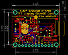
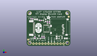
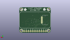
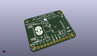

Contents
========

* [PROJ-ADAF-5393-STAN-01>Adafruit 1.47in 320x172 Round Rectangle TFT PCB](#proj-adaf-5393-stan-01adafruit-147in-320x172-round-rectangle-tft-pcb)
	* [Images](#images)
	* [Interactive BOM](#interactive-bom)
	* [OOMP Parts](#oomp-parts)
	* [Tags](#tags)
  
![][im]
# PROJ-ADAF-5393-STAN-01>Adafruit 1.47in 320x172 Round Rectangle TFT PCB

- ID: PROJ-ADAF-5393-STAN-01
- Hex ID: PRA5393
- Name: Adafruit 1.47in 320x172 Round Rectangle TFT PCB
- Description: 

## Images
  
  

|eagleImage|kicadPcb3dFront|kicadPcb3dBack|kicadPcb3d|
| :---: | :---: | :---: | :---: |
|||||

## Interactive BOM

- Interactive BOM page: [ibom.html](kicad/bom/ibom.html)

## OOMP Parts
  

|OOMP Parts|
| :---: |
|CAPC-0805-X-UNMATCHED-01, C1, 33.019999999999996, 6.35, 0,C1, 10uF, 0805-NO, microbuilder, (1.3, 0.25), R0|
|CAPC-0805-X-UNMATCHED-01, C2, 7.874, 22.605999999999998, 0,C2, 10uF, 0805-NO, microbuilder, (0.31, 0.89), R0|
|<table><tr><td></td><td> C3</td><td>[CAPC-0603-X-NF100-V50 SMD (0603) 100 nF Capacitor (Ceramic) 50v](https://github.com/oomlout/oomlout_OOMP_parts/tree/main/CAPC-0603-X-NF100-V50/)</td><td>[C6N100](https://github.com/oomlout/oomlout_OOMP_parts/tree/main/CAPC-0603-X-NF100-V50/)</td></tr></table>|
|CAPC-0805-X-UNMATCHED-01, C4, 25.273, 7.112, 90,C4, 10uF, 0805-NO, microbuilder, (0.995, 0.28), R90|
|<table><tr><td></td><td> C5</td><td>[CAPC-0603-X-NF100-V50 SMD (0603) 100 nF Capacitor (Ceramic) 50v](https://github.com/oomlout/oomlout_OOMP_parts/tree/main/CAPC-0603-X-NF100-V50/)</td><td>[C6N100](https://github.com/oomlout/oomlout_OOMP_parts/tree/main/CAPC-0603-X-NF100-V50/)</td></tr></table>|
|UNMATCHED-UNMATCHED-X-UNMATCHED-01, DISP1, 19.431, 15.239999999999998, M90,DISP1, DISP_LCD_GENERIC_SPI_1.47IN_172X320_12P_WRAPUNDER, TFT_1.47IN_172X320_12P, adafruit_display, (0.765, 0.6), MR90|
|UNMATCHED-UNMATCHED-X-UNMATCHED-01, IC2, 28.575, 7.112, 90,IC2, AP2112, SOT23-5L, adafruit, (1.125, 0.28), R90|
|UNMATCHED-UNMATCHED-X-UNMATCHED-01, IC4, 10.413999999999998, 7.365999999999999, 0,IC4, APX803-SAG, SOT23, adafruit, (0.41, 0.29), R0|
|HEAD-I01-X-PI11-01, JP1, 18.415, 1.9049999999999998, 180,JP1, 1X11_ROUND_76, microbuilder, (0.725, 0.075), R180|
|UNMATCHED-UNMATCHED-X-UNMATCHED-01, Q2, 20.066, 9.017, 90,Q2, MICROSD, MICROSD, adafruit, (0.79, 0.355), R90|
|UNMATCHED-UNMATCHED-X-UNMATCHED-01, Q3, 14.985999999999999, 21.717, 90,Q3, BSS138, SOT23-WIDE, microbuilder, (0.59, 0.855), R90|
|<table><tr><td></td><td> R1</td><td>[RESE-0603-X-O103-01 SMD (0603) 10k Ohm Resistor](https://github.com/oomlout/oomlout_OOMP_parts/tree/main/RESE-0603-X-O103-01/)</td><td>[R6103](https://github.com/oomlout/oomlout_OOMP_parts/tree/main/RESE-0603-X-O103-01/)</td></tr></table>|
|<table><tr><td></td><td> R2</td><td>[RESE-0603-X-O103-01 SMD (0603) 10k Ohm Resistor](https://github.com/oomlout/oomlout_OOMP_parts/tree/main/RESE-0603-X-O103-01/)</td><td>[R6103](https://github.com/oomlout/oomlout_OOMP_parts/tree/main/RESE-0603-X-O103-01/)</td></tr></table>|
|<table><tr><td></td><td> R3</td><td>[RESE-0603-X-O103-01 SMD (0603) 10k Ohm Resistor](https://github.com/oomlout/oomlout_OOMP_parts/tree/main/RESE-0603-X-O103-01/)</td><td>[R6103](https://github.com/oomlout/oomlout_OOMP_parts/tree/main/RESE-0603-X-O103-01/)</td></tr></table>|
|<table><tr><td></td><td> R4</td><td>[RESE-0603-X-O103-01 SMD (0603) 10k Ohm Resistor](https://github.com/oomlout/oomlout_OOMP_parts/tree/main/RESE-0603-X-O103-01/)</td><td>[R6103](https://github.com/oomlout/oomlout_OOMP_parts/tree/main/RESE-0603-X-O103-01/)</td></tr></table>|
|RESE-0603-X-UNMATCHED-01, R5, 11.557, 21.717, 180,R5, 10, 0603-NO, microbuilder, (0.455, 0.855), R180|
|UNMATCHED-UNMATCHED-X-UNMATCHED-01, U1, 16.637, 14.731999999999998, 180,U1, 74HC4050PWR, TSSOP16, microbuilder, (0.655, 0.58), R180|
|UNMATCHED-UNMATCHED-X-UNMATCHED-01, X1, 3.429, 15.239999999999998, 90,X1, EYE_SPI_DISPLAY_FLIP, EYE_SPI_DISPLAY_BOTCONTACT, adafruit_display, (0.135, 0.6), R90|

## Tags

- hexID: PRA5393
- oompType: PROJ
- oompSize: ADAF
- oompColor: 5393
- oompDesc: STAN
- oompIndex: 01
- oompName: Adafruit 1.47in 320x172 Round Rectangle TFT PCB
- sources: All source files from https://github.com/adafruit/Adafruit-1.47in-320x172-Round-Rectangle-TFT-PCB (source licence details in srcLicense.md)
- linkBuyPage: http://www.adafruit.com/products/5393
- oompPart: CAPC-0805-X-UNMATCHED-01, C1, 33.019999999999996, 6.35, 0
- oompPart: CAPC-0805-X-UNMATCHED-01, C2, 7.874, 22.605999999999998, 0
- oompPart: CAPC-0603-X-NF100-V50, C3, 19.177, 20.193, 90
- oompPart: CAPC-0805-X-UNMATCHED-01, C4, 25.273, 7.112, 90
- oompPart: CAPC-0603-X-NF100-V50, C5, 4.444999999999999, 23.114, 180
- oompPart: UNMATCHED-UNMATCHED-X-UNMATCHED-01, DISP1, 19.431, 15.239999999999998, M90
- oompPart: UNMATCHED-UNMATCHED-X-UNMATCHED-01, IC2, 28.575, 7.112, 90
- oompPart: UNMATCHED-UNMATCHED-X-UNMATCHED-01, IC4, 10.413999999999998, 7.365999999999999, 0
- oompPart: HEAD-I01-X-PI11-01, JP1, 18.415, 1.9049999999999998, 180
- oompPart: UNMATCHED-UNMATCHED-X-UNMATCHED-01, Q2, 20.066, 9.017, 90
- oompPart: UNMATCHED-UNMATCHED-X-UNMATCHED-01, Q3, 14.985999999999999, 21.717, 90
- oompPart: RESE-0603-X-O103-01, R1, 14.604999999999999, 7.365999999999999, 90
- oompPart: RESE-0603-X-O103-01, R2, 6.985, 7.112, 90
- oompPart: RESE-0603-X-O103-01, R3, 17.525999999999996, 20.193, 270
- oompPart: RESE-0603-X-O103-01, R4, 12.953999999999999, 7.365999999999999, 90
- oompPart: RESE-0603-X-UNMATCHED-01, R5, 11.557, 21.717, 180
- oompPart: SKIP-UNMATCHED-X-UNMATCHED-01, U$4, 35.433, 24.892, 270
- oompPart: SKIP-UNMATCHED-X-UNMATCHED-01, U$5, 1.27, 5.334, 0
- oompPart: SKIP-UNMATCHED-X-UNMATCHED-01, U$7, 34.29, 27.94, M270
- oompPart: SKIP-UNMATCHED-X-UNMATCHED-01, U$8, 2.54, 27.94, M270
- oompPart: SKIP-UNMATCHED-X-UNMATCHED-01, U$9, 34.29, 2.54, M270
- oompPart: SKIP-UNMATCHED-X-UNMATCHED-01, U$10, 2.54, 2.54, M270
- oompPart: UNMATCHED-UNMATCHED-X-UNMATCHED-01, U1, 16.637, 14.731999999999998, 180
- oompPart: UNMATCHED-UNMATCHED-X-UNMATCHED-01, X1, 3.429, 15.239999999999998, 90
- rawPart: C1, 10uF, 0805-NO, microbuilder, (1.3, 0.25), R0
- rawPart: C2, 10uF, 0805-NO, microbuilder, (0.31, 0.89), R0
- rawPart: C3, 0.1uF, 0603-NO, microbuilder, (0.755, 0.795), R90
- rawPart: C4, 10uF, 0805-NO, microbuilder, (0.995, 0.28), R90
- rawPart: C5, 0.1uF, 0603-NO, microbuilder, (0.175, 0.91), R180
- rawPart: DISP1, DISP_LCD_GENERIC_SPI_1.47IN_172X320_12P_WRAPUNDER, TFT_1.47IN_172X320_12P, adafruit_display, (0.765, 0.6), MR90
- rawPart: IC2, AP2112, SOT23-5L, adafruit, (1.125, 0.28), R90
- rawPart: IC4, APX803-SAG, SOT23, adafruit, (0.41, 0.29), R0
- rawPart: JP1, 1X11_ROUND_76, microbuilder, (0.725, 0.075), R180
- rawPart: Q2, MICROSD, MICROSD, adafruit, (0.79, 0.355), R90
- rawPart: Q3, BSS138, SOT23-WIDE, microbuilder, (0.59, 0.855), R90
- rawPart: R1, 10K, 0603-NO, microbuilder, (0.575, 0.29), R90
- rawPart: R2, 10K, 0603-NO, microbuilder, (0.275, 0.28), R90
- rawPart: R3, 10K, 0603-NO, microbuilder, (0.69, 0.795), R270
- rawPart: R4, 10K, 0603-NO, microbuilder, (0.51, 0.29), R90
- rawPart: R5, 10, 0603-NO, microbuilder, (0.455, 0.855), R180
- rawPart: U$4, FIDUCIAL_1MM, FIDUCIAL_1MM, microbuilder, (1.395, 0.98), R270
- rawPart: U$5, FIDUCIAL_1MM, FIDUCIAL_1MM, microbuilder, (0.05, 0.21), R0
- rawPart: U$7, MOUNTINGHOLE2.5, MOUNTINGHOLE_2.5_PLATED, microbuilder, (1.35, 1.1), MR270
- rawPart: U$8, MOUNTINGHOLE2.5, MOUNTINGHOLE_2.5_PLATED, microbuilder, (0.1, 1.1), MR270
- rawPart: U$9, MOUNTINGHOLE2.5, MOUNTINGHOLE_2.5_PLATED, microbuilder, (1.35, 0.1), MR270
- rawPart: U$10, MOUNTINGHOLE2.5, MOUNTINGHOLE_2.5_PLATED, microbuilder, (0.1, 0.1), MR270
- rawPart: U1, 74HC4050PWR, TSSOP16, microbuilder, (0.655, 0.58), R180
- rawPart: X1, EYE_SPI_DISPLAY_FLIP, EYE_SPI_DISPLAY_BOTCONTACT, adafruit_display, (0.135, 0.6), R90
- oompID: PROJ-ADAF-5393-STAN-01

[im]: kicadPcb3d_450.png
