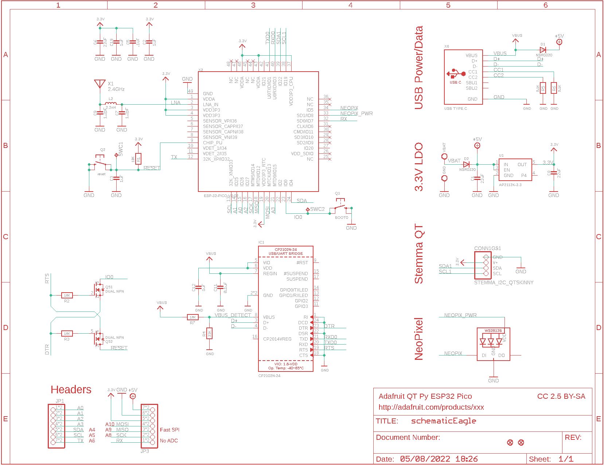
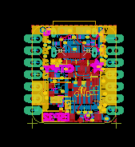
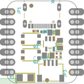
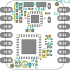
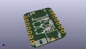
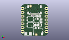
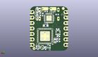
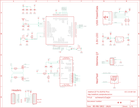
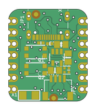
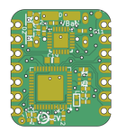

Contents
========

* [PRA5395 > Adafruit QT Py ESP32 Pico PCB](#pra5395--adafruit-qt-py-esp32-pico-pcb)
	* [Schematic](#schematic)
	* [PCB](#pcb)
	* [Interactive BOM](#interactive-bom)
	* [OOMP Parts](#oomp-parts)
	* [Images](#images)
	* [Tags](#tags)
  
![][im]
# PRA5395 > Adafruit QT Py ESP32 Pico PCB

- ID: PROJ-ADAF-5395-STAN-01
- Hex ID: PRA5395
- Name: Adafruit
- Description: Adafruit
- Long Link: [http://oom.lt/PROJ-ADAF-5395-STAN-01](http://oom.lt/PROJ-ADAF-5395-STAN-01)
- Short Link: [http://oom.lt/PRA5395](http://oom.lt/PRA5395)

## Schematic
  

## PCB
  

## Interactive BOM

- Interactive BOM page: [ibom.html](https://htmlpreview.github.io/?https://github.com/oomlout/oomlout_OOMP_projects/blob/main/PROJ-ADAF-5395-STAN-01/kicad/bom/ibom.html)

## OOMP Parts
  

|OOMP ID|Name|Identifier|
| :---: | :---: | :---: |
|[CAPC-0805-X-UF22-V63D](https://github.com/oomlout/oomlout_OOMP_parts/tree/main/CAPC-0805-X-UF22-V63D/)|[SMD (0805) 22 uF Capacitor (Ceramic) 6.3v](https://github.com/oomlout/oomlout_OOMP_parts/tree/main/CAPC-0805-X-UF22-V63D/)|[C1, C6, C8](https://github.com/oomlout/oomlout_OOMP_parts/tree/main/CAPC-0805-X-UF22-V63D/)|
|[CAPC-0402-X-UF1-V63D](https://github.com/oomlout/oomlout_OOMP_parts/tree/main/CAPC-0402-X-UF1-V63D/)|[SMD (0402) 1 uF Capacitor (Ceramic) 6.3v](https://github.com/oomlout/oomlout_OOMP_parts/tree/main/CAPC-0402-X-UF1-V63D/)|[C2, C3, C12](https://github.com/oomlout/oomlout_OOMP_parts/tree/main/CAPC-0402-X-UF1-V63D/)|
|[CAPC-0402-X-NF100-V10](https://github.com/oomlout/oomlout_OOMP_parts/tree/main/CAPC-0402-X-NF100-V10/)|[SMD (0402) 100 nF Capacitor (Ceramic) 10v](https://github.com/oomlout/oomlout_OOMP_parts/tree/main/CAPC-0402-X-NF100-V10/)|[C5, C11](https://github.com/oomlout/oomlout_OOMP_parts/tree/main/CAPC-0402-X-NF100-V10/)|
|CAPC-0402-X-PF12D-01||C7, C9|
|[CAPC-0603-X-UF1-V25](https://github.com/oomlout/oomlout_OOMP_parts/tree/main/CAPC-0603-X-UF1-V25/)|[SMD (0603) 1 uF Capacitor (Ceramic) 25v](https://github.com/oomlout/oomlout_OOMP_parts/tree/main/CAPC-0603-X-UF1-V25/)|[C19](https://github.com/oomlout/oomlout_OOMP_parts/tree/main/CAPC-0603-X-UF1-V25/)|
|[HEAD-JSTSH-X-PI04-RS](https://github.com/oomlout/oomlout_OOMP_parts/tree/main/HEAD-JSTSH-X-PI04-RS/)|[JST XH (1 mm) 4 Pin Header Right Angle (SMD)](https://github.com/oomlout/oomlout_OOMP_parts/tree/main/HEAD-JSTSH-X-PI04-RS/)|[CONN1](https://github.com/oomlout/oomlout_OOMP_parts/tree/main/HEAD-JSTSH-X-PI04-RS/)|
|DIOD-S323-X-UNMATCHED-01||D1, D2|
|UNMATCHED-UNMATCHED-X-UNMATCHED-01||IC1, SWC1, SWC2, X1, X2, X6|
|[HEAD-I01-X-PI07-01](https://github.com/oomlout/oomlout_OOMP_parts/tree/main/HEAD-I01-X-PI07-01/)|[2.54 mm 7 Pin Header](https://github.com/oomlout/oomlout_OOMP_parts/tree/main/HEAD-I01-X-PI07-01/)|[JP1, JP3](https://github.com/oomlout/oomlout_OOMP_parts/tree/main/HEAD-I01-X-PI07-01/)|
|UNMATCHED-0402-X-UNMATCHED-01||L2|
|LEDS-UNMATCHED-RGB-K2812-01||LED1|
|[BUTA-4628-X-STAN-01](https://github.com/oomlout/oomlout_OOMP_parts/tree/main/BUTA-4628-X-STAN-01/)|[SMD (4628) Pushbutton (Tactile)](https://github.com/oomlout/oomlout_OOMP_parts/tree/main/BUTA-4628-X-STAN-01/)|[Q1, Q2](https://github.com/oomlout/oomlout_OOMP_parts/tree/main/BUTA-4628-X-STAN-01/)|
|MOSN-SO363-X-UNMATCHED-01||Q5|
|[RESE-0402-X-O103-01](https://github.com/oomlout/oomlout_OOMP_parts/tree/main/RESE-0402-X-O103-01/)|[SMD (0402) 10k Ohm Resistor](https://github.com/oomlout/oomlout_OOMP_parts/tree/main/RESE-0402-X-O103-01/)|[R1, R2, R3, R7](https://github.com/oomlout/oomlout_OOMP_parts/tree/main/RESE-0402-X-O103-01/)|
|RESE-0402-X-O223-01||R4|
|[RESE-0402-X-O472-01](https://github.com/oomlout/oomlout_OOMP_parts/tree/main/RESE-0402-X-O472-01/)|[SMD (0402) 4.7k Ohm Resistor](https://github.com/oomlout/oomlout_OOMP_parts/tree/main/RESE-0402-X-O472-01/)|[R5, R6](https://github.com/oomlout/oomlout_OOMP_parts/tree/main/RESE-0402-X-O472-01/)|
|[VREG-SO235-X-KAP2112K-V33D](https://github.com/oomlout/oomlout_OOMP_parts/tree/main/VREG-SO235-X-KAP2112K-V33D/)|[SMD (SOT-23-5) AP2112K Voltage Regulator 3.3v](https://github.com/oomlout/oomlout_OOMP_parts/tree/main/VREG-SO235-X-KAP2112K-V33D/)|[U1](https://github.com/oomlout/oomlout_OOMP_parts/tree/main/VREG-SO235-X-KAP2112K-V33D/)|

## Images
  
  

|bominteractivefront|bominteractiveback|kicadPcb3d|kicadPcb3dFront|kicadPcb3dBack|eagleImage|eagleSchemImage|pcbdraw|pcbdrawback|
| :---: | :---: | :---: | :---: | :---: | :---: | :---: | :---: | :---: |
||||||||||

## Tags

- hexID: PRA5395
- oompType: PROJ
- oompSize: ADAF
- oompColor: 5395
- oompDesc: STAN
- oompIndex: 01
- oompName: Adafruit QT Py ESP32 Pico PCB
- sources: All source files from https://github.com/adafruit/Adafruit-QT-Py-ESP32-Pico-PCB (source licence details in srcLicense.md)
- linkBuyPage: http://www.adafruit.com/products/5395
- oompID: PROJ-ADAF-5395-STAN-01
- oompParts: C1,CAPC-0805-X-UF22-V63D
- oompParts: C2,CAPC-0402-X-UF1-V63D
- oompParts: C3,CAPC-0402-X-UF1-V63D
- oompParts: C5,CAPC-0402-X-NF100-V10
- oompParts: C6,CAPC-0805-X-UF22-V63D
- oompParts: C7,CAPC-0402-X-PF12D-01
- oompParts: C8,CAPC-0805-X-UF22-V63D
- oompParts: C9,CAPC-0402-X-PF12D-01
- oompParts: C11,CAPC-0402-X-NF100-V10
- oompParts: C12,CAPC-0402-X-UF1-V63D
- oompParts: C19,CAPC-0603-X-UF1-V25
- oompParts: CONN1,HEAD-JSTSH-X-PI04-RS
- oompParts: D1,DIOD-S323-X-UNMATCHED-01
- oompParts: D2,DIOD-S323-X-UNMATCHED-01
- oompParts: IC1,UNMATCHED-UNMATCHED-X-UNMATCHED-01
- oompParts: JP1,HEAD-I01-X-PI07-01
- oompParts: JP3,HEAD-I01-X-PI07-01
- oompParts: L2,UNMATCHED-0402-X-UNMATCHED-01
- oompParts: LED1,LEDS-UNMATCHED-RGB-K2812-01
- oompParts: Q1,BUTA-4628-X-STAN-01
- oompParts: Q2,BUTA-4628-X-STAN-01
- oompParts: Q5,MOSN-SO363-X-UNMATCHED-01
- oompParts: R1,RESE-0402-X-O103-01
- oompParts: R2,RESE-0402-X-O103-01
- oompParts: R3,RESE-0402-X-O103-01
- oompParts: R4,RESE-0402-X-O223-01
- oompParts: R5,RESE-0402-X-O472-01
- oompParts: R6,RESE-0402-X-O472-01
- oompParts: R7,RESE-0402-X-O103-01
- oompParts: SWC1,UNMATCHED-UNMATCHED-X-UNMATCHED-01
- oompParts: SWC2,UNMATCHED-UNMATCHED-X-UNMATCHED-01
- oompParts: U1,VREG-SO235-X-KAP2112K-V33D
- oompParts: X1,UNMATCHED-UNMATCHED-X-UNMATCHED-01
- oompParts: X2,UNMATCHED-UNMATCHED-X-UNMATCHED-01
- oompParts: X6,UNMATCHED-UNMATCHED-X-UNMATCHED-01
- rawParts: C1,22uF,CAP_CERAMIC0805-NOOUTLINE,0805-NO,Ceramic Capacitors,,,,
- rawParts: C2,1uF,CAP_CERAMIC_0402NO,_0402NO,Ceramic Capacitors,,,,
- rawParts: C3,1uF,CAP_CERAMIC_0402NO,_0402NO,Ceramic Capacitors,,,,
- rawParts: C5,.1uF,CAP_CERAMIC_0402NO,_0402NO,Ceramic Capacitors,,,,
- rawParts: C6,22uF,CAP_CERAMIC0805-NOOUTLINE,0805-NO,Ceramic Capacitors,,,,
- rawParts: C7,1.2pF,CAP_CERAMIC_0402NO,_0402NO,Ceramic Capacitors,,,,
- rawParts: C8,22uF,CAP_CERAMIC0805-NOOUTLINE,0805-NO,Ceramic Capacitors,,,,
- rawParts: C9,1.2pF,CAP_CERAMIC_0402NO,_0402NO,Ceramic Capacitors,,,,
- rawParts: C11,0.1uF,CAP_CERAMIC_0402NO,_0402NO,Ceramic Capacitors,,,,
- rawParts: C12,1uF,CAP_CERAMIC_0402NO,_0402NO,Ceramic Capacitors,,,,
- rawParts: C19,1uF,CAP_CERAMIC_0603WIDE,0603-NO_WIDE,Ceramic Capacitors,,,,
- rawParts: CONN1,STEMMA_I2C_QTSKINNY,STEMMA_I2C_QTSKINNY,JST_SH4_SKINNY,,,,,
- rawParts: D1,  NSR0320,DIODE_SOD323MINI,SOD-323_MINI,Diode,,,,
- rawParts: D2,  NSR0320,DIODE_SOD323MINI,SOD-323_MINI,Diode,,,,
- rawParts: GND,,TESTPOINT_MINUS,TESTPOINT_MINUS_1X3MM,Test Point,,,,
- rawParts: IC1,CP2102N-24,CP2102N-24,QFN24_4MM_SMSC,,,,,
- rawParts: JP1,,HEADER-1X7_CASTEL,1X07_CASTEL,PIN HEADER,,,,
- rawParts: JP3,,HEADER-1X7_CASTEL,1X07_CASTEL,PIN HEADER,,,,
- rawParts: L2,2.2nH,INDUCTOR_0402,_0402,Inductors,,,,
- rawParts: LED1,WS2812B_SK6805_1515,WS2812B_SK6805_1515,SK6805_1515,,,,,
- rawParts: Q1,BOOT0,SWITCH_TACT_SMT4.6X2.8,BTN_KMR2_4.6X2.8,SMT Tact Switches,,,,
- rawParts: Q2,reset,SWITCH_TACT_SMT4.6X2.8,BTN_KMR2_4.6X2.8,SMT Tact Switches,,,,
- rawParts: Q5,DUAL NPN,MOSFET-N_DUAL,SOT363,Dual N-Channel MOSFET,,,,
- rawParts: R1,10K,RESISTOR_0402NO,_0402NO,Resistors,,,,
- rawParts: R2,10K,RESISTOR_0402NO,_0402NO,Resistors,,,,
- rawParts: R3,10K,RESISTOR_0402NO,_0402NO,Resistors,,,,
- rawParts: R4,22K,RESISTOR_0402NO,_0402NO,Resistors,,,,
- rawParts: R5,5.1K,RESISTOR_0402NO,_0402NO,Resistors,,,,
- rawParts: R6,5.1K,RESISTOR_0402NO,_0402NO,Resistors,,,,
- rawParts: R7,10K,RESISTOR_0402NO,_0402NO,Resistors,,,,
- rawParts: SWC1,TPB1,27,TPB1,27,B1,27,Test pad,,19,,
- rawParts: SWC2,TPB1,27,TPB1,27,B1,27,Test pad,,19,,
- rawParts: U$6,FIDUCIAL_1MM,FIDUCIAL_1MM,FIDUCIAL_1MM,Fiducial Alignment Points,EXCLUDE,,,
- rawParts: U$8,FIDUCIAL_1MM,FIDUCIAL_1MM,FIDUCIAL_1MM,Fiducial Alignment Points,EXCLUDE,,,
- rawParts: U1,AP2112K-3.3,VREG_SOT23-5,SOT23-5,SOT23-5 Fixed Voltage Regulators,,,,
- rawParts: VBAT,,TESTPOINT_PLUS13,TESTPOINT_PLUS_1X3MM,Test Point,,,,
- rawParts: X1,2.4GHz,ANTENNA_JOHANSON_2450AT18B100,ANT_2450AT18B100,Johanson 2.4GHz Chip Antenna (1206 Package),,,,
- rawParts: X2,ESP-32-PICO-V3-02,ESP-32-PICO-V3-02,QFN48_7X7,,,,,
- rawParts: X6,USB TYPE C,USB_C,USB_C_CUSB31-CFM2AX-01-X,USB Type-C USB 2.0 Connector,,,,

[im]: kicadPcb3d_450.png
