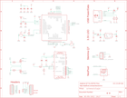

Contents
========

* [PRA5395 > Adafruit](#pra5395--adafruit)
	* [Schematic](#schematic)
	* [Interactive BOM](#interactive-bom)
	* [OOMP Parts](#oomp-parts)
	* [Images](#images)
	* [Tags](#tags)
  
![][im]
# PRA5395 > Adafruit

- ID: PROJ-ADAF-5395-STAN-01
- Hex ID: PRA5395
- Name: Adafruit
- Description: Adafruit
- Long Link: [http://oom.lt/PROJ-ADAF-5395-STAN-01](http://oom.lt/PROJ-ADAF-5395-STAN-01)
- Long Link: [http://oom.lt/PRA5395](http://oom.lt/PRA5395)

## Schematic
  
![][schem]
## Interactive BOM

- Interactive BOM page: [ibom.html](https://htmlpreview.github.io/?https://github.com/oomlout/oomlout_OOMP_projects/blob/main/PROJ-ADAF-5395-STAN-01/kicad/bom/ibom.html)

## OOMP Parts
  

|OOMP Parts|
| :---: |
|C1,UNMATCHED-UNMATCHED-UNMATCHED-UNMATCHED-UNMATCHED,C1,22uF,CAP_CERAMIC0805-NOOUTLINE,0805-NO,Ceramic Capacitors,,,,|
|C2,UNMATCHED-UNMATCHED-UNMATCHED-UNMATCHED-UNMATCHED,C2,1uF,CAP_CERAMIC_0402NO,_0402NO,Ceramic Capacitors,,,,|
|C3,UNMATCHED-UNMATCHED-UNMATCHED-UNMATCHED-UNMATCHED,C3,1uF,CAP_CERAMIC_0402NO,_0402NO,Ceramic Capacitors,,,,|
|C5,UNMATCHED-UNMATCHED-UNMATCHED-UNMATCHED-UNMATCHED,C5,.1uF,CAP_CERAMIC_0402NO,_0402NO,Ceramic Capacitors,,,,|
|C6,UNMATCHED-UNMATCHED-UNMATCHED-UNMATCHED-UNMATCHED,C6,22uF,CAP_CERAMIC0805-NOOUTLINE,0805-NO,Ceramic Capacitors,,,,|
|C7,UNMATCHED-UNMATCHED-UNMATCHED-UNMATCHED-UNMATCHED,C7,1.2pF,CAP_CERAMIC_0402NO,_0402NO,Ceramic Capacitors,,,,|
|C8,UNMATCHED-UNMATCHED-UNMATCHED-UNMATCHED-UNMATCHED,C8,22uF,CAP_CERAMIC0805-NOOUTLINE,0805-NO,Ceramic Capacitors,,,,|
|C9,UNMATCHED-UNMATCHED-UNMATCHED-UNMATCHED-UNMATCHED,C9,1.2pF,CAP_CERAMIC_0402NO,_0402NO,Ceramic Capacitors,,,,|
|C11,UNMATCHED-UNMATCHED-UNMATCHED-UNMATCHED-UNMATCHED,C11,0.1uF,CAP_CERAMIC_0402NO,_0402NO,Ceramic Capacitors,,,,|
|C12,UNMATCHED-UNMATCHED-UNMATCHED-UNMATCHED-UNMATCHED,C12,1uF,CAP_CERAMIC_0402NO,_0402NO,Ceramic Capacitors,,,,|
|C19,UNMATCHED-UNMATCHED-UNMATCHED-UNMATCHED-UNMATCHED,C19,1uF,CAP_CERAMIC_0603WIDE,0603-NO_WIDE,Ceramic Capacitors,,,,|
|CONN1,UNMATCHED-UNMATCHED-UNMATCHED-UNMATCHED-UNMATCHED,CONN1,STEMMA_I2C_QTSKINNY,STEMMA_I2C_QTSKINNY,JST_SH4_SKINNY,,,,,|
|D1,UNMATCHED-UNMATCHED-UNMATCHED-UNMATCHED-UNMATCHED,D1,  NSR0320,DIODE_SOD323MINI,SOD-323_MINI,Diode,,,,|
|D2,UNMATCHED-UNMATCHED-UNMATCHED-UNMATCHED-UNMATCHED,D2,  NSR0320,DIODE_SOD323MINI,SOD-323_MINI,Diode,,,,|
|GND,UNMATCHED-UNMATCHED-UNMATCHED-UNMATCHED-UNMATCHED,GND,,TESTPOINT_MINUS,TESTPOINT_MINUS_1X3MM,Test Point,,,,|
|IC1,UNMATCHED-UNMATCHED-UNMATCHED-UNMATCHED-UNMATCHED,IC1,CP2102N-24,CP2102N-24,QFN24_4MM_SMSC,,,,,|
|JP1,UNMATCHED-UNMATCHED-UNMATCHED-UNMATCHED-UNMATCHED,JP1,,HEADER-1X7_CASTEL,1X07_CASTEL,PIN HEADER,,,,|
|JP3,UNMATCHED-UNMATCHED-UNMATCHED-UNMATCHED-UNMATCHED,JP3,,HEADER-1X7_CASTEL,1X07_CASTEL,PIN HEADER,,,,|
|L2,UNMATCHED-UNMATCHED-UNMATCHED-UNMATCHED-UNMATCHED,L2,2.2nH,INDUCTOR_0402,_0402,Inductors,,,,|
|LED1,UNMATCHED-UNMATCHED-UNMATCHED-UNMATCHED-UNMATCHED,LED1,WS2812B_SK6805_1515,WS2812B_SK6805_1515,SK6805_1515,,,,,|
|Q1,UNMATCHED-UNMATCHED-UNMATCHED-UNMATCHED-UNMATCHED,Q1,BOOT0,SWITCH_TACT_SMT4.6X2.8,BTN_KMR2_4.6X2.8,SMT Tact Switches,,,,|
|Q2,UNMATCHED-UNMATCHED-UNMATCHED-UNMATCHED-UNMATCHED,Q2,reset,SWITCH_TACT_SMT4.6X2.8,BTN_KMR2_4.6X2.8,SMT Tact Switches,,,,|
|Q5,UNMATCHED-UNMATCHED-UNMATCHED-UNMATCHED-UNMATCHED,Q5,DUAL NPN,MOSFET-N_DUAL,SOT363,Dual N-Channel MOSFET,,,,|
|R1,UNMATCHED-UNMATCHED-UNMATCHED-UNMATCHED-UNMATCHED,R1,10K,RESISTOR_0402NO,_0402NO,Resistors,,,,|
|R2,UNMATCHED-UNMATCHED-UNMATCHED-UNMATCHED-UNMATCHED,R2,10K,RESISTOR_0402NO,_0402NO,Resistors,,,,|
|R3,UNMATCHED-UNMATCHED-UNMATCHED-UNMATCHED-UNMATCHED,R3,10K,RESISTOR_0402NO,_0402NO,Resistors,,,,|
|R4,UNMATCHED-UNMATCHED-UNMATCHED-UNMATCHED-UNMATCHED,R4,22K,RESISTOR_0402NO,_0402NO,Resistors,,,,|
|R5,UNMATCHED-UNMATCHED-UNMATCHED-UNMATCHED-UNMATCHED,R5,5.1K,RESISTOR_0402NO,_0402NO,Resistors,,,,|
|R6,UNMATCHED-UNMATCHED-UNMATCHED-UNMATCHED-UNMATCHED,R6,5.1K,RESISTOR_0402NO,_0402NO,Resistors,,,,|
|R7,UNMATCHED-UNMATCHED-UNMATCHED-UNMATCHED-UNMATCHED,R7,10K,RESISTOR_0402NO,_0402NO,Resistors,,,,|
|SWC1,UNMATCHED-UNMATCHED-UNMATCHED-UNMATCHED-UNMATCHED,SWC1,TPB1,27,TPB1,27,B1,27,Test pad,,19,,|
|SWC2,UNMATCHED-UNMATCHED-UNMATCHED-UNMATCHED-UNMATCHED,SWC2,TPB1,27,TPB1,27,B1,27,Test pad,,19,,|
|U1,UNMATCHED-UNMATCHED-UNMATCHED-UNMATCHED-UNMATCHED,U$6,FIDUCIAL_1MM,FIDUCIAL_1MM,FIDUCIAL_1MM,Fiducial Alignment Points,EXCLUDE,,,|
|VBAT,UNMATCHED-UNMATCHED-UNMATCHED-UNMATCHED-UNMATCHED,U$8,FIDUCIAL_1MM,FIDUCIAL_1MM,FIDUCIAL_1MM,Fiducial Alignment Points,EXCLUDE,,,|
|X1,UNMATCHED-UNMATCHED-UNMATCHED-UNMATCHED-UNMATCHED,U1,AP2112K-3.3,VREG_SOT23-5,SOT23-5,SOT23-5 Fixed Voltage Regulators,,,,|
|X2,UNMATCHED-UNMATCHED-UNMATCHED-UNMATCHED-UNMATCHED,VBAT,,TESTPOINT_PLUS13,TESTPOINT_PLUS_1X3MM,Test Point,,,,|
|X6,UNMATCHED-UNMATCHED-UNMATCHED-UNMATCHED-UNMATCHED,X1,2.4GHz,ANTENNA_JOHANSON_2450AT18B100,ANT_2450AT18B100,Johanson 2.4GHz Chip Antenna (1206 Package),,,,|

## Images
  
  

|kicadPcb3d|kicadPcb3dFront|kicadPcb3dBack|eagleImage|eagleSchemImage|
| :---: | :---: | :---: | :---: | :---: |
||||||

## Tags

- hexID: PRA5395
- oompType: PROJ
- oompSize: ADAF
- oompColor: 5395
- oompDesc: STAN
- oompIndex: 01
- oompName: Adafruit QT Py ESP32 Pico PCB
- sources: All source files from https://github.com/adafruit/Adafruit-QT-Py-ESP32-Pico-PCB (source licence details in srcLicense.md)
- linkBuyPage: http://www.adafruit.com/products/5395
- oompID: PROJ-ADAF-5395-STAN-01
- oompParts: C1,UNMATCHED-UNMATCHED-UNMATCHED-UNMATCHED-UNMATCHED
- oompParts: C2,UNMATCHED-UNMATCHED-UNMATCHED-UNMATCHED-UNMATCHED
- oompParts: C3,UNMATCHED-UNMATCHED-UNMATCHED-UNMATCHED-UNMATCHED
- oompParts: C5,UNMATCHED-UNMATCHED-UNMATCHED-UNMATCHED-UNMATCHED
- oompParts: C6,UNMATCHED-UNMATCHED-UNMATCHED-UNMATCHED-UNMATCHED
- oompParts: C7,UNMATCHED-UNMATCHED-UNMATCHED-UNMATCHED-UNMATCHED
- oompParts: C8,UNMATCHED-UNMATCHED-UNMATCHED-UNMATCHED-UNMATCHED
- oompParts: C9,UNMATCHED-UNMATCHED-UNMATCHED-UNMATCHED-UNMATCHED
- oompParts: C11,UNMATCHED-UNMATCHED-UNMATCHED-UNMATCHED-UNMATCHED
- oompParts: C12,UNMATCHED-UNMATCHED-UNMATCHED-UNMATCHED-UNMATCHED
- oompParts: C19,UNMATCHED-UNMATCHED-UNMATCHED-UNMATCHED-UNMATCHED
- oompParts: CONN1,UNMATCHED-UNMATCHED-UNMATCHED-UNMATCHED-UNMATCHED
- oompParts: D1,UNMATCHED-UNMATCHED-UNMATCHED-UNMATCHED-UNMATCHED
- oompParts: D2,UNMATCHED-UNMATCHED-UNMATCHED-UNMATCHED-UNMATCHED
- oompParts: GND,UNMATCHED-UNMATCHED-UNMATCHED-UNMATCHED-UNMATCHED
- oompParts: IC1,UNMATCHED-UNMATCHED-UNMATCHED-UNMATCHED-UNMATCHED
- oompParts: JP1,UNMATCHED-UNMATCHED-UNMATCHED-UNMATCHED-UNMATCHED
- oompParts: JP3,UNMATCHED-UNMATCHED-UNMATCHED-UNMATCHED-UNMATCHED
- oompParts: L2,UNMATCHED-UNMATCHED-UNMATCHED-UNMATCHED-UNMATCHED
- oompParts: LED1,UNMATCHED-UNMATCHED-UNMATCHED-UNMATCHED-UNMATCHED
- oompParts: Q1,UNMATCHED-UNMATCHED-UNMATCHED-UNMATCHED-UNMATCHED
- oompParts: Q2,UNMATCHED-UNMATCHED-UNMATCHED-UNMATCHED-UNMATCHED
- oompParts: Q5,UNMATCHED-UNMATCHED-UNMATCHED-UNMATCHED-UNMATCHED
- oompParts: R1,UNMATCHED-UNMATCHED-UNMATCHED-UNMATCHED-UNMATCHED
- oompParts: R2,UNMATCHED-UNMATCHED-UNMATCHED-UNMATCHED-UNMATCHED
- oompParts: R3,UNMATCHED-UNMATCHED-UNMATCHED-UNMATCHED-UNMATCHED
- oompParts: R4,UNMATCHED-UNMATCHED-UNMATCHED-UNMATCHED-UNMATCHED
- oompParts: R5,UNMATCHED-UNMATCHED-UNMATCHED-UNMATCHED-UNMATCHED
- oompParts: R6,UNMATCHED-UNMATCHED-UNMATCHED-UNMATCHED-UNMATCHED
- oompParts: R7,UNMATCHED-UNMATCHED-UNMATCHED-UNMATCHED-UNMATCHED
- oompParts: SWC1,UNMATCHED-UNMATCHED-UNMATCHED-UNMATCHED-UNMATCHED
- oompParts: SWC2,UNMATCHED-UNMATCHED-UNMATCHED-UNMATCHED-UNMATCHED
- oompParts: U1,UNMATCHED-UNMATCHED-UNMATCHED-UNMATCHED-UNMATCHED
- oompParts: VBAT,UNMATCHED-UNMATCHED-UNMATCHED-UNMATCHED-UNMATCHED
- oompParts: X1,UNMATCHED-UNMATCHED-UNMATCHED-UNMATCHED-UNMATCHED
- oompParts: X2,UNMATCHED-UNMATCHED-UNMATCHED-UNMATCHED-UNMATCHED
- oompParts: X6,UNMATCHED-UNMATCHED-UNMATCHED-UNMATCHED-UNMATCHED
- rawParts: C1,22uF,CAP_CERAMIC0805-NOOUTLINE,0805-NO,Ceramic Capacitors,,,,
- rawParts: C2,1uF,CAP_CERAMIC_0402NO,_0402NO,Ceramic Capacitors,,,,
- rawParts: C3,1uF,CAP_CERAMIC_0402NO,_0402NO,Ceramic Capacitors,,,,
- rawParts: C5,.1uF,CAP_CERAMIC_0402NO,_0402NO,Ceramic Capacitors,,,,
- rawParts: C6,22uF,CAP_CERAMIC0805-NOOUTLINE,0805-NO,Ceramic Capacitors,,,,
- rawParts: C7,1.2pF,CAP_CERAMIC_0402NO,_0402NO,Ceramic Capacitors,,,,
- rawParts: C8,22uF,CAP_CERAMIC0805-NOOUTLINE,0805-NO,Ceramic Capacitors,,,,
- rawParts: C9,1.2pF,CAP_CERAMIC_0402NO,_0402NO,Ceramic Capacitors,,,,
- rawParts: C11,0.1uF,CAP_CERAMIC_0402NO,_0402NO,Ceramic Capacitors,,,,
- rawParts: C12,1uF,CAP_CERAMIC_0402NO,_0402NO,Ceramic Capacitors,,,,
- rawParts: C19,1uF,CAP_CERAMIC_0603WIDE,0603-NO_WIDE,Ceramic Capacitors,,,,
- rawParts: CONN1,STEMMA_I2C_QTSKINNY,STEMMA_I2C_QTSKINNY,JST_SH4_SKINNY,,,,,
- rawParts: D1,  NSR0320,DIODE_SOD323MINI,SOD-323_MINI,Diode,,,,
- rawParts: D2,  NSR0320,DIODE_SOD323MINI,SOD-323_MINI,Diode,,,,
- rawParts: GND,,TESTPOINT_MINUS,TESTPOINT_MINUS_1X3MM,Test Point,,,,
- rawParts: IC1,CP2102N-24,CP2102N-24,QFN24_4MM_SMSC,,,,,
- rawParts: JP1,,HEADER-1X7_CASTEL,1X07_CASTEL,PIN HEADER,,,,
- rawParts: JP3,,HEADER-1X7_CASTEL,1X07_CASTEL,PIN HEADER,,,,
- rawParts: L2,2.2nH,INDUCTOR_0402,_0402,Inductors,,,,
- rawParts: LED1,WS2812B_SK6805_1515,WS2812B_SK6805_1515,SK6805_1515,,,,,
- rawParts: Q1,BOOT0,SWITCH_TACT_SMT4.6X2.8,BTN_KMR2_4.6X2.8,SMT Tact Switches,,,,
- rawParts: Q2,reset,SWITCH_TACT_SMT4.6X2.8,BTN_KMR2_4.6X2.8,SMT Tact Switches,,,,
- rawParts: Q5,DUAL NPN,MOSFET-N_DUAL,SOT363,Dual N-Channel MOSFET,,,,
- rawParts: R1,10K,RESISTOR_0402NO,_0402NO,Resistors,,,,
- rawParts: R2,10K,RESISTOR_0402NO,_0402NO,Resistors,,,,
- rawParts: R3,10K,RESISTOR_0402NO,_0402NO,Resistors,,,,
- rawParts: R4,22K,RESISTOR_0402NO,_0402NO,Resistors,,,,
- rawParts: R5,5.1K,RESISTOR_0402NO,_0402NO,Resistors,,,,
- rawParts: R6,5.1K,RESISTOR_0402NO,_0402NO,Resistors,,,,
- rawParts: R7,10K,RESISTOR_0402NO,_0402NO,Resistors,,,,
- rawParts: SWC1,TPB1,27,TPB1,27,B1,27,Test pad,,19,,
- rawParts: SWC2,TPB1,27,TPB1,27,B1,27,Test pad,,19,,
- rawParts: U$6,FIDUCIAL_1MM,FIDUCIAL_1MM,FIDUCIAL_1MM,Fiducial Alignment Points,EXCLUDE,,,
- rawParts: U$8,FIDUCIAL_1MM,FIDUCIAL_1MM,FIDUCIAL_1MM,Fiducial Alignment Points,EXCLUDE,,,
- rawParts: U1,AP2112K-3.3,VREG_SOT23-5,SOT23-5,SOT23-5 Fixed Voltage Regulators,,,,
- rawParts: VBAT,,TESTPOINT_PLUS13,TESTPOINT_PLUS_1X3MM,Test Point,,,,
- rawParts: X1,2.4GHz,ANTENNA_JOHANSON_2450AT18B100,ANT_2450AT18B100,Johanson 2.4GHz Chip Antenna (1206 Package),,,,
- rawParts: X2,ESP-32-PICO-V3-02,ESP-32-PICO-V3-02,QFN48_7X7,,,,,
- rawParts: X6,USB TYPE C,USB_C,USB_C_CUSB31-CFM2AX-01-X,USB Type-C USB 2.0 Connector,,,,

[im]: kicadPcb3d_450.png
[schem]: eagleSchemImage.png
