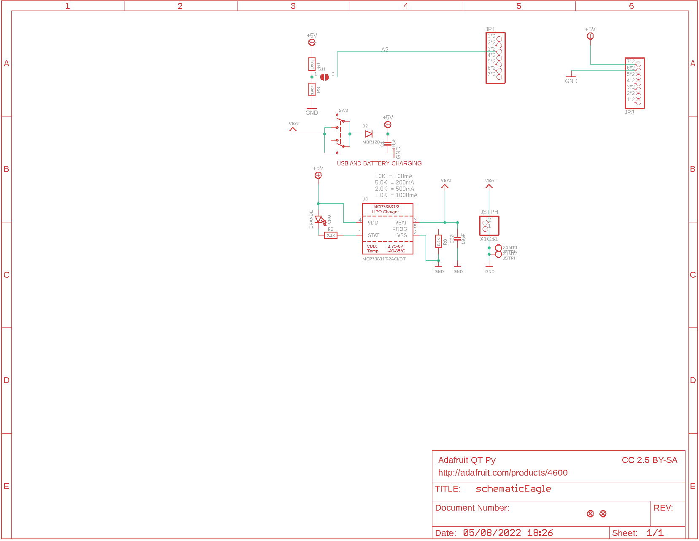
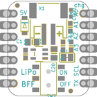
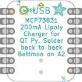
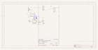
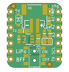
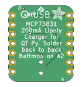

Contents
========

* [PRA5397 > Adafruit Charger BFF PCB](#pra5397--adafruit-charger-bff-pcb)
	* [Schematic](#schematic)
	* [PCB](#pcb)
	* [Interactive BOM](#interactive-bom)
	* [OOMP Parts](#oomp-parts)
	* [Images](#images)
	* [Tags](#tags)
  
![][im]
# PRA5397 > Adafruit Charger BFF PCB

- ID: PROJ-ADAF-5397-STAN-01
- Hex ID: PRA5397
- Name: Adafruit 5397
- Description: Adafruit 5397
- Long Link: [http://oom.lt/PROJ-ADAF-5397-STAN-01](http://oom.lt/PROJ-ADAF-5397-STAN-01)
- Short Link: [http://oom.lt/PRA5397](http://oom.lt/PRA5397)

## Schematic
  

## PCB
  

## Interactive BOM

- Interactive BOM page: [ibom.html](https://htmlpreview.github.io/?https://github.com/oomlout/oomlout_OOMP_projects/blob/main/PROJ-ADAF-5397-STAN-01/kicad/bom/ibom.html)

## OOMP Parts
  

|OOMP ID|Name|Identifier|
| :---: | :---: | :---: |
|CAPC-0805-X-UNMATCHED-01||C1, C20|
|LEDS-0603-O-STAN-01||CHG|
|[DIOD-S123-X-KMBR120-01](https://github.com/oomlout/oomlout_OOMP_parts/tree/main/DIOD-S123-X-KMBR120-01/)|[SMD (SOD-123) MBR120 Diode](https://github.com/oomlout/oomlout_OOMP_parts/tree/main/DIOD-S123-X-KMBR120-01/)|[D2](https://github.com/oomlout/oomlout_OOMP_parts/tree/main/DIOD-S123-X-KMBR120-01/)|
|[HEAD-I01-X-PI07-01](https://github.com/oomlout/oomlout_OOMP_parts/tree/main/HEAD-I01-X-PI07-01/)|[2.54 mm 7 Pin Header](https://github.com/oomlout/oomlout_OOMP_parts/tree/main/HEAD-I01-X-PI07-01/)|[JP1, JP3](https://github.com/oomlout/oomlout_OOMP_parts/tree/main/HEAD-I01-X-PI07-01/)|
|RESE-0603-X-O1003-01||R1, R3|
|[RESE-0603-X-O472-01](https://github.com/oomlout/oomlout_OOMP_parts/tree/main/RESE-0603-X-O472-01/)|[SMD (0603) 4.7k Ohm Resistor](https://github.com/oomlout/oomlout_OOMP_parts/tree/main/RESE-0603-X-O472-01/)|[R2, R8](https://github.com/oomlout/oomlout_OOMP_parts/tree/main/RESE-0603-X-O472-01/)|
|UNMATCHED-UNMATCHED-X-UNMATCHED-01||SW2, X1|
|UNMATCHED-SO235-X-UNMATCHED-01||U3|

## Images
  
  

|bominteractivefront|bominteractiveback|kicadPcb3d|kicadPcb3dFront|kicadPcb3dBack|kicadSchem|eagleImage|eagleSchemImage|pcbdraw|pcbdrawback|
| :---: | :---: | :---: | :---: | :---: | :---: | :---: | :---: | :---: | :---: |
|||||||||||

## Tags

- hexID: PRA5397
- oompType: PROJ
- oompSize: ADAF
- oompColor: 5397
- oompDesc: STAN
- oompIndex: 01
- oompName: Adafruit Charger BFF PCB
- sources: All source files from https://github.com/adafruit/Adafruit-Charger-BFF-PCB (source licence details in srcLicense.md)
- linkBuyPage: http://www.adafruit.com/products/5397
- oompID: PROJ-ADAF-5397-STAN-01
- oompParts: C1,CAPC-0805-X-UNMATCHED-01
- oompParts: C20,CAPC-0805-X-UNMATCHED-01
- oompParts: CHG,LEDS-0603-O-STAN-01
- oompParts: D2,DIOD-S123-X-KMBR120-01
- oompParts: JP1,HEAD-I01-X-PI07-01
- oompParts: JP3,HEAD-I01-X-PI07-01
- oompParts: R1,RESE-0603-X-O1003-01
- oompParts: R2,RESE-0603-X-O472-01
- oompParts: R3,RESE-0603-X-O1003-01
- oompParts: R8,RESE-0603-X-O472-01
- oompParts: SW2,UNMATCHED-UNMATCHED-X-UNMATCHED-01
- oompParts: U3,UNMATCHED-SO235-X-UNMATCHED-01
- oompParts: X1,UNMATCHED-UNMATCHED-X-UNMATCHED-01
- rawParts: C1,10µF,CAP_CERAMIC0805-NOOUTLINE,0805-NO,Ceramic Capacitors,,
- rawParts: C20,10µF,CAP_CERAMIC0805-NOOUTLINE,0805-NO,Ceramic Capacitors,,
- rawParts: CHG,ORANGE,LED0603_NOOUTLINE,CHIPLED_0603_NOOUTLINE,LED,,
- rawParts: D2,MBR120,DIODE_SOD-123FL,SOD-123FL,Diode,,
- rawParts: JP1,,HEADER-1X7_CASTEL,1X07_CASTEL,PIN HEADER,,
- rawParts: JP3,,HEADER-1X7_CASTEL,1X07_CASTEL,PIN HEADER,,
- rawParts: R1,100K,RESISTOR_0603_NOOUT,0603-NO,Resistors,,
- rawParts: R2,5.1K,RESISTOR_0603_NOOUT,0603-NO,Resistors,,
- rawParts: R3,100K,RESISTOR_0603_NOOUT,0603-NO,Resistors,,
- rawParts: R8,5.1K,RESISTOR_0603_NOOUT,0603-NO,Resistors,,
- rawParts: SJ1,,SOLDERJUMPERCLOSED,SOLDERJUMPER_CLOSEDWIRE,SMD Solder JUMPER,,
- rawParts: SW2,,SWITCH_DPDTEG1390,EG1390,Switch - DPDT,,
- rawParts: U$6,FIDUCIAL_1MM,FIDUCIAL_1MM,FIDUCIAL_1MM,Fiducial Alignment Points,EXCLUDE,
- rawParts: U$8,FIDUCIAL_1MM,FIDUCIAL_1MM,FIDUCIAL_1MM,Fiducial Alignment Points,EXCLUDE,
- rawParts: U3,MCP73831T-2ACI/OT,MCP73831/2,SOT23-5,MCP73831/2 LIPO Charger,,
- rawParts: X1,JSTPH,CON_JST_PH_2PIN_MT_BATT,JSTPH2_BATT,,,

[im]: kicadPcb3d_450.png
