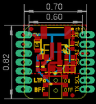
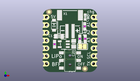
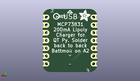
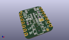

Contents
========

* [PROJ-ADAF-5397-STAN-01>Adafruit Charger BFF PCB](#proj-adaf-5397-stan-01adafruit-charger-bff-pcb)
	* [Images](#images)
	* [Interactive BOM](#interactive-bom)
	* [OOMP Parts](#oomp-parts)
	* [Tags](#tags)
  
![][im]
# PROJ-ADAF-5397-STAN-01>Adafruit Charger BFF PCB

- ID: PROJ-ADAF-5397-STAN-01
- Hex ID: PRA5397
- Name: Adafruit Charger BFF PCB
- Description: 

## Images
  
  

|eagleImage|kicadPcb3dFront|kicadPcb3dBack|kicadPcb3d|
| :---: | :---: | :---: | :---: |
|||||

## Interactive BOM

- Interactive BOM page: [ibom.html](kicad/bom/ibom.html)

## OOMP Parts
  

|OOMP Parts|
| :---: |
|CAPC-0805-X-UNMATCHED-01, C1, 5.334, 11.7475, 180,C1, 10uF, 0805-NO, microbuilder, (0.21, 0.4625), R180|
|CAPC-0805-X-UNMATCHED-01, C20, 10.0965, 9.270999999999999, 270,C20, 10uF, 0805-NO, microbuilder, (0.3975, 0.365), R270|
|UNMATCHED-UNMATCHED-X-UNMATCHED-01, CHG, 13.779499999999999, 18.034, 180,CHG, ORANGE, CHIPLED_0603_NOOUTLINE, microbuilder, (0.5425, 0.71), R180|
|UNMATCHED-UNMATCHED-X-UNMATCHED-01, D2, 3.6829999999999994, 15.366999999999999, 270,D2, MBR120, SOD-123FL, adafruit, (0.145, 0.605), R270|
|<table><tr><td></td><td> JP1</td><td>[HEAD-I01-X-PI07-01 2.54 mm 7 Pin Header](https://github.com/oomlout/oomlout_OOMP_parts/tree/main/HEAD-I01-X-PI07-01/)</td><td>[H07](https://github.com/oomlout/oomlout_OOMP_parts/tree/main/HEAD-I01-X-PI07-01/)</td></tr></table>|
|<table><tr><td></td><td> JP3</td><td>[HEAD-I01-X-PI07-01 2.54 mm 7 Pin Header](https://github.com/oomlout/oomlout_OOMP_parts/tree/main/HEAD-I01-X-PI07-01/)</td><td>[H07](https://github.com/oomlout/oomlout_OOMP_parts/tree/main/HEAD-I01-X-PI07-01/)</td></tr></table>|
|<table><tr><td></td><td> R1</td><td>[RESE-0603-X-O104-01 SMD (0603) 100k Ohm Resistor](https://github.com/oomlout/oomlout_OOMP_parts/tree/main/RESE-0603-X-O104-01/)</td><td>[R6104](https://github.com/oomlout/oomlout_OOMP_parts/tree/main/RESE-0603-X-O104-01/)</td></tr></table>|
|RESE-0603-X-UNMATCHED-01, R2, 13.652499999999998, 14.985999999999999, 270,R2, 5.1K, 0603-NO, microbuilder, (0.5375, 0.59), R270|
|<table><tr><td></td><td> R3</td><td>[RESE-0603-X-O104-01 SMD (0603) 100k Ohm Resistor](https://github.com/oomlout/oomlout_OOMP_parts/tree/main/RESE-0603-X-O104-01/)</td><td>[R6104](https://github.com/oomlout/oomlout_OOMP_parts/tree/main/RESE-0603-X-O104-01/)</td></tr></table>|
|RESE-0603-X-UNMATCHED-01, R8, 3.8734999999999995, 9.143999999999998, 90,R8, 5.1K, 0603-NO, microbuilder, (0.1525, 0.36), R90|
|UNMATCHED-UNMATCHED-X-UNMATCHED-01, SW2, 8.889999999999999, 3.8099999999999996, 90,SW2, EG1390, adafruit_electromech, (0.35, 0.15), R90|
|UNMATCHED-UNMATCHED-X-UNMATCHED-01, U3, 6.858, 9.143999999999998, 90,U3, MCP73831T-2ACI/OT, SOT23-5, microbuilder, (0.27, 0.36), R90|

## Tags

- hexID: PRA5397
- oompType: PROJ
- oompSize: ADAF
- oompColor: 5397
- oompDesc: STAN
- oompIndex: 01
- oompName: Adafruit Charger BFF PCB
- sources: All source files from https://github.com/adafruit/Adafruit-Charger-BFF-PCB (source licence details in srcLicense.md)
- linkBuyPage: http://www.adafruit.com/products/5397
- oompID: PROJ-ADAF-5397-STAN-01
- oompPart: CAPC-0805-X-UNMATCHED-01, C1, 5.334, 11.7475, 180
- oompPart: CAPC-0805-X-UNMATCHED-01, C20, 10.0965, 9.270999999999999, 270
- oompPart: UNMATCHED-UNMATCHED-X-UNMATCHED-01, CHG, 13.779499999999999, 18.034, 180
- oompPart: UNMATCHED-UNMATCHED-X-UNMATCHED-01, D2, 3.6829999999999994, 15.366999999999999, 270
- oompPart: HEAD-I01-X-PI07-01, JP1, 16.509999999999998, 10.350499999999998, M270
- oompPart: HEAD-I01-X-PI07-01, JP3, 1.27, 10.350499999999998, M90
- oompPart: RESE-0603-X-O104-01, R1, 12.065, 10.921999999999999, 270
- oompPart: RESE-0603-X-UNMATCHED-01, R2, 13.652499999999998, 14.985999999999999, 270
- oompPart: RESE-0603-X-O104-01, R3, 13.843, 10.921999999999999, 90
- oompPart: RESE-0603-X-UNMATCHED-01, R8, 3.8734999999999995, 9.143999999999998, 90
- oompPart: SKIP-UNMATCHED-X-UNMATCHED-01, SJ1, 12.953999999999999, 8.382, 0
- oompPart: UNMATCHED-UNMATCHED-X-UNMATCHED-01, SW2, 8.889999999999999, 3.8099999999999996, 90
- oompPart: SKIP-UNMATCHED-X-UNMATCHED-01, U$6, 13.728699999999998, 1.0795000000000001, 0
- oompPart: SKIP-UNMATCHED-X-UNMATCHED-01, U$8, 2.0955, 19.748499999999996, 0
- oompPart: UNMATCHED-UNMATCHED-X-UNMATCHED-01, U3, 6.858, 9.143999999999998, 90
- oompPart: SKIP-UNMATCHED-X-UNMATCHED-01, X1, 8.889999999999999, 17.145, 0
- rawPart: C1, 10uF, 0805-NO, microbuilder, (0.21, 0.4625), R180
- rawPart: C20, 10uF, 0805-NO, microbuilder, (0.3975, 0.365), R270
- rawPart: CHG, ORANGE, CHIPLED_0603_NOOUTLINE, microbuilder, (0.5425, 0.71), R180
- rawPart: D2, MBR120, SOD-123FL, adafruit, (0.145, 0.605), R270
- rawPart: JP1, 1X07_CASTEL, adafruit_electromech, (0.65, 0.4075), MR270
- rawPart: JP3, 1X07_CASTEL, adafruit_electromech, (0.05, 0.4075), MR90
- rawPart: R1, 100K, 0603-NO, microbuilder, (0.475, 0.43), R270
- rawPart: R2, 5.1K, 0603-NO, microbuilder, (0.5375, 0.59), R270
- rawPart: R3, 100K, 0603-NO, microbuilder, (0.545, 0.43), R90
- rawPart: R8, 5.1K, 0603-NO, microbuilder, (0.1525, 0.36), R90
- rawPart: SJ1, SOLDERJUMPER_CLOSEDWIRE, microbuilder, (0.51, 0.33), R0
- rawPart: SW2, EG1390, adafruit_electromech, (0.35, 0.15), R90
- rawPart: U$6, FIDUCIAL_1MM, FIDUCIAL_1MM, microbuilder, (0.5405, 0.0425), R0
- rawPart: U$8, FIDUCIAL_1MM, FIDUCIAL_1MM, microbuilder, (0.0825, 0.7775), R0
- rawPart: U3, MCP73831T-2ACI/OT, SOT23-5, microbuilder, (0.27, 0.36), R90
- rawPart: X1, JSTPH, JSTPH2_BATT, adafruit_electromech, (0.35, 0.675), R0

[im]: kicadPcb3d_450.png
