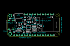
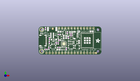
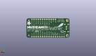
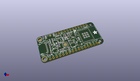

Contents
========

* [PROJ-ADAF-5400-STAN-01>Adafruit ESP32 Feather V2 PCB](#proj-adaf-5400-stan-01adafruit-esp32-feather-v2-pcb)
	* [Images](#images)
	* [Interactive BOM](#interactive-bom)
	* [OOMP Parts](#oomp-parts)
	* [Tags](#tags)
  
![][im]
# PROJ-ADAF-5400-STAN-01>Adafruit ESP32 Feather V2 PCB

- ID: PROJ-ADAF-5400-STAN-01
- Hex ID: PRA5400
- Name: Adafruit ESP32 Feather V2 PCB
- Description: 

## Images
  
  

|eagleImage|kicadPcb3dFront|kicadPcb3dBack|kicadPcb3d|
| :---: | :---: | :---: | :---: |
|||||

## Interactive BOM

- Interactive BOM page: [ibom.html](kicad/bom/ibom.html)

## OOMP Parts
  

|OOMP Parts|
| :---: |
|CAPC-0805-X-UNMATCHED-01, C1, 15.989299999999998, 4.1274999999999995, 0,C1, 10uF, 0805-NO, microbuilder, (0.6295, 0.1625), R0|
|CAPC-0805-X-UNMATCHED-01, C2, 42.925999999999995, 18.796, 0,C2, 10uF, 0805-NO, microbuilder, (1.69, 0.74), R0|
|CAPC-0805-X-UNMATCHED-01, C3, 16.9545, 18.6055, 0,C3, 10uF, 0805-NO, microbuilder, (0.6675, 0.7325), R0|
|CAPC-0603-X-UNMATCHED-01, C4, 8.254999999999999, 5.206999999999999, 90,C4, 1uF, 0603-NO, microbuilder, (0.325, 0.205), R90|
|CAPC-0603-X-UNMATCHED-01, C5, 26.288999999999998, 16.827499999999997, 0,C5, 1uF, 0603-NO, microbuilder, (1.035, 0.6625), R0|
|CAPC-0805-X-UNMATCHED-01, C6, 22.264999919999998, 14.282500009999998, 270,C6, 10uF, 0805-NO, microbuilder, (0.8765748, 0.56230315), R270|
|CAPC-0805-X-UNMATCHED-01, C7, 32.7025, 10.287, 270,C7, 10uF, 0805-NO, microbuilder, (1.2875, 0.405), R270|
|CAPC-0805-X-UNMATCHED-01, C8, 20.271499969999997, 14.291000119999998, 270,C8, 10uF, 0805-NO, microbuilder, (0.79809055, 0.5626378), R270|
|CAPC-0603-X-UNMATCHED-01, C9, 22.542499999999997, 4.699, 270,C9, 1uF, 0603-NO, microbuilder, (0.8875, 0.185), R270|
|CAPC-0603-X-UNMATCHED-01, C10, 15.875, 9.398, 90,C10, 1uF, 0603-NO, microbuilder, (0.625, 0.37), R90|
|<table><tr><td></td><td> C11</td><td>[CAPC-0603-X-NF100-V50 SMD (0603) 100 nF Capacitor (Ceramic) 50v](https://github.com/oomlout/oomlout_OOMP_parts/tree/main/CAPC-0603-X-NF100-V50/)</td><td>[C6N100](https://github.com/oomlout/oomlout_OOMP_parts/tree/main/CAPC-0603-X-NF100-V50/)</td></tr></table>|
|<table><tr><td></td><td> C12</td><td>[CAPC-0603-X-NF100-V50 SMD (0603) 100 nF Capacitor (Ceramic) 50v](https://github.com/oomlout/oomlout_OOMP_parts/tree/main/CAPC-0603-X-NF100-V50/)</td><td>[C6N100](https://github.com/oomlout/oomlout_OOMP_parts/tree/main/CAPC-0603-X-NF100-V50/)</td></tr></table>|
|CAPC-0805-X-UNMATCHED-01, C13, 26.225499999999997, 18.3515, 0,C13, 10uF, 0805-NO, microbuilder, (1.0325, 0.7225), R0|
|UNMATCHED-UNMATCHED-X-UNMATCHED-01, CHG, 2.032, 5.460999999999999, 270,CHG, ORANGE, CHIPLED_0603_NOOUTLINE, microbuilder, (0.08, 0.215), R270|
|UNMATCHED-UNMATCHED-X-UNMATCHED-01, CONN1, 29.7815, 15.748, 270,CONN1, STEMMA_I2C_QTRA, JST_SH4_RA, microbuilder, (1.1725, 0.62), R270|
|UNMATCHED-UNMATCHED-X-UNMATCHED-01, D+1, 3.8099999999999996, 12.7, M0,D+1, TPB1,27, B1,27, testpad, (0.15, 0.5), MR0|
|UNMATCHED-UNMATCHED-X-UNMATCHED-01, D-1, 3.8099999999999996, 10.16, M0,D-1, TPB1,27, B1,27, testpad, (0.15, 0.4), MR0|
|UNMATCHED-UNMATCHED-X-UNMATCHED-01, D3, 2.3495, 17.3355, 90,D3, RED, CHIPLED_0603_NOOUTLINE, microbuilder, (0.0925, 0.6825), R90|
|UNMATCHED-UNMATCHED-X-UNMATCHED-01, D4, 12.318999999999999, 12.128499999999999, 180,D4, MBR540, SOD-123, microbuilder, (0.485, 0.4775), R180|
|UNMATCHED-UNMATCHED-X-UNMATCHED-01, IC3, 20.5105, 8.762999999999998, 0,IC3, CP2102N-24, QFN24_4MM_SMSC, microbuilder, (0.8075, 0.345), R0|
|<table><tr><td></td><td> JP1</td><td>[HEAD-I01-X-PI16-01 2.54 mm 16 Pin Header](https://github.com/oomlout/oomlout_OOMP_parts/tree/main/HEAD-I01-X-PI16-01/)</td><td>[H16](https://github.com/oomlout/oomlout_OOMP_parts/tree/main/HEAD-I01-X-PI16-01/)</td></tr></table>|
|<table><tr><td></td><td> JP3</td><td>[HEAD-I01-X-PI12-01 2.54 mm 12 Pin Header](https://github.com/oomlout/oomlout_OOMP_parts/tree/main/HEAD-I01-X-PI12-01/)</td><td>[H12](https://github.com/oomlout/oomlout_OOMP_parts/tree/main/HEAD-I01-X-PI12-01/)</td></tr></table>|
|UNMATCHED-UNMATCHED-X-UNMATCHED-01, LED1, 31.241999999999997, 6.095999999999999, 180,LED1, WS2812B3535, LED3535, microbuilder, (1.23, 0.24), R180|
|UNMATCHED-UNMATCHED-X-UNMATCHED-01, Q3, 11.7475, 9.652, 0,Q3, DMG3415U, SOT23-R, microbuilder, (0.4625, 0.38), R0|
|ERROR, Q5 DUAL NPN, 0, 0, 0,Q5, DUAL, NPN, SOT363, microbuilder, (1.0425, 0.5225), R180|
|<table><tr><td></td><td> R1</td><td>[RESE-0603-X-O204-01 SMD (0603) 200k Ohm Resistor](https://github.com/oomlout/oomlout_OOMP_parts/tree/main/RESE-0603-X-O204-01/)</td><td>[R6204](https://github.com/oomlout/oomlout_OOMP_parts/tree/main/RESE-0603-X-O204-01/)</td></tr></table>|
|RESE-0603-X-UNMATCHED-01, R2, 5.968999999999999, 4.191, 0,R2, 5.1K, 0603-NO, microbuilder, (0.235, 0.165), R0|
|<table><tr><td></td><td> R3</td><td>[RESE-0603-X-O204-01 SMD (0603) 200k Ohm Resistor](https://github.com/oomlout/oomlout_OOMP_parts/tree/main/RESE-0603-X-O204-01/)</td><td>[R6204](https://github.com/oomlout/oomlout_OOMP_parts/tree/main/RESE-0603-X-O204-01/)</td></tr></table>|
|RESE-0603-X-UNMATCHED-01, R4, 16.764, 16.446499999999997, 0,R4, 5.1K, 0603-NO, microbuilder, (0.66, 0.6475), R0|
|RESE-0603-X-UNMATCHED-01, R5, 8.636000000000001, 9.8425, 270,R5, 5.1K, 0603-NO, microbuilder, (0.34, 0.3875), R270|
|RESE-0603-X-UNMATCHED-01, R6, 8.6995, 12.953999999999999, 90,R6, 5.1K, 0603-NO, microbuilder, (0.3425, 0.51), R90|
|<table><tr><td></td><td> R7</td><td>[RESE-0603-X-O104-01 SMD (0603) 100k Ohm Resistor](https://github.com/oomlout/oomlout_OOMP_parts/tree/main/RESE-0603-X-O104-01/)</td><td>[R6104](https://github.com/oomlout/oomlout_OOMP_parts/tree/main/RESE-0603-X-O104-01/)</td></tr></table>|
|RESE-UNMATCHED-X-O473-01, R9, 19.812, 4.762499999999999, 0,R9, 47K, RESPACK_4X0603, microbuilder, (0.78, 0.1875), R0|
|RESE-0603-X-UNMATCHED-01, R10, 5.588, 21.081999999999997, 270,R10, 5.1K, 0603-NO, microbuilder, (0.22, 0.83), R270|
|<table><tr><td></td><td> R12</td><td>[RESE-0603-X-O104-01 SMD (0603) 100k Ohm Resistor](https://github.com/oomlout/oomlout_OOMP_parts/tree/main/RESE-0603-X-O104-01/)</td><td>[R6104](https://github.com/oomlout/oomlout_OOMP_parts/tree/main/RESE-0603-X-O104-01/)</td></tr></table>|
|RESE-UNMATCHED-X-O103-01, R13, 25.780999999999995, 9.652, 0,R13, 10K, RESPACK_4X0603, microbuilder, (1.015, 0.38), R0|
|UNMATCHED-UNMATCHED-X-UNMATCHED-01, SW1, 26.225499999999997, 6.35, 180,SW1, KMR2, BTN_KMR2_4.6X2.8, adafruit_electromech, (1.0325, 0.25), R180|
|UNMATCHED-UNMATCHED-X-UNMATCHED-01, SW2, 11.7475, 6.35, 0,SW2, KMR2, BTN_KMR2_4.6X2.8, adafruit_electromech, (0.4625, 0.25), R0|
|UNMATCHED-UNMATCHED-X-UNMATCHED-01, U1, 29.7815, 9.906, 270,U1, AP2112-3.3, SOT23-5, adafruit_power, (1.1725, 0.39), R270|
|UNMATCHED-UNMATCHED-X-UNMATCHED-01, U2, 20.764499999999998, 17.7165, 90,U2, AP2112-3.3, SOT23-5, adafruit_power, (0.8175, 0.6975), R90|
|UNMATCHED-UNMATCHED-X-UNMATCHED-01, U3, 17.145, 13.97, 270,U3, MCP73831T-2ACI/OT, SOT23-5, microbuilder, (0.675, 0.55), R270|
|UNMATCHED-UNMATCHED-X-UNMATCHED-01, X3, 39.37, 11.43, 270,X3, ESP32-PICO-MINI-02MINI, ESP32-PICO-MINI, adafruit_wireless, (1.55, 0.45), R270|
|ERROR, X6 USB Type, 0, 0, 0,X6, USB, Type, C, USB_C_CUSB31-CFM2AX-01-X, adafruit_electromech, (0.105, 0.45), R270|

## Tags

- hexID: PRA5400
- oompType: PROJ
- oompSize: ADAF
- oompColor: 5400
- oompDesc: STAN
- oompIndex: 01
- oompName: Adafruit ESP32 Feather V2 PCB
- sources: All source files from https://github.com/adafruit/Adafruit-ESP32-Feather-V2-PCB (source licence details in srcLicense.md)
- linkBuyPage: http://www.adafruit.com/products/5400
- oompPart: CAPC-0805-X-UNMATCHED-01, C1, 15.989299999999998, 4.1274999999999995, 0
- oompPart: CAPC-0805-X-UNMATCHED-01, C2, 42.925999999999995, 18.796, 0
- oompPart: CAPC-0805-X-UNMATCHED-01, C3, 16.9545, 18.6055, 0
- oompPart: CAPC-0603-X-UNMATCHED-01, C4, 8.254999999999999, 5.206999999999999, 90
- oompPart: CAPC-0603-X-UNMATCHED-01, C5, 26.288999999999998, 16.827499999999997, 0
- oompPart: CAPC-0805-X-UNMATCHED-01, C6, 22.264999919999998, 14.282500009999998, 270
- oompPart: CAPC-0805-X-UNMATCHED-01, C7, 32.7025, 10.287, 270
- oompPart: CAPC-0805-X-UNMATCHED-01, C8, 20.271499969999997, 14.291000119999998, 270
- oompPart: CAPC-0603-X-UNMATCHED-01, C9, 22.542499999999997, 4.699, 270
- oompPart: CAPC-0603-X-UNMATCHED-01, C10, 15.875, 9.398, 90
- oompPart: CAPC-0603-X-NF100-V50, C11, 16.319499999999998, 5.7785, 180
- oompPart: CAPC-0603-X-NF100-V50, C12, 14.350999999999997, 9.398, 90
- oompPart: CAPC-0805-X-UNMATCHED-01, C13, 26.225499999999997, 18.3515, 0
- oompPart: UNMATCHED-UNMATCHED-X-UNMATCHED-01, CHG, 2.032, 5.460999999999999, 270
- oompPart: UNMATCHED-UNMATCHED-X-UNMATCHED-01, CONN1, 29.7815, 15.748, 270
- oompPart: UNMATCHED-UNMATCHED-X-UNMATCHED-01, D+1, 3.8099999999999996, 12.7, M0
- oompPart: UNMATCHED-UNMATCHED-X-UNMATCHED-01, D-1, 3.8099999999999996, 10.16, M0
- oompPart: UNMATCHED-UNMATCHED-X-UNMATCHED-01, D3, 2.3495, 17.3355, 90
- oompPart: UNMATCHED-UNMATCHED-X-UNMATCHED-01, D4, 12.318999999999999, 12.128499999999999, 180
- oompPart: UNMATCHED-UNMATCHED-X-UNMATCHED-01, IC3, 20.5105, 8.762999999999998, 0
- oompPart: HEAD-I01-X-PI16-01, JP1, 25.4, 1.27, 180
- oompPart: HEAD-I01-X-PI12-01, JP3, 30.479999999999997, 21.59, 0
- oompPart: UNMATCHED-UNMATCHED-X-UNMATCHED-01, LED1, 31.241999999999997, 6.095999999999999, 180
- oompPart: UNMATCHED-UNMATCHED-X-UNMATCHED-01, Q3, 11.7475, 9.652, 0
- oompPart: ERROR, Q5 DUAL NPN, 0, 0, 0
- oompPart: RESE-0603-X-O204-01, R1, 24.13, 13.9065, 270
- oompPart: RESE-0603-X-UNMATCHED-01, R2, 5.968999999999999, 4.191, 0
- oompPart: RESE-0603-X-O204-01, R3, 26.288999999999998, 15.4305, 180
- oompPart: RESE-0603-X-UNMATCHED-01, R4, 16.764, 16.446499999999997, 0
- oompPart: RESE-0603-X-UNMATCHED-01, R5, 8.636000000000001, 9.8425, 270
- oompPart: RESE-0603-X-UNMATCHED-01, R6, 8.6995, 12.953999999999999, 90
- oompPart: RESE-0603-X-O104-01, R7, 23.4315, 17.7165, 270
- oompPart: RESE-UNMATCHED-X-O473-01, R9, 19.812, 4.762499999999999, 0
- oompPart: RESE-0603-X-UNMATCHED-01, R10, 5.588, 21.081999999999997, 270
- oompPart: RESE-0603-X-O104-01, R12, 16.9545, 11.684, 0
- oompPart: RESE-UNMATCHED-X-O103-01, R13, 25.780999999999995, 9.652, 0
- oompPart: UNMATCHED-UNMATCHED-X-UNMATCHED-01, SW1, 26.225499999999997, 6.35, 180
- oompPart: UNMATCHED-UNMATCHED-X-UNMATCHED-01, SW2, 11.7475, 6.35, 0
- oompPart: SKIP-UNMATCHED-X-UNMATCHED-01, U$31, 2.54, 20.32, 270
- oompPart: SKIP-UNMATCHED-X-UNMATCHED-01, U$32, 2.54, 2.54, 270
- oompPart: SKIP-UNMATCHED-X-UNMATCHED-01, U$34, 11.43, 21.081999999999997, 270
- oompPart: SKIP-UNMATCHED-X-UNMATCHED-01, U$35, 46.402200058, 1.2388999859999998, 270
- oompPart: UNMATCHED-UNMATCHED-X-UNMATCHED-01, U1, 29.7815, 9.906, 270
- oompPart: UNMATCHED-UNMATCHED-X-UNMATCHED-01, U2, 20.764499999999998, 17.7165, 90
- oompPart: UNMATCHED-UNMATCHED-X-UNMATCHED-01, U3, 17.145, 13.97, 270
- oompPart: SKIP-UNMATCHED-X-UNMATCHED-01, X1, 10.9855, 19.304, 0
- oompPart: UNMATCHED-UNMATCHED-X-UNMATCHED-01, X3, 39.37, 11.43, 270
- oompPart: ERROR, X6 USB Type, 0, 0, 0
- rawPart: C1, 10uF, 0805-NO, microbuilder, (0.6295, 0.1625), R0
- rawPart: C2, 10uF, 0805-NO, microbuilder, (1.69, 0.74), R0
- rawPart: C3, 10uF, 0805-NO, microbuilder, (0.6675, 0.7325), R0
- rawPart: C4, 1uF, 0603-NO, microbuilder, (0.325, 0.205), R90
- rawPart: C5, 1uF, 0603-NO, microbuilder, (1.035, 0.6625), R0
- rawPart: C6, 10uF, 0805-NO, microbuilder, (0.8765748, 0.56230315), R270
- rawPart: C7, 10uF, 0805-NO, microbuilder, (1.2875, 0.405), R270
- rawPart: C8, 10uF, 0805-NO, microbuilder, (0.79809055, 0.5626378), R270
- rawPart: C9, 1uF, 0603-NO, microbuilder, (0.8875, 0.185), R270
- rawPart: C10, 1uF, 0603-NO, microbuilder, (0.625, 0.37), R90
- rawPart: C11, 0.1uF, 0603-NO, microbuilder, (0.6425, 0.2275), R180
- rawPart: C12, 0.1uF, 0603-NO, microbuilder, (0.565, 0.37), R90
- rawPart: C13, 10uF, 0805-NO, microbuilder, (1.0325, 0.7225), R0
- rawPart: CHG, ORANGE, CHIPLED_0603_NOOUTLINE, microbuilder, (0.08, 0.215), R270
- rawPart: CONN1, STEMMA_I2C_QTRA, JST_SH4_RA, microbuilder, (1.1725, 0.62), R270
- rawPart: D+1, TPB1,27, B1,27, testpad, (0.15, 0.5), MR0
- rawPart: D-1, TPB1,27, B1,27, testpad, (0.15, 0.4), MR0
- rawPart: D3, RED, CHIPLED_0603_NOOUTLINE, microbuilder, (0.0925, 0.6825), R90
- rawPart: D4, MBR540, SOD-123, microbuilder, (0.485, 0.4775), R180
- rawPart: IC3, CP2102N-24, QFN24_4MM_SMSC, microbuilder, (0.8075, 0.345), R0
- rawPart: JP1, 1X16_ROUND, microbuilder, (1, 0.05), R180
- rawPart: JP3, 1X12_ROUND, microbuilder, (1.2, 0.85), R0
- rawPart: LED1, WS2812B3535, LED3535, microbuilder, (1.23, 0.24), R180
- rawPart: Q3, DMG3415U, SOT23-R, microbuilder, (0.4625, 0.38), R0
- rawPart: Q5, DUAL, NPN, SOT363, microbuilder, (1.0425, 0.5225), R180
- rawPart: R1, 200K, 0603-NO, microbuilder, (0.95, 0.5475), R270
- rawPart: R2, 5.1K, 0603-NO, microbuilder, (0.235, 0.165), R0
- rawPart: R3, 200K, 0603-NO, microbuilder, (1.035, 0.6075), R180
- rawPart: R4, 5.1K, 0603-NO, microbuilder, (0.66, 0.6475), R0
- rawPart: R5, 5.1K, 0603-NO, microbuilder, (0.34, 0.3875), R270
- rawPart: R6, 5.1K, 0603-NO, microbuilder, (0.3425, 0.51), R90
- rawPart: R7, 100K, 0603-NO, microbuilder, (0.9225, 0.6975), R270
- rawPart: R9, 47K, RESPACK_4X0603, microbuilder, (0.78, 0.1875), R0
- rawPart: R10, 5.1K, 0603-NO, microbuilder, (0.22, 0.83), R270
- rawPart: R12, 100K, 0603-NO, microbuilder, (0.6675, 0.46), R0
- rawPart: R13, 10K, RESPACK_4X0603, microbuilder, (1.015, 0.38), R0
- rawPart: SW1, KMR2, BTN_KMR2_4.6X2.8, adafruit_electromech, (1.0325, 0.25), R180
- rawPart: SW2, KMR2, BTN_KMR2_4.6X2.8, adafruit_electromech, (0.4625, 0.25), R0
- rawPart: U$31, MOUNTINGHOLE2.5, MOUNTINGHOLE_2.5_PLATED, adafruit_electromech, (0.1, 0.8), R270
- rawPart: U$32, MOUNTINGHOLE2.5, MOUNTINGHOLE_2.5_PLATED, adafruit_electromech, (0.1, 0.1), R270
- rawPart: U$34, FIDUCIAL_1MM, FIDUCIAL_1MM, microbuilder, (0.45, 0.83), R270
- rawPart: U$35, FIDUCIAL_1MM, FIDUCIAL_1MM, microbuilder, (1.82685827, 0.04877559), R270
- rawPart: U1, AP2112-3.3, SOT23-5, adafruit_power, (1.1725, 0.39), R270
- rawPart: U2, AP2112-3.3, SOT23-5, adafruit_power, (0.8175, 0.6975), R90
- rawPart: U3, MCP73831T-2ACI/OT, SOT23-5, microbuilder, (0.675, 0.55), R270
- rawPart: X1, JSTPH, JSTPH2_BATT, adafruit_electromech, (0.4325, 0.76), R0
- rawPart: X3, ESP32-PICO-MINI-02MINI, ESP32-PICO-MINI, adafruit_wireless, (1.55, 0.45), R270
- rawPart: X6, USB, Type, C, USB_C_CUSB31-CFM2AX-01-X, adafruit_electromech, (0.105, 0.45), R270
- oompID: PROJ-ADAF-5400-STAN-01

[im]: kicadPcb3d_450.png
