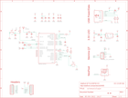

Contents
========

* [PRA5405 > Adafruit QT Py ESP32 C3 PCB](#pra5405--adafruit-qt-py-esp32-c3-pcb)
	* [Schematic](#schematic)
	* [PCB](#pcb)
	* [Interactive BOM](#interactive-bom)
	* [OOMP Parts](#oomp-parts)
	* [Images](#images)
	* [Tags](#tags)
  
![][im]
# PRA5405 > Adafruit QT Py ESP32 C3 PCB

- ID: PROJ-ADAF-5405-STAN-01
- Hex ID: PRA5405
- Name: Adafruit
- Description: Adafruit
- Long Link: [http://oom.lt/PROJ-ADAF-5405-STAN-01](http://oom.lt/PROJ-ADAF-5405-STAN-01)
- Short Link: [http://oom.lt/PRA5405](http://oom.lt/PRA5405)

## Schematic
  

## PCB
  

## Interactive BOM

- Interactive BOM page: [ibom.html](https://htmlpreview.github.io/?https://github.com/oomlout/oomlout_OOMP_projects/blob/main/PROJ-ADAF-5405-STAN-01/kicad/bom/ibom.html)

## OOMP Parts
  

|OOMP Parts|
| :---: |
|[CAPC-0805-X-UF22-V63D  SMD (0805) 22 uF Capacitor (Ceramic) 6.3v  C1, C6, C8](https://github.com/oomlout/oomlout_OOMP_parts/tree/main/CAPC-0805-X-UF22-V63D/)|
|[CAPC-0402-X-UF1-V63D  SMD (0402) 1 uF Capacitor (Ceramic) 6.3v  C2, C3, C11, C15](https://github.com/oomlout/oomlout_OOMP_parts/tree/main/CAPC-0402-X-UF1-V63D/)|
|CAPC-0402-X-UF1D-01 C4, C10, C14|
|[CAPC-0402-X-NF100-V10  SMD (0402) 100 nF Capacitor (Ceramic) 10v  C7, C9](https://github.com/oomlout/oomlout_OOMP_parts/tree/main/CAPC-0402-X-NF100-V10/)|
|CAPC-0402-X-UNMATCHED-01 C16|
|CAPC-0402-X-PF16-01 C17, C18|
|HEAD-I01-X-UNMATCHED-01 CONN1|
|DIOD-S323-X-UNMATCHED-01 D1, D2|
|[HEAD-I01-X-PI07-01  2.54 mm 7 Pin Header  JP1, JP3](https://github.com/oomlout/oomlout_OOMP_parts/tree/main/HEAD-I01-X-PI07-01/)|
|UNMATCHED-0402-X-UNMATCHED-01 L1, L2|
|LEDS-UNMATCHED-RGB-K2812-01 LED1|
|[BUTA-4628-X-STAN-01  SMD (4628) Pushbutton (Tactile)  Q1](https://github.com/oomlout/oomlout_OOMP_parts/tree/main/BUTA-4628-X-STAN-01/)|
|BUTA-UNMATCHED-X-STAN-01 Q2|
|[RESE-0402-X-O103-01  SMD (0402) 10k Ohm Resistor  R1, R2](https://github.com/oomlout/oomlout_OOMP_parts/tree/main/RESE-0402-X-O103-01/)|
|RESE-0402-X-UNMATCHED-01 R3|
|[RESE-0402-X-O102-01  SMD (0402) 1k Ohm Resistor  R4](https://github.com/oomlout/oomlout_OOMP_parts/tree/main/RESE-0402-X-O102-01/)|
|[RESE-0402-X-O472-01  SMD (0402) 4.7k Ohm Resistor  R5, R6](https://github.com/oomlout/oomlout_OOMP_parts/tree/main/RESE-0402-X-O472-01/)|
|RESE-UNMATCHED-X-O103-01 R7|
|UNMATCHED-UNMATCHED-X-UNMATCHED-01 SWC1, SWC2, U2, X1, X6, Y1|
|VREG-SO235-X-KAP2112K-V33D U1|

## Images
  
  

|kicadPcb3d|kicadPcb3dFront|kicadPcb3dBack|eagleImage|eagleSchemImage|
| :---: | :---: | :---: | :---: | :---: |
||||||

## Tags

- hexID: PRA5405
- oompType: PROJ
- oompSize: ADAF
- oompColor: 5405
- oompDesc: STAN
- oompIndex: 01
- oompName: Adafruit QT Py ESP32 C3 PCB
- sources: All source files from https://github.com/adafruit/Adafruit-QT-Py-ESP32-C3-PCB (source licence details in srcLicense.md)
- linkBuyPage: http://www.adafruit.com/products/5405
- oompID: PROJ-ADAF-5405-STAN-01
- oompParts: C1,CAPC-0805-X-UF22-V63D
- oompParts: C2,CAPC-0402-X-UF1-V63D
- oompParts: C3,CAPC-0402-X-UF1-V63D
- oompParts: C4,CAPC-0402-X-UF1D-01
- oompParts: C6,CAPC-0805-X-UF22-V63D
- oompParts: C7,CAPC-0402-X-NF100-V10
- oompParts: C8,CAPC-0805-X-UF22-V63D
- oompParts: C9,CAPC-0402-X-NF100-V10
- oompParts: C10,CAPC-0402-X-UF1D-01
- oompParts: C11,CAPC-0402-X-UF1-V63D
- oompParts: C14,CAPC-0402-X-UF1D-01
- oompParts: C15,CAPC-0402-X-UF1-V63D
- oompParts: C16,CAPC-0402-X-UNMATCHED-01
- oompParts: C17,CAPC-0402-X-PF16-01
- oompParts: C18,CAPC-0402-X-PF16-01
- oompParts: CONN1,HEAD-I01-X-UNMATCHED-01
- oompParts: D1,DIOD-S323-X-UNMATCHED-01
- oompParts: D2,DIOD-S323-X-UNMATCHED-01
- oompParts: JP1,HEAD-I01-X-PI07-01
- oompParts: JP3,HEAD-I01-X-PI07-01
- oompParts: L1,UNMATCHED-0402-X-UNMATCHED-01
- oompParts: L2,UNMATCHED-0402-X-UNMATCHED-01
- oompParts: LED1,LEDS-UNMATCHED-RGB-K2812-01
- oompParts: Q1,BUTA-4628-X-STAN-01
- oompParts: Q2,BUTA-UNMATCHED-X-STAN-01
- oompParts: R1,RESE-0402-X-O103-01
- oompParts: R2,RESE-0402-X-O103-01
- oompParts: R3,RESE-0402-X-UNMATCHED-01
- oompParts: R4,RESE-0402-X-O102-01
- oompParts: R5,RESE-0402-X-O472-01
- oompParts: R6,RESE-0402-X-O472-01
- oompParts: R7,RESE-UNMATCHED-X-O103-01
- oompParts: SWC1,UNMATCHED-UNMATCHED-X-UNMATCHED-01
- oompParts: SWC2,UNMATCHED-UNMATCHED-X-UNMATCHED-01
- oompParts: U1,VREG-SO235-X-KAP2112K-V33D
- oompParts: U2,UNMATCHED-UNMATCHED-X-UNMATCHED-01
- oompParts: X1,UNMATCHED-UNMATCHED-X-UNMATCHED-01
- oompParts: X6,UNMATCHED-UNMATCHED-X-UNMATCHED-01
- oompParts: Y1,UNMATCHED-UNMATCHED-X-UNMATCHED-01
- rawParts: C1,22uF,CAP_CERAMIC0805-NOOUTLINE,0805-NO,Ceramic Capacitors,,,,,,,,,,
- rawParts: C2,1uF,CAP_CERAMIC_0402NO,_0402NO,Ceramic Capacitors,,,,,,,,,,
- rawParts: C3,1uF,CAP_CERAMIC_0402NO,_0402NO,Ceramic Capacitors,,,,,,,,,,
- rawParts: C4,0.1uF,CAP_CERAMIC_0402NO,_0402NO,Ceramic Capacitors,,,,,,,,,,
- rawParts: C6,22uF,CAP_CERAMIC0805-NOOUTLINE,0805-NO,Ceramic Capacitors,,,,,,,,,,
- rawParts: C7,TBD,CAP_CERAMIC_0402NO,_0402NO,Ceramic Capacitors,,,,,,,,,,
- rawParts: C8,22uF,CAP_CERAMIC0805-NOOUTLINE,0805-NO,Ceramic Capacitors,,,,,,,,,,
- rawParts: C9,TBD,CAP_CERAMIC_0402NO,_0402NO,Ceramic Capacitors,,,,,,,,,,
- rawParts: C10,0.1uF,CAP_CERAMIC_0402NO,_0402NO,Ceramic Capacitors,,,,,,,,,,
- rawParts: C11,1uF,CAP_CERAMIC_0402NO,_0402NO,Ceramic Capacitors,,,,,,,,,,
- rawParts: C14,0.1uF,CAP_CERAMIC_0402NO,_0402NO,Ceramic Capacitors,,,,,,,,,,
- rawParts: C15,1uF,CAP_CERAMIC_0402NO,_0402NO,Ceramic Capacitors,,,,,,,,,,
- rawParts: C16,0.01uF,CAP_CERAMIC_0402NO,_0402NO,Ceramic Capacitors,,,,,,,,,,
- rawParts: C17,16pF,CAP_CERAMIC_0402NO,_0402NO,Ceramic Capacitors,,,,,,,,,,
- rawParts: C18,16pF,CAP_CERAMIC_0402NO,_0402NO,Ceramic Capacitors,,,,,,,,,,
- rawParts: CONN1,STEMMA_I2C_QTSKINNY,STEMMA_I2C_QTSKINNY,JST_SH4_SKINNY,,,,,,,,,,,
- rawParts: D1,  NSR0320,DIODE_SOD323MINI,SOD-323_MINI,Diode,,,,,,,,,,
- rawParts: D2,  NSR0320,DIODE_SOD323MINI,SOD-323_MINI,Diode,,,,,,,,,,
- rawParts: GND,,TESTPOINT_MINUS,TESTPOINT_MINUS_1X3MM,Test Point,,,,,,,,,,
- rawParts: JP1,,HEADER-1X7_CASTEL,1X07_CASTEL,PIN HEADER,,,,,,,,,,
- rawParts: JP3,,HEADER-1X7_CASTEL,1X07_CASTEL,PIN HEADER,,,,,,,,,,
- rawParts: L1,2nH,INDUCTOR_0402,_0402,Inductors,,,,,,,,,,
- rawParts: L2,0 ohm,INDUCTOR_0402,_0402,Inductors,,,,,,,,,,
- rawParts: LED1,WS2812B_SK6805_1515,WS2812B_SK6805_1515,SK6805_1515,,,,,,,,,,,
- rawParts: Q1,BOOT0,SWITCH_TACT_SMT4.6X2.8,BTN_KMR2_4.6X2.8,SMT Tact Switches,,,,,,,,,,
- rawParts: Q2,reset,SWITCH_TACT_SMT_KMR2SLIM,BTN_KMR2_SLIM,SMT Tact Switches,,,,,,,,,,
- rawParts: R1,10K,RESISTOR_0402NO,_0402NO,Resistors,,,,,,,,,,
- rawParts: R2,10K,RESISTOR_0402NO,_0402NO,Resistors,,,,,,,,,,
- rawParts: R3,0,RESISTOR_0402NO,_0402NO,Resistors,,,,,,,,,,
- rawParts: R4,1k,RESISTOR_0402NO,_0402NO,Resistors,,,,,,,,,,
- rawParts: R5,5.1K,RESISTOR_0402NO,_0402NO,Resistors,,,,,,,,,,
- rawParts: R6,5.1K,RESISTOR_0402NO,_0402NO,Resistors,,,,,,,,,,
- rawParts: R7,10K,RESISTOR_TWO6MIL,_0603MP_TWO6MIL,Resistors,,,,,,,,,,
- rawParts: SWC1,TPB1,27,TPB1,27,B1,27,Test pad,,,,,,,19,,,
- rawParts: SWC2,TPB1,27,TPB1,27,B1,27,Test pad,,,,,,,19,,,
- rawParts: U$6,FIDUCIAL_1MM,FIDUCIAL_1MM,FIDUCIAL_1MM,Fiducial Alignment Points,EXCLUDE,,,,,,,,,
- rawParts: U$8,FIDUCIAL_1MM,FIDUCIAL_1MM,FIDUCIAL_1MM,Fiducial Alignment Points,EXCLUDE,,,,,,,,,
- rawParts: U1,AP2112K-3.3,VREG_SOT23-5,SOT23-5,SOT23-5 Fixed Voltage Regulators,,,,,,,,,,
- rawParts: U2,ESP32-C3FH4,ESP32-C3FH4,QFN32_5MM,,, Bluetooth, WiFi 802.11b/g/n, Bluetooth v5.0 Transceiver Module 2.402GHz ~ 2.48GHz Antenna Not Included Surface Mount ,1904-ESP32-C3FH4CT-ND,Espressif Systems,ESP32-C3FH4,VFQFN-32 Espressif Systems,,https://pricing.snapeda.com/search/part/ESP32-C3FH4/?ref=eda,,
- rawParts: VBAT,,TESTPOINT_PLUS13,TESTPOINT_PLUS_1X3MM,Test Point,,,,,,,,,,
- rawParts: X1,2.4GHz,ANTENNA_JOHANSON_2450AT18B100,ANT_2450AT18B100,Johanson 2.4GHz Chip Antenna (1206 Package),,,,,,,,,,
- rawParts: X6,USB TYPE C,USB_C,USB_C_CUSB31-CFM2AX-01-X,USB Type-C USB 2.0 Connector,,,,,,,,,,
- rawParts: Y1,40MHz,CRYSTAL_2X1.6MM,CRYSTAL_2X1.6,Crystals,,,,,,,,,,

[im]: kicadPcb3d_450.png
