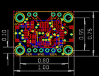
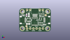
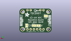
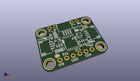

Contents
========

* [PROJ-ADAF-5423-STAN-01>Adafruit TSC2007 PCB](#proj-adaf-5423-stan-01adafruit-tsc2007-pcb)
	* [Images](#images)
	* [Interactive BOM](#interactive-bom)
	* [OOMP Parts](#oomp-parts)
	* [Tags](#tags)
  
![][im]
# PROJ-ADAF-5423-STAN-01>Adafruit TSC2007 PCB

- ID: PROJ-ADAF-5423-STAN-01
- Hex ID: PRA5423
- Name: Adafruit TSC2007 PCB
- Description: 

## Images
  
  

|eagleImage|kicadPcb3dFront|kicadPcb3dBack|kicadPcb3d|
| :---: | :---: | :---: | :---: |
|||||

## Interactive BOM

- Interactive BOM page: [ibom.html](kicad/bom/ibom.html)

## OOMP Parts
  

|OOMP Parts|
| :---: |
|CAPE-0603-X-NF100-01, C1, 5.968999999999999, 13.462, 90,C1, 0.1uF, 0603-NO, microbuilder, (0.235, 0.53), R90|
|CAPE-0805-X-UNMATCHED-01, C2, 7.112, 6.35, 0,C2, 10uF, 0805-NO, microbuilder, (0.28, 0.25), R0|
|CAPE-0805-X-UNMATCHED-01, C3, 7.746999999999999, 13.5255, 90,C3, 10uF, 0805-NO, microbuilder, (0.305, 0.5325), R90|
|UNMATCHED-UNMATCHED-X-UNMATCHED-01, CONN3, 22.733, 9.524999999999999, 90,CONN3, STEMMA_I2C_QT, JST_SH4, microbuilder, (0.895, 0.375), R90|
|UNMATCHED-UNMATCHED-X-UNMATCHED-01, CONN4, 2.667, 9.524999999999999, 270,CONN4, STEMMA_I2C_QT, JST_SH4, microbuilder, (0.105, 0.375), R270|
|UNMATCHED-UNMATCHED-X-UNMATCHED-01, D1, 3.175, 13.589, 90,D1, GREEN, CHIPLED_0603_NOOUTLINE, microbuilder, (0.125, 0.535), R90|
|UNMATCHED-UNMATCHED-X-UNMATCHED-01, D2, 20.574, 5.588, 270,D2, RED, CHIPLED_0603_NOOUTLINE, microbuilder, (0.81, 0.22), R270|
|UNMATCHED-UNMATCHED-X-UNMATCHED-01, IC1, 12.446, 8.254999999999999, 180,IC1, TSC2007PW, TSSOP16, adafruit_sensor, (0.49, 0.325), R180|
|UNMATCHED-UNMATCHED-X-UNMATCHED-01, JP1, 12.7, 2.54, 0,JP1, 1X06_ROUND_70, microbuilder, (0.5, 0.1), R0|
|UNMATCHED-UNMATCHED-X-UNMATCHED-01, JP4, 17.779999999999998, 17.779999999999998, 180,JP4, 1X02_ROUND, microbuilder, (0.7, 0.7), R180|
|UNMATCHED-UNMATCHED-X-UNMATCHED-01, JP5, 7.619999999999999, 17.779999999999998, 0,JP5, 1X02_ROUND, microbuilder, (0.3, 0.7), R0|
|UNMATCHED-UNMATCHED-X-UNMATCHED-01, Q2, 17.0815, 10.413999999999998, 90,Q2, BSS138, SOT363, microbuilder, (0.6725, 0.41), R90|
|RESE-UNMATCHED-X-O103-01, R1, 17.272000000000002, 6.35, 180,R1, 10K, RESPACK_4X0603, microbuilder, (0.68, 0.25), R180|
|RESE-UNMATCHED-X-O103-01, R3, 18.160999999999998, 13.589, 180,R3, 10K, RESPACK_4X0603, microbuilder, (0.715, 0.535), R180|
|UNMATCHED-UNMATCHED-X-UNMATCHED-01, SJ1, 10.287, 5.460999999999999, M180,SJ1, SOLDERJUMPER_ARROW_NOPASTE, microbuilder, (0.405, 0.215), MR180|
|UNMATCHED-UNMATCHED-X-UNMATCHED-01, SJ2, 13.843, 5.460999999999999, M0,SJ2, SOLDERJUMPER_ARROW_NOPASTE, microbuilder, (0.545, 0.215), MR0|
|UNMATCHED-UNMATCHED-X-UNMATCHED-01, SJ3, 4.444999999999999, 13.081, M0,SJ3, SOLDERJUMPER_CLOSEDWIRE, microbuilder, (0.175, 0.515), MR0|
|UNMATCHED-UNMATCHED-X-UNMATCHED-01, SJ4, 19.685, 5.460999999999999, M90,SJ4, SOLDERJUMPER_CLOSEDWIRE, microbuilder, (0.775, 0.215), MR90|
|UNMATCHED-UNMATCHED-X-UNMATCHED-01, U2, 7.874, 9.652, 0,U2, AP2112K-3.3, SOT23-5, adafruit_power, (0.31, 0.38), R0|

## Tags

- hexID: PRA5423
- oompType: PROJ
- oompSize: ADAF
- oompColor: 5423
- oompDesc: STAN
- oompIndex: 01
- oompName: Adafruit TSC2007 PCB
- sources: All source files from https://github.com/adafruit/Adafruit-TSC2007-PCB (source licence details in srcLicense.md)
- linkBuyPage: http://www.adafruit.com/products/5423
- oompPart: CAPE-0603-X-NF100-01, C1, 5.968999999999999, 13.462, 90
- oompPart: CAPE-0805-X-UNMATCHED-01, C2, 7.112, 6.35, 0
- oompPart: CAPE-0805-X-UNMATCHED-01, C3, 7.746999999999999, 13.5255, 90
- oompPart: UNMATCHED-UNMATCHED-X-UNMATCHED-01, CONN3, 22.733, 9.524999999999999, 90
- oompPart: UNMATCHED-UNMATCHED-X-UNMATCHED-01, CONN4, 2.667, 9.524999999999999, 270
- oompPart: UNMATCHED-UNMATCHED-X-UNMATCHED-01, D1, 3.175, 13.589, 90
- oompPart: UNMATCHED-UNMATCHED-X-UNMATCHED-01, D2, 20.574, 5.588, 270
- oompPart: SKIP-UNMATCHED-X-UNMATCHED-01, FID3, 5.842, 4.5085, 0
- oompPart: SKIP-UNMATCHED-X-UNMATCHED-01, FID4, 21.2725, 13.5255, 0
- oompPart: UNMATCHED-UNMATCHED-X-UNMATCHED-01, IC1, 12.446, 8.254999999999999, 180
- oompPart: UNMATCHED-UNMATCHED-X-UNMATCHED-01, JP1, 12.7, 2.54, 0
- oompPart: UNMATCHED-UNMATCHED-X-UNMATCHED-01, JP4, 17.779999999999998, 17.779999999999998, 180
- oompPart: UNMATCHED-UNMATCHED-X-UNMATCHED-01, JP5, 7.619999999999999, 17.779999999999998, 0
- oompPart: UNMATCHED-UNMATCHED-X-UNMATCHED-01, Q2, 17.0815, 10.413999999999998, 90
- oompPart: RESE-UNMATCHED-X-O103-01, R1, 17.272000000000002, 6.35, 180
- oompPart: RESE-UNMATCHED-X-O103-01, R3, 18.160999999999998, 13.589, 180
- oompPart: UNMATCHED-UNMATCHED-X-UNMATCHED-01, SJ1, 10.287, 5.460999999999999, M180
- oompPart: UNMATCHED-UNMATCHED-X-UNMATCHED-01, SJ2, 13.843, 5.460999999999999, M0
- oompPart: UNMATCHED-UNMATCHED-X-UNMATCHED-01, SJ3, 4.444999999999999, 13.081, M0
- oompPart: UNMATCHED-UNMATCHED-X-UNMATCHED-01, SJ4, 19.685, 5.460999999999999, M90
- oompPart: SKIP-UNMATCHED-X-UNMATCHED-01, U$1, 2.54, 16.509999999999998, 0
- oompPart: SKIP-UNMATCHED-X-UNMATCHED-01, U$4, 12.7, 14.477999999999998, 180
- oompPart: SKIP-UNMATCHED-X-UNMATCHED-01, U$17, 22.86, 16.509999999999998, 0
- oompPart: SKIP-UNMATCHED-X-UNMATCHED-01, U$19, 2.54, 2.54, 0
- oompPart: SKIP-UNMATCHED-X-UNMATCHED-01, U$21, 22.86, 2.54, 0
- oompPart: UNMATCHED-UNMATCHED-X-UNMATCHED-01, U2, 7.874, 9.652, 0
- rawPart: C1, 0.1uF, 0603-NO, microbuilder, (0.235, 0.53), R90
- rawPart: C2, 10uF, 0805-NO, microbuilder, (0.28, 0.25), R0
- rawPart: C3, 10uF, 0805-NO, microbuilder, (0.305, 0.5325), R90
- rawPart: CONN3, STEMMA_I2C_QT, JST_SH4, microbuilder, (0.895, 0.375), R90
- rawPart: CONN4, STEMMA_I2C_QT, JST_SH4, microbuilder, (0.105, 0.375), R270
- rawPart: D1, GREEN, CHIPLED_0603_NOOUTLINE, microbuilder, (0.125, 0.535), R90
- rawPart: D2, RED, CHIPLED_0603_NOOUTLINE, microbuilder, (0.81, 0.22), R270
- rawPart: FID3, FIDUCIAL_1MM, FIDUCIAL_1MM, microbuilder, (0.23, 0.1775), R0
- rawPart: FID4, FIDUCIAL_1MM, FIDUCIAL_1MM, microbuilder, (0.8375, 0.5325), R0
- rawPart: IC1, TSC2007PW, TSSOP16, adafruit_sensor, (0.49, 0.325), R180
- rawPart: JP1, 1X06_ROUND_70, microbuilder, (0.5, 0.1), R0
- rawPart: JP4, 1X02_ROUND, microbuilder, (0.7, 0.7), R180
- rawPart: JP5, 1X02_ROUND, microbuilder, (0.3, 0.7), R0
- rawPart: Q2, BSS138, SOT363, microbuilder, (0.6725, 0.41), R90
- rawPart: R1, 10K, RESPACK_4X0603, microbuilder, (0.68, 0.25), R180
- rawPart: R3, 10K, RESPACK_4X0603, microbuilder, (0.715, 0.535), R180
- rawPart: SJ1, SOLDERJUMPER_ARROW_NOPASTE, microbuilder, (0.405, 0.215), MR180
- rawPart: SJ2, SOLDERJUMPER_ARROW_NOPASTE, microbuilder, (0.545, 0.215), MR0
- rawPart: SJ3, SOLDERJUMPER_CLOSEDWIRE, microbuilder, (0.175, 0.515), MR0
- rawPart: SJ4, SOLDERJUMPER_CLOSEDWIRE, microbuilder, (0.775, 0.215), MR90
- rawPart: U$1, MOUNTINGHOLE2.5, MOUNTINGHOLE_2.5_PLATED, adafruit_electromech, (0.1, 0.65), R0
- rawPart: U$4, FPC_4PIN_12969, FPC_CONN_1MM_DUAL_4P, microbuilder, (0.5, 0.57), R180
- rawPart: U$17, MOUNTINGHOLE2.5, MOUNTINGHOLE_2.5_PLATED, adafruit_electromech, (0.9, 0.65), R0
- rawPart: U$19, MOUNTINGHOLE2.5, MOUNTINGHOLE_2.5_PLATED, adafruit_electromech, (0.1, 0.1), R0
- rawPart: U$21, MOUNTINGHOLE2.5, MOUNTINGHOLE_2.5_PLATED, adafruit_electromech, (0.9, 0.1), R0
- rawPart: U2, AP2112K-3.3, SOT23-5, adafruit_power, (0.31, 0.38), R0

[im]: kicadPcb3d_450.png
