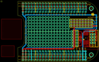

Contents
========

* [PROJ-ADAF-572-STAN-01>Adafruit BeagleBone ProtoBoard PCB](#proj-adaf-572-stan-01adafruit-beaglebone-protoboard-pcb)
	* [Images](#images)
	* [Tags](#tags)
  
![][im]
# PROJ-ADAF-572-STAN-01>Adafruit BeagleBone ProtoBoard PCB

- ID: PROJ-ADAF-572-STAN-01
- Hex ID: PRA572
- Name: Adafruit BeagleBone ProtoBoard PCB
- Description: 

## Images
  
  

|eagleImage|
| :---: |
||

## Tags

- hexID: PRA572
- oompType: PROJ
- oompSize: ADAF
- oompColor: 572
- oompDesc: STAN
- oompIndex: 01
- oompName: Adafruit BeagleBone ProtoBoard PCB
- sources: All source files from https://github.com/adafruit/Adafruit-BeagleBone-ProtoBoard-PCB (source licence details in srcLicense.md)
- linkBuyPage: http://www.adafruit.com/products/572

[im]: eagleImage_450.png
