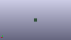

Contents
========

* [PRA572 > Adafruit BeagleBone ProtoBoard PCB](#pra572--adafruit-beaglebone-protoboard-pcb)
	* [Schematic](#schematic)
	* [PCB](#pcb)
	* [OOMP Parts](#oomp-parts)
	* [Images](#images)
	* [Tags](#tags)
  
![][im]
# PRA572 > Adafruit BeagleBone ProtoBoard PCB

- ID: PROJ-ADAF-572-STAN-01
- Hex ID: PRA572
- Name: Adafruit
- Description: Adafruit
- Long Link: [http://oom.lt/PROJ-ADAF-572-STAN-01](http://oom.lt/PROJ-ADAF-572-STAN-01)
- Short Link: [http://oom.lt/PRA572](http://oom.lt/PRA572)

## Schematic
  

## PCB
  

## OOMP Parts
  

|OOMP ID|Name|Identifier|
| :---: | :---: | :---: |
|HEAD-I01-X-PI23-01||JP1, JP2, JP3, JP4|
|HEAD-I01-X-PI11-01||JP5, JP6, JP11, JP12, JP13, JP14, JP15, JP16, JP17, JP18, JP19, JP20, JP21, JP22, JP23|
|[HEAD-I01-X-PI08-01](https://github.com/oomlout/oomlout_OOMP_parts/tree/main/HEAD-I01-X-PI08-01/)|[2.54 mm 8 Pin Header](https://github.com/oomlout/oomlout_OOMP_parts/tree/main/HEAD-I01-X-PI08-01/)|[JP7, JP8, JP24](https://github.com/oomlout/oomlout_OOMP_parts/tree/main/HEAD-I01-X-PI08-01/)|
|[HEAD-I01-X-PI04-01](https://github.com/oomlout/oomlout_OOMP_parts/tree/main/HEAD-I01-X-PI04-01/)|[2.54 mm 4 Pin Header](https://github.com/oomlout/oomlout_OOMP_parts/tree/main/HEAD-I01-X-PI04-01/)|[JP9, JP10](https://github.com/oomlout/oomlout_OOMP_parts/tree/main/HEAD-I01-X-PI04-01/)|
|[HEAD-I01-X-PI06-01](https://github.com/oomlout/oomlout_OOMP_parts/tree/main/HEAD-I01-X-PI06-01/)|[2.54 mm 6 Pin Header](https://github.com/oomlout/oomlout_OOMP_parts/tree/main/HEAD-I01-X-PI06-01/)|[JP26](https://github.com/oomlout/oomlout_OOMP_parts/tree/main/HEAD-I01-X-PI06-01/)|
|[HEAD-I01-X-PI03-01](https://github.com/oomlout/oomlout_OOMP_parts/tree/main/HEAD-I01-X-PI03-01/)|[2.54 mm 3 Pin Header](https://github.com/oomlout/oomlout_OOMP_parts/tree/main/HEAD-I01-X-PI03-01/)|[JP34, JP35](https://github.com/oomlout/oomlout_OOMP_parts/tree/main/HEAD-I01-X-PI03-01/)|
|UNMATCHED-UNMATCHED-X-UNMATCHED-01||U$2, U1|
|UNMATCHED-SO23-X-UNMATCHED-01||U2|

## Images
  
  

|kicadPcb3d|kicadPcb3dFront|kicadPcb3dBack|eagleImage|eagleSchemImage|
| :---: | :---: | :---: | :---: | :---: |
||||||

## Tags

- hexID: PRA572
- oompType: PROJ
- oompSize: ADAF
- oompColor: 572
- oompDesc: STAN
- oompIndex: 01
- oompName: Adafruit BeagleBone ProtoBoard PCB
- sources: All source files from https://github.com/adafruit/Adafruit-BeagleBone-ProtoBoard-PCB (source licence details in srcLicense.md)
- linkBuyPage: http://www.adafruit.com/products/572
- oompID: PROJ-ADAF-572-STAN-01
- oompParts: JP1,HEAD-I01-X-PI23-01
- oompParts: JP2,HEAD-I01-X-PI23-01
- oompParts: JP3,HEAD-I01-X-PI23-01
- oompParts: JP4,HEAD-I01-X-PI23-01
- oompParts: JP5,HEAD-I01-X-PI11-01
- oompParts: JP6,HEAD-I01-X-PI11-01
- oompParts: JP7,HEAD-I01-X-PI08-01
- oompParts: JP8,HEAD-I01-X-PI08-01
- oompParts: JP9,HEAD-I01-X-PI04-01
- oompParts: JP10,HEAD-I01-X-PI04-01
- oompParts: JP11,HEAD-I01-X-PI11-01
- oompParts: JP12,HEAD-I01-X-PI11-01
- oompParts: JP13,HEAD-I01-X-PI11-01
- oompParts: JP14,HEAD-I01-X-PI11-01
- oompParts: JP15,HEAD-I01-X-PI11-01
- oompParts: JP16,HEAD-I01-X-PI11-01
- oompParts: JP17,HEAD-I01-X-PI11-01
- oompParts: JP18,HEAD-I01-X-PI11-01
- oompParts: JP19,HEAD-I01-X-PI11-01
- oompParts: JP20,HEAD-I01-X-PI11-01
- oompParts: JP21,HEAD-I01-X-PI11-01
- oompParts: JP22,HEAD-I01-X-PI11-01
- oompParts: JP23,HEAD-I01-X-PI11-01
- oompParts: JP24,HEAD-I01-X-PI08-01
- oompParts: JP26,HEAD-I01-X-PI06-01
- oompParts: JP34,HEAD-I01-X-PI03-01
- oompParts: JP35,HEAD-I01-X-PI03-01
- oompParts: U$2,UNMATCHED-UNMATCHED-X-UNMATCHED-01
- oompParts: U1,UNMATCHED-UNMATCHED-X-UNMATCHED-01
- oompParts: U2,UNMATCHED-SO23-X-UNMATCHED-01
- rawParts: JP1,,HEADER-1X23,1X23_ROUND_70MIL,,,
- rawParts: JP2,,HEADER-1X23,1X23_ROUND_70MIL,,,
- rawParts: JP3,,HEADER-1X23,1X23_ROUND_70MIL,,,
- rawParts: JP4,,HEADER-1X23,1X23_ROUND_70MIL,,,
- rawParts: JP5,,HEADER-1X1176MIL,1X11_ROUND_76,,,
- rawParts: JP6,,HEADER-1X1176MIL,1X11_ROUND_76,,,
- rawParts: JP7,V_3.3V,HEADER-1X870MIL,1X08_ROUND_70,PIN HEADER,,
- rawParts: JP8,V_GND,HEADER-1X870MIL,1X08_ROUND_70,PIN HEADER,,
- rawParts: JP9,,HEADER-1X476MIL,1X04_ROUND_76,PIN HEADER,,
- rawParts: JP10,,HEADER-1X476MIL,1X04_ROUND_76,PIN HEADER,,
- rawParts: JP11,,HEADER-1X1176MIL,1X11_ROUND_76,,,
- rawParts: JP12,,HEADER-1X1176MIL,1X11_ROUND_76,,,
- rawParts: JP13,,HEADER-1X1176MIL,1X11_ROUND_76,,,
- rawParts: JP14,,HEADER-1X1176MIL,1X11_ROUND_76,,,
- rawParts: JP15,,HEADER-1X1176MIL,1X11_ROUND_76,,,
- rawParts: JP16,,HEADER-1X1176MIL,1X11_ROUND_76,,,
- rawParts: JP17,,HEADER-1X1176MIL,1X11_ROUND_76,,,
- rawParts: JP18,,HEADER-1X1176MIL,1X11_ROUND_76,,,
- rawParts: JP19,,HEADER-1X1176MIL,1X11_ROUND_76,,,
- rawParts: JP20,,HEADER-1X1176MIL,1X11_ROUND_76,,,
- rawParts: JP21,,HEADER-1X1176MIL,1X11_ROUND_76,,,
- rawParts: JP22,,HEADER-1X1176MIL,1X11_ROUND_76,,,
- rawParts: JP23,,HEADER-1X1176MIL,1X11_ROUND_76,,,
- rawParts: JP24,V_5V,HEADER-1X870MIL,1X08_ROUND_70,PIN HEADER,,
- rawParts: JP26,,HEADER-1X676MIL,1X06_ROUND_76,PIN HEADER,,
- rawParts: JP34,,HEADER-1X376MIL,1X03_ROUND_76,PIN HEADER,,
- rawParts: JP35,,HEADER-1X376MIL,1X03_ROUND_76,PIN HEADER,,
- rawParts: U$2,BEAGLEBONE_OUTLINE,BEAGLEBONE_OUTLINE,BEAGLEBONE_SHIELD,,,
- rawParts: U$22,MOUNTINGHOLE3.0THIN,MOUNTINGHOLE3.0THIN,MOUNTINGHOLE_3.0_PLATEDTHIN,Mounting Hole,,
- rawParts: U$23,MOUNTINGHOLE3.0THIN,MOUNTINGHOLE3.0THIN,MOUNTINGHOLE_3.0_PLATEDTHIN,Mounting Hole,,
- rawParts: U1,,BREAKOUT_SOIC8,BREAKOUT_SOIC8,SOIC8 IC Breakout,,
- rawParts: U2,,BREAKOUT_SOT23-6,BREAKOUT_SOT23-6,IC Breakout SOT23-6,,

[im]: kicadPcb3d_450.png
