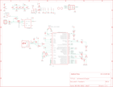

Contents
========

* [PRA659 > Adafruit Flora Mainboard](#pra659--adafruit-flora-mainboard)
	* [Schematic](#schematic)
	* [PCB](#pcb)
	* [Interactive BOM](#interactive-bom)
	* [OOMP Parts](#oomp-parts)
	* [Images](#images)
	* [Tags](#tags)
  
![][im]
# PRA659 > Adafruit Flora Mainboard

- ID: PROJ-ADAF-659-STAN-01
- Hex ID: PRA659
- Name: Adafruit
- Description: Adafruit
- Long Link: [http://oom.lt/PROJ-ADAF-659-STAN-01](http://oom.lt/PROJ-ADAF-659-STAN-01)
- Short Link: [http://oom.lt/PRA659](http://oom.lt/PRA659)

## Schematic
  

## PCB
  

## Interactive BOM

- Interactive BOM page: [ibom.html](https://htmlpreview.github.io/?https://github.com/oomlout/oomlout_OOMP_projects/blob/main/PROJ-ADAF-659-STAN-01/kicad/bom/ibom.html)

## OOMP Parts
  

|OOMP Parts|
| :---: |
|BATT BATT,UNMATCHED-UNMATCHED-X-UNMATCHED-01|
|BOOT BOOT,UNMATCHED-UNMATCHED-X-UNMATCHED-01|
|C2 C2,CAPC-0805-X-PF18-01|
|C3 C3,CAPC-0805-X-PF18-01|
|[C4 CAPC-0805-X-UF10-V10 SMD (0805) 10 uF Capacitor (Ceramic) 10v](https://github.com/oomlout/oomlout_OOMP_parts/tree/main/CAPC-0805-X-UF10-V10/)|
|[C5 CAPC-0805-X-UF10-V10 SMD (0805) 10 uF Capacitor (Ceramic) 10v](https://github.com/oomlout/oomlout_OOMP_parts/tree/main/CAPC-0805-X-UF10-V10/)|
|[C6 CAPC-0805-X-UF10-V10 SMD (0805) 10 uF Capacitor (Ceramic) 10v](https://github.com/oomlout/oomlout_OOMP_parts/tree/main/CAPC-0805-X-UF10-V10/)|
|[C7 CAPC-0805-X-UF10-V10 SMD (0805) 10 uF Capacitor (Ceramic) 10v](https://github.com/oomlout/oomlout_OOMP_parts/tree/main/CAPC-0805-X-UF10-V10/)|
|[C8 CAPC-0805-X-UF10-V10 SMD (0805) 10 uF Capacitor (Ceramic) 10v](https://github.com/oomlout/oomlout_OOMP_parts/tree/main/CAPC-0805-X-UF10-V10/)|
|[C9 CAPC-0805-X-UF10-V10 SMD (0805) 10 uF Capacitor (Ceramic) 10v](https://github.com/oomlout/oomlout_OOMP_parts/tree/main/CAPC-0805-X-UF10-V10/)|
|CN1 CN1,UNMATCHED-UNMATCHED-X-UNMATCHED-01|
|D1 D1,DIOD-S123-X-UNMATCHED-01|
|D2 D2,DIOD-S123-X-UNMATCHED-01|
|IC1 IC1,UNMATCHED-UNMATCHED-X-UNMATCHED-01|
|IC2 IC2,VREG-SO235-X-KLP298XS-V33D|
|JP1 JP1,UNMATCHED-UNMATCHED-X-UNMATCHED-01|
|[L LEDS-0805-G-STAN-01 SMD (0805) Green LED](https://github.com/oomlout/oomlout_OOMP_parts/tree/main/LEDS-0805-G-STAN-01/)|
|L1 L1,UNMATCHED-1206-X-UNMATCHED-01|
|ON/OFF ON/OFF,UNMATCHED-UNMATCHED-X-UNMATCHED-01|
|[PWR LEDS-0805-G-STAN-01 SMD (0805) Green LED](https://github.com/oomlout/oomlout_OOMP_parts/tree/main/LEDS-0805-G-STAN-01/)|
|[R1 RESE-0805-X-O220-01 SMD (0805) 22 Ohm Resistor](https://github.com/oomlout/oomlout_OOMP_parts/tree/main/RESE-0805-X-O220-01/)|
|[R2 RESE-0805-X-O220-01 SMD (0805) 22 Ohm Resistor](https://github.com/oomlout/oomlout_OOMP_parts/tree/main/RESE-0805-X-O220-01/)|
|R3 R3,RESE-0805-X-O471-01|
|[R4 RESE-0805-X-O102-01 SMD (0805) 1k Ohm Resistor](https://github.com/oomlout/oomlout_OOMP_parts/tree/main/RESE-0805-X-O102-01/)|
|[R5 RESE-0805-X-O102-01 SMD (0805) 1k Ohm Resistor](https://github.com/oomlout/oomlout_OOMP_parts/tree/main/RESE-0805-X-O102-01/)|
|[R6 RESE-0805-X-O102-01 SMD (0805) 1k Ohm Resistor](https://github.com/oomlout/oomlout_OOMP_parts/tree/main/RESE-0805-X-O102-01/)|
|[R7 RESE-0805-X-O103-01 SMD (0805) 10k Ohm Resistor](https://github.com/oomlout/oomlout_OOMP_parts/tree/main/RESE-0805-X-O103-01/)|
|R8 R8,RESE-0805-X-O1503-01|
|[R9 RESE-0805-X-O103-01 SMD (0805) 10k Ohm Resistor](https://github.com/oomlout/oomlout_OOMP_parts/tree/main/RESE-0805-X-O103-01/)|
|[RXLED LEDS-0805-G-STAN-01 SMD (0805) Green LED](https://github.com/oomlout/oomlout_OOMP_parts/tree/main/LEDS-0805-G-STAN-01/)|
|T1 T1,UNMATCHED-UNMATCHED-X-UNMATCHED-01|
|[TXLED LEDS-0805-G-STAN-01 SMD (0805) Green LED](https://github.com/oomlout/oomlout_OOMP_parts/tree/main/LEDS-0805-G-STAN-01/)|
|X3 X3,UNMATCHED-UNMATCHED-X-UNMATCHED-01|

## Images
  
  

|kicadPcb3d|kicadPcb3dFront|kicadPcb3dBack|eagleImage|eagleSchemImage|
| :---: | :---: | :---: | :---: | :---: |
||||||

## Tags

- hexID: PRA659
- oompType: PROJ
- oompSize: ADAF
- oompColor: 659
- oompDesc: STAN
- oompIndex: 01
- oompName: Adafruit Flora Mainboard
- sources: All source files from https://github.com/adafruit/Adafruit-Flora-Mainboard (source licence details in srcLicense.md)
- linkBuyPage: http://www.adafruit.com/products/659
- oompID: PROJ-ADAF-659-STAN-01
- oompParts: BATT,UNMATCHED-UNMATCHED-X-UNMATCHED-01
- oompParts: BOOT,UNMATCHED-UNMATCHED-X-UNMATCHED-01
- oompParts: C2,CAPC-0805-X-PF18-01
- oompParts: C3,CAPC-0805-X-PF18-01
- oompParts: C4,CAPC-0805-X-UF10-V10
- oompParts: C5,CAPC-0805-X-UF10-V10
- oompParts: C6,CAPC-0805-X-UF10-V10
- oompParts: C7,CAPC-0805-X-UF10-V10
- oompParts: C8,CAPC-0805-X-UF10-V10
- oompParts: C9,CAPC-0805-X-UF10-V10
- oompParts: CN1,UNMATCHED-UNMATCHED-X-UNMATCHED-01
- oompParts: D1,DIOD-S123-X-UNMATCHED-01
- oompParts: D2,DIOD-S123-X-UNMATCHED-01
- oompParts: IC1,UNMATCHED-UNMATCHED-X-UNMATCHED-01
- oompParts: IC2,VREG-SO235-X-KLP298XS-V33D
- oompParts: JP1,UNMATCHED-UNMATCHED-X-UNMATCHED-01
- oompParts: L,LEDS-0805-G-STAN-01
- oompParts: L1,UNMATCHED-1206-X-UNMATCHED-01
- oompParts: ON/OFF,UNMATCHED-UNMATCHED-X-UNMATCHED-01
- oompParts: PWR,LEDS-0805-G-STAN-01
- oompParts: R1,RESE-0805-X-O220-01
- oompParts: R2,RESE-0805-X-O220-01
- oompParts: R3,RESE-0805-X-O471-01
- oompParts: R4,RESE-0805-X-O102-01
- oompParts: R5,RESE-0805-X-O102-01
- oompParts: R6,RESE-0805-X-O102-01
- oompParts: R7,RESE-0805-X-O103-01
- oompParts: R8,RESE-0805-X-O1503-01
- oompParts: R9,RESE-0805-X-O103-01
- oompParts: RXLED,LEDS-0805-G-STAN-01
- oompParts: T1,UNMATCHED-UNMATCHED-X-UNMATCHED-01
- oompParts: TXLED,LEDS-0805-G-STAN-01
- oompParts: X3,UNMATCHED-UNMATCHED-X-UNMATCHED-01
- rawParts: 3.3VTAP,SEWTAP-2.0IN,SEWTAP-2.0IN,SEWINGTAP_2.0,,,
- rawParts: 3V3TAP2,SEWTAP-2.0IN,SEWTAP-2.0IN,SEWINGTAP_2.0,,,
- rawParts: BATT,3-9VDC,JST_2PIN-SMT-RA,JST-PH-2-SMT-RA,JST 2-Pin Connectors of various flavors,,
- rawParts: BOOT,SPST_TACT-KMR2,SPST_TACT-KMR2,KMR2,SMT 6mm switch, EVQQ2 series,,
- rawParts: C2,18pF,C-USC0805K,C0805K,CAPACITOR, American symbol,,
- rawParts: C3,18pF,C-USC0805K,C0805K,CAPACITOR, American symbol,,
- rawParts: C4,10uF,C-USC0805K,C0805K,CAPACITOR, American symbol,,
- rawParts: C5,10uF,C-USC0805K,C0805K,CAPACITOR, American symbol,,
- rawParts: C6,10uF,C-USC0805K,C0805K,CAPACITOR, American symbol,,
- rawParts: C7,10uF,C-USC0805K,C0805K,CAPACITOR, American symbol,,
- rawParts: C8,10uF,C-USC0805K,C0805K,CAPACITOR, American symbol,,
- rawParts: C9,10uF,C-USC0805K,C0805K,CAPACITOR, American symbol,,
- rawParts: CN1,MiniB USB,USBMINIBLARGE,USB-MINIB_LARGER,USB Connectors,,
- rawParts: D1,SCHOTTKY,DIODESOD-123,SOD-123,Diode,,
- rawParts: D2,SCHOTTKY,DIODESOD-123,SOD-123,Diode,,
- rawParts: D6,SEWTAP-2.0IN,SEWTAP-2.0IN,SEWINGTAP_2.0,,,
- rawParts: GND3TAP,SEWTAP-2.0IN,SEWTAP-2.0IN,SEWINGTAP_2.0,,,
- rawParts: GNDTAP,SEWTAP-2.0IN,SEWTAP-2.0IN,SEWINGTAP_2.0,,,
- rawParts: GNDTAP2,SEWTAP-2.0IN,SEWTAP-2.0IN,SEWINGTAP_2.0,,,
- rawParts: IC1,ATMEGA32U4-AU,ATMEGA32U4-AU,TQFP44,,,
- rawParts: IC2,LP2985-3.3v,LP298XS,SOT23-5L,,,
- rawParts: IO9,SEWTAP-2.0IN,SEWTAP-2.0IN,SEWINGTAP_2.0,,,
- rawParts: IO10,SEWTAP-2.0IN,SEWTAP-2.0IN,SEWINGTAP_2.0,,,
- rawParts: IO12,SEWTAP-2.0IN,SEWTAP-2.0IN,SEWINGTAP_2.0,,,
- rawParts: JP1,ICSP,PINHD-2X3,2X03,PIN HEADER,,
- rawParts: L,RED,LEDCHIPLED_0805,CHIPLED_0805,LED,,
- rawParts: L1,500mA,PTCFUSE-1206,R1206,PTC fuses, resettable thermistors,,
- rawParts: ON/OFF,EG1390,DPDT-EG1390,EG1390,,,
- rawParts: PWR,GREEN,LEDCHIPLED_0805,CHIPLED_0805,LED,,
- rawParts: R1,22,R-US_R0805,R0805,RESISTOR, American symbol,,
- rawParts: R2,22,R-US_R0805,R0805,RESISTOR, American symbol,,
- rawParts: R3,470,R-US_R0805,R0805,RESISTOR, American symbol,,
- rawParts: R4,1K,R-US_R0805,R0805,RESISTOR, American symbol,,
- rawParts: R5,1K,R-US_R0805,R0805,RESISTOR, American symbol,,
- rawParts: R6,1K,R-US_R0805,R0805,RESISTOR, American symbol,,
- rawParts: R7,10K,R-US_R0805,R0805,RESISTOR, American symbol,,
- rawParts: R8,150K,R-US_R0805,R0805,RESISTOR, American symbol,,
- rawParts: R9,10K,R-US_R0805,R0805,RESISTOR, American symbol,,
- rawParts: RX,SEWTAP-2.0IN,SEWTAP-2.0IN,SEWINGTAP_2.0,,,
- rawParts: RXLED,YELLOW,LEDCHIPLED_0805,CHIPLED_0805,LED,,
- rawParts: SCL,SEWTAP-2.0IN,SEWTAP-2.0IN,SEWINGTAP_2.0,,,
- rawParts: SDA,SEWTAP-2.0IN,SEWTAP-2.0IN,SEWINGTAP_2.0,,,
- rawParts: T1,IRLML2246,PMOSSOT23,SOT-23,MOS FET,,
- rawParts: TX,SEWTAP-2.0IN,SEWTAP-2.0IN,SEWINGTAP_2.0,,,
- rawParts: TXLED,YELLOW,LEDCHIPLED_0805,CHIPLED_0805,LED,,
- rawParts: U$2,FIDUCIAL,FIDUCIAL,FIDUCIAL_1MM,For use by pick and place machines to calibrate the vision/machine, 1mm,,
- rawParts: U$6,FIDUCIAL,FIDUCIAL,FIDUCIAL_1MM,For use by pick and place machines to calibrate the vision/machine, 1mm,,
- rawParts: VCC2,SEWTAP-2.0IN,SEWTAP-2.0IN,SEWINGTAP_2.0,,,
- rawParts: X3,8MHz,XTALNX5032,NX5032,,,

[im]: kicadPcb3d_450.png
