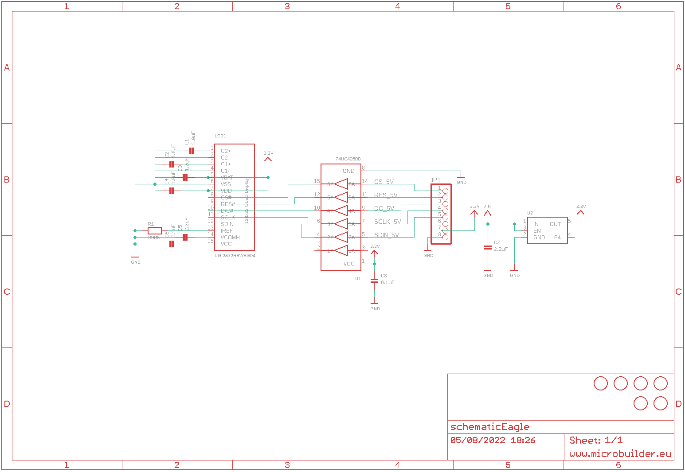
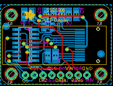
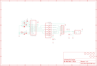

Contents
========

* [PRA661 > Adafruit 128x32 SPI OLED breakout board PCB](#pra661--adafruit-128x32-spi-oled-breakout-board-pcb)
	* [Schematic](#schematic)
	* [PCB](#pcb)
	* [OOMP Parts](#oomp-parts)
	* [Images](#images)
	* [Tags](#tags)
  
![][im]
# PRA661 > Adafruit 128x32 SPI OLED breakout board PCB

- ID: PROJ-ADAF-661-STAN-01
- Hex ID: PRA661
- Name: Adafruit 661
- Description: Adafruit 661
- Long Link: [http://oom.lt/PROJ-ADAF-661-STAN-01](http://oom.lt/PROJ-ADAF-661-STAN-01)
- Short Link: [http://oom.lt/PRA661](http://oom.lt/PRA661)

## Schematic
  

## PCB
  

## OOMP Parts
  

|OOMP ID|Name|Identifier|
| :---: | :---: | :---: |
|CAPC-0805-X-UNMATCHED-01||C1, C2, C3, C4|
|[CAPC-0805-X-UF22D-V25](https://github.com/oomlout/oomlout_OOMP_parts/tree/main/CAPC-0805-X-UF22D-V25/)|[SMD (0805) 2.2 uF Capacitor (Ceramic) 25v](https://github.com/oomlout/oomlout_OOMP_parts/tree/main/CAPC-0805-X-UF22D-V25/)|[C5, C6, C7](https://github.com/oomlout/oomlout_OOMP_parts/tree/main/CAPC-0805-X-UF22D-V25/)|
|[CAPC-0805-X-NF100-V50](https://github.com/oomlout/oomlout_OOMP_parts/tree/main/CAPC-0805-X-NF100-V50/)|[SMD (0805) 100 nF Capacitor (Ceramic) 50v](https://github.com/oomlout/oomlout_OOMP_parts/tree/main/CAPC-0805-X-NF100-V50/)|[C8](https://github.com/oomlout/oomlout_OOMP_parts/tree/main/CAPC-0805-X-NF100-V50/)|
|[HEAD-I01-X-PI08-01](https://github.com/oomlout/oomlout_OOMP_parts/tree/main/HEAD-I01-X-PI08-01/)|[2.54 mm 8 Pin Header](https://github.com/oomlout/oomlout_OOMP_parts/tree/main/HEAD-I01-X-PI08-01/)|[JP1](https://github.com/oomlout/oomlout_OOMP_parts/tree/main/HEAD-I01-X-PI08-01/)|
|UNMATCHED-UNMATCHED-X-UNMATCHED-01||LCD1, U1|
|RESE-0805-X-O3903-01||R1|
|UNMATCHED-SO235-X-UNMATCHED-01||U2|

## Images
  
  

|kicadPcb3d|kicadPcb3dFront|kicadPcb3dBack|eagleImage|eagleSchemImage|
| :---: | :---: | :---: | :---: | :---: |
||||||

## Tags

- hexID: PRA661
- oompType: PROJ
- oompSize: ADAF
- oompColor: 661
- oompDesc: STAN
- oompIndex: 01
- oompName: Adafruit 128x32 SPI OLED breakout board PCB
- sources: All source files from https://github.com/adafruit/Adafruit-128x32-SPI-OLED-breakout-board-PCB (source licence details in srcLicense.md)
- linkBuyPage: http://www.adafruit.com/products/661
- oompID: PROJ-ADAF-661-STAN-01
- oompParts: C1,CAPC-0805-X-UNMATCHED-01
- oompParts: C2,CAPC-0805-X-UNMATCHED-01
- oompParts: C3,CAPC-0805-X-UNMATCHED-01
- oompParts: C4,CAPC-0805-X-UNMATCHED-01
- oompParts: C5,CAPC-0805-X-UF22D-V25
- oompParts: C6,CAPC-0805-X-UF22D-V25
- oompParts: C7,CAPC-0805-X-UF22D-V25
- oompParts: C8,CAPC-0805-X-NF100-V50
- oompParts: JP1,HEAD-I01-X-PI08-01
- oompParts: LCD1,UNMATCHED-UNMATCHED-X-UNMATCHED-01
- oompParts: R1,RESE-0805-X-O3903-01
- oompParts: U1,UNMATCHED-UNMATCHED-X-UNMATCHED-01
- oompParts: U2,UNMATCHED-SO235-X-UNMATCHED-01
- rawParts: C1,1.0uF,CAP_CERAMIC0805,0805,Ceramic Capacitors,,
- rawParts: C2,1.0uF,CAP_CERAMIC0805,0805,Ceramic Capacitors,,
- rawParts: C3,1.0uF,CAP_CERAMIC0805,0805,Ceramic Capacitors,,
- rawParts: C4,1.0uF,CAP_CERAMIC0805,0805,Ceramic Capacitors,,
- rawParts: C5,2.2uF,CAP_CERAMIC0805,0805,Ceramic Capacitors,,
- rawParts: C6,2.2uF,CAP_CERAMIC0805,0805,Ceramic Capacitors,,
- rawParts: C7,2.2uF,CAP_CERAMIC0805,0805,Ceramic Capacitors,,
- rawParts: C8,0.1uF,CAP_CERAMIC0805,0805,Ceramic Capacitors,,
- rawParts: JP1,,HEADER-1X876MIL,1X08_ROUND_76,PIN HEADER,,
- rawParts: LCD1,UG-2832HSWEG04,OLED_UG-2832HSWEG04WRAPAROUND,UG-2832HSWEG04_WRAPAROUND,128x32 SPI 0.91 Monochrome OLED Display,,
- rawParts: R1,390K,RESISTOR0805,0805,Resistors,,
- rawParts: U$2,MOUNTINGHOLE2.0,MOUNTINGHOLE2.0,MOUNTINGHOLE_2.0_PLATED,Mounting Hole,,
- rawParts: U$3,MOUNTINGHOLE2.0,MOUNTINGHOLE2.0,MOUNTINGHOLE_2.0_PLATED,Mounting Hole,,
- rawParts: U$4,MOUNTINGHOLE2.0,MOUNTINGHOLE2.0,MOUNTINGHOLE_2.0_PLATED,Mounting Hole,,
- rawParts: U$5,MOUNTINGHOLE2.0,MOUNTINGHOLE2.0,MOUNTINGHOLE_2.0_PLATED,Mounting Hole,,
- rawParts: U$6,FIDUCIAL,FIDUCIAL,FIDUCIAL_1MM,For use by pick and place machines to calibrate the vision/machine, 1mm,,
- rawParts: U$7,FIDUCIAL,FIDUCIAL,FIDUCIAL_1MM,For use by pick and place machines to calibrate the vision/machine, 1mm,,
- rawParts: U1,74HC4050D,74HC4050D,SOIC16,6-channel level shifter,,
- rawParts: U2,,VREG_SOT23-5,SOT23-5,SOT23-5 Fixed Voltage Regulators,,

[im]: kicadPcb3d_450.png
