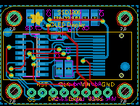

Contents
========

* [PROJ-ADAF-661-STAN-01>Adafruit 128x32 SPI OLED breakout board PCB](#proj-adaf-661-stan-01adafruit-128x32-spi-oled-breakout-board-pcb)
	* [Images](#images)
	* [OOMP Parts](#oomp-parts)
	* [Tags](#tags)
  
![][im]
# PROJ-ADAF-661-STAN-01>Adafruit 128x32 SPI OLED breakout board PCB

- ID: PROJ-ADAF-661-STAN-01
- Hex ID: PRA661
- Name: Adafruit 128x32 SPI OLED breakout board PCB
- Description: 

## Images
  
  

|eagleImage|kicadPcb3dFront|kicadPcb3dBack|kicadPcb3d|
| :---: | :---: | :---: | :---: |
|||||

## OOMP Parts
  

|OOMP Parts|
| :---: |
|CAPE-0805-X-UNMATCHED-01, C1, 13.462, 8.382, M90,C1, 1.0uF, 0805, microbuilder, (0.53, 0.33), MR90|
|CAPE-0805-X-UNMATCHED-01, C2, 15.748, 8.382, M270,C2, 1.0uF, 0805, microbuilder, (0.62, 0.33), MR270|
|CAPE-0805-X-UNMATCHED-01, C3, 12.953999999999999, 20.32, M270,C3, 1.0uF, 0805, microbuilder, (0.51, 0.8), MR270|
|CAPE-0805-X-UNMATCHED-01, C4, 21.843999999999998, 20.32, M270,C4, 1.0uF, 0805, microbuilder, (0.86, 0.8), MR270|
|CAPE-0805-X-UF22D-01, C5, 17.525999999999996, 20.32, M270,C5, 2.2uF, 0805, microbuilder, (0.69, 0.8), MR270|
|CAPE-0805-X-UF22D-01, C6, 19.558, 20.32, M270,C6, 2.2uF, 0805, microbuilder, (0.77, 0.8), MR270|
|CAPE-0805-X-UF22D-01, C7, 9.017, 20.32, M90,C7, 2.2uF, 0805, microbuilder, (0.355, 0.8), MR90|
|CAPE-0805-X-NF100-01, C8, 6.731, 20.32, M90,C8, 0.1uF, 0805, microbuilder, (0.265, 0.8), MR90|
|UNMATCHED-UNMATCHED-X-UNMATCHED-01, JP1, 16.000000004, 2.794, 0,JP1, 1X08_ROUND_76, microbuilder, (0.62992126, 0.11), R0|
|UNMATCHED-UNMATCHED-X-UNMATCHED-01, LCD1, 30.479999999999997, 11.43, 0,LCD1, UG-2832HSWEG04, UG-2832HSWEG04_WRAPAROUND, microbuilder, (1.2, 0.45), R0|
|RESE-0805-X-O394-01, R1, 15.239999999999998, 20.32, M270,R1, 390K, 0805, microbuilder, (0.6, 0.8), MR270|
|UNMATCHED-UNMATCHED-X-UNMATCHED-01, U1, 7.112, 11.43, M270,U1, 74HC4050D, SOIC16, microbuilder, (0.28, 0.45), MR270|
|UNMATCHED-UNMATCHED-X-UNMATCHED-01, U2, 13.589, 16.637, M90,U2, SOT23-5, microbuilder, (0.535, 0.655), MR90|

## Tags

- hexID: PRA661
- oompType: PROJ
- oompSize: ADAF
- oompColor: 661
- oompDesc: STAN
- oompIndex: 01
- oompName: Adafruit 128x32 SPI OLED breakout board PCB
- sources: All source files from https://github.com/adafruit/Adafruit-128x32-SPI-OLED-breakout-board-PCB (source licence details in srcLicense.md)
- linkBuyPage: http://www.adafruit.com/products/661
- oompPart: CAPE-0805-X-UNMATCHED-01, C1, 13.462, 8.382, M90
- oompPart: CAPE-0805-X-UNMATCHED-01, C2, 15.748, 8.382, M270
- oompPart: CAPE-0805-X-UNMATCHED-01, C3, 12.953999999999999, 20.32, M270
- oompPart: CAPE-0805-X-UNMATCHED-01, C4, 21.843999999999998, 20.32, M270
- oompPart: CAPE-0805-X-UF22D-01, C5, 17.525999999999996, 20.32, M270
- oompPart: CAPE-0805-X-UF22D-01, C6, 19.558, 20.32, M270
- oompPart: CAPE-0805-X-UF22D-01, C7, 9.017, 20.32, M90
- oompPart: CAPE-0805-X-NF100-01, C8, 6.731, 20.32, M90
- oompPart: UNMATCHED-UNMATCHED-X-UNMATCHED-01, JP1, 16.000000004, 2.794, 0
- oompPart: UNMATCHED-UNMATCHED-X-UNMATCHED-01, LCD1, 30.479999999999997, 11.43, 0
- oompPart: RESE-0805-X-O394-01, R1, 15.239999999999998, 20.32, M270
- oompPart: SKIP-UNMATCHED-X-UNMATCHED-01, U$2, 3.000000096, 3.000000096, 0
- oompPart: SKIP-UNMATCHED-X-UNMATCHED-01, U$3, 3.000000096, 20.079999972, 0
- oompPart: SKIP-UNMATCHED-X-UNMATCHED-01, U$4, 28.839999977999998, 3.000000096, 0
- oompPart: SKIP-UNMATCHED-X-UNMATCHED-01, U$5, 28.839999977999998, 20.079999972, 0
- oompPart: SKIP-UNMATCHED-X-UNMATCHED-01, U$6, 1.554999938, 16.889000004, M0
- oompPart: SKIP-UNMATCHED-X-UNMATCHED-01, U$7, 28.887999882, 8.866000048, M0
- oompPart: UNMATCHED-UNMATCHED-X-UNMATCHED-01, U1, 7.112, 11.43, M270
- oompPart: UNMATCHED-UNMATCHED-X-UNMATCHED-01, U2, 13.589, 16.637, M90
- rawPart: C1, 1.0uF, 0805, microbuilder, (0.53, 0.33), MR90
- rawPart: C2, 1.0uF, 0805, microbuilder, (0.62, 0.33), MR270
- rawPart: C3, 1.0uF, 0805, microbuilder, (0.51, 0.8), MR270
- rawPart: C4, 1.0uF, 0805, microbuilder, (0.86, 0.8), MR270
- rawPart: C5, 2.2uF, 0805, microbuilder, (0.69, 0.8), MR270
- rawPart: C6, 2.2uF, 0805, microbuilder, (0.77, 0.8), MR270
- rawPart: C7, 2.2uF, 0805, microbuilder, (0.355, 0.8), MR90
- rawPart: C8, 0.1uF, 0805, microbuilder, (0.265, 0.8), MR90
- rawPart: JP1, 1X08_ROUND_76, microbuilder, (0.62992126, 0.11), R0
- rawPart: LCD1, UG-2832HSWEG04, UG-2832HSWEG04_WRAPAROUND, microbuilder, (1.2, 0.45), R0
- rawPart: R1, 390K, 0805, microbuilder, (0.6, 0.8), MR270
- rawPart: U$2, MOUNTINGHOLE2.0, MOUNTINGHOLE_2.0_PLATED, microbuilder, (0.11811024, 0.11811024), R0
- rawPart: U$3, MOUNTINGHOLE2.0, MOUNTINGHOLE_2.0_PLATED, microbuilder, (0.11811024, 0.79055118), R0
- rawPart: U$4, MOUNTINGHOLE2.0, MOUNTINGHOLE_2.0_PLATED, microbuilder, (1.13543307, 0.11811024), R0
- rawPart: U$5, MOUNTINGHOLE2.0, MOUNTINGHOLE_2.0_PLATED, microbuilder, (1.13543307, 0.79055118), R0
- rawPart: U$6, FIDUCIAL, FIDUCIAL_1MM, adafruit, (0.06122047, 0.66492126), MR0
- rawPart: U$7, FIDUCIAL, FIDUCIAL_1MM, adafruit, (1.13732283, 0.34905512), MR0
- rawPart: U1, 74HC4050D, SOIC16, microbuilder, (0.28, 0.45), MR270
- rawPart: U2, SOT23-5, microbuilder, (0.535, 0.655), MR90

[im]: kicadPcb3d_450.png
