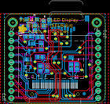

Contents
========

* [PROJ-ADAF-684-STAN-01>Adafruit 96x64 RGB OLED Breakout PCB](#proj-adaf-684-stan-01adafruit-96x64-rgb-oled-breakout-pcb)
	* [Images](#images)
	* [OOMP Parts](#oomp-parts)
	* [Tags](#tags)
  
![][im]
# PROJ-ADAF-684-STAN-01>Adafruit 96x64 RGB OLED Breakout PCB

- ID: PROJ-ADAF-684-STAN-01
- Hex ID: PRA684
- Name: Adafruit 96x64 RGB OLED Breakout PCB
- Description: 

## Images
  
  

|eagleImage|kicadPcb3dFront|kicadPcb3dBack|kicadPcb3d|
| :---: | :---: | :---: | :---: |
|||||

## OOMP Parts
  

|OOMP Parts|
| :---: |
|CAPC-0805-X-UNMATCHED-01, C1, 9.652, 23.630999982, M0,C1, 10uF, 0805, microbuilder, (0.38, 0.93035433), MR0|
|CAPE-0805-X-UNMATCHED-01, C2, 12.056000018, 26.796999999999997, M270,C2, 180pF, 0805, microbuilder, (0.47464567, 1.055), MR270|
|UNMATCHED-0805-X-UNMATCHED-01, C3, 26.805999981999996, 12.953999999999999, M90,C3, 10uF/16V, 0805, microbuilder, (1.05535433, 0.51), MR90|
|UNMATCHED-0805-X-UNMATCHED-01, C5, 24.773999982, 12.953999999999999, M90,C5, 4.7uF/16V, 0805, microbuilder, (0.97535433, 0.51), MR90|
|CAPC-0805-X-UNMATCHED-01, C8, 14.985999999999999, 28.194000000000003, M90,C8, 10uF, 0805, microbuilder, (0.59, 1.11), MR90|
|UNMATCHED-UNMATCHED-X-UNMATCHED-01, CN1, 16.764, 15.748, M180,CN1, MICROSD, microbuilder, (0.66, 0.62), MR180|
|UNMATCHED-UNMATCHED-X-UNMATCHED-01, D1, 10.921999999999999, 29.853999981999998, M0,D1, BAT54T1G, SOD-123, microbuilder, (0.43, 1.17535433), MR0|
|UNMATCHED-UNMATCHED-X-UNMATCHED-01, IC1, 9.524999999999999, 14.224, M180,IC1, LP298XS, SOT23-5L, adafruit, (0.375, 0.56), MR180|
|<table><tr><td></td><td> JP1</td><td>[HEAD-I01-X-PI10-01 2.54 mm 10 Pin Header](https://github.com/oomlout/oomlout_OOMP_parts/tree/main/HEAD-I01-X-PI10-01/)</td><td>[H10](https://github.com/oomlout/oomlout_OOMP_parts/tree/main/HEAD-I01-X-PI10-01/)</td></tr></table>|
|<table><tr><td></td><td> JP2</td><td>[HEAD-I01-X-PI10-01 2.54 mm 10 Pin Header](https://github.com/oomlout/oomlout_OOMP_parts/tree/main/HEAD-I01-X-PI10-01/)</td><td>[H10](https://github.com/oomlout/oomlout_OOMP_parts/tree/main/HEAD-I01-X-PI10-01/)</td></tr></table>|
|UNMATCHED-UNMATCHED-X-UNMATCHED-01, L1, 8.393999975999998, 26.843999905999997, M180,L1, 10uH, INDUCTOR_1007, microbuilder, (0.33047244, 1.05685039), MR180|
|UNMATCHED-UNMATCHED-X-UNMATCHED-01, LCD1, 19.049999999999997, 1.809999936, 0,LCD1, UG-9664HDDAG01, UG-9664HDDAG01_WRAPAROUND, microbuilder, (0.75, 0.07125984), R0|
|RESE-0805-X-O104-01, R1, 13.843, 23.613000017999997, M180,R1, 100K, 0805, microbuilder, (0.545, 0.92964567), MR180|
|<table><tr><td></td><td> R2</td><td>[RESE-0805-X-O103-01 SMD (0805) 10k Ohm Resistor](https://github.com/oomlout/oomlout_OOMP_parts/tree/main/RESE-0805-X-O103-01/)</td><td>[R85103](https://github.com/oomlout/oomlout_OOMP_parts/tree/main/RESE-0805-X-O103-01/)</td></tr></table>|
|RESE-0805-X-O924-01, R3, 13.843, 16.374000017999997, M180,R3, 920K, 0805, microbuilder, (0.545, 0.64464567), MR180|
|<table><tr><td></td><td> R4</td><td>[RESE-0805-X-O103-01 SMD (0805) 10k Ohm Resistor](https://github.com/oomlout/oomlout_OOMP_parts/tree/main/RESE-0805-X-O103-01/)</td><td>[R85103](https://github.com/oomlout/oomlout_OOMP_parts/tree/main/RESE-0805-X-O103-01/)</td></tr></table>|
|<table><tr><td></td><td> R5</td><td>[RESE-0805-X-O103-01 SMD (0805) 10k Ohm Resistor](https://github.com/oomlout/oomlout_OOMP_parts/tree/main/RESE-0805-X-O103-01/)</td><td>[R85103](https://github.com/oomlout/oomlout_OOMP_parts/tree/main/RESE-0805-X-O103-01/)</td></tr></table>|
|UNMATCHED-UNMATCHED-X-UNMATCHED-01, U1, 10.921999999999999, 19.930000017999998, M180,U1, FAN5331SX, SOT23-5, microbuilder, (0.43, 0.78464567), MR180|

## Tags

- hexID: PRA684
- oompType: PROJ
- oompSize: ADAF
- oompColor: 684
- oompDesc: STAN
- oompIndex: 01
- oompName: Adafruit 96x64 RGB OLED Breakout PCB
- sources: All source files from https://github.com/adafruit/Adafruit-96x64-RGB-OLED-Breakout-PCB (source licence details in srcLicense.md)
- linkBuyPage: http://www.adafruit.com/products/684
- oompPart: CAPC-0805-X-UNMATCHED-01, C1, 9.652, 23.630999982, M0
- oompPart: CAPE-0805-X-UNMATCHED-01, C2, 12.056000018, 26.796999999999997, M270
- oompPart: UNMATCHED-0805-X-UNMATCHED-01, C3, 26.805999981999996, 12.953999999999999, M90
- oompPart: UNMATCHED-0805-X-UNMATCHED-01, C5, 24.773999982, 12.953999999999999, M90
- oompPart: CAPC-0805-X-UNMATCHED-01, C8, 14.985999999999999, 28.194000000000003, M90
- oompPart: UNMATCHED-UNMATCHED-X-UNMATCHED-01, CN1, 16.764, 15.748, M180
- oompPart: UNMATCHED-UNMATCHED-X-UNMATCHED-01, D1, 10.921999999999999, 29.853999981999998, M0
- oompPart: UNMATCHED-UNMATCHED-X-UNMATCHED-01, IC1, 9.524999999999999, 14.224, M180
- oompPart: HEAD-I01-X-PI10-01, JP1, 34.242000096, 13.2850001, 270
- oompPart: HEAD-I01-X-PI10-01, JP2, 3.762000096, 13.2850001, 90
- oompPart: UNMATCHED-UNMATCHED-X-UNMATCHED-01, L1, 8.393999975999998, 26.843999905999997, M180
- oompPart: UNMATCHED-UNMATCHED-X-UNMATCHED-01, LCD1, 19.049999999999997, 1.809999936, 0
- oompPart: RESE-0805-X-O104-01, R1, 13.843, 23.613000017999997, M180
- oompPart: RESE-0805-X-O103-01, R2, 14.232999981999999, 20.32, M90
- oompPart: RESE-0805-X-O924-01, R3, 13.843, 16.374000017999997, M180
- oompPart: RESE-0805-X-O103-01, R4, 13.811000064, 12.477999936, M270
- oompPart: RESE-0805-X-O103-01, R5, 16.175999905999998, 12.477999936, M270
- oompPart: SKIP-UNMATCHED-X-UNMATCHED-01, U$9, 33.730000104, 28.650000104, 0
- oompPart: SKIP-UNMATCHED-X-UNMATCHED-01, U$11, 4.2700000959999995, 28.650000104, 0
- oompPart: SKIP-UNMATCHED-X-UNMATCHED-01, U$12, 29.337, 3.4379999819999996, M0
- oompPart: SKIP-UNMATCHED-X-UNMATCHED-01, U$13, 7.112, 30.107999982, M0
- oompPart: UNMATCHED-UNMATCHED-X-UNMATCHED-01, U1, 10.921999999999999, 19.930000017999998, M180
- rawPart: C1, 10uF, 0805, microbuilder, (0.38, 0.93035433), MR0
- rawPart: C2, 180pF, 0805, microbuilder, (0.47464567, 1.055), MR270
- rawPart: C3, 10uF/16V, 0805, microbuilder, (1.05535433, 0.51), MR90
- rawPart: C5, 4.7uF/16V, 0805, microbuilder, (0.97535433, 0.51), MR90
- rawPart: C8, 10uF, 0805, microbuilder, (0.59, 1.11), MR90
- rawPart: CN1, MICROSD, microbuilder, (0.66, 0.62), MR180
- rawPart: D1, BAT54T1G, SOD-123, microbuilder, (0.43, 1.17535433), MR0
- rawPart: IC1, LP298XS, SOT23-5L, adafruit, (0.375, 0.56), MR180
- rawPart: JP1, 1X10_ROUND_76, microbuilder, (1.34811024, 0.5230315), R270
- rawPart: JP2, 1X10_ROUND_76, microbuilder, (0.14811024, 0.5230315), R90
- rawPart: L1, 10uH, INDUCTOR_1007, microbuilder, (0.33047244, 1.05685039), MR180
- rawPart: LCD1, UG-9664HDDAG01, UG-9664HDDAG01_WRAPAROUND, microbuilder, (0.75, 0.07125984), R0
- rawPart: R1, 100K, 0805, microbuilder, (0.545, 0.92964567), MR180
- rawPart: R2, 10K, 0805, microbuilder, (0.56035433, 0.8), MR90
- rawPart: R3, 920K, 0805, microbuilder, (0.545, 0.64464567), MR180
- rawPart: R4, 10K, 0805, microbuilder, (0.54374016, 0.49125984), MR270
- rawPart: R5, 10K, 0805, microbuilder, (0.63685039, 0.49125984), MR270
- rawPart: U$9, MOUNTINGHOLE2.0, MOUNTINGHOLE_2.0_PLATED, microbuilder, (1.32795276, 1.12795276), R0
- rawPart: U$11, MOUNTINGHOLE2.0, MOUNTINGHOLE_2.0_PLATED, microbuilder, (0.16811024, 1.12795276), R0
- rawPart: U$12, FIDUCIAL, FIDUCIAL_1MM, adafruit, (1.155, 0.13535433), MR0
- rawPart: U$13, FIDUCIAL, FIDUCIAL_1MM, adafruit, (0.28, 1.18535433), MR0
- rawPart: U1, FAN5331SX, SOT23-5, microbuilder, (0.43, 0.78464567), MR180
- oompID: PROJ-ADAF-684-STAN-01

[im]: kicadPcb3d_450.png
