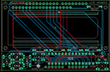

Contents
========

* [PROJ-ADAF-714-STAN-01>Adafruit RGB LCD shield PCB](#proj-adaf-714-stan-01adafruit-rgb-lcd-shield-pcb)
	* [Images](#images)
	* [Tags](#tags)
  
![][im]
# PROJ-ADAF-714-STAN-01>Adafruit RGB LCD shield PCB

- ID: PROJ-ADAF-714-STAN-01
- Hex ID: PRA714
- Name: Adafruit RGB LCD shield PCB
- Description: 

## Images
  
  

|eagleImage|
| :---: |
||

## Tags

- hexID: PRA714
- oompType: PROJ
- oompSize: ADAF
- oompColor: 714
- oompDesc: STAN
- oompIndex: 01
- oompName: Adafruit RGB LCD shield PCB
- sources: All source files from https://github.com/adafruit/Adafruit-RGB-LCD-shield-PCB (source licence details in srcLicense.md)
- linkBuyPage: http://www.adafruit.com/products/714
- oompPart: UNMATCHED-UNMATCHED-X-O221-01, BLUE, 69.723, 48.641, 0
- oompPart: UNMATCHED-UNMATCHED-X-UNMATCHED-01, DOWN, 11.43, 3.556, 0
- oompPart: UNMATCHED-UNMATCHED-X-O331-01, GREEN, 68.326, 15.493999999999998, 180
- oompPart: UNMATCHED-UNMATCHED-X-UNMATCHED-01, IC1, 52.06999999999999, 8.889999999999999, 180
- oompPart: UNMATCHED-UNMATCHED-X-UNMATCHED-01, LEFT, 3.8099999999999996, 6.985, 270
- oompPart: RESE-UNMATCHED-X-UNMATCHED-01, R1, 41.65599999999999, 15.493999999999998, 0
- oompPart: RESE-UNMATCHED-X-UNMATCHED-01, R2, 28.701999999999995, 15.493999999999998, 180
- oompPart: UNMATCHED-UNMATCHED-X-O221-01, RED, 55.117999999999995, 15.493999999999998, 0
- oompPart: UNMATCHED-UNMATCHED-X-UNMATCHED-01, RESET, 75.438, 3.302, 0
- oompPart: UNMATCHED-UNMATCHED-X-UNMATCHED-01, RIGHT, 19.049999999999997, 6.985, 90
- oompPart: UNMATCHED-UNMATCHED-X-UNMATCHED-01, SELECT, 27.94, 10.16, 0
- oompPart: UNMATCHED-UNMATCHED-X-O103-01, TM1, 75.438, 10.413999999999998, 0
- oompPart: SKIP-UNMATCHED-X-UNMATCHED-01, U$1, 40.386, 32.512, 0
- oompPart: UNMATCHED-UNMATCHED-X-UNMATCHED-01, U1, 0.0, 0.0, 0
- oompPart: UNMATCHED-UNMATCHED-X-UNMATCHED-01, UP, 11.43, 10.16, 0
- rawPart: 

[im]: eagleImage_450.png
