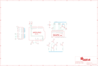

Contents
========

* [PRA714 > Adafruit RGB LCD shield PCB](#pra714--adafruit-rgb-lcd-shield-pcb)
	* [Schematic](#schematic)
	* [PCB](#pcb)
	* [OOMP Parts](#oomp-parts)
	* [Images](#images)
	* [Tags](#tags)
  
![][im]
# PRA714 > Adafruit RGB LCD shield PCB

- ID: PROJ-ADAF-714-STAN-01
- Hex ID: PRA714
- Name: Adafruit
- Description: Adafruit
- Long Link: [http://oom.lt/PROJ-ADAF-714-STAN-01](http://oom.lt/PROJ-ADAF-714-STAN-01)
- Short Link: [http://oom.lt/PRA714](http://oom.lt/PRA714)

## Schematic
  

## PCB
  

## OOMP Parts
  

|OOMP Parts|
| :---: |
|BLUE BLUE,UNMATCHED-UNMATCHED-X-UNMATCHED-01|
|DOWN DOWN,UNMATCHED-UNMATCHED-X-UNMATCHED-01|
|GREEN GREEN,UNMATCHED-UNMATCHED-X-UNMATCHED-01|
|IC1 IC1,UNMATCHED-UNMATCHED-X-UNMATCHED-01|
|LEFT LEFT,UNMATCHED-UNMATCHED-X-UNMATCHED-01|
|R1 R1,RESE-UNMATCHED-X-O472-01|
|R2 R2,RESE-UNMATCHED-X-O472-01|
|RED RED,UNMATCHED-UNMATCHED-X-UNMATCHED-01|
|RESET RESET,UNMATCHED-UNMATCHED-X-UNMATCHED-01|
|RIGHT RIGHT,UNMATCHED-UNMATCHED-X-UNMATCHED-01|
|SELECT SELECT,UNMATCHED-UNMATCHED-X-UNMATCHED-01|
|TM1 TM1,UNMATCHED-UNMATCHED-X-UNMATCHED-01|
|U$1 U$1,UNMATCHED-UNMATCHED-X-UNMATCHED-01|
|U1 U1,UNMATCHED-UNMATCHED-X-UNMATCHED-01|
|UP UP,UNMATCHED-UNMATCHED-X-UNMATCHED-01|

## Images
  
  

|kicadPcb3d|kicadPcb3dFront|kicadPcb3dBack|eagleImage|eagleSchemImage|
| :---: | :---: | :---: | :---: | :---: |
||||||

## Tags

- hexID: PRA714
- oompType: PROJ
- oompSize: ADAF
- oompColor: 714
- oompDesc: STAN
- oompIndex: 01
- oompName: Adafruit RGB LCD shield PCB
- sources: All source files from https://github.com/adafruit/Adafruit-RGB-LCD-shield-PCB (source licence details in srcLicense.md)
- linkBuyPage: http://www.adafruit.com/products/714
- oompID: PROJ-ADAF-714-STAN-01
- oompParts: BLUE,UNMATCHED-UNMATCHED-X-UNMATCHED-01
- oompParts: DOWN,UNMATCHED-UNMATCHED-X-UNMATCHED-01
- oompParts: GREEN,UNMATCHED-UNMATCHED-X-UNMATCHED-01
- oompParts: IC1,UNMATCHED-UNMATCHED-X-UNMATCHED-01
- oompParts: LEFT,UNMATCHED-UNMATCHED-X-UNMATCHED-01
- oompParts: R1,RESE-UNMATCHED-X-O472-01
- oompParts: R2,RESE-UNMATCHED-X-O472-01
- oompParts: RED,UNMATCHED-UNMATCHED-X-UNMATCHED-01
- oompParts: RESET,UNMATCHED-UNMATCHED-X-UNMATCHED-01
- oompParts: RIGHT,UNMATCHED-UNMATCHED-X-UNMATCHED-01
- oompParts: SELECT,UNMATCHED-UNMATCHED-X-UNMATCHED-01
- oompParts: TM1,UNMATCHED-UNMATCHED-X-UNMATCHED-01
- oompParts: U$1,UNMATCHED-UNMATCHED-X-UNMATCHED-01
- oompParts: U1,UNMATCHED-UNMATCHED-X-UNMATCHED-01
- oompParts: UP,UNMATCHED-UNMATCHED-X-UNMATCHED-01
- rawParts: BLUE,220,R-US_0207/10,0207/10,RESISTOR, American symbol,,
- rawParts: DOWN,,10-XX,B3F-10XX,OMRON SWITCH,,
- rawParts: GREEN,330,R-US_0207/10,0207/10,RESISTOR, American symbol,,
- rawParts: IC1,MCP23017SP2,MCP23017SP2,DIL28-3-ROUND,http://ww1.microchip.com/downloads/en/DeviceDoc/21952a.pdf,,
- rawParts: LEFT,,10-XX,B3F-10XX,OMRON SWITCH,,
- rawParts: R1,4.7K,R-US_0207/10,0207/10,RESISTOR, American symbol,,
- rawParts: R2,4.7K,R-US_0207/10,0207/10,RESISTOR, American symbol,,
- rawParts: RED,220,R-US_0207/10,0207/10,RESISTOR, American symbol,,
- rawParts: RESET,,10-XX,B3F-10XX,OMRON SWITCH,,
- rawParts: RIGHT,,10-XX,B3F-10XX,OMRON SWITCH,,
- rawParts: SELECT,,10-XX,B3F-10XX,OMRON SWITCH,,
- rawParts: TM1,10K,TRIM,6MM,,,
- rawParts: U$1,HD44780LCD_RGBLONGPINS,HD44780LCD_RGBLONGPINS,LCD1602-RGB,,,
- rawParts: U1,ARDUINOR3-NOIOREF-NOTEXT,ARDUINOR3-NOIOREF-NOTEXT,ARDUINOR3-NOTEXT-NOIOREF,,,
- rawParts: UP,,10-XX,B3F-10XX,OMRON SWITCH,,

[im]: kicadPcb3d_450.png
