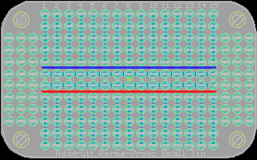

Contents
========

* [PRA723 > Adafruit Perma Proto PCB](#pra723--adafruit-perma-proto-pcb)
	* [Schematic](#schematic)
	* [PCB](#pcb)
	* [OOMP Parts](#oomp-parts)
	* [Images](#images)
	* [Tags](#tags)
  
![][im]
# PRA723 > Adafruit Perma Proto PCB

- ID: PROJ-ADAF-723-STAN-01
- Hex ID: PRA723
- Name: Adafruit
- Description: Adafruit
- Long Link: [http://oom.lt/PROJ-ADAF-723-STAN-01](http://oom.lt/PROJ-ADAF-723-STAN-01)
- Short Link: [http://oom.lt/PRA723](http://oom.lt/PRA723)

## Schematic
  

## PCB
  

## OOMP Parts
  

|OOMP Parts|
| :---: |
|H1 H1,UNMATCHED-UNMATCHED-X-UNMATCHED-01|
|H2 H2,UNMATCHED-UNMATCHED-X-UNMATCHED-01|
|H3 H3,UNMATCHED-UNMATCHED-X-UNMATCHED-01|
|H4 H4,UNMATCHED-UNMATCHED-X-UNMATCHED-01|

## Images
  
  

|kicadPcb3d|kicadPcb3dFront|kicadPcb3dBack|eagleImage|eagleSchemImage|
| :---: | :---: | :---: | :---: | :---: |
||||||

## Tags

- hexID: PRA723
- oompType: PROJ
- oompSize: ADAF
- oompColor: 723
- oompDesc: STAN
- oompIndex: 01
- oompName: Adafruit Perma Proto PCB
- sources: All source files from https://github.com/adafruit/Adafruit-Perma-Proto-PCB (source licence details in srcLicense.md)
- linkBuyPage: http://www.adafruit.com/products/723
- oompID: PROJ-ADAF-723-STAN-01
- oompParts: H1,UNMATCHED-UNMATCHED-X-UNMATCHED-01
- oompParts: H2,UNMATCHED-UNMATCHED-X-UNMATCHED-01
- oompParts: H3,UNMATCHED-UNMATCHED-X-UNMATCHED-01
- oompParts: H4,UNMATCHED-UNMATCHED-X-UNMATCHED-01
- rawParts: H1,MOUNT-HOLE3.0,MOUNT-HOLE3.0,3,0,MOUNTING HOLE with drill center marker,,
- rawParts: H2,MOUNT-HOLE3.0,MOUNT-HOLE3.0,3,0,MOUNTING HOLE with drill center marker,,
- rawParts: H3,MOUNT-HOLE3.0,MOUNT-HOLE3.0,3,0,MOUNTING HOLE with drill center marker,,
- rawParts: H4,MOUNT-HOLE3.0,MOUNT-HOLE3.0,3,0,MOUNTING HOLE with drill center marker,,

[im]: kicadPcb3d_450.png
