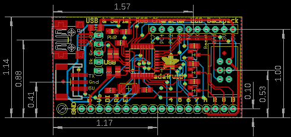
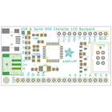
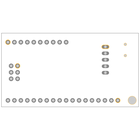
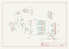
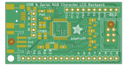
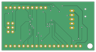

Contents
========

* [PRA782 > Adafruit USB Serial RGB Character Backpack PCB](#pra782--adafruit-usb-serial-rgb-character-backpack-pcb)
	* [Schematic](#schematic)
	* [PCB](#pcb)
	* [Interactive BOM](#interactive-bom)
	* [OOMP Parts](#oomp-parts)
	* [Images](#images)
	* [Tags](#tags)
  
![][im]
# PRA782 > Adafruit USB Serial RGB Character Backpack PCB

- ID: PROJ-ADAF-782-STAN-01
- Hex ID: PRA782
- Name: Adafruit 782
- Description: Adafruit 782
- Long Link: [http://oom.lt/PROJ-ADAF-782-STAN-01](http://oom.lt/PROJ-ADAF-782-STAN-01)
- Short Link: [http://oom.lt/PRA782](http://oom.lt/PRA782)

## Schematic
  

## PCB
  

## Interactive BOM

- Interactive BOM page: [ibom.html](https://htmlpreview.github.io/?https://github.com/oomlout/oomlout_OOMP_projects/blob/main/PROJ-ADAF-782-STAN-01/kicad/bom/ibom.html)

## OOMP Parts
  

|OOMP ID|Name|Identifier|
| :---: | :---: | :---: |
|[CAPC-0805-X-UF10-V10](https://github.com/oomlout/oomlout_OOMP_parts/tree/main/CAPC-0805-X-UF10-V10/)|[SMD (0805) 10 uF Capacitor (Ceramic) 10v](https://github.com/oomlout/oomlout_OOMP_parts/tree/main/CAPC-0805-X-UF10-V10/)|[C1, C5](https://github.com/oomlout/oomlout_OOMP_parts/tree/main/CAPC-0805-X-UF10-V10/)|
|CAPC-0805-X-PF18-01||C2, C3|
|[CAPC-0805-X-NF100-V50](https://github.com/oomlout/oomlout_OOMP_parts/tree/main/CAPC-0805-X-NF100-V50/)|[SMD (0805) 100 nF Capacitor (Ceramic) 50v](https://github.com/oomlout/oomlout_OOMP_parts/tree/main/CAPC-0805-X-NF100-V50/)|[C4](https://github.com/oomlout/oomlout_OOMP_parts/tree/main/CAPC-0805-X-NF100-V50/)|
|UNMATCHED-UNMATCHED-X-UNMATCHED-01||CN1, CN3, IC2, ISP6, X3|
|UNMATCHED-1206-X-UNMATCHED-01||F1|
|[HEAD-I01-X-PI18-01](https://github.com/oomlout/oomlout_OOMP_parts/tree/main/HEAD-I01-X-PI18-01/)|[2.54 mm 18 Pin Header](https://github.com/oomlout/oomlout_OOMP_parts/tree/main/HEAD-I01-X-PI18-01/)|[JP1](https://github.com/oomlout/oomlout_OOMP_parts/tree/main/HEAD-I01-X-PI18-01/)|
|[LEDS-0805-R-STAN-01](https://github.com/oomlout/oomlout_OOMP_parts/tree/main/LEDS-0805-R-STAN-01/)|[SMD (0805) Red LED](https://github.com/oomlout/oomlout_OOMP_parts/tree/main/LEDS-0805-R-STAN-01/)|[LED](https://github.com/oomlout/oomlout_OOMP_parts/tree/main/LEDS-0805-R-STAN-01/)|
|[RESE-0805-X-O220-01](https://github.com/oomlout/oomlout_OOMP_parts/tree/main/RESE-0805-X-O220-01/)|[SMD (0805) 22 Ohm Resistor](https://github.com/oomlout/oomlout_OOMP_parts/tree/main/RESE-0805-X-O220-01/)|[R1, R2](https://github.com/oomlout/oomlout_OOMP_parts/tree/main/RESE-0805-X-O220-01/)|
|[RESE-0805-X-O102-01](https://github.com/oomlout/oomlout_OOMP_parts/tree/main/RESE-0805-X-O102-01/)|[SMD (0805) 1k Ohm Resistor](https://github.com/oomlout/oomlout_OOMP_parts/tree/main/RESE-0805-X-O102-01/)|[R3, R5, R6, R7](https://github.com/oomlout/oomlout_OOMP_parts/tree/main/RESE-0805-X-O102-01/)|
|UNMATCHED-SO23-X-UNMATCHED-01||T1, T2, T3|
|[HEAD-I01-X-PI10-01](https://github.com/oomlout/oomlout_OOMP_parts/tree/main/HEAD-I01-X-PI10-01/)|[2.54 mm 10 Pin Header](https://github.com/oomlout/oomlout_OOMP_parts/tree/main/HEAD-I01-X-PI10-01/)|[U$1](https://github.com/oomlout/oomlout_OOMP_parts/tree/main/HEAD-I01-X-PI10-01/)|
|[HEAD-I01-X-PI05-01](https://github.com/oomlout/oomlout_OOMP_parts/tree/main/HEAD-I01-X-PI05-01/)|[2.54 mm 5 Pin Header](https://github.com/oomlout/oomlout_OOMP_parts/tree/main/HEAD-I01-X-PI05-01/)|[USB](https://github.com/oomlout/oomlout_OOMP_parts/tree/main/HEAD-I01-X-PI05-01/)|

## Images
  
  

|bominteractivefront|bominteractiveback|kicadPcb3d|kicadPcb3dFront|kicadPcb3dBack|kicadSchem|eagleImage|eagleSchemImage|pcbdraw|pcbdrawback|
| :---: | :---: | :---: | :---: | :---: | :---: | :---: | :---: | :---: | :---: |
|||||||||||

## Tags

- hexID: PRA782
- oompType: PROJ
- oompSize: ADAF
- oompColor: 782
- oompDesc: STAN
- oompIndex: 01
- oompName: Adafruit USB Serial RGB Character Backpack PCB
- sources: All source files from https://github.com/adafruit/Adafruit-USB-Serial-RGB-Character-Backpack-PCB (source licence details in srcLicense.md)
- linkBuyPage: http://www.adafruit.com/products/782
- oompID: PROJ-ADAF-782-STAN-01
- oompParts: C1,CAPC-0805-X-UF10-V10
- oompParts: C2,CAPC-0805-X-PF18-01
- oompParts: C3,CAPC-0805-X-PF18-01
- oompParts: C4,CAPC-0805-X-NF100-V50
- oompParts: C5,CAPC-0805-X-UF10-V10
- oompParts: CN1,UNMATCHED-UNMATCHED-X-UNMATCHED-01
- oompParts: CN3,UNMATCHED-UNMATCHED-X-UNMATCHED-01
- oompParts: F1,UNMATCHED-1206-X-UNMATCHED-01
- oompParts: IC2,UNMATCHED-UNMATCHED-X-UNMATCHED-01
- oompParts: ISP6,UNMATCHED-UNMATCHED-X-UNMATCHED-01
- oompParts: JP1,HEAD-I01-X-PI18-01
- oompParts: LED,LEDS-0805-R-STAN-01
- oompParts: R1,RESE-0805-X-O220-01
- oompParts: R2,RESE-0805-X-O220-01
- oompParts: R3,RESE-0805-X-O102-01
- oompParts: R5,RESE-0805-X-O102-01
- oompParts: R6,RESE-0805-X-O102-01
- oompParts: R7,RESE-0805-X-O102-01
- oompParts: T1,UNMATCHED-SO23-X-UNMATCHED-01
- oompParts: T2,UNMATCHED-SO23-X-UNMATCHED-01
- oompParts: T3,UNMATCHED-SO23-X-UNMATCHED-01
- oompParts: U$1,HEAD-I01-X-PI10-01
- oompParts: USB,HEAD-I01-X-PI05-01
- oompParts: X3,UNMATCHED-UNMATCHED-X-UNMATCHED-01
- rawParts: C1,10uF,CAP_CERAMIC0805-NOOUTLINE,0805-NO,Ceramic Capacitors,,
- rawParts: C2,18pF,CAP_CERAMIC0805-NOOUTLINE,0805-NO,Ceramic Capacitors,,
- rawParts: C3,18pF,CAP_CERAMIC0805-NOOUTLINE,0805-NO,Ceramic Capacitors,,
- rawParts: C4,0.1uF,CAP_CERAMIC0805-NOOUTLINE,0805-NO,Ceramic Capacitors,,
- rawParts: C5,10uF,CAP_CERAMIC0805-NOOUTLINE,0805-NO,Ceramic Capacitors,,
- rawParts: CN1,miniB,USBMINIBLARGE,USB-MINIB_LARGER,USB Connectors,,
- rawParts: CN3,JST-PH-3,JST_3PIN,JSTPH3,,,
- rawParts: F1,500mA,PTCFUSE-1206,R1206,PTC fuses, resettable thermistors,,
- rawParts: FID1,FIDUCIAL1X2.5,FIDUCIAL1X2.5,FIDUCIAL-1X2.5,Fiducial Alignment Points,,
- rawParts: FID2,FIDUCIAL1X2.5,FIDUCIAL1X2.5,FIDUCIAL-1X2.5,Fiducial Alignment Points,,
- rawParts: IC2,AT90USB162,ATMEGA32U2-TQFP,TQFP32-08,ATmega32u2,,
- rawParts: ISP6,PINHD-2X3THM,PINHD-2X3THM,ISP6,,,
- rawParts: JP1,CHARLCD,PINHD-1X18-BIG,1X18-BIG,PIN HEADER,,
- rawParts: LED,RED,LED0805_NOOUTLINE,CHIPLED_0805_NOOUTLINE,LED,,
- rawParts: R1,22,RESISTOR0805_NOOUTLINE,0805-NO,Resistors,,
- rawParts: R2,22,RESISTOR0805_NOOUTLINE,0805-NO,Resistors,,
- rawParts: R3,1K,RESISTOR0805_NOOUTLINE,0805-NO,Resistors,,
- rawParts: R5,1K,RESISTOR0805_NOOUTLINE,0805-NO,Resistors,,
- rawParts: R6,1K,RESISTOR0805_NOOUTLINE,0805-NO,Resistors,,
- rawParts: R7,1K,RESISTOR0805_NOOUTLINE,0805-NO,Resistors,,
- rawParts: T1,MMBT222,MMBT2222ALT1-NPN-SOT23-BEC,SOT23-BEC,NPN Transistror,,
- rawParts: T2,MMBT222,MMBT2222ALT1-NPN-SOT23-BEC,SOT23-BEC,NPN Transistror,,
- rawParts: T3,MMBT222,MMBT2222ALT1-NPN-SOT23-BEC,SOT23-BEC,NPN Transistror,,
- rawParts: U$1,PINHD-1X10,PINHD-1X10,1X10-BIG,Pin header 1x10 0.1 spacing,,
- rawParts: USB,MALE,PINHD-1X5,1X05,PIN HEADER,,
- rawParts: X3,16MHz,XTALNX5032,NX5032,Low cost SMT crystals, no capacitors included,,

[im]: kicadPcb3d_450.png
