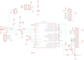

Contents
========

* [PRA782 > Adafruit](#pra782--adafruit)
	* [Schematic](#schematic)
	* [Interactive BOM](#interactive-bom)
	* [OOMP Parts](#oomp-parts)
	* [Images](#images)
	* [Tags](#tags)
  
![][im]
# PRA782 > Adafruit

- ID: PROJ-ADAF-782-STAN-01
- Hex ID: PRA782
- Name: Adafruit
- Description: Adafruit
- Long Link: [http://oom.lt/PROJ-ADAF-782-STAN-01](http://oom.lt/PROJ-ADAF-782-STAN-01)
- Short Link: [http://oom.lt/PRA782](http://oom.lt/PRA782)

## Schematic
  

## Interactive BOM

- Interactive BOM page: [ibom.html](https://htmlpreview.github.io/?https://github.com/oomlout/oomlout_OOMP_projects/blob/main/PROJ-ADAF-782-STAN-01/kicad/bom/ibom.html)

## OOMP Parts
  

|OOMP Parts|
| :---: |
|C1,UNMATCHED-UNMATCHED-UNMATCHED-UNMATCHED-UNMATCHED,C1,10uF,CAP_CERAMIC0805-NOOUTLINE,0805-NO,Ceramic Capacitors,,|
|C2,UNMATCHED-UNMATCHED-UNMATCHED-UNMATCHED-UNMATCHED,C2,18pF,CAP_CERAMIC0805-NOOUTLINE,0805-NO,Ceramic Capacitors,,|
|C3,UNMATCHED-UNMATCHED-UNMATCHED-UNMATCHED-UNMATCHED,C3,18pF,CAP_CERAMIC0805-NOOUTLINE,0805-NO,Ceramic Capacitors,,|
|C4,UNMATCHED-UNMATCHED-UNMATCHED-UNMATCHED-UNMATCHED,C4,0.1uF,CAP_CERAMIC0805-NOOUTLINE,0805-NO,Ceramic Capacitors,,|
|C5,UNMATCHED-UNMATCHED-UNMATCHED-UNMATCHED-UNMATCHED,C5,10uF,CAP_CERAMIC0805-NOOUTLINE,0805-NO,Ceramic Capacitors,,|
|CN1,UNMATCHED-UNMATCHED-UNMATCHED-UNMATCHED-UNMATCHED,CN1,miniB,USBMINIBLARGE,USB-MINIB_LARGER,USB Connectors,,|
|CN3,UNMATCHED-UNMATCHED-UNMATCHED-UNMATCHED-UNMATCHED,CN3,JST-PH-3,JST_3PIN,JSTPH3,,,|
|F1,UNMATCHED-UNMATCHED-UNMATCHED-UNMATCHED-UNMATCHED,F1,500mA,PTCFUSE-1206,R1206,PTC fuses, resettable thermistors,,|
|IC2,UNMATCHED-UNMATCHED-UNMATCHED-UNMATCHED-UNMATCHED,FID1,FIDUCIAL1X2.5,FIDUCIAL1X2.5,FIDUCIAL-1X2.5,Fiducial Alignment Points,,|
|ISP6,UNMATCHED-UNMATCHED-UNMATCHED-UNMATCHED-UNMATCHED,FID2,FIDUCIAL1X2.5,FIDUCIAL1X2.5,FIDUCIAL-1X2.5,Fiducial Alignment Points,,|
|JP1,UNMATCHED-UNMATCHED-UNMATCHED-UNMATCHED-UNMATCHED,IC2,AT90USB162,ATMEGA32U2-TQFP,TQFP32-08,ATmega32u2,,|
|LED,UNMATCHED-UNMATCHED-UNMATCHED-UNMATCHED-UNMATCHED,ISP6,PINHD-2X3THM,PINHD-2X3THM,ISP6,,,|
|R1,UNMATCHED-UNMATCHED-UNMATCHED-UNMATCHED-UNMATCHED,JP1,CHARLCD,PINHD-1X18-BIG,1X18-BIG,PIN HEADER,,|
|R2,UNMATCHED-UNMATCHED-UNMATCHED-UNMATCHED-UNMATCHED,LED,RED,LED0805_NOOUTLINE,CHIPLED_0805_NOOUTLINE,LED,,|
|R3,UNMATCHED-UNMATCHED-UNMATCHED-UNMATCHED-UNMATCHED,R1,22,RESISTOR0805_NOOUTLINE,0805-NO,Resistors,,|
|R5,UNMATCHED-UNMATCHED-UNMATCHED-UNMATCHED-UNMATCHED,R2,22,RESISTOR0805_NOOUTLINE,0805-NO,Resistors,,|
|R6,UNMATCHED-UNMATCHED-UNMATCHED-UNMATCHED-UNMATCHED,R3,1K,RESISTOR0805_NOOUTLINE,0805-NO,Resistors,,|
|R7,UNMATCHED-UNMATCHED-UNMATCHED-UNMATCHED-UNMATCHED,R5,1K,RESISTOR0805_NOOUTLINE,0805-NO,Resistors,,|
|T1,UNMATCHED-UNMATCHED-UNMATCHED-UNMATCHED-UNMATCHED,R6,1K,RESISTOR0805_NOOUTLINE,0805-NO,Resistors,,|
|T2,UNMATCHED-UNMATCHED-UNMATCHED-UNMATCHED-UNMATCHED,R7,1K,RESISTOR0805_NOOUTLINE,0805-NO,Resistors,,|
|T3,UNMATCHED-UNMATCHED-UNMATCHED-UNMATCHED-UNMATCHED,T1,MMBT222,MMBT2222ALT1-NPN-SOT23-BEC,SOT23-BEC,NPN Transistror,,|
|U$1,UNMATCHED-UNMATCHED-UNMATCHED-UNMATCHED-UNMATCHED,T2,MMBT222,MMBT2222ALT1-NPN-SOT23-BEC,SOT23-BEC,NPN Transistror,,|
|USB,UNMATCHED-UNMATCHED-UNMATCHED-UNMATCHED-UNMATCHED,T3,MMBT222,MMBT2222ALT1-NPN-SOT23-BEC,SOT23-BEC,NPN Transistror,,|
|X3,UNMATCHED-UNMATCHED-UNMATCHED-UNMATCHED-UNMATCHED,U$1,PINHD-1X10,PINHD-1X10,1X10-BIG,Pin header 1x10 0.1 spacing,,|

## Images
  
  

|kicadPcb3d|kicadPcb3dFront|kicadPcb3dBack|eagleImage|eagleSchemImage|
| :---: | :---: | :---: | :---: | :---: |
||||||

## Tags

- hexID: PRA782
- oompType: PROJ
- oompSize: ADAF
- oompColor: 782
- oompDesc: STAN
- oompIndex: 01
- oompName: Adafruit USB Serial RGB Character Backpack PCB
- sources: All source files from https://github.com/adafruit/Adafruit-USB-Serial-RGB-Character-Backpack-PCB (source licence details in srcLicense.md)
- linkBuyPage: http://www.adafruit.com/products/782
- oompID: PROJ-ADAF-782-STAN-01
- oompParts: C1,UNMATCHED-UNMATCHED-UNMATCHED-UNMATCHED-UNMATCHED
- oompParts: C2,UNMATCHED-UNMATCHED-UNMATCHED-UNMATCHED-UNMATCHED
- oompParts: C3,UNMATCHED-UNMATCHED-UNMATCHED-UNMATCHED-UNMATCHED
- oompParts: C4,UNMATCHED-UNMATCHED-UNMATCHED-UNMATCHED-UNMATCHED
- oompParts: C5,UNMATCHED-UNMATCHED-UNMATCHED-UNMATCHED-UNMATCHED
- oompParts: CN1,UNMATCHED-UNMATCHED-UNMATCHED-UNMATCHED-UNMATCHED
- oompParts: CN3,UNMATCHED-UNMATCHED-UNMATCHED-UNMATCHED-UNMATCHED
- oompParts: F1,UNMATCHED-UNMATCHED-UNMATCHED-UNMATCHED-UNMATCHED
- oompParts: IC2,UNMATCHED-UNMATCHED-UNMATCHED-UNMATCHED-UNMATCHED
- oompParts: ISP6,UNMATCHED-UNMATCHED-UNMATCHED-UNMATCHED-UNMATCHED
- oompParts: JP1,UNMATCHED-UNMATCHED-UNMATCHED-UNMATCHED-UNMATCHED
- oompParts: LED,UNMATCHED-UNMATCHED-UNMATCHED-UNMATCHED-UNMATCHED
- oompParts: R1,UNMATCHED-UNMATCHED-UNMATCHED-UNMATCHED-UNMATCHED
- oompParts: R2,UNMATCHED-UNMATCHED-UNMATCHED-UNMATCHED-UNMATCHED
- oompParts: R3,UNMATCHED-UNMATCHED-UNMATCHED-UNMATCHED-UNMATCHED
- oompParts: R5,UNMATCHED-UNMATCHED-UNMATCHED-UNMATCHED-UNMATCHED
- oompParts: R6,UNMATCHED-UNMATCHED-UNMATCHED-UNMATCHED-UNMATCHED
- oompParts: R7,UNMATCHED-UNMATCHED-UNMATCHED-UNMATCHED-UNMATCHED
- oompParts: T1,UNMATCHED-UNMATCHED-UNMATCHED-UNMATCHED-UNMATCHED
- oompParts: T2,UNMATCHED-UNMATCHED-UNMATCHED-UNMATCHED-UNMATCHED
- oompParts: T3,UNMATCHED-UNMATCHED-UNMATCHED-UNMATCHED-UNMATCHED
- oompParts: U$1,UNMATCHED-UNMATCHED-UNMATCHED-UNMATCHED-UNMATCHED
- oompParts: USB,UNMATCHED-UNMATCHED-UNMATCHED-UNMATCHED-UNMATCHED
- oompParts: X3,UNMATCHED-UNMATCHED-UNMATCHED-UNMATCHED-UNMATCHED
- rawParts: C1,10uF,CAP_CERAMIC0805-NOOUTLINE,0805-NO,Ceramic Capacitors,,
- rawParts: C2,18pF,CAP_CERAMIC0805-NOOUTLINE,0805-NO,Ceramic Capacitors,,
- rawParts: C3,18pF,CAP_CERAMIC0805-NOOUTLINE,0805-NO,Ceramic Capacitors,,
- rawParts: C4,0.1uF,CAP_CERAMIC0805-NOOUTLINE,0805-NO,Ceramic Capacitors,,
- rawParts: C5,10uF,CAP_CERAMIC0805-NOOUTLINE,0805-NO,Ceramic Capacitors,,
- rawParts: CN1,miniB,USBMINIBLARGE,USB-MINIB_LARGER,USB Connectors,,
- rawParts: CN3,JST-PH-3,JST_3PIN,JSTPH3,,,
- rawParts: F1,500mA,PTCFUSE-1206,R1206,PTC fuses, resettable thermistors,,
- rawParts: FID1,FIDUCIAL1X2.5,FIDUCIAL1X2.5,FIDUCIAL-1X2.5,Fiducial Alignment Points,,
- rawParts: FID2,FIDUCIAL1X2.5,FIDUCIAL1X2.5,FIDUCIAL-1X2.5,Fiducial Alignment Points,,
- rawParts: IC2,AT90USB162,ATMEGA32U2-TQFP,TQFP32-08,ATmega32u2,,
- rawParts: ISP6,PINHD-2X3THM,PINHD-2X3THM,ISP6,,,
- rawParts: JP1,CHARLCD,PINHD-1X18-BIG,1X18-BIG,PIN HEADER,,
- rawParts: LED,RED,LED0805_NOOUTLINE,CHIPLED_0805_NOOUTLINE,LED,,
- rawParts: R1,22,RESISTOR0805_NOOUTLINE,0805-NO,Resistors,,
- rawParts: R2,22,RESISTOR0805_NOOUTLINE,0805-NO,Resistors,,
- rawParts: R3,1K,RESISTOR0805_NOOUTLINE,0805-NO,Resistors,,
- rawParts: R5,1K,RESISTOR0805_NOOUTLINE,0805-NO,Resistors,,
- rawParts: R6,1K,RESISTOR0805_NOOUTLINE,0805-NO,Resistors,,
- rawParts: R7,1K,RESISTOR0805_NOOUTLINE,0805-NO,Resistors,,
- rawParts: T1,MMBT222,MMBT2222ALT1-NPN-SOT23-BEC,SOT23-BEC,NPN Transistror,,
- rawParts: T2,MMBT222,MMBT2222ALT1-NPN-SOT23-BEC,SOT23-BEC,NPN Transistror,,
- rawParts: T3,MMBT222,MMBT2222ALT1-NPN-SOT23-BEC,SOT23-BEC,NPN Transistror,,
- rawParts: U$1,PINHD-1X10,PINHD-1X10,1X10-BIG,Pin header 1x10 0.1 spacing,,
- rawParts: USB,MALE,PINHD-1X5,1X05,PIN HEADER,,
- rawParts: X3,16MHz,XTALNX5032,NX5032,Low cost SMT crystals, no capacitors included,,

[im]: kicadPcb3d_450.png
