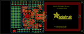
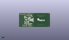
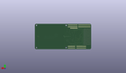
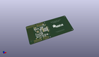

Contents
========

* [PROJ-ADAF-789-STAN-01>Adafruit PN532 RFID NFC Shield](#proj-adaf-789-stan-01adafruit-pn532-rfid-nfc-shield)
	* [Images](#images)
	* [Interactive BOM](#interactive-bom)
	* [Tags](#tags)
  
![][im]
# PROJ-ADAF-789-STAN-01>Adafruit PN532 RFID NFC Shield

- ID: PROJ-ADAF-789-STAN-01
- Hex ID: PRA789
- Name: Adafruit PN532 RFID NFC Shield
- Description: 

## Images
  
  

|eagleImage|kicadPcb3dFront|kicadPcb3dBack|kicadPcb3d|
| :---: | :---: | :---: | :---: |
|||||

## Interactive BOM

- Interactive BOM page: [ibom.html](kicad/bom/ibom.html)

## Tags

- hexID: PRA789
- oompType: PROJ
- oompSize: ADAF
- oompColor: 789
- oompDesc: STAN
- oompIndex: 01
- oompName: Adafruit PN532 RFID NFC Shield
- sources: All source files from https://github.com/adafruit/Adafruit-PN532-RFID-NFC-Shield (source licence details in srcLicense.md)
- linkBuyPage: http://www.adafruit.com/products/789
- oompID: PROJ-ADAF-789-STAN-01
- oompParts: C1,UNMATCHED-UNMATCHED-UNMATCHED-UNMATCHED-UNMATCHED
- oompParts: C2,UNMATCHED-UNMATCHED-UNMATCHED-UNMATCHED-UNMATCHED
- oompParts: C3,UNMATCHED-UNMATCHED-UNMATCHED-UNMATCHED-UNMATCHED
- oompParts: C4,UNMATCHED-UNMATCHED-UNMATCHED-UNMATCHED-UNMATCHED
- oompParts: C5,UNMATCHED-UNMATCHED-UNMATCHED-UNMATCHED-UNMATCHED
- oompParts: C6,UNMATCHED-UNMATCHED-UNMATCHED-UNMATCHED-UNMATCHED
- oompParts: C7,UNMATCHED-UNMATCHED-UNMATCHED-UNMATCHED-UNMATCHED
- oompParts: C8,UNMATCHED-UNMATCHED-UNMATCHED-UNMATCHED-UNMATCHED
- oompParts: C9,UNMATCHED-UNMATCHED-UNMATCHED-UNMATCHED-UNMATCHED
- oompParts: C10,UNMATCHED-UNMATCHED-UNMATCHED-UNMATCHED-UNMATCHED
- oompParts: C11,UNMATCHED-UNMATCHED-UNMATCHED-UNMATCHED-UNMATCHED
- oompParts: C12,UNMATCHED-UNMATCHED-UNMATCHED-UNMATCHED-UNMATCHED
- oompParts: C13,UNMATCHED-UNMATCHED-UNMATCHED-UNMATCHED-UNMATCHED
- oompParts: C14,UNMATCHED-UNMATCHED-UNMATCHED-UNMATCHED-UNMATCHED
- oompParts: C15,UNMATCHED-UNMATCHED-UNMATCHED-UNMATCHED-UNMATCHED
- oompParts: C16,UNMATCHED-UNMATCHED-UNMATCHED-UNMATCHED-UNMATCHED
- oompParts: C17,UNMATCHED-UNMATCHED-UNMATCHED-UNMATCHED-UNMATCHED
- oompParts: C18,UNMATCHED-UNMATCHED-UNMATCHED-UNMATCHED-UNMATCHED
- oompParts: C19,UNMATCHED-UNMATCHED-UNMATCHED-UNMATCHED-UNMATCHED
- oompParts: C20,UNMATCHED-UNMATCHED-UNMATCHED-UNMATCHED-UNMATCHED
- oompParts: C21,UNMATCHED-UNMATCHED-UNMATCHED-UNMATCHED-UNMATCHED
- oompParts: C22,UNMATCHED-UNMATCHED-UNMATCHED-UNMATCHED-UNMATCHED
- oompParts: C24,UNMATCHED-UNMATCHED-UNMATCHED-UNMATCHED-UNMATCHED
- oompParts: C25,UNMATCHED-UNMATCHED-UNMATCHED-UNMATCHED-UNMATCHED
- oompParts: C26,UNMATCHED-UNMATCHED-UNMATCHED-UNMATCHED-UNMATCHED
- oompParts: JP1,UNMATCHED-UNMATCHED-UNMATCHED-UNMATCHED-UNMATCHED
- oompParts: JP2,UNMATCHED-UNMATCHED-UNMATCHED-UNMATCHED-UNMATCHED
- oompParts: JP3,UNMATCHED-UNMATCHED-UNMATCHED-UNMATCHED-UNMATCHED
- oompParts: JP4,UNMATCHED-UNMATCHED-UNMATCHED-UNMATCHED-UNMATCHED
- oompParts: JP6,UNMATCHED-UNMATCHED-UNMATCHED-UNMATCHED-UNMATCHED
- oompParts: L1,UNMATCHED-UNMATCHED-UNMATCHED-UNMATCHED-UNMATCHED
- oompParts: L2,UNMATCHED-UNMATCHED-UNMATCHED-UNMATCHED-UNMATCHED
- oompParts: L3,UNMATCHED-UNMATCHED-UNMATCHED-UNMATCHED-UNMATCHED
- oompParts: L4,UNMATCHED-UNMATCHED-UNMATCHED-UNMATCHED-UNMATCHED
- oompParts: LED1,UNMATCHED-UNMATCHED-UNMATCHED-UNMATCHED-UNMATCHED
- oompParts: LED2,UNMATCHED-UNMATCHED-UNMATCHED-UNMATCHED-UNMATCHED
- oompParts: Q1,UNMATCHED-UNMATCHED-UNMATCHED-UNMATCHED-UNMATCHED
- oompParts: Q2,UNMATCHED-UNMATCHED-UNMATCHED-UNMATCHED-UNMATCHED
- oompParts: Q3,UNMATCHED-UNMATCHED-UNMATCHED-UNMATCHED-UNMATCHED
- oompParts: Q4,UNMATCHED-UNMATCHED-UNMATCHED-UNMATCHED-UNMATCHED
- oompParts: Q6,UNMATCHED-UNMATCHED-UNMATCHED-UNMATCHED-UNMATCHED
- oompParts: R1,UNMATCHED-UNMATCHED-UNMATCHED-UNMATCHED-UNMATCHED
- oompParts: R2,UNMATCHED-UNMATCHED-UNMATCHED-UNMATCHED-UNMATCHED
- oompParts: R3,UNMATCHED-UNMATCHED-UNMATCHED-UNMATCHED-UNMATCHED
- oompParts: R4,UNMATCHED-UNMATCHED-UNMATCHED-UNMATCHED-UNMATCHED
- oompParts: R5,UNMATCHED-UNMATCHED-UNMATCHED-UNMATCHED-UNMATCHED
- oompParts: R6,UNMATCHED-UNMATCHED-UNMATCHED-UNMATCHED-UNMATCHED
- oompParts: R7,UNMATCHED-UNMATCHED-UNMATCHED-UNMATCHED-UNMATCHED
- oompParts: R8,UNMATCHED-UNMATCHED-UNMATCHED-UNMATCHED-UNMATCHED
- oompParts: R9,UNMATCHED-UNMATCHED-UNMATCHED-UNMATCHED-UNMATCHED
- oompParts: R10,UNMATCHED-UNMATCHED-UNMATCHED-UNMATCHED-UNMATCHED
- oompParts: R11,UNMATCHED-UNMATCHED-UNMATCHED-UNMATCHED-UNMATCHED
- oompParts: R12,UNMATCHED-UNMATCHED-UNMATCHED-UNMATCHED-UNMATCHED
- oompParts: R13,UNMATCHED-UNMATCHED-UNMATCHED-UNMATCHED-UNMATCHED
- oompParts: R14,UNMATCHED-UNMATCHED-UNMATCHED-UNMATCHED-UNMATCHED
- oompParts: R15,UNMATCHED-UNMATCHED-UNMATCHED-UNMATCHED-UNMATCHED
- oompParts: R16,UNMATCHED-UNMATCHED-UNMATCHED-UNMATCHED-UNMATCHED
- oompParts: R17,UNMATCHED-UNMATCHED-UNMATCHED-UNMATCHED-UNMATCHED
- oompParts: R18,UNMATCHED-UNMATCHED-UNMATCHED-UNMATCHED-UNMATCHED
- oompParts: SJ1,UNMATCHED-UNMATCHED-UNMATCHED-UNMATCHED-UNMATCHED
- oompParts: SJ2,UNMATCHED-UNMATCHED-UNMATCHED-UNMATCHED-UNMATCHED
- oompParts: TP1,UNMATCHED-UNMATCHED-UNMATCHED-UNMATCHED-UNMATCHED
- oompParts: TP2,UNMATCHED-UNMATCHED-UNMATCHED-UNMATCHED-UNMATCHED
- oompParts: TP3,UNMATCHED-UNMATCHED-UNMATCHED-UNMATCHED-UNMATCHED
- oompParts: TP4,UNMATCHED-UNMATCHED-UNMATCHED-UNMATCHED-UNMATCHED
- oompParts: TP5,UNMATCHED-UNMATCHED-UNMATCHED-UNMATCHED-UNMATCHED
- oompParts: TP6,UNMATCHED-UNMATCHED-UNMATCHED-UNMATCHED-UNMATCHED
- oompParts: TP7,UNMATCHED-UNMATCHED-UNMATCHED-UNMATCHED-UNMATCHED
- oompParts: U1,UNMATCHED-UNMATCHED-UNMATCHED-UNMATCHED-UNMATCHED
- oompParts: U2,UNMATCHED-UNMATCHED-UNMATCHED-UNMATCHED-UNMATCHED
- oompParts: U3,UNMATCHED-UNMATCHED-UNMATCHED-UNMATCHED-UNMATCHED
- oompParts: Y1,UNMATCHED-UNMATCHED-UNMATCHED-UNMATCHED-UNMATCHED
- rawParts: C1,22pF,CAP_CERAMIC0805,0805,Ceramic Capacitors,,
- rawParts: C2,22pF,CAP_CERAMIC0805,0805,Ceramic Capacitors,,
- rawParts: C3,220pF,CAP_CERAMIC0805,0805,Ceramic Capacitors,,
- rawParts: C4,220pF,CAP_CERAMIC0805,0805,Ceramic Capacitors,,
- rawParts: C5,NC,CAP_CERAMIC0805,0805,Ceramic Capacitors,,
- rawParts: C6,NC,CAP_CERAMIC0805,0805,Ceramic Capacitors,,
- rawParts: C7,100pF,CAP_CERAMIC0805,0805,Ceramic Capacitors,,
- rawParts: C8,100pF,CAP_CERAMIC0805,0805,Ceramic Capacitors,,
- rawParts: C9,NC,CAP_CERAMIC0805,0805,Ceramic Capacitors,,
- rawParts: C10,NC,CAP_CERAMIC0805,0805,Ceramic Capacitors,,
- rawParts: C11,0.1µF,CAP_CERAMIC0805,0805,Ceramic Capacitors,,
- rawParts: C12,33pF,CAP_CERAMIC0805,0805,Ceramic Capacitors,,
- rawParts: C13,33pF,CAP_CERAMIC0805,0805,Ceramic Capacitors,,
- rawParts: C14,0.1µF,CAP_CERAMIC0805,0805,Ceramic Capacitors,,
- rawParts: C15,1000pF,CAP_CERAMIC0805,0805,Ceramic Capacitors,,
- rawParts: C16,0.1µF,CAP_CERAMIC0805,0805,Ceramic Capacitors,,
- rawParts: C17,0.1µF,CAP_CERAMIC0805,0805,Ceramic Capacitors,,
- rawParts: C18,10µF,CAP_CERAMIC0805,0805,Ceramic Capacitors,,
- rawParts: C19,10µF,CAP_CERAMIC0805,0805,Ceramic Capacitors,,
- rawParts: C20,0.1µF,CAP_CERAMIC0805,0805,Ceramic Capacitors,,
- rawParts: C21,10µF,CAP_CERAMIC0805,0805,Ceramic Capacitors,,
- rawParts: C22,10µF,CAP_CERAMIC0805,0805,Ceramic Capacitors,,
- rawParts: C24,0.1µF,CAP_CERAMIC0805,0805,Ceramic Capacitors,,
- rawParts: C25,10µF,CAP_CERAMIC0805,0805,Ceramic Capacitors,,
- rawParts: C26,10µF,CAP_CERAMIC0805,0805,Ceramic Capacitors,,
- rawParts: FID1,FIDUCIAL1X2.5,FIDUCIAL1X2.5,FIDUCIAL-1X2.5,Fiducial Alignment Points,EXCLUDE,
- rawParts: FID2,FIDUCIAL1X2.5,FIDUCIAL1X2.5,FIDUCIAL-1X2.5,Fiducial Alignment Points,EXCLUDE,
- rawParts: JP1,,HEADER-1X870MIL,1X08_ROUND_70,PIN HEADER,,
- rawParts: JP2,,HEADER-1X670MIL,1X06_ROUND_70,PIN HEADER,,
- rawParts: JP3,,HEADER-1X1070MIL,1X10_ROUND70,PIN HEADER,,
- rawParts: JP4,,HEADER-1X870MIL,1X08_ROUND_70,PIN HEADER,,
- rawParts: JP6,,PINHD-1X6B,1X06-BIG,PIN HEADER,,
- rawParts: L1,FERRITE,FERRITE0805,0805,Ferrite Bead,,
- rawParts: L2,FERRITE,FERRITE0805,0805,Ferrite Bead,,
- rawParts: L3,560nH,INDUCTOR0805,0805,Inductors,,
- rawParts: L4,560nH,INDUCTOR0805,0805,Inductors,,
- rawParts: LED1,PWR,LED0805,CHIPLED_0805,LED,,
- rawParts: LED2,IRQ,LED0805,CHIPLED_0805,LED,,
- rawParts: Q1,BSS138,MOSFET-NWIDE,SOT23-WIDE,N-Channel Mosfet,,
- rawParts: Q2,BSS138,MOSFET-NWIDE,SOT23-WIDE,N-Channel Mosfet,,
- rawParts: Q3,BSS138,MOSFET-NWIDE,SOT23-WIDE,N-Channel Mosfet,,
- rawParts: Q4,BSS138,MOSFET-NWIDE,SOT23-WIDE,N-Channel Mosfet,,
- rawParts: Q6,BSS138,MOSFET-NWIDE,SOT23-WIDE,N-Channel Mosfet,,
- rawParts: R1,1.0K,RESISTOR0805,0805,Resistors,,
- rawParts: R2,1.69K,RESISTOR0805,0805,Resistors,,
- rawParts: R3,1.5,RESISTOR0805,0805,Resistors,,
- rawParts: R4,1.5,RESISTOR0805,0805,Resistors,,
- rawParts: R5,NC,R-EU_R0201,R0201,RESISTOR, European symbol,,
- rawParts: R6,NC,R-EU_R0201,R0201,RESISTOR, European symbol,,
- rawParts: R7,10K,RESISTOR0805,0805,Resistors,,
- rawParts: R8,TBD,RESISTOR0805,0805,Resistors,,
- rawParts: R9,10K,RESISTOR0805,0805,Resistors,,
- rawParts: R10,TBD,RESISTOR0805,0805,Resistors,,
- rawParts: R11,10K,RESISTOR0805,0805,Resistors,,
- rawParts: R12,10K,RESISTOR0805,0805,Resistors,,
- rawParts: R13,10K,RESISTOR0805,0805,Resistors,,
- rawParts: R14,10K,RESISTOR0805,0805,Resistors,,
- rawParts: R15,10K,RESISTOR0805,0805,Resistors,,
- rawParts: R16,10K,RESISTOR0805,0805,Resistors,,
- rawParts: R17,10K,RESISTOR0805,0805,Resistors,,
- rawParts: R18,10K,RESISTOR0805,0805,Resistors,,
- rawParts: SJ1,,SOLDERJUMPERREFLOW_NOPASTE,SOLDERJUMPER_REFLOW_NOPASTE,SMD Solder JUMPER,,
- rawParts: SJ2,,SOLDERJUMPERREFLOW_NOPASTE,SOLDERJUMPER_REFLOW_NOPASTE,SMD Solder JUMPER,,
- rawParts: TP1,TX1_POST,TESTPOINTPAD,TESTPOINT_PAD_2MM,Test Point,,
- rawParts: TP2,TGND,TESTPOINTPAD,TESTPOINT_PAD_2MM,Test Point,,
- rawParts: TP3,TX2_POST,TESTPOINTPAD,TESTPOINT_PAD_2MM,Test Point,,
- rawParts: TP4,TX2_PRE,TESTPOINTPAD,TESTPOINT_PAD_2MM,Test Point,,
- rawParts: TP5,TX1_PRE,TESTPOINTPAD,TESTPOINT_PAD_2MM,Test Point,,
- rawParts: TP6,TGND,TESTPOINTPAD,TESTPOINT_PAD_2MM,Test Point,,
- rawParts: TP7,RX,TESTPOINTPAD,TESTPOINT_PAD_2MM,Test Point,,
- rawParts: U1,PN532,PN532,HVQFN40-6X6,PN532 - Near Field Communication (NFC) controller,,
- rawParts: U2,ADP122(3.3V),VREG_SOT23-5,SOT23-5,SOT23-5 Fixed Voltage Regulators,,
- rawParts: U3,ARDUINOR3NODIM,ARDUINOR3NODIM,ARDUINOR3-NODIM,This is a new object for the new Arduino R3 - with extra pins that you may want to use (such as IOref, and duplicated A4/A5,,
- rawParts: Y1,27.12MHz,CRYSTAL3.2X2.5,CRYSTAL_3.2X2.5,Crystals,,

[im]: kicadPcb3d_450.png
