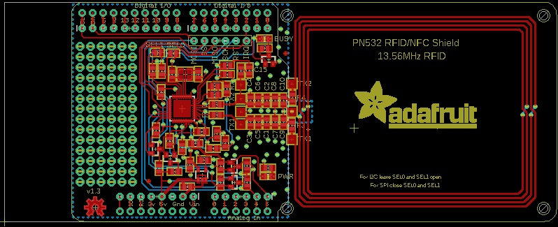
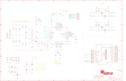

Contents
========

* [PRA789 > Adafruit PN532 RFID NFC Shield](#pra789--adafruit-pn532-rfid-nfc-shield)
	* [Schematic](#schematic)
	* [PCB](#pcb)
	* [Interactive BOM](#interactive-bom)
	* [OOMP Parts](#oomp-parts)
	* [Images](#images)
	* [Tags](#tags)
  
![][im]
# PRA789 > Adafruit PN532 RFID NFC Shield

- ID: PROJ-ADAF-789-STAN-01
- Hex ID: PRA789
- Name: Adafruit
- Description: Adafruit
- Long Link: [http://oom.lt/PROJ-ADAF-789-STAN-01](http://oom.lt/PROJ-ADAF-789-STAN-01)
- Short Link: [http://oom.lt/PRA789](http://oom.lt/PRA789)

## Schematic
  

## PCB
  

## Interactive BOM

- Interactive BOM page: [ibom.html](https://htmlpreview.github.io/?https://github.com/oomlout/oomlout_OOMP_projects/blob/main/PROJ-ADAF-789-STAN-01/kicad/bom/ibom.html)

## OOMP Parts
  

|OOMP Parts|
| :---: |
|C1 C1,CAPC-0805-X-PF22-01|
|C2 C2,CAPC-0805-X-PF22-01|
|C3 C3,CAPC-0805-X-PF220-01|
|C4 C4,CAPC-0805-X-PF220-01|
|[C5 CAPC-0805-X-NF100-V50 SMD (0805) 100 nF Capacitor (Ceramic) 50v](https://github.com/oomlout/oomlout_OOMP_parts/tree/main/CAPC-0805-X-NF100-V50/)|
|[C6 CAPC-0805-X-NF100-V50 SMD (0805) 100 nF Capacitor (Ceramic) 50v](https://github.com/oomlout/oomlout_OOMP_parts/tree/main/CAPC-0805-X-NF100-V50/)|
|C7 C7,CAPC-0805-X-PF100-01|
|C8 C8,CAPC-0805-X-PF100-01|
|[C9 CAPC-0805-X-NF100-V50 SMD (0805) 100 nF Capacitor (Ceramic) 50v](https://github.com/oomlout/oomlout_OOMP_parts/tree/main/CAPC-0805-X-NF100-V50/)|
|[C10 CAPC-0805-X-NF100-V50 SMD (0805) 100 nF Capacitor (Ceramic) 50v](https://github.com/oomlout/oomlout_OOMP_parts/tree/main/CAPC-0805-X-NF100-V50/)|
|C11 C11,CAPC-0805-X-UF1D-01|
|C12 C12,CAPC-0805-X-PF33-01|
|C13 C13,CAPC-0805-X-PF33-01|
|C14 C14,CAPC-0805-X-UF1D-01|
|C15 C15,CAPC-0805-X-UNMATCHED-01|
|C16 C16,CAPC-0805-X-UF1D-01|
|C17 C17,CAPC-0805-X-UF1D-01|
|[C18 CAPC-0805-X-UF10-V10 SMD (0805) 10 uF Capacitor (Ceramic) 10v](https://github.com/oomlout/oomlout_OOMP_parts/tree/main/CAPC-0805-X-UF10-V10/)|
|[C19 CAPC-0805-X-UF10-V10 SMD (0805) 10 uF Capacitor (Ceramic) 10v](https://github.com/oomlout/oomlout_OOMP_parts/tree/main/CAPC-0805-X-UF10-V10/)|
|C20 C20,CAPC-0805-X-UF1D-01|
|[C21 CAPC-0805-X-UF10-V10 SMD (0805) 10 uF Capacitor (Ceramic) 10v](https://github.com/oomlout/oomlout_OOMP_parts/tree/main/CAPC-0805-X-UF10-V10/)|
|[C22 CAPC-0805-X-UF10-V10 SMD (0805) 10 uF Capacitor (Ceramic) 10v](https://github.com/oomlout/oomlout_OOMP_parts/tree/main/CAPC-0805-X-UF10-V10/)|
|C24 C24,CAPC-0805-X-UF1D-01|
|[C25 CAPC-0805-X-UF10-V10 SMD (0805) 10 uF Capacitor (Ceramic) 10v](https://github.com/oomlout/oomlout_OOMP_parts/tree/main/CAPC-0805-X-UF10-V10/)|
|[C26 CAPC-0805-X-UF10-V10 SMD (0805) 10 uF Capacitor (Ceramic) 10v](https://github.com/oomlout/oomlout_OOMP_parts/tree/main/CAPC-0805-X-UF10-V10/)|
|[JP1 HEAD-I01-X-PI08-01 2.54 mm 8 Pin Header](https://github.com/oomlout/oomlout_OOMP_parts/tree/main/HEAD-I01-X-PI08-01/)|
|[JP2 HEAD-I01-X-PI06-01 2.54 mm 6 Pin Header](https://github.com/oomlout/oomlout_OOMP_parts/tree/main/HEAD-I01-X-PI06-01/)|
|[JP3 HEAD-I01-X-PI10-01 2.54 mm 10 Pin Header](https://github.com/oomlout/oomlout_OOMP_parts/tree/main/HEAD-I01-X-PI10-01/)|
|[JP4 HEAD-I01-X-PI08-01 2.54 mm 8 Pin Header](https://github.com/oomlout/oomlout_OOMP_parts/tree/main/HEAD-I01-X-PI08-01/)|
|[JP6 HEAD-I01-X-PI06-01 2.54 mm 6 Pin Header](https://github.com/oomlout/oomlout_OOMP_parts/tree/main/HEAD-I01-X-PI06-01/)|
|L1 L1,UNMATCHED-0805-X-UNMATCHED-01|
|L2 L2,UNMATCHED-0805-X-UNMATCHED-01|
|L3 L3,UNMATCHED-0805-X-UNMATCHED-01|
|L4 L4,UNMATCHED-0805-X-UNMATCHED-01|
|[LED1 LEDS-0805-G-STAN-01 SMD (0805) Green LED](https://github.com/oomlout/oomlout_OOMP_parts/tree/main/LEDS-0805-G-STAN-01/)|
|[LED2 LEDS-0805-G-STAN-01 SMD (0805) Green LED](https://github.com/oomlout/oomlout_OOMP_parts/tree/main/LEDS-0805-G-STAN-01/)|
|[Q1 MOSN-SO23-X-KBSS138-01 SMD (SOT-23) BSS138 N-Ch. MOSFET](https://github.com/oomlout/oomlout_OOMP_parts/tree/main/MOSN-SO23-X-KBSS138-01/)|
|[Q2 MOSN-SO23-X-KBSS138-01 SMD (SOT-23) BSS138 N-Ch. MOSFET](https://github.com/oomlout/oomlout_OOMP_parts/tree/main/MOSN-SO23-X-KBSS138-01/)|
|[Q3 MOSN-SO23-X-KBSS138-01 SMD (SOT-23) BSS138 N-Ch. MOSFET](https://github.com/oomlout/oomlout_OOMP_parts/tree/main/MOSN-SO23-X-KBSS138-01/)|
|[Q4 MOSN-SO23-X-KBSS138-01 SMD (SOT-23) BSS138 N-Ch. MOSFET](https://github.com/oomlout/oomlout_OOMP_parts/tree/main/MOSN-SO23-X-KBSS138-01/)|
|[Q6 MOSN-SO23-X-KBSS138-01 SMD (SOT-23) BSS138 N-Ch. MOSFET](https://github.com/oomlout/oomlout_OOMP_parts/tree/main/MOSN-SO23-X-KBSS138-01/)|
|[R1 RESE-0805-X-O102-01 SMD (0805) 1k Ohm Resistor](https://github.com/oomlout/oomlout_OOMP_parts/tree/main/RESE-0805-X-O102-01/)|
|R2 R2,RESE-0805-X-UNMATCHED-01|
|R3 R3,RESE-0805-X-UNMATCHED-01|
|R4 R4,RESE-0805-X-UNMATCHED-01|
|R5 R5,RESE-UNMATCHED-X-UNMATCHED-01|
|R6 R6,RESE-UNMATCHED-X-UNMATCHED-01|
|[R7 RESE-0805-X-O103-01 SMD (0805) 10k Ohm Resistor](https://github.com/oomlout/oomlout_OOMP_parts/tree/main/RESE-0805-X-O103-01/)|
|R8 R8,RESE-0805-X-UNMATCHED-01|
|[R9 RESE-0805-X-O103-01 SMD (0805) 10k Ohm Resistor](https://github.com/oomlout/oomlout_OOMP_parts/tree/main/RESE-0805-X-O103-01/)|
|R10 R10,RESE-0805-X-UNMATCHED-01|
|[R11 RESE-0805-X-O103-01 SMD (0805) 10k Ohm Resistor](https://github.com/oomlout/oomlout_OOMP_parts/tree/main/RESE-0805-X-O103-01/)|
|[R12 RESE-0805-X-O103-01 SMD (0805) 10k Ohm Resistor](https://github.com/oomlout/oomlout_OOMP_parts/tree/main/RESE-0805-X-O103-01/)|
|[R13 RESE-0805-X-O103-01 SMD (0805) 10k Ohm Resistor](https://github.com/oomlout/oomlout_OOMP_parts/tree/main/RESE-0805-X-O103-01/)|
|[R14 RESE-0805-X-O103-01 SMD (0805) 10k Ohm Resistor](https://github.com/oomlout/oomlout_OOMP_parts/tree/main/RESE-0805-X-O103-01/)|
|[R15 RESE-0805-X-O103-01 SMD (0805) 10k Ohm Resistor](https://github.com/oomlout/oomlout_OOMP_parts/tree/main/RESE-0805-X-O103-01/)|
|[R16 RESE-0805-X-O103-01 SMD (0805) 10k Ohm Resistor](https://github.com/oomlout/oomlout_OOMP_parts/tree/main/RESE-0805-X-O103-01/)|
|[R17 RESE-0805-X-O103-01 SMD (0805) 10k Ohm Resistor](https://github.com/oomlout/oomlout_OOMP_parts/tree/main/RESE-0805-X-O103-01/)|
|[R18 RESE-0805-X-O103-01 SMD (0805) 10k Ohm Resistor](https://github.com/oomlout/oomlout_OOMP_parts/tree/main/RESE-0805-X-O103-01/)|
|TP1 TP1,UNMATCHED-UNMATCHED-X-UNMATCHED-01|
|TP2 TP2,UNMATCHED-UNMATCHED-X-UNMATCHED-01|
|TP3 TP3,UNMATCHED-UNMATCHED-X-UNMATCHED-01|
|TP4 TP4,UNMATCHED-UNMATCHED-X-UNMATCHED-01|
|TP5 TP5,UNMATCHED-UNMATCHED-X-UNMATCHED-01|
|TP6 TP6,UNMATCHED-UNMATCHED-X-UNMATCHED-01|
|TP7 TP7,UNMATCHED-UNMATCHED-X-UNMATCHED-01|
|U1 U1,UNMATCHED-UNMATCHED-X-UNMATCHED-01|
|U2 U2,UNMATCHED-SO235-X-UNMATCHED-01|
|U3 U3,UNMATCHED-UNMATCHED-X-UNMATCHED-01|
|Y1 Y1,UNMATCHED-UNMATCHED-X-UNMATCHED-01|

## Images
  
  

|kicadPcb3d|kicadPcb3dFront|kicadPcb3dBack|eagleImage|eagleSchemImage|
| :---: | :---: | :---: | :---: | :---: |
||||||

## Tags

- hexID: PRA789
- oompType: PROJ
- oompSize: ADAF
- oompColor: 789
- oompDesc: STAN
- oompIndex: 01
- oompName: Adafruit PN532 RFID NFC Shield
- sources: All source files from https://github.com/adafruit/Adafruit-PN532-RFID-NFC-Shield (source licence details in srcLicense.md)
- linkBuyPage: http://www.adafruit.com/products/789
- oompID: PROJ-ADAF-789-STAN-01
- oompParts: C1,CAPC-0805-X-PF22-01
- oompParts: C2,CAPC-0805-X-PF22-01
- oompParts: C3,CAPC-0805-X-PF220-01
- oompParts: C4,CAPC-0805-X-PF220-01
- oompParts: C5,CAPC-0805-X-NF100-V50
- oompParts: C6,CAPC-0805-X-NF100-V50
- oompParts: C7,CAPC-0805-X-PF100-01
- oompParts: C8,CAPC-0805-X-PF100-01
- oompParts: C9,CAPC-0805-X-NF100-V50
- oompParts: C10,CAPC-0805-X-NF100-V50
- oompParts: C11,CAPC-0805-X-UF1D-01
- oompParts: C12,CAPC-0805-X-PF33-01
- oompParts: C13,CAPC-0805-X-PF33-01
- oompParts: C14,CAPC-0805-X-UF1D-01
- oompParts: C15,CAPC-0805-X-UNMATCHED-01
- oompParts: C16,CAPC-0805-X-UF1D-01
- oompParts: C17,CAPC-0805-X-UF1D-01
- oompParts: C18,CAPC-0805-X-UF10-V10
- oompParts: C19,CAPC-0805-X-UF10-V10
- oompParts: C20,CAPC-0805-X-UF1D-01
- oompParts: C21,CAPC-0805-X-UF10-V10
- oompParts: C22,CAPC-0805-X-UF10-V10
- oompParts: C24,CAPC-0805-X-UF1D-01
- oompParts: C25,CAPC-0805-X-UF10-V10
- oompParts: C26,CAPC-0805-X-UF10-V10
- oompParts: JP1,HEAD-I01-X-PI08-01
- oompParts: JP2,HEAD-I01-X-PI06-01
- oompParts: JP3,HEAD-I01-X-PI10-01
- oompParts: JP4,HEAD-I01-X-PI08-01
- oompParts: JP6,HEAD-I01-X-PI06-01
- oompParts: L1,UNMATCHED-0805-X-UNMATCHED-01
- oompParts: L2,UNMATCHED-0805-X-UNMATCHED-01
- oompParts: L3,UNMATCHED-0805-X-UNMATCHED-01
- oompParts: L4,UNMATCHED-0805-X-UNMATCHED-01
- oompParts: LED1,LEDS-0805-G-STAN-01
- oompParts: LED2,LEDS-0805-G-STAN-01
- oompParts: Q1,MOSN-SO23-X-KBSS138-01
- oompParts: Q2,MOSN-SO23-X-KBSS138-01
- oompParts: Q3,MOSN-SO23-X-KBSS138-01
- oompParts: Q4,MOSN-SO23-X-KBSS138-01
- oompParts: Q6,MOSN-SO23-X-KBSS138-01
- oompParts: R1,RESE-0805-X-O102-01
- oompParts: R2,RESE-0805-X-UNMATCHED-01
- oompParts: R3,RESE-0805-X-UNMATCHED-01
- oompParts: R4,RESE-0805-X-UNMATCHED-01
- oompParts: R5,RESE-UNMATCHED-X-UNMATCHED-01
- oompParts: R6,RESE-UNMATCHED-X-UNMATCHED-01
- oompParts: R7,RESE-0805-X-O103-01
- oompParts: R8,RESE-0805-X-UNMATCHED-01
- oompParts: R9,RESE-0805-X-O103-01
- oompParts: R10,RESE-0805-X-UNMATCHED-01
- oompParts: R11,RESE-0805-X-O103-01
- oompParts: R12,RESE-0805-X-O103-01
- oompParts: R13,RESE-0805-X-O103-01
- oompParts: R14,RESE-0805-X-O103-01
- oompParts: R15,RESE-0805-X-O103-01
- oompParts: R16,RESE-0805-X-O103-01
- oompParts: R17,RESE-0805-X-O103-01
- oompParts: R18,RESE-0805-X-O103-01
- oompParts: TP1,UNMATCHED-UNMATCHED-X-UNMATCHED-01
- oompParts: TP2,UNMATCHED-UNMATCHED-X-UNMATCHED-01
- oompParts: TP3,UNMATCHED-UNMATCHED-X-UNMATCHED-01
- oompParts: TP4,UNMATCHED-UNMATCHED-X-UNMATCHED-01
- oompParts: TP5,UNMATCHED-UNMATCHED-X-UNMATCHED-01
- oompParts: TP6,UNMATCHED-UNMATCHED-X-UNMATCHED-01
- oompParts: TP7,UNMATCHED-UNMATCHED-X-UNMATCHED-01
- oompParts: U1,UNMATCHED-UNMATCHED-X-UNMATCHED-01
- oompParts: U2,UNMATCHED-SO235-X-UNMATCHED-01
- oompParts: U3,UNMATCHED-UNMATCHED-X-UNMATCHED-01
- oompParts: Y1,UNMATCHED-UNMATCHED-X-UNMATCHED-01
- rawParts: C1,22pF,CAP_CERAMIC0805,0805,Ceramic Capacitors,,
- rawParts: C2,22pF,CAP_CERAMIC0805,0805,Ceramic Capacitors,,
- rawParts: C3,220pF,CAP_CERAMIC0805,0805,Ceramic Capacitors,,
- rawParts: C4,220pF,CAP_CERAMIC0805,0805,Ceramic Capacitors,,
- rawParts: C5,NC,CAP_CERAMIC0805,0805,Ceramic Capacitors,,
- rawParts: C6,NC,CAP_CERAMIC0805,0805,Ceramic Capacitors,,
- rawParts: C7,100pF,CAP_CERAMIC0805,0805,Ceramic Capacitors,,
- rawParts: C8,100pF,CAP_CERAMIC0805,0805,Ceramic Capacitors,,
- rawParts: C9,NC,CAP_CERAMIC0805,0805,Ceramic Capacitors,,
- rawParts: C10,NC,CAP_CERAMIC0805,0805,Ceramic Capacitors,,
- rawParts: C11,0.1µF,CAP_CERAMIC0805,0805,Ceramic Capacitors,,
- rawParts: C12,33pF,CAP_CERAMIC0805,0805,Ceramic Capacitors,,
- rawParts: C13,33pF,CAP_CERAMIC0805,0805,Ceramic Capacitors,,
- rawParts: C14,0.1µF,CAP_CERAMIC0805,0805,Ceramic Capacitors,,
- rawParts: C15,1000pF,CAP_CERAMIC0805,0805,Ceramic Capacitors,,
- rawParts: C16,0.1µF,CAP_CERAMIC0805,0805,Ceramic Capacitors,,
- rawParts: C17,0.1µF,CAP_CERAMIC0805,0805,Ceramic Capacitors,,
- rawParts: C18,10µF,CAP_CERAMIC0805,0805,Ceramic Capacitors,,
- rawParts: C19,10µF,CAP_CERAMIC0805,0805,Ceramic Capacitors,,
- rawParts: C20,0.1µF,CAP_CERAMIC0805,0805,Ceramic Capacitors,,
- rawParts: C21,10µF,CAP_CERAMIC0805,0805,Ceramic Capacitors,,
- rawParts: C22,10µF,CAP_CERAMIC0805,0805,Ceramic Capacitors,,
- rawParts: C24,0.1µF,CAP_CERAMIC0805,0805,Ceramic Capacitors,,
- rawParts: C25,10µF,CAP_CERAMIC0805,0805,Ceramic Capacitors,,
- rawParts: C26,10µF,CAP_CERAMIC0805,0805,Ceramic Capacitors,,
- rawParts: FID1,FIDUCIAL1X2.5,FIDUCIAL1X2.5,FIDUCIAL-1X2.5,Fiducial Alignment Points,EXCLUDE,
- rawParts: FID2,FIDUCIAL1X2.5,FIDUCIAL1X2.5,FIDUCIAL-1X2.5,Fiducial Alignment Points,EXCLUDE,
- rawParts: JP1,,HEADER-1X870MIL,1X08_ROUND_70,PIN HEADER,,
- rawParts: JP2,,HEADER-1X670MIL,1X06_ROUND_70,PIN HEADER,,
- rawParts: JP3,,HEADER-1X1070MIL,1X10_ROUND70,PIN HEADER,,
- rawParts: JP4,,HEADER-1X870MIL,1X08_ROUND_70,PIN HEADER,,
- rawParts: JP6,,PINHD-1X6B,1X06-BIG,PIN HEADER,,
- rawParts: L1,FERRITE,FERRITE0805,0805,Ferrite Bead,,
- rawParts: L2,FERRITE,FERRITE0805,0805,Ferrite Bead,,
- rawParts: L3,560nH,INDUCTOR0805,0805,Inductors,,
- rawParts: L4,560nH,INDUCTOR0805,0805,Inductors,,
- rawParts: LED1,PWR,LED0805,CHIPLED_0805,LED,,
- rawParts: LED2,IRQ,LED0805,CHIPLED_0805,LED,,
- rawParts: Q1,BSS138,MOSFET-NWIDE,SOT23-WIDE,N-Channel Mosfet,,
- rawParts: Q2,BSS138,MOSFET-NWIDE,SOT23-WIDE,N-Channel Mosfet,,
- rawParts: Q3,BSS138,MOSFET-NWIDE,SOT23-WIDE,N-Channel Mosfet,,
- rawParts: Q4,BSS138,MOSFET-NWIDE,SOT23-WIDE,N-Channel Mosfet,,
- rawParts: Q6,BSS138,MOSFET-NWIDE,SOT23-WIDE,N-Channel Mosfet,,
- rawParts: R1,1.0K,RESISTOR0805,0805,Resistors,,
- rawParts: R2,1.69K,RESISTOR0805,0805,Resistors,,
- rawParts: R3,1.5,RESISTOR0805,0805,Resistors,,
- rawParts: R4,1.5,RESISTOR0805,0805,Resistors,,
- rawParts: R5,NC,R-EU_R0201,R0201,RESISTOR, European symbol,,
- rawParts: R6,NC,R-EU_R0201,R0201,RESISTOR, European symbol,,
- rawParts: R7,10K,RESISTOR0805,0805,Resistors,,
- rawParts: R8,TBD,RESISTOR0805,0805,Resistors,,
- rawParts: R9,10K,RESISTOR0805,0805,Resistors,,
- rawParts: R10,TBD,RESISTOR0805,0805,Resistors,,
- rawParts: R11,10K,RESISTOR0805,0805,Resistors,,
- rawParts: R12,10K,RESISTOR0805,0805,Resistors,,
- rawParts: R13,10K,RESISTOR0805,0805,Resistors,,
- rawParts: R14,10K,RESISTOR0805,0805,Resistors,,
- rawParts: R15,10K,RESISTOR0805,0805,Resistors,,
- rawParts: R16,10K,RESISTOR0805,0805,Resistors,,
- rawParts: R17,10K,RESISTOR0805,0805,Resistors,,
- rawParts: R18,10K,RESISTOR0805,0805,Resistors,,
- rawParts: SJ1,,SOLDERJUMPERREFLOW_NOPASTE,SOLDERJUMPER_REFLOW_NOPASTE,SMD Solder JUMPER,,
- rawParts: SJ2,,SOLDERJUMPERREFLOW_NOPASTE,SOLDERJUMPER_REFLOW_NOPASTE,SMD Solder JUMPER,,
- rawParts: TP1,TX1_POST,TESTPOINTPAD,TESTPOINT_PAD_2MM,Test Point,,
- rawParts: TP2,TGND,TESTPOINTPAD,TESTPOINT_PAD_2MM,Test Point,,
- rawParts: TP3,TX2_POST,TESTPOINTPAD,TESTPOINT_PAD_2MM,Test Point,,
- rawParts: TP4,TX2_PRE,TESTPOINTPAD,TESTPOINT_PAD_2MM,Test Point,,
- rawParts: TP5,TX1_PRE,TESTPOINTPAD,TESTPOINT_PAD_2MM,Test Point,,
- rawParts: TP6,TGND,TESTPOINTPAD,TESTPOINT_PAD_2MM,Test Point,,
- rawParts: TP7,RX,TESTPOINTPAD,TESTPOINT_PAD_2MM,Test Point,,
- rawParts: U1,PN532,PN532,HVQFN40-6X6,PN532 - Near Field Communication (NFC) controller,,
- rawParts: U2,ADP122(3.3V),VREG_SOT23-5,SOT23-5,SOT23-5 Fixed Voltage Regulators,,
- rawParts: U3,ARDUINOR3NODIM,ARDUINOR3NODIM,ARDUINOR3-NODIM,This is a new object for the new Arduino R3 - with extra pins that you may want to use (such as IOref, and duplicated A4/A5,,
- rawParts: Y1,27.12MHz,CRYSTAL3.2X2.5,CRYSTAL_3.2X2.5,Crystals,,

[im]: kicadPcb3d_450.png
