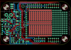

Contents
========

* [PROJ-ADAF-795-STAN-01>Adafruit Menta PCB](#proj-adaf-795-stan-01adafruit-menta-pcb)
	* [Images](#images)
	* [OOMP Parts](#oomp-parts)
	* [Tags](#tags)
  
![][im]
# PROJ-ADAF-795-STAN-01>Adafruit Menta PCB

- ID: PROJ-ADAF-795-STAN-01
- Hex ID: PRA795
- Name: Adafruit Menta PCB
- Description: 

## Images
  
  

|eagleImage|kicadPcb3dFront|kicadPcb3dBack|kicadPcb3d|
| :---: | :---: | :---: | :---: |
|||||

## OOMP Parts
  

|OOMP Parts|
| :---: |
|CAPC-UNMATCHED-X-NF100-V50, C1, 21.462999999999997, 43.053, 0,C1, 0.1uF, C025-025X050, minimidi, (0.845, 1.695), R0|
|CAPC-UNMATCHED-X-NF100-V50, C2, 35.178999999999995, 4.444999999999999, 180,C2, 0.1uF, C025-025X050, minimidi, (1.385, 0.175), R180|
|UNMATCHED-UNMATCHED-X-UNMATCHED-01, C3, 21.717, 37.465, 0,C3, 10uF/25V, E2,5-6, minimidi, (0.855, 1.475), R0|
|UNMATCHED-UNMATCHED-X-UF100-01, C4, 21.843999999999998, 31.241999999999997, 0,C4, 100/6VuF, E2,5-6, minimidi, (0.86, 1.23), R0|
|CAPC-UNMATCHED-X-NF100-V50, C5, 21.843999999999998, 26.924, 0,C5, 0.1uF, C025-025X050, minimidi, (0.86, 1.06), R0|
|CAPC-UNMATCHED-X-NF100-V50, C6, 14.224, 30.861, 270,C6, 0.1uF, C025-025X050, minimidi, (0.56, 1.215), R270|
|UNMATCHED-UNMATCHED-X-UF100-01, C7, 29.463999999999995, 4.191, 270,C7, 100/6VuF, E2,5-6, minimidi, (1.16, 0.165), R270|
|UNMATCHED-UNMATCHED-X-UNMATCHED-01, D1, 17.525999999999996, 38.608, 270,D1, 1N4001, DO41-10, minimidi, (0.69, 1.52), R270|
|UNMATCHED-UNMATCHED-X-UNMATCHED-01, D2, 2.2859999999999996, 31.75, 270,D2, LED3MM, adafruit, (0.09, 1.25), R270|
|UNMATCHED-UNMATCHED-X-UNMATCHED-01, D3, 6.604, 31.75, 270,D3, Green, LED3MM, adafruit, (0.26, 1.25), R270|
|UNMATCHED-UNMATCHED-X-UNMATCHED-01, IC1, 29.845, 25.907999999999998, 90,IC1, ATMEGA168P, DIL28/3, avr, (1.175, 1.02), R90|
|UNMATCHED-UNMATCHED-X-UNMATCHED-01, IC2, 24.511, 4.571999999999999, 90,IC2, TO92-INLINE, adafruit, (0.965, 0.18), R90|
|UNMATCHED-UNMATCHED-X-UNMATCHED-01, IC3, 24.511, 50.546, 270,IC3, 7805T, TO220H, adafruit, (0.965, 1.99), R270|
|UNMATCHED-UNMATCHED-X-UNMATCHED-01, J1, 4.444999999999999, 39.116, 90,J1, 2.1MMJACK, PJ-102A, minimidi, (0.175, 1.54), R90|
|<table><tr><td></td><td> JP1</td><td>[HEAD-I01-X-PI06-01 2.54 mm 6 Pin Header](https://github.com/oomlout/oomlout_OOMP_parts/tree/main/HEAD-I01-X-PI06-01/)</td><td>[H06](https://github.com/oomlout/oomlout_OOMP_parts/tree/main/HEAD-I01-X-PI06-01/)</td></tr></table>|
|<table><tr><td></td><td> JP2</td><td>[HEAD-I01-X-PI06-01 2.54 mm 6 Pin Header](https://github.com/oomlout/oomlout_OOMP_parts/tree/main/HEAD-I01-X-PI06-01/)</td><td>[H06](https://github.com/oomlout/oomlout_OOMP_parts/tree/main/HEAD-I01-X-PI06-01/)</td></tr></table>|
|UNMATCHED-UNMATCHED-X-UNMATCHED-01, JP3, 15.875, 6.095999999999999, 90,JP3, 2X03, pinhead-ez, (0.625, 0.24), R90|
|<table><tr><td></td><td> JP4</td><td>[HEAD-I01-X-PI08-01 2.54 mm 8 Pin Header](https://github.com/oomlout/oomlout_OOMP_parts/tree/main/HEAD-I01-X-PI08-01/)</td><td>[H08](https://github.com/oomlout/oomlout_OOMP_parts/tree/main/HEAD-I01-X-PI08-01/)</td></tr></table>|
|<table><tr><td></td><td> JP5</td><td>[HEAD-I01-X-PI08-01 2.54 mm 8 Pin Header](https://github.com/oomlout/oomlout_OOMP_parts/tree/main/HEAD-I01-X-PI08-01/)</td><td>[H08](https://github.com/oomlout/oomlout_OOMP_parts/tree/main/HEAD-I01-X-PI08-01/)</td></tr></table>|
|<table><tr><td></td><td> JP7</td><td>[HEAD-I01-X-PI06-01 2.54 mm 6 Pin Header](https://github.com/oomlout/oomlout_OOMP_parts/tree/main/HEAD-I01-X-PI06-01/)</td><td>[H06](https://github.com/oomlout/oomlout_OOMP_parts/tree/main/HEAD-I01-X-PI06-01/)</td></tr></table>|
|UNMATCHED-UNMATCHED-X-UNMATCHED-01, PWR_SEL, 8.762999999999998, 15.748, 270,PWR_SEL, 1X03, pinhead, (0.345, 0.62), R270|
|RESE-UNMATCHED-X-O103-01, R1, 20.447, 7.365999999999999, 90,R1, 10K, 0207/10, adafruit, (0.805, 0.29), R90|
|ERROR, R2 1.0 K, 0, 0, 0,R2, 1.0, K, 0207/10, adafruit, (0.54, 0.8), R90|
|ERROR, R3 1.0 K, 0, 0, 0,R3, 1.0, K, 0207/10, adafruit, (0.69, 0.8), R90|
|UNMATCHED-UNMATCHED-X-UNMATCHED-01, S1, 8.636000000000001, 23.749, 270,S1, RESET, B3F-10XX, switch-omron, (0.34, 0.935), R270|
|UNMATCHED-UNMATCHED-X-UNMATCHED-01, U$2, 11.684, 1.778, 0,U$2, ARDUINO-NOHOLE, ARDUINO-NOHOLE, adafruit, (0.46, 0.07), R0|
|UNMATCHED-UNMATCHED-X-UNMATCHED-01, X1, 22.479, 21.081999999999997, 90,X1, 16.00MHz, CERM_OSC, digg, (0.885, 0.83), R90|

## Tags

- hexID: PRA795
- oompType: PROJ
- oompSize: ADAF
- oompColor: 795
- oompDesc: STAN
- oompIndex: 01
- oompName: Adafruit Menta PCB
- sources: All source files from https://github.com/adafruit/Adafruit-Menta-PCB (source licence details in srcLicense.md)
- linkBuyPage: http://www.adafruit.com/products/795
- oompID: PROJ-ADAF-795-STAN-01
- oompPart: CAPC-UNMATCHED-X-NF100-V50, C1, 21.462999999999997, 43.053, 0
- oompPart: CAPC-UNMATCHED-X-NF100-V50, C2, 35.178999999999995, 4.444999999999999, 180
- oompPart: UNMATCHED-UNMATCHED-X-UNMATCHED-01, C3, 21.717, 37.465, 0
- oompPart: UNMATCHED-UNMATCHED-X-UF100-01, C4, 21.843999999999998, 31.241999999999997, 0
- oompPart: CAPC-UNMATCHED-X-NF100-V50, C5, 21.843999999999998, 26.924, 0
- oompPart: CAPC-UNMATCHED-X-NF100-V50, C6, 14.224, 30.861, 270
- oompPart: UNMATCHED-UNMATCHED-X-UF100-01, C7, 29.463999999999995, 4.191, 270
- oompPart: UNMATCHED-UNMATCHED-X-UNMATCHED-01, D1, 17.525999999999996, 38.608, 270
- oompPart: UNMATCHED-UNMATCHED-X-UNMATCHED-01, D2, 2.2859999999999996, 31.75, 270
- oompPart: UNMATCHED-UNMATCHED-X-UNMATCHED-01, D3, 6.604, 31.75, 270
- oompPart: UNMATCHED-UNMATCHED-X-UNMATCHED-01, IC1, 29.845, 25.907999999999998, 90
- oompPart: UNMATCHED-UNMATCHED-X-UNMATCHED-01, IC2, 24.511, 4.571999999999999, 90
- oompPart: UNMATCHED-UNMATCHED-X-UNMATCHED-01, IC3, 24.511, 50.546, 270
- oompPart: UNMATCHED-UNMATCHED-X-UNMATCHED-01, J1, 4.444999999999999, 39.116, 90
- oompPart: HEAD-I01-X-PI06-01, JP1, 68.83399999999999, 8.128, 0
- oompPart: HEAD-I01-X-PI06-01, JP2, 51.053999999999995, 8.128, 0
- oompPart: UNMATCHED-UNMATCHED-X-UNMATCHED-01, JP3, 15.875, 6.095999999999999, 90
- oompPart: HEAD-I01-X-PI08-01, JP4, 44.449999999999996, 48.767999999999994, 0
- oompPart: HEAD-I01-X-PI08-01, JP5, 66.294, 48.767999999999994, 0
- oompPart: HEAD-I01-X-PI06-01, JP7, 2.2859999999999996, 20.193, 90
- oompPart: UNMATCHED-UNMATCHED-X-UNMATCHED-01, PWR_SEL, 8.762999999999998, 15.748, 270
- oompPart: RESE-UNMATCHED-X-O103-01, R1, 20.447, 7.365999999999999, 90
- oompPart: ERROR, R2 1.0 K, 0, 0, 0
- oompPart: ERROR, R3 1.0 K, 0, 0, 0
- oompPart: UNMATCHED-UNMATCHED-X-UNMATCHED-01, S1, 8.636000000000001, 23.749, 270
- oompPart: UNMATCHED-UNMATCHED-X-UNMATCHED-01, U$2, 11.684, 1.778, 0
- oompPart: UNMATCHED-UNMATCHED-X-UNMATCHED-01, X1, 22.479, 21.081999999999997, 90
- rawPart: C1, 0.1uF, C025-025X050, minimidi, (0.845, 1.695), R0
- rawPart: C2, 0.1uF, C025-025X050, minimidi, (1.385, 0.175), R180
- rawPart: C3, 10uF/25V, E2,5-6, minimidi, (0.855, 1.475), R0
- rawPart: C4, 100/6VuF, E2,5-6, minimidi, (0.86, 1.23), R0
- rawPart: C5, 0.1uF, C025-025X050, minimidi, (0.86, 1.06), R0
- rawPart: C6, 0.1uF, C025-025X050, minimidi, (0.56, 1.215), R270
- rawPart: C7, 100/6VuF, E2,5-6, minimidi, (1.16, 0.165), R270
- rawPart: D1, 1N4001, DO41-10, minimidi, (0.69, 1.52), R270
- rawPart: D2, LED3MM, adafruit, (0.09, 1.25), R270
- rawPart: D3, Green, LED3MM, adafruit, (0.26, 1.25), R270
- rawPart: IC1, ATMEGA168P, DIL28/3, avr, (1.175, 1.02), R90
- rawPart: IC2, TO92-INLINE, adafruit, (0.965, 0.18), R90
- rawPart: IC3, 7805T, TO220H, adafruit, (0.965, 1.99), R270
- rawPart: J1, 2.1MMJACK, PJ-102A, minimidi, (0.175, 1.54), R90
- rawPart: JP1, 1X06-CLEANBIG, adafruit, (2.71, 0.32), R0
- rawPart: JP2, 1X06-CLEANBIG, adafruit, (2.01, 0.32), R0
- rawPart: JP3, 2X03, pinhead-ez, (0.625, 0.24), R90
- rawPart: JP4, 1X08-CLEANBIG, adafruit, (1.75, 1.92), R0
- rawPart: JP5, 1X08-CLEANBIG, adafruit, (2.61, 1.92), R0
- rawPart: JP7, 1X06-CLEAN, carduino, (0.09, 0.795), R90
- rawPart: PWR_SEL, 1X03, pinhead, (0.345, 0.62), R270
- rawPart: R1, 10K, 0207/10, adafruit, (0.805, 0.29), R90
- rawPart: R2, 1.0, K, 0207/10, adafruit, (0.54, 0.8), R90
- rawPart: R3, 1.0, K, 0207/10, adafruit, (0.69, 0.8), R90
- rawPart: S1, RESET, B3F-10XX, switch-omron, (0.34, 0.935), R270
- rawPart: U$2, ARDUINO-NOHOLE, ARDUINO-NOHOLE, adafruit, (0.46, 0.07), R0
- rawPart: X1, 16.00MHz, CERM_OSC, digg, (0.885, 0.83), R90

[im]: kicadPcb3d_450.png
