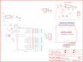

Contents
========

* [PRA795 > Adafruit](#pra795--adafruit)
	* [Schematic](#schematic)
	* [OOMP Parts](#oomp-parts)
	* [Images](#images)
	* [Tags](#tags)
  
![][im]
# PRA795 > Adafruit

- ID: PROJ-ADAF-795-STAN-01
- Hex ID: PRA795
- Name: Adafruit
- Description: Adafruit
- Long Link: [http://oom.lt/PROJ-ADAF-795-STAN-01](http://oom.lt/PROJ-ADAF-795-STAN-01)
- Long Link: [http://oom.lt/PRA795](http://oom.lt/PRA795)

## Schematic
  
![][schem]
## OOMP Parts
  

|OOMP Parts|
| :---: |
|C1,UNMATCHED-UNMATCHED-UNMATCHED-UNMATCHED-UNMATCHED,C1,0.1uF,C-US025-025X050,C025-025X050,CAPACITOR, American symbol,,|
|C2,UNMATCHED-UNMATCHED-UNMATCHED-UNMATCHED-UNMATCHED,C2,0.1uF,C-US025-025X050,C025-025X050,CAPACITOR, American symbol,,|
|C3,UNMATCHED-UNMATCHED-UNMATCHED-UNMATCHED-UNMATCHED,C3,10uF/25V,CPOL-USE2.5-6,E2,5-6,POLARIZED CAPACITOR, American symbol,,|
|C4,UNMATCHED-UNMATCHED-UNMATCHED-UNMATCHED-UNMATCHED,C4,100/6VuF,CPOL-USE2.5-6,E2,5-6,POLARIZED CAPACITOR, American symbol,,|
|C5,UNMATCHED-UNMATCHED-UNMATCHED-UNMATCHED-UNMATCHED,C5,0.1uF,C-US025-025X050,C025-025X050,CAPACITOR, American symbol,,|
|C6,UNMATCHED-UNMATCHED-UNMATCHED-UNMATCHED-UNMATCHED,C6,0.1uF,C-US025-025X050,C025-025X050,CAPACITOR, American symbol,,|
|C7,UNMATCHED-UNMATCHED-UNMATCHED-UNMATCHED-UNMATCHED,C7,100/6VuF,CPOL-USE2.5-6,E2,5-6,POLARIZED CAPACITOR, American symbol,,|
|D1,UNMATCHED-UNMATCHED-UNMATCHED-UNMATCHED-UNMATCHED,D1,1N4001,1N4004,DO41-10,DIODE,,|
|D2,UNMATCHED-UNMATCHED-UNMATCHED-UNMATCHED-UNMATCHED,D2,,LED3MM,LED3MM,LED,,|
|D3,UNMATCHED-UNMATCHED-UNMATCHED-UNMATCHED-UNMATCHED,D3,Green,LED3MM,LED3MM,LED,,|
|H1,UNMATCHED-UNMATCHED-UNMATCHED-UNMATCHED-UNMATCHED,H1,MOUNT-HOLE3.0,MOUNT-HOLE3.0,3,0,MOUNTING HOLE with drill center marker,,|
|H2,UNMATCHED-UNMATCHED-UNMATCHED-UNMATCHED-UNMATCHED,H2,MOUNT-HOLE3.0,MOUNT-HOLE3.0,3,0,MOUNTING HOLE with drill center marker,,|
|H3,UNMATCHED-UNMATCHED-UNMATCHED-UNMATCHED-UNMATCHED,H3,MOUNT-HOLE3.0,MOUNT-HOLE3.0,3,0,MOUNTING HOLE with drill center marker,,|
|H4,UNMATCHED-UNMATCHED-UNMATCHED-UNMATCHED-UNMATCHED,H4,MOUNT-HOLE3.0,MOUNT-HOLE3.0,3,0,MOUNTING HOLE with drill center marker,,|
|IC1,UNMATCHED-UNMATCHED-UNMATCHED-UNMATCHED-UNMATCHED,IC1,ATMEGA168P,ATMEGA168PROUND,DIL28/3,MICROCONTROLLER,,|
|IC2,UNMATCHED-UNMATCHED-UNMATCHED-UNMATCHED-UNMATCHED,IC2,,MCP1700INLINE,TO92-INLINE,VOLTAGE REGULATOR,,|
|IC3,UNMATCHED-UNMATCHED-UNMATCHED-UNMATCHED-UNMATCHED,IC3,7805T,7805T,TO220H,Positive VOLTAGE REGULATOR,,|
|J1,UNMATCHED-UNMATCHED-UNMATCHED-UNMATCHED-UNMATCHED,J1,2.1MMJACK,2.1MMJACK,PJ-102A,,,|
|JP1,UNMATCHED-UNMATCHED-UNMATCHED-UNMATCHED-UNMATCHED,JP1,,PINHD-1X6CB,1X06-CLEANBIG,PIN HEADER,,|
|JP2,UNMATCHED-UNMATCHED-UNMATCHED-UNMATCHED-UNMATCHED,JP2,,PINHD-1X6CB,1X06-CLEANBIG,PIN HEADER,,|
|JP3,UNMATCHED-UNMATCHED-UNMATCHED-UNMATCHED-UNMATCHED,JP3,,PINHD-2X3,2X03,PIN HEADER,,|
|JP4,UNMATCHED-UNMATCHED-UNMATCHED-UNMATCHED-UNMATCHED,JP4,,PINHD-1X8CLEANBIG,1X08-CLEANBIG,PIN HEADER,,|
|JP5,UNMATCHED-UNMATCHED-UNMATCHED-UNMATCHED-UNMATCHED,JP5,,PINHD-1X8CLEANBIG,1X08-CLEANBIG,PIN HEADER,,|
|JP7,UNMATCHED-UNMATCHED-UNMATCHED-UNMATCHED-UNMATCHED,JP7,,PINHD-1X6CLEAN,1X06-CLEAN,PIN HEADER,,|
|PWR_SEL,UNMATCHED-UNMATCHED-UNMATCHED-UNMATCHED-UNMATCHED,PWR_SEL,,PINHD-1X3,1X03,PIN HEADER,,|
|R1,UNMATCHED-UNMATCHED-UNMATCHED-UNMATCHED-UNMATCHED,R1,10K,R-US_0207/10,0207/10,RESISTOR, American symbol,,|
|R2,UNMATCHED-UNMATCHED-UNMATCHED-UNMATCHED-UNMATCHED,R2,1.0 K,R-US_0207/10,0207/10,RESISTOR, American symbol,,|
|R3,UNMATCHED-UNMATCHED-UNMATCHED-UNMATCHED-UNMATCHED,R3,1.0 K,R-US_0207/10,0207/10,RESISTOR, American symbol,,|
|S1,UNMATCHED-UNMATCHED-UNMATCHED-UNMATCHED-UNMATCHED,S1,RESET,10-XX,B3F-10XX,OMRON SWITCH,,|
|U$2,UNMATCHED-UNMATCHED-UNMATCHED-UNMATCHED-UNMATCHED,U$2,ARDUINO-NOHOLE,ARDUINO-NOHOLE,ARDUINO-NOHOLE,Arduino Diecimila/Duemilanove,,|
|X1,UNMATCHED-UNMATCHED-UNMATCHED-UNMATCHED-UNMATCHED,X1,16.00MHz,CERMOSCILL,CERM_OSC,,,|

## Images
  
  

|kicadPcb3d|kicadPcb3dFront|kicadPcb3dBack|eagleImage|eagleSchemImage|
| :---: | :---: | :---: | :---: | :---: |
||||||

## Tags

- hexID: PRA795
- oompType: PROJ
- oompSize: ADAF
- oompColor: 795
- oompDesc: STAN
- oompIndex: 01
- oompName: Adafruit Menta PCB
- sources: All source files from https://github.com/adafruit/Adafruit-Menta-PCB (source licence details in srcLicense.md)
- linkBuyPage: http://www.adafruit.com/products/795
- oompID: PROJ-ADAF-795-STAN-01
- oompParts: C1,UNMATCHED-UNMATCHED-UNMATCHED-UNMATCHED-UNMATCHED
- oompParts: C2,UNMATCHED-UNMATCHED-UNMATCHED-UNMATCHED-UNMATCHED
- oompParts: C3,UNMATCHED-UNMATCHED-UNMATCHED-UNMATCHED-UNMATCHED
- oompParts: C4,UNMATCHED-UNMATCHED-UNMATCHED-UNMATCHED-UNMATCHED
- oompParts: C5,UNMATCHED-UNMATCHED-UNMATCHED-UNMATCHED-UNMATCHED
- oompParts: C6,UNMATCHED-UNMATCHED-UNMATCHED-UNMATCHED-UNMATCHED
- oompParts: C7,UNMATCHED-UNMATCHED-UNMATCHED-UNMATCHED-UNMATCHED
- oompParts: D1,UNMATCHED-UNMATCHED-UNMATCHED-UNMATCHED-UNMATCHED
- oompParts: D2,UNMATCHED-UNMATCHED-UNMATCHED-UNMATCHED-UNMATCHED
- oompParts: D3,UNMATCHED-UNMATCHED-UNMATCHED-UNMATCHED-UNMATCHED
- oompParts: H1,UNMATCHED-UNMATCHED-UNMATCHED-UNMATCHED-UNMATCHED
- oompParts: H2,UNMATCHED-UNMATCHED-UNMATCHED-UNMATCHED-UNMATCHED
- oompParts: H3,UNMATCHED-UNMATCHED-UNMATCHED-UNMATCHED-UNMATCHED
- oompParts: H4,UNMATCHED-UNMATCHED-UNMATCHED-UNMATCHED-UNMATCHED
- oompParts: IC1,UNMATCHED-UNMATCHED-UNMATCHED-UNMATCHED-UNMATCHED
- oompParts: IC2,UNMATCHED-UNMATCHED-UNMATCHED-UNMATCHED-UNMATCHED
- oompParts: IC3,UNMATCHED-UNMATCHED-UNMATCHED-UNMATCHED-UNMATCHED
- oompParts: J1,UNMATCHED-UNMATCHED-UNMATCHED-UNMATCHED-UNMATCHED
- oompParts: JP1,UNMATCHED-UNMATCHED-UNMATCHED-UNMATCHED-UNMATCHED
- oompParts: JP2,UNMATCHED-UNMATCHED-UNMATCHED-UNMATCHED-UNMATCHED
- oompParts: JP3,UNMATCHED-UNMATCHED-UNMATCHED-UNMATCHED-UNMATCHED
- oompParts: JP4,UNMATCHED-UNMATCHED-UNMATCHED-UNMATCHED-UNMATCHED
- oompParts: JP5,UNMATCHED-UNMATCHED-UNMATCHED-UNMATCHED-UNMATCHED
- oompParts: JP7,UNMATCHED-UNMATCHED-UNMATCHED-UNMATCHED-UNMATCHED
- oompParts: PWR_SEL,UNMATCHED-UNMATCHED-UNMATCHED-UNMATCHED-UNMATCHED
- oompParts: R1,UNMATCHED-UNMATCHED-UNMATCHED-UNMATCHED-UNMATCHED
- oompParts: R2,UNMATCHED-UNMATCHED-UNMATCHED-UNMATCHED-UNMATCHED
- oompParts: R3,UNMATCHED-UNMATCHED-UNMATCHED-UNMATCHED-UNMATCHED
- oompParts: S1,UNMATCHED-UNMATCHED-UNMATCHED-UNMATCHED-UNMATCHED
- oompParts: U$2,UNMATCHED-UNMATCHED-UNMATCHED-UNMATCHED-UNMATCHED
- oompParts: X1,UNMATCHED-UNMATCHED-UNMATCHED-UNMATCHED-UNMATCHED
- rawParts: C1,0.1uF,C-US025-025X050,C025-025X050,CAPACITOR, American symbol,,
- rawParts: C2,0.1uF,C-US025-025X050,C025-025X050,CAPACITOR, American symbol,,
- rawParts: C3,10uF/25V,CPOL-USE2.5-6,E2,5-6,POLARIZED CAPACITOR, American symbol,,
- rawParts: C4,100/6VuF,CPOL-USE2.5-6,E2,5-6,POLARIZED CAPACITOR, American symbol,,
- rawParts: C5,0.1uF,C-US025-025X050,C025-025X050,CAPACITOR, American symbol,,
- rawParts: C6,0.1uF,C-US025-025X050,C025-025X050,CAPACITOR, American symbol,,
- rawParts: C7,100/6VuF,CPOL-USE2.5-6,E2,5-6,POLARIZED CAPACITOR, American symbol,,
- rawParts: D1,1N4001,1N4004,DO41-10,DIODE,,
- rawParts: D2,,LED3MM,LED3MM,LED,,
- rawParts: D3,Green,LED3MM,LED3MM,LED,,
- rawParts: H1,MOUNT-HOLE3.0,MOUNT-HOLE3.0,3,0,MOUNTING HOLE with drill center marker,,
- rawParts: H2,MOUNT-HOLE3.0,MOUNT-HOLE3.0,3,0,MOUNTING HOLE with drill center marker,,
- rawParts: H3,MOUNT-HOLE3.0,MOUNT-HOLE3.0,3,0,MOUNTING HOLE with drill center marker,,
- rawParts: H4,MOUNT-HOLE3.0,MOUNT-HOLE3.0,3,0,MOUNTING HOLE with drill center marker,,
- rawParts: IC1,ATMEGA168P,ATMEGA168PROUND,DIL28/3,MICROCONTROLLER,,
- rawParts: IC2,,MCP1700INLINE,TO92-INLINE,VOLTAGE REGULATOR,,
- rawParts: IC3,7805T,7805T,TO220H,Positive VOLTAGE REGULATOR,,
- rawParts: J1,2.1MMJACK,2.1MMJACK,PJ-102A,,,
- rawParts: JP1,,PINHD-1X6CB,1X06-CLEANBIG,PIN HEADER,,
- rawParts: JP2,,PINHD-1X6CB,1X06-CLEANBIG,PIN HEADER,,
- rawParts: JP3,,PINHD-2X3,2X03,PIN HEADER,,
- rawParts: JP4,,PINHD-1X8CLEANBIG,1X08-CLEANBIG,PIN HEADER,,
- rawParts: JP5,,PINHD-1X8CLEANBIG,1X08-CLEANBIG,PIN HEADER,,
- rawParts: JP7,,PINHD-1X6CLEAN,1X06-CLEAN,PIN HEADER,,
- rawParts: PWR_SEL,,PINHD-1X3,1X03,PIN HEADER,,
- rawParts: R1,10K,R-US_0207/10,0207/10,RESISTOR, American symbol,,
- rawParts: R2,1.0 K,R-US_0207/10,0207/10,RESISTOR, American symbol,,
- rawParts: R3,1.0 K,R-US_0207/10,0207/10,RESISTOR, American symbol,,
- rawParts: S1,RESET,10-XX,B3F-10XX,OMRON SWITCH,,
- rawParts: U$2,ARDUINO-NOHOLE,ARDUINO-NOHOLE,ARDUINO-NOHOLE,Arduino Diecimila/Duemilanove,,
- rawParts: X1,16.00MHz,CERMOSCILL,CERM_OSC,,,

[im]: kicadPcb3d_450.png
[schem]: eagleSchemImage.png
