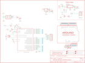

Contents
========

* [PRA795 > Adafruit Menta PCB](#pra795--adafruit-menta-pcb)
	* [Schematic](#schematic)
	* [PCB](#pcb)
	* [OOMP Parts](#oomp-parts)
	* [Images](#images)
	* [Tags](#tags)
  
![][im]
# PRA795 > Adafruit Menta PCB

- ID: PROJ-ADAF-795-STAN-01
- Hex ID: PRA795
- Name: Adafruit
- Description: Adafruit
- Long Link: [http://oom.lt/PROJ-ADAF-795-STAN-01](http://oom.lt/PROJ-ADAF-795-STAN-01)
- Short Link: [http://oom.lt/PRA795](http://oom.lt/PRA795)

## Schematic
  

## PCB
  

## OOMP Parts
  

|OOMP Parts|
| :---: |
|C1 C1,CAPX-UNMATCHED-X-UF1D-01|
|C2 C2,CAPX-UNMATCHED-X-UF1D-01|
|C3 C3,CAPX-UNMATCHED-X-UNMATCHED-01|
|C4 C4,CAPX-UNMATCHED-X-UNMATCHED-01|
|C5 C5,CAPX-UNMATCHED-X-UF1D-01|
|C6 C6,CAPX-UNMATCHED-X-UF1D-01|
|C7 C7,CAPX-UNMATCHED-X-UNMATCHED-01|
|D1 D1,DIOD-UNMATCHED-X-UNMATCHED-01|
|D2 D2,LEDS-UNMATCHED-G-STAN-01|
|D3 D3,LEDS-UNMATCHED-G-STAN-01|
|H1 H1,UNMATCHED-UNMATCHED-X-UNMATCHED-01|
|H2 H2,UNMATCHED-UNMATCHED-X-UNMATCHED-01|
|H3 H3,UNMATCHED-UNMATCHED-X-UNMATCHED-01|
|H4 H4,UNMATCHED-UNMATCHED-X-UNMATCHED-01|
|IC1 IC1,UNMATCHED-UNMATCHED-X-UNMATCHED-01|
|IC2 IC2,UNMATCHED-UNMATCHED-X-UNMATCHED-01|
|IC3 IC3,UNMATCHED-UNMATCHED-X-UNMATCHED-01|
|J1 J1,UNMATCHED-UNMATCHED-X-UNMATCHED-01|
|[JP1 HEAD-I01-X-PI06-01 2.54 mm 6 Pin Header](https://github.com/oomlout/oomlout_OOMP_parts/tree/main/HEAD-I01-X-PI06-01/)|
|[JP2 HEAD-I01-X-PI06-01 2.54 mm 6 Pin Header](https://github.com/oomlout/oomlout_OOMP_parts/tree/main/HEAD-I01-X-PI06-01/)|
|JP3 JP3,UNMATCHED-UNMATCHED-X-UNMATCHED-01|
|[JP4 HEAD-I01-X-PI08-01 2.54 mm 8 Pin Header](https://github.com/oomlout/oomlout_OOMP_parts/tree/main/HEAD-I01-X-PI08-01/)|
|[JP5 HEAD-I01-X-PI08-01 2.54 mm 8 Pin Header](https://github.com/oomlout/oomlout_OOMP_parts/tree/main/HEAD-I01-X-PI08-01/)|
|[JP7 HEAD-I01-X-PI06-01 2.54 mm 6 Pin Header](https://github.com/oomlout/oomlout_OOMP_parts/tree/main/HEAD-I01-X-PI06-01/)|
|PWR_SEL PWR_SEL,UNMATCHED-UNMATCHED-X-UNMATCHED-01|
|R1 R1,RESE-UNMATCHED-X-O103-01|
|R2 R2,RESE-UNMATCHED-X-UNMATCHED-01|
|R3 R3,RESE-UNMATCHED-X-UNMATCHED-01|
|S1 S1,UNMATCHED-UNMATCHED-X-UNMATCHED-01|
|U$2 U$2,UNMATCHED-UNMATCHED-X-UNMATCHED-01|
|X1 X1,UNMATCHED-UNMATCHED-X-UNMATCHED-01|

## Images
  
  

|kicadPcb3d|kicadPcb3dFront|kicadPcb3dBack|eagleImage|eagleSchemImage|
| :---: | :---: | :---: | :---: | :---: |
||||||

## Tags

- hexID: PRA795
- oompType: PROJ
- oompSize: ADAF
- oompColor: 795
- oompDesc: STAN
- oompIndex: 01
- oompName: Adafruit Menta PCB
- sources: All source files from https://github.com/adafruit/Adafruit-Menta-PCB (source licence details in srcLicense.md)
- linkBuyPage: http://www.adafruit.com/products/795
- oompID: PROJ-ADAF-795-STAN-01
- oompParts: C1,CAPX-UNMATCHED-X-UF1D-01
- oompParts: C2,CAPX-UNMATCHED-X-UF1D-01
- oompParts: C3,CAPX-UNMATCHED-X-UNMATCHED-01
- oompParts: C4,CAPX-UNMATCHED-X-UNMATCHED-01
- oompParts: C5,CAPX-UNMATCHED-X-UF1D-01
- oompParts: C6,CAPX-UNMATCHED-X-UF1D-01
- oompParts: C7,CAPX-UNMATCHED-X-UNMATCHED-01
- oompParts: D1,DIOD-UNMATCHED-X-UNMATCHED-01
- oompParts: D2,LEDS-UNMATCHED-G-STAN-01
- oompParts: D3,LEDS-UNMATCHED-G-STAN-01
- oompParts: H1,UNMATCHED-UNMATCHED-X-UNMATCHED-01
- oompParts: H2,UNMATCHED-UNMATCHED-X-UNMATCHED-01
- oompParts: H3,UNMATCHED-UNMATCHED-X-UNMATCHED-01
- oompParts: H4,UNMATCHED-UNMATCHED-X-UNMATCHED-01
- oompParts: IC1,UNMATCHED-UNMATCHED-X-UNMATCHED-01
- oompParts: IC2,UNMATCHED-UNMATCHED-X-UNMATCHED-01
- oompParts: IC3,UNMATCHED-UNMATCHED-X-UNMATCHED-01
- oompParts: J1,UNMATCHED-UNMATCHED-X-UNMATCHED-01
- oompParts: JP1,HEAD-I01-X-PI06-01
- oompParts: JP2,HEAD-I01-X-PI06-01
- oompParts: JP3,UNMATCHED-UNMATCHED-X-UNMATCHED-01
- oompParts: JP4,HEAD-I01-X-PI08-01
- oompParts: JP5,HEAD-I01-X-PI08-01
- oompParts: JP7,HEAD-I01-X-PI06-01
- oompParts: PWR_SEL,UNMATCHED-UNMATCHED-X-UNMATCHED-01
- oompParts: R1,RESE-UNMATCHED-X-O103-01
- oompParts: R2,RESE-UNMATCHED-X-UNMATCHED-01
- oompParts: R3,RESE-UNMATCHED-X-UNMATCHED-01
- oompParts: S1,UNMATCHED-UNMATCHED-X-UNMATCHED-01
- oompParts: U$2,UNMATCHED-UNMATCHED-X-UNMATCHED-01
- oompParts: X1,UNMATCHED-UNMATCHED-X-UNMATCHED-01
- rawParts: C1,0.1uF,C-US025-025X050,C025-025X050,CAPACITOR, American symbol,,
- rawParts: C2,0.1uF,C-US025-025X050,C025-025X050,CAPACITOR, American symbol,,
- rawParts: C3,10uF/25V,CPOL-USE2.5-6,E2,5-6,POLARIZED CAPACITOR, American symbol,,
- rawParts: C4,100/6VuF,CPOL-USE2.5-6,E2,5-6,POLARIZED CAPACITOR, American symbol,,
- rawParts: C5,0.1uF,C-US025-025X050,C025-025X050,CAPACITOR, American symbol,,
- rawParts: C6,0.1uF,C-US025-025X050,C025-025X050,CAPACITOR, American symbol,,
- rawParts: C7,100/6VuF,CPOL-USE2.5-6,E2,5-6,POLARIZED CAPACITOR, American symbol,,
- rawParts: D1,1N4001,1N4004,DO41-10,DIODE,,
- rawParts: D2,,LED3MM,LED3MM,LED,,
- rawParts: D3,Green,LED3MM,LED3MM,LED,,
- rawParts: H1,MOUNT-HOLE3.0,MOUNT-HOLE3.0,3,0,MOUNTING HOLE with drill center marker,,
- rawParts: H2,MOUNT-HOLE3.0,MOUNT-HOLE3.0,3,0,MOUNTING HOLE with drill center marker,,
- rawParts: H3,MOUNT-HOLE3.0,MOUNT-HOLE3.0,3,0,MOUNTING HOLE with drill center marker,,
- rawParts: H4,MOUNT-HOLE3.0,MOUNT-HOLE3.0,3,0,MOUNTING HOLE with drill center marker,,
- rawParts: IC1,ATMEGA168P,ATMEGA168PROUND,DIL28/3,MICROCONTROLLER,,
- rawParts: IC2,,MCP1700INLINE,TO92-INLINE,VOLTAGE REGULATOR,,
- rawParts: IC3,7805T,7805T,TO220H,Positive VOLTAGE REGULATOR,,
- rawParts: J1,2.1MMJACK,2.1MMJACK,PJ-102A,,,
- rawParts: JP1,,PINHD-1X6CB,1X06-CLEANBIG,PIN HEADER,,
- rawParts: JP2,,PINHD-1X6CB,1X06-CLEANBIG,PIN HEADER,,
- rawParts: JP3,,PINHD-2X3,2X03,PIN HEADER,,
- rawParts: JP4,,PINHD-1X8CLEANBIG,1X08-CLEANBIG,PIN HEADER,,
- rawParts: JP5,,PINHD-1X8CLEANBIG,1X08-CLEANBIG,PIN HEADER,,
- rawParts: JP7,,PINHD-1X6CLEAN,1X06-CLEAN,PIN HEADER,,
- rawParts: PWR_SEL,,PINHD-1X3,1X03,PIN HEADER,,
- rawParts: R1,10K,R-US_0207/10,0207/10,RESISTOR, American symbol,,
- rawParts: R2,1.0 K,R-US_0207/10,0207/10,RESISTOR, American symbol,,
- rawParts: R3,1.0 K,R-US_0207/10,0207/10,RESISTOR, American symbol,,
- rawParts: S1,RESET,10-XX,B3F-10XX,OMRON SWITCH,,
- rawParts: U$2,ARDUINO-NOHOLE,ARDUINO-NOHOLE,ARDUINO-NOHOLE,Arduino Diecimila/Duemilanove,,
- rawParts: X1,16.00MHz,CERMOSCILL,CERM_OSC,,,

[im]: kicadPcb3d_450.png
